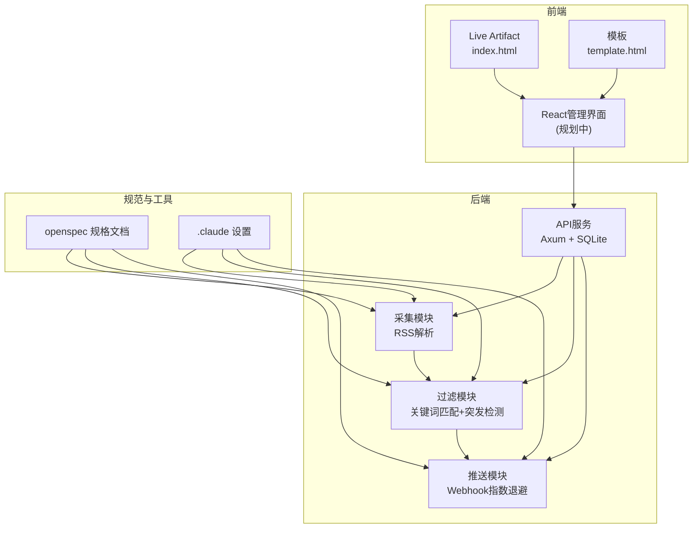
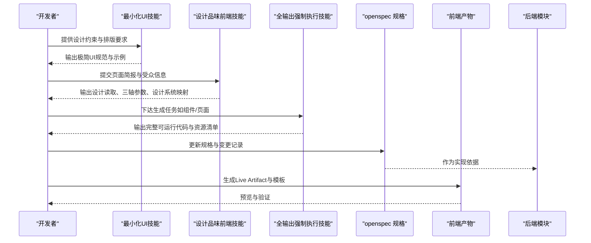
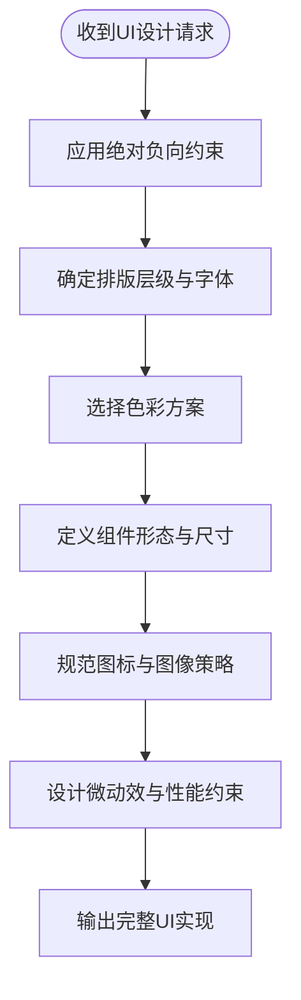
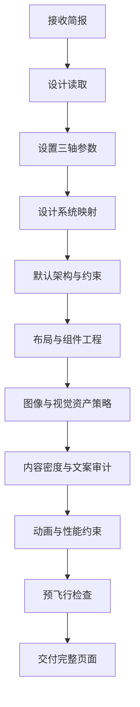
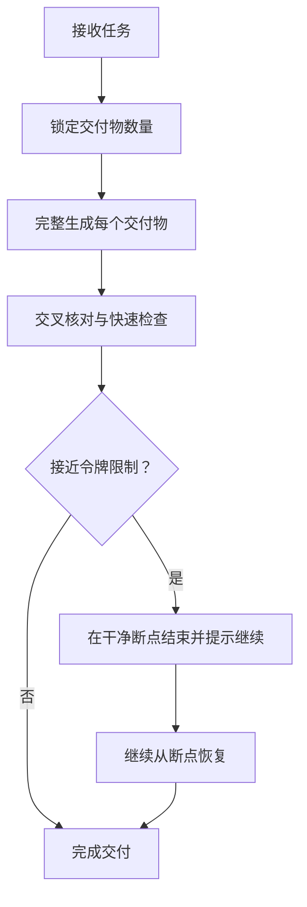
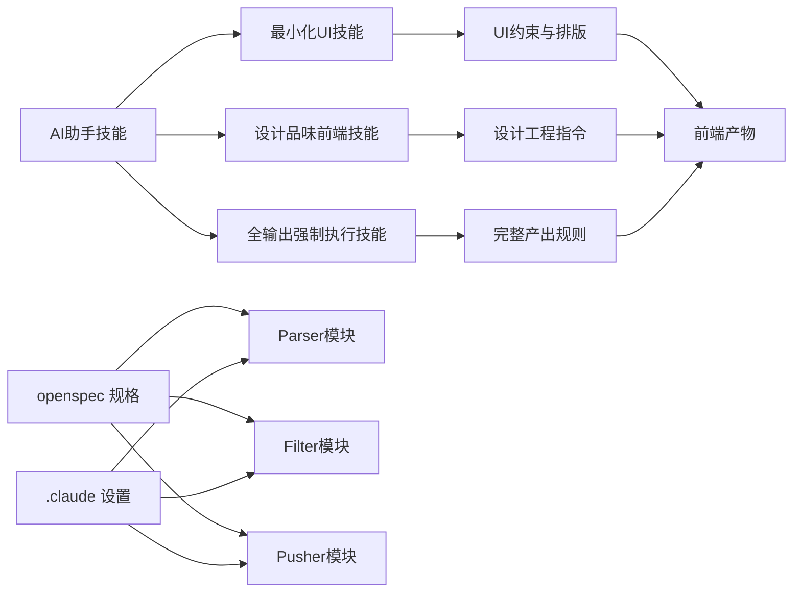

# AI助手技能

<cite>
**本文引用的文件**
- [README.md](file://README.md)
- [CLAUDE.md](file://CLAUDE.md)
- [.agents\skills\minimalist-ui\SKILL.md](file://.agents\skills\minimalist-ui\SKILL.md)
- [.agents\skills\design-taste-frontend\SKILL.md](file://.agents\skills\design-taste-frontend\SKILL.md)
- [.agents\skills\full-output-enforcement\SKILL.md](file://.agents\skills\full-output-enforcement\SKILL.md)
- [.claude\settings.json](file://.claude\settings.json)
- [.claude\settings.local.json](file://.claude\settings.local.json)
- [openspec\config.yaml](file://openspec\config.yaml)
- [Cargo.toml](file://Cargo.toml)
- [config.toml](file://config.toml)
- [docs\Live-Artifact\index.html](file://docs\Live-Artifact\index.html)
- [docs\Live-Artifact\template.html](file://docs\Live-Artifact\template.html)
</cite>

## 目录
1. [引言](#引言)
2. [项目结构](#项目结构)
3. [核心组件](#核心组件)
4. [架构总览](#架构总览)
5. [详细组件分析](#详细组件分析)
6. [依赖分析](#依赖分析)
7. [性能考虑](#性能考虑)
8. [故障排除指南](#故障排除指南)
9. [结论](#结论)
10. [附录](#附录)

## 引言
本文件面向AI趋势监控系统的AI助手技能，系统性阐述三大核心技能的设计理念、应用场景、功能特性与配置要点，并解释AI助手在系统中的价值定位（代码生成、文档编写、问题解答）。同时提供最佳实践与效果评估方法，以及扩展与定制技能的建议，帮助团队高效、高质量地交付前端界面与后端能力。

## 项目结构
系统采用“管道模式”的后台模块化架构，结合规范驱动（openspec）与前端可视化产物，形成从设计到实现再到交付的闭环。前端界面以静态模板与Live Artifact形式呈现，便于快速迭代与演示。

图表来源
- [README.md:17-23](file://README.md#L17-L23)
- [CLAUDE.md:10-25](file://CLAUDE.md#L10-L25)
- [docs\Live-Artifact\index.html](file://docs\Live-Artifact\index.html)
- [docs\Live-Artifact\template.html](file://docs\Live-Artifact\template.html)

章节来源
- [README.md:5-257](file://README.md#L5-L257)
- [CLAUDE.md:5-85](file://CLAUDE.md#L5-L85)

## 核心组件
本节聚焦三大AI助手技能：最小化UI设计技能、设计品味前端技能、全输出强制执行技能。它们分别负责“视觉语言与约束”、“设计推演与工程落地”、“完整产出与一致性保障”。

- 最小化UI设计技能：提供高对比度、温暖单色、排版层次、扁平bento网格等严格约束，拒绝通用SaaS风格，强调“编辑器式”极简美学。
- 设计品味前端技能：以“读取简报→推断设计方向→三轴调参→设计系统映射→工程约束”的流程，确保产出既符合品牌与受众，又具备工程可落地性。
- 全输出强制执行技能：禁止截断、占位与省略，确保每次任务都产出完整、可运行、可交付的成果。

章节来源
- [.agents\skills\minimalist-ui\SKILL.md:6-86](file://.agents\skills\minimalist-ui\SKILL.md#L6-L86)
- [.agents\skills\design-taste-frontend\SKILL.md:6-1207](file://.agents\skills\design-taste-frontend\SKILL.md#L6-L1207)
- [.agents\skills\full-output-enforcement\SKILL.md:6-50](file://.agents\skills\full-output-enforcement\SKILL.md#L6-L50)

## 架构总览
AI助手技能与系统各模块的协作关系如下：

图表来源
- [.agents\skills\minimalist-ui\SKILL.md:77-86](file://.agents\skills\minimalist-ui\SKILL.md#L77-L86)
- [.agents\skills\design-taste-frontend\SKILL.md:13-41](file://.agents\skills\design-taste-frontend\SKILL.md#L13-L41)
- [.agents\skills\full-output-enforcement\SKILL.md:22-27](file://.agents\skills\full-output-enforcement\SKILL.md#L22-L27)

## 详细组件分析

### 最小化UI设计技能
设计理念与约束
- 绝对负向约束：明确禁止的元素与风格，避免落入通用SaaS模板陷阱。
- 排版架构：强调极致对比与优质字体选择，建立“编辑器式”气质。
- 色彩体系：以温暖单色为主，辅以高度降饱和的柔和色点缀，强调语义与克制。
- 组件规范：bento网格、扁平化组件、精确边框与留白；按钮、标签、手柄等微交互有明确形态。
- 图标与图像：系统图标与单色插画，摄影偏暖色调并适度融合。
- 微动效：隐形但精致的入场、悬停与交错呈现，追求静默高级感。

应用场景
- 仪表盘与数据展示页：强调信息密度与可读性，避免花哨装饰。
- 博客与编辑类站点：突出内容本身，减少界面噪音。
- 企业内部工具：以清晰结构与高对比度提升可用性。

关键配置与参数
- 字体族与字号：正文、标题、等宽字体的家族与用法。
- 色板：背景、卡片、边框、强调色的十六进制与文本色。
- 组件尺寸：卡片边框、圆角、内边距、按钮尺寸与状态。
- 动效参数：入场缓动曲线、延迟策略、性能约束。

图表来源
- [.agents\skills\minimalist-ui\SKILL.md:12-86](file://.agents\skills\minimalist-ui\SKILL.md#L12-L86)

章节来源
- [.agents\skills\minimalist-ui\SKILL.md:8-86](file://.agents\skills\minimalist-ui\SKILL.md#L8-L86)

### 设计品味前端技能
设计读取与三轴调参
- 设计读取：综合页面类型、语气词、参考信号、受众、既有品牌资产与静默约束，得出一句话的“设计读取”。
- 三轴调参：在“变化度（Variance）/运动强度（Motion）/视觉密度（Density）”上给出基线与预设，支持根据用例调整。
- 设计系统映射：当简报指向官方设计系统时，优先使用官方包；否则采用原生CSS + Tailwind + 维护良好的组件库。

默认架构与工程约束
- 框架与样式：React/Next.js（默认服务端组件）、Tailwind v4、Motion动画库、next/font自托管字体。
- 状态管理：局部useState/useReducer；全局状态仅用于深度属性钻取，避免在渲染周期高频更新。
- 图标与表情：优先Phosphor、Radix等，禁止手绘SVG图标；默认禁用表情符号。
- 响应式与布局：标准化断点、容器宽度、视口稳定性；网格优于复杂flex百分比计算。
- 依赖校验：导入第三方库前必须检查package.json。

设计工程指令与反默认纪律
- 排版：显示/标题默认字号与字距；避免默认使用Inter；Serif仅在确有品牌依据时使用。
- 色彩：限制单一强调色、避免AI紫/蓝光晕；冷/暖奢侈品配色轮换；保持页面色彩一致性。
- 布局：反中心倾向，采用“左右分屏/异步留白”；卡片仅在能体现层级时使用；形状一致性锁定。
- 交互：加载骨架、空态、错误态、触觉反馈、按钮对比度、CTA标签长度、表单对比度。
- 数据与表单：标签在上、辅助文本可选、错误在下；避免占位符当标签。
- 页面硬规则：英雄首屏可见、导航单行、bento网格节奏、Section布局不重复、Zigzag交替上限、Eyebrow节制、Split-header禁用、Bento背景多样性、移动端折叠显式声明。

内容密度与文案审计
- 内容密度：首页第一印象优先，短标题+短副标题+一个视觉资产或CTA；长列表改用卡片网格、手风琴、横向滚动等。
- 文案审计：语法、指代、AI式巧言、假精确数字、复制粘贴的“注册表”一致性。
- 引用与致谢：最多三行引用；出处简洁；避免em-dash作为分隔符。

动画与性能
- 动画模式：静态/流体CSS/高级编排；任何高于阈值的动画必须尊重“减少动态”偏好。
- 性能：仅变换与透明度；固定噪声层仅用于fixed且不可拾取层；控制bundle大小与LCP/INP/CLS目标。

图表来源
- [.agents\skills\design-taste-frontend\SKILL.md:13-41](file://.agents\skills\design-taste-frontend\SKILL.md#L13-L41)
- [.agents\skills\design-taste-frontend\SKILL.md:43-1207](file://.agents\skills\design-taste-frontend\SKILL.md#L43-L1207)

章节来源
- [.agents\skills\design-taste-frontend\SKILL.md:6-1207](file://.agents\skills\design-taste-frontend\SKILL.md#L6-L1207)

### 全输出强制执行技能
核心原则
- 每个任务视为生产级，不允许部分产出；用户要一个文件就给完整文件，要五个组件就给五个组件。
- 禁止占位符、省略号、TODO、省略模式等；禁止“我可提供更多细节”等结构性省略。

执行流程
- Scope：完整理解请求，锁定交付物数量。
- Build：逐项完整生成，不提供草稿或“可扩展”版本。
- Cross-check：最终核对与原始请求一致，确保无遗漏。

长输出处理
- 接近令牌限制时，不在剩余部分做压缩；在干净断点处结束；提示“继续”指令以恢复。
- 继续时从断点精确恢复，不复述。

快速检查清单
- 不含被禁模式；每项请求均完成；代码块包含可运行代码；无任何缩短。

图表来源
- [.agents\skills\full-output-enforcement\SKILL.md:22-50](file://.agents\skills\full-output-enforcement\SKILL.md#L22-L50)

章节来源
- [.agents\skills\full-output-enforcement\SKILL.md:6-50](file://.agents\skills\full-output-enforcement\SKILL.md#L6-L50)

## 依赖分析
AI助手技能与系统其他组件的耦合关系如下：

图表来源
- [.agents\skills\minimalist-ui\SKILL.md:77-86](file://.agents\skills\minimalist-ui\SKILL.md#L77-L86)
- [.agents\skills\design-taste-frontend\SKILL.md:122-160](file://.agents\skills\design-taste-frontend\SKILL.md#L122-L160)
- [.agents\skills\full-output-enforcement\SKILL.md:22-27](file://.agents\skills\full-output-enforcement\SKILL.md#L22-L27)
- [openspec\config.yaml:1-21](file://openspec\config.yaml#L1-L21)
- [.claude\settings.json:1-18](file://.claude\settings.json#L1-L18)
- [.claude\settings.local.json:1-16](file://.claude\settings.local.json#L1-L16)

章节来源
- [openspec\config.yaml:1-21](file://openspec\config.yaml#L1-L21)
- [.claude\settings.json:1-18](file://.claude\settings.json#L1-L18)
- [.claude\settings.local.json:1-16](file://.claude\settings.local.json#L1-L16)

## 性能考虑
- 动画性能：仅使用transform与opacity；在Motion中使用useReducedMotion；在CSS中使用媒体查询适配减少动态。
- 图像与字体：Hero图片使用优先加载或预加载；字体使用next/font自托管，避免Google Fonts链路。
- 布局稳定性：使用viewport稳定方案，避免h-screen导致的iOS Safari地址栏跳变。
- 依赖体积：按需懒加载非首屏资源；避免在静态内容上滥用layout动画。

## 故障排除指南
常见问题与对策
- 产出被截断或出现省略：启用全输出强制执行技能，确保完整交付。
- 设计风格与品牌不符：使用设计品味前端技能进行“设计读取”，明确受众与品牌资产，再映射到合适的设计系统。
- UI不符合极简约束：启用最小化UI技能，严格遵循排版、色彩与组件规范。
- 动画卡顿或违反减少动态：检查是否使用window.scroll监听、layout动画滥用、z-index滥用，按性能守则修正。

章节来源
- [.agents\skills\full-output-enforcement\SKILL.md:12-21](file://.agents\skills\full-output-enforcement\SKILL.md#L12-L21)
- [.agents\skills\design-taste-frontend\SKILL.md:519-550](file://.agents\skills\design-taste-frontend\SKILL.md#L519-L550)
- [.agents\skills\minimalist-ui\SKILL.md:69-76](file://.agents\skills\minimalist-ui\SKILL.md#L69-L76)

## 结论
三大AI助手技能分别从“视觉语言”“设计推演”“完整产出”三个维度，为AI趋势监控系统的前端与后端开发提供系统化支撑。通过严格的约束、可落地的设计流程与完整的交付保障，AI助手能够显著提升团队的产出质量与效率，降低沟通成本与返工风险。

## 附录
- 前端Live Artifact与模板
  - Live Artifact入口：docs/Live-Artifact/index.html
  - 模板：docs/Live-Artifact/template.html
- 配置与权限
  - 项目配置：config.toml
  - 开发规则与权限：.claude/settings.json、.claude/settings.local.json
  - 规范驱动配置：openspec/config.yaml
- 技术栈与依赖
  - 后端技术栈：Axum、SQLite、sqlx、feed-rs、Aho-Corasick、reqwest、clap等
  - 依赖清单：Cargo.toml

章节来源
- [docs\Live-Artifact\index.html](file://docs\Live-Artifact\index.html)
- [docs\Live-Artifact\template.html](file://docs\Live-Artifact\template.html)
- [config.toml:1-27](file://config.toml#L1-L27)
- [.claude\settings.json:1-18](file://.claude\settings.json#L1-L18)
- [.claude\settings.local.json:1-16](file://.claude\settings.local.json#L1-L16)
- [openspec\config.yaml:1-21](file://openspec\config.yaml#L1-L21)
- [Cargo.toml:1-44](file://Cargo.toml#L1-L44)