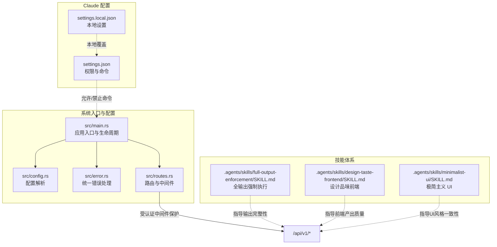
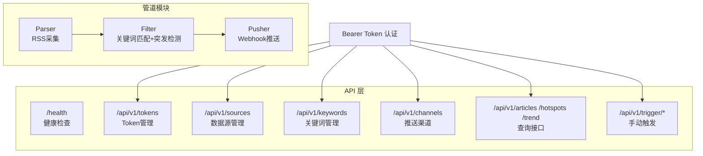
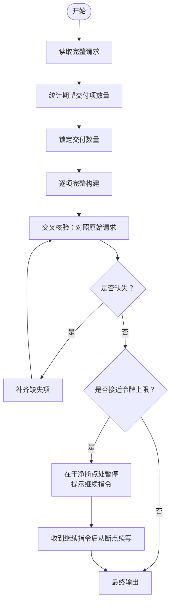
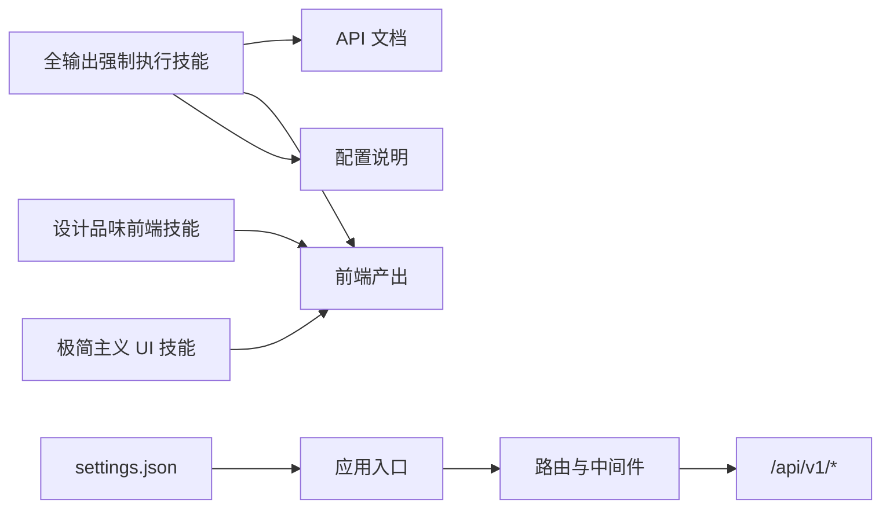

# 全输出强制执行技能

<cite>
**本文引用的文件**
- [SKILL.md](file://.agents\skills\full-output-enforcement\SKILL.md)
- [设计品味前端技能 SKILL.md](file://.agents\skills\design-taste-frontend\SKILL.md)
- [极简主义 UI 技能 SKILL.md](file://.agents\skills\minimalist-ui\SKILL.md)
- [README.md](file://README.md)
- [CLAUDE.md](file://CLAUDE.md)
- [settings.json](file://.claude\settings.json)
- [settings.local.json](file://.claude\settings.local.json)
- [main.rs](file://src\main.rs)
- [config.rs](file://src\config.rs)
- [error.rs](file://src\error.rs)
- [routes.rs](file://src\routes.rs)
</cite>

## 目录
1. [简介](#简介)
2. [项目结构](#项目结构)
3. [核心组件](#核心组件)
4. [架构总览](#架构总览)
5. [详细组件分析](#详细组件分析)
6. [依赖关系分析](#依赖关系分析)
7. [性能考量](#性能考量)
8. [故障排查指南](#故障排查指南)
9. [结论](#结论)
10. [附录](#附录)

## 简介
本技能旨在确保AI助手在处理各类任务时提供完整、详尽、无遗漏的输出，杜绝“半成品”“占位符”“省略号”等不完整内容。其核心原则是：将每个任务视为生产级交付，不允许以“简洁”为名牺牲完整性；当用户要求生成若干组件或文件时，必须完整交付全部项，不得以“可扩展”“后续补充”等理由打折扣。

该技能特别适用于AI趋势监控系统中的技术文档、API说明、配置指南等需要严谨性和可追溯性的场景。它通过“范围锁定—完整构建—交叉核验”的三步流程，结合对长输出的“干净断点”与“继续指令”机制，确保在接近令牌上限时也能保持高质量输出的完整性。

## 项目结构
本仓库是一个基于Rust的AI热点监控系统，采用管道模式（Parser → Filter → Pusher），并通过Axum提供REST API。技能体系位于“.agents/skills”目录下，包含多个面向不同目标的技能文件，其中“全输出强制执行”作为通用性最强的输出质量保障技能，贯穿于系统各模块的文档与交互中。

**图表来源**
- [main.rs:63-96](file://src\main.rs#L63-L96)
- [config.rs:52-59](file://src\config.rs#L52-L59)
- [error.rs:23-50](file://src\error.rs#L23-L50)
- [routes.rs:14-67](file://src\routes.rs#L14-L67)
- [SKILL.md:1-50](file://.agents\skills\full-output-enforcement\SKILL.md#L1-L50)
- [设计品味前端技能 SKILL.md:1-1207](file://.agents\skills\design-taste-frontend\SKILL.md#L1-L1207)
- [极简主义 UI 技能 SKILL.md:1-86](file://.agents\skills\minimalist-ui\SKILL.md#L1-L86)
- [settings.json:1-21](file://.claude\settings.json#L1-L21)

**章节来源**
- [README.md:1-293](file://README.md#L1-L293)
- [CLAUDE.md:1-85](file://CLAUDE.md#L1-L85)
- [main.rs:1-96](file://src\main.rs#L1-L96)
- [config.rs:1-59](file://src\config.rs#L1-L59)
- [error.rs:1-79](file://src\error.rs#L1-L79)
- [routes.rs:1-67](file://src\routes.rs#L1-L67)

## 核心组件
- 全输出强制执行技能：定义“禁止模式”“执行流程”“长输出处理”“快速检查”等规则，确保输出完整、可运行、无占位符。
- 设计品味前端技能：面向前端页面生成，强调“设计推断—三轴调参—系统映射—工程约束”，保证产出既美观又可落地。
- 极简主义 UI 技能：提供“温暖单色+版式对比+扁平网格+柔和彩点缀”的UI协议，拒绝通用SaaS风格，强调克制与专业感。
- 系统路由与中间件：统一暴露REST API，除健康检查外均需Bearer Token认证，确保输出访问安全可控。

上述组件共同构成“输入意图→技能约束→系统接口→完整输出”的闭环，使AI助手在生成代码、文档、配置说明时始终遵循“完整优先”的原则。

**章节来源**
- [SKILL.md:1-50](file://.agents\skills\full-output-enforcement\SKILL.md#L1-L50)
- [设计品味前端技能 SKILL.md:1-1207](file://.agents\skills\design-taste-frontend\SKILL.md#L1-L1207)
- [极简主义 UI 技能 SKILL.md:1-86](file://.agents\skills\minimalist-ui\SKILL.md#L1-L86)
- [routes.rs:14-67](file://src\routes.rs#L14-L67)

## 架构总览
系统采用“管道模式”分模块运行，同时提供REST API用于外部集成与控制。全输出强制执行技能并不直接参与后端逻辑，而是作为“提示工程与输出治理”的策略，贯穿于API文档、前端产出、配置说明等场景中，确保每次交互都满足“完整、可运行、无占位符”的质量标准。

**图表来源**
- [README.md:7-23](file://README.md#L7-L23)
- [routes.rs:20-50](file://src\routes.rs#L20-L50)
- [CLAUDE.md:10-25](file://CLAUDE.md#L10-L25)

## 详细组件分析

### 全输出强制执行技能（核心机制）
- 禁止模式清单：明确禁止在代码块与正文出现的占位符与省略模式，如“// ...”“// rest of code”“// implement here”“// TODO”“bare ...”“I can provide more details if needed”等，一旦出现即视为硬失败。
- 执行流程三步法：
  1) 范围锁定：完整阅读请求，统计用户期望的交付项数量（文件/函数/章节/答案），并固定该数量。
  2) 完整构建：逐项生成完整实现，不提供草稿或“可扩展”版本。
  3) 交叉核验：输出前回看原始请求，比对交付数量，如有缺失立即补齐。
- 长输出处理：接近令牌上限时，不压缩剩余部分，不跳过结论，而是在“干净断点”处暂停（函数末尾、文件末尾、章节末尾），提示“继续指令”，再次回复时从断点精确续写，不复述。
- 快速检查清单：最终输出前必须自检，确保无任何被禁模式、完整覆盖请求项、代码块为可运行而非描述性文字、无任何“为节省空间而缩短”的内容。

**图表来源**
- [SKILL.md:22-50](file://.agents\skills\full-output-enforcement\SKILL.md#L22-L50)

**章节来源**
- [SKILL.md:1-50](file://.agents\skills\full-output-enforcement\SKILL.md#L1-L50)

### 设计品味前端技能（与全输出的关系）
- 设计推断：先读取简报，推理页面类型、受众、品牌资产与约束，再声明“设计读取”，避免默认美学。
- 三轴调参：在“设计方差/运动强度/视觉密度”上给出基线与预设，确保布局与动效与简报一致。
- 系统映射：根据简报选择官方设计系统或真实组件库，避免手写替代。
- 工程约束：严格遵守布局、色彩、排版、可访问性与性能守则，输出前进行“预飞行检查”。

该技能与全输出强制执行技能互补：前者确保“外观与体验完整”，后者确保“功能与文档完整”。两者结合可避免“看起来完整但缺少实现细节”的情况。

**章节来源**
- [设计品味前端技能 SKILL.md:1-1207](file://.agents\skills\design-taste-frontend\SKILL.md#L1-L1207)

### 极简主义 UI 技能（风格与完整性的平衡）
- 绝对负面约束：禁止通用默认风格（字体、图标库、阴影、渐变、圆角、表情符号、AI文案套路），强调“克制与专业”。
- 版式与色彩：温暖单色画布、高对比排版、扁平网格、柔和彩点缀，追求“文档式界面”的清晰与稳定。
- 动效与性能：强调“隐形动效”，动画仅限transform与opacity，避免滚动监听与布局触发属性。

该技能体现“完整性与可用性并重”的理念：在保证信息完整的同时，通过严格的风格约束提升可读性与一致性。

**章节来源**
- [极简主义 UI 技能 SKILL.md:1-86](file://.agents\skills\minimalist-ui\SKILL.md#L1-L86)

### 系统路由与认证（输出访问的边界）
- 路由组织：统一在/api/v1下提供Token管理、数据源、关键词、渠道、查询与触发接口；/health为公开健康检查。
- 认证策略：除/health外，所有/api/v1/*均需Bearer Token认证，中间件负责提取、校验、过期检查与上下文注入。
- 错误与响应：统一错误格式与状态码，成功响应包裹"data"字段；支持204无内容。

该边界确保“输出质量”与“访问安全”双轨并行：技能保证输出完整性，认证与路由层保证访问可控。

**章节来源**
- [routes.rs:14-67](file://src\routes.rs#L14-L67)
- [error.rs:23-50](file://src\error.rs#L23-L50)

## 依赖关系分析
- 技能与系统模块的耦合：
  - 全输出强制执行技能与系统API文档、前端产出、配置说明存在间接耦合：通过统一的“输出规范”约束，确保各模块产物满足“完整、可运行、无占位符”的质量标准。
  - 设计品味前端技能与极简主义UI技能在“输出风格”上形成互补：前者关注“设计方向与实现”，后者关注“风格一致性与可用性”。
- 外部依赖与集成点：
  - Claude配置文件settings.json定义了允许/禁止的命令集合，为系统提供了可执行的外部集成能力（如HTTP调用、文件系统操作、OpenSpec工作流等），这些能力在技能约束下仍需遵循“完整输出”的原则。

**图表来源**
- [SKILL.md:1-50](file://.agents\skills\full-output-enforcement\SKILL.md#L1-L50)
- [设计品味前端技能 SKILL.md:1-1207](file://.agents\skills\design-taste-frontend\SKILL.md#L1-L1207)
- [极简主义 UI 技能 SKILL.md:1-86](file://.agents\skills\minimalist-ui\SKILL.md#L1-L86)
- [settings.json:1-21](file://.claude\settings.json#L1-L21)
- [main.rs:63-96](file://src\main.rs#L63-L96)
- [routes.rs:14-67](file://src\routes.rs#L14-L67)

**章节来源**
- [settings.json:1-21](file://.claude\settings.json#L1-L21)
- [main.rs:1-96](file://src\main.rs#L1-L96)
- [routes.rs:1-67](file://src\routes.rs#L1-L67)

## 性能考量
- 输出完整性与性能的平衡：全输出强制执行技能通过“干净断点”与“继续指令”机制，在接近令牌上限时避免压缩与截断，从而减少重复生成与修正成本，提高整体交付效率。
- 前端产出的性能与可访问性：设计品味前端技能与极简主义UI技能均强调硬件加速、减少DOM成本、尊重“减少动态”偏好与核心Web指标，有助于降低渲染开销与提升用户体验。
- 系统层面：管道模块的独立调度与指数退避推送机制，配合统一的错误与响应格式，有助于在高负载场景下维持稳定性与可观测性。

[本节为通用性能讨论，无需特定文件引用]

## 故障排查指南
- 常见问题与症状
  - 输出出现占位符或省略：违反“禁止模式”，应立即替换为完整实现。
  - 交付数量不足：未严格执行“范围锁定—交叉核验”，需回补缺失项。
  - 长输出被截断：未在“干净断点”处暂停并提示继续指令，导致信息丢失。
  - 前端产出风格不一致：未遵循设计推断与三轴调参，或未进行预飞行检查。
- 排查步骤
  - 使用“快速检查清单”逐项核验：禁用模式、交付数量、代码可运行性、有无缩短。
  - 在长输出场景中，确认是否在函数/文件/章节末尾暂停，并正确处理“继续指令”。
  - 对前端产出，对照设计读取、三轴调参与系统映射，完成预飞行检查。
- 相关参考
  - 全输出强制执行技能的“快速检查”与“长输出处理”条款。
  - 设计品味前端技能的“预飞行检查”与“布局纪律”。
  - 极简主义UI技能的“绝对负面约束”与“动效性能守则”。

**章节来源**
- [SKILL.md:43-50](file://.agents\skills\full-output-enforcement\SKILL.md#L43-L50)
- [设计品味前端技能 SKILL.md:234-261](file://.agents\skills\design-taste-frontend\SKILL.md#L234-L261)
- [极简主义 UI 技能 SKILL.md:69-76](file://.agents\skills\minimalist-ui\SKILL.md#L69-L76)

## 结论
全输出强制执行技能通过“禁止模式—执行流程—长输出处理—快速检查”的闭环，有效提升了AI助手在生成代码、文档与配置说明时的信息完整性与可运行性。在AI趋势监控系统中，它与设计品味前端技能、极简主义UI技能协同工作，既保证了功能实现的完整性，也确保了界面与文档的风格一致性与可用性。结合系统统一的认证与路由机制，该技能为高质量、可追溯的交付提供了坚实保障。

[本节为总结性内容，无需特定文件引用]

## 附录

### 使用场景与应用示例
- 代码生成：要求生成若干组件或文件时，必须完整输出全部项，不得以“后续补充”为由省略。
- 文档编写：API说明、配置指南、变更记录等，必须覆盖所有字段、示例与注意事项，避免省略号与占位符。
- 问题解答：针对复杂问题，必须提供完整的背景、步骤、边界条件与结论，不得以“大致流程”代替具体实现。

[本节为概念性说明，无需特定文件引用]

### 配置选项与触发条件
- 技能配置：通过技能文件中的规则与流程进行配置，无需额外系统配置项。
- 触发条件：适用于所有需要“完整、可运行、无占位符”输出的任务；在长输出场景中，系统需支持“继续指令”以实现断点续写。

[本节为概念性说明，无需特定文件引用]