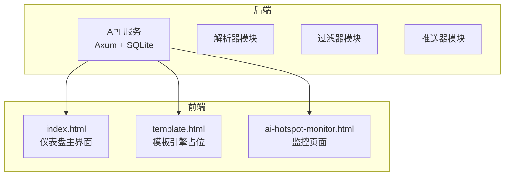
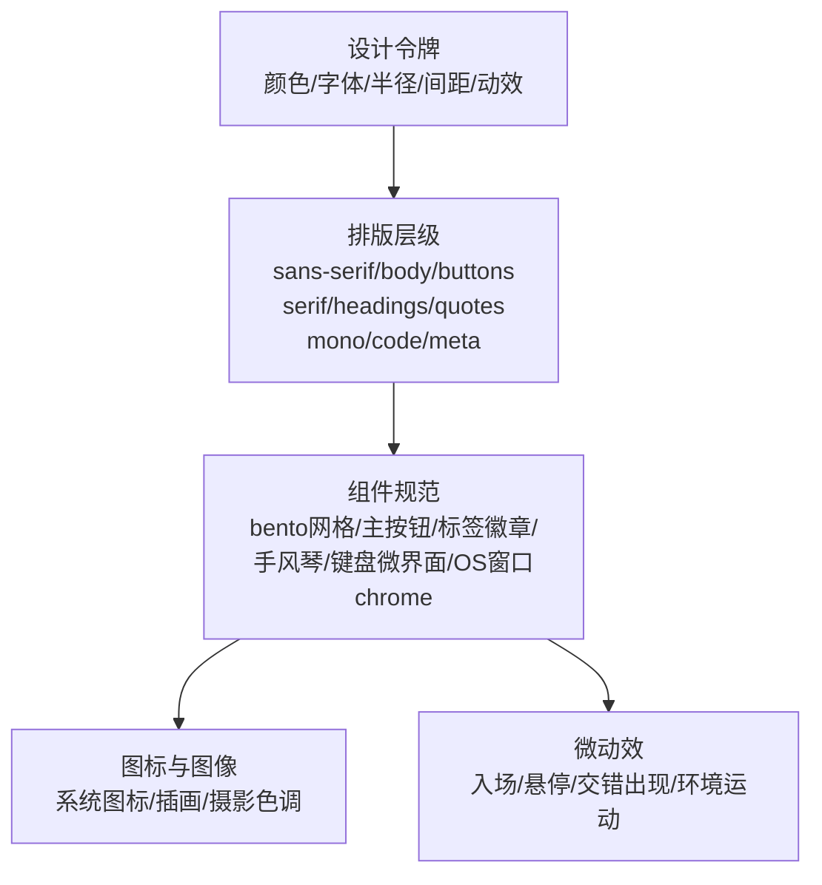
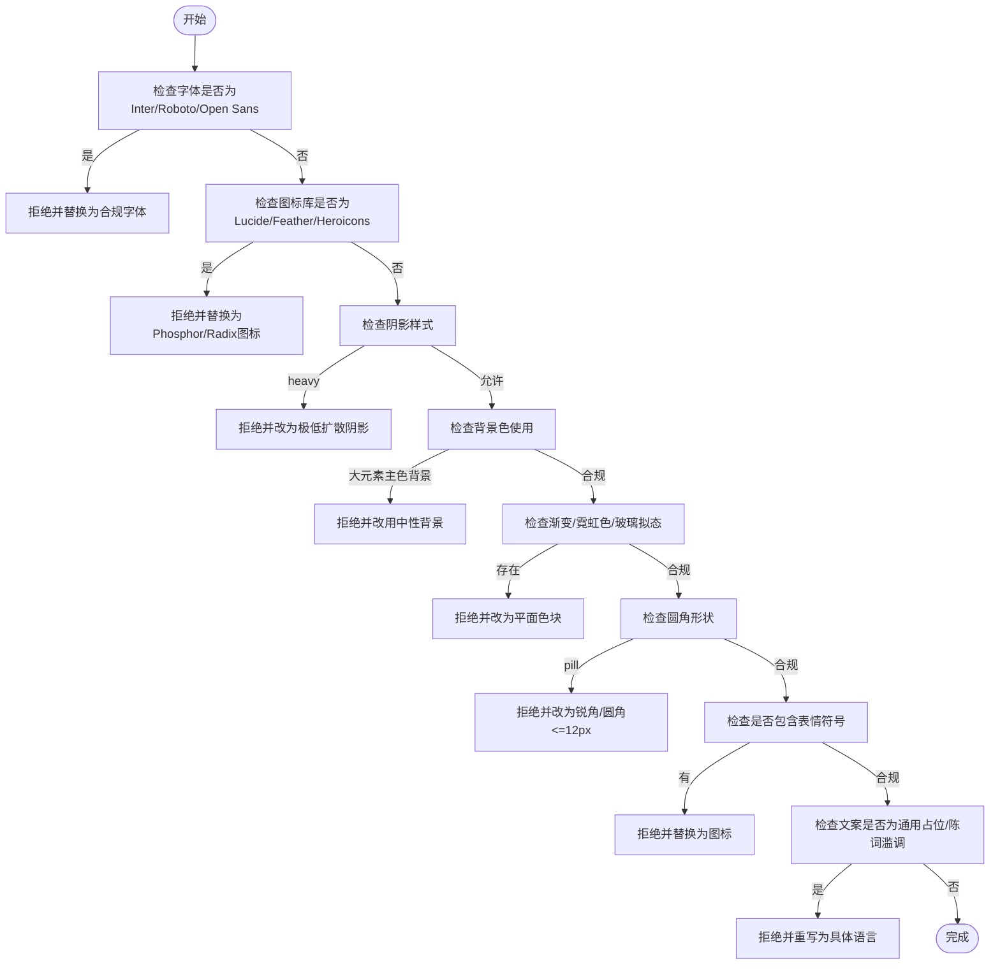
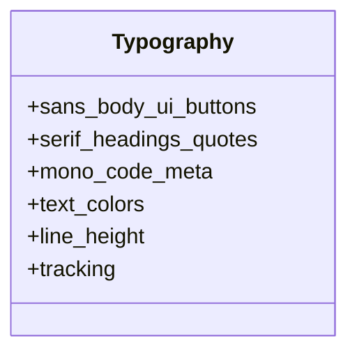
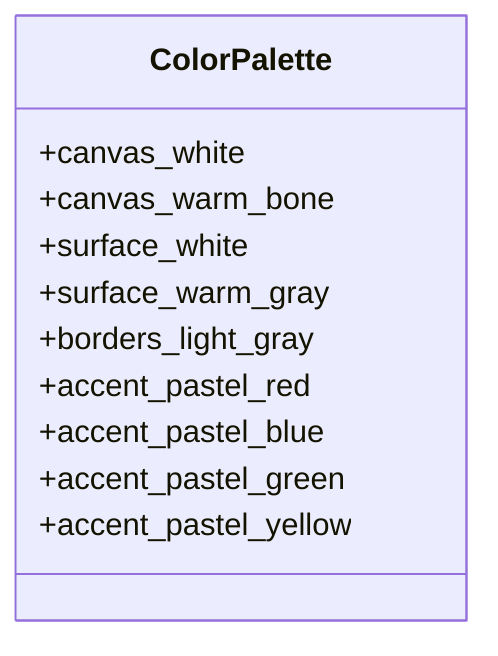
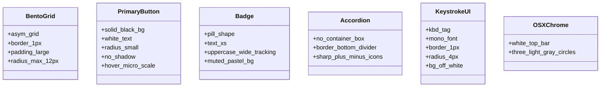
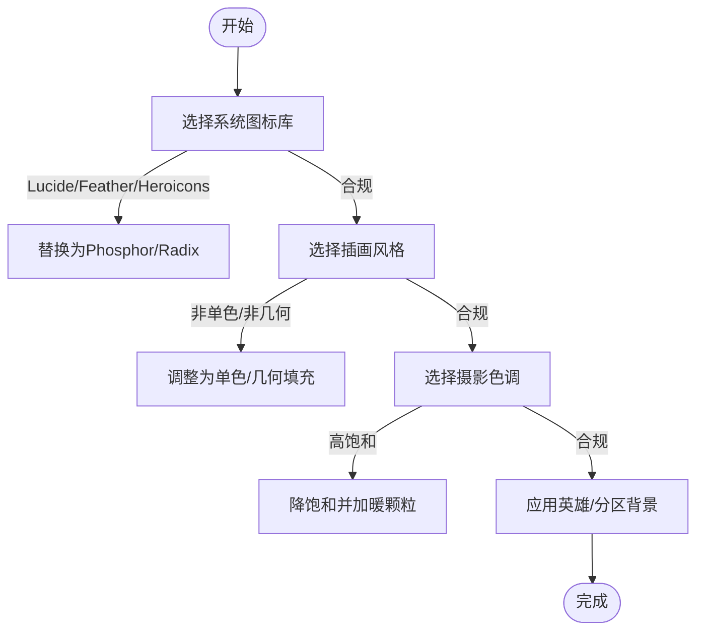
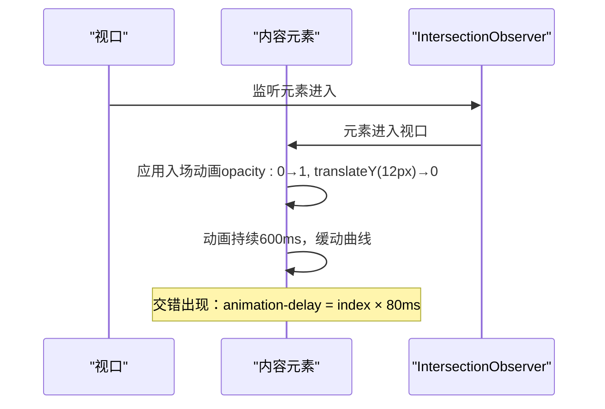
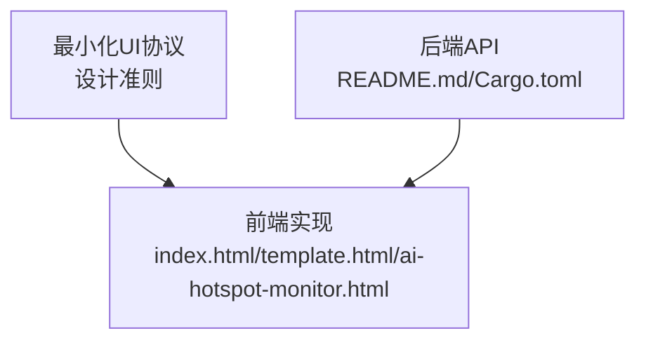

# 最小化UI设计技能

<cite>
**本文档引用的文件**
- [README.md](file://README.md)
- [Cargo.toml](file://Cargo.toml)
- [SKILL.md](file://.agents/skills/minimalist-ui/SKILL.md)
- [SKILL.md](file://.agents/skills/design-taste-frontend/SKILL.md)
- [SKILL.md](file://.agents/skills/full-output-enforcement/SKILL.md)
- [index.html](file://docs/Live-Artifact/index.html)
- [template.html](file://docs/Live-Artifact/template.html)
- [ai-hotspot-monitor.html](file://docs/Live-Artifact/ai-hotspot-monitor.html)
</cite>

## 目录
1. [简介](#简介)
2. [项目结构](#项目结构)
3. [核心组件](#核心组件)
4. [架构总览](#架构总览)
5. [详细组件分析](#详细组件分析)
6. [依赖关系分析](#依赖关系分析)
7. [性能考虑](#性能考虑)
8. [故障排除指南](#故障排除指南)
9. [结论](#结论)
10. [附录](#附录)

## 简介
本文件面向希望掌握“最小化UI设计技能”的工程师与设计师，围绕“Premium Utilitarian Minimalism UI架构协议”进行系统化说明。该协议强调：
- 绝对否定约束（banned elements）：字体、图标库、阴影与渐变的严格限制
- 排版架构三层次：无衬线字体（正文/界面/按钮）、衬线字体（标题/引用）、等宽字体（代码/元数据）
- 暖色系单色调配色方案与点缀色使用原则
- 组件规范：bento盒网格布局、主CTA按钮、标签与状态徽章、手风琴、键盘微界面、假操作系统窗口chrome
- 图标与图像指令：系统图标选择、插画风格、摄影色调处理
- 微动效与微动画：隐性但精致的交互反馈
- 执行协议步骤与最佳实践

本指南以项目现有前端实现为基础，结合最小化UI技能文档中的设计准则，给出可落地的实施建议与可视化图示。

## 项目结构
该项目为Rust后端+静态前端的混合架构，最小化UI技能主要体现在前端静态页面与模板中。前端部分采用原生HTML/CSS/JS，配合简单的模板语法占位符，形成可复用的UI组件体系。

**图表来源**
- [README.md:1-293](file://README.md#L1-L293)
- [index.html:1-716](file://docs/Live-Artifact/index.html#L1-L716)
- [template.html:1-896](file://docs/Live-Artifact/template.html#L1-L896)
- [ai-hotspot-monitor.html:1-594](file://docs/Live-Artifact/ai-hotspot-monitor.html#L1-L594)

**章节来源**
- [README.md:1-293](file://README.md#L1-L293)
- [Cargo.toml:1-44](file://Cargo.toml#L1-L44)

## 核心组件
- 绝对否定约束（Banned Elements）
  - 禁止字体：Inter、Roboto、Open Sans
  - 禁用图标库：Lucide、Feather、Heroicons等通用细线图标
  - 禁止阴影：Tailwind默认heavy drop shadows；允许极低扩散与低不透明度阴影
  - 禁止背景：大型元素或区域使用主色背景
  - 禁止渐变、霓虹色、3D玻璃拟态
  - 禁止圆角胶囊形（pill）用于大容器、卡片或主按钮
  - 禁止表情符号
  - 禁止通用占位名与AI文案陈词滥调
- 排版架构三层次
  - 无衬线字体：正文、界面文本、按钮
  - 衬线字体：标题、引用，紧致字距与紧凑行高
  - 等宽字体：代码、按键、元数据
- 色彩体系
  - 画布/背景：纯白或暖骨灰/米白
  - 卡片表面：纯白或浅暖灰
  - 结构边框/分隔线：极浅灰或极低不透明度rgba
  - 点缀色：高度去饱和的柔和粉彩（淡红、淡蓝、淡绿、淡黄）

**章节来源**
- [.agents/skills/minimalist-ui/SKILL.md:1-86](file://.agents/skills/minimalist-ui/SKILL.md#L1-L86)

## 架构总览
最小化UI协议在前端层面体现为一套“变量驱动”的设计系统：通过CSS自定义属性集中管理色彩、字体、半径、间距与动效曲线，确保全局一致性与可维护性。组件层遵循“扁平+微阴影”的结构，强调边界与对比而非立体投影。

**图表来源**
- [.agents/skills/minimalist-ui/SKILL.md:1-86](file://.agents/skills/minimalist-ui/SKILL.md#L1-L86)

## 详细组件分析

### 绝对否定约束（Banned Elements）
- 禁止字体：避免Inter、Roboto、Open Sans等通用无衬线体
- 禁用图标库：避免Lucide、Feather、Heroicons等细线图标集
- 禁止阴影：禁止Tailwind默认heavy阴影；允许极低扩散与低不透明度阴影
- 禁止背景：大型元素或区域不使用主色背景
- 禁止渐变、霓虹色、3D玻璃拟态
- 禁止圆角胶囊形（pill）用于大容器、卡片或主按钮
- 禁止表情符号
- 禁止通用占位名与AI文案陈词滥调

**图表来源**
- [.agents/skills/minimalist-ui/SKILL.md:12-23](file://.agents/skills/minimalist-ui/SKILL.md#L12-L23)

**章节来源**
- [.agents/skills/minimalist-ui/SKILL.md:12-23](file://.agents/skills/minimalist-ui/SKILL.md#L12-L23)

### 排版架构（Typography）
- 无衬线字体：正文、界面文本、按钮
- 衬线字体：标题、引用，紧致字距与紧凑行高
- 等宽字体：代码、按键、元数据
- 文本颜色：正文不使用纯黑，采用近黑/炭灰色，二级文本使用柔和灰

**图表来源**
- [.agents/skills/minimalist-ui/SKILL.md:24-30](file://.agents/skills/minimalist-ui/SKILL.md#L24-L30)

**章节来源**
- [.agents/skills/minimalist-ui/SKILL.md:24-30](file://.agents/skills/minimalist-ui/SKILL.md#L24-L30)

### 色彩体系（Warm Monochrome + Spot Pastels）
- 画布/背景：纯白或暖骨灰/米白
- 卡片表面：纯白或浅暖灰
- 结构边框/分隔线：极浅灰或极低不透明度rgba
- 点缀色：高度去饱和的柔和粉彩（淡红、淡蓝、淡绿、淡黄）

**图表来源**
- [.agents/skills/minimalist-ui/SKILL.md:31-41](file://.agents/skills/minimalist-ui/SKILL.md#L31-L41)

**章节来源**
- [.agents/skills/minimalist-ui/SKILL.md:31-41](file://.agents/skills/minimalist-ui/SKILL.md#L31-L41)

### 组件规范
- Bento盒网格布局：非对称CSS Grid，卡片1px边框，内边距充足
- 主要CTA按钮：纯黑背景+白字，轻微圆角，无阴影，悬停微缩放或颜色微变
- 标签与状态徽章：圆点状，极小字号，全大写，宽字距
- 手风琴：去除容器盒装，仅以底部边框分隔
- 键盘微界面：使用kbd标签，等宽字体，带边框与圆角
- 假操作系统窗口chrome：白色顶栏，三个浅灰圆形控制点

**图表来源**
- [.agents/skills/minimalist-ui/SKILL.md:42-62](file://.agents/skills/minimalist-ui/SKILL.md#L42-L62)

**章节来源**
- [.agents/skills/minimalist-ui/SKILL.md:42-62](file://.agents/skills/minimalist-ui/SKILL.md#L42-L62)

### 图标与图像指令
- 系统图标：Phosphor Icons（粗描边）或Radix UI Icons，统一描边宽度
- 插画：单色连续线条墨水素描，几何形状填充柔和粉彩
- 摄影：高质量降饱和图片，暖色调叠加极低不透明度暖颗粒
- 英雄与分区背景：低不透明度全宽背景图、极淡柔光径向渐变或极简几何线条纹理

**图表来源**
- [.agents/skills/minimalist-ui/SKILL.md:63-67](file://.agents/skills/minimalist-ui/SKILL.md#L63-L67)

**章节来源**
- [.agents/skills/minimalist-ui/SKILL.md:63-67](file://.agents/skills/minimalist-ui/SKILL.md#L63-L67)

### 微动效与微动画
- 滚动入场：元素进入视口时淡入，translateY(12px)到opacity从0到1，600ms缓动曲线
- 悬停状态：卡片微提阴影，按钮按下微缩放
- 交错出现：列表与网格项以80ms递增延迟进入
- 环境运动：可选极慢径向渐变背景，固定定位且无指针事件

**图表来源**
- [.agents/skills/minimalist-ui/SKILL.md:69-76](file://.agents/skills/minimalist-ui/SKILL.md#L69-L76)

**章节来源**
- [.agents/skills/minimalist-ui/SKILL.md:69-76](file://.agents/skills/minimalist-ui/SKILL.md#L69-L76)

### 执行协议步骤与最佳实践
- 建立宏空间：先确定段落间垂直留白（如py-24/py-32）
- 约束内容宽度：正文最大宽度max-w-4xl/max-w-5xl
- 应用定制排版与单色调色板
- 严格遵守1px边框规则
- 为所有主要内容区块添加滚动入场动画
- 通过背景图、环境径向渐变或极简纹理增加视觉深度
- 输出应天然呈现高端、简洁、编辑感，无需额外手工调整

**章节来源**
- [.agents/skills/minimalist-ui/SKILL.md:77-86](file://.agents/skills/minimalist-ui/SKILL.md#L77-L86)

## 依赖关系分析
最小化UI协议与现有前端实现的关系如下：

**图表来源**
- [.agents/skills/minimalist-ui/SKILL.md:1-86](file://.agents/skills/minimalist-ui/SKILL.md#L1-L86)
- [README.md:1-293](file://README.md#L1-L293)
- [Cargo.toml:1-44](file://Cargo.toml#L1-L44)
- [index.html:1-716](file://docs/Live-Artifact/index.html#L1-L716)
- [template.html:1-896](file://docs/Live-Artifact/template.html#L1-L896)
- [ai-hotspot-monitor.html:1-594](file://docs/Live-Artifact/ai-hotspot-monitor.html#L1-L594)

**章节来源**
- [README.md:1-293](file://README.md#L1-L293)
- [Cargo.toml:1-44](file://Cargo.toml#L1-L44)

## 性能考虑
- 优先使用原生CSS与少量轻量脚本，避免复杂动画库
- 使用transform与opacity进行动画，避免触发布局与重绘
- 在移动端启用减少动画偏好时，降级为静态显示
- 控制DOM层级与渲染成本，避免过度嵌套与重复测量

## 故障排除指南
- 若出现通用字体（Inter/Roboto/Open Sans），请替换为合规字体（如Geist、Switzer等）
- 若使用Lucide/Feather/Heroicons图标，请替换为Phosphor或Radix
- 若出现heavy阴影，请改为极低扩散与低不透明度阴影
- 若使用主色背景于大元素，请改用中性背景
- 若出现渐变、霓虹色或玻璃拟态，请改为平面色块
- 若使用圆角胶囊形，请改为锐角或圆角≤12px
- 若出现表情符号，请替换为图标
- 若文案为通用占位或陈词滥调，请重写为具体语言

**章节来源**
- [.agents/skills/minimalist-ui/SKILL.md:12-23](file://.agents/skills/minimalist-ui/SKILL.md#L12-L23)

## 结论
通过将“最小化UI设计技能”与现有前端实现相结合，可以在保持高性能与可维护性的前提下，构建出具备编辑感与高级质感的界面。关键在于严格执行绝对否定约束、建立一致的排版与色彩体系，并以微动效提升体验而不破坏整体克制感。

## 附录
- 前端实现参考
  - 仪表盘主界面：[index.html:1-716](file://docs/Live-Artifact/index.html#L1-L716)
  - 模板引擎占位：[template.html:1-896](file://docs/Live-Artifact/template.html#L1-L896)
  - 监控页面：[ai-hotspot-monitor.html:1-594](file://docs/Live-Artifact/ai-hotspot-monitor.html#L1-L594)
- 设计技能参考
  - 最小化UI协议：[SKILL.md:1-86](file://.agents/skills/minimalist-ui/SKILL.md#L1-L86)
  - 前端设计品味：[SKILL.md:1-1207](file://.agents/skills/design-taste-frontend/SKILL.md#L1-L1207)
  - 输出完整性保障：[SKILL.md:1-50](file://.agents/skills/full-output-enforcement/SKILL.md#L1-L50)