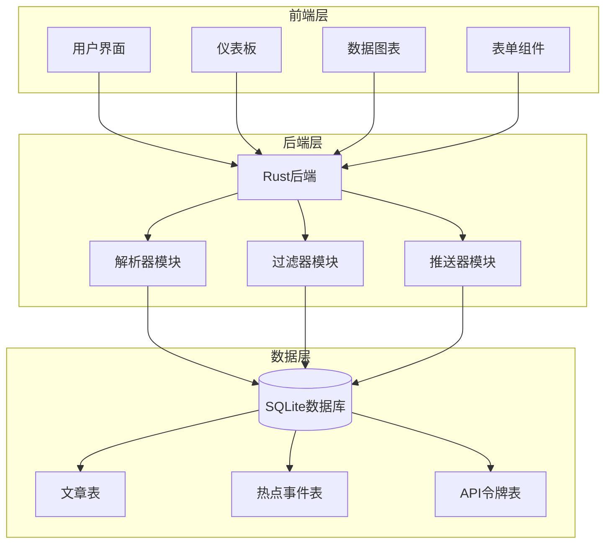
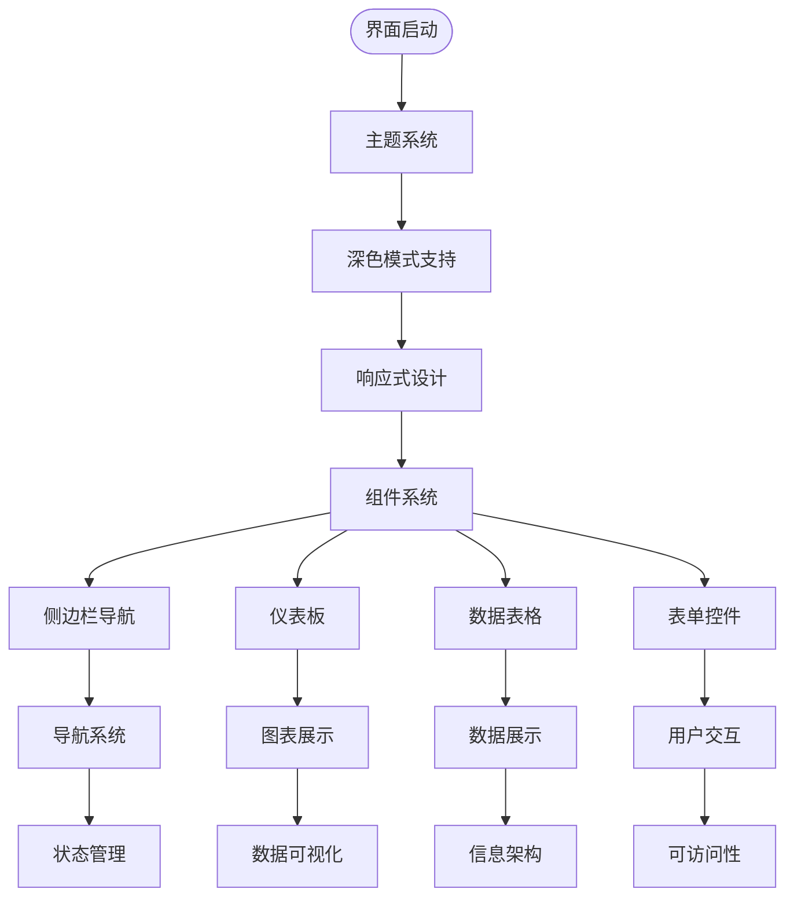
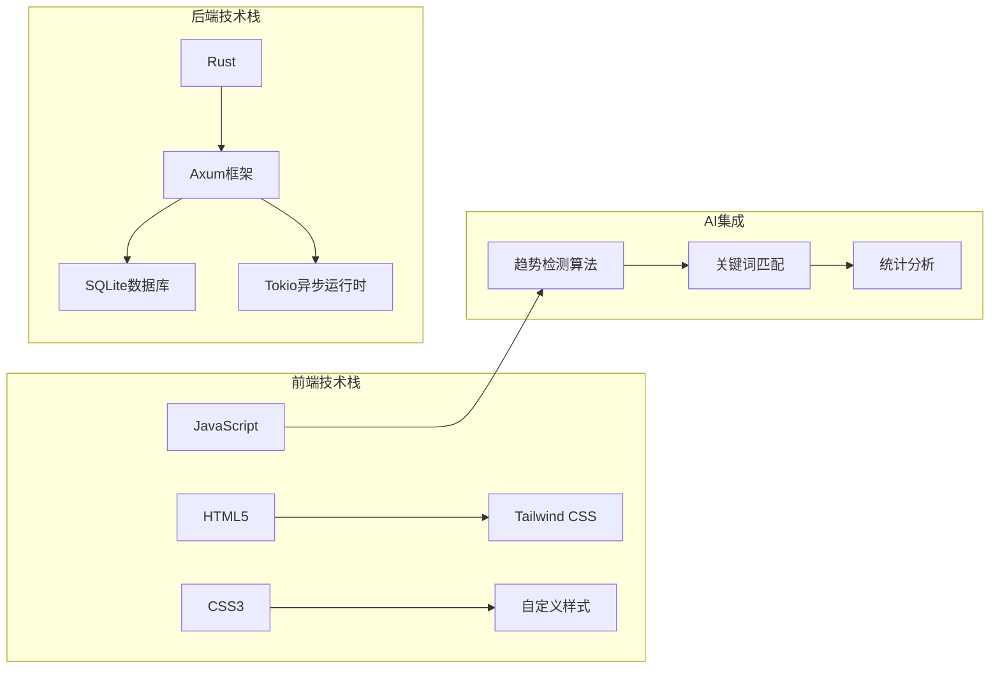
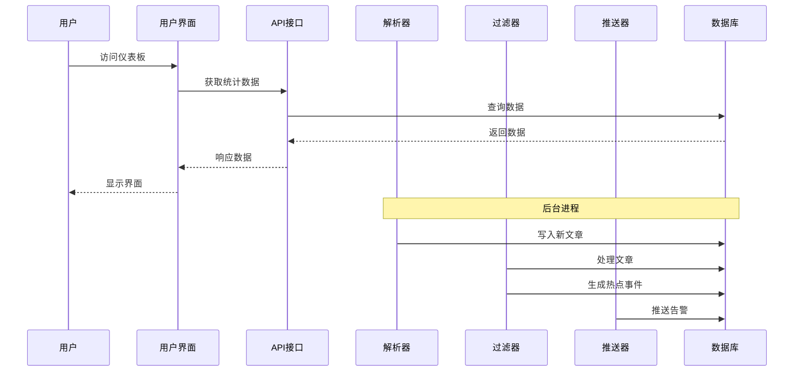
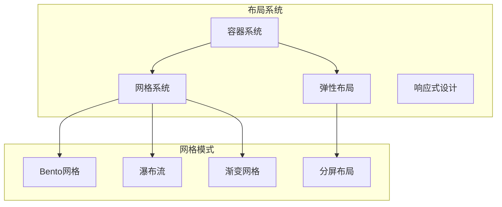
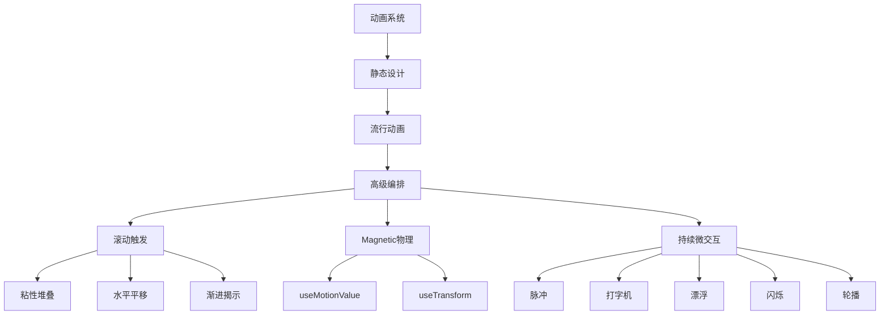
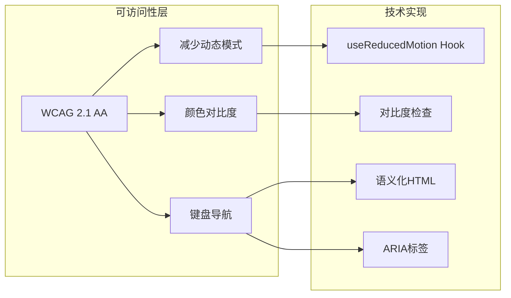
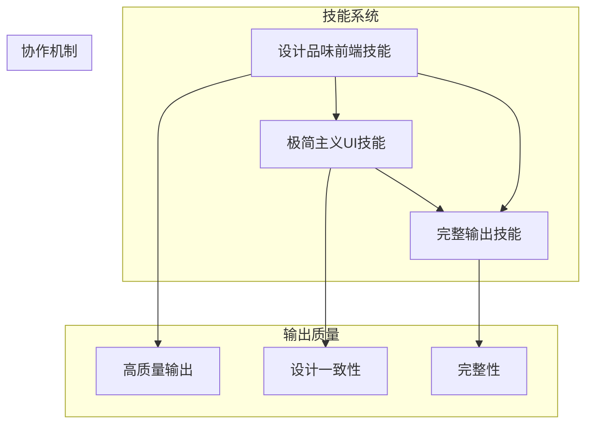
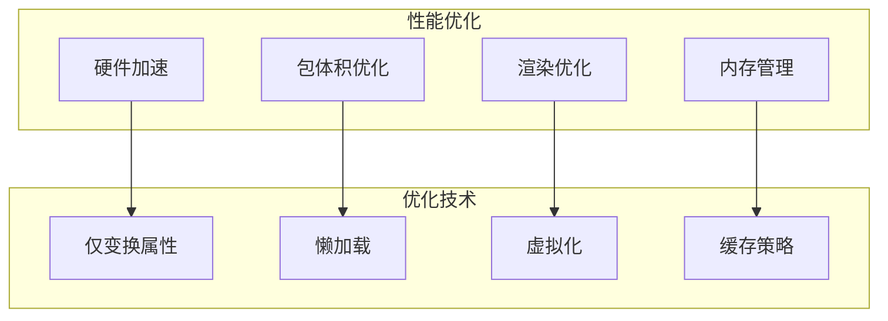
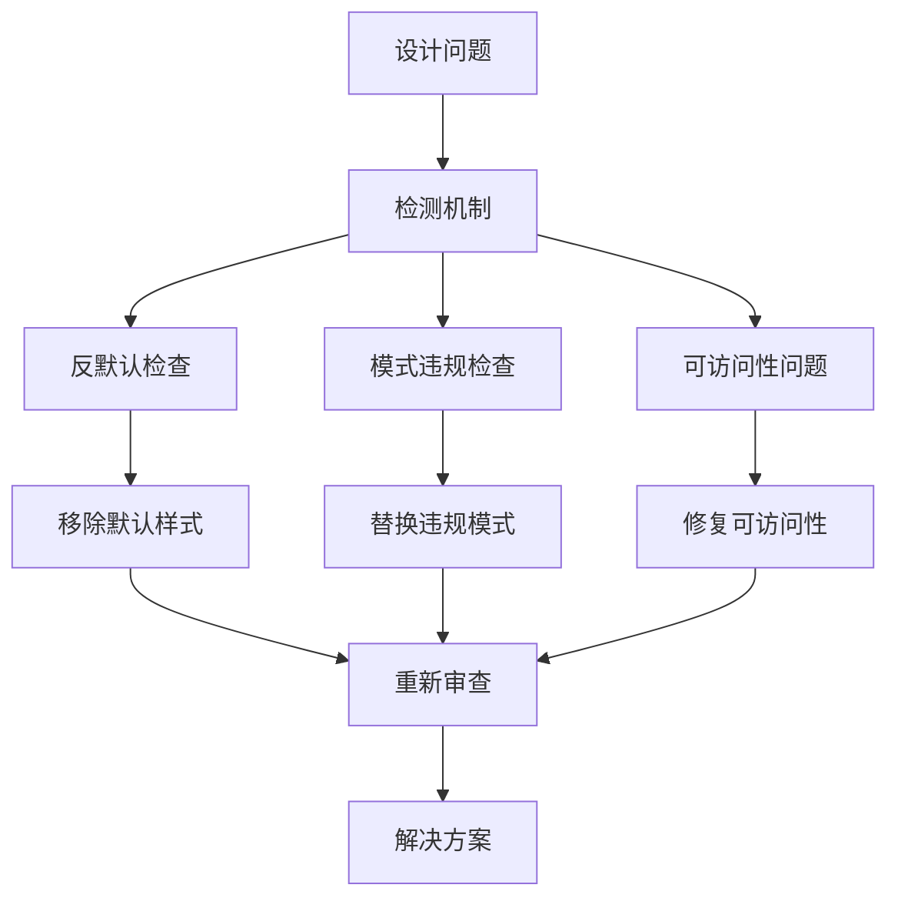

# 设计品味前端技能

<cite>
**本文档引用的文件**
- [SKILL.md](file://.agents/skills/design-taste-frontend/SKILL.md)
- [minimalist-ui SKILL.md](file://.agents/skills/minimalist-ui/SKILL.md)
- [full-output-enforcement SKILL.md](file://.agents/skills/full-output-enforcement/SKILL.md)
- [README.md](file://README.md)
- [CLAUDE.md](file://CLAUDE.md)
- [index.html](file://docs/Live-Artifact/index.html)
- [template.html](file://docs/Live-Artifact/template.html)
- [ai-hotspot-monitor.html](file://docs/Live-Artifact/ai-hotspot-monitor.html)
</cite>

## 目录
1. [简介](#简介)
2. [项目结构](#项目结构)
3. [核心组件](#核心组件)
4. [架构概览](#架构概览)
5. [详细组件分析](#详细组件分析)
6. [依赖关系分析](#依赖关系分析)
7. [性能考虑](#性能考虑)
8. [故障排除指南](#故障排除指南)
9. [结论](#结论)
10. [附录](#附录)

## 简介

设计品味前端技能是一个专为AI趋势监控系统设计的高级前端技能，旨在生成具有专业设计品味的用户界面。该技能专注于避免通用的SaaS设计趋势，创造独特的视觉体验，特别适用于仪表板界面、数据可视化展示和用户交互界面。

该技能的核心目标是：
- 生成具有高级设计品味的前端界面
- 强调编辑风格的简洁性和专业性
- 避免通用的SaaS设计趋势
- 创造独特的视觉体验
- 在AI趋势监控系统中提供专业的用户界面

## 项目结构

AI趋势监控系统采用现代化的全栈架构，结合了Rust后端和HTML/CSS前端技术：

**图表来源**
- [README.md:1-293](file://README.md#L1-L293)
- [CLAUDE.md:1-85](file://CLAUDE.md#L1-L85)

**章节来源**
- [README.md:1-293](file://README.md#L1-L293)
- [CLAUDE.md:1-85](file://CLAUDE.md#L1-L85)

## 核心组件

### 设计品味前端技能核心特性

设计品味前端技能包含三个关键设计参数，用于控制界面的整体风格：

#### 三大设计参数

| 参数名称 | 数值范围 | 默认值 | 设计影响 |
|---------|---------|--------|----------|
| **DESIGN_VARIANCE** | 1-10 | 8 | 控制布局的不对称性和创意程度 1=完美对称，10=艺术性混乱 |
| **MOTION_INTENSITY** | 1-10 | 6 | 控制动画和交互的强度 1=静态，10=电影级物理效果 |
| **VISUAL_DENSITY** | 1-10 | 4 | 控制信息密度和空间利用 1=画廊式，10=驾驶舱式 |

#### 设计哲学原则

1. **反模板原则** - 避免使用常见的SaaS设计模式
2. **情境感知** - 根据具体需求调整设计策略
3. **一致性原则** - 在整个项目中保持设计语言的一致性
4. **可访问性优先** - 确保设计符合WCAG标准

**章节来源**
- [SKILL.md:43-80](file://.agents/skills/design-taste-frontend/SKILL.md#L43-L80)

### 前端界面实现

系统提供了完整的前端界面实现，展示了设计品味技能的实际应用：

#### 现有界面特点

**图表来源**
- [index.html:1-716](file://docs/Live-Artifact/index.html#L1-L716)
- [template.html:1-896](file://docs/Live-Artifact/template.html#L1-L896)

**章节来源**
- [index.html:1-716](file://docs/Live-Artifact/index.html#L1-L716)
- [template.html:1-896](file://docs/Live-Artifact/template.html#L1-L896)

## 架构概览

### 技术栈架构

**图表来源**
- [README.md:25-37](file://README.md#L25-L37)
- [CLAUDE.md:10-26](file://CLAUDE.md#L10-L26)

### 数据流架构

**图表来源**
- [README.md:17-23](file://README.md#L17-L23)
- [CLAUDE.md:12-24](file://CLAUDE.md#L12-L24)

**章节来源**
- [README.md:17-23](file://README.md#L17-L23)
- [CLAUDE.md:12-24](file://CLAUDE.md#L12-L24)

## 详细组件分析

### 设计系统映射

设计品味前端技能提供了灵活的设计系统选择机制：

#### 设计系统选择矩阵

| 设计简报 | 推荐系统 | 使用原因 |
|---------|---------|----------|
| 微软企业SaaS | Fluent UI | 官方Fluent UI，Microsoft设计令牌，可访问性完善 |
| 谷歌风格产品 | Material Web | 官方Material 3设计令牌，主题化支持 |
| IBM企业分析 | Carbon | 官方Carbon，成熟的数据密集型模式 |
| Shopify应用表面 | Polaris | Shopify管理界面必需组件 |
| Atlassian产品 | Atlaskit | 官方Atlassian设计系统 |
| GitHub开发工具 | Primer | 官方Primer，品牌变体支持 |
| 英国公共服务 | GOV.UK Frontend | 法律法规要求 |
| 美国公共服务 | USWDS | 同上 |
| 快速本地业务 | Bootstrap 5.3 | 简单快速，兼容性好 |
| 现代可访问性 | Radix UI Themes | 原子级组件，精心设计的主题 |

**章节来源**
- [SKILL.md:82-105](file://.agents/skills/design-taste-frontend/SKILL.md#L82-L105)

### 布局和网格系统

#### 布局设计原则

**图表来源**
- [SKILL.md:709-756](file://.agents/skills/design-taste-frontend/SKILL.md#L709-L756)

#### 布局规则

| 规则类别 | 具体规则 | 设计目的 |
|---------|---------|----------|
| **英雄区域** | 限制4个文本元素，避免版本标签，禁止分割标题 | 突出核心信息，避免信息过载 |
| **导航系统** | 桌面端单行显示，高度限制80px，避免两行导航 | 提升可用性，保持简洁 |
| **网格系统** | 禁止3列相等特征卡片，要求节奏变化，至少2-3个单元有视觉变化 | 避免模板化设计，增加视觉兴趣 |
| **内容密度** | 短标题(≤8字)+短副标题(≤25字)+一个视觉元素或一个CTA | 保持第一印象清晰，避免信息过载 |

**章节来源**
- [SKILL.md:234-261](file://.agents/skills/design-taste-frontend/SKILL.md#L234-L261)

### 动画和交互系统

#### 动画层次结构

**图表来源**
- [SKILL.md:509-516](file://.agents/skills/design-taste-frontend/SKILL.md#L509-L516)

#### 动画实现模式

| 动画类型 | 实现方式 | 使用场景 | 性能考虑 |
|---------|---------|----------|----------|
| **滚动触发** | GSAP ScrollTrigger | 滚动故事叙述，粘性堆叠 | 需要精确控制，避免过度使用 |
| **磁力物理** | useMotionValue/useTransform | 高级交互，精确控制 | 需要高性能，避免频繁重绘 |
| **持续微交互** | Spring物理 | 状态指示，实时反馈 | 轻量级，避免无限循环 |
| **渐进揭示** | Motion whileInView | 基础进入动画 | 轻量级，性能友好 |

**章节来源**
- [SKILL.md:355-363](file://.agents/skills/design-taste-frontend/SKILL.md#L355-L363)

### 可访问性系统

#### 可访问性保障

**图表来源**
- [SKILL.md:525-536](file://.agents/skills/design-taste-frontend/SKILL.md#L525-L536)

**章节来源**
- [SKILL.md:525-536](file://.agents/skills/design-taste-frontend/SKILL.md#L525-L536)

## 依赖关系分析

### 技能间协作关系

**图表来源**
- [.agents/skills/design-taste-frontend/SKILL.md:1-1207](file://.agents/skills/design-taste-frontend/SKILL.md#L1-L1207)
- [.agents/skills/minimalist-ui/SKILL.md:1-86](file://.agents/skills/minimalist-ui/SKILL.md#L1-L86)
- [.agents/skills/full-output-enforcement/SKILL.md:1-50](file://.agents/skills/full-output-enforcement/SKILL.md#L1-L50)

### 技术依赖关系

#### 前端技术栈依赖

| 技术组件 | 版本要求 | 依赖关系 | 使用场景 |
|---------|---------|----------|----------|
| **React** | 18+ | 基础UI框架 | 组件开发，状态管理 |
| **Tailwind CSS** | v4 | 样式系统 | 原子化CSS，主题定制 |
| **Motion** | 10+ | 动画库 | UI动画，物理效果 |
| **Phosphor Icons** | 最新 | 图标系统 | 符号表示，界面图标 |
| **Next.js** | 14+ | SSR框架 | 服务端渲染，静态生成 |

**章节来源**
- [SKILL.md:122-158](file://.agents/skills/design-taste-frontend/SKILL.md#L122-L158)

## 性能考虑

### 性能优化策略

### 性能指标

| 指标类型 | 目标值 | 测量方法 | 重要性 |
|---------|--------|----------|--------|
| **LCP** | < 2.5秒 | Largest Contentful Paint | 高 |
| **INP** | < 200毫秒 | Interaction to Next Paint | 高 |
| **CLS** | < 0.1 | Cumulative Layout Shift | 高 |
| **Bundle Size** | < 500KB | 包体积分析 | 中 |
| **First Contentful Paint** | < 1.8秒 | 首次内容绘制 | 高 |

**章节来源**
- [SKILL.md:537-546](file://.agents/skills/design-taste-frontend/SKILL.md#L537-L546)

## 故障排除指南

### 常见问题诊断

#### 设计违规检测

#### 违规模式识别

| 违规类型 | 识别特征 | 解决方案 |
|---------|---------|----------|
| **默认样式** | 使用默认字体，颜色，布局 | 替换为品牌化设计 |
| **模板化布局** | 3列相等卡片，中心英雄区 | 使用不对称设计 |
| **过度动画** | 无限循环微交互，复杂滚动效果 | 简化动画，增加动机性 |
| **可访问性问题** | 对比度不足，键盘导航缺失 | 实施WCAG标准 |

**章节来源**
- [SKILL.md:595-702](file://.agents/skills/design-taste-frontend/SKILL.md#L595-L702)

### 调试工具和技巧

#### 开发工具推荐

| 工具类型 | 推荐工具 | 用途 |
|---------|---------|------|
| **性能分析** | Lighthouse, WebPageTest | 性能基准测试 |
| **可访问性检查** | axe-core, pa11y | 可访问性合规性 |
| **设计审查** | Zeplin, Figma | 设计一致性检查 |
| **代码质量** | ESLint, Prettier | 代码规范和格式化 |

## 结论

设计品味前端技能为AI趋势监控系统提供了专业的前端设计解决方案。通过三个核心设计参数和严格的设计指导原则，该技能能够：

1. **创造独特视觉体验** - 避免通用SaaS设计趋势，提供个性化的界面设计
2. **确保设计一致性** - 通过设计系统映射和组件规范保持整体风格统一
3. **优化用户体验** - 通过可访问性保障和性能优化提升用户满意度
4. **支持AI集成** - 为AI趋势监控功能提供专业的数据可视化界面

该技能与极简主义UI技能和完整输出技能形成互补，共同提升系统的整体设计质量和用户体验。

## 附录

### 最佳实践清单

#### 设计实施检查清单

- [ ] 完成设计简报分析
- [ ] 设置设计参数
- [ ] 选择合适的设计系统
- [ ] 实施响应式设计
- [ ] 确保可访问性合规
- [ ] 进行性能优化
- [ ] 完成最终审查

#### 使用示例

**仪表板界面示例**：
- 使用深色主题配色方案
- 实现响应式网格布局
- 集成交互式数据图表
- 确保键盘导航支持

**数据可视化示例**：
- 使用SVG图表进行数据展示
- 实现平滑的动画过渡
- 提供多种视图切换选项
- 支持数据导出功能

**用户交互示例**：
- 实现直观的表单设计
- 提供清晰的状态反馈
- 支持手势和触摸操作
- 确保跨设备兼容性