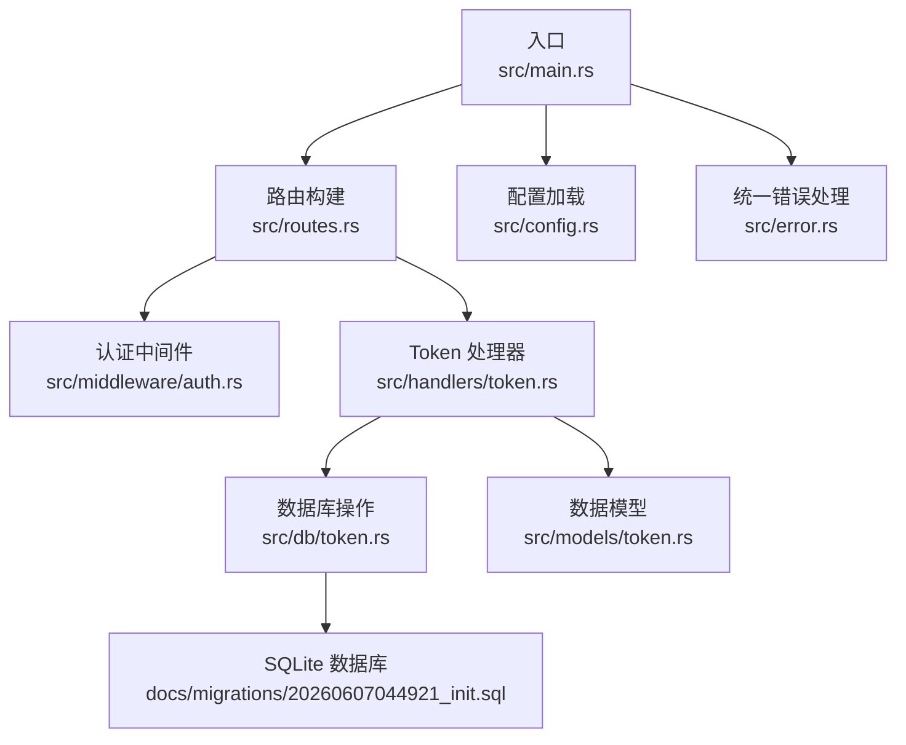
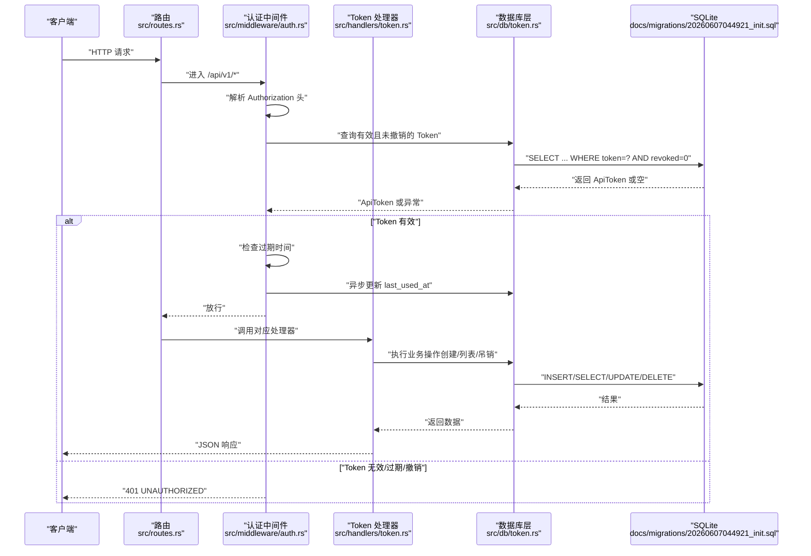
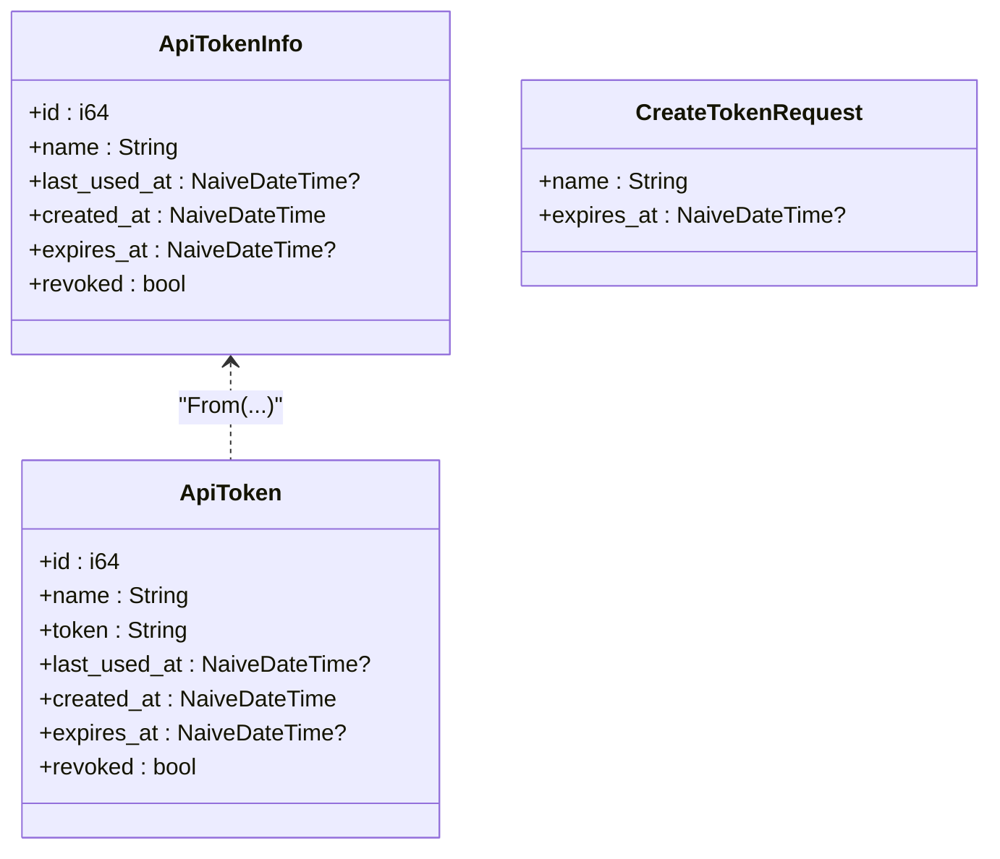
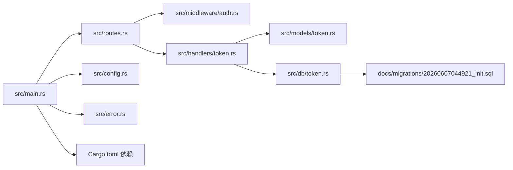

# API参考

<cite>
**本文引用的文件**
- [README.md](file://README.md)
- [Cargo.toml](file://Cargo.toml)
- [src/main.rs](file://src/main.rs)
- [src/config.rs](file://src/config.rs)
- [src/error.rs](file://src/error.rs)
- [src/route.rs](file://src/routes.rs)
- [src/middleware/auth.rs](file://src/middleware/auth.rs)
- [src/handlers/token.rs](file://src/handlers/token.rs)
- [src/models/token.rs](file://src/models/token.rs)
- [src/db/token.rs](file://src/db/token.rs)
- [docs/apis/token-api.md](file://docs/apis/token-api.md)
- [docs/plans/03-auth-and-token-api.md](file://docs/plans/03-auth-and-token-api.md)
- [docs/migrations/20260607044921_init.sql](file://docs/migrations/20260607044921_init.sql)
</cite>

## 目录
1. [简介](#简介)
2. [项目结构](#项目结构)
3. [核心组件](#核心组件)
4. [架构总览](#架构总览)
5. [详细组件分析](#详细组件分析)
6. [依赖关系分析](#依赖关系分析)
7. [性能考量](#性能考量)
8. [故障排查指南](#故障排查指南)
9. [结论](#结论)
10. [附录](#附录)

## 简介
本文件为 AI-Trend-Tool 的完整 API 参考文档，聚焦于已实现的认证与 Token 管理相关接口。内容覆盖：
- RESTful API 端点定义（HTTP 方法、URL 模式、请求/响应结构）
- 认证机制与使用方法（Bearer Token）
- 错误与成功响应格式
- 版本控制策略、速率限制与安全建议
- 客户端实现要点与调试技巧

## 项目结构
后端基于 Axum + SQLite，采用模块化组织：
- 配置解析与应用启动：src/config.rs、src/main.rs
- 路由与中间件：src/routes.rs、src/middleware/auth.rs
- Token API 处理器：src/handlers/token.rs
- 数据模型与数据库交互：src/models/token.rs、src/db/token.rs
- 统一错误处理：src/error.rs
- API 设计文档与迁移：docs/apis/token-api.md、docs/migrations/20260607044921_init.sql

图表来源
- [src/main.rs:63-96](file://src/main.rs#L63-L96)
- [src/routes.rs:14-48](file://src/routes.rs#L14-L48)
- [src/middleware/auth.rs:18-60](file://src/middleware/auth.rs#L18-L60)
- [src/handlers/token.rs:13-66](file://src/handlers/token.rs#L13-L66)
- [src/db/token.rs:6-107](file://src/db/token.rs#L6-L107)
- [src/models/token.rs:5-46](file://src/models/token.rs#L5-L46)
- [src/error.rs:8-79](file://src/error.rs#L8-L79)
- [docs/migrations/20260607044921_init.sql](file://docs/migrations/20260607044921_init.sql)

章节来源
- [README.md:216-257](file://README.md#L216-L257)
- [src/main.rs:1-96](file://src/main.rs#L1-L96)
- [src/config.rs:1-59](file://src/config.rs#L1-L59)
- [src/error.rs:1-79](file://src/error.rs#L1-L79)
- [src/routes.rs:1-48](file://src/routes.rs#L1-L48)
- [src/middleware/auth.rs:1-60](file://src/middleware/auth.rs#L1-L60)
- [src/handlers/token.rs:1-66](file://src/handlers/token.rs#L1-L66)
- [src/models/token.rs:1-46](file://src/models/token.rs#L1-L46)
- [src/db/token.rs:1-107](file://src/db/token.rs#L1-L107)
- [docs/apis/token-api.md:1-198](file://docs/apis/token-api.md#L1-L198)
- [docs/plans/03-auth-and-token-api.md:1-405](file://docs/plans/03-auth-and-token-api.md#L1-L405)

## 核心组件
- 应用配置与启动：负责读取配置、初始化数据库连接池、执行迁移、确保初始 Token 存在，并启动 HTTP 服务。
- 路由与中间件：注册 /api/v1 下的受保护端点，并在全局应用认证中间件；同时提供 /health 健康检查。
- 认证中间件：从 Authorization 头提取 Bearer Token，查询数据库校验有效性与是否撤销，检查过期时间，异步更新最近使用时间，并将令牌信息注入请求上下文。
- Token API：提供创建、列表与吊销 Token 的能力，返回结构化的响应与错误。
- 数据模型与数据库：ApiToken、ApiTokenInfo、CreateTokenRequest；数据库层封装 Token 的增删改查与统计。

章节来源
- [src/main.rs:26-61](file://src/main.rs#L26-L61)
- [src/routes.rs:14-48](file://src/routes.rs#L14-L48)
- [src/middleware/auth.rs:18-60](file://src/middleware/auth.rs#L18-L60)
- [src/handlers/token.rs:13-66](file://src/handlers/token.rs#L13-L66)
- [src/models/token.rs:5-46](file://src/models/token.rs#L5-L46)
- [src/db/token.rs:6-107](file://src/db/token.rs#L6-L107)

## 架构总览
下图展示从客户端到处理器的整体调用链路，以及认证中间件如何拦截并验证请求。

图表来源
- [src/routes.rs:20-36](file://src/routes.rs#L20-L36)
- [src/middleware/auth.rs:23-58](file://src/middleware/auth.rs#L23-L58)
- [src/handlers/token.rs:18-65](file://src/handlers/token.rs#L18-L65)
- [src/db/token.rs:40-67](file://src/db/token.rs#L40-L67)

## 详细组件分析

### 认证与 Token 管理 API

- 版本控制
  - 所有受保护端点位于 /api/v1 路径前缀下，当前仓库实现即为 v1。
  - 未来新增端点将沿用相同前缀，保持向后兼容性。

- 认证机制
  - 除 /health 外，所有 /api/v1/* 需携带 Bearer Token。
  - 中间件流程：提取头 → 校验值 → 数据库查询（未撤销）→ 过期检查 → 异步更新最近使用时间 → 注入令牌信息 → 放行。

- 统一错误与成功响应
  - 成功响应：200/201 返回 { "data": ... }；204 无响应体。
  - 错误响应：{ "error": { "code": "...", "message": "..." } }，状态码映射见“统一错误响应”表格。

- 端点一览与使用

  1) 健康检查
  - 方法与路径：GET /health
  - 认证：无需
  - 成功响应：200，返回 { "status": "ok" }
  - 示例：参见 README 中的 curl 示例。

  2) 创建 Token
  - 方法与路径：POST /api/v1/tokens
  - 认证：需要（管理员 Token）
  - 请求体（application/json）：
    - name: string，必填
    - expires_at: string|null，可选（ISO 8601）
  - 成功响应：201，返回 ApiToken（包含一次性可见的明文 token）
  - 使用场景：为新客户端或服务创建短期或长期 Token。
  - 最佳实践：设置合理的过期时间；避免在客户端持久化明文 token；必要时启用吊销机制。

  3) 列出 Token
  - 方法与路径：GET /api/v1/tokens
  - 认证：需要
  - 成功响应：200，返回 ApiTokenInfo 数组（不包含明文 token）
  - 使用场景：运维审计与管理。
  - 最佳实践：定期轮询以发现未撤销的旧 Token。

  4) 吊销 Token
  - 方法与路径：POST /api/v1/tokens/revoke/{id}
  - 认证：需要
  - 成功响应：204（无内容）
  - 错误响应：404（当 id 不存在时）
  - 使用场景：密钥泄露或不再使用的 Token。
  - 最佳实践：立即撤销并在客户端更换新 Token。

- 参数与数据模型
  - ApiToken：id、name、token（一次性可见）、last_used_at、created_at、expires_at、revoked
  - ApiTokenInfo：用于列表响应，不含 token
  - CreateTokenRequest：name、expires_at

- 错误码与状态码
  - 400：BAD_REQUEST（请求参数无效）
  - 401：UNAUTHORIZED（未认证、Token 无效/过期/撤销）
  - 404：NOT_FOUND（资源不存在）
  - 409：CONFLICT（唯一约束冲突）
  - 500：INTERNAL_ERROR/DATABASE_ERROR（内部错误）

- 安全与合规建议
  - 传输层：始终使用 HTTPS。
  - 密钥管理：避免在日志中打印明文 token；客户端本地存储应加密。
  - 生命周期：最小权限原则；定期轮换；及时吊销。
  - 审计：利用 last_used_at 与 created_at 追踪使用情况。

章节来源
- [README.md:123-203](file://README.md#L123-L203)
- [docs/apis/token-api.md:40-198](file://docs/apis/token-api.md#L40-L198)
- [src/middleware/auth.rs:18-60](file://src/middleware/auth.rs#L18-L60)
- [src/handlers/token.rs:13-66](file://src/handlers/token.rs#L13-L66)
- [src/models/token.rs:5-46](file://src/models/token.rs#L5-L46)
- [src/db/token.rs:6-107](file://src/db/token.rs#L6-L107)
- [src/error.rs:8-79](file://src/error.rs#L8-L79)

### 类图：数据模型与关系

图表来源
- [src/models/token.rs:5-46](file://src/models/token.rs#L5-L46)

## 依赖关系分析
- 框架与库
  - Web：Axum 0.8、Tower、tower-http（CORS）
  - 数据库：sqlx 0.7（SQLite、迁移）
  - 时间与时序：chrono
  - 序列化：serde/serde_json/toml
  - 随机与编码：rand、hex
  - CLI：clap
- 模块耦合
  - main.rs 作为入口，协调配置、数据库、迁移与路由。
  - routes.rs 负责路由注册与中间件层，依赖 handlers 与 middleware。
  - handlers 依赖 models 与 db 层，db 层依赖 sqlx 与 SQLite。
  - error.rs 提供统一错误与响应包装，被各层复用。

图表来源
- [Cargo.toml:6-44](file://Cargo.toml#L6-L44)
- [src/main.rs:63-96](file://src/main.rs#L63-L96)
- [src/routes.rs:14-48](file://src/routes.rs#L14-L48)
- [src/middleware/auth.rs:18-60](file://src/middleware/auth.rs#L18-L60)
- [src/handlers/token.rs:13-66](file://src/handlers/token.rs#L13-L66)
- [src/models/token.rs:5-46](file://src/models/token.rs#L5-L46)
- [src/db/token.rs:6-107](file://src/db/token.rs#L6-L107)
- [src/error.rs:8-79](file://src/error.rs#L8-L79)
- [docs/migrations/20260607044921_init.sql](file://docs/migrations/20260607044921_init.sql)

章节来源
- [Cargo.toml:6-44](file://Cargo.toml#L6-L44)
- [src/main.rs:63-96](file://src/main.rs#L63-L96)
- [src/routes.rs:14-48](file://src/routes.rs#L14-L48)
- [src/middleware/auth.rs:18-60](file://src/middleware/auth.rs#L18-L60)
- [src/handlers/token.rs:13-66](file://src/handlers/token.rs#L13-L66)
- [src/models/token.rs:5-46](file://src/models/token.rs#L5-L46)
- [src/db/token.rs:6-107](file://src/db/token.rs#L6-L107)
- [src/error.rs:8-79](file://src/error.rs#L8-L79)

## 性能考量
- 认证中间件采用异步更新 last_used_at，避免阻塞主请求路径。
- 列表接口按创建时间倒序，便于快速定位最新 Token。
- 数据库层使用 RETURNING 与单条更新，减少往返。
- 建议
  - 对高频查询增加索引（如 token、revoked、created_at）。
  - 控制 Token 列表分页与筛选字段，避免一次性返回过多数据。
  - 在高并发场景下，合理设置数据库连接池大小与超时。

## 故障排查指南
- 401 未授权
  - 检查 Authorization 头格式是否为 Bearer。
  - 确认 Token 未撤销且未过期。
  - 确保使用正确的 /api/v1 前缀。
- 404 资源不存在
  - 吊销操作时传入的 id 不存在。
- 500 内部错误
  - 查看服务端日志中的 DATABASE_ERROR 详情。
- 健康检查
  - /health 不需要认证，可用于快速确认服务可用性。

章节来源
- [src/middleware/auth.rs:23-58](file://src/middleware/auth.rs#L23-L58)
- [src/handlers/token.rs:52-65](file://src/handlers/token.rs#L52-L65)
- [src/error.rs:23-50](file://src/error.rs#L23-L50)
- [README.md:166-171](file://README.md#L166-L171)

## 结论
本 API 参考聚焦于已实现的认证与 Token 管理能力，提供了清晰的端点定义、认证流程、错误与成功响应格式，以及安全与性能建议。后续开发可在同一版本前缀下逐步扩展 CRUD 与查询类 API，并延续统一的错误与响应风格。

## 附录

### API 端点一览（v1）
- GET /health
  - 认证：否
  - 成功：200，{"status":"ok"}
- POST /api/v1/tokens
  - 认证：是
  - 请求体：{"name": "...", "expires_at": "YYYY-MM-DDTHH:mm:ss"|"null"}
  - 成功：201，{"data": ApiToken（含一次性可见的 token）}
- GET /api/v1/tokens
  - 认证：是
  - 成功：200，{"data": [ApiTokenInfo,...]}
- POST /api/v1/tokens/revoke/{id}
  - 认证：是
  - 成功：204，无内容
  - 错误：404，{"error":{"code":"NOT_FOUND","message":"Token with id {id} not found"}}

章节来源
- [README.md:123-203](file://README.md#L123-L203)
- [docs/apis/token-api.md:42-198](file://docs/apis/token-api.md#L42-L198)

### 数据库表与字段（节选）
- api_tokens：id、name、token、last_used_at、created_at、expires_at、revoked
- 迁移文件定义了表结构与约束，确保字段类型与默认值符合预期。

章节来源
- [docs/migrations/20260607044921_init.sql](file://docs/migrations/20260607044921_init.sql)