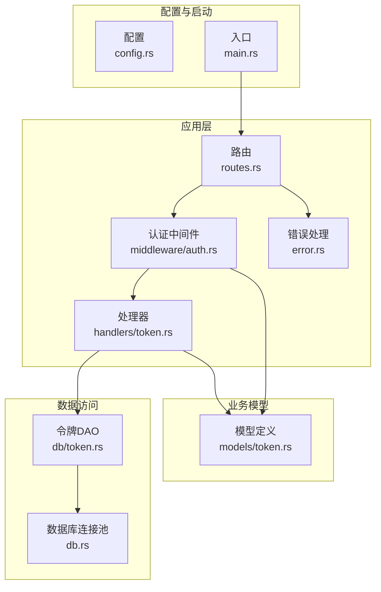
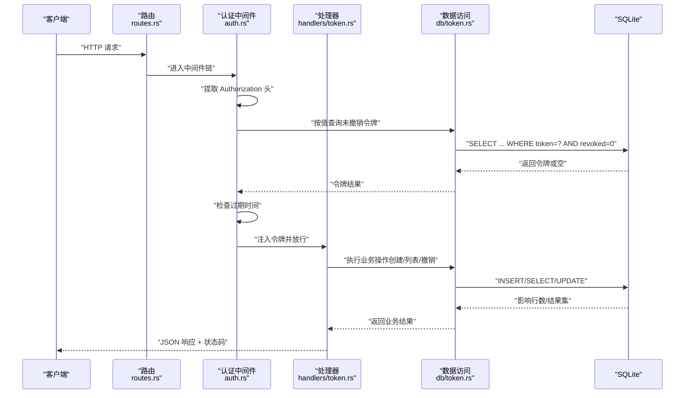
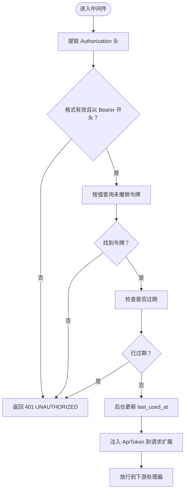
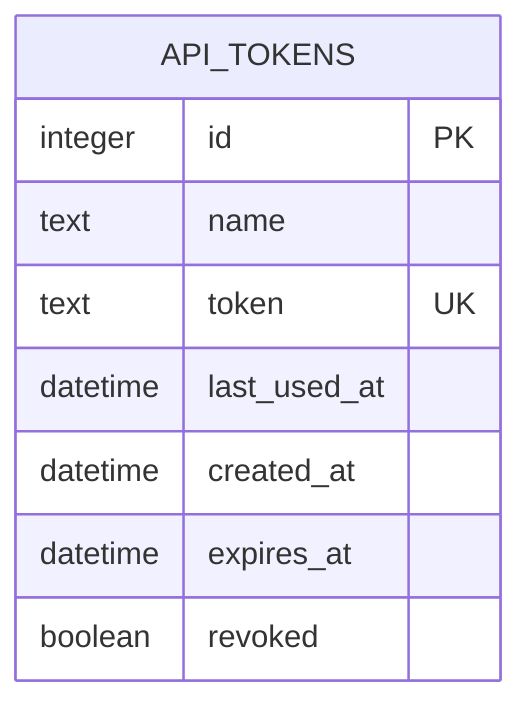
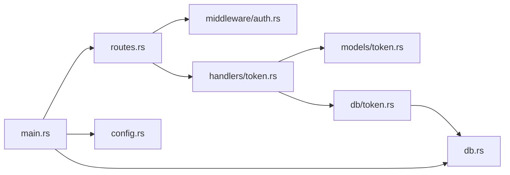

# 令牌API

<cite>
**本文引用的文件**
- [src/main.rs](file://src/main.rs)
- [src/config.rs](file://src/config.rs)
- [src/db.rs](file://src/db.rs)
- [src/db/token.rs](file://src/db/token.rs)
- [src/models/token.rs](file://src/models/token.rs)
- [src/handlers/token.rs](file://src/handlers/token.rs)
- [src/middleware/auth.rs](file://src/middleware/auth.rs)
- [src/routes.rs](file://src/routes.rs)
- [src/error.rs](file://src/error.rs)
- [docs/apis/token-api.md](file://docs/apis/token-api.md)
- [docs/migrations/20260607044921_init.sql](file://docs/migrations/20260607044921_init.sql)
</cite>

## 目录
1. [简介](#简介)
2. [项目结构](#项目结构)
3. [核心组件](#核心组件)
4. [架构总览](#架构总览)
5. [详细组件分析](#详细组件分析)
6. [依赖关系分析](#依赖关系分析)
7. [性能考量](#性能考量)
8. [故障排查指南](#故障排查指南)
9. [结论](#结论)
10. [附录](#附录)

## 简介
本文件为“令牌API”的完整技术文档，覆盖令牌生成、列表查询、撤销等端点的HTTP方法、请求参数、响应格式与状态码，并结合后端实现说明令牌类型、有效期、权限范围与安全策略。同时提供客户端调用示例路径、错误处理机制、常见问题与解决方案，以及令牌最佳实践与安全建议。

## 项目结构
该服务基于 Rust + Axum 框架，采用分层设计：
- 路由层：定义 /api/v1/tokens 及其子路径
- 中间件层：统一 Bearer 认证与令牌校验
- 处理器层：具体业务逻辑（创建、列表、撤销）
- 模型层：数据模型与序列化结构
- 数据访问层：SQLite 操作封装
- 配置与启动：命令行参数、数据库初始化、迁移与初始令牌

图表来源
- [src/routes.rs:14-48](file://src/routes.rs#L14-L48)
- [src/middleware/auth.rs:14-60](file://src/middleware/auth.rs#L14-L60)
- [src/handlers/token.rs:13-66](file://src/handlers/token.rs#L13-L66)
- [src/db/token.rs:6-107](file://src/db/token.rs#L6-L107)
- [src/db.rs:9-26](file://src/db.rs#L9-L26)
- [src/models/token.rs:5-46](file://src/models/token.rs#L5-L46)
- [src/error.rs:8-79](file://src/error.rs#L8-L79)
- [src/config.rs:4-59](file://src/config.rs#L4-L59)
- [src/main.rs:63-96](file://src/main.rs#L63-L96)

章节来源
- [src/routes.rs:14-48](file://src/routes.rs#L14-L48)
- [src/main.rs:63-96](file://src/main.rs#L63-L96)

## 核心组件
- 路由与中间件：在 /api/v1 下注册令牌相关端点，并通过认证中间件强制 Bearer 令牌。
- 处理器：实现创建、列表、撤销三个端点；创建时生成 64 字节十六进制令牌。
- 数据模型：ApiToken 与 ApiTokenInfo；列表返回隐藏明文 token 的信息体。
- 数据访问：围绕 api_tokens 表进行插入、查询、更新与软删除。
- 错误处理：统一错误码映射与响应体格式。

章节来源
- [src/handlers/token.rs:13-66](file://src/handlers/token.rs#L13-L66)
- [src/models/token.rs:5-46](file://src/models/token.rs#L5-L46)
- [src/db/token.rs:6-107](file://src/db/token.rs#L6-L107)
- [src/error.rs:8-79](file://src/error.rs#L8-L79)

## 架构总览
下图展示了令牌API的端到端流程：客户端发起请求，经路由与认证中间件校验，再由处理器调用数据访问层完成数据库操作。

图表来源
- [src/routes.rs:14-48](file://src/routes.rs#L14-L48)
- [src/middleware/auth.rs:14-60](file://src/middleware/auth.rs#L14-L60)
- [src/handlers/token.rs:13-66](file://src/handlers/token.rs#L13-L66)
- [src/db/token.rs:6-107](file://src/db/token.rs#L6-L107)

## 详细组件分析

### 端点总览
- Base URL：/api/v1
- 全部 /api/v1/* 路径均需 Bearer 令牌认证
- 健康检查 /health 不需要认证

章节来源
- [docs/apis/token-api.md:3-14](file://docs/apis/token-api.md#L3-L14)
- [src/routes.rs:14-48](file://src/routes.rs#L14-L48)

### POST /api/v1/tokens（创建令牌）
- 功能：生成 64 字符随机十六进制令牌，插入数据库并返回包含明文 token 的完整 ApiToken。
- 请求体：CreateTokenRequest（name 必填，expires_at 可选）
- 成功响应：201 Created，返回 ApiToken（包含明文 token）
- 安全要点：明文 token 仅在创建时返回一次，后续列表接口返回 ApiTokenInfo（不包含 token）

章节来源
- [src/handlers/token.rs:18-30](file://src/handlers/token.rs#L18-L30)
- [src/models/token.rs:40-44](file://src/models/token.rs#L40-L44)
- [docs/apis/token-api.md:62-120](file://docs/apis/token-api.md#L62-L120)

### GET /api/v1/tokens（列出令牌）
- 功能：返回所有未撤销令牌的概要信息（ApiTokenInfo），隐藏明文 token。
- 排序：按 created_at 降序（最新在前）
- 成功响应：200 OK，数组元素为 ApiTokenInfo

章节来源
- [src/handlers/token.rs:36-43](file://src/handlers/token.rs#L36-L43)
- [src/models/token.rs:16-38](file://src/models/token.rs#L16-L38)
- [docs/apis/token-api.md:123-165](file://docs/apis/token-api.md#L123-L165)

### POST /api/v1/tokens/revoke/{id}（撤销令牌）
- 功能：将指定令牌标记为已撤销（软删除），使其无法继续用于认证。
- 成功响应：204 No Content
- 失败响应：404 NOT_FOUND（当 id 对应令牌不存在）

章节来源
- [src/handlers/token.rs:49-65](file://src/handlers/token.rs#L49-L65)
- [src/db/token.rs:61-67](file://src/db/token.rs#L61-L67)
- [docs/apis/token-api.md:168-197](file://docs/apis/token-api.md#L168-L197)

### 认证中间件与安全策略
- 提取 Authorization 头并校验 Bearer 格式
- 查询数据库中的非撤销令牌
- 校验过期时间（若设置）
- 异步更新 last_used_at
- 将 ApiToken 注入请求扩展供下游使用

图表来源
- [src/middleware/auth.rs:18-59](file://src/middleware/auth.rs#L18-L59)

章节来源
- [src/middleware/auth.rs:14-60](file://src/middleware/auth.rs#L14-L60)

### 数据模型与数据库结构
- ApiToken：包含 id、name、token、last_used_at、created_at、expires_at、revoked
- ApiTokenInfo：用于列表响应，不含 token 字段
- 数据库表 api_tokens：唯一约束 token，支持过期时间与撤销标记

图表来源
- [docs/migrations/20260607044921_init.sql:4-12](file://docs/migrations/20260607044921_init.sql#L4-L12)
- [src/models/token.rs:5-25](file://src/models/token.rs#L5-L25)

章节来源
- [src/models/token.rs:5-46](file://src/models/token.rs#L5-L46)
- [docs/migrations/20260607044921_init.sql:4-12](file://docs/migrations/20260607044921_init.sql#L4-L12)

### 错误处理与状态码
- 统一错误响应体包含 code 与 message
- 常见状态码映射：
  - 400 BAD_REQUEST：请求体或参数无效
  - 401 UNAUTHORIZED：缺少、格式错误、过期或已撤销令牌
  - 404 NOT_FOUND：资源不存在（如撤销时找不到令牌）
  - 409 CONFLICT：唯一约束冲突
  - 500 DATABASE_ERROR/INTERNAL_ERROR：服务器内部错误

章节来源
- [src/error.rs:8-79](file://src/error.rs#L8-L79)
- [docs/apis/token-api.md:17-37](file://docs/apis/token-api.md#L17-L37)

### 客户端使用示例（路径）
- 创建令牌：参考 [docs/apis/token-api.md:75-120](file://docs/apis/token-api.md#L75-L120)
- 列出令牌：参考 [docs/apis/token-api.md:142-165](file://docs/apis/token-api.md#L142-L165)
- 撤销令牌：参考 [docs/apis/token-api.md:186-197](file://docs/apis/token-api.md#L186-L197)
- 获取健康检查：参考 [docs/apis/token-api.md:42-59](file://docs/apis/token-api.md#L42-L59)

## 依赖关系分析
- 路由层依赖中间件层与处理器层
- 处理器层依赖数据访问层与模型层
- 中间件层依赖数据访问层与模型层
- 启动流程负责数据库初始化、迁移与初始令牌生成

图表来源
- [src/routes.rs:14-48](file://src/routes.rs#L14-L48)
- [src/middleware/auth.rs:14-60](file://src/middleware/auth.rs#L14-L60)
- [src/handlers/token.rs:13-66](file://src/handlers/token.rs#L13-L66)
- [src/models/token.rs:5-46](file://src/models/token.rs#L5-L46)
- [src/db/token.rs:6-107](file://src/db/token.rs#L6-L107)
- [src/db.rs:9-26](file://src/db.rs#L9-L26)
- [src/main.rs:63-96](file://src/main.rs#L63-L96)
- [src/config.rs:4-59](file://src/config.rs#L4-L59)

章节来源
- [src/routes.rs:14-48](file://src/routes.rs#L14-L48)
- [src/main.rs:63-96](file://src/main.rs#L63-L96)

## 性能考量
- 认证中间件异步更新 last_used_at，避免阻塞请求链路
- 数据库连接池默认最大连接数为 5，适合轻量级服务
- 建议：
  - 控制令牌数量与生命周期，减少查询压力
  - 在高并发场景下评估连接池大小与数据库性能
  - 对频繁查询的令牌表建立合适的索引（当前已有 created_at、expires_at、revoked 等字段）

章节来源
- [src/middleware/auth.rs:48-53](file://src/middleware/auth.rs#L48-L53)
- [src/db.rs:11-25](file://src/db.rs#L11-L25)
- [docs/migrations/20260607044921_init.sql:4-12](file://docs/migrations/20260607044921_init.sql#L4-L12)

## 故障排查指南
- 401 UNAUTHORIZED
  - 检查 Authorization 头是否为 Bearer 格式
  - 确认令牌未被撤销且未过期
  - 参考 [src/middleware/auth.rs:23-46](file://src/middleware/auth.rs#L23-L46)
- 404 NOT_FOUND（撤销令牌）
  - 确认令牌 ID 存在且未被软删除
  - 参考 [src/handlers/token.rs:55-62](file://src/handlers/token.rs#L55-L62)
- 500 INTERNAL_ERROR/DATABASE_ERROR
  - 查看日志定位 SQLx 错误
  - 参考 [src/error.rs:31-38](file://src/error.rs#L31-L38)

章节来源
- [src/middleware/auth.rs:23-46](file://src/middleware/auth.rs#L23-L46)
- [src/handlers/token.rs:55-62](file://src/handlers/token.rs#L55-L62)
- [src/error.rs:31-38](file://src/error.rs#L31-L38)

## 结论
该令牌API提供了简洁而安全的令牌管理能力：创建时一次性暴露明文 token，后续通过列表与撤销实现生命周期管理；认证中间件统一拦截并校验令牌有效性，确保 /api/v1/* 路径的安全访问。配合数据库迁移脚本与启动流程，系统可在首次运行时自动生成初始管理员令牌，便于快速上手。

## 附录

### 令牌类型与有效期
- 令牌类型：Bearer
- 有效期：可选，存储于 expires_at；未设置则永不过期
- 过期检查：中间件在每次请求时校验过期时间

章节来源
- [src/middleware/auth.rs:41-46](file://src/middleware/auth.rs#L41-L46)
- [docs/migrations/20260607044921_init.sql:10](file://docs/migrations/20260607044921_init.sql#L10)

### 权限范围与安全策略
- 权限范围：/api/v1/* 路径均需有效令牌
- 安全策略：
  - 明文 token 仅在创建时返回
  - 列表接口隐藏 token 字段
  - 支持撤销（软删除）与过期控制
  - 异步更新 last_used_at，降低写放大

章节来源
- [docs/apis/token-api.md:64-66](file://docs/apis/token-api.md#L64-L66)
- [src/handlers/token.rs:36-43](file://src/handlers/token.rs#L36-L43)
- [src/middleware/auth.rs:48-53](file://src/middleware/auth.rs#L48-L53)

### 最佳实践与安全建议
- 令牌生成
  - 使用安全随机源生成 64 字节十六进制字符串
  - 参考 [src/handlers/token.rs:22-24](file://src/handlers/token.rs#L22-L24)
- 生命周期管理
  - 为令牌设置合理的 expires_at
  - 定期轮换与撤销不再使用的令牌
- 传输与存储
  - 通过 HTTPS 传输，避免明文泄露
  - 本地存储令牌时加密保存
- 监控与审计
  - 利用 last_used_at 字段追踪使用情况
  - 参考 [src/db/token.rs:50-59](file://src/db/token.rs#L50-L59)

章节来源
- [src/handlers/token.rs:22-24](file://src/handlers/token.rs#L22-L24)
- [src/db/token.rs:50-59](file://src/db/token.rs#L50-L59)