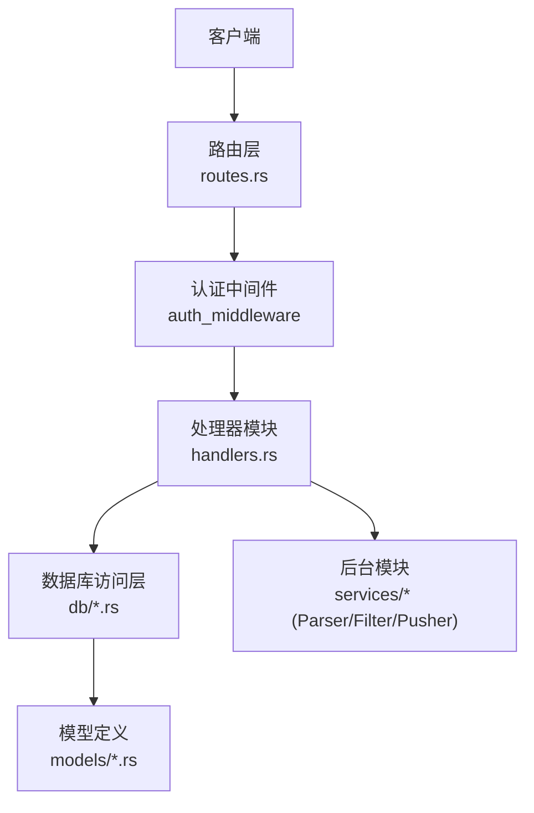
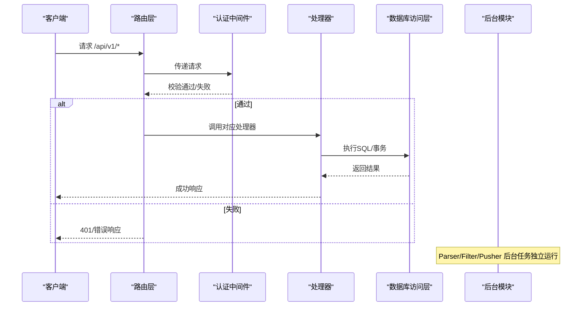
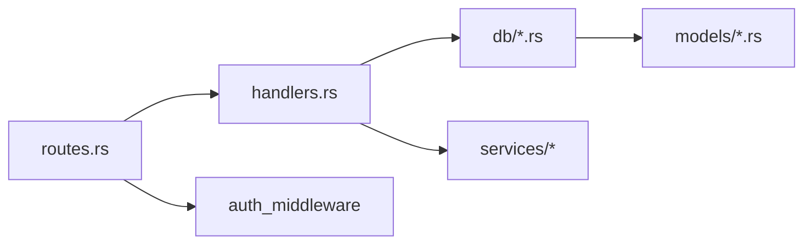

# 内容管理API

<cite>
**本文引用的文件**
- [README.md](file://README.md)
- [src/main.rs](file://src/main.rs)
- [src/routes.rs](file://src/routes.rs)
- [src/handlers.rs](file://src/handlers.rs)
- [docs/apis/token-api.md](file://docs/apis/token-api.md)
- [docs/plans/04-crud-apis.md](file://docs/plans/04-crud-apis.md)
- [docs/plans/05-query-apis-and-background-modules.md](file://docs/plans/05-query-apis-and-background-modules.md)
- [src/models/article.rs](file://src/models/article.rs)
- [src/models/source.rs](file://src/models/source.rs)
- [src/models/keyword.rs](file://src/models/keyword.rs)
- [src/models/channel.rs](file://src/models/channel.rs)
- [src/db/article.rs](file://src/db/article.rs)
- [src/db/source.rs](file://src/db/source.rs)
- [src/db/keyword.rs](file://src/db/keyword.rs)
- [src/db/channel.rs](file://src/db/channel.rs)
</cite>

## 目录
1. [简介](#简介)
2. [项目结构](#项目结构)
3. [核心组件](#核心组件)
4. [架构总览](#架构总览)
5. [详细组件分析](#详细组件分析)
6. [依赖关系分析](#依赖关系分析)
7. [性能考虑](#性能考虑)
8. [故障排查指南](#故障排查指南)
9. [结论](#结论)
10. [附录](#附录)

## 简介
本文件为“AI热点监控系统”的内容管理API综合文档，覆盖文章、数据源、关键词、推送渠道等核心实体的CRUD与查询端点，以及分页、过滤、排序、搜索能力；同时说明系统控制端点（如手动触发过滤/推送）、后台模块（Parser/Filter/Pusher）与认证授权机制。文档以仓库现有实现与设计文档为基础，提供端点定义、请求/响应结构、错误处理与最佳实践建议。

## 项目结构
后端采用 Axum + SQLite + sqlx 架构，路由集中于 routes.rs，处理器模块化组织，模型与数据库访问层分离，配合统一的认证中间件与错误响应格式。

图表来源
- [src/routes.rs:14-50](file://src/routes.rs#L14-L50)
- [src/handlers.rs:1-6](file://src/handlers.rs#L1-L6)

章节来源
- [README.md:216-257](file://README.md#L216-L257)
- [src/routes.rs:14-50](file://src/routes.rs#L14-L50)

## 核心组件
- 路由与中间件：集中注册 /api/v1/* 路由，并挂载认证中间件；健康检查 /health 免认证。
- 处理器模块：按资源划分（token、source、keyword、channel），提供 CRUD 与系统控制端点。
- 数据库访问层：封装各实体的增删改查与复杂查询（如文章分页、过滤）。
- 模型层：定义请求/响应结构与查询参数。
- 后台模块：Parser（RSS定时采集）、Filter（关键词匹配+热点检测）、Pusher（Webhook推送+重试）。

章节来源
- [src/routes.rs:14-50](file://src/routes.rs#L14-L50)
- [src/handlers.rs:1-6](file://src/handlers.rs#L1-L6)
- [docs/plans/05-query-apis-and-background-modules.md:324-503](file://docs/plans/05-query-apis-and-background-modules.md#L324-L503)

## 架构总览
API 路由与中间件层负责统一认证与CORS，处理器层对接数据库访问层，后台模块独立运行并通过数据库状态驱动。

图表来源
- [src/routes.rs:14-50](file://src/routes.rs#L14-L50)
- [src/main.rs:63-96](file://src/main.rs#L63-L96)

## 详细组件分析

### 认证与Token管理
- 认证方式：Bearer Token，除 /health 外所有 /api/v1/* 需认证。
- Token 管理端点：
  - POST /api/v1/tokens：创建Token（返回明文一次）
  - GET /api/v1/tokens：列出Token（不返回明文）
  - POST /api/v1/tokens/revoke/{id}：撤销Token（软删除）

请求/响应与错误格式参考：
- 统一错误响应结构与状态码映射
- 统一成功响应结构（200/201含data，204无响应体）

章节来源
- [README.md:123-203](file://README.md#L123-L203)
- [docs/apis/token-api.md:40-198](file://docs/apis/token-api.md#L40-L198)

### 数据源管理（Source）
- 端点
  - GET /api/v1/sources：列表（按创建时间倒序）
  - POST /api/v1/sources：创建
  - POST /api/v1/sources/{id}/update：更新
  - POST /api/v1/sources/{id}/delete：删除
  - POST /api/v1/sources/{id}/fetch：手动触发采集（重置 last_fetched_at）

请求体字段（创建/更新）：
- type: 字符串，数据源类型（如 rss）
- name: 字符串
- url: 字符串
- interval_seconds: 整数（秒），默认 300
- config: JSON字符串，配置项

响应体字段：
- id、type、name、url、config、enabled、interval_seconds、last_fetched_at、created_at、updated_at

章节来源
- [docs/plans/04-crud-apis.md:16-240](file://docs/plans/04-crud-apis.md#L16-L240)
- [src/models/source.rs:5-38](file://src/models/source.rs#L5-L38)
- [src/db/source.rs:5-126](file://src/db/source.rs#L5-L126)

### 关键词管理（Keyword）
- 端点
  - GET /api/v1/keywords：列表（按创建时间倒序）
  - POST /api/v1/keywords：创建
  - POST /api/v1/keywords/{id}/update：更新
  - POST /api/v1/keywords/{id}/delete：删除

请求体字段（创建/更新）：
- word: 字符串
- case_sensitive: 布尔
- std_multiplier: 浮点数（默认 2.0）
- min_hot_count: 整数（默认 3）

响应体字段：
- id、word、case_sensitive、enabled、std_multiplier、min_hot_count、created_at

章节来源
- [docs/plans/04-crud-apis.md:243-362](file://docs/plans/04-crud-apis.md#L243-L362)
- [src/models/keyword.rs:5-32](file://src/models/keyword.rs#L5-L32)
- [src/db/keyword.rs:5-115](file://src/db/keyword.rs#L5-L115)

### 推送渠道管理（Channel）
- 端点
  - GET /api/v1/channels：列表（按 id 排序）
  - POST /api/v1/channels：创建
  - POST /api/v1/channels/{id}/update：更新
  - POST /api/v1/channels/{id}/delete：删除

请求体字段（创建/更新）：
- name: 字符串
- channel_type: 字符串（默认 webhook）
- config: JSON字符串（如包含 webhook url）

响应体字段：
- id、name、channel_type、config、enabled

章节来源
- [docs/plans/04-crud-apis.md:365-467](file://docs/plans/04-crud-apis.md#L365-L467)
- [src/models/channel.rs:4-26](file://src/models/channel.rs#L4-L26)
- [src/db/channel.rs:5-94](file://src/db/channel.rs#L5-L94)

### 文章查询与系统控制（计划中）
- 文章列表（分页+过滤）
  - GET /api/v1/articles
  - 查询参数：page、per_page（最大100）、source_id、processed（true/false）
  - 响应：data.items、data.total、data.page、data.per_page
- 热点事件列表
  - GET /api/v1/hotspots
  - 查询参数：page、per_page、keyword_id
- 某热点的推送记录
  - GET /api/v1/hotspots/{id}/push-records
- 关键词近N小时计数曲线
  - GET /api/v1/trend/{keyword_id}?hours=N
- 系统控制
  - POST /api/v1/trigger/filter：手动运行过滤器
  - POST /api/v1/trigger/pusher：手动运行推送器

章节来源
- [docs/plans/05-query-apis-and-background-modules.md:18-290](file://docs/plans/05-query-apis-and-background-modules.md#L18-L290)

### 后台模块（Parser/Filter/Pusher）
- Parser：按数据源间隔扫描，RSS解析入库，去重插入，更新 last_fetched_at。
- Filter：批量处理未处理文章，Aho-Corasick匹配，小时桶计数，统计异常检测，生成热点事件并写入推送记录。
- Pusher：轮询待推送记录，按渠道类型发送Webhook，指数退避重试。

章节来源
- [docs/plans/05-query-apis-and-background-modules.md:324-800](file://docs/plans/05-query-apis-and-background-modules.md#L324-L800)

## 依赖关系分析
- 路由层依赖处理器模块；处理器层依赖数据库访问层；数据库访问层依赖模型层。
- 认证中间件贯穿 /api/v1/* 路由。
- 后台模块独立运行，通过数据库状态推进流程。

图表来源
- [src/routes.rs:14-50](file://src/routes.rs#L14-L50)
- [src/handlers.rs:1-6](file://src/handlers.rs#L1-L6)

章节来源
- [src/routes.rs:14-50](file://src/routes.rs#L14-L50)

## 性能考虑
- 分页与过滤
  - 文章列表支持按 source_id 与 processed 过滤，避免全表扫描。
  - per_page 最大限制为 100，防止过大负载。
- 并发与限流
  - Parser 使用信号量限制最大并发抓取数。
- 批处理
  - Filter 对未处理文章按批次处理，减少内存压力。
- 索引建议（通用实践）
  - 在 articles.source_id、articles.processed_at、hot_events.keyword_id、push_records.status 等常用过滤列上建立索引可显著提升查询性能。
- 日志与可观测性
  - 后台模块使用日志记录关键事件，便于定位性能瓶颈。

章节来源
- [docs/plans/05-query-apis-and-background-modules.md:324-503](file://docs/plans/05-query-apis-and-background-modules.md#L324-L503)
- [src/db/article.rs:31-95](file://src/db/article.rs#L31-L95)

## 故障排查指南
- 认证失败（401 UNAUTHORIZED）
  - 检查 Authorization 头是否为 Bearer Token，Token 是否存在、未过期、未撤销。
- 资源不存在（404 NOT_FOUND）
  - 检查资源 ID 是否正确，如删除后再次访问。
- 冲突（409 CONFLICT）
  - 如关键词唯一约束冲突，确保 word 唯一。
- 数据库错误（500 DATABASE_ERROR/INTERNAL_ERROR）
  - 查看服务端日志，确认数据库连接与迁移是否完成。
- 健康检查
  - GET /health 用于快速判断服务可用性。

章节来源
- [README.md:173-203](file://README.md#L173-L203)

## 结论
本API围绕“采集—过滤—推送”流水线，提供数据源、关键词、推送渠道的管理能力与文章、热点、趋势的查询接口，并通过后台模块实现自动化处理。建议在生产环境完善索引、接入监控与日志审计，结合 Token 权限与最小权限原则保障安全。

## 附录

### 端点一览与规范
- 认证
  - 除 /health 外，所有 /api/v1/* 需 Bearer Token
- 统一响应
  - 成功：200/201 返回 { "data": ... }；204 无响应体
  - 错误：{ "error": { "code": "...", "message": "..." } }

章节来源
- [README.md:123-203](file://README.md#L123-L203)

### 数据模型与查询参数
- 文章查询参数
  - page、per_page、source_id、processed
- 热点查询参数
  - page、per_page、keyword_id
- 趋势查询参数
  - hours（默认24）

章节来源
- [src/models/article.rs:18-25](file://src/models/article.rs#L18-L25)
- [docs/plans/05-query-apis-and-background-modules.md:175-181](file://docs/plans/05-query-apis-and-background-modules.md#L175-L181)