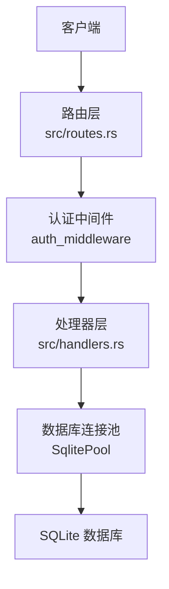
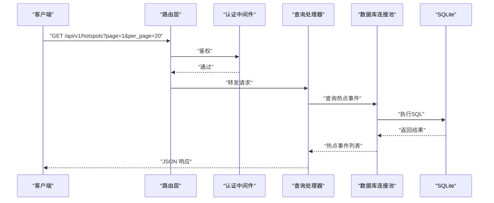
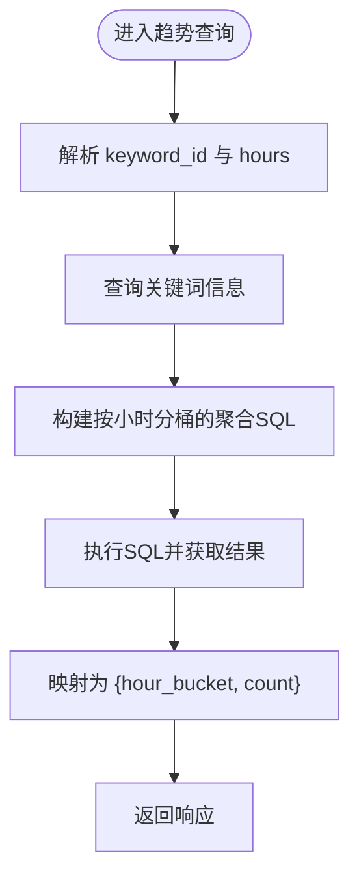
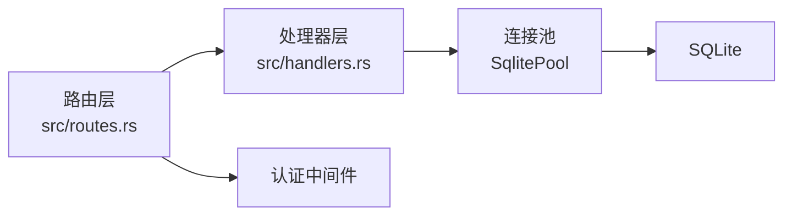

# 分析查询API

<cite>
**本文档引用的文件**
- [routes.rs](file://src/routes.rs)
- [handlers.rs](file://src/handlers.rs)
- [db.rs](file://src/db.rs)
- [05-query-apis-and-background-modules.md](file://docs/plans/05-query-apis-and-background-modules.md)
</cite>

## 目录
1. [简介](#简介)
2. [项目结构](#项目结构)
3. [核心组件](#核心组件)
4. [架构总览](#架构总览)
5. [详细组件分析](#详细组件分析)
6. [依赖关系分析](#依赖关系分析)
7. [性能考虑](#性能考虑)
8. [故障排查指南](#故障排查指南)
9. [结论](#结论)
10. [附录](#附录)

## 简介
本文件面向“分析查询API”的目标，系统性梳理项目中与热点事件、关键词分析、推送记录以及趋势分析相关的查询端点与后端实现思路。文档覆盖以下主题：
- 热点事件查询、关键词趋势曲线、热点推送记录查询
- 聚合查询、时间序列分析与统计计算的API接口
- 高级查询语法、过滤器组合与结果集优化建议
- 实时监控、趋势分析与预测能力说明
- 数据延迟、缓存策略与性能调优建议
- 图表数据格式、数据可视化接口与报告生成思路
- 查询优化技巧与大数据量处理方案

## 项目结构
项目采用基于模块的分层组织，查询API位于路由层与处理器层之间，数据库连接通过共享状态传递。核心结构如下：
- 路由定义：集中于路由模块，统一挂载认证中间件与CORS层
- 处理器模块：按资源类型划分（token、source、keyword、channel），查询相关逻辑在后续计划中补充
- 数据访问：通过共享的数据库连接池进行SQL操作
- 后台模块：Parser/Filter/Pusher负责数据采集、关键词匹配与热点检测、推送通知

**图示来源**
- [routes.rs:14-50](file://src/routes.rs#L14-L50)
- [db.rs:11-25](file://src/db.rs#L11-L25)

**章节来源**
- [routes.rs:14-50](file://src/routes.rs#L14-L50)
- [db.rs:11-25](file://src/db.rs#L11-L25)

## 核心组件
- 路由与中间件
  - 路由统一挂载认证中间件与CORS层，提供健康检查与API前缀
  - 状态对象包含数据库连接池与应用配置
- 数据库连接池初始化
  - 初始化SQLite连接池，启用WAL模式与外键约束，限制最大连接数
- 查询API（计划中）
  - 文章列表（分页+过滤）
  - 热点事件列表（分页+过滤）
  - 热点推送记录查询
  - 关键词近N小时计数曲线（时间序列）

**章节来源**
- [routes.rs:14-61](file://src/routes.rs#L14-L61)
- [db.rs:11-25](file://src/db.rs#L11-L25)
- [05-query-apis-and-background-modules.md:18-289](file://docs/plans/05-query-apis-and-background-modules.md#L18-L289)

## 架构总览
查询API的典型请求流程如下：

**图示来源**
- [routes.rs:14-50](file://src/routes.rs#L14-L50)
- [05-query-apis-and-background-modules.md:104-181](file://docs/plans/05-query-apis-and-background-modules.md#L104-L181)

## 详细组件分析

### 端点：文章列表（分页+过滤）
- 方法与路径
  - GET /api/v1/articles
- 查询参数
  - page：页码，默认1，最小为1
  - per_page：每页条数，默认20，最大100
  - source_id：按数据源过滤
  - processed：true=已处理，false=未处理
- 响应结构
  - data.items：文章列表
  - data.total/page/per_page：分页信息
- 实现要点
  - 动态拼接WHERE条件，避免无效过滤
  - 先查总数再查分页数据，保证一致性
  - 使用参数化查询防止注入
- 性能建议
  - 为source_id、processed_at建立索引
  - 控制每页最大值，避免超大数据集一次性返回

**章节来源**
- [05-query-apis-and-background-modules.md:20-103](file://docs/plans/05-query-apis-and-background-modules.md#L20-L103)

### 端点：热点事件列表（分页+过滤）
- 方法与路径
  - GET /api/v1/hotspots
- 查询参数
  - page/per_page：同上
  - keyword_id：按关键词过滤
- 响应结构
  - data.items：热点事件数组，包含id、keyword_id、hour_bucket、count、mean_historical、stddev_historical、created_at
- 实现要点
  - 支持无过滤与按关键词过滤两种分支
  - 使用ORDER BY created_at DESC确保最新热点在前
- 性能建议
  - 为keyword_id、created_at建立复合索引
  - 控制分页范围，避免跨长时间窗口全量扫描

**章节来源**
- [05-query-apis-and-background-modules.md:104-181](file://docs/plans/05-query-apis-and-background-modules.md#L104-L181)

### 端点：热点推送记录查询
- 方法与路径
  - GET /api/v1/hotspots/{id}/push-records
- 路径参数
  - id：热点事件ID
- 响应结构
  - 推送记录数组，包含hot_event_id、channel_id、status、retry_count、next_retry_at等
- 实现要点
  - 按created_at升序排列便于观察时间线
- 性能建议
  - 为hot_event_id建立索引
  - 如需频繁查询，可考虑缓存最近热点的推送记录

**章节来源**
- [05-query-apis-and-background-modules.md:183-199](file://docs/plans/05-query-apis-and-background-modules.md#L183-L199)

### 端点：关键词近N小时计数曲线（时间序列）
- 方法与路径
  - GET /api/v1/trend/{keyword_id}
- 路径参数
  - keyword_id：关键词ID
- 查询参数
  - hours：最近小时数，默认24
- 响应结构
  - keyword_id、keyword、points数组
  - points：每个元素包含hour_bucket（YYYYMMDDHH格式）与count
- 实现要点
  - 使用SQLite的strftime按小时分桶统计
  - 通过时间范围过滤近期文章
- 性能建议
  - 为fetched_at建立索引以加速时间过滤
  - 限制hours范围，避免超长时序扫描
  - 对高频查询可引入轻量缓存（如Redis）

**图示来源**
- [05-query-apis-and-background-modules.md:201-289](file://docs/plans/05-query-apis-and-background-modules.md#L201-L289)

**章节来源**
- [05-query-apis-and-background-modules.md:201-289](file://docs/plans/05-query-apis-and-background-modules.md#L201-L289)

### 系统控制端点（计划中）
- 手动触发过滤器
  - POST /api/v1/trigger/filter
- 手动触发推送器
  - POST /api/v1/trigger/pusher
- 健康检查
  - GET /health（免认证）

这些端点用于运维与调试，便于在需要时强制执行后台任务。

**章节来源**
- [05-query-apis-and-background-modules.md:293-321](file://docs/plans/05-query-apis-and-background-modules.md#L293-L321)

## 依赖关系分析
- 路由层依赖处理器模块，处理器模块依赖数据库连接池
- 认证中间件贯穿所有受保护路由
- 后台模块（Parser/Filter/Pusher）独立运行，与查询API解耦

**图示来源**
- [routes.rs:14-50](file://src/routes.rs#L14-L50)
- [db.rs:11-25](file://src/db.rs#L11-L25)

**章节来源**
- [routes.rs:14-50](file://src/routes.rs#L14-L50)
- [db.rs:11-25](file://src/db.rs#L11-L25)

## 性能考虑
- 数据库层
  - WAL模式提升并发读写性能
  - 外键约束保障数据一致性
  - 建议索引：hot_events(keyword_id, created_at)、push_records(hot_event_id)、articles(fetched_at)
- 查询层
  - 分页与上限控制，避免超大结果集
  - 参数化查询与动态WHERE拼接，减少SQL注入风险
- 缓存策略
  - 对热点趋势与推送记录可引入短期缓存（如Redis），降低数据库压力
  - 缓存失效策略：热点事件更新后主动失效
- 并发与限流
  - 限制每页最大值与查询频率，必要时增加速率限制
- 大数据量处理
  - 时间序列查询限定hours范围
  - 使用游标或时间窗口分批处理

[本节为通用性能建议，无需特定文件来源]

## 故障排查指南
- 认证失败
  - 确认Bearer Token有效且未过期
  - 检查路由是否正确挂载认证中间件
- 数据为空
  - 检查过滤参数是否过于严格
  - 确认后台模块（Parser/Filter/Pusher）正常运行
- 响应缓慢
  - 检查数据库索引是否存在
  - 适当缩小查询范围（如hours、page、per_page）
- 推送记录异常
  - 检查推送渠道配置与Webhook地址
  - 关注重试次数与下次重试时间

**章节来源**
- [routes.rs:14-50](file://src/routes.rs#L14-L50)
- [05-query-apis-and-background-modules.md:744-909](file://docs/plans/05-query-apis-and-background-modules.md#L744-L909)

## 结论
本项目已规划并具备完善的查询API蓝图：文章列表、热点事件、推送记录与趋势曲线四大查询端点，配合系统控制端点与后台模块，形成从数据采集、关键词匹配、热点检测到推送通知的完整链路。建议尽快实现查询处理器模块，并在生产环境引入索引、缓存与限流策略，以获得稳定高效的查询体验。

[本节为总结性内容，无需特定文件来源]

## 附录

### API定义速览
- GET /api/v1/articles
  - 查询参数：page、per_page、source_id、processed
  - 响应：分页的文章列表
- GET /api/v1/hotspots
  - 查询参数：page、per_page、keyword_id
  - 响应：分页的热点事件列表
- GET /api/v1/hotspots/{id}/push-records
  - 响应：该热点的推送记录
- GET /api/v1/trend/{keyword_id}?hours=N
  - 响应：关键词近N小时的计数曲线
- POST /api/v1/trigger/filter
  - 响应：执行结果
- POST /api/v1/trigger/pusher
  - 响应：执行结果
- GET /health
  - 响应：服务健康状态

**章节来源**
- [05-query-apis-and-background-modules.md:18-321](file://docs/plans/05-query-apis-and-background-modules.md#L18-L321)