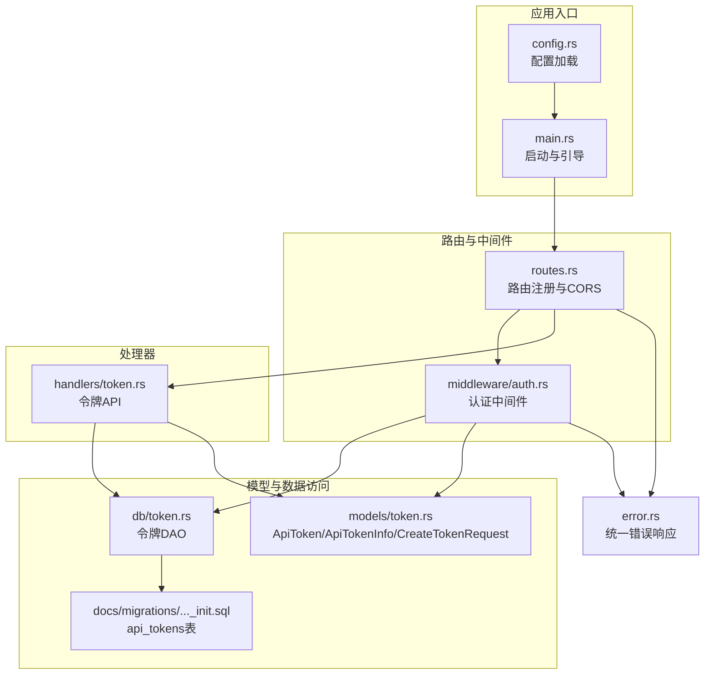
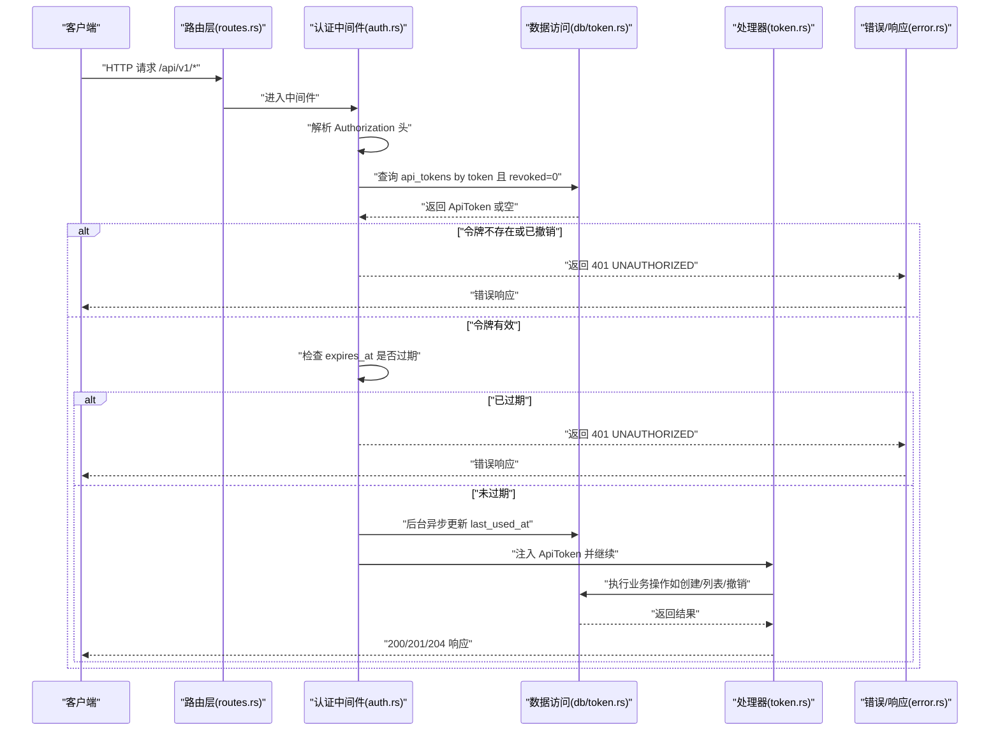
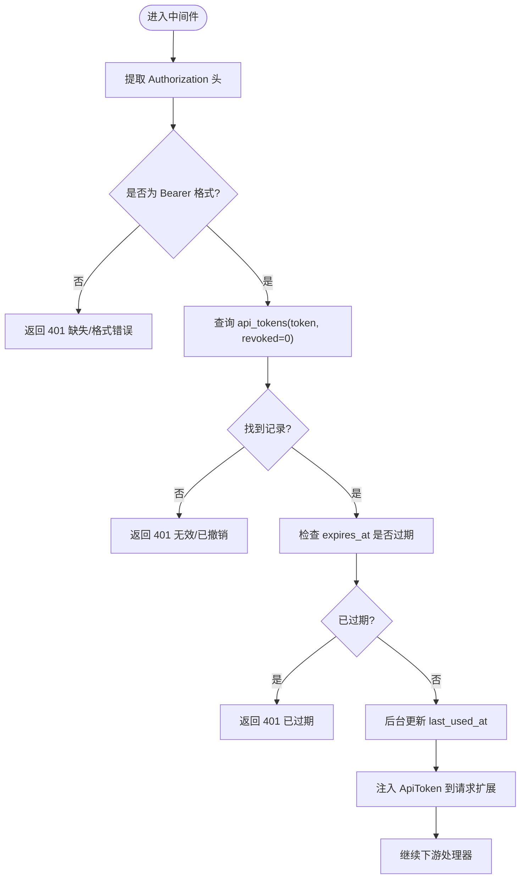
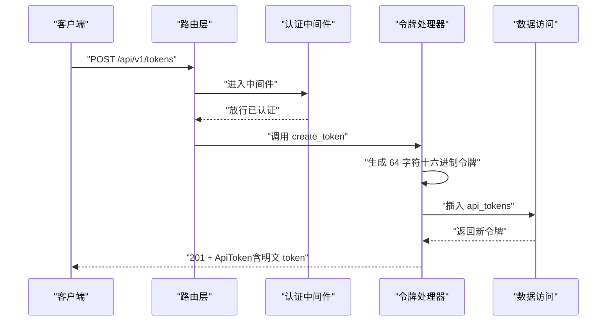
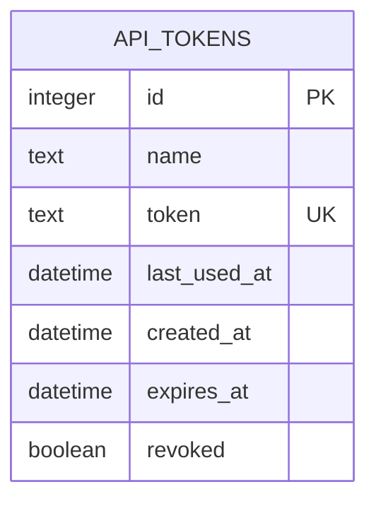
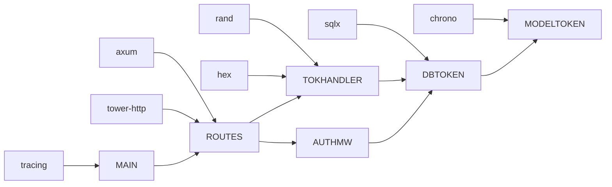

# 认证API

<cite>
**本文引用的文件**
- [src/middleware/auth.rs](file://src/middleware/auth.rs)
- [src/handlers/token.rs](file://src/handlers/token.rs)
- [src/models/token.rs](file://src/models/token.rs)
- [src/db/token.rs](file://src/db/token.rs)
- [src/routes.rs](file://src/routes.rs)
- [src/error.rs](file://src/error.rs)
- [src/config.rs](file://src/config.rs)
- [src/main.rs](file://src/main.rs)
- [docs/apis/token-api.md](file://docs/apis/token-api.md)
- [openspec/specs/token-api/spec.md](file://openspec/specs/token-api/spec.md)
- [openspec/specs/auth-middleware/spec.md](file://openspec/specs/auth-middleware/spec.md)
- [docs/migrations/20260607044921_init.sql](file://docs/migrations/20260607044921_init.sql)
- [Cargo.toml](file://Cargo.toml)
- [config.toml](file://config.toml)
</cite>

## 目录
1. [简介](#简介)
2. [项目结构](#项目结构)
3. [核心组件](#核心组件)
4. [架构总览](#架构总览)
5. [详细组件分析](#详细组件分析)
6. [依赖关系分析](#依赖关系分析)
7. [性能考量](#性能考量)
8. [故障排除指南](#故障排除指南)
9. [结论](#结论)
10. [附录](#附录)

## 简介
本文件为 AI 趋势监控工具（TrendAI Tool）的认证API安全文档，聚焦于基于“API 密钥（令牌）”的认证机制与安全策略。系统采用 Bearer Token 方案，通过中间件在请求进入业务路由前进行令牌提取、有效性校验、过期检查与撤销状态检查，并在成功后将令牌信息注入到请求上下文中供后续处理器使用。

- 令牌生成：创建时生成 64 字符十六进制随机字符串，明文仅在创建时返回一次。
- 存储与查询：令牌存储于 SQLite 表 api_tokens，按唯一索引 token 查询，查询时过滤 revoked=0 的记录。
- 过期与撤销：支持可选的过期时间字段；撤销采用软删除（revoked=1），中间件拒绝已撤销令牌。
- 中间件：统一保护 /api/v1/* 路由，健康检查 /health 不需要认证。
- CORS：全局启用宽松跨域策略（开发用途）。
- OAuth/第三方/单点登录：当前未实现，不涉及 JWT 签名与第三方 OIDC/OAuth 集成。

## 项目结构
认证相关代码主要分布在以下模块：
- 中间件层：认证中间件负责令牌提取与校验
- 处理器层：令牌管理 API（创建、列出、撤销）
- 模型层：令牌数据结构与序列化
- 数据访问层：令牌 CRUD 与统计查询
- 路由层：注册中间件与 API 路由
- 错误与响应：统一错误格式与状态码
- 配置与启动：初始令牌引导、数据库迁移与监听地址

图表来源
- [src/main.rs:1-96](file://src/main.rs#L1-L96)
- [src/routes.rs:1-61](file://src/routes.rs#L1-L61)
- [src/middleware/auth.rs:1-60](file://src/middleware/auth.rs#L1-L60)
- [src/handlers/token.rs:1-66](file://src/handlers/token.rs#L1-L66)
- [src/models/token.rs:1-46](file://src/models/token.rs#L1-L46)
- [src/db/token.rs:1-107](file://src/db/token.rs#L1-L107)
- [docs/migrations/20260607044921_init.sql:1-118](file://docs/migrations/20260607044921_init.sql#L1-L118)
- [src/error.rs:1-79](file://src/error.rs#L1-L79)

章节来源
- [src/main.rs:1-96](file://src/main.rs#L1-L96)
- [src/routes.rs:1-61](file://src/routes.rs#L1-L61)
- [src/middleware/auth.rs:1-60](file://src/middleware/auth.rs#L1-L60)
- [src/handlers/token.rs:1-66](file://src/handlers/token.rs#L1-L66)
- [src/models/token.rs:1-46](file://src/models/token.rs#L1-L46)
- [src/db/token.rs:1-107](file://src/db/token.rs#L1-L107)
- [docs/migrations/20260607044921_init.sql:1-118](file://docs/migrations/20260607044921_init.sql#L1-L118)
- [src/error.rs:1-79](file://src/error.rs#L1-L79)

## 核心组件
- 认证中间件（Bearer Token）
  - 提取 Authorization 头中的 Bearer 令牌
  - 查询数据库 api_tokens，要求 revoked=0
  - 检查 expires_at 是否过期
  - 异步更新 last_used_at
  - 将 ApiToken 注入请求扩展，供下游处理器使用
- 令牌管理 API
  - 创建：生成 64 字符十六进制令牌，首次返回明文
  - 列表：返回 ApiTokenInfo，隐藏 token 明文
  - 撤销：软删除（revoked=1）
- 统一错误与响应
  - 错误类型覆盖 400/401/404/409/500 等
  - 响应体包含标准化 error.code 与 message
- 路由与安全层
  - /api/v1/* 受中间件保护
  - /health 免认证
  - 全局启用宽松 CORS（开发用途）

章节来源
- [src/middleware/auth.rs:14-59](file://src/middleware/auth.rs#L14-L59)
- [src/handlers/token.rs:13-66](file://src/handlers/token.rs#L13-L66)
- [src/error.rs:8-50](file://src/error.rs#L8-L50)
- [src/routes.rs:14-50](file://src/routes.rs#L14-L50)

## 架构总览
下图展示从客户端到处理器的整体调用链与安全控制点：

图表来源
- [src/routes.rs:14-44](file://src/routes.rs#L14-L44)
- [src/middleware/auth.rs:18-59](file://src/middleware/auth.rs#L18-L59)
- [src/db/token.rs:40-48](file://src/db/token.rs#L40-L48)
- [src/handlers/token.rs:18-66](file://src/handlers/token.rs#L18-L66)
- [src/error.rs:23-50](file://src/error.rs#L23-L50)

## 详细组件分析

### 认证中间件（Bearer Token）
- 功能要点
  - 从 Authorization 头提取 Bearer 令牌
  - 数据库查询非撤销令牌
  - 过期时间比较（UTC）
  - 后台更新 last_used_at（fire-and-forget）
  - 将 ApiToken 注入请求扩展
- 安全影响
  - 令牌必须通过 HTTPS 传输，避免中间人窃听
  - 令牌明文仅在创建时返回，建议立即保存
  - 支持过期时间与撤销，降低长期泄露风险
- 错误路径
  - 缺失或格式错误的 Authorization 头
  - 无效或已撤销的令牌
  - 已过期的令牌

图表来源
- [src/middleware/auth.rs:18-59](file://src/middleware/auth.rs#L18-L59)
- [src/db/token.rs:40-48](file://src/db/token.rs#L40-L48)

章节来源
- [src/middleware/auth.rs:14-59](file://src/middleware/auth.rs#L14-L59)
- [openspec/specs/auth-middleware/spec.md:1-88](file://openspec/specs/auth-middleware/spec.md#L1-L88)

### 令牌管理 API
- 创建令牌
  - 生成 64 字符十六进制随机字符串
  - 插入 api_tokens，返回完整 ApiToken（含明文 token）
- 列出令牌
  - 返回 ApiTokenInfo，隐藏 token 明文
  - 按 created_at 降序排列
- 撤销令牌
  - 软删除（revoked=1）
  - 若不存在则返回 404

图表来源
- [src/handlers/token.rs:18-30](file://src/handlers/token.rs#L18-L30)
- [src/db/token.rs:6-20](file://src/db/token.rs#L6-L20)
- [docs/apis/token-api.md:62-120](file://docs/apis/token-api.md#L62-L120)

章节来源
- [src/handlers/token.rs:13-66](file://src/handlers/token.rs#L13-L66)
- [openspec/specs/token-api/spec.md:1-76](file://openspec/specs/token-api/spec.md#L1-L76)
- [docs/apis/token-api.md:62-198](file://docs/apis/token-api.md#L62-L198)

### 数据模型与数据库
- ApiToken
  - 字段：id、name、token、last_used_at、created_at、expires_at、revoked
- ApiTokenInfo
  - 列表响应使用，不含 token 明文
- CreateTokenRequest
  - name（必填）、expires_at（可选）
- 数据库表 api_tokens
  - 唯一键：token
  - 默认值：revoked=0、created_at=当前时间
  - 索引：按 created_at 降序用于列表排序

图表来源
- [src/models/token.rs:5-44](file://src/models/token.rs#L5-L44)
- [docs/migrations/20260607044921_init.sql:4-12](file://docs/migrations/20260607044921_init.sql#L4-L12)

章节来源
- [src/models/token.rs:1-46](file://src/models/token.rs#L1-L46)
- [src/db/token.rs:22-28](file://src/db/token.rs#L22-L28)
- [docs/migrations/20260607044921_init.sql:1-118](file://docs/migrations/20260607044921_init.sql#L1-L118)

### 路由与安全策略
- 路由
  - /api/v1/*：受认证中间件保护
  - /health：免认证健康检查
- CORS
  - 使用 CorsLayer::permissive（开发用途）
- 中间件注入
  - 在 /api/v1 命名空间上挂载 auth_middleware

章节来源
- [src/routes.rs:14-50](file://src/routes.rs#L14-L50)
- [docs/apis/token-api.md:42-58](file://docs/apis/token-api.md#L42-L58)

### 错误处理与响应
- 错误类型
  - 400：请求错误
  - 401：未授权（缺失/格式错误/无效/已撤销/已过期）
  - 404：资源不存在
  - 409：冲突（如唯一约束）
  - 500：内部错误/数据库错误
- 响应体
  - 包含标准化 error.code 与 message 字段

章节来源
- [src/error.rs:8-50](file://src/error.rs#L8-L50)
- [docs/apis/token-api.md:17-37](file://docs/apis/token-api.md#L17-L37)

## 依赖关系分析
- 框架与库
  - web：axum、tower-http（CORS）
  - 数据库：sqlx（SQLite）
  - 时间：chrono
  - 日志：tracing/tracing-subscriber
  - 随机与编码：rand、hex
- 模块耦合
  - routes 依赖 middleware 与 handlers
  - handlers 依赖 models 与 db
  - middleware 依赖 models 与 db
  - db 依赖 models 与 sqlx

图表来源
- [Cargo.toml:6-44](file://Cargo.toml#L6-L44)
- [src/main.rs:1-96](file://src/main.rs#L1-L96)
- [src/routes.rs:1-61](file://src/routes.rs#L1-61)
- [src/handlers/token.rs:1-66](file://src/handlers/token.rs#L1-L66)
- [src/middleware/auth.rs:1-60](file://src/middleware/auth.rs#L1-L60)
- [src/db/token.rs:1-107](file://src/db/token.rs#L1-L107)
- [src/models/token.rs:1-46](file://src/models/token.rs#L1-L46)

章节来源
- [Cargo.toml:6-44](file://Cargo.toml#L6-L44)
- [src/main.rs:1-96](file://src/main.rs#L1-L96)
- [src/routes.rs:1-61](file://src/routes.rs#L1-L61)

## 性能考量
- 异步更新 last_used_at
  - 使用 tokio::spawn 后台更新，避免阻塞响应
- 查询优化
  - api_tokens.token 唯一键，查询命中率高
  - 列表按 created_at DESC，配合索引提升排序效率
- 并发与连接池
  - 使用 sqlx::SqlitePool，注意 SQLite 在高并发写入场景的限制
- CORS
  - 开发环境 permissive，生产建议限定来源与方法

章节来源
- [src/middleware/auth.rs:48-53](file://src/middleware/auth.rs#L48-L53)
- [src/db/token.rs:22-28](file://src/db/token.rs#L22-L28)
- [docs/migrations/20260607044921_init.sql:4-12](file://docs/migrations/20260607044921_init.sql#L4-L12)

## 故障排除指南
- 401 未授权
  - 检查 Authorization 头是否为 Bearer 格式
  - 确认令牌存在于 api_tokens 且 revoked=0
  - 核对 expires_at 是否已过期
  - 确保使用正确的明文令牌（仅创建时可见）
- 404 未找到
  - 撤销或删除后再次使用同一令牌会触发 401
  - 检查令牌 ID 是否正确
- 500 内部错误
  - 查看服务端日志（tracing 输出）
  - 检查数据库连接与迁移是否完成
- CORS 问题
  - 开发环境允许任意来源，生产需配置白名单
- 初始令牌
  - 首次启动会在日志中打印初始令牌（或使用配置项）
  - 如丢失，请重新创建或恢复数据库

章节来源
- [src/middleware/auth.rs:23-46](file://src/middleware/auth.rs#L23-L46)
- [src/db/token.rs:40-48](file://src/db/token.rs#L40-L48)
- [src/main.rs:29-61](file://src/main.rs#L29-L61)
- [src/error.rs:23-50](file://src/error.rs#L23-L50)
- [src/routes.rs:49](file://src/routes.rs#L49)

## 结论
本认证体系以“API 密钥（令牌）+ Bearer”为核心，结合数据库层面的撤销与过期控制，提供了基础而实用的访问控制能力。中间件在请求进入业务逻辑前统一拦截，确保 /api/v1/* 的安全性；同时通过后台更新 last_used_at 与列表隐藏明文等设计，兼顾了可用性与安全性。对于生产部署，建议补充 HTTPS、严格的 CORS 策略、令牌轮换与审计日志等加固措施。

## 附录

### API 接口清单与安全要点
- POST /api/v1/tokens
  - 安全要点：返回明文令牌一次；建议立即保存；支持设置过期时间
- GET /api/v1/tokens
  - 安全要点：返回 ApiTokenInfo，隐藏 token 明文
- POST /api/v1/tokens/revoke/{id}
  - 安全要点：软删除（revoked=1），撤销后不可再用于认证
- GET /health
  - 安全要点：免认证健康检查

章节来源
- [docs/apis/token-api.md:42-198](file://docs/apis/token-api.md#L42-L198)
- [openspec/specs/token-api/spec.md:1-76](file://openspec/specs/token-api/spec.md#L1-L76)

### 安全头、CORS 与 HTTPS 建议
- 安全头（建议）
  - Content-Security-Policy、Strict-Transport-Security、X-Frame-Options、X-Content-Type-Options
- CORS
  - 当前为宽松策略（开发用途），生产需限定 Origin、Methods、Headers
- HTTPS
  - 生产环境必须启用 TLS，防止令牌在传输中被窃取

章节来源
- [src/routes.rs:49](file://src/routes.rs#L49)
- [Cargo.toml:6-44](file://Cargo.toml#L6-L44)

### OAuth、JWT 与单点登录现状
- 当前实现
  - 无 OAuth/OIDC 集成
  - 无 JWT 签名与验证逻辑
  - 无单点登录支持
- 扩展建议
  - 引入独立的 OIDC/OAuth 中间件
  - 使用专用 JWT 库进行签名校验
  - 设计会话与刷新令牌流程

章节来源
- [src/middleware/auth.rs:14-59](file://src/middleware/auth.rs#L14-L59)
- [src/handlers/token.rs:13-66](file://src/handlers/token.rs#L13-L66)

### 配置参考
- config.toml
  - server.host/port：监听地址与端口
  - database.path：SQLite 文件路径
  - auth.initial_token：初始令牌（可选）

章节来源
- [config.toml:1-27](file://config.toml#L1-L27)
- [src/config.rs:26-28](file://src/config.rs#L26-L28)