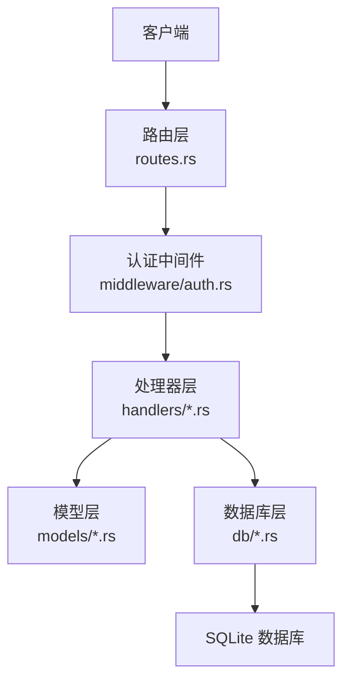
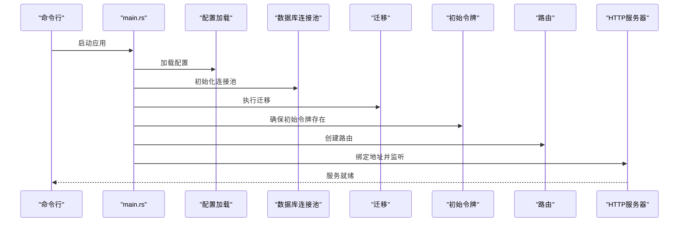
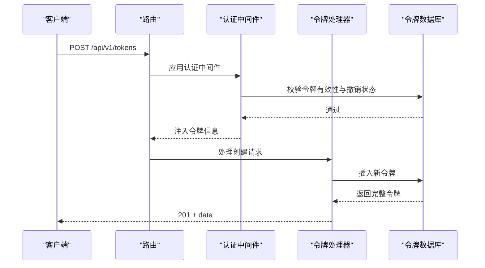
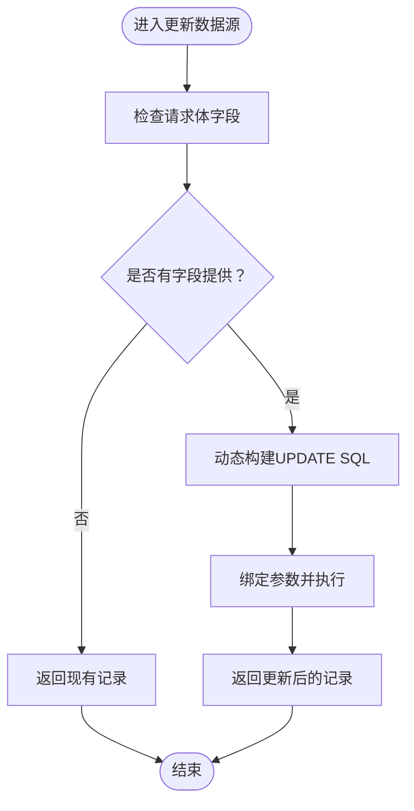
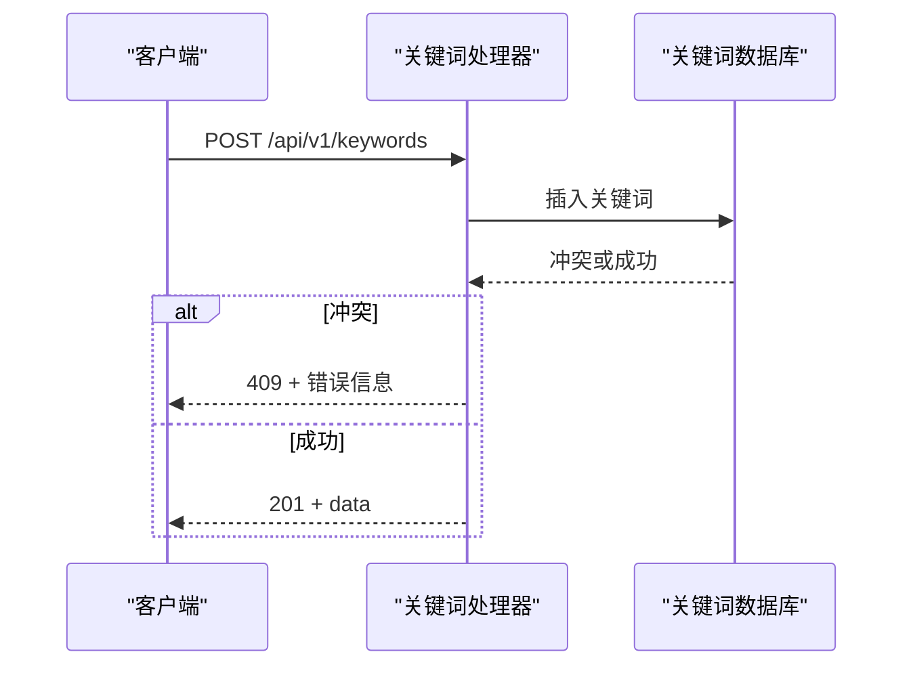
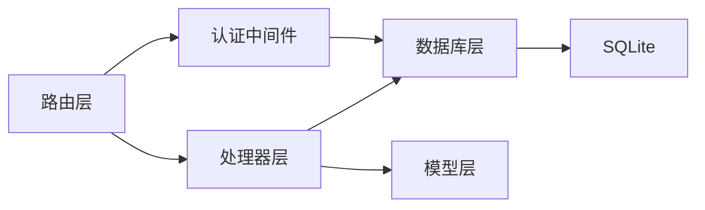

# API接口文档

<cite>
**本文档引用的文件**
- [main.rs](file://src/main.rs)
- [routes.rs](file://src/routes.rs)
- [auth.rs](file://src/middleware/auth.rs)
- [error.rs](file://src/error.rs)
- [config.rs](file://src/config.rs)
- [token.rs（处理器）](file://src/handlers/token.rs)
- [source.rs（处理器）](file://src/handlers/source.rs)
- [keyword.rs（处理器）](file://src/handlers/keyword.rs)
- [channel.rs（处理器）](file://src/handlers/channel.rs)
- [token.rs（模型）](file://src/models/token.rs)
- [source.rs（模型）](file://src/models/source.rs)
- [keyword.rs（模型）](file://src/models/keyword.rs)
- [channel.rs（模型）](file://src/models/channel.rs)
- [token.rs（数据库）](file://src/db/token.rs)
- [source.rs（数据库）](file://src/db/source.rs)
- [keyword.rs（数据库）](file://src/db/keyword.rs)
- [channel.rs（数据库）](file://src/db/channel.rs)
- [token-api.md](file://docs/apis/token-api.md)
- [20260607044921_init.sql](file://docs/migrations/20260607044921_init.sql)
</cite>

## 目录
1. [简介](#简介)
2. [项目结构](#项目结构)
3. [核心组件](#核心组件)
4. [架构总览](#架构总览)
5. [详细组件分析](#详细组件分析)
6. [依赖关系分析](#依赖关系分析)
7. [性能考虑](#性能考虑)
8. [故障排除指南](#故障排除指南)
9. [结论](#结论)
10. [附录](#附录)

## 简介
本文件为“AI趋势监控系统”的完整API接口文档，覆盖认证与令牌管理、数据源管理、关键词管理、推送渠道管理等全部RESTful端点。文档包含：
- 统一的请求/响应模式与错误格式
- 认证机制与权限控制
- 参数校验规则与安全最佳实践
- API版本管理策略与向后兼容说明
- curl与JavaScript调用示例路径

系统采用Axum框架，基于SQLite存储，提供/v1版本的API，并通过中间件实现统一的Bearer Token认证。

## 项目结构
后端采用模块化组织：路由层负责URL映射与中间件装配；处理器层处理业务逻辑；数据库层封装SQL操作；模型层定义数据结构；中间件层提供认证与错误处理。

图表来源
- [routes.rs:14-50](file://src/routes.rs#L14-L50)
- [auth.rs:18-59](file://src/middleware/auth.rs#L18-L59)
- [token.rs（处理器）:13-66](file://src/handlers/token.rs#L13-L66)
- [source.rs（处理器）:12-91](file://src/handlers/source.rs#L12-L91)
- [keyword.rs（处理器）:12-82](file://src/handlers/keyword.rs#L12-L82)
- [channel.rs（处理器）:12-71](file://src/handlers/channel.rs#L12-L71)

章节来源
- [routes.rs:14-50](file://src/routes.rs#L14-L50)
- [config.rs:52-59](file://src/config.rs#L52-L59)

## 核心组件
- 路由与版本：所有业务API位于/nest("/api/v1", ...)下，当前版本为v1。
- 认证中间件：全局启用Bearer Token认证，从Authorization头提取令牌并校验有效性、是否撤销、是否过期。
- 错误处理：统一返回结构，包含错误码与消息；数据库异常自动转换为内部错误。
- 响应包装：成功响应统一包裹在"data"字段中，状态码遵循REST语义。

章节来源
- [routes.rs:14-50](file://src/routes.rs#L14-L50)
- [auth.rs:18-59](file://src/middleware/auth.rs#L18-L59)
- [error.rs:23-79](file://src/error.rs#L23-L79)

## 架构总览
系统启动时执行初始化流程：加载配置、建立数据库连接池、运行迁移、确保至少存在一个初始令牌、构建路由并启动服务。

图表来源
- [main.rs:63-95](file://src/main.rs#L63-L95)
- [routes.rs:14-50](file://src/routes.rs#L14-L50)

章节来源
- [main.rs:63-95](file://src/main.rs#L63-L95)

## 详细组件分析

### 认证与令牌管理API
- 版本：/api/v1
- 中间件：全局Bearer Token认证，支持过期检查与最后使用时间更新
- 端点：
  - POST /api/v1/tokens — 创建新令牌
  - GET /api/v1/tokens — 列出令牌（不包含明文）
  - POST /api/v1/tokens/revoke/{id} — 撤销令牌（软删除）

请求/响应模式
- 请求体：JSON
- 成功响应：201（创建）、200（查询/更新）、204（删除）
- 错误响应：统一错误体，包含错误码与消息

curl示例路径
- 创建令牌：[curl创建令牌](file://docs/apis/token-api.md)
- 列出令牌：[curl列出令牌](file://docs/apis/token-api.md)
- 撤销令牌：[curl撤销令牌](file://docs/apis/token-api.md)

JavaScript示例路径
- 创建令牌：[JavaScript创建令牌](file://docs/apis/token-api.md)
- 列出令牌：[JavaScript列出令牌](file://docs/apis/token-api.md)
- 撤销令牌：[JavaScript撤销令牌](file://docs/apis/token-api.md)

参数与校验
- 创建令牌：必填name；可选expires_at（UTC时间）
- 列出令牌：无请求体
- 撤销令牌：路径参数{id}必须为存在的令牌ID

权限与安全
- 全局中间件强制Bearer认证
- 令牌过期或被撤销将返回未授权
- 令牌明文仅在创建时返回一次，后续列表隐藏

图表来源
- [routes.rs:22-24](file://src/routes.rs#L22-L24)
- [auth.rs:18-59](file://src/middleware/auth.rs#L18-L59)
- [token.rs（处理器）:13-30](file://src/handlers/token.rs#L13-L30)
- [token.rs（数据库）:6-28](file://src/db/token.rs#L6-L28)

章节来源
- [token.rs（处理器）:13-66](file://src/handlers/token.rs#L13-L66)
- [token.rs（模型）:40-46](file://src/models/token.rs#L40-L46)
- [token.rs（数据库）:6-98](file://src/db/token.rs#L6-L98)

### 数据源管理API
- 端点：
  - GET /api/v1/sources — 列出所有数据源
  - POST /api/v1/sources — 创建数据源
  - POST /api/v1/sources/{id}/update — 更新数据源
  - POST /api/v1/sources/{id}/delete — 删除数据源
  - POST /api/v1/sources/{id}/fetch — 触发手动抓取

请求/响应模式
- 请求体：JSON
- 成功响应：201（创建）、200（查询/更新）、204（删除）
- 错误响应：统一错误体

curl示例路径
- 创建数据源：[curl创建数据源](file://src/handlers/source.rs)
- 更新数据源：[curl更新数据源](file://src/handlers/source.rs)
- 删除数据源：[curl删除数据源](file://src/handlers/source.rs)
- 触发抓取：[curl触发抓取](file://src/handlers/source.rs)

JavaScript示例路径
- 创建数据源：[JavaScript创建数据源](file://src/handlers/source.rs)
- 更新数据源：[JavaScript更新数据源](file://src/handlers/source.rs)
- 删除数据源：[JavaScript删除数据源](file://src/handlers/source.rs)
- 触发抓取：[JavaScript触发抓取](file://src/handlers/source.rs)

参数与校验
- 创建：必填type、name、url；可选interval_seconds（默认300）、config（默认空JSON字符串）
- 更新：所有字段可选，仅提供字段生效
- 删除/触发抓取：需要存在对应ID

图表来源
- [source.rs（处理器）:35-54](file://src/handlers/source.rs#L35-L54)
- [source.rs（数据库）:42-93](file://src/db/source.rs#L42-L93)

章节来源
- [source.rs（处理器）:12-91](file://src/handlers/source.rs#L12-L91)
- [source.rs（模型）:21-39](file://src/models/source.rs#L21-L39)
- [source.rs（数据库）:5-126](file://src/db/source.rs#L5-L126)

### 关键词管理API
- 端点：
  - GET /api/v1/keywords — 列出所有关键词
  - POST /api/v1/keywords — 创建关键词
  - POST /api/v1/keywords/{id}/update — 更新关键词
  - POST /api/v1/keywords/{id}/delete — 删除关键词

请求/响应模式
- 请求体：JSON
- 成功响应：201（创建）、200（查询/更新）、204（删除）
- 错误响应：统一错误体

curl示例路径
- 创建关键词：[curl创建关键词](file://src/handlers/keyword.rs)
- 更新关键词：[curl更新关键词](file://src/handlers/keyword.rs)
- 删除关键词：[curl删除关键词](file://src/handlers/keyword.rs)

JavaScript示例路径
- 创建关键词：[JavaScript创建关键词](file://src/handlers/keyword.rs)
- 更新关键词：[JavaScript更新关键词](file://src/handlers/keyword.rs)
- 删除关键词：[JavaScript删除关键词](file://src/handlers/keyword.rs)

参数与校验
- 创建：必填word；可选case_sensitive（默认false）、std_multiplier（默认2.0）、min_hot_count（默认3）
- 更新：所有字段可选
- 删除：需要存在对应ID

冲突处理
- 重复关键词（唯一约束）返回409

图表来源
- [keyword.rs（处理器）:22-43](file://src/handlers/keyword.rs#L22-L43)
- [keyword.rs（数据库）:5-19](file://src/db/keyword.rs#L5-L19)

章节来源
- [keyword.rs（处理器）:12-82](file://src/handlers/keyword.rs#L12-L82)
- [keyword.rs（模型）:1-39](file://src/models/keyword.rs#L1-L39)
- [keyword.rs（数据库）:1-115](file://src/db/keyword.rs#L1-L115)

### 推送渠道管理API
- 端点：
  - GET /api/v1/channels — 列出所有推送渠道
  - POST /api/v1/channels — 创建推送渠道
  - POST /api/v1/channels/{id}/update — 更新推送渠道
  - POST /api/v1/channels/{id}/delete — 删除推送渠道

请求/响应模式
- 请求体：JSON
- 成功响应：201（创建）、200（查询/更新）、204（删除）
- 错误响应：统一错误体

curl示例路径
- 创建推送渠道：[curl创建推送渠道](file://src/handlers/channel.rs)
- 更新推送渠道：[curl更新推送渠道](file://src/handlers/channel.rs)
- 删除推送渠道：[curl删除推送渠道](file://src/handlers/channel.rs)

JavaScript示例路径
- 创建推送渠道：[JavaScript创建推送渠道](file://src/handlers/channel.rs)
- 更新推送渠道：[JavaScript更新推送渠道](file://src/handlers/channel.rs)
- 删除推送渠道：[JavaScript删除推送渠道](file://src/handlers/channel.rs)

参数与校验
- 创建：必填name、config（JSON字符串）；可选channel_type（默认webhook）
- 更新：所有字段可选
- 删除：需要存在对应ID

章节来源
- [channel.rs（处理器）:12-71](file://src/handlers/channel.rs#L12-L71)
- [channel.rs（模型）:1-39](file://src/models/channel.rs#L1-L39)
- [channel.rs（数据库）:1-115](file://src/db/channel.rs#L1-L115)

## 依赖关系分析
- 路由到处理器：路由层将URL映射到具体处理器函数
- 处理器到数据库：处理器调用数据库模块执行CRUD操作
- 认证中间件：对所有受保护端点生效，注入令牌上下文
- 错误处理：统一错误类型与响应格式

图表来源
- [routes.rs:14-50](file://src/routes.rs#L14-L50)
- [auth.rs:18-59](file://src/middleware/auth.rs#L18-L59)
- [handlers.rs:1-6](file://src/handlers.rs#L1-L6)

章节来源
- [handlers.rs:1-6](file://src/handlers.rs#L1-L6)

## 性能考虑
- 认证中间件采用异步非阻塞校验，后台更新last_used_at避免阻塞主请求链路
- 数据库查询按需排序与限制，如令牌列表按创建时间倒序
- 部分更新采用动态SQL拼接，减少不必要的字段写入
- 建议生产环境启用持久化连接池与合适的超时设置

## 故障排除指南
常见错误与处理
- 401 未授权：缺少或无效的Bearer令牌、令牌已撤销、令牌已过期
- 404 资源不存在：请求的ID不存在（令牌、数据源、关键词、推送渠道）
- 409 冲突：关键词重复（唯一约束）
- 500 内部错误：数据库异常或未知错误

统一错误响应格式
- 结构：{"error": {"code": "...", "message": "..."}}
- 状态码：依据错误类型映射至HTTP标准状态码

章节来源
- [error.rs:8-50](file://src/error.rs#L8-L50)
- [auth.rs:23-46](file://src/middleware/auth.rs#L23-L46)

## 结论
本API体系提供完整的认证、令牌管理与三类资源（数据源、关键词、推送渠道）的CRUD能力，采用统一的错误与响应格式，具备良好的扩展性与安全性。建议在生产环境中结合访问控制、速率限制与审计日志进一步强化安全。

## 附录

### API版本管理与兼容性
- 当前版本：/api/v1
- 版本策略：新增功能通过新端点或扩展字段实现；不破坏既有行为
- 兼容性：保持现有端点与响应结构稳定，避免破坏性变更

章节来源
- [routes.rs:46-49](file://src/routes.rs#L46-L49)

### 数据库初始化与表结构
- 迁移脚本：包含api_tokens、data_sources、keywords、push_channels等核心表
- 建议：首次部署时执行迁移，确保表结构与索引就绪

章节来源
- [20260607044921_init.sql](file://docs/migrations/20260607044921_init.sql)