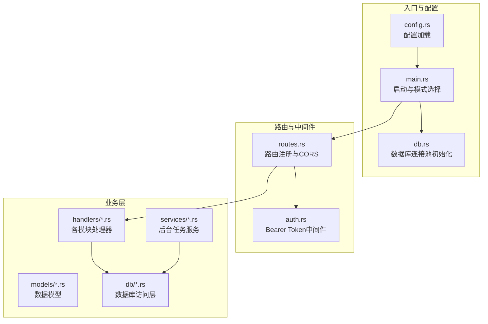
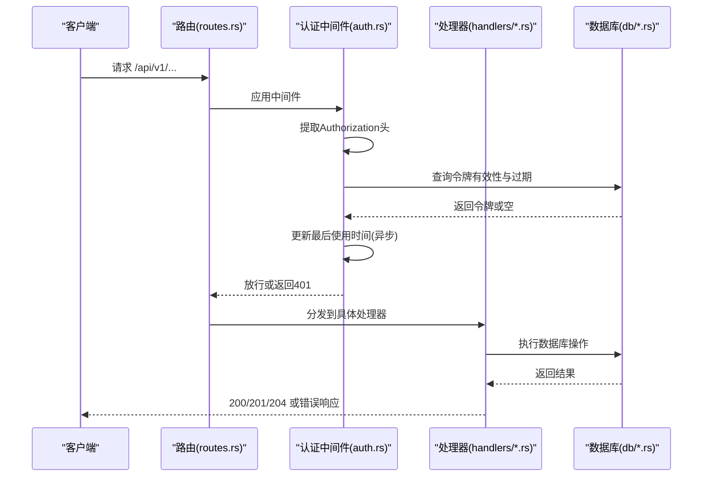
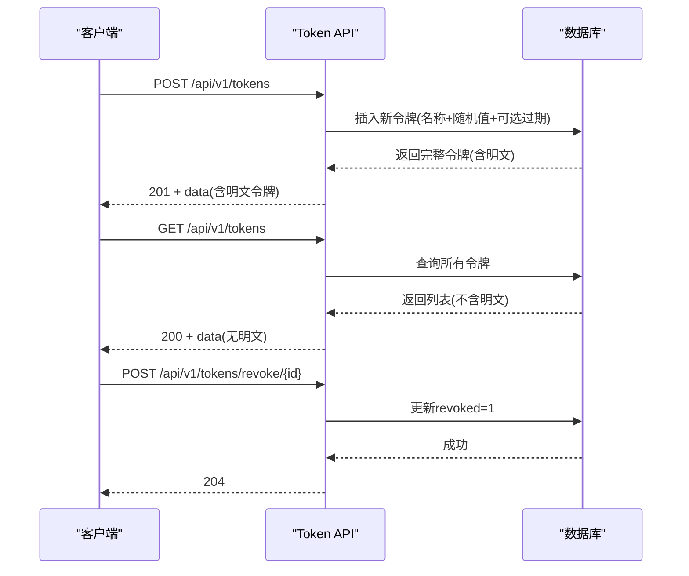
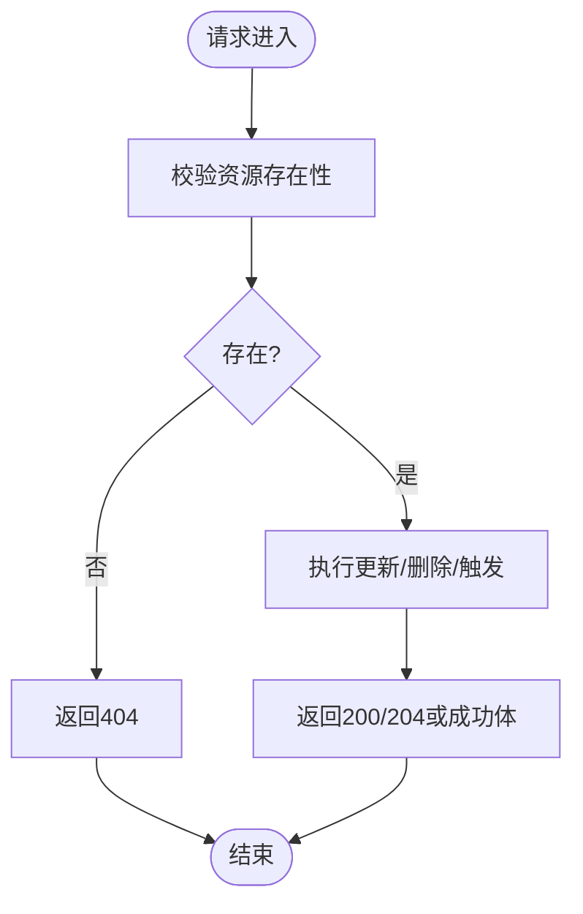
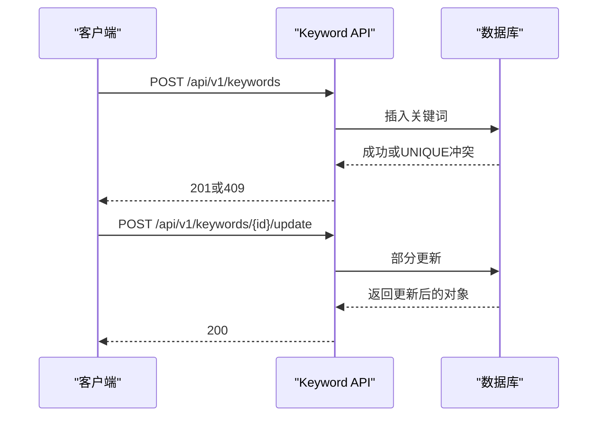
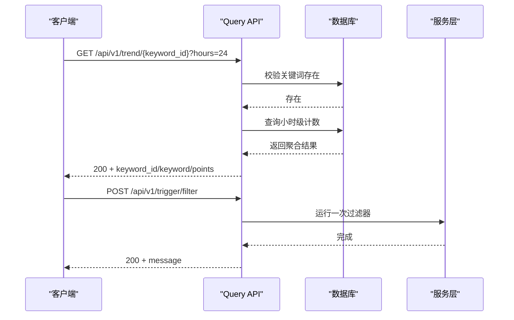
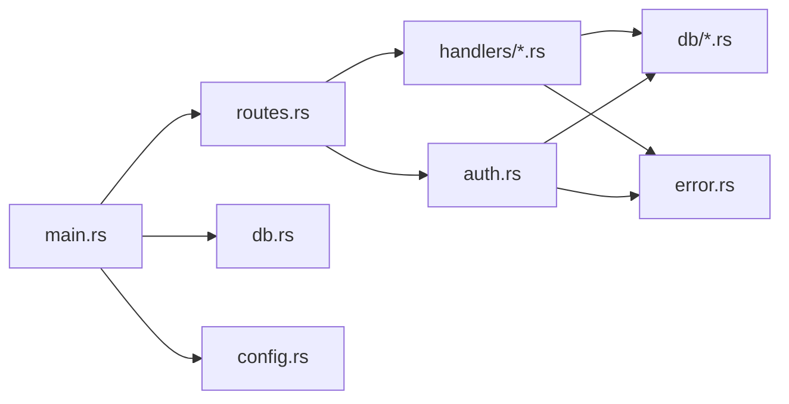

# API接口文档

<cite>
**本文引用的文件**
- [main.rs](file://src/main.rs)
- [routes.rs](file://src/routes.rs)
- [auth.rs](file://src/middleware/auth.rs)
- [error.rs](file://src/error.rs)
- [config.rs](file://src/config.rs)
- [db.rs](file://src/db.rs)
- [token.rs](file://src/handlers/token.rs)
- [source.rs](file://src/handlers/source.rs)
- [keyword.rs](file://src/handlers/keyword.rs)
- [channel.rs](file://src/handlers/channel.rs)
- [query.rs](file://src/handlers/query.rs)
- [token-api.md](file://docs/apis/token-api.md)
- [source-api.md](file://docs/apis/source-api.md)
- [keyword-api.md](file://docs/apis/keyword-api.md)
- [channel-api.md](file://docs/apis/channel-api.md)
</cite>

## 目录
1. [简介](#简介)
2. [项目结构](#项目结构)
3. [核心组件](#核心组件)
4. [架构总览](#架构总览)
5. [详细组件分析](#详细组件分析)
6. [依赖关系分析](#依赖关系分析)
7. [性能与可扩展性](#性能与可扩展性)
8. [故障排查指南](#故障排查指南)
9. [结论](#结论)
10. [附录](#附录)

## 简介
本文件为“AI趋势监控系统”的完整API接口文档，覆盖所有RESTful端点的HTTP方法、URL模式、请求/响应结构、认证方式与错误处理策略。系统采用Axum框架，基于SQLite数据库，提供令牌管理、数据源管理、关键词管理、推送渠道管理以及查询分析等能力，并支持手动触发过滤与推送任务。

- 版本控制：当前路由前缀为 /api/v1，具备清晰的版本化路径，便于后续演进与向后兼容。
- 认证机制：统一使用Bearer Token认证，中间件在进入业务处理器前完成校验、过期检查与最后使用时间更新。
- 错误格式：统一返回结构，包含状态码与标准化错误码，便于客户端一致化处理。
- 背景服务：系统同时运行解析器、过滤器与推送器三类后台任务，支持手动触发。

## 项目结构
后端采用模块化组织，按功能域划分handlers、services、models、db等目录；路由集中定义于routes.rs，全局中间件在根级/nest中应用。

图表来源
- [main.rs:64-164](file://src/main.rs#L64-L164)
- [routes.rs:14-70](file://src/routes.rs#L14-L70)
- [auth.rs:14-58](file://src/middleware/auth.rs#L14-L58)
- [db.rs:10-27](file://src/db.rs#L10-L27)

章节来源
- [main.rs:64-164](file://src/main.rs#L64-L164)
- [routes.rs:14-70](file://src/routes.rs#L14-L70)
- [config.rs:1-58](file://src/config.rs#L1-L58)
- [db.rs:10-27](file://src/db.rs#L10-L27)

## 核心组件
- 路由与版本控制：所有业务API位于 /api/v1 前缀下，健康检查 /health 不需要认证。
- 中间件：统一的Bearer Token认证中间件，负责提取、校验、过期检查与最后使用时间异步更新。
- 错误处理：统一的AppError枚举，映射到标准HTTP状态码与错误码；数据库异常自动转换为内部错误。
- 数据库：SQLite连接池，启用WAL与外键约束，最大并发连接数固定。
- 配置：通过配置文件加载服务器、数据库、鉴权、解析器、过滤器、推送器等参数。

章节来源
- [routes.rs:14-70](file://src/routes.rs#L14-L70)
- [auth.rs:14-58](file://src/middleware/auth.rs#L14-L58)
- [error.rs:8-79](file://src/error.rs#L8-L79)
- [db.rs:10-27](file://src/db.rs#L10-L27)
- [config.rs:1-58](file://src/config.rs#L1-L58)

## 架构总览
系统采用“路由 -> 中间件 -> 处理器 -> 数据库/服务”的分层架构。认证中间件对 /api/v1 下的所有端点生效，处理器负责参数解析、业务逻辑与数据封装，数据库访问层提供CRUD操作，后台服务负责周期性任务与手动触发。

图表来源
- [routes.rs:49-53](file://src/routes.rs#L49-L53)
- [auth.rs:18-57](file://src/middleware/auth.rs#L18-L57)
- [token.rs:18-30](file://src/handlers/token.rs#L18-L30)
- [source.rs:27-33](file://src/handlers/source.rs#L27-L33)
- [keyword.rs:27-41](file://src/handlers/keyword.rs#L27-L41)
- [channel.rs:26-32](file://src/handlers/channel.rs#L26-L32)

## 详细组件分析

### 认证与令牌管理（Token API）
- Base URL：http://localhost:8080
- 版本：/api/v1
- 全局要求：除 /health 外，所有 /api/v1/* 需要 Bearer Token 认证
- 认证头：Authorization: Bearer <token>
- 初始令牌：首次启动时自动生成或从配置注入，仅在生成时可见
- 端点概览
  - POST /api/v1/tokens：创建新令牌（64位十六进制），返回明文令牌一次
  - GET /api/v1/tokens：列出所有令牌（隐藏明文）
  - POST /api/v1/tokens/revoke/{id}：吊销指定令牌（软删除）

图表来源
- [token-api.md:62-198](file://docs/apis/token-api.md#L62-L198)
- [token.rs:18-66](file://src/handlers/token.rs#L18-L66)

章节来源
- [token-api.md:62-198](file://docs/apis/token-api.md#L62-L198)
- [token.rs:18-66](file://src/handlers/token.rs#L18-L66)

### 数据源管理（Source API）
- 端点概览
  - GET /api/v1/sources：列出数据源（按创建时间倒序）
  - POST /api/v1/sources：创建数据源（type/name/url必填，其余可选）
  - POST /api/v1/sources/{id}/update：部分字段更新
  - POST /api/v1/sources/{id}/delete：删除数据源
  - POST /api/v1/sources/{id}/fetch：手动触发抓取（重置last_fetched_at）

图表来源
- [source-api.md:17-252](file://docs/apis/source-api.md#L17-L252)
- [source.rs:12-91](file://src/handlers/source.rs#L12-L91)

章节来源
- [source-api.md:17-252](file://docs/apis/source-api.md#L17-L252)
- [source.rs:12-91](file://src/handlers/source.rs#L12-L91)

### 关键词管理（Keyword API）
- 端点概览
  - GET /api/v1/keywords：列出关键词（按创建时间倒序）
  - POST /api/v1/keywords：创建关键词（word唯一，其余可选）
  - POST /api/v1/keywords/{id}/update：部分字段更新
  - POST /api/v1/keywords/{id}/delete：删除关键词

图表来源
- [keyword-api.md:17-208](file://docs/apis/keyword-api.md#L17-L208)
- [keyword.rs:22-80](file://src/handlers/keyword.rs#L22-L80)

章节来源
- [keyword-api.md:17-208](file://docs/apis/keyword-api.md#L17-L208)
- [keyword.rs:22-80](file://src/handlers/keyword.rs#L22-L80)

### 推送渠道管理（Channel API）
- 端点概览
  - GET /api/v1/channels：列出推送渠道（按id升序）
  - POST /api/v1/channels：创建推送渠道（name/config必填，type可选）
  - POST /api/v1/channels/{id}/update：部分字段更新
  - POST /api/v1/channels/{id}/delete：删除推送渠道

章节来源
- [channel-api.md:17-192](file://docs/apis/channel-api.md#L17-L192)
- [channel.rs:12-71](file://src/handlers/channel.rs#L12-L71)

### 查询与分析（Query API）
- 端点概览
  - GET /api/v1/articles：文章列表（分页，可按source_id与processed过滤）
  - GET /api/v1/hotspots：热点事件列表（分页，可按keyword_id过滤）
  - GET /api/v1/hotspots/{id}/push-records：热点推送记录明细
  - GET /api/v1/trend/{keyword_id}：关键词小时级趋势（可选hours参数）
  - POST /api/v1/trigger/filter：手动执行一次过滤器
  - POST /api/v1/trigger/pusher：手动执行一次推送器

图表来源
- [query.rs:47-165](file://src/handlers/query.rs#L47-L165)

章节来源
- [query.rs:47-165](file://src/handlers/query.rs#L47-L165)

## 依赖关系分析
- 路由依赖：routes.rs集中注册所有端点，并挂载认证中间件与CORS。
- 处理器依赖：各模块处理器依赖对应的数据库访问模块与统一的响应包装器。
- 中间件依赖：认证中间件依赖数据库查询与AppError错误类型。
- 配置依赖：main.rs在启动时加载配置并初始化数据库迁移与初始令牌。

图表来源
- [routes.rs:14-70](file://src/routes.rs#L14-L70)
- [auth.rs:14-58](file://src/middleware/auth.rs#L14-L58)
- [error.rs:8-79](file://src/error.rs#L8-L79)
- [db.rs:10-27](file://src/db.rs#L10-L27)
- [main.rs:64-164](file://src/main.rs#L64-L164)
- [config.rs:51-58](file://src/config.rs#L51-L58)

章节来源
- [routes.rs:14-70](file://src/routes.rs#L14-L70)
- [auth.rs:14-58](file://src/middleware/auth.rs#L14-L58)
- [error.rs:8-79](file://src/error.rs#L8-L79)
- [db.rs:10-27](file://src/db.rs#L10-L27)
- [main.rs:64-164](file://src/main.rs#L64-L164)
- [config.rs:51-58](file://src/config.rs#L51-L58)

## 性能与可扩展性
- 连接池：SQLite连接池最大并发5，适合单机部署与中小规模负载。
- 异步更新：认证中间件在放行后异步更新令牌最后使用时间，避免阻塞主请求链路。
- 分页与限制：热点列表默认每页20条，最大100条/页，降低前端压力。
- 后台任务：解析器、过滤器、推送器作为独立任务运行，支持手动触发以提升运维可控性。
- CORS：采用宽松策略（permissive），便于前端开发调试；生产环境建议收紧。

章节来源
- [db.rs:14-18](file://src/db.rs#L14-L18)
- [auth.rs:46-51](file://src/middleware/auth.rs#L46-L51)
- [query.rs:78-79](file://src/handlers/query.rs#L78-L79)
- [routes.rs:58](file://src/routes.rs#L58)

## 故障排查指南
- 统一错误格式
  - 结构：{"error": {"code": "...", "message": "..."}}
  - 常见状态码与错误码
    - 400 BAD_REQUEST：请求体或参数无效
    - 401 UNAUTHORIZED：缺少、格式错误、过期或已吊销的令牌
    - 404 NOT_FOUND：资源不存在
    - 409 CONFLICT：唯一约束冲突（如关键词重复）
    - 500 DATABASE_ERROR/INTERNAL_ERROR：服务器内部错误
- 常见问题定位
  - 401 Unauthorized：确认Authorization头格式为Bearer <token>，且令牌未过期/未吊销
  - 404 Not Found：确认资源ID有效，端点路径正确
  - 409 Conflict：关键词重复或唯一约束冲突
  - 500 Internal：查看服务日志，关注数据库错误

章节来源
- [error.rs:23-50](file://src/error.rs#L23-L50)
- [token-api.md:17-37](file://docs/apis/token-api.md#L17-L37)

## 结论
本API文档系统性地描述了AI趋势监控系统的REST接口、认证流程、错误处理与调用示例。通过Bearer Token认证与统一的错误格式，系统在安全性与易用性之间取得平衡；结合手动触发与后台任务，满足实时性与可运维性的双重需求。建议在生产环境中进一步完善速率限制、CORS策略与令牌轮换机制。

## 附录

### 统一错误响应格式
- 结构
  - {"error": {"code": "错误码", "message": "人类可读描述"}}
- 状态码映射
  - 400：BAD_REQUEST
  - 401：UNAUTHORIZED
  - 404：NOT_FOUND
  - 409：CONFLICT
  - 500：DATABASE_ERROR 或 INTERNAL_ERROR

章节来源
- [error.rs:23-50](file://src/error.rs#L23-L50)
- [token-api.md:17-37](file://docs/apis/token-api.md#L17-L37)

### 版本控制与向后兼容
- 当前版本：/api/v1
- 设计原则：新增端点优先在新版本路径下发布，旧版本保持稳定，逐步引导客户端迁移

章节来源
- [routes.rs:57](file://src/routes.rs#L57)

### 速率限制
- 当前实现：未内置速率限制
- 建议：在网关或中间件层引入限流策略，按IP/令牌维度控制QPS

章节来源
- [auth.rs:14-58](file://src/middleware/auth.rs#L14-L58)

### 健康检查
- 端点：GET /health
- 响应：{"status": "ok"}
- 无需认证

章节来源
- [routes.rs:61-63](file://src/routes.rs#L61-L63)
- [token-api.md:42-52](file://docs/apis/token-api.md#L42-L52)

### 客户端实现要点
- 认证头：Authorization: Bearer <token>
- 响应解析：统一处理data字段与错误体；注意布尔值与时间字符串格式
- 分页：根据items/total/page/per_page自行渲染分页UI
- 手动触发：在运维场景调用 /api/v1/trigger/filter 与 /api/v1/trigger/pusher

章节来源
- [query.rs:14-21](file://src/handlers/query.rs#L14-L21)
- [query.rs:150-164](file://src/handlers/query.rs#L150-L164)