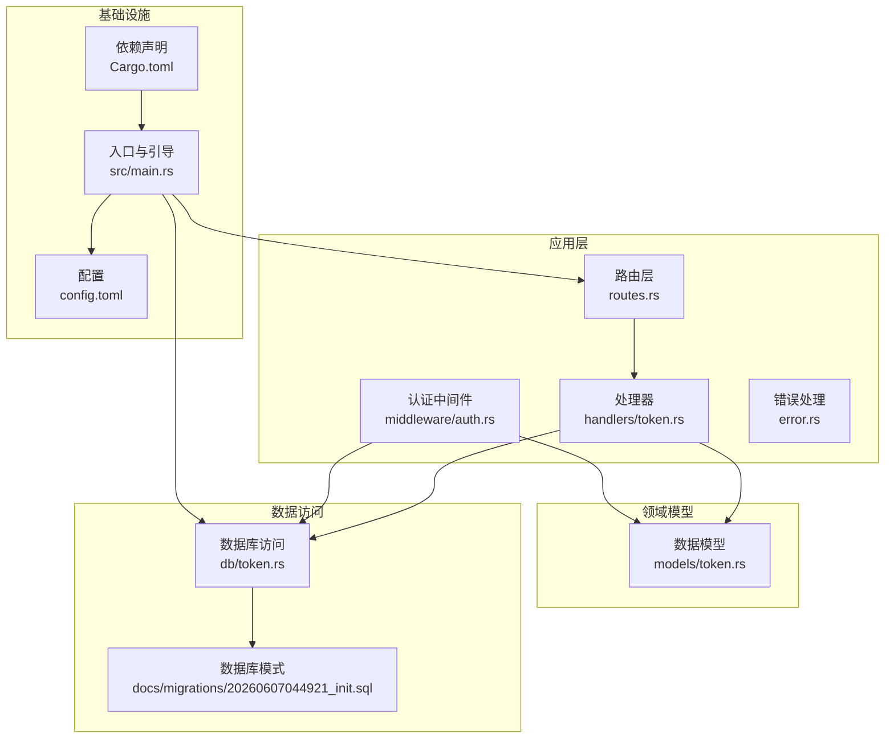
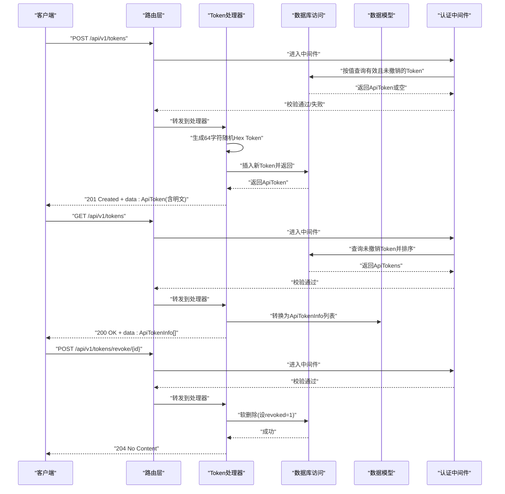
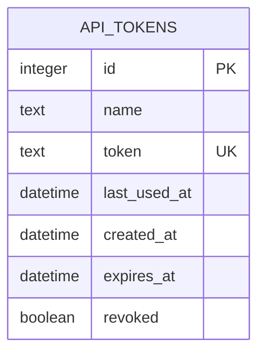
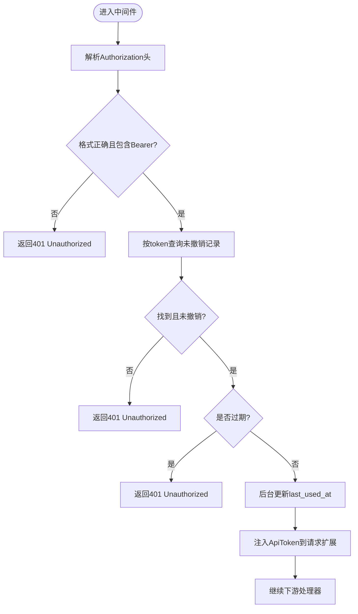
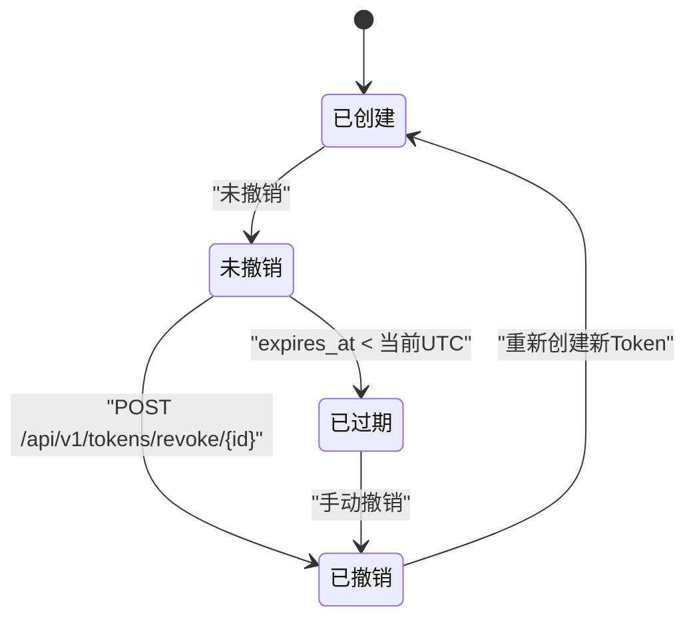
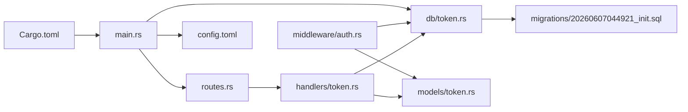

# Token管理API

<cite>
**本文引用的文件**
- [src/handlers/token.rs](file://src/handlers/token.rs)
- [src/models/token.rs](file://src/models/token.rs)
- [src/db/token.rs](file://src/db/token.rs)
- [src/routes.rs](file://src/routes.rs)
- [src/middleware/auth.rs](file://src/middleware/auth.rs)
- [src/error.rs](file://src/error.rs)
- [src/main.rs](file://src/main.rs)
- [docs/apis/token-api.md](file://docs/apis/token-api.md)
- [docs/migrations/20260607044921_init.sql](file://docs/migrations/20260607044921_init.sql)
- [config.toml](file://config.toml)
- [Cargo.toml](file://Cargo.toml)
</cite>

## 目录
1. [简介](#简介)
2. [项目结构](#项目结构)
3. [核心组件](#核心组件)
4. [架构总览](#架构总览)
5. [详细组件分析](#详细组件分析)
6. [依赖关系分析](#依赖关系分析)
7. [性能考虑](#性能考虑)
8. [故障排除指南](#故障排除指南)
9. [结论](#结论)
10. [附录](#附录)

## 简介
本文件为 AI 趋势监控系统中的 Token 管理 API 提供详细的 RESTful API 文档。内容涵盖：
- 所有与 Token 相关的端点：创建、查询、撤销（软删除）
- 每个端点的 HTTP 方法、URL 路径、请求参数、响应格式
- Token 生成规则、有效期设置、权限范围配置
- 完整的 curl 示例与客户端调用建议
- Token 生命周期管理、安全使用注意事项、常见错误处理
- 批量操作与分页查询的实现现状与扩展建议

## 项目结构
该服务基于 Rust + Axum + SQLx + SQLite 构建，Token 管理功能位于以下模块：
- 路由定义：在路由层注册 Token 相关端点，并统一挂载认证中间件
- 处理器：实现具体的业务逻辑（创建、列表、撤销）
- 数据模型：定义 Token 的实体结构与序列化结构
- 数据访问：封装对 api_tokens 表的数据库操作
- 认证中间件：从请求头提取 Bearer Token，校验有效性、过期与撤销状态，并更新最近使用时间
- 错误处理：统一的错误响应格式与状态码映射
- 启动引导：首次启动时自动创建初始管理员 Token

图表来源
- [src/routes.rs:14-50](file://src/routes.rs#L14-L50)
- [src/handlers/token.rs:13-65](file://src/handlers/token.rs#L13-L65)
- [src/middleware/auth.rs:14-59](file://src/middleware/auth.rs#L14-L59)
- [src/db/token.rs:6-106](file://src/db/token.rs#L6-L106)
- [docs/migrations/20260607044921_init.sql:4-12](file://docs/migrations/20260607044921_init.sql#L4-L12)
- [src/main.rs:26-61](file://src/main.rs#L26-L61)
- [config.toml:1-27](file://config.toml#L1-L27)
- [Cargo.toml:1-47](file://Cargo.toml#L1-L47)

章节来源
- [src/routes.rs:14-50](file://src/routes.rs#L14-L50)
- [src/handlers/token.rs:13-65](file://src/handlers/token.rs#L13-L65)
- [src/middleware/auth.rs:14-59](file://src/middleware/auth.rs#L14-L59)
- [src/db/token.rs:6-106](file://src/db/token.rs#L6-L106)
- [docs/migrations/20260607044921_init.sql:4-12](file://docs/migrations/20260607044921_init.sql#L4-L12)
- [src/main.rs:26-61](file://src/main.rs#L26-L61)
- [config.toml:1-27](file://config.toml#L1-L27)
- [Cargo.toml:1-47](file://Cargo.toml#L1-L47)

## 核心组件
- 路由层：注册 /api/v1/tokens 的 POST（创建）、GET（列表）以及 /api/v1/tokens/revoke/{id} 的 POST（撤销），并统一挂载认证中间件
- 处理器层：实现创建、列表、撤销的具体逻辑；创建时生成 64 字符十六进制随机 Token；列表返回隐藏明文的精简信息
- 数据模型层：ApiToken 包含完整字段；ApiTokenInfo 用于列表响应，不包含明文 token
- 数据访问层：封装插入、查询、更新最后使用时间、软删除（撤销）等操作
- 认证中间件：从 Authorization 头解析 Bearer Token，校验是否被撤销、是否过期，并异步更新 last_used_at
- 错误处理：统一错误响应体与状态码映射，支持 400/401/404/409/500 等
- 启动引导：首次启动时若 api_tokens 表为空，根据配置或自动生成初始管理员 Token 并打印提示

章节来源
- [src/routes.rs:20-44](file://src/routes.rs#L20-L44)
- [src/handlers/token.rs:13-65](file://src/handlers/token.rs#L13-L65)
- [src/models/token.rs:5-44](file://src/models/token.rs#L5-L44)
- [src/db/token.rs:6-106](file://src/db/token.rs#L6-L106)
- [src/middleware/auth.rs:14-59](file://src/middleware/auth.rs#L14-L59)
- [src/error.rs:8-79](file://src/error.rs#L8-L79)
- [src/main.rs:26-61](file://src/main.rs#L26-L61)

## 架构总览
下图展示了 Token 管理 API 的端到端调用流程，包括认证中间件的拦截与数据库交互。

图表来源
- [src/routes.rs:20-44](file://src/routes.rs#L20-L44)
- [src/handlers/token.rs:13-65](file://src/handlers/token.rs#L13-L65)
- [src/db/token.rs:6-106](file://src/db/token.rs#L6-L106)
- [src/middleware/auth.rs:14-59](file://src/middleware/auth.rs#L14-L59)

## 详细组件分析

### 数据模型与数据库结构
- 数据表：api_tokens
  - 字段：id、name、token（唯一）、last_used_at、created_at、expires_at、revoked
  - 约束：token 唯一；revoked 默认 0；created_at 默认当前时间
- 实体模型：
  - ApiToken：包含完整字段（含明文 token）
  - ApiTokenInfo：用于列表响应，不含明文 token
  - CreateTokenRequest：创建请求体，包含 name、expires_at（可选）

图表来源
- [docs/migrations/20260607044921_init.sql:4-12](file://docs/migrations/20260607044921_init.sql#L4-L12)
- [src/models/token.rs:5-44](file://src/models/token.rs#L5-L44)

章节来源
- [docs/migrations/20260607044921_init.sql:4-12](file://docs/migrations/20260607044921_init.sql#L4-L12)
- [src/models/token.rs:5-44](file://src/models/token.rs#L5-L44)

### 认证中间件与安全策略
- 中间件职责：
  - 从 Authorization 头提取 Bearer Token
  - 查询数据库验证 Token 是否存在、未撤销
  - 校验是否过期（expires_at 小于当前 UTC 时间则视为过期）
  - 异步更新 last_used_at（后台任务，不影响主请求）
  - 将 ApiToken 注入请求扩展，供下游处理器使用
- 安全要点：
  - Token 仅在创建时返回明文，后续无法恢复
  - 列表接口返回 ApiTokenInfo，隐藏明文
  - 支持设置过期时间，到期后拒绝访问
  - 支持软删除（revoked），撤销后立即失效

图表来源
- [src/middleware/auth.rs:14-59](file://src/middleware/auth.rs#L14-L59)
- [src/db/token.rs:40-48](file://src/db/token.rs#L40-L48)

章节来源
- [src/middleware/auth.rs:14-59](file://src/middleware/auth.rs#L14-L59)
- [src/db/token.rs:40-48](file://src/db/token.rs#L40-L48)

### 端点定义与行为

#### POST /api/v1/tokens
- 功能：创建新的 API Token
- 请求体：CreateTokenRequest
  - name: string（必填）
  - expires_at: string|null（可选，ISO 8601）
- 成功响应：201 Created，返回 ApiToken（包含明文 token）
- 生成规则：64 字符十六进制随机字符串（32 字节随机数编码）
- 安全注意：明文 token 仅在此响应中可见，后续无法恢复

章节来源
- [src/handlers/token.rs:13-30](file://src/handlers/token.rs#L13-L30)
- [src/models/token.rs:40-44](file://src/models/token.rs#L40-L44)
- [src/db/token.rs:6-20](file://src/db/token.rs#L6-L20)

#### GET /api/v1/tokens
- 功能：列出所有未撤销的 Token（隐藏明文）
- 成功响应：200 OK，返回 ApiTokenInfo 数组（按 created_at 降序）
- 数据来源：查询 api_tokens，过滤 revoked=0

章节来源
- [src/handlers/token.rs:32-43](file://src/handlers/token.rs#L32-L43)
- [src/db/token.rs:22-28](file://src/db/token.rs#L22-L28)
- [src/models/token.rs:16-38](file://src/models/token.rs#L16-L38)

#### POST /api/v1/tokens/revoke/{id}
- 功能：撤销指定 Token（软删除，revoked=1）
- 成功响应：204 No Content
- 错误响应：404 Not Found（当 id 不存在或已被软删除）

章节来源
- [src/handlers/token.rs:45-65](file://src/handlers/token.rs#L45-L65)
- [src/db/token.rs:61-67](file://src/db/token.rs#L61-L67)

### Token 生命周期管理
- 创建：生成 64 字符随机 Hex Token，写入数据库
- 使用：每次请求通过认证中间件校验，成功后异步更新 last_used_at
- 过期：若 expires_at 存在且小于当前 UTC 时间，则视为过期
- 撤销：将 revoked 设为 1，立即失效
- 删除：提供软删除（撤销）能力；硬删除未在当前实现中暴露

图表来源
- [src/db/token.rs:61-67](file://src/db/token.rs#L61-L67)
- [src/middleware/auth.rs:41-46](file://src/middleware/auth.rs#L41-L46)

章节来源
- [src/db/token.rs:61-67](file://src/db/token.rs#L61-L67)
- [src/middleware/auth.rs:41-46](file://src/middleware/auth.rs#L41-L46)

### 安全使用注意事项
- Token 仅在创建时返回明文，请妥善保存
- 在生产环境建议设置 expires_at，避免长期有效的 Token
- 对外暴露的客户端应避免日志记录 Token
- 撤销不再使用的 Token，降低泄露风险
- 使用 HTTPS 传输，防止中间人截获

章节来源
- [docs/apis/token-api.md:62-119](file://docs/apis/token-api.md#L62-L119)
- [src/middleware/auth.rs:41-46](file://src/middleware/auth.rs#L41-L46)

### 批量操作与分页查询
- 当前实现：
  - 列表接口返回全部未撤销 Token，未提供分页参数
  - 未提供批量撤销接口
- 扩展建议：
  - 在列表接口增加 limit/offset 或 cursor 分页
  - 提供批量撤销接口（如 POST /api/v1/tokens/revoke-batch）

章节来源
- [src/handlers/token.rs:32-43](file://src/handlers/token.rs#L32-L43)
- [src/db/token.rs:22-28](file://src/db/token.rs#L22-L28)

## 依赖关系分析
- 路由层依赖处理器与认证中间件
- 处理器依赖数据访问层与数据模型
- 认证中间件依赖数据访问层与数据模型
- 数据访问层依赖数据库模式与 SQLx
- 启动引导依赖配置与随机数生成库

图表来源
- [src/routes.rs:14-50](file://src/routes.rs#L14-L50)
- [src/handlers/token.rs:13-65](file://src/handlers/token.rs#L13-L65)
- [src/middleware/auth.rs:14-59](file://src/middleware/auth.rs#L14-L59)
- [src/db/token.rs:6-106](file://src/db/token.rs#L6-L106)
- [docs/migrations/20260607044921_init.sql:4-12](file://docs/migrations/20260607044921_init.sql#L4-L12)
- [src/main.rs:26-61](file://src/main.rs#L26-L61)
- [config.toml:1-27](file://config.toml#L1-L27)
- [Cargo.toml:1-47](file://Cargo.toml#L1-L47)

章节来源
- [src/routes.rs:14-50](file://src/routes.rs#L14-L50)
- [src/handlers/token.rs:13-65](file://src/handlers/token.rs#L13-L65)
- [src/middleware/auth.rs:14-59](file://src/middleware/auth.rs#L14-L59)
- [src/db/token.rs:6-106](file://src/db/token.rs#L6-L106)
- [docs/migrations/20260607044921_init.sql:4-12](file://docs/migrations/20260607044921_init.sql#L4-L12)
- [src/main.rs:26-61](file://src/main.rs#L26-L61)
- [config.toml:1-27](file://config.toml#L1-L27)
- [Cargo.toml:1-47](file://Cargo.toml#L1-L47)

## 性能考虑
- 认证中间件采用异步更新 last_used_at，避免阻塞主请求
- 列表查询默认按 created_at 降序，适合“最近创建优先”的展示
- 建议在高并发场景下：
  - 为 last_used_at 字段建立索引（当前未见显式索引，但可通过查询优化）
  - 控制 Token 数量，定期清理长期未使用的 Token
  - 对列表接口增加分页以减少单次响应体积

章节来源
- [src/middleware/auth.rs:48-53](file://src/middleware/auth.rs#L48-L53)
- [src/db/token.rs:22-28](file://src/db/token.rs#L22-L28)

## 故障排除指南
- 401 Unauthorized
  - 缺少 Authorization 头或格式不正确
  - Token 无效、已撤销或已过期
- 404 Not Found
  - 撤销接口传入的 id 不存在或已被软删除
- 500 Internal Server Error
  - 数据库异常（统一包装为 DATABASE_ERROR）

章节来源
- [src/middleware/auth.rs:23-46](file://src/middleware/auth.rs#L23-L46)
- [src/handlers/token.rs:55-62](file://src/handlers/token.rs#L55-L62)
- [src/error.rs:8-79](file://src/error.rs#L8-L79)

## 结论
Token 管理 API 提供了简洁而安全的令牌生命周期管理能力：创建时一次性暴露明文、列表时隐藏敏感信息、支持过期与撤销控制。结合认证中间件的严格校验与异步更新机制，满足了基本的安全与可用性需求。未来可在分页、批量操作等方面进一步增强。

## 附录

### 端点一览与示例
- Base URL：http://localhost:8080
- 认证方式：Authorization: Bearer <token>
- 获取健康状态：GET /health（无需认证）
- 创建 Token：POST /api/v1/tokens
- 列出 Token：GET /api/v1/tokens
- 撤销 Token：POST /api/v1/tokens/revoke/{id}

章节来源
- [docs/apis/token-api.md:3-197](file://docs/apis/token-api.md#L3-L197)

### 配置与启动
- 首次启动时若 api_tokens 表为空，将根据配置或自动生成初始管理员 Token 并打印提示
- 默认监听地址与端口可在 config.toml 中配置

章节来源
- [src/main.rs:26-61](file://src/main.rs#L26-L61)
- [config.toml:1-27](file://config.toml#L1-L27)