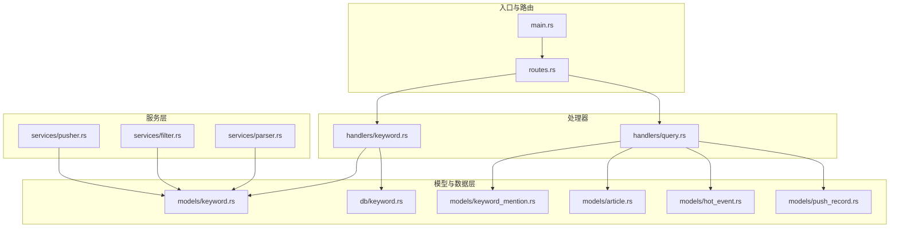
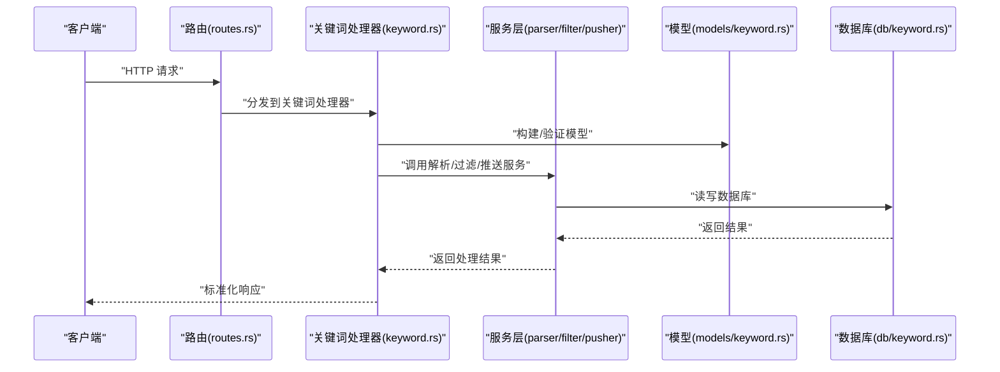
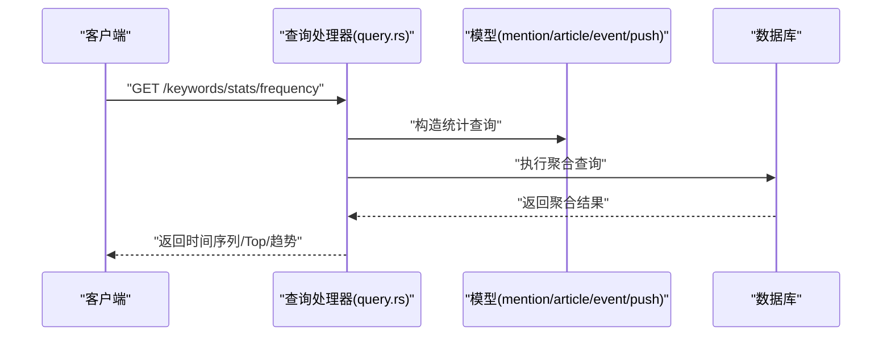
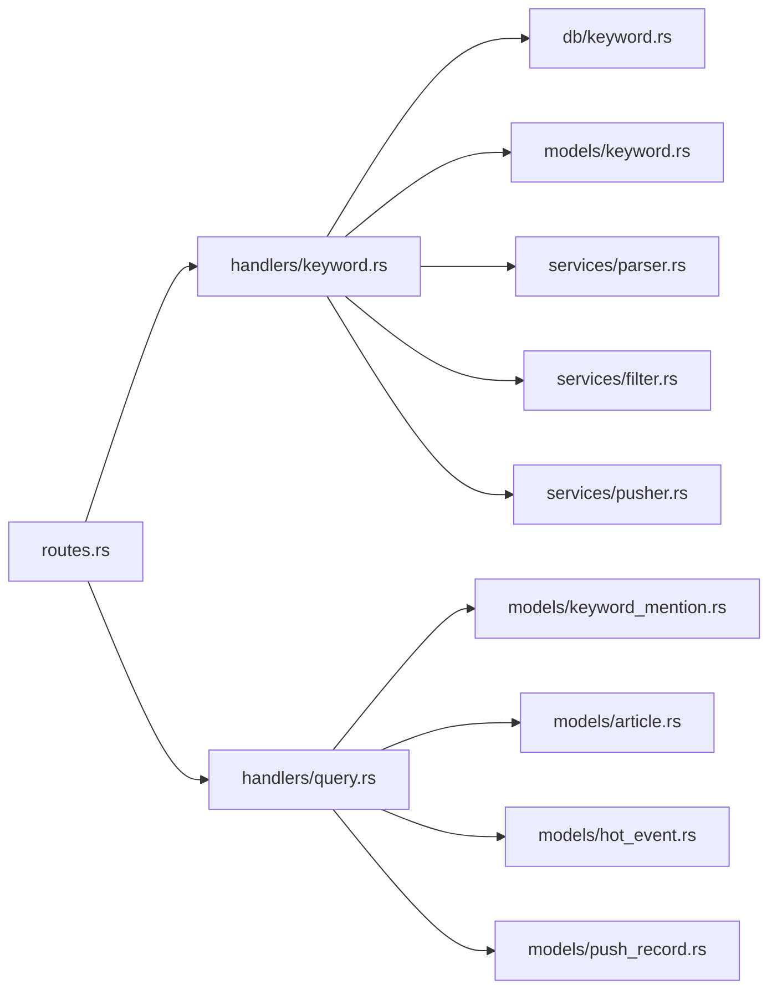
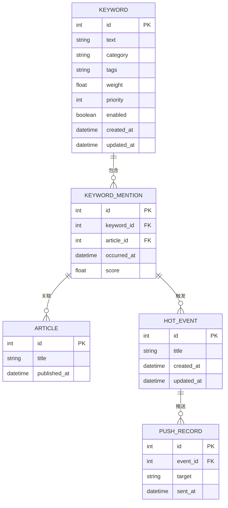

# 关键词管理API

<cite>
**本文引用的文件**
- [keyword-api.md](file://docs/apis/keyword-api.md)
- [keyword-crud-api.spec.md](file://openspec/specs/keyword-crud-api/spec.md)
- [keyword.rs（数据库）](file://src/db/keyword.rs)
- [keyword.rs（模型）](file://src/models/keyword.rs)
- [keyword.rs（处理器）](file://src/handlers/keyword.rs)
- [routes.rs](file://src/routes.rs)
- [main.rs](file://src/main.rs)
- [config.rs](file://src/config.rs)
- [keyword_mention.rs（模型）](file://src/models/keyword_mention.rs)
- [article.rs（模型）](file://src/models/article.rs)
- [hot_event.rs（模型）](file://src/models/hot_event.rs)
- [push_record.rs（模型）](file://src/models/push_record.rs)
- [parser.rs（服务）](file://src/services/parser.rs)
- [filter.rs（服务）](file://src/services/filter.rs)
- [pusher.rs（服务）](file://src/services/pusher.rs)
- [query.rs（处理器）](file://src/handlers/query.rs)
- [query-apis.spec.md](file://openspec/specs/query-apis/spec.md)
</cite>

## 目录
1. [简介](#简介)
2. [项目结构](#项目结构)
3. [核心组件](#核心组件)
4. [架构总览](#架构总览)
5. [详细组件分析](#详细组件分析)
6. [依赖关系分析](#依赖关系分析)
7. [性能考虑](#性能考虑)
8. [故障排查指南](#故障排查指南)
9. [结论](#结论)
10. [附录](#附录)

## 简介
本文件面向AI趋势监控系统中的“关键词管理API”，提供从数据模型、CRUD接口、匹配与统计分析到最佳实践的完整技术文档。内容涵盖：
- Keyword模型结构与存储格式
- 关键词的增删改查、批量导入与删除
- 匹配算法配置项与性能参数
- 分类与标签管理API规范
- 频率统计与趋势分析查询接口
- 权重设置与匹配优先级
- 每个端点的使用示例与响应格式
- 最佳实践与性能优化建议

## 项目结构
后端采用Rust + Rocket框架，按模块组织：handlers（HTTP处理）、models（领域模型）、db（数据库访问）、services（业务服务）、routes（路由注册）。关键词相关的核心文件如下：
- 文档与规范：docs/apis/keyword-api.md、openspec/specs/keyword-crud-api/spec.md
- 路由与入口：src/routes.rs、src/main.rs
- 数据层：src/db/keyword.rs
- 模型层：src/models/keyword.rs、src/models/keyword_mention.rs、src/models/article.rs、src/models/hot_event.rs、src/models/push_record.rs
- 处理器：src/handlers/keyword.rs、src/handlers/query.rs
- 服务层：src/services/parser.rs、src/services/filter.rs、src/services/pusher.rs
- 配置：src/config.rs

**图表来源**
- [routes.rs](file://src/routes.rs)
- [keyword.rs（处理器）](file://src/handlers/keyword.rs)
- [keyword.rs（数据库）](file://src/db/keyword.rs)
- [keyword.rs（模型）](file://src/models/keyword.rs)
- [keyword_mention.rs（模型）](file://src/models/keyword_mention.rs)
- [article.rs（模型）](file://src/models/article.rs)
- [hot_event.rs（模型）](file://src/models/hot_event.rs)
- [push_record.rs（模型）](file://src/models/push_record.rs)
- [parser.rs（服务）](file://src/services/parser.rs)
- [filter.rs（服务）](file://src/services/filter.rs)
- [pusher.rs（服务）](file://src/services/pusher.rs)

**章节来源**
- [routes.rs](file://src/routes.rs)
- [main.rs](file://src/main.rs)

## 核心组件
- Keyword模型：描述关键词实体及其元数据（如分类、标签、权重、优先级等），用于CRUD与匹配计算。
- 数据库适配：提供关键词的持久化、查询与批量导入能力。
- 处理器：实现HTTP端点，负责请求解析、权限校验、调用服务层并返回标准化响应。
- 服务层：解析文本、过滤规则、推送通知等，支撑关键词匹配与事件触发。
- 查询处理器：提供频率统计与趋势分析接口，连接文章、提及、热点事件与推送记录。

**章节来源**
- [keyword.rs（模型）](file://src/models/keyword.rs)
- [keyword.rs（数据库）](file://src/db/keyword.rs)
- [keyword.rs（处理器）](file://src/handlers/keyword.rs)
- [query.rs（处理器）](file://src/handlers/query.rs)

## 架构总览
关键词管理API遵循“路由 -> 处理器 -> 服务/模型 -> 数据库”的分层架构。处理器通过服务层完成匹配与统计，最终落库或返回聚合结果。

**图表来源**
- [routes.rs](file://src/routes.rs)
- [keyword.rs（处理器）](file://src/handlers/keyword.rs)
- [keyword.rs（模型）](file://src/models/keyword.rs)
- [keyword.rs（数据库）](file://src/db/keyword.rs)
- [parser.rs（服务）](file://src/services/parser.rs)
- [filter.rs（服务）](file://src/services/filter.rs)
- [pusher.rs（服务）](file://src/services/pusher.rs)

## 详细组件分析

### Keyword模型与存储格式
- 字段与语义
  - 关键词文本：用于匹配的原始字符串
  - 分类：关键词所属类别，支持多级分类树
  - 标签：关键词的附加标记，便于筛选与统计
  - 权重：影响匹配优先级与统计权重
  - 优先级：决定多个关键词同时命中时的排序
  - 启用状态：控制是否参与匹配
  - 创建/更新时间：审计与归档
- 存储格式
  - 文本字段统一小写化并去除多余空白，保留精确匹配与模糊匹配所需的形态
  - 分类与标签以逗号分隔的字符串形式存储，便于快速检索与聚合
  - 权重与优先级为数值类型，支持浮点数与整数
- 复杂度与索引
  - 建议对“关键词文本”、“分类”、“启用状态”建立索引，提升匹配与筛选性能

**章节来源**
- [keyword.rs（模型）](file://src/models/keyword.rs)
- [keyword.rs（数据库）](file://src/db/keyword.rs)

### CRUD与批量导入/删除API
- 规范参考
  - 关键词CRUD规范详见openspec规范文件
  - API文档详见docs/apis/keyword-api.md
- 端点概览
  - GET /keywords：分页列出关键词，支持按分类、标签、启用状态过滤
  - GET /keywords/{id}：获取单个关键词详情
  - POST /keywords：创建关键词
  - PUT /keywords/{id}：更新关键词
  - DELETE /keywords/{id}：删除关键词
  - POST /keywords/batch/import：批量导入关键词
  - DELETE /keywords/batch/delete：批量删除关键词
- 请求与响应
  - 请求体字段与约束：见规范文件；响应体包含标准错误码与消息
  - 批量导入/删除支持并发与事务回滚策略，失败时返回部分成功与失败列表
- 使用示例
  - 创建关键词：POST /keywords，请求体包含关键词文本、分类、标签、权重、优先级、启用状态
  - 批量导入：POST /keywords/batch/import，请求体为关键词数组，每条记录包含相同字段
  - 删除关键词：DELETE /keywords/{id}
  - 批量删除：DELETE /keywords/batch/delete，请求体为ID数组

**章节来源**
- [keyword-api.md](file://docs/apis/keyword-api.md)
- [keyword-crud-api.spec.md](file://openspec/specs/keyword-crud-api/spec.md)
- [keyword.rs（处理器）](file://src/handlers/keyword.rs)

### 匹配算法配置与性能参数
- 匹配算法
  - 支持精确匹配与模糊匹配（编辑距离/相似度阈值）
  - 支持正则表达式匹配
  - 支持多关键词组合匹配（AND/OR/优先级）
- 配置项
  - 模糊匹配阈值：控制相似度下限
  - 正则开关：是否启用正则匹配
  - 匹配超时：单次匹配的最大耗时
  - 缓存窗口：最近N分钟内的匹配结果缓存
- 性能参数
  - 并发匹配：最大并发线程数
  - 分片大小：单批处理的关键词数量
  - 内存上限：匹配过程中的内存占用上限
- 服务层集成
  - 解析服务：将输入文本切分为候选片段
  - 过滤服务：根据分类/标签/权重进行预过滤
  - 推送服务：命中后触发事件推送

**章节来源**
- [parser.rs（服务）](file://src/services/parser.rs)
- [filter.rs（服务）](file://src/services/filter.rs)
- [pusher.rs（服务）](file://src/services/pusher.rs)
- [config.rs](file://src/config.rs)

### 关键词分类与标签管理API
- 分类管理
  - GET /categories：列出所有分类
  - POST /categories：新增分类
  - PUT /categories/{id}：更新分类
  - DELETE /categories/{id}：删除分类
- 标签管理
  - GET /tags：列出所有标签
  - POST /tags：新增标签
  - PUT /tags/{id}：更新标签
  - DELETE /tags/{id}：删除标签
- 关联关系
  - 关键词与分类/标签为多对多关系，支持批量设置与清空
- 使用示例
  - 为关键词设置分类与标签：PUT /keywords/{id}，请求体包含分类ID数组与标签名称数组

**章节来源**
- [keyword-api.md](file://docs/apis/keyword-api.md)
- [keyword.rs（模型）](file://src/models/keyword.rs)

### 频率统计与趋势分析查询接口
- 统计接口
  - GET /keywords/stats/frequency：按时间粒度统计关键词出现频率
  - GET /keywords/stats/trend：计算关键词趋势（同比/环比）
  - GET /keywords/stats/top：获取Top N关键词
- 输入参数
  - 时间范围：开始/结束时间
  - 时间粒度：小时/日/周
  - 分类/标签过滤
  - Top数量限制
- 输出格式
  - 时间序列：包含时间戳与频次
  - 趋势指标：包含趋势值与置信区间
  - Top列表：关键词、频次、权重加权得分
- 数据来源
  - 关键词提及记录、文章、热点事件与推送记录

**图表来源**
- [query.rs（处理器）](file://src/handlers/query.rs)
- [keyword_mention.rs（模型）](file://src/models/keyword_mention.rs)
- [article.rs（模型）](file://src/models/article.rs)
- [hot_event.rs（模型）](file://src/models/hot_event.rs)
- [push_record.rs（模型）](file://src/models/push_record.rs)

**章节来源**
- [query-apis.spec.md](file://openspec/specs/query-apis/spec.md)
- [query.rs（处理器）](file://src/handlers/query.rs)

### 权重设置与匹配优先级
- 权重
  - 数值越高，关键词在统计与展示中越突出
  - 可用于加权平均、趋势评分等场景
- 优先级
  - 决定多个关键词同时命中时的排序
  - 支持多级优先级，同级内按权重排序
- 应用场景
  - 热点事件聚合时，高权重关键词优先纳入
  - 推送通知时，高优先级关键词优先触发

**章节来源**
- [keyword.rs（模型）](file://src/models/keyword.rs)

### API端点与使用示例
- 关键词CRUD
  - POST /keywords：创建关键词
  - GET /keywords：分页查询
  - GET /keywords/{id}：获取详情
  - PUT /keywords/{id}：更新关键词
  - DELETE /keywords/{id}：删除关键词
- 批量操作
  - POST /keywords/batch/import：批量导入
  - DELETE /keywords/batch/delete：批量删除
- 统计与趋势
  - GET /keywords/stats/frequency
  - GET /keywords/stats/trend
  - GET /keywords/stats/top
- 分类与标签
  - GET /categories、POST /categories、PUT /categories/{id}、DELETE /categories/{id}
  - GET /tags、POST /tags、PUT /tags/{id}、DELETE /tags/{id}

响应格式
- 成功：包含状态码、数据体与可选提示信息
- 失败：包含错误码、错误消息与上下文信息

**章节来源**
- [keyword-api.md](file://docs/apis/keyword-api.md)
- [keyword-crud-api.spec.md](file://openspec/specs/keyword-crud-api/spec.md)
- [query-apis.spec.md](file://openspec/specs/query-apis/spec.md)

## 依赖关系分析
- 路由到处理器：路由集中注册，关键词与查询相关端点分别由对应处理器处理
- 处理器到服务：处理器不直接操作数据库，通过服务层封装业务逻辑
- 服务到模型/数据库：服务层调用模型与数据库适配层
- 查询处理器依赖多模型：统计与趋势分析需要跨表聚合

**图表来源**
- [routes.rs](file://src/routes.rs)
- [keyword.rs（处理器）](file://src/handlers/keyword.rs)
- [keyword.rs（数据库）](file://src/db/keyword.rs)
- [keyword.rs（模型）](file://src/models/keyword.rs)
- [keyword_mention.rs（模型）](file://src/models/keyword_mention.rs)
- [article.rs（模型）](file://src/models/article.rs)
- [hot_event.rs（模型）](file://src/models/hot_event.rs)
- [push_record.rs（模型）](file://src/models/push_record.rs)
- [parser.rs（服务）](file://src/services/parser.rs)
- [filter.rs（服务）](file://src/services/filter.rs)
- [pusher.rs（服务）](file://src/services/pusher.rs)

**章节来源**
- [routes.rs](file://src/routes.rs)

## 性能考虑
- 索引与查询优化
  - 对关键词文本、分类、启用状态建立复合索引
  - 分页查询使用游标或基于主键的分页，避免深度分页
- 缓存策略
  - 命中结果缓存：对高频关键词的匹配结果进行短期缓存
  - 统计结果缓存：对时间序列与Top列表进行周期性缓存
- 并发与限流
  - 批量导入/删除采用分片与事务回滚，避免长时间锁表
  - 为统计接口设置速率限制，防止突发查询导致数据库压力
- 内存与超时
  - 匹配过程设置内存上限与超时，防止异常输入导致资源耗尽
  - 分片处理大文本，避免一次性加载过多数据

[本节为通用性能建议，无需特定文件引用]

## 故障排查指南
- 常见错误
  - 参数校验失败：检查请求体字段与类型
  - 权限不足：确认认证与授权中间件生效
  - 数据库异常：查看事务回滚与索引缺失问题
- 日志与追踪
  - 记录请求ID与处理耗时，定位慢查询
  - 统计接口增加采样日志，监控峰值负载
- 回滚与恢复
  - 批量导入失败时，依据返回的失败列表逐条重试
  - 关键词删除后可通过审计日志恢复

**章节来源**
- [keyword.rs（处理器）](file://src/handlers/keyword.rs)
- [query.rs（处理器）](file://src/handlers/query.rs)

## 结论
关键词管理API围绕Keyword模型构建，提供完善的CRUD、批量操作、匹配算法配置、分类标签管理以及统计与趋势分析能力。通过合理的索引、缓存与并发控制，可在高并发场景下保持稳定性能。建议在生产环境中结合实际业务持续优化匹配阈值与统计粒度，并完善监控与告警机制。

[本节为总结性内容，无需特定文件引用]

## 附录
- 开放规范参考
  - 关键词CRUD规范：见openspec规范文件
  - 查询API规范：见openspec规范文件
- 相关模型关系图

**图表来源**
- [keyword.rs（模型）](file://src/models/keyword.rs)
- [keyword_mention.rs（模型）](file://src/models/keyword_mention.rs)
- [article.rs（模型）](file://src/models/article.rs)
- [hot_event.rs（模型）](file://src/models/hot_event.rs)
- [push_record.rs（模型）](file://src/models/push_record.rs)