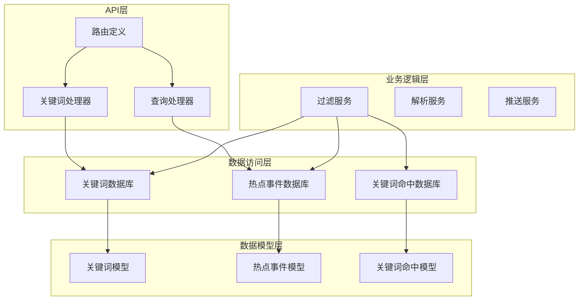
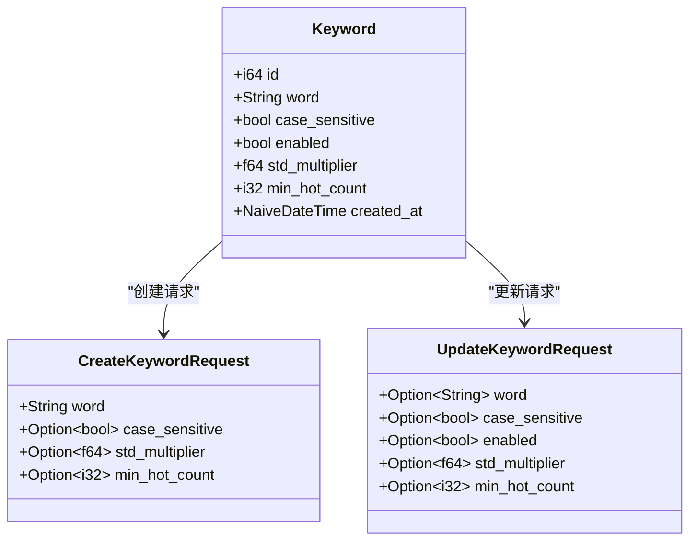
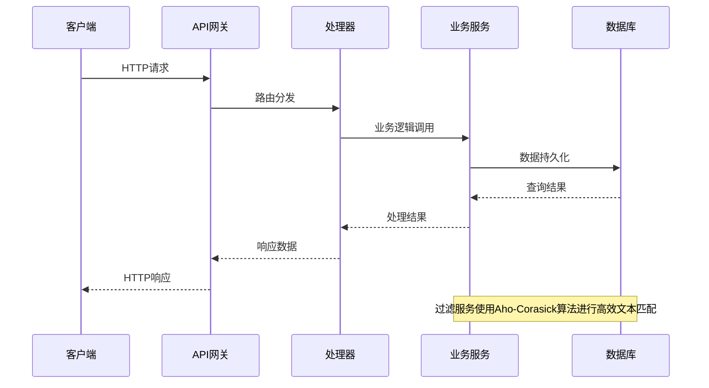
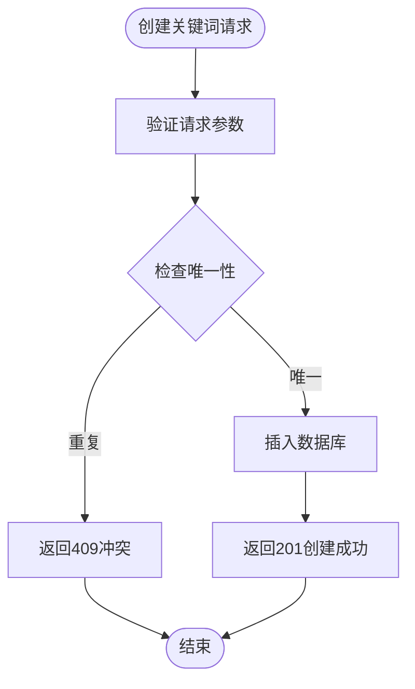
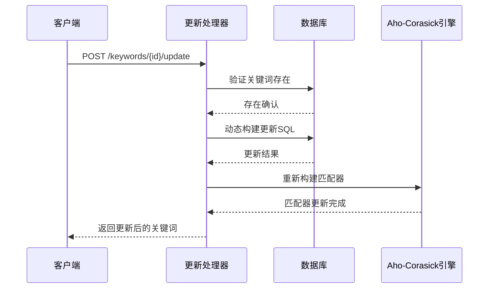
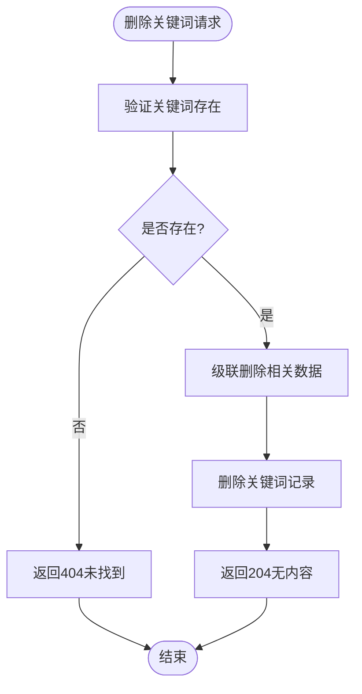
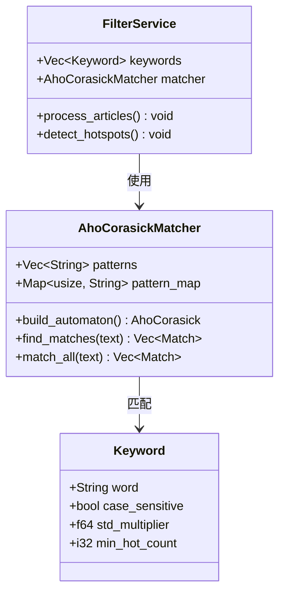
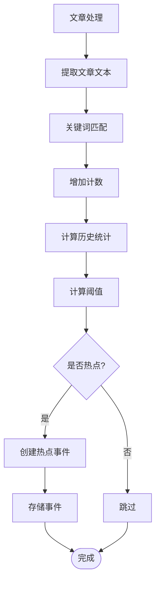
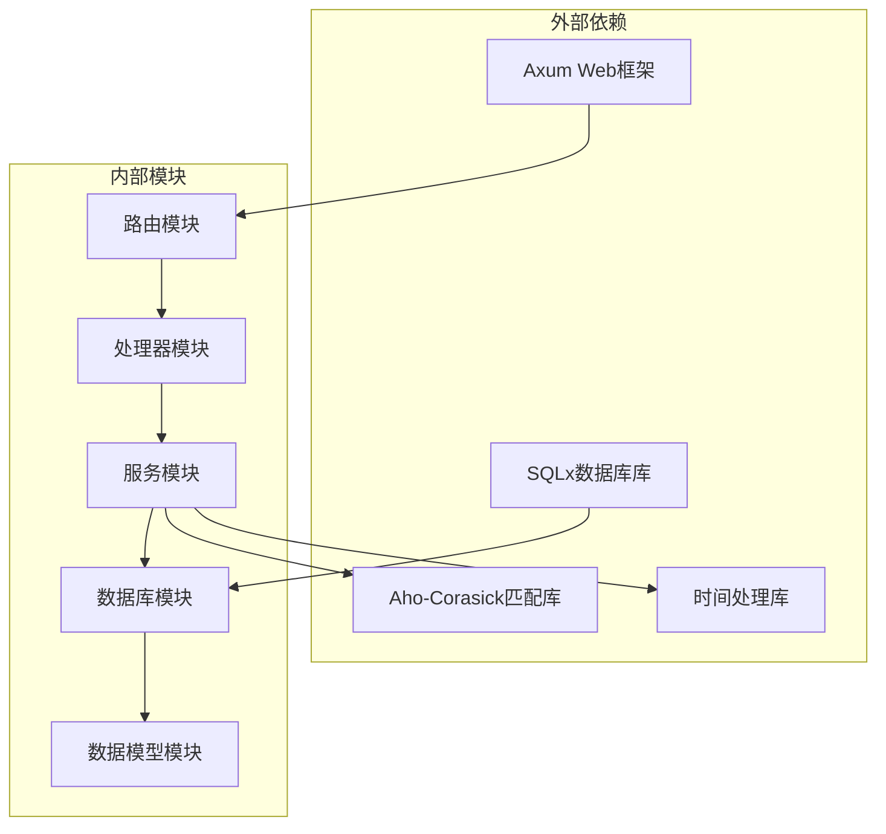
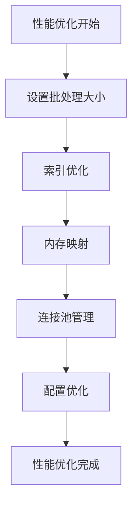

# 关键词管理API

<cite>
**本文档引用的文件**
- [src/handlers/keyword.rs](file://src/handlers/keyword.rs)
- [src/models/keyword.rs](file://src/models/keyword.rs)
- [src/db/keyword.rs](file://src/db/keyword.rs)
- [src/routes.rs](file://src/routes.rs)
- [src/services/filter.rs](file://src/services/filter.rs)
- [src/db/hot_event.rs](file://src/db/hot_event.rs)
- [src/handlers/query.rs](file://src/handlers/query.rs)
- [src/db/keyword_mention.rs](file://src/db/keyword_mention.rs)
- [docs/migrations/20260607044921_init.sql](file://docs/migrations/20260607044921_init.sql)
- [src/config.rs](file://src/config.rs)
- [docs/apis/keyword-api.md](file://docs/apis/keyword-api.md)
</cite>

## 目录
1. [简介](#简介)
2. [项目结构](#项目结构)
3. [核心组件](#核心组件)
4. [架构概览](#架构概览)
5. [详细组件分析](#详细组件分析)
6. [依赖关系分析](#依赖关系分析)
7. [性能考虑](#性能考虑)
8. [故障排除指南](#故障排除指南)
9. [结论](#结论)

## 简介

关键词管理API是AI趋势监控系统的核心组件，负责管理关键词的生命周期和热点检测功能。该API提供了完整的CRUD操作，支持关键词的创建、更新、删除和查询，并集成了基于Aho-Corasick算法的高效文本匹配引擎。

系统通过关键词配置实现智能热点检测，包括标准差倍数阈值设置、最小热点计数配置等高级功能。所有关键词操作都经过严格的验证和错误处理，确保系统的稳定性和数据完整性。

## 项目结构

AI趋势监控系统采用模块化设计，关键词管理功能位于以下关键模块中：

**图表来源**
- [src/routes.rs:14-56](file://src/routes.rs#L14-L56)
- [src/handlers/keyword.rs:1-82](file://src/handlers/keyword.rs#L1-L82)
- [src/services/filter.rs:1-284](file://src/services/filter.rs#L1-L284)

**章节来源**
- [src/routes.rs:14-56](file://src/routes.rs#L14-L56)
- [src/handlers/keyword.rs:1-82](file://src/handlers/keyword.rs#L1-L82)

## 核心组件

### 关键词数据模型

关键词系统的核心数据结构包括三个主要组件：

**图表来源**
- [src/models/keyword.rs:5-31](file://src/models/keyword.rs#L5-L31)

### 数据库架构

系统采用SQLite作为存储后端，关键表结构如下：

| 表名 | 描述 | 主要字段 |
|------|------|----------|
| keywords | 关键词配置表 | id, word(唯一), case_sensitive, enabled, std_multiplier, min_hot_count, created_at |
| keyword_mentions | 关键词命中明细表 | id, keyword_id, article_id, matched_at |
| hot_events | 热点事件表 | id, keyword_id, hour_bucket, count, mean_historical, stddev_historical, created_at |

**章节来源**
- [docs/migrations/20260607044921_init.sql:50-88](file://docs/migrations/20260607044921_init.sql#L50-L88)
- [src/models/keyword.rs:5-31](file://src/models/keyword.rs#L5-L31)

## 架构概览

关键词管理系统采用分层架构设计，实现了清晰的关注点分离：

**图表来源**
- [src/routes.rs:21-50](file://src/routes.rs#L21-L50)
- [src/services/filter.rs:13-284](file://src/services/filter.rs#L13-L284)

系统的核心处理流程包括：

1. **HTTP请求接收**：通过Axum框架处理RESTful请求
2. **业务逻辑执行**：调用相应的业务服务进行处理
3. **数据持久化**：使用SQLx进行数据库操作
4. **响应返回**：格式化API响应并返回给客户端

## 详细组件分析

### 关键词CRUD操作

#### 创建关键词

创建关键词时，系统支持以下配置选项：

| 参数 | 类型 | 默认值 | 描述 |
|------|------|--------|------|
| word | String | 必填 | 关键词文本内容 |
| case_sensitive | Boolean | false | 是否区分大小写 |
| std_multiplier | Number | 2.0 | 热点检测标准差倍数 |
| min_hot_count | Integer | 3 | 最小热点计数阈值 |

**图表来源**
- [src/handlers/keyword.rs:27-43](file://src/handlers/keyword.rs#L27-L43)
- [src/db/keyword.rs:5-19](file://src/db/keyword.rs#L5-L19)

#### 更新关键词

关键词更新支持部分字段更新，系统会动态构建SQL语句：

**图表来源**
- [src/handlers/keyword.rs:49-64](file://src/handlers/keyword.rs#L49-L64)
- [src/db/keyword.rs:57-106](file://src/db/keyword.rs#L57-L106)

#### 删除关键词

删除关键词时，系统会自动清理相关数据：

**图表来源**
- [src/handlers/keyword.rs:69-81](file://src/handlers/keyword.rs#L69-L81)
- [src/db/keyword.rs:108-115](file://src/db/keyword.rs#L108-L115)

### 匹配算法与配置

#### Aho-Corasick算法集成

系统使用Aho-Corasick算法实现高效的多模式字符串匹配：

**图表来源**
- [src/services/filter.rs:13-284](file://src/services/filter.rs#L13-L284)

#### 匹配规则配置

关键词匹配支持多种配置选项：

| 配置项 | 类型 | 默认值 | 描述 |
|--------|------|--------|------|
| case_sensitive | Boolean | false | 是否区分大小写匹配 |
| enabled | Boolean | true | 关键词是否启用 |
| std_multiplier | Number | 2.0 | 热点检测阈值倍数 |
| min_hot_count | Integer | 3 | 最小热点触发计数 |

### 热点检测与统计

#### 热点事件生成

系统通过历史统计计算热点事件：

**图表来源**
- [src/services/filter.rs:131-213](file://src/services/filter.rs#L131-L213)
- [src/db/hot_event.rs:107-125](file://src/db/hot_event.rs#L107-L125)

#### 趋势数据分析

系统提供关键词趋势分析功能：

| 参数 | 类型 | 默认值 | 描述 |
|------|------|--------|------|
| hours | Integer | 24 | 分析小时数范围 |
| keyword_id | Integer | 可选 | 指定关键词ID |

**章节来源**
- [src/handlers/query.rs:125-150](file://src/handlers/query.rs#L125-L150)
- [src/services/filter.rs:221-247](file://src/services/filter.rs#L221-L247)

## 依赖关系分析

### 组件依赖图

**图表来源**
- [src/main.rs:1-50](file://src/main.rs#L1-L50)
- [Cargo.toml:1-50](file://Cargo.toml#L1-L50)

### 数据流依赖

关键词管理的数据流遵循以下依赖关系：

1. **API层** → **处理器层** → **服务层** → **数据访问层** → **数据库层**

2. **配置依赖**：所有配置通过Config结构体统一管理
3. **错误处理**：统一的AppError类型处理各种异常情况
4. **中间件**：认证中间件确保API安全性

**章节来源**
- [src/config.rs:1-59](file://src/config.rs#L1-L59)
- [src/error.rs:1-50](file://src/error.rs#L1-L50)

## 性能考虑

### 内存使用优化

系统采用多种策略优化内存使用：

1. **批量处理**：过滤服务支持批处理模式，避免一次性加载大量数据
2. **连接池管理**：使用SQLx连接池减少数据库连接开销
3. **索引优化**：为常用查询字段建立索引
4. **内存映射**：使用Aho-Corasick的高效状态机

### 匹配性能优化

**图表来源**
- [src/services/filter.rs:277-284](file://src/services/filter.rs#L277-L284)
- [src/config.rs:38-43](file://src/config.rs#L38-L43)

### 缓存策略

系统实现多层次缓存机制：

1. **关键词缓存**：启用的关键词列表缓存
2. **匹配器缓存**：Aho-Corasick自动机缓存
3. **统计缓存**：历史统计数据缓存

## 故障排除指南

### 常见错误处理

| 错误类型 | HTTP状态码 | 描述 | 解决方案 |
|----------|------------|------|----------|
| 400 Bad Request | 400 | 请求参数无效 | 检查请求格式和必填字段 |
| 401 Unauthorized | 401 | 认证失败 | 验证Bearer token有效性 |
| 404 Not Found | 404 | 资源不存在 | 确认ID正确性和资源存在性 |
| 409 Conflict | 409 | 资源冲突 | 检查唯一约束冲突 |
| 500 Internal Server Error | 500 | 服务器内部错误 | 查看日志获取详细信息 |

### 调试建议

1. **启用详细日志**：检查过滤服务的日志输出
2. **数据库连接**：验证SQLite数据库连接状态
3. **内存使用**：监控关键词数量对内存的影响
4. **性能基准**：测试不同批处理大小的性能表现

**章节来源**
- [src/handlers/keyword.rs:33-40](file://src/handlers/keyword.rs#L33-L40)
- [src/services/filter.rs:18-22](file://src/services/filter.rs#L18-L22)

## 结论

关键词管理API提供了完整的企业级关键词管理解决方案，具有以下特点：

1. **完整的CRUD功能**：支持关键词的全生命周期管理
2. **高性能匹配**：基于Aho-Corasick算法的高效文本匹配
3. **智能热点检测**：基于统计学原理的热点事件识别
4. **可扩展架构**：模块化设计便于功能扩展
5. **生产就绪**：完善的错误处理和性能优化

系统通过合理的架构设计和优化策略，能够有效处理大规模关键词管理和实时热点检测需求，为AI趋势监控提供坚实的技术基础。