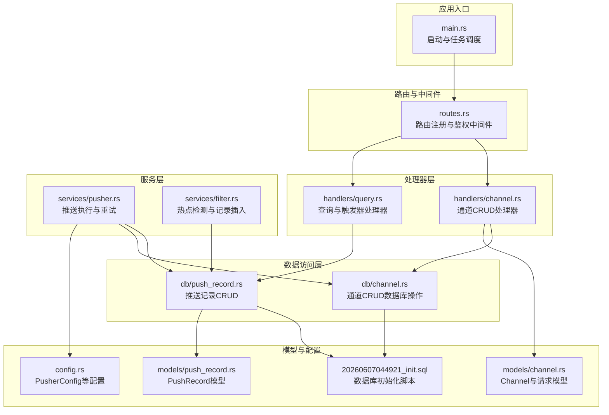
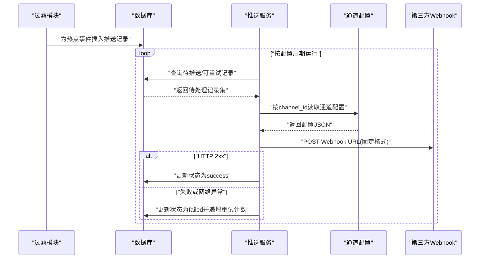
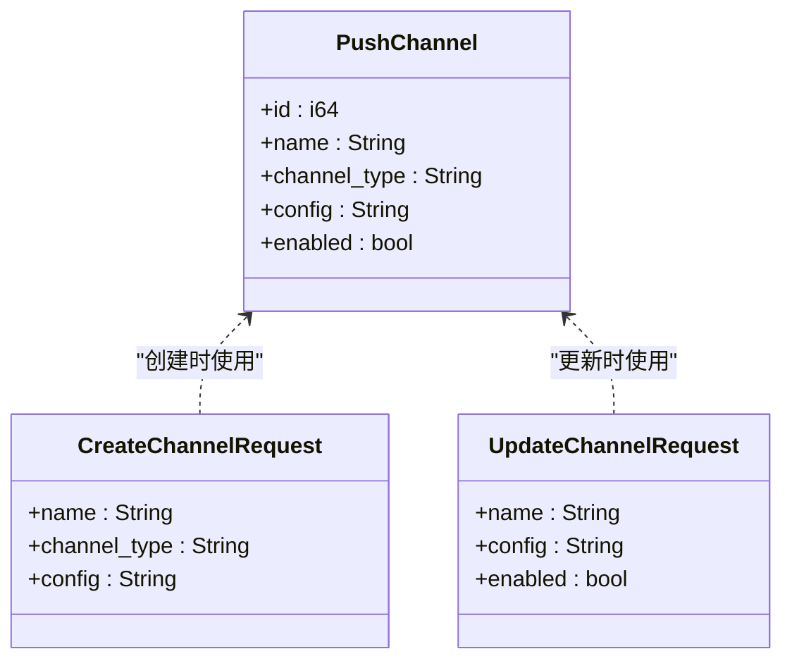
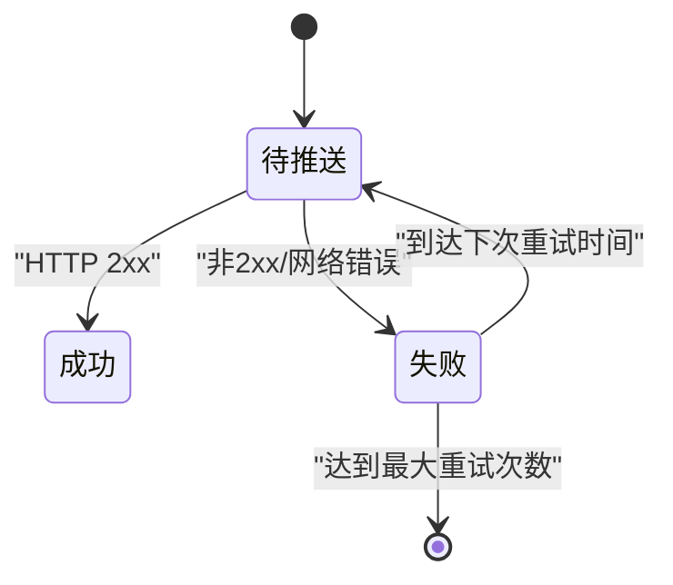
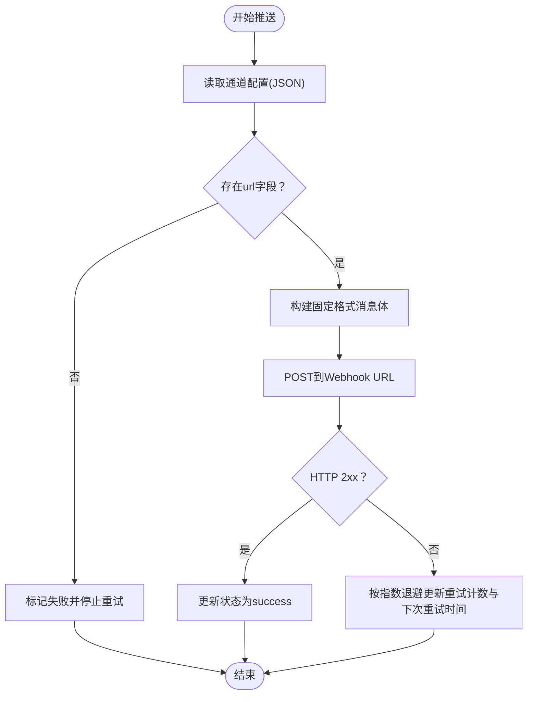
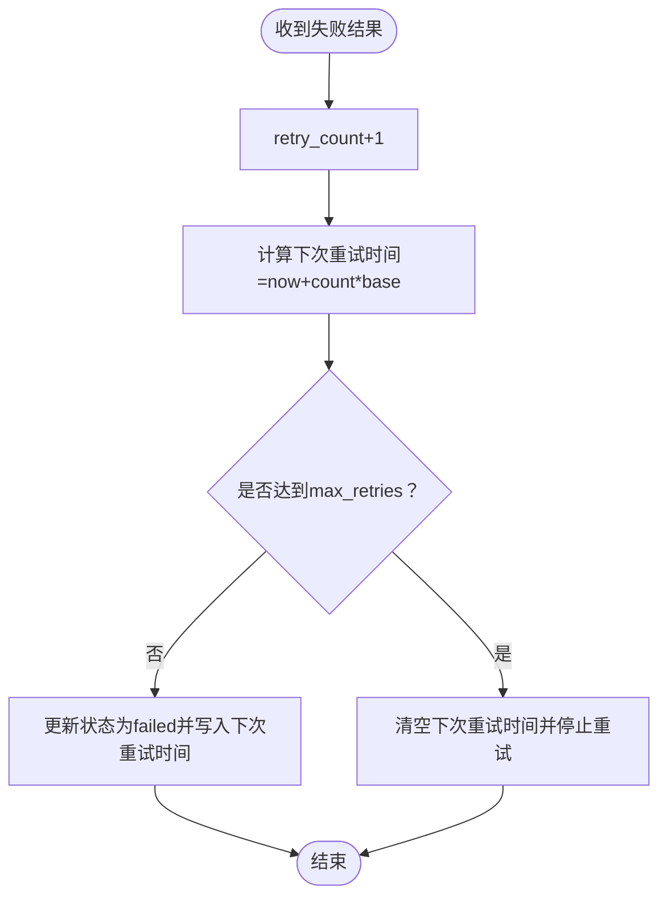
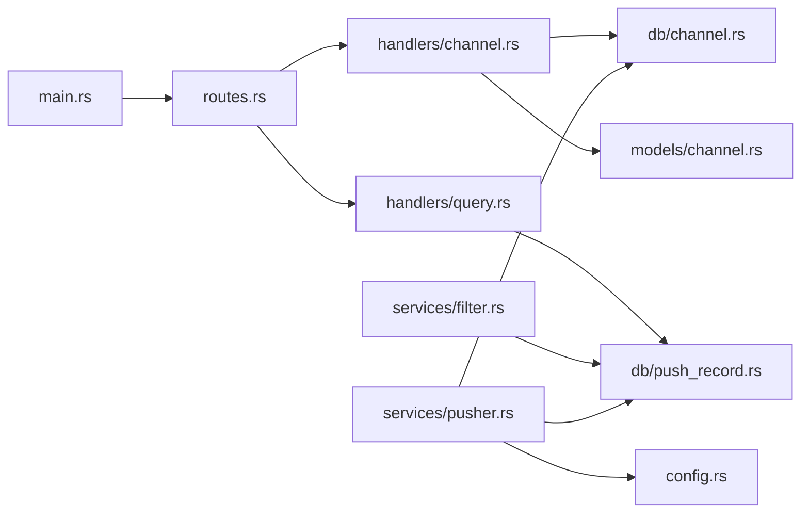

# 推送渠道API

<cite>
**本文引用的文件**
- [channel-api.md](file://docs/apis/channel-api.md)
- [channel.rs](file://src/models/channel.rs)
- [channel.rs](file://src/db/channel.rs)
- [channel.rs](file://src/handlers/channel.rs)
- [pusher.rs](file://src/services/pusher.rs)
- [push_record.rs](file://src/models/push_record.rs)
- [push_record.rs](file://src/db/push_record.rs)
- [routes.rs](file://src/routes.rs)
- [main.rs](file://src/main.rs)
- [config.rs](file://src/config.rs)
- [20260607044921_init.sql](file://docs/migrations/20260607044921_init.sql)
- [query.rs](file://src/handlers/query.rs)
</cite>

## 目录
1. [简介](#简介)
2. [项目结构](#项目结构)
3. [核心组件](#核心组件)
4. [架构总览](#架构总览)
5. [详细组件分析](#详细组件分析)
6. [依赖关系分析](#依赖关系分析)
7. [性能考量](#性能考量)
8. [故障排查指南](#故障排查指南)
9. [结论](#结论)
10. [附录](#附录)

## 简介
本文件面向AI趋势监控系统的“推送渠道”能力，提供从模型定义、API接口、推送流程到错误与重试策略的完整技术文档。重点覆盖：
- Channel模型结构与配置项
- CRUD API（Webhook URL、推送格式、状态）
- 推送渠道的启用/禁用与路由逻辑
- 不同推送格式的配置示例与最佳实践
- 失败重试机制与错误处理策略
- 监控指标与性能建议
- 每个API端点的请求/响应示例与错误码说明

## 项目结构
推送渠道API位于后端服务的路由层与业务层之间，围绕Channel模型与PushRecord模型协作完成热点事件的推送。

图表来源
- [main.rs:64-164](file://src/main.rs#L64-L164)
- [routes.rs:14-70](file://src/routes.rs#L14-L70)
- [channel.rs:12-71](file://src/handlers/channel.rs#L12-L71)
- [pusher.rs:1-259](file://src/services/pusher.rs#L1-L259)
- [push_record.rs:1-154](file://src/db/push_record.rs#L1-L154)
- [channel.rs:1-88](file://src/db/channel.rs#L1-L88)
- [config.rs:44-58](file://src/config.rs#L44-L58)
- [20260607044921_init.sql:92-118](file://docs/migrations/20260607044921_init.sql#L92-L118)

章节来源
- [routes.rs:14-70](file://src/routes.rs#L14-L70)
- [main.rs:64-164](file://src/main.rs#L64-L164)

## 核心组件
- Channel模型：描述推送渠道的基本信息与配置
- PushRecord模型：描述一次热点事件向某个渠道的推送记录
- 推送服务：负责轮询待推送与可重试记录，按渠道配置发送Webhook
- 路由与处理器：提供Channel的CRUD与查询接口
- 配置：包含推送轮询间隔、最大重试次数、基础重试秒数等

章节来源
- [channel.rs:4-26](file://src/models/channel.rs#L4-L26)
- [push_record.rs:5-16](file://src/models/push_record.rs#L5-L16)
- [config.rs:44-58](file://src/config.rs#L44-L58)

## 架构总览
推送渠道API的工作流如下：
- 过滤模块检测到热点事件后，为所有启用的通道生成推送记录
- 推送服务周期性扫描“待推送”和“到期可重试”的记录
- 对每条记录解析对应通道的配置，提取Webhook URL
- 发送固定格式的文本消息到目标URL
- 成功则更新状态为成功；失败则按指数退避策略更新重试计数与下次重试时间

图表来源
- [pusher.rs:11-43](file://src/services/pusher.rs#L11-L43)
- [pusher.rs:46-202](file://src/services/pusher.rs#L46-L202)
- [push_record.rs:45-63](file://src/db/push_record.rs#L45-L63)
- [channel.rs:26-30](file://src/db/channel.rs#L26-L30)

## 详细组件分析

### Channel模型与配置
- 字段说明
  - id：自增主键
  - name：显示名称
  - channel_type：通道类型，默认“webhook”，可扩展为“feishu”等
  - config：JSON字符串，当前用于存放Webhook URL（键为url），后续可扩展更多字段
  - enabled：是否启用该通道
- 请求模型
  - 创建请求：name、config（必需）、channel_type（可选，默认webhook）
  - 更新请求：name、config、enabled（均可选）

图表来源
- [channel.rs:4-26](file://src/models/channel.rs#L4-L26)

章节来源
- [channel.rs:4-26](file://src/models/channel.rs#L4-L26)
- [20260607044921_init.sql:94-100](file://docs/migrations/20260607044921_init.sql#L94-L100)

### 推送记录模型与状态机
- 字段说明
  - id、hot_event_id、channel_id：关联热点事件与通道
  - status：推送状态（pending/success/failed）
  - retry_count：已重试次数
  - next_retry_at：下次重试时间
  - created_at、updated_at：时间戳
- 状态流转
  - pending → success 或 failed
  - failed 且未达最大重试 → 重新进入 pending（基于 next_retry_at）

图表来源
- [push_record.rs:5-16](file://src/models/push_record.rs#L5-L16)
- [pusher.rs:207-242](file://src/services/pusher.rs#L207-L242)
- [push_record.rs:53-63](file://src/db/push_record.rs#L53-L63)

章节来源
- [push_record.rs:5-16](file://src/models/push_record.rs#L5-L16)
- [push_record.rs:45-109](file://src/db/push_record.rs#L45-L109)

### 推送格式与路由规则
- 路由规则
  - 过滤模块仅对“启用”的通道生成推送记录
  - 推送服务仅处理“待推送”和“到期可重试”的记录
- 推送格式
  - 当前固定为JSON对象，包含msgtype与text.content
  - text.content为格式化的文本内容，包含关键词、计数、小时桶、均值与标准差
- 渠道配置
  - 通过通道的config字段存储Webhook URL（键为url）
  - 若配置缺失或无效，推送标记为失败并停止重试

图表来源
- [pusher.rs:115-202](file://src/services/pusher.rs#L115-L202)
- [pusher.rs:207-242](file://src/services/pusher.rs#L207-L242)

章节来源
- [pusher.rs:115-202](file://src/services/pusher.rs#L115-L202)
- [pusher.rs:207-242](file://src/services/pusher.rs#L207-L242)

### CRUD API规范与示例

- 基础信息
  - Base URL：http://localhost:8080
  - 认证：所有端点需要 Bearer Token
  - Content-Type：JSON

- 列表通道
  - 方法与路径：GET /api/v1/channels
  - 返回：数组，按id升序
  - 字段：id、name、channel_type、config、enabled

- 创建通道
  - 方法与路径：POST /api/v1/channels
  - 必填：name、config（JSON字符串，至少包含url）
  - 可选：channel_type（默认webhook）
  - 返回：创建后的完整PushChannel对象（201）

- 更新通道
  - 方法与路径：POST /api/v1/channels/{id}/update
  - 路径参数：id
  - 可选字段：name、config、enabled
  - 返回：更新后的完整PushChannel对象（200）
  - 错误：404（通道不存在）

- 删除通道
  - 方法与路径：POST /api/v1/channels/{id}/delete
  - 路径参数：id
  - 返回：204（无内容）
  - 错误：404（通道不存在）

- 示例请求与响应
  - 列表通道
    - 请求：curl http://localhost:8080/api/v1/channels -H "Authorization: Bearer <token>"
    - 响应：包含data数组，元素为PushChannel对象
  - 创建通道
    - 请求：POST /api/v1/channels
    - 请求体：包含name、config（如{"url": "..."}）、可选channel_type
    - 响应：201，返回创建的PushChannel
  - 更新通道
    - 请求：POST /api/v1/channels/{id}/update
    - 请求体：name、config、enabled（任选其一或多个）
    - 响应：200，返回更新后的PushChannel
  - 删除通道
    - 请求：POST /api/v1/channels/{id}/delete
    - 响应：204

- 错误码
  - 404 NOT_FOUND：通道不存在（更新与删除）

章节来源
- [channel-api.md:17-192](file://docs/apis/channel-api.md#L17-L192)
- [channel.rs:12-71](file://src/handlers/channel.rs#L12-L71)

### 推送失败重试机制与错误处理
- 重试策略
  - 失败后递增retry_count，并计算下次重试时间
  - 下次重试时间 = 当前时间 + retry_count × retry_base_seconds
  - 达到max_retries后不再重试，等待人工干预
- 并发安全
  - 成功更新采用乐观锁：仅当当前状态等于期望状态时才更新
- 错误处理
  - 无法解析config中的url或网络错误均视为失败
  - 对于找不到通道或热点事件的情况，记录日志并跳过

图表来源
- [pusher.rs:207-242](file://src/services/pusher.rs#L207-L242)
- [push_record.rs:87-109](file://src/db/push_record.rs#L87-L109)

章节来源
- [pusher.rs:207-242](file://src/services/pusher.rs#L207-L242)
- [push_record.rs:65-109](file://src/db/push_record.rs#L65-L109)

### 配置项与最佳实践
- 配置项（PusherConfig）
  - interval_seconds：推送循环间隔
  - max_retries：最大重试次数
  - retry_base_seconds：每次重试的基础延迟秒数
- 最佳实践
  - 将interval_seconds设为稍大于max_retries×retry_base_seconds，避免堆积
  - 为高可用Webhook服务配置健康检查与限流策略
  - 使用独立的通道类型区分不同平台（如webhook、feishu），便于扩展
  - 在config中保留url字段，其他平台特定参数可作为扩展字段加入

章节来源
- [config.rs:44-58](file://src/config.rs#L44-L58)
- [pusher.rs:252-259](file://src/services/pusher.rs#L252-L259)

### 监控指标与性能考虑
- 指标建议
  - 推送成功率：success数量/总推送数量
  - 平均重试次数：failed数量与retry_count之和/总推送数量
  - 重试队列长度：failed且未达上限的记录数
  - 推送延迟：从记录创建到成功更新的时间
- 性能建议
  - 控制推送并发度，避免对下游Webhook造成压力
  - 合理设置interval_seconds，避免频繁扫描数据库
  - 对热点事件批量插入推送记录，减少重复写入

章节来源
- [push_record.rs:45-63](file://src/db/push_record.rs#L45-L63)
- [pusher.rs:11-43](file://src/services/pusher.rs#L11-L43)

## 依赖关系分析

图表来源
- [routes.rs:14-70](file://src/routes.rs#L14-L70)
- [channel.rs:12-71](file://src/handlers/channel.rs#L12-L71)
- [query.rs:97-165](file://src/handlers/query.rs#L97-L165)
- [pusher.rs:1-259](file://src/services/pusher.rs#L1-L259)
- [main.rs:86-111](file://src/main.rs#L86-L111)

章节来源
- [routes.rs:14-70](file://src/routes.rs#L14-L70)
- [main.rs:86-111](file://src/main.rs#L86-L111)

## 性能考量
- 数据库索引
  - push_records.status：加速查询待推送与可重试记录
- 查询优化
  - 仅查询enabled通道生成推送记录
  - 仅处理pending与到期failed记录
- 并发与批处理
  - 推送服务逐条处理，但可通过调整interval_seconds与max_retries平衡吞吐与稳定性

章节来源
- [20260607044921_init.sql:117-118](file://docs/migrations/20260607044921_init.sql#L117-L118)
- [push_record.rs:45-63](file://src/db/push_record.rs#L45-L63)
- [channel.rs:26-30](file://src/db/channel.rs#L26-L30)

## 故障排查指南
- 通道无法推送
  - 检查通道是否enabled
  - 检查config中是否存在url字段
  - 查看推送记录状态与重试计数
- 推送失败
  - 查看HTTP响应状态与网络错误日志
  - 确认Webhook服务可达与限流策略
- 重试过多
  - 调整retry_base_seconds与max_retries
  - 检查下游服务健康状况

章节来源
- [pusher.rs:115-202](file://src/services/pusher.rs#L115-L202)
- [pusher.rs:207-242](file://src/services/pusher.rs#L207-L242)
- [push_record.rs:65-109](file://src/db/push_record.rs#L65-L109)

## 结论
推送渠道API以简洁的Channel模型与PushRecord模型为核心，结合过滤与推送两个后台服务，实现了从热点检测到自动推送的闭环。通过可配置的重试策略与状态机设计，系统在保证可靠性的同时具备良好的可观测性与扩展性。建议在生产环境中配合完善的监控与告警体系，持续优化推送频率与下游服务的稳定性。

## 附录

### API端点一览与示例

- GET /api/v1/channels
  - 认证：需要
  - 响应：200，包含data数组
  - 示例：参见文档示例

- POST /api/v1/channels
  - 认证：需要
  - 请求体：name、config、可选channel_type
  - 响应：201，返回PushChannel
  - 示例：参见文档示例

- POST /api/v1/channels/{id}/update
  - 认证：需要
  - 请求体：name、config、enabled（任选）
  - 响应：200，返回更新后的PushChannel
  - 错误：404（通道不存在）

- POST /api/v1/channels/{id}/delete
  - 认证：需要
  - 响应：204
  - 错误：404（通道不存在）

章节来源
- [channel-api.md:17-192](file://docs/apis/channel-api.md#L17-L192)