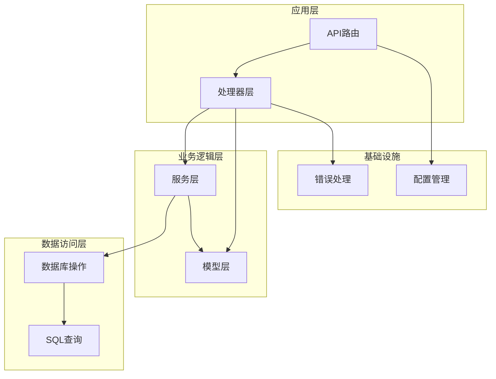
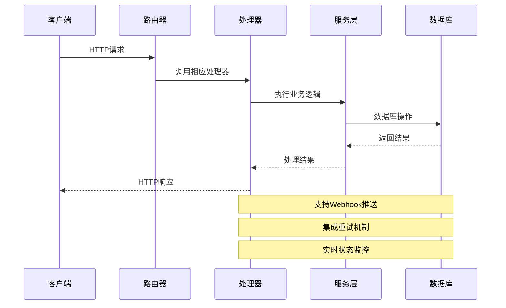
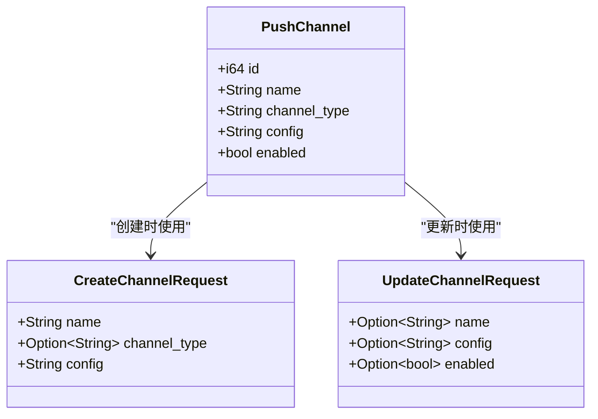
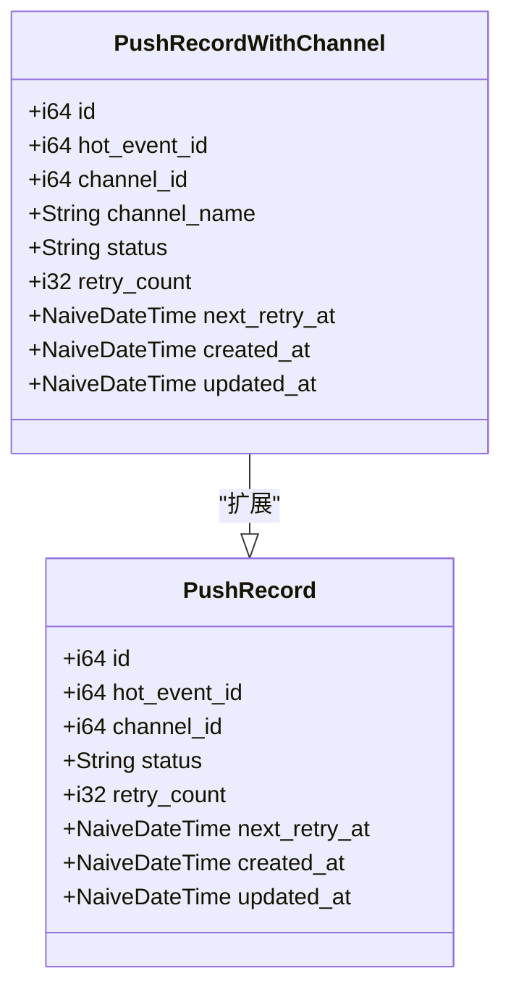
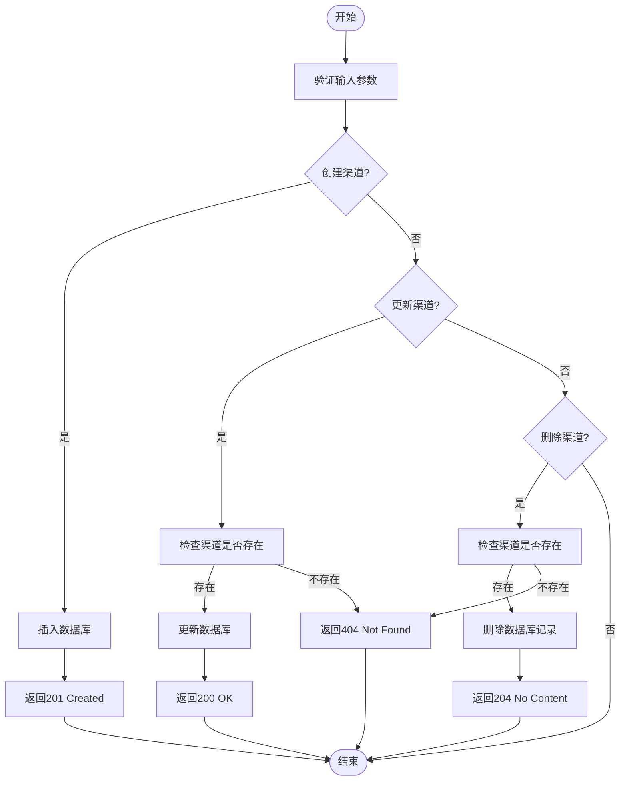
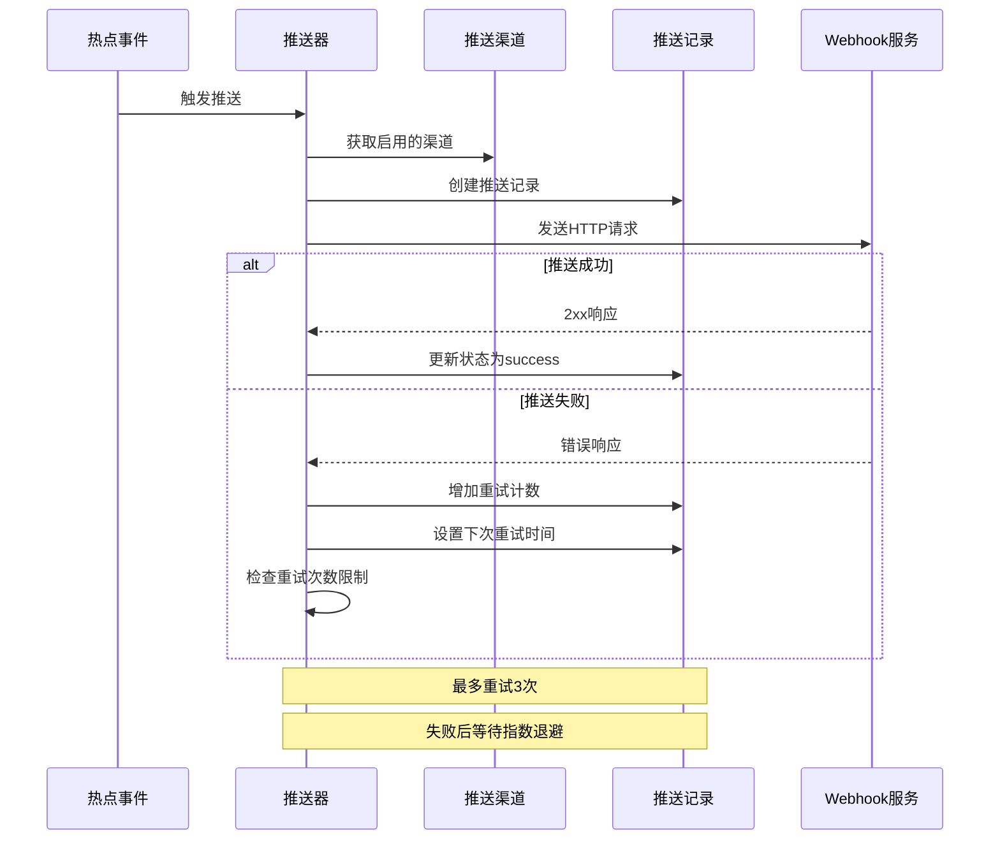

# 推送渠道管理API

<cite>
**本文档引用的文件**
- [src/handlers/channel.rs](file://src/handlers/channel.rs)
- [src/models/channel.rs](file://src/models/channel.rs)
- [src/db/channel.rs](file://src/db/channel.rs)
- [src/routes.rs](file://src/routes.rs)
- [src/models/push_record.rs](file://src/models/push_record.rs)
- [src/db/push_record.rs](file://src/db/push_record.rs)
- [src/services.rs](file://src/services.rs)
- [docs/apis/token-api.md](file://docs/apis/token-api.md)
- [Cargo.toml](file://Cargo.toml)
</cite>

## 目录
1. [简介](#简介)
2. [项目结构](#项目结构)
3. [核心组件](#核心组件)
4. [架构概览](#架构概览)
5. [详细组件分析](#详细组件分析)
6. [依赖关系分析](#依赖关系分析)
7. [性能考虑](#性能考虑)
8. [故障排除指南](#故障排除指南)
9. [结论](#结论)

## 简介

推送渠道管理API是AI趋势工具系统中的核心组件，负责管理各种推送渠道的生命周期和推送记录跟踪。该API支持Webhook类型的推送渠道，提供完整的CRUD操作，并集成了推送记录的跟踪、重试机制和状态监控功能。

系统采用Rust语言开发，基于Axum框架构建，使用SQLite作为数据存储，通过SQLx进行数据库操作。API遵循RESTful设计原则，提供标准化的HTTP接口用于推送渠道的管理。

## 项目结构

AI趋势工具采用模块化架构设计，主要分为以下几个层次：

**图表来源**
- [src/routes.rs:14-56](file://src/routes.rs#L14-L56)
- [src/handlers.rs:1-7](file://src/handlers.rs#L1-L7)

**章节来源**
- [src/routes.rs:14-56](file://src/routes.rs#L14-L56)
- [src/handlers.rs:1-7](file://src/handlers.rs#L1-L7)

## 核心组件

推送渠道管理API的核心组件包括：

### 数据模型
- **PushChannel**: 表示推送渠道的基本信息，包含ID、名称、类型和配置
- **CreateChannelRequest**: 创建渠道时的请求参数模型
- **UpdateChannelRequest**: 更新渠道时的请求参数模型
- **PushRecord**: 推送记录模型，用于跟踪推送状态和重试信息

### 处理器函数
- **list_channels**: 获取所有推送渠道列表
- **create_channel**: 创建新的推送渠道
- **update_channel**: 更新现有推送渠道
- **delete_channel**: 删除推送渠道

### 数据库操作
- **create_channel**: 在数据库中创建新渠道
- **list_channels**: 查询所有渠道
- **update_channel**: 更新渠道信息
- **delete_channel**: 删除渠道记录

**章节来源**
- [src/models/channel.rs:4-25](file://src/models/channel.rs#L4-L25)
- [src/handlers/channel.rs:12-70](file://src/handlers/channel.rs#L12-L70)
- [src/db/channel.rs:5-93](file://src/db/channel.rs#L5-L93)

## 架构概览

推送渠道管理API采用分层架构设计，确保关注点分离和代码的可维护性：

**图表来源**
- [src/routes.rs:36-49](file://src/routes.rs#L36-L49)
- [src/handlers/channel.rs:15-70](file://src/handlers/channel.rs#L15-L70)

系统架构特点：
- **RESTful设计**: 遵循HTTP标准，使用标准的CRUD操作
- **中间件集成**: 包含认证中间件和CORS支持
- **异步处理**: 基于Tokio运行时的异步I/O操作
- **类型安全**: 使用Rust的类型系统确保编译时安全

**章节来源**
- [src/routes.rs:14-56](file://src/routes.rs#L14-L56)
- [Cargo.toml:8-12](file://Cargo.toml#L8-L12)

## 详细组件分析

### 推送渠道模型

推送渠道使用JSON字符串存储配置信息，支持灵活的渠道类型扩展：

**图表来源**
- [src/models/channel.rs:4-25](file://src/models/channel.rs#L4-L25)

### 推送记录模型

推送记录用于跟踪每个推送事件的状态和重试历史：

**图表来源**
- [src/models/push_record.rs:5-15](file://src/models/push_record.rs#L5-L15)
- [src/db/push_record.rs:116-127](file://src/db/push_record.rs#L116-L127)

### API端点定义

#### 渠道管理端点

| 方法 | 端点 | 描述 | 认证 |
|------|------|------|------|
| GET | `/api/v1/channels` | 获取所有推送渠道 | 是 |
| POST | `/api/v1/channels` | 创建新的推送渠道 | 是 |
| POST | `/api/v1/channels/{id}/update` | 更新指定渠道 | 是 |
| POST | `/api/v1/channels/{id}/delete` | 删除指定渠道 | 是 |

#### 推送记录端点

| 方法 | 端点 | 描述 | 认证 |
|------|------|------|------|
| GET | `/api/v1/hotspots/{id}/push-records` | 获取热点事件的推送记录 | 是 |
| POST | `/api/v1/trigger/pusher` | 触发推送器执行推送 | 是 |

**章节来源**
- [src/routes.rs:36-48](file://src/routes.rs#L36-L48)

### 数据库操作流程

**图表来源**
- [src/handlers/channel.rs:15-70](file://src/handlers/channel.rs#L15-L70)
- [src/db/channel.rs:5-93](file://src/db/channel.rs#L5-L93)

**章节来源**
- [src/handlers/channel.rs:15-70](file://src/handlers/channel.rs#L15-L70)
- [src/db/channel.rs:5-93](file://src/db/channel.rs#L5-L93)

### 推送执行流程

**图表来源**
- [src/db/push_record.rs:45-88](file://src/db/push_record.rs#L45-L88)
- [src/services.rs:1-4](file://src/services.rs#L1-L4)

## 依赖关系分析

系统依赖关系图展示了各模块之间的交互关系：

```mermaid
graph LR
subgraph "外部依赖"
Axum[Axum Web框架]
SQLx[SQLx数据库库]
Reqwest[Reqwest HTTP客户端]
Serde[Serde序列化]
end
subgraph "内部模块"
Routes[路由模块]
Handlers[处理器模块]
Models[模型模块]
DB[数据库模块]
Services[服务模块]
end
Axum --> Routes
SQLx --> DB
Reqwest --> Services
Serde --> Models
Routes --> Handlers
Handlers --> DB
Handlers --> Models
Services --> DB
Services --> Models
Handlers --> Services
DB --> Models
```

**图表来源**
- [Cargo.toml:6-47](file://Cargo.toml#L6-L47)
- [src/routes.rs:1-12](file://src/routes.rs#L1-L12)

**章节来源**
- [Cargo.toml:6-47](file://Cargo.toml#L6-L47)

## 性能考虑

### 数据库优化
- 使用SQLite内存数据库进行开发和测试
- 为常用查询字段建立索引
- 采用批量操作减少数据库往返次数

### 异步处理
- 基于Tokio运行时的异步I/O操作
- 非阻塞的HTTP请求处理
- 并发连接池管理

### 缓存策略
- 内存中的渠道配置缓存
- 避免重复的数据库查询
- 合理的缓存失效策略

## 故障排除指南

### 常见错误类型

| 错误码 | 错误类型 | 描述 | 解决方案 |
|--------|----------|------|----------|
| 400 | BAD_REQUEST | 请求参数无效 | 验证请求体格式和必需字段 |
| 401 | UNAUTHORIZED | 认证失败 | 检查Bearer令牌有效性 |
| 404 | NOT_FOUND | 资源不存在 | 确认渠道ID正确性 |
| 409 | CONFLICT | 唯一约束冲突 | 检查重复的渠道名称 |
| 500 | DATABASE_ERROR | 数据库操作失败 | 查看数据库日志 |

### 推送失败诊断

1. **网络连接问题**
   - 检查Webhook URL可达性
   - 验证防火墙和代理设置
   - 确认SSL证书有效性

2. **认证问题**
   - 验证渠道配置中的认证信息
   - 检查令牌过期情况
   - 确认权限范围设置

3. **速率限制**
   - 监控API调用频率
   - 实施适当的退避策略
   - 考虑使用队列系统

**章节来源**
- [docs/apis/token-api.md:17-37](file://docs/apis/token-api.md#L17-L37)

## 结论

推送渠道管理API提供了完整的企业级推送解决方案，具有以下优势：

### 核心特性
- **灵活的渠道配置**: 支持多种推送平台的Webhook配置
- **完善的生命周期管理**: 全面的CRUD操作支持
- **智能重试机制**: 自动化的失败重试和状态跟踪
- **实时监控能力**: 提供推送状态的实时查看和统计

### 技术优势
- **类型安全**: 基于Rust的编译时类型检查
- **高性能**: 异步I/O和并发处理
- **可扩展性**: 模块化设计便于功能扩展
- **可靠性**: 完善的错误处理和恢复机制

### 应用场景
该API适用于需要实时通知和消息推送的各种应用场景，包括但不限于：
- 企业内部消息通知
- 第三方平台集成
- 实时事件告警
- 多渠道消息分发

通过标准化的RESTful接口和强大的后台处理能力，推送渠道管理API为企业提供了可靠、高效的推送解决方案。