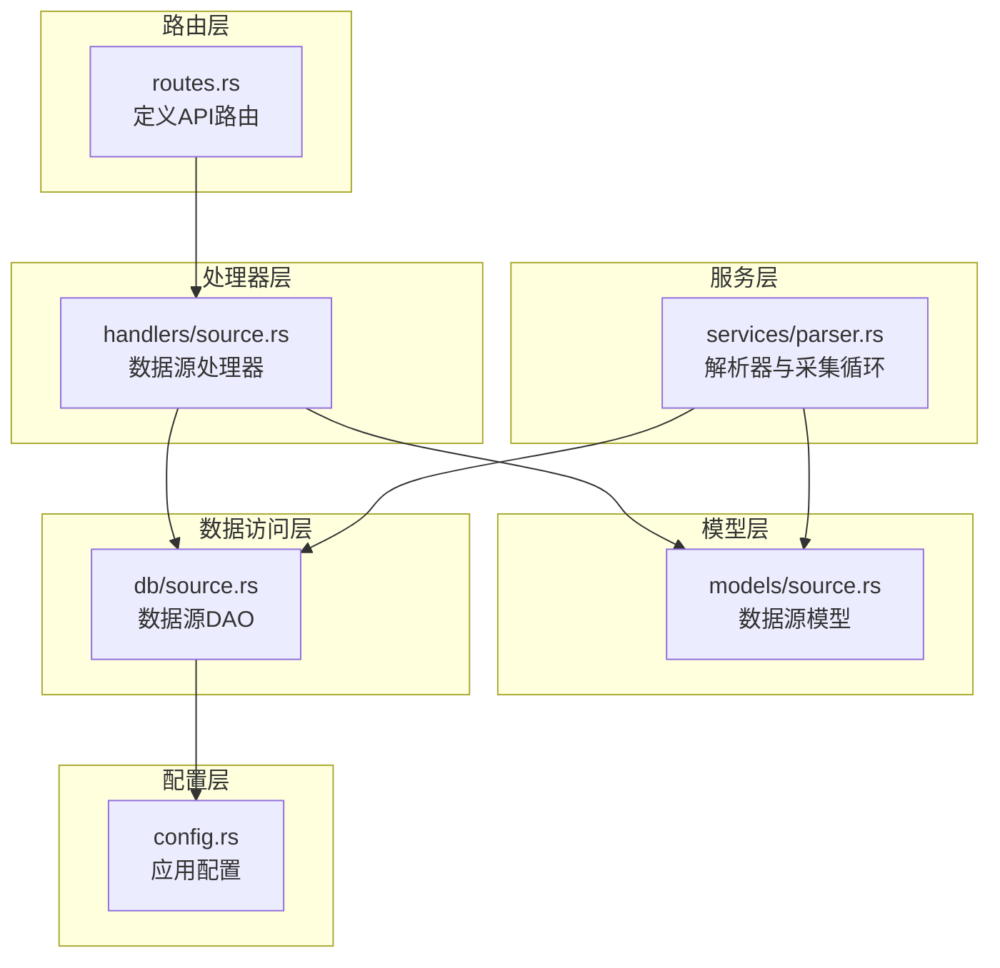
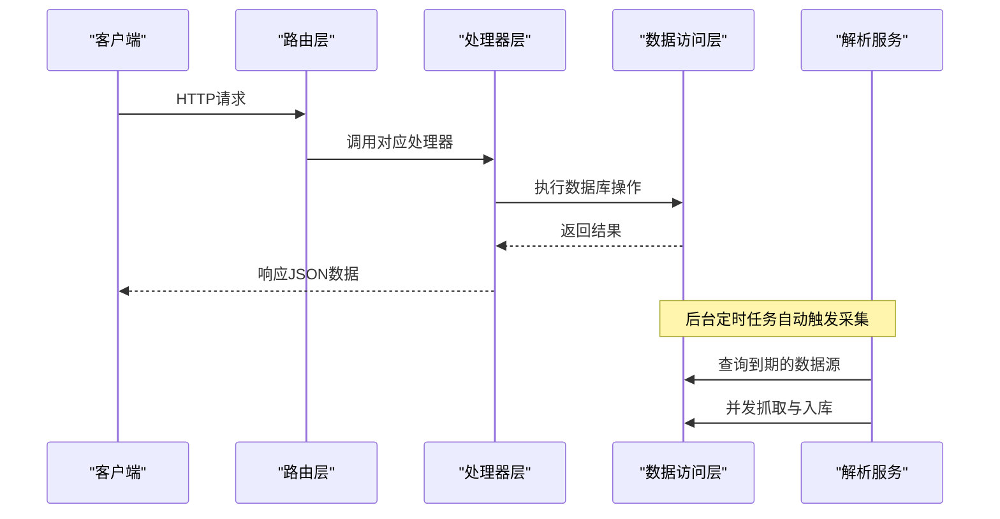
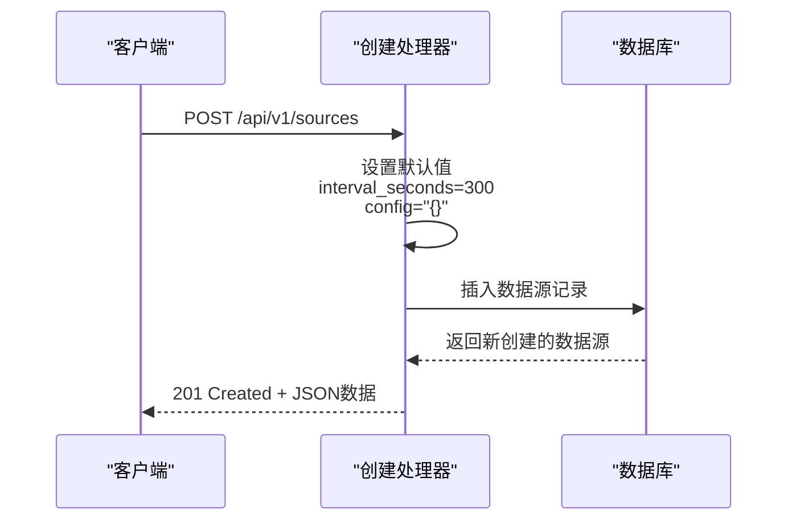
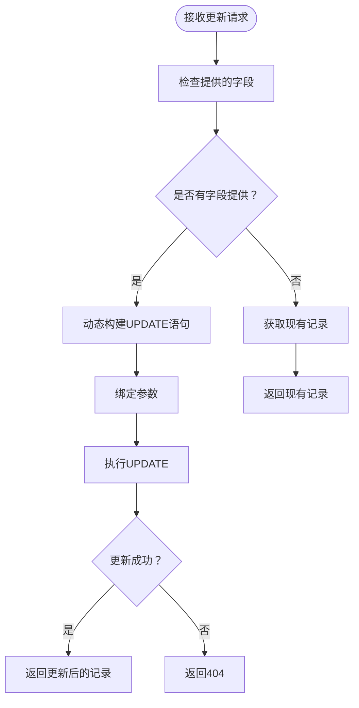
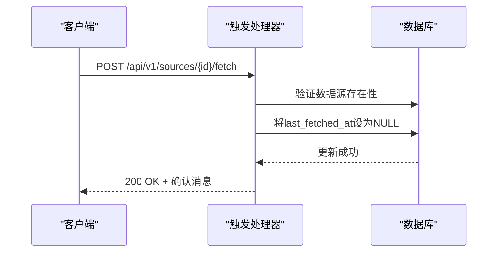
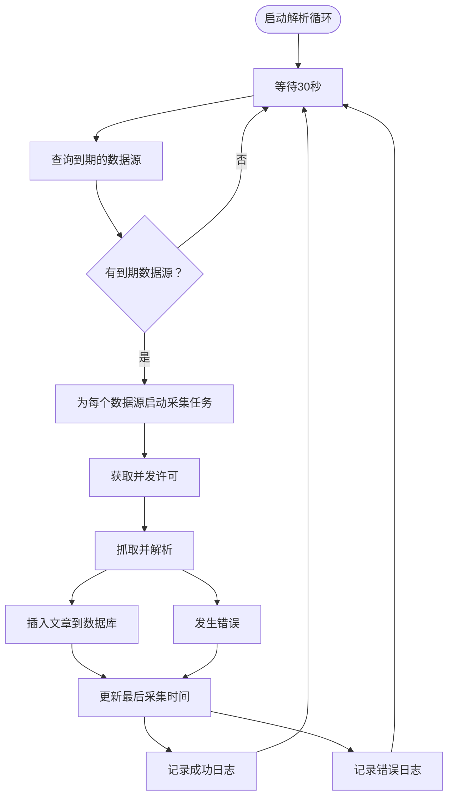
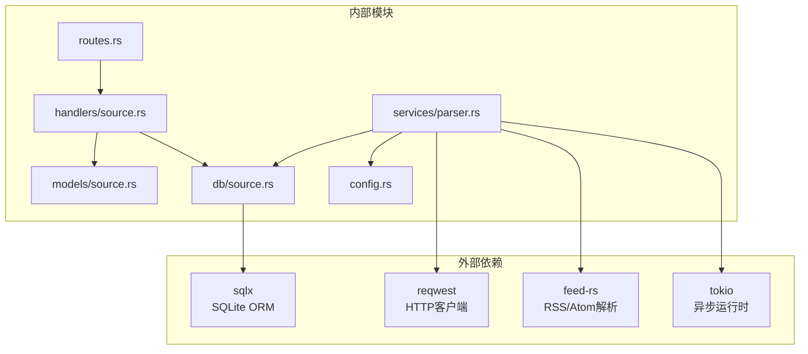
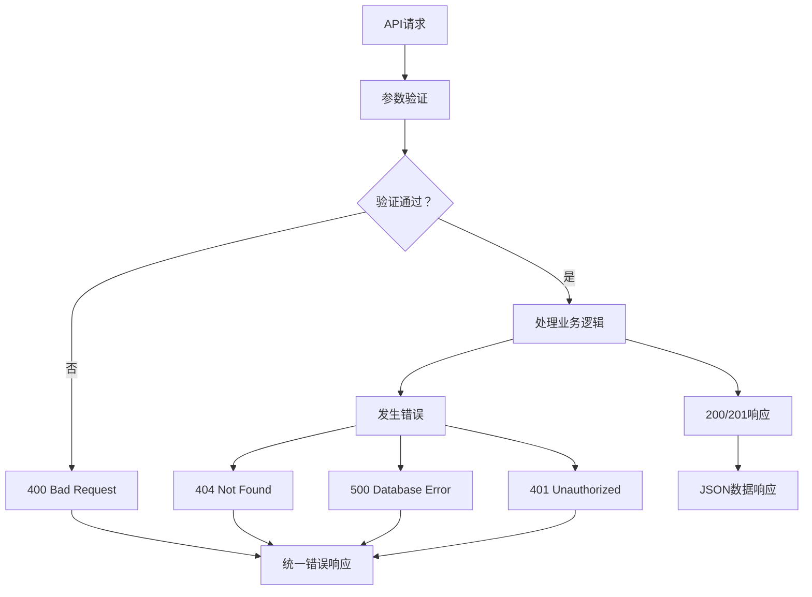

# 数据源管理API

<cite>
**本文档引用的文件**
- [src/routes.rs](file://src/routes.rs)
- [src/handlers/source.rs](file://src/handlers/source.rs)
- [src/models/source.rs](file://src/models/source.rs)
- [src/db/source.rs](file://src/db/source.rs)
- [src/services/parser.rs](file://src/services/parser.rs)
- [src/error.rs](file://src/error.rs)
- [docs/migrations/20260607044921_init.sql](file://docs/migrations/20260607044921_init.sql)
- [src/config.rs](file://src/config.rs)
- [openspec/specs/source-crud-api/spec.md](file://openspec/specs/source-crud-api/spec.md)
</cite>

## 目录
1. [简介](#简介)
2. [项目结构](#项目结构)
3. [核心组件](#核心组件)
4. [架构概览](#架构概览)
5. [详细组件分析](#详细组件分析)
6. [依赖关系分析](#依赖关系分析)
7. [性能考虑](#性能考虑)
8. [故障排除指南](#故障排除指南)
9. [结论](#结论)
10. [附录](#附录)

## 简介
本文件为数据源管理API的详细RESTful API文档，涵盖RSS/Atom数据源的完整生命周期管理：创建、配置、启用/禁用、更新、删除、手动触发采集等。文档还详细说明了数据源URL验证、内容解析配置、采集频率设置、状态监控、采集历史查询、错误日志查看、优先级设置、并发采集控制、失败重试机制以及批量数据源管理与导入导出功能。

## 项目结构
数据源管理API位于后端服务的路由层，采用模块化设计：
- 路由层：定义RESTful端点与中间件
- 处理器层：实现业务逻辑与请求响应封装
- 模型层：定义数据结构与序列化
- 数据访问层：封装SQL操作
- 服务层：实现后台解析与采集任务
- 配置层：管理运行时参数



**图表来源**
- [src/routes.rs:14-56](file://src/routes.rs#L14-L56)
- [src/handlers/source.rs:12-91](file://src/handlers/source.rs#L12-L91)
- [src/models/source.rs:5-39](file://src/models/source.rs#L5-L39)
- [src/db/source.rs:5-143](file://src/db/source.rs#L5-L143)
- [src/services/parser.rs:105-194](file://src/services/parser.rs#L105-L194)
- [src/config.rs:31-35](file://src/config.rs#L31-L35)

**章节来源**
- [src/routes.rs:14-56](file://src/routes.rs#L14-L56)
- [src/handlers/source.rs:12-91](file://src/handlers/source.rs#L12-L91)
- [src/models/source.rs:5-39](file://src/models/source.rs#L5-L39)
- [src/db/source.rs:5-143](file://src/db/source.rs#L5-L143)
- [src/services/parser.rs:105-194](file://src/services/parser.rs#L105-L194)
- [src/config.rs:31-35](file://src/config.rs#L31-L35)

## 核心组件
数据源管理API的核心组件包括：
- 路由定义：在路由层集中注册数据源相关端点
- 处理器函数：实现具体的业务逻辑，包括列表、创建、更新、删除、手动触发采集
- 数据模型：定义数据源实体及请求/响应结构
- 数据访问层：提供数据库操作接口
- 解析服务：实现后台采集循环与并发控制

**章节来源**
- [src/routes.rs:25-30](file://src/routes.rs#L25-L30)
- [src/handlers/source.rs:12-91](file://src/handlers/source.rs#L12-L91)
- [src/models/source.rs:5-39](file://src/models/source.rs#L5-L39)
- [src/db/source.rs:5-143](file://src/db/source.rs#L5-L143)
- [src/services/parser.rs:105-194](file://src/services/parser.rs#L105-L194)

## 架构概览
数据源管理API采用分层架构，确保关注点分离与可维护性：



**图表来源**
- [src/routes.rs:14-56](file://src/routes.rs#L14-L56)
- [src/handlers/source.rs:12-91](file://src/handlers/source.rs#L12-L91)
- [src/db/source.rs:130-142](file://src/db/source.rs#L130-L142)
- [src/services/parser.rs:105-194](file://src/services/parser.rs#L105-L194)

## 详细组件分析

### 数据源模型与数据结构
数据源模型定义了完整的数据结构，支持RSS/Atom等多种类型的数据源。


**图表来源**
- [src/models/source.rs:5-39](file://src/models/source.rs#L5-L39)

**章节来源**
- [src/models/source.rs:5-39](file://src/models/source.rs#L5-L39)
- [docs/migrations/20260607044921_init.sql:17-28](file://docs/migrations/20260607044921_init.sql#L17-L28)

### 路由与端点定义
数据源管理API在路由层集中定义，支持完整的CRUD操作和手动触发采集。

```mermaid
flowchart TD
Start(["HTTP请求"]) --> Route{"匹配路由"}
Route --> |GET /api/v1/sources| ListSources["列出所有数据源"]
Route --> |POST /api/v1/sources| CreateSource["创建数据源"]
Route --> |POST /api/v1/sources/{id}/update| UpdateSource["更新数据源"]
Route --> |POST /api/v1/sources/{id}/delete| DeleteSource["删除数据源"]
Route --> |POST /api/v1/sources/{id}/fetch| TriggerFetch["手动触发采集"]
ListSources --> Handler["调用对应处理器"]
CreateSource --> Handler
UpdateSource --> Handler
DeleteSource --> Handler
TriggerFetch --> Handler
Handler --> DB["执行数据库操作"]
DB --> Response["返回JSON响应"]
```

**图表来源**
- [src/routes.rs:25-30](file://src/routes.rs#L25-L30)
- [src/handlers/source.rs:12-91](file://src/handlers/source.rs#L12-L91)

**章节来源**
- [src/routes.rs:25-30](file://src/routes.rs#L25-L30)
- [src/handlers/source.rs:12-91](file://src/handlers/source.rs#L12-L91)

### 数据源创建流程
数据源创建流程包含默认值处理与数据库插入操作。



**图表来源**
- [src/handlers/source.rs:27-33](file://src/handlers/source.rs#L27-L33)
- [src/db/source.rs:5-22](file://src/db/source.rs#L5-L22)

**章节来源**
- [src/handlers/source.rs:27-33](file://src/handlers/source.rs#L27-L33)
- [src/db/source.rs:5-22](file://src/db/source.rs#L5-L22)

### 数据源更新流程
数据源更新支持部分字段更新，动态构建SQL语句。



**图表来源**
- [src/db/source.rs:42-93](file://src/db/source.rs#L42-L93)

**章节来源**
- [src/db/source.rs:42-93](file://src/db/source.rs#L42-L93)

### 手动触发采集流程
手动触发采集通过重置最后采集时间实现立即采集。



**图表来源**
- [src/handlers/source.rs:77-90](file://src/handlers/source.rs#L77-L90)
- [src/db/source.rs:114-125](file://src/db/source.rs#L114-L125)

**章节来源**
- [src/handlers/source.rs:77-90](file://src/handlers/source.rs#L77-L90)
- [src/db/source.rs:114-125](file://src/db/source.rs#L114-L125)

### 后台解析与采集循环
后台解析服务实现定时采集、并发控制与错误处理。



**图表来源**
- [src/services/parser.rs:105-194](file://src/services/parser.rs#L105-L194)

**章节来源**
- [src/services/parser.rs:105-194](file://src/services/parser.rs#L105-L194)

## 依赖关系分析



**图表来源**
- [src/db/source.rs:1-3](file://src/db/source.rs#L1-L3)
- [src/services/parser.rs:1-9](file://src/services/parser.rs#L1-L9)
- [src/config.rs:31-35](file://src/config.rs#L31-L35)

**章节来源**
- [src/db/source.rs:1-3](file://src/db/source.rs#L1-L3)
- [src/services/parser.rs:1-9](file://src/services/parser.rs#L1-L9)
- [src/config.rs:31-35](file://src/config.rs#L31-L35)

## 性能考虑
基于代码分析，数据源管理API的性能特性如下：

### 并发控制
- 最大并发采集数：通过配置参数限制同时进行的采集任务数量
- 信号量机制：使用Tokio信号量确保并发安全
- 默认30秒轮询间隔：平衡系统负载与实时性

### 数据库优化
- WAL模式：提升写入性能
- 外键约束：保证数据一致性
- 索引策略：为常用查询字段建立索引

### 内存管理
- 流式解析：使用feed-rs进行流式RSS/Atom解析
- 异步I/O：避免阻塞主线程
- 连接池：复用数据库连接

**章节来源**
- [src/config.rs:31-35](file://src/config.rs#L31-L35)
- [src/services/parser.rs:105-194](file://src/services/parser.rs#L105-L194)
- [src/db.rs:19-26](file://src/db.rs#L19-L26)

## 故障排除指南

### 常见错误类型与处理
系统定义了多种错误类型，提供统一的错误响应格式：



**图表来源**
- [src/error.rs:8-50](file://src/error.rs#L8-L50)

**章节来源**
- [src/error.rs:8-50](file://src/error.rs#L8-L50)

### 采集失败处理
后台解析服务实现了完善的错误处理机制：
- 记录详细的错误日志
- 即使失败也更新最后采集时间
- 继续处理其他数据源
- 支持后续重试

**章节来源**
- [src/services/parser.rs:179-189](file://src/services/parser.rs#L179-L189)

## 结论
数据源管理API提供了完整的RSS/Atom数据源生命周期管理能力，具有以下特点：
- RESTful设计，遵循HTTP标准
- 完善的错误处理与响应格式
- 可配置的采集频率与并发控制
- 后台自动采集与手动触发相结合
- 清晰的模块化架构便于维护

该API为AI趋势监测系统提供了可靠的数据源管理基础，支持从单个数据源到大规模批量管理的场景需求。

## 附录

### API端点一览表
- `GET /api/v1/sources` - 列出所有数据源
- `POST /api/v1/sources` - 创建数据源
- `POST /api/v1/sources/{id}/update` - 更新数据源
- `POST /api/v1/sources/{id}/delete` - 删除数据源
- `POST /api/v1/sources/{id}/fetch` - 手动触发采集

### 数据源配置示例
```json
{
  "type": "rss",
  "name": "示例RSS源",
  "url": "https://example.com/rss",
  "interval_seconds": 300,
  "config": "{}"
}
```

### 验证规则
- 必填字段：type、name、url
- 默认值：interval_seconds默认300秒，config默认空JSON
- URL格式：通过HTTP客户端验证
- 并发限制：受配置参数控制

**章节来源**
- [openspec/specs/source-crud-api/spec.md:24-42](file://openspec/specs/source-crud-api/spec.md#L24-L42)
- [src/models/source.rs:21-38](file://src/models/source.rs#L21-L38)