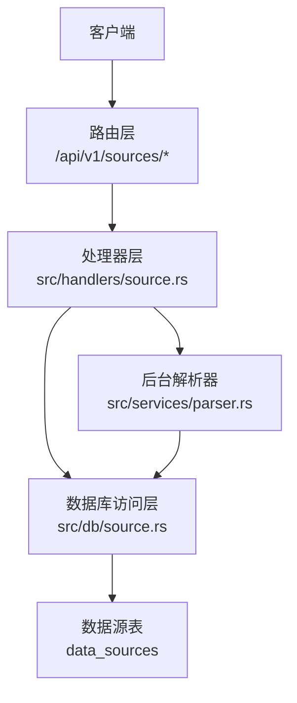
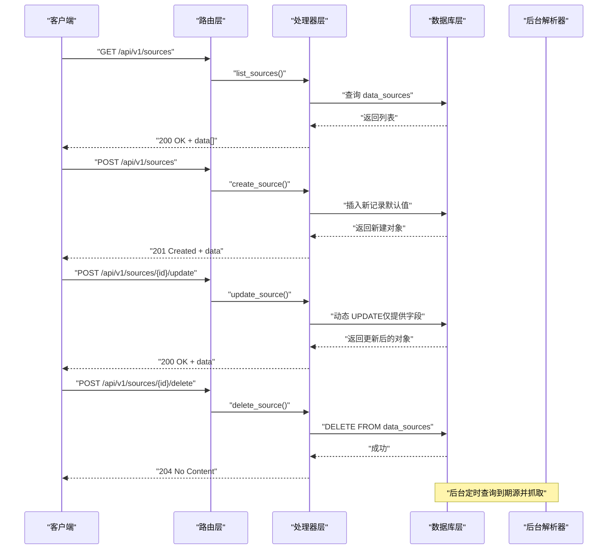
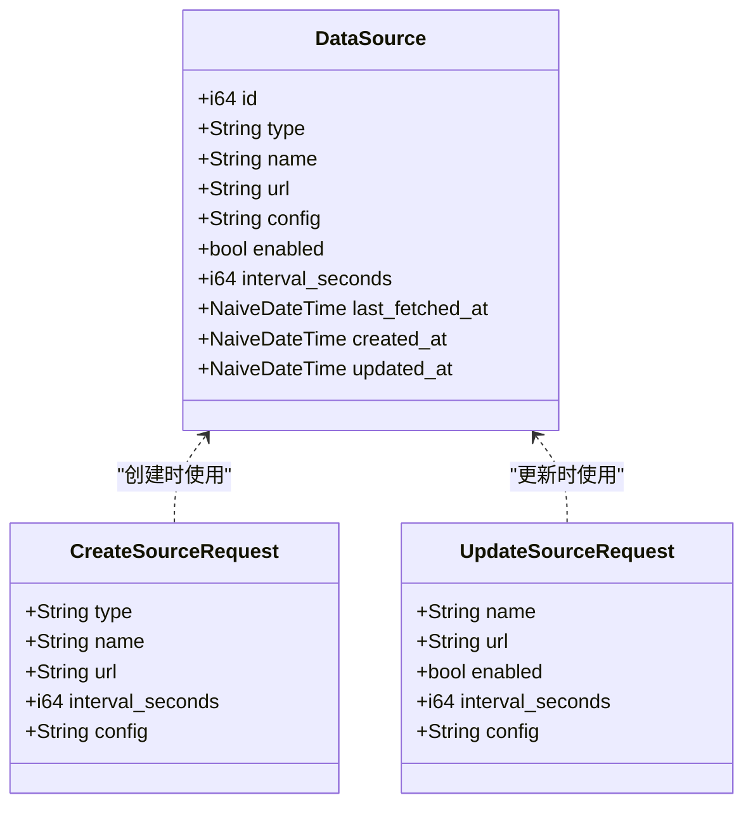
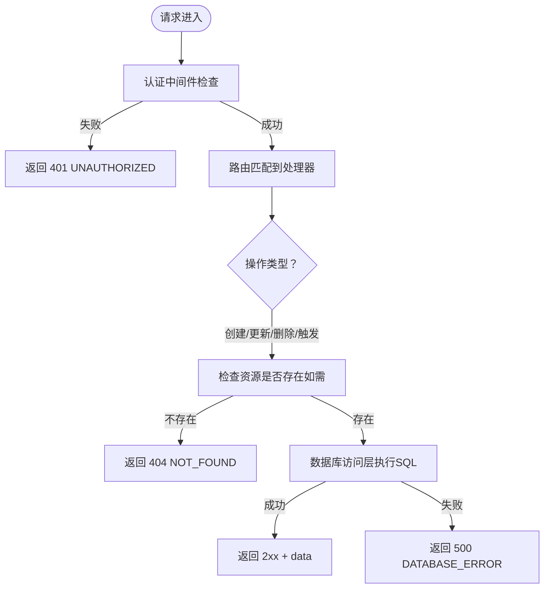
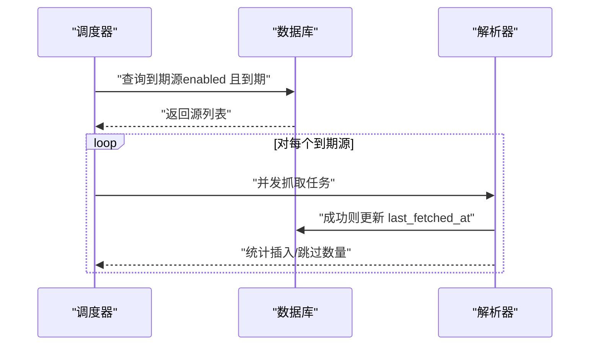
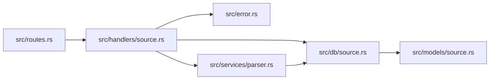

# 数据源管理API

<cite>
**本文引用的文件**
- [src/models/source.rs](file://src/models/source.rs)
- [src/handlers/source.rs](file://src/handlers/source.rs)
- [src/db/source.rs](file://src/db/source.rs)
- [docs/apis/source-api.md](file://docs/apis/source-api.md)
- [openspec/specs/source-crud-api/spec.md](file://openspec/specs/source-crud-api/spec.md)
- [src/routes.rs](file://src/routes.rs)
- [docs/migrations/20260607044921_init.sql](file://docs/migrations/20260607044921_init.sql)
- [src/error.rs](file://src/error.rs)
- [src/services/parser.rs](file://src/services/parser.rs)
- [src/config.rs](file://src/config.rs)
- [src/main.rs](file://src/main.rs)
</cite>

## 目录
1. [简介](#简介)
2. [项目结构](#项目结构)
3. [核心组件](#核心组件)
4. [架构总览](#架构总览)
5. [详细组件分析](#详细组件分析)
6. [依赖关系分析](#依赖关系分析)
7. [性能考虑](#性能考虑)
8. [故障排查指南](#故障排查指南)
9. [结论](#结论)
10. [附录](#附录)

## 简介
本文件为 AI 趋势监控系统中的“数据源管理 API”提供完整技术文档，覆盖 RSS 源的 CRUD（创建、读取、更新、删除）与手动抓取触发能力。内容包括：
- API 端点定义：HTTP 方法、URL 路径、请求参数、响应格式
- Source 模型的数据结构与字段说明
- 数据验证规则与错误处理机制
- 健康检查与状态管理
- 最佳实践与性能优化建议
- 每个操作的 curl 示例与预期响应

## 项目结构
该模块位于后端服务中，采用分层设计：
- 路由层：在路由中注册所有 API 端点
- 处理器层：实现业务逻辑，调用数据库访问层
- 数据库访问层：封装 SQL 查询与更新
- 模型层：定义数据结构与序列化/反序列化
- 错误与统一响应：集中处理错误码与响应包装
- 后台解析器：按时间窗口自动抓取 RSS 源

图表来源
- [src/routes.rs:14-59](file://src/routes.rs#L14-L59)
- [src/handlers/source.rs:12-91](file://src/handlers/source.rs#L12-L91)
- [src/db/source.rs:1-133](file://src/db/source.rs#L1-L133)
- [docs/migrations/20260607044921_init.sql:17-28](file://docs/migrations/20260607044921_init.sql#L17-L28)
- [src/services/parser.rs:94-184](file://src/services/parser.rs#L94-L184)

章节来源
- [src/routes.rs:14-59](file://src/routes.rs#L14-L59)
- [src/handlers/source.rs:12-91](file://src/handlers/source.rs#L12-L91)
- [src/db/source.rs:1-133](file://src/db/source.rs#L1-L133)
- [docs/migrations/20260607044921_init.sql:17-28](file://docs/migrations/20260607044921_init.sql#L17-L28)
- [src/services/parser.rs:94-184](file://src/services/parser.rs#L94-L184)

## 核心组件
- 数据源模型（DataSource）
  - 字段：id、type、name、url、config、enabled、interval_seconds、last_fetched_at、created_at、updated_at
  - 类型：整数、字符串、布尔值、可空日期时间
- 创建请求体（CreateSourceRequest）
  - 必填：type、name、url
  - 可选：interval_seconds（默认 300）、config（默认 "{}"）
- 更新请求体（UpdateSourceRequest）
  - 可选字段：name、url、enabled、interval_seconds、config
- 数据库访问函数
  - 列表、创建、按 id 获取、部分更新、删除、重置 last_fetched_at、查询到期源
- 处理器函数
  - 列表、创建、更新、删除、手动触发抓取
- 统一响应与错误处理
  - ApiResponse 包装返回；AppError 定义标准错误码

章节来源
- [src/models/source.rs:5-39](file://src/models/source.rs#L5-L39)
- [src/db/source.rs:5-133](file://src/db/source.rs#L5-L133)
- [src/handlers/source.rs:12-91](file://src/handlers/source.rs#L12-L91)
- [src/error.rs:8-79](file://src/error.rs#L8-L79)

## 架构总览
数据流概览：客户端通过认证后调用 API，处理器层校验与调用数据库层，数据库层执行 SQL，后台解析器根据时间策略自动抓取数据源。

图表来源
- [src/routes.rs:25-30](file://src/routes.rs#L25-L30)
- [src/handlers/source.rs:15-91](file://src/handlers/source.rs#L15-L91)
- [src/db/source.rs:24-133](file://src/db/source.rs#L24-L133)
- [src/services/parser.rs:94-184](file://src/services/parser.rs#L94-L184)

## 详细组件分析

### 数据源模型（DataSource）
- 字段定义与含义
  - id：自增主键
  - type：数据源类型（如 rss、atom、json_feed）
  - name：显示名称
  - url：RSS/Atom 源地址
  - config：JSON 扩展配置字符串，默认 "{}"
  - enabled：是否启用
  - interval_seconds：抓取间隔（秒），默认 300
  - last_fetched_at：最近一次抓取时间（可为空）
  - created_at/updated_at：创建与更新时间戳
- 序列化/反序列化
  - 使用 serde 进行 JSON 映射，字段名与数据库列名映射

图表来源
- [src/models/source.rs:5-39](file://src/models/source.rs#L5-L39)

章节来源
- [src/models/source.rs:5-39](file://src/models/source.rs#L5-L39)
- [docs/migrations/20260607044921_init.sql:17-28](file://docs/migrations/20260607044921_init.sql#L17-L28)

### API 端点定义与行为

- GET /api/v1/sources
  - 功能：列出所有数据源，按 created_at 降序排列
  - 认证：需要 Bearer Token
  - 响应：200 OK，返回 data 数组
  - 字段：见“数据源模型”
  - curl 示例：参见下方“附录”

- POST /api/v1/sources
  - 功能：创建新的数据源
  - 认证：需要 Bearer Token
  - 请求体：CreateSourceRequest
    - 必填：type、name、url
    - 可选：interval_seconds（默认 300）、config（默认 "{}"）
  - 响应：201 Created，返回新建的 DataSource
  - curl 示例：参见下方“附录”

- POST /api/v1/sources/{id}/update
  - 功能：部分更新指定数据源
  - 认证：需要 Bearer Token
  - 路径参数：id（整数）
  - 请求体：UpdateSourceRequest（所有字段可选）
  - 响应：200 OK，返回更新后的 DataSource
  - 错误：404 NOT_FOUND（当 id 不存在）

- POST /api/v1/sources/{id}/delete
  - 功能：删除指定数据源
  - 认证：需要 Bearer Token
  - 路径参数：id（整数）
  - 响应：204 No Content
  - 错误：404 NOT_FOUND（当 id 不存在）

- POST /api/v1/sources/{id}/fetch
  - 功能：手动触发对指定数据源的抓取
  - 认证：需要 Bearer Token
  - 路径参数：id（整数）
  - 行为：将 last_fetched_at 设为 NULL，使解析器在下一轮检测到该源并抓取
  - 响应：200 OK，返回确认消息
  - 错误：404 NOT_FOUND（当 id 不存在）

章节来源
- [docs/apis/source-api.md:17-252](file://docs/apis/source-api.md#L17-L252)
- [openspec/specs/source-crud-api/spec.md:9-95](file://openspec/specs/source-crud-api/spec.md#L9-L95)
- [src/handlers/source.rs:12-91](file://src/handlers/source.rs#L12-L91)

### 数据验证规则与错误处理

- 验证规则
  - 创建时必须提供 type、name、url
  - interval_seconds 默认 300；config 默认 "{}"
  - 更新时所有字段均为可选，仅提供字段生效
  - 删除前会先查询是否存在，不存在则返回 404
  - 手动触发抓取前会先查询是否存在，不存在则返回 404

- 错误处理
  - 401 Unauthorized：未提供有效 Bearer Token（路由层中间件）
  - 404 Not Found：资源不存在（处理器层显式检查）
  - 500 Internal Server Error：数据库异常等内部错误（统一转换）
  - 响应体：统一为 { "error": { "code": "...", "message": "..." } }

图表来源
- [src/routes.rs:50-53](file://src/routes.rs#L50-L53)
- [src/handlers/source.rs:39-71](file://src/handlers/source.rs#L39-L71)
- [src/error.rs:23-59](file://src/error.rs#L23-L59)

章节来源
- [src/error.rs:8-79](file://src/error.rs#L8-L79)
- [src/handlers/source.rs:39-71](file://src/handlers/source.rs#L39-L71)

### 数据源状态管理与健康检查

- 状态字段
  - enabled：控制是否参与自动抓取
  - interval_seconds：抓取周期
  - last_fetched_at：上次抓取时间（可为空）
- 健康检查
  - 提供 /health 端点返回 {"status": "ok"}
- 自动抓取机制
  - 解析器每 30 秒查询到期源（enabled 且 last_fetched_at 为空或已超过 interval_seconds）
  - 并发限制由配置决定（max_concurrent_fetches）

图表来源
- [src/services/parser.rs:94-184](file://src/services/parser.rs#L94-L184)
- [src/db/source.rs:122-132](file://src/db/source.rs#L122-L132)
- [src/routes.rs:61-63](file://src/routes.rs#L61-L63)

章节来源
- [src/services/parser.rs:94-184](file://src/services/parser.rs#L94-L184)
- [src/db/source.rs:122-132](file://src/db/source.rs#L122-L132)
- [src/routes.rs:61-63](file://src/routes.rs#L61-L63)

## 依赖关系分析

图表来源
- [src/routes.rs:11-12](file://src/routes.rs#L11-L12)
- [src/handlers/source.rs:7-10](file://src/handlers/source.rs#L7-L10)
- [src/db/source.rs:3](file://src/db/source.rs#L3)
- [src/models/source.rs:1-3](file://src/models/source.rs#L1-L3)
- [src/error.rs:8-10](file://src/error.rs#L8-L10)
- [src/services/parser.rs:7-9](file://src/services/parser.rs#L7-L9)

章节来源
- [src/routes.rs:11-12](file://src/routes.rs#L11-L12)
- [src/handlers/source.rs:7-10](file://src/handlers/source.rs#L7-L10)
- [src/db/source.rs:3](file://src/db/source.rs#L3)
- [src/models/source.rs:1-3](file://src/models/source.rs#L1-L3)
- [src/error.rs:8-10](file://src/error.rs#L8-L10)
- [src/services/parser.rs:7-9](file://src/services/parser.rs#L7-L9)

## 性能考虑
- 抓取并发控制
  - 通过配置项 max_concurrent_fetches 控制并发抓取上限，避免对远端源造成过大压力
- 抓取周期与到期判断
  - 每 30 秒扫描一次到期源，减少频繁轮询带来的开销
  - 到期条件：last_fetched_at 为空 或 已超过 interval_seconds
- 数据库索引
  - data_sources 表包含 created_at、enabled、last_fetched_at 等字段，有利于排序与筛选
- 响应一致性
  - 使用 ApiResponse 统一封装，便于前端处理与缓存策略

章节来源
- [src/config.rs:30-34](file://src/config.rs#L30-L34)
- [src/services/parser.rs:94-184](file://src/services/parser.rs#L94-L184)
- [src/db/source.rs:122-132](file://src/db/source.rs#L122-L132)
- [docs/migrations/20260607044921_init.sql:17-28](file://docs/migrations/20260607044921_init.sql#L17-L28)

## 故障排查指南
- 401 未授权
  - 确认 Authorization 头设置为 Bearer <token>，且 token 存在于数据库
- 404 资源不存在
  - 检查 id 是否正确；确认资源确实存在
- 500 内部错误
  - 查看日志中的 DATABASE_ERROR，定位具体 SQL 异常
- 抓取未生效
  - 手动触发 /api/v1/sources/{id}/fetch 将 last_fetched_at 置空，等待解析器下次扫描
  - 检查 enabled 与 interval_seconds 设置
- 健康检查
  - 访问 /health 返回 {"status": "ok"} 表示服务正常

章节来源
- [src/error.rs:23-59](file://src/error.rs#L23-L59)
- [src/handlers/source.rs:77-91](file://src/handlers/source.rs#L77-L91)
- [src/routes.rs:61-63](file://src/routes.rs#L61-L63)

## 结论
本数据源管理 API 提供了完整的 RSS 源生命周期管理能力，具备良好的扩展性与稳定性。通过明确的认证、统一的响应与错误处理、以及后台解析器的自动化抓取机制，能够满足实际生产环境的需求。建议在部署时合理配置并发与周期参数，并结合健康检查与日志监控保障系统稳定运行。

## 附录

### API 端点一览与 curl 示例
- GET /api/v1/sources
  - curl 示例：参见 [docs/apis/source-api.md:63-66](file://docs/apis/source-api.md#L63-L66)
  - 预期响应：200 OK，data 为数组，元素为 DataSource 对象
- POST /api/v1/sources
  - curl 示例：参见 [docs/apis/source-api.md:122-127](file://docs/apis/source-api.md#L122-L127)
  - 预期响应：201 Created，data 为新建的 DataSource 对象
- POST /api/v1/sources/{id}/update
  - curl 示例：参见 [docs/apis/source-api.md:174-179](file://docs/apis/source-api.md#L174-L179)
  - 预期响应：200 OK，data 为更新后的 DataSource 对象
- POST /api/v1/sources/{id}/delete
  - curl 示例：参见 [docs/apis/source-api.md:209-212](file://docs/apis/source-api.md#L209-L212)
  - 预期响应：204 No Content
- POST /api/v1/sources/{id}/fetch
  - curl 示例：参见 [docs/apis/source-api.md:248-251](file://docs/apis/source-api.md#L248-L251)
  - 预期响应：200 OK，data.message 为确认信息

### 数据验证与默认值
- 创建时必填字段：type、name、url
- 默认值：interval_seconds 默认 300；config 默认 "{}"
- 更新时所有字段可选，仅提供字段生效

章节来源
- [docs/apis/source-api.md:76-118](file://docs/apis/source-api.md#L76-L118)
- [src/db/source.rs:9-10](file://src/db/source.rs#L9-L10)
- [openspec/specs/source-crud-api/spec.md:24-46](file://openspec/specs/source-crud-api/spec.md#L24-L46)