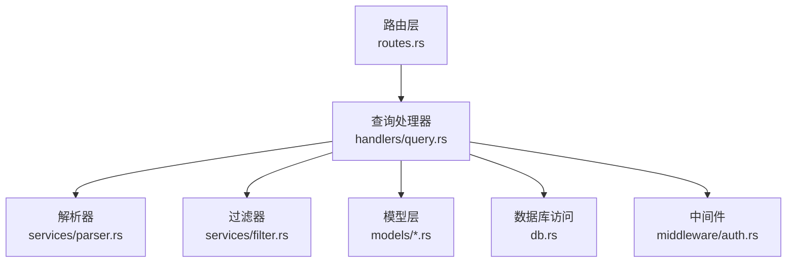
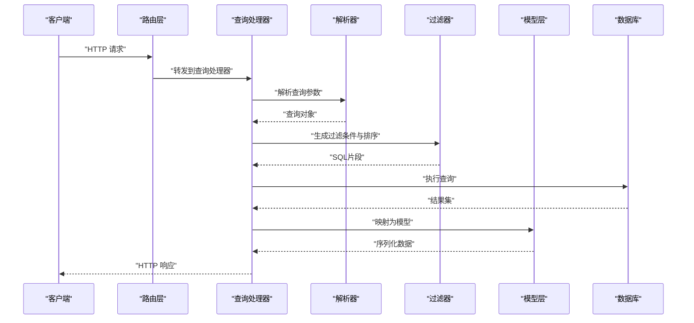
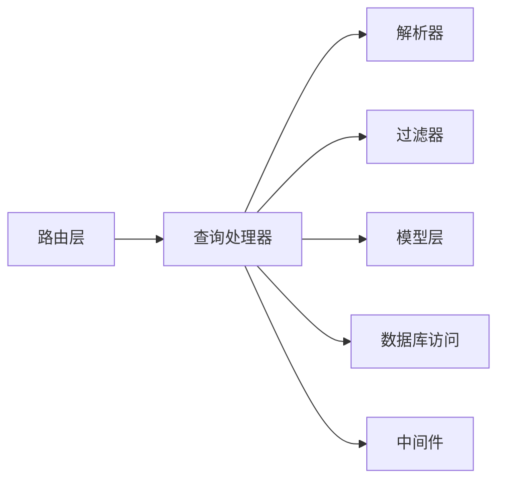

# 查询与搜索API

<cite>
**本文引用的文件**
- [src/handlers/query.rs](file://src/handlers/query.rs)
- [src/models/hot_event.rs](file://src/models/hot_event.rs)
- [src/models/keyword_mention.rs](file://src/models/keyword_mention.rs)
- [src/services/filter.rs](file://src/services/filter.rs)
- [src/services/parser.rs](file://src/services/parser.rs)
- [src/db.rs](file://src/db.rs)
- [src/routes.rs](file://src/routes.rs)
- [src/middleware/auth.rs](file://src/middleware/auth.rs)
- [openspec/specs/query-apis/spec.md](file://openspec/specs/query-apis/spec.md)
- [openspec/specs/filter-module/spec.md](file://openspec/specs/filter-module/spec.md)
- [openspec/specs/parser-module/spec.md](file://openspec/specs/parser-module/spec.md)
- [docs/plans/05-query-apis-and-background-modules.md](file://docs/plans/05-query-apis-and-background-modules.md)
- [README.md](file://README.md)
</cite>

## 目录
1. [简介](#简介)
2. [项目结构](#项目结构)
3. [核心组件](#核心组件)
4. [架构总览](#架构总览)
5. [详细组件分析](#详细组件分析)
6. [依赖关系分析](#依赖关系分析)
7. [性能考量](#性能考量)
8. [故障排查指南](#故障排查指南)
9. [结论](#结论)
10. [附录](#附录)

## 简介
本文件面向AI趋势监控系统的查询与搜索API，系统性梳理热点事件查询、关键词提及统计、事件聚合等能力的接口规范与实现要点。内容覆盖时间范围过滤、关键词筛选、排序规则、分页机制、缓存策略与性能优化，并提供端点参数示例与响应格式说明，以及查询优化技巧与最佳实践。

## 项目结构
查询API位于后端服务层，围绕以下模块组织：
- 路由与处理器：定义HTTP端点、请求解析与响应封装
- 业务模型：热点事件、关键词提及等数据模型
- 过滤器与解析器：负责查询条件解析与SQL过滤生成
- 数据访问层：数据库连接与查询执行
- 中间件：鉴权与请求上下文注入

图表来源
- [src/routes.rs](file://src/routes.rs)
- [src/handlers/query.rs](file://src/handlers/query.rs)
- [src/services/parser.rs](file://src/services/parser.rs)
- [src/services/filter.rs](file://src/services/filter.rs)
- [src/db.rs](file://src/db.rs)
- [src/middleware/auth.rs](file://src/middleware/auth.rs)

章节来源
- [src/routes.rs](file://src/routes.rs)
- [src/handlers/query.rs](file://src/handlers/query.rs)
- [src/services/parser.rs](file://src/services/parser.rs)
- [src/services/filter.rs](file://src/services/filter.rs)
- [src/db.rs](file://src/db.rs)
- [src/middleware/auth.rs](file://src/middleware/auth.rs)

## 核心组件
- 查询处理器：统一处理热点事件、关键词提及、事件聚合等查询请求，负责参数校验、调用解析器与过滤器、执行数据库查询并返回标准化响应。
- 解析器：将HTTP查询参数转换为内部查询对象，支持时间范围、关键词、排序、分页等参数映射。
- 过滤器：根据查询对象生成SQL过滤条件与排序语句，确保安全与可扩展性。
- 模型层：热点事件与关键词提及的数据结构定义，用于序列化响应。
- 数据库访问：提供连接池与查询执行能力，配合过滤器生成的SQL进行数据检索。
- 鉴权中间件：在查询端点启用鉴权，保障数据访问安全。

章节来源
- [src/handlers/query.rs](file://src/handlers/query.rs)
- [src/services/parser.rs](file://src/services/parser.rs)
- [src/services/filter.rs](file://src/services/filter.rs)
- [src/models/hot_event.rs](file://src/models/hot_event.rs)
- [src/models/keyword_mention.rs](file://src/models/keyword_mention.rs)
- [src/db.rs](file://src/db.rs)
- [src/middleware/auth.rs](file://src/middleware/auth.rs)

## 架构总览
查询API采用“路由→处理器→解析器→过滤器→模型→数据库”的分层架构，确保职责清晰、易于扩展与维护。

图表来源
- [src/routes.rs](file://src/routes.rs)
- [src/handlers/query.rs](file://src/handlers/query.rs)
- [src/services/parser.rs](file://src/services/parser.rs)
- [src/services/filter.rs](file://src/services/filter.rs)
- [src/models/hot_event.rs](file://src/models/hot_event.rs)
- [src/db.rs](file://src/db.rs)

## 详细组件分析

### 端点与功能概览
- 热点事件查询：按时间范围、关键词、排序与分页获取热点事件列表。
- 关键词提及统计：按时间范围统计关键词在文章中的提及次数。
- 事件聚合查询：按时间窗口或维度对事件进行聚合统计（如热度、来源分布）。
- 实时趋势查询：结合推送模块，提供近实时的趋势动态更新能力。
- 历史数据分析：基于历史数据进行趋势回溯与对比分析。

章节来源
- [openspec/specs/query-apis/spec.md](file://openspec/specs/query-apis/spec.md)
- [openspec/specs/pusher-module/spec.md](file://openspec/specs/pusher-module/spec.md)
- [docs/plans/05-query-apis-and-background-modules.md](file://docs/plans/05-query-apis-and-background-modules.md)

### 参数与过滤规则
- 时间范围过滤
  - 支持开始时间与结束时间参数，用于限定查询的时间区间。
  - 解析器将时间字符串转换为内部时间类型，过滤器生成对应SQL条件。
- 关键词筛选
  - 支持精确匹配与模糊匹配两种模式；可多关键词组合查询。
  - 过滤器将关键词映射为SQL WHERE条件，避免SQL注入风险。
- 排序规则
  - 支持按时间、热度、提及数等字段升序/降序排序。
  - 解析器解析排序参数，过滤器生成ORDER BY子句。
- 分页机制
  - 支持页码与每页条数参数；默认值与最大限制在解析器中设定。
  - 过滤器生成LIMIT/OFFSET或游标分页策略（视实现而定）。

章节来源
- [src/services/parser.rs](file://src/services/parser.rs)
- [src/services/filter.rs](file://src/services/filter.rs)
- [openspec/specs/filter-module/spec.md](file://openspec/specs/filter-module/spec.md)
- [openspec/specs/parser-module/spec.md](file://openspec/specs/parser-module/spec.md)

### 响应格式与数据模型
- 热点事件列表
  - 字段：事件标识、标题、摘要、时间戳、热度分数、来源渠道等。
  - 结构：数组形式，包含分页元信息（当前页、总数、每页数量）。
- 关键词提及统计
  - 字段：关键词、时间点、提及次数、累计次数等。
  - 结构：时间序列或分组统计数组。
- 事件聚合
  - 字段：聚合维度（如日期、来源）、事件计数、平均热度等。
  - 结构：按维度分组的统计表。

章节来源
- [src/models/hot_event.rs](file://src/models/hot_event.rs)
- [src/models/keyword_mention.rs](file://src/models/keyword_mention.rs)

### 查询流程与错误处理
- 入口控制：路由层将请求转发至查询处理器。
- 参数解析：解析器校验并转换查询参数，生成查询对象。
- 条件构建：过滤器根据查询对象生成安全的SQL片段。
- 执行与映射：数据库执行查询并将结果映射为模型对象。
- 错误处理：统一捕获数据库异常、参数异常与业务异常，返回标准错误响应。

```mermaid
flowchart TD
Start(["请求进入"]) --> Parse["解析查询参数"]
Parse --> Validate{"参数有效?"}
Validate --> |否| ErrParam["返回参数错误"]
Validate --> |是| BuildFilter["构建过滤条件与排序"]
BuildFilter --> ExecDB["执行数据库查询"]
ExecDB --> DBResult{"查询成功?"}
DBResult --> |否| ErrDB["返回数据库错误"]
DBResult --> |是| MapModel["映射为模型对象"]
MapModel --> Serialize["序列化响应"]
Serialize --> Done(["返回成功响应"])
ErrParam --> Done
ErrDB --> Done
```

图表来源
- [src/handlers/query.rs](file://src/handlers/query.rs)
- [src/services/parser.rs](file://src/services/parser.rs)
- [src/services/filter.rs](file://src/services/filter.rs)
- [src/db.rs](file://src/db.rs)

章节来源
- [src/handlers/query.rs](file://src/handlers/query.rs)
- [src/services/parser.rs](file://src/services/parser.rs)
- [src/services/filter.rs](file://src/services/filter.rs)
- [src/db.rs](file://src/db.rs)

### 缓存策略与性能优化
- 查询缓存
  - 对热点查询（如固定时间窗口内的热门关键词）设置短期缓存，降低数据库压力。
  - 缓存键包含时间范围、关键词、排序与分页参数，确保命中准确性。
- 索引优化
  - 在时间戳、关键词、热度等高频过滤字段上建立索引。
  - 使用复合索引覆盖常见查询模式（如时间+关键词）。
- 分页与游标
  - 大数据量场景优先使用基于游标的分页，减少OFFSET开销。
- 并发与限流
  - 通过中间件实施请求限流与并发控制，防止突发流量冲击数据库。
- 异步聚合
  - 对高成本聚合任务采用后台作业异步计算，查询端返回预计算结果。

章节来源
- [src/handlers/query.rs](file://src/handlers/query.rs)
- [src/services/filter.rs](file://src/services/filter.rs)
- [src/middleware/auth.rs](file://src/middleware/auth.rs)

### 实时趋势与历史分析
- 实时趋势
  - 结合推送模块，将新增事件推送到订阅者，查询端可快速获取最新动态。
  - 提供增量查询参数（如自上次查询以来的新事件）。
- 历史分析
  - 支持跨时间段对比、同比/环比分析与趋势回归。
  - 提供聚合维度（日/周/月）与统计指标（均值、峰值、总量）。

章节来源
- [openspec/specs/pusher-module/spec.md](file://openspec/specs/pusher-module/spec.md)
- [docs/plans/05-query-apis-and-background-modules.md](file://docs/plans/05-query-apis-and-background-modules.md)

## 依赖关系分析
查询API各组件之间的依赖关系如下：

图表来源
- [src/routes.rs](file://src/routes.rs)
- [src/handlers/query.rs](file://src/handlers/query.rs)
- [src/services/parser.rs](file://src/services/parser.rs)
- [src/services/filter.rs](file://src/services/filter.rs)
- [src/models/hot_event.rs](file://src/models/hot_event.rs)
- [src/models/keyword_mention.rs](file://src/models/keyword_mention.rs)
- [src/db.rs](file://src/db.rs)
- [src/middleware/auth.rs](file://src/middleware/auth.rs)

章节来源
- [src/routes.rs](file://src/routes.rs)
- [src/handlers/query.rs](file://src/handlers/query.rs)
- [src/services/parser.rs](file://src/services/parser.rs)
- [src/services/filter.rs](file://src/services/filter.rs)
- [src/db.rs](file://src/db.rs)
- [src/middleware/auth.rs](file://src/middleware/auth.rs)

## 性能考量
- 查询优化
  - 使用参数化查询与白名单参数，避免SQL注入与复杂拼接。
  - 合理拆分查询逻辑，将过滤与排序分离，便于索引利用。
- 存储与索引
  - 针对高频查询字段建立合适索引，定期分析查询计划。
  - 对大表进行分区或归档，减少扫描范围。
- 缓存与异步
  - 对稳定统计结果进行缓存，缩短响应时间。
  - 将高耗时聚合放入后台任务，查询端轮询或推送通知。
- 监控与告警
  - 记录慢查询日志与错误率，设置阈值告警。
  - 对关键端点进行QPS与延迟监控。

## 故障排查指南
- 常见问题
  - 参数非法：检查时间格式、关键词长度与排序字段是否合法。
  - 查询超时：确认索引是否存在、SQL是否可被缓存、是否需要分页优化。
  - 权限不足：确认鉴权中间件是否正确配置，令牌是否有效。
- 定位手段
  - 查看处理器日志与数据库执行计划。
  - 使用最小复现参数组合，逐步缩小问题范围。
- 应急措施
  - 临时放宽分页限制或增加缓存命中率。
  - 对高危查询进行限流或降级处理。

章节来源
- [src/handlers/query.rs](file://src/handlers/query.rs)
- [src/middleware/auth.rs](file://src/middleware/auth.rs)

## 结论
查询与搜索API通过清晰的分层设计与严格的参数解析、过滤生成机制，实现了对热点事件、关键词提及与事件聚合的高效查询。结合缓存、索引与异步处理等策略，可在保证实时性的前提下提升整体性能。建议在生产环境中持续监控查询表现，迭代优化索引与缓存策略，并完善错误处理与告警体系。

## 附录
- 端点与参数示例（示意）
  - 热点事件查询
    - 方法：GET
    - 路径：/api/events
    - 查询参数：start_time、end_time、keywords（可多值）、sort_by、order（asc/desc）、page、page_size
    - 响应：包含事件列表与分页元信息
  - 关键词提及统计
    - 方法：GET
    - 路径：/api/keyword_mentions
    - 查询参数：start_time、end_time、keywords（可多值）、interval（如日/小时）、sort_by、order、page、page_size
    - 响应：时间序列或分组统计数组
  - 事件聚合
    - 方法：GET
    - 路径：/api/event_aggregations
    - 查询参数：start_time、end_time、group_by（如日期、来源）、metrics（如count、avg_hotness）、sort_by、order、page、page_size
    - 响应：按维度分组的统计表
- 最佳实践
  - 优先使用参数化查询与白名单字段
  - 对高频查询建立缓存与索引
  - 使用游标分页处理大数据量
  - 对高成本聚合任务采用异步处理
  - 在路由层与中间件层统一接入鉴权与限流

章节来源
- [openspec/specs/query-apis/spec.md](file://openspec/specs/query-apis/spec.md)
- [README.md](file://README.md)