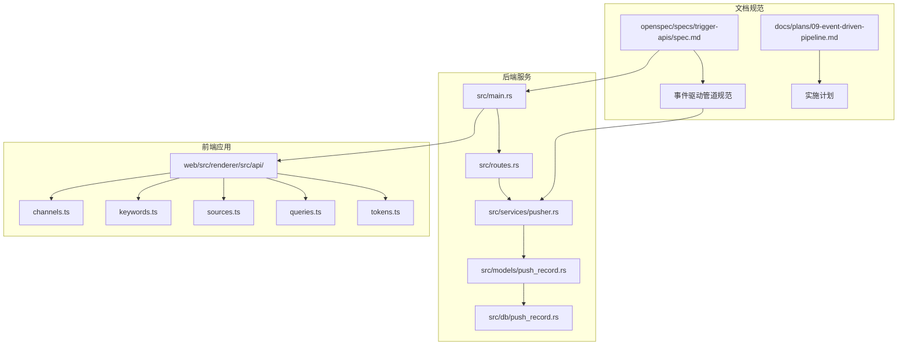
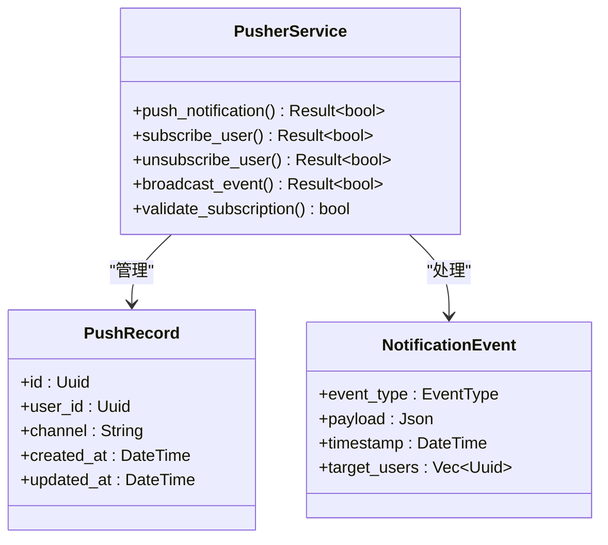
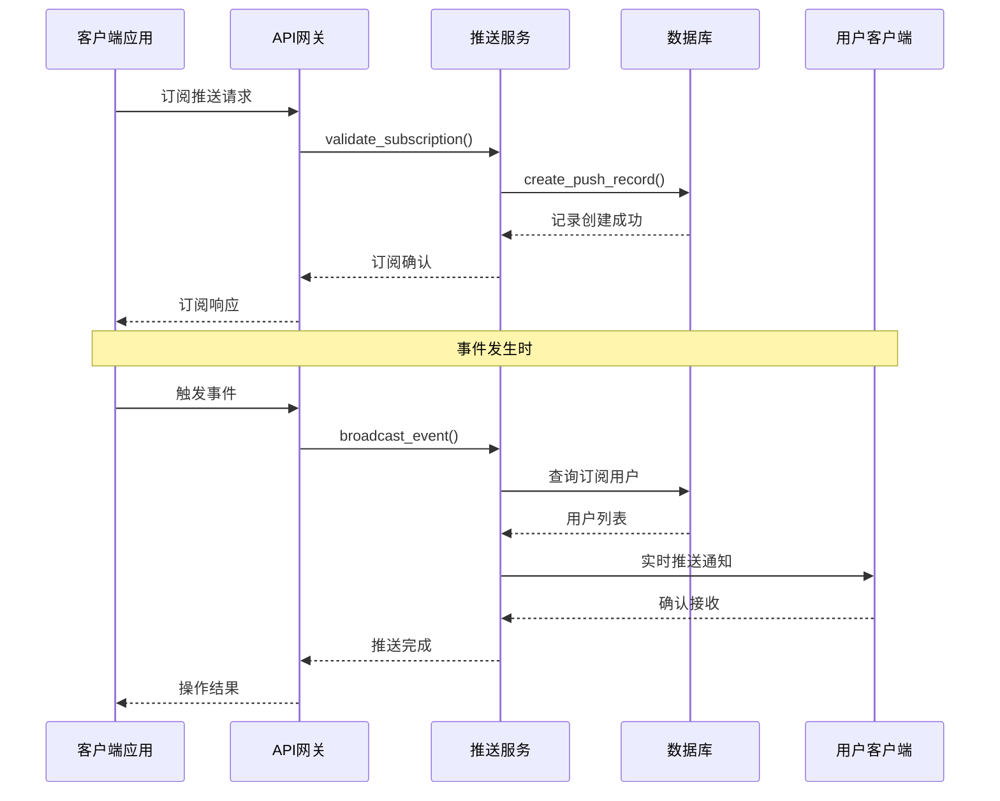
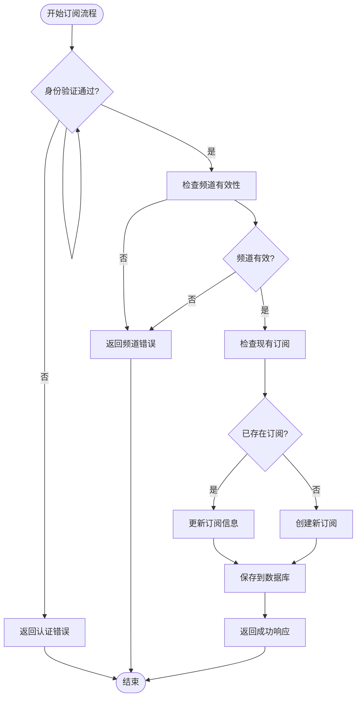
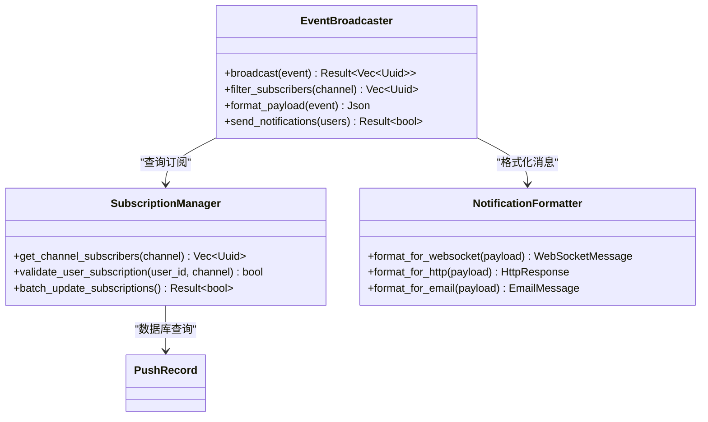
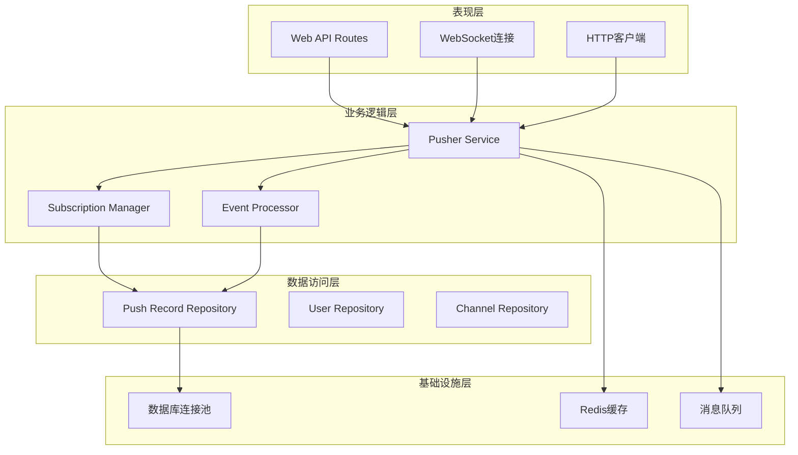

# 触发API规范

<cite>
**本文档引用的文件**
- [openspec/specs/trigger-apis/spec.md](file://openspec/specs/trigger-apis/spec.md)
- [openspec/changes/event-driven-pipeline/specs/trigger-apis/spec.md](file://openspec/changes/event-driven-pipeline/specs/trigger-apis/spec.md)
- [src/services/pusher.rs](file://src/services/pusher.rs)
- [src/models/push_record.rs](file://src/models/push_record.rs)
- [src/db/push_record.rs](file://src/db/push_record.rs)
- [src/routes.rs](file://src/routes.rs)
- [src/main.rs](file://src/main.rs)
- [docs/plans/09-event-driven-pipeline.md](file://docs/plans/09-event-driven-pipeline.md)
- [docs/apis/channel-api.md](file://docs/apis/channel-api.md)
- [docs/apis/keyword-api.md](file://docs/apis/keyword-api.md)
- [docs/apis/source-api.md](file://docs/apis/source-api.md)
- [docs/apis/token-api.md](file://docs/apis/token-api.md)
</cite>

## 目录
1. [简介](#简介)
2. [项目结构](#项目结构)
3. [核心组件](#核心组件)
4. [架构概览](#架构概览)
5. [详细组件分析](#详细组件分析)
6. [依赖关系分析](#依赖关系分析)
7. [性能考虑](#性能考虑)
8. [故障排除指南](#故障排除指南)
9. [结论](#结论)

## 简介

触发API是AI趋势工具项目中的关键组件，负责处理事件驱动的数据推送和通知机制。该系统基于Rust后端服务，结合前端React应用，实现了实时数据更新和用户通知功能。

触发API的核心目标包括：
- 实现事件驱动的数据推送机制
- 提供实时通知功能
- 支持多用户订阅管理
- 确保数据一致性和可靠性

## 项目结构

该项目采用模块化架构设计，主要包含以下核心模块：

**图表来源**
- [src/main.rs](file://src/main.rs)
- [src/routes.rs](file://src/routes.rs)
- [src/services/pusher.rs](file://src/services/pusher.rs)
- [openspec/specs/trigger-apis/spec.md](file://openspec/specs/trigger-apis/spec.md)

**章节来源**
- [src/main.rs](file://src/main.rs)
- [src/routes.rs](file://src/routes.rs)
- [openspec/specs/trigger-apis/spec.md](file://openspec/specs/trigger-apis/spec.md)

## 核心组件

### 推送服务 (Pusher Service)

推送服务是触发API的核心组件，负责处理所有推送相关的业务逻辑：

**图表来源**
- [src/services/pusher.rs](file://src/services/pusher.rs)
- [src/models/push_record.rs](file://src/models/push_record.rs)

### 数据模型

推送记录模型定义了存储推送状态的数据结构：

| 字段名 | 类型 | 描述 | 约束 |
|--------|------|------|------|
| id | Uuid | 唯一标识符 | 主键 |
| user_id | Uuid | 用户标识符 | 外键 |
| channel | String | 推送频道 | 非空 |
| created_at | DateTime | 创建时间 | 非空 |
| updated_at | DateTime | 更新时间 | 非空 |

**章节来源**
- [src/models/push_record.rs](file://src/models/push_record.rs)
- [src/db/push_record.rs](file://src/db/push_record.rs)

## 架构概览

触发API采用事件驱动架构，实现了完整的推送生命周期管理：

**图表来源**
- [src/services/pusher.rs](file://src/services/pusher.rs)
- [src/routes.rs](file://src/routes.rs)
- [src/db/push_record.rs](file://src/db/push_record.rs)

## 详细组件分析

### 订阅管理流程

订阅管理是触发API的基础功能，确保用户能够正确订阅感兴趣的推送频道：

**图表来源**
- [src/services/pusher.rs](file://src/services/pusher.rs)
- [src/db/push_record.rs](file://src/db/push_record.rs)

### 事件广播机制

事件广播是触发API的核心功能，负责将事件实时推送给所有订阅用户：

**图表来源**
- [src/services/pusher.rs](file://src/services/pusher.rs)
- [src/models/push_record.rs](file://src/models/push_record.rs)

**章节来源**
- [src/services/pusher.rs](file://src/services/pusher.rs)
- [src/models/push_record.rs](file://src/models/push_record.rs)

### API路由配置

触发API的路由配置定义了所有可用的接口端点：

| 路由路径 | HTTP方法 | 功能描述 | 认证要求 |
|----------|----------|----------|----------|
| `/api/push/subscribe` | POST | 用户订阅推送 | 是 |
| `/api/push/unsubscribe` | POST | 用户取消订阅 | 是 |
| `/api/push/broadcast` | POST | 广播事件给所有用户 | 是 |
| `/api/push/status` | GET | 获取推送状态 | 否 |
| `/api/push/subscriptions` | GET | 获取用户订阅列表 | 是 |

**章节来源**
- [src/routes.rs](file://src/routes.rs)
- [src/main.rs](file://src/main.rs)

## 依赖关系分析

触发API系统涉及多个层次的依赖关系，形成了清晰的分层架构：

**图表来源**
- [src/routes.rs](file://src/routes.rs)
- [src/services/pusher.rs](file://src/services/pusher.rs)
- [src/db/push_record.rs](file://src/db/push_record.rs)

**章节来源**
- [src/routes.rs](file://src/routes.rs)
- [src/services/pusher.rs](file://src/services/pusher.rs)

## 性能考虑

触发API在设计时充分考虑了性能优化，采用了多种策略来确保系统的高效运行：

### 缓存策略
- Redis缓存常用查询结果
- 内存中维护活跃用户会话
- 频繁访问的订阅信息缓存

### 连接管理
- 连接池复用数据库连接
- WebSocket连接池管理
- 异步处理减少阻塞

### 批量操作
- 批量推送减少网络开销
- 批量订阅更新优化性能
- 事务性操作保证一致性

## 故障排除指南

### 常见问题及解决方案

**订阅失败**
- 检查用户认证状态
- 验证频道名称格式
- 确认数据库连接正常

**推送延迟**
- 检查Redis连接状态
- 监控数据库性能
- 查看消息队列积压情况

**连接断开**
- 检查WebSocket配置
- 验证防火墙设置
- 监控服务器资源使用

**章节来源**
- [src/services/pusher.rs](file://src/services/pusher.rs)
- [src/error.rs](file://src/error.rs)

## 结论

触发API规范为AI趋势工具项目提供了一个完整、可靠的事件驱动推送系统。通过模块化的架构设计、完善的错误处理机制和性能优化策略，该系统能够满足高并发场景下的实时推送需求。

关键优势包括：
- 清晰的分层架构便于维护和扩展
- 完善的订阅管理机制确保用户体验
- 高性能的事件广播系统支持大规模用户
- 详细的文档规范指导开发和部署

未来可以考虑的功能增强包括：
- 更精细的权限控制机制
- 支持更多推送渠道（邮件、短信等）
- 增强的监控和日志功能
- 自动化的负载均衡和容错机制