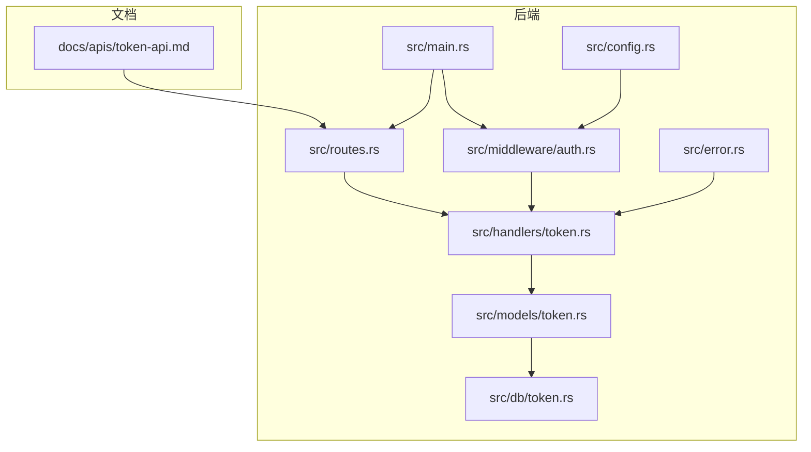
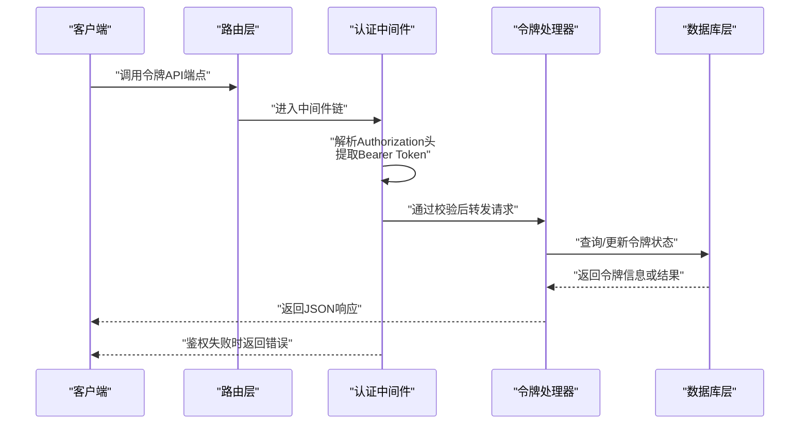
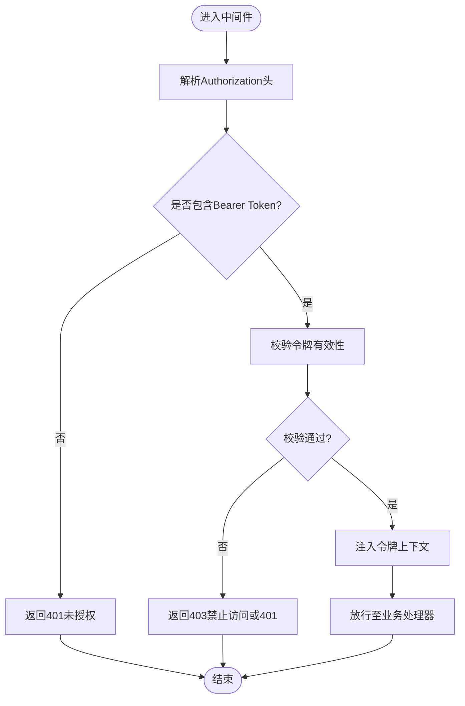
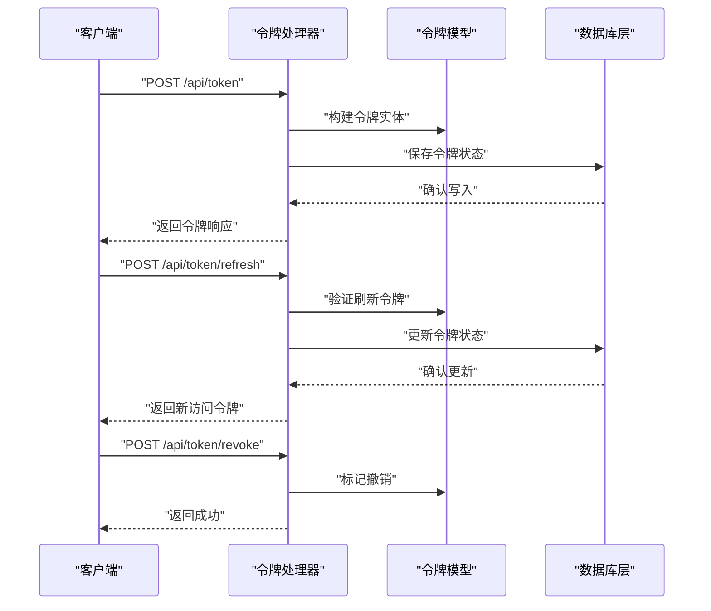
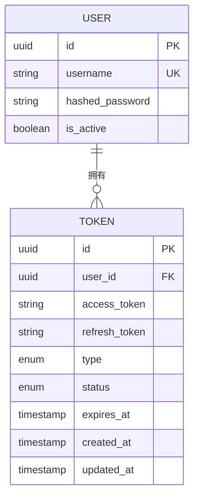
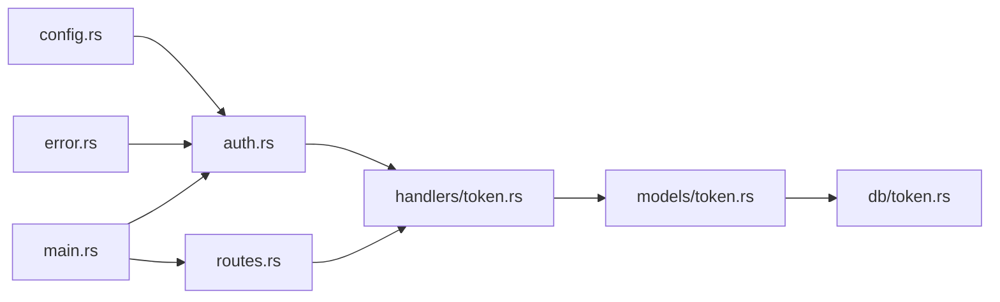

# 认证与令牌API

<cite>
**本文档引用的文件**
- [token-api.md](file://docs/apis/token-api.md)
- [auth.rs](file://src/middleware/auth.rs)
- [token.rs（处理器）](file://src/handlers/token.rs)
- [token.rs（模型）](file://src/models/token.rs)
- [token.rs（数据库）](file://src/db/token.rs)
- [routes.rs](file://src/routes.rs)
- [main.rs](file://src/main.rs)
- [config.rs](file://src/config.rs)
- [error.rs](file://src/error.rs)
</cite>

## 目录
1. [简介](#简介)
2. [项目结构](#项目结构)
3. [核心组件](#核心组件)
4. [架构总览](#架构总览)
5. [详细组件分析](#详细组件分析)
6. [依赖关系分析](#依赖关系分析)
7. [性能考量](#性能考量)
8. [故障排除指南](#故障排除指南)
9. [结论](#结论)
10. [附录](#附录)

## 简介
本文件面向AI趋势监控系统的认证与令牌API，系统性阐述基于Bearer Token的认证机制、令牌生成与验证流程、权限与访问控制策略，并提供HTTP接口规范、中间件工作原理、常见错误与解决方案以及客户端集成最佳实践。目标是帮助开发者快速理解并正确集成认证与令牌功能。

## 项目结构
认证与令牌相关的核心文件分布如下：
- 文档层：认证与令牌API的接口定义与使用说明
- 中间件层：统一的认证拦截与权限校验
- 处理器层：令牌API的业务处理逻辑
- 模型与数据库层：令牌数据结构与持久化
- 路由层：HTTP端点注册与路径映射
- 配置与错误：全局配置与错误类型定义

**图表来源**
- [token-api.md](file://docs/apis/token-api.md)
- [auth.rs](file://src/middleware/auth.rs)
- [token.rs（处理器）](file://src/handlers/token.rs)
- [token.rs（模型）](file://src/models/token.rs)
- [token.rs（数据库）](file://src/db/token.rs)
- [routes.rs](file://src/routes.rs)
- [main.rs](file://src/main.rs)
- [config.rs](file://src/config.rs)
- [error.rs](file://src/error.rs)

**章节来源**
- [token-api.md](file://docs/apis/token-api.md)
- [auth.rs](file://src/middleware/auth.rs)
- [token.rs（处理器）](file://src/handlers/token.rs)
- [token.rs（模型）](file://src/models/token.rs)
- [token.rs（数据库）](file://src/db/token.rs)
- [routes.rs](file://src/routes.rs)
- [main.rs](file://src/main.rs)
- [config.rs](file://src/config.rs)
- [error.rs](file://src/error.rs)

## 核心组件
- 认证中间件：负责从请求中提取并验证Bearer Token，校验其有效性与权限范围，失败时返回相应错误。
- 令牌处理器：实现令牌API的业务逻辑，包括令牌签发、刷新与撤销等。
- 令牌模型与数据库：定义令牌的数据结构、索引与查询能力，支撑令牌的存储与检索。
- 路由与入口：统一注册令牌相关端点，接入中间件链路。
- 配置与错误：提供认证相关配置项与标准化错误类型。

**章节来源**
- [auth.rs](file://src/middleware/auth.rs)
- [token.rs（处理器）](file://src/handlers/token.rs)
- [token.rs（模型）](file://src/models/token.rs)
- [token.rs（数据库）](file://src/db/token.rs)
- [routes.rs](file://src/routes.rs)
- [config.rs](file://src/config.rs)
- [error.rs](file://src/error.rs)

## 架构总览
下图展示了认证与令牌API在系统中的整体交互：

**图表来源**
- [auth.rs](file://src/middleware/auth.rs)
- [token.rs（处理器）](file://src/handlers/token.rs)
- [token.rs（数据库）](file://src/db/token.rs)
- [routes.rs](file://src/routes.rs)

## 详细组件分析

### 认证中间件
- 功能职责
  - 提取请求头中的Authorization字段，识别Bearer Token格式。
  - 对令牌进行有效性校验（如存在性、签名、过期时间、状态等）。
  - 将令牌上下文注入到请求上下文中，供后续处理器使用。
  - 对未通过校验的请求返回标准化错误。
- 拦截逻辑
  - 在路由匹配后、业务处理器执行前生效。
  - 支持白名单端点（如登录/令牌签发）跳过中间件。
  - 可按路径或方法配置例外规则。
- 错误处理
  - 缺失或格式不正确的Authorization头。
  - 令牌不存在、已禁用、已撤销或过期。
  - 权限不足导致的访问拒绝。

**图表来源**
- [auth.rs](file://src/middleware/auth.rs)

**章节来源**
- [auth.rs](file://src/middleware/auth.rs)

### 令牌API（HTTP接口）
- 接口概览
  - 令牌签发：用于换取新的访问令牌与刷新令牌。
  - 令牌刷新：使用刷新令牌换取新的访问令牌。
  - 令牌撤销：使指定令牌立即失效。
- 端点与方法
  - POST /api/token：签发令牌
  - POST /api/token/refresh：刷新令牌
  - POST /api/token/revoke：撤销令牌
- 请求参数
  - 签发：用户名、密码、设备标识等（具体以接口文档为准）。
  - 刷新：刷新令牌、设备标识等。
  - 撤销：令牌值、用户标识等。
- 响应格式
  - 成功：返回令牌对象（含访问令牌、刷新令牌、有效期等）。
  - 失败：返回标准错误对象（含错误码、消息、建议）。
- 安全考虑
  - 使用HTTPS传输。
  - 刷新令牌应长期有效但需严格保护；访问令牌短期有效。
  - 服务端应记录令牌使用日志以便审计。
  - 对高频重试与异常IP进行限流与风控。

**章节来源**
- [token-api.md](file://docs/apis/token-api.md)

### 令牌处理器
- 职责
  - 实现签发、刷新、撤销等业务逻辑。
  - 与令牌模型与数据库交互，完成令牌的生成、更新与查询。
  - 返回标准化响应与错误。
- 关键流程
  - 签发：校验凭据、生成访问令牌与刷新令牌、持久化状态。
  - 刷新：验证刷新令牌、生成新访问令牌、可选失效旧令牌。
  - 撤销：标记令牌为已撤销、清理缓存或会话。

**图表来源**
- [token.rs（处理器）](file://src/handlers/token.rs)
- [token.rs（模型）](file://src/models/token.rs)
- [token.rs（数据库）](file://src/db/token.rs)

**章节来源**
- [token.rs（处理器）](file://src/handlers/token.rs)
- [token.rs（模型）](file://src/models/token.rs)
- [token.rs（数据库）](file://src/db/token.rs)

### 令牌模型与数据库
- 数据模型
  - 字段：令牌ID、用户ID、访问令牌值、刷新令牌值、类型、状态、过期时间、创建时间、更新时间等。
  - 索引：对令牌值、用户ID、过期时间建立索引以提升查询效率。
- 查询与操作
  - 根据令牌值查找令牌。
  - 更新令牌状态（启用/禁用/撤销）。
  - 清理过期令牌。
- 安全与一致性
  - 令牌值应加密存储或仅存储哈希。
  - 并发场景下保证令牌状态变更的原子性。

**图表来源**
- [token.rs（模型）](file://src/models/token.rs)
- [token.rs（数据库）](file://src/db/token.rs)

**章节来源**
- [token.rs（模型）](file://src/models/token.rs)
- [token.rs（数据库）](file://src/db/token.rs)

### 路由与入口
- 路由注册
  - 将令牌API端点注册到统一路由表。
  - 为令牌相关端点挂载认证中间件。
- 入口启动
  - 在应用入口加载配置、初始化数据库连接与中间件链。
  - 启动HTTP服务器并暴露REST接口。

**章节来源**
- [routes.rs](file://src/routes.rs)
- [main.rs](file://src/main.rs)
- [config.rs](file://src/config.rs)

## 依赖关系分析
- 组件耦合
  - 路由层依赖中间件与处理器。
  - 处理器依赖模型与数据库层。
  - 中间件依赖配置与错误模块。
- 外部依赖
  - HTTP框架、数据库驱动、加密库等。
- 循环依赖
  - 当前结构避免了循环依赖，层次清晰。

**图表来源**
- [config.rs](file://src/config.rs)
- [error.rs](file://src/error.rs)
- [auth.rs](file://src/middleware/auth.rs)
- [token.rs（处理器）](file://src/handlers/token.rs)
- [token.rs（模型）](file://src/models/token.rs)
- [token.rs（数据库）](file://src/db/token.rs)
- [routes.rs](file://src/routes.rs)
- [main.rs](file://src/main.rs)

**章节来源**
- [config.rs](file://src/config.rs)
- [error.rs](file://src/error.rs)
- [auth.rs](file://src/middleware/auth.rs)
- [token.rs（处理器）](file://src/handlers/token.rs)
- [token.rs（模型）](file://src/models/token.rs)
- [token.rs（数据库）](file://src/db/token.rs)
- [routes.rs](file://src/routes.rs)
- [main.rs](file://src/main.rs)

## 性能考量
- 令牌校验优化
  - 使用内存缓存热点令牌，降低数据库压力。
  - 对过期时间接近的令牌提前续期，减少频繁签发。
- 数据库性能
  - 为令牌值与用户ID建立复合索引，加速查询。
  - 批量清理过期令牌，定期维护。
- 网络与安全
  - 强制HTTPS，防止令牌泄露。
  - 对高风险操作增加二次校验（如短信/邮箱验证码）。

## 故障排除指南
- 常见错误与原因
  - 401 未授权：缺少Authorization头或Bearer Token格式错误。
  - 403 禁止访问：令牌存在但无权限访问该资源。
  - 400 参数错误：请求体缺失必要字段或格式不正确。
  - 500 内部错误：服务端异常，检查日志与数据库连接。
- 解决方案
  - 确认Authorization头格式为“Bearer <token>”。
  - 检查令牌是否过期、是否被撤销或禁用。
  - 核对请求参数与接口文档一致。
  - 查看服务端日志定位具体异常堆栈。
- 审计与追踪
  - 记录每次鉴权尝试与结果，便于问题回溯。

**章节来源**
- [error.rs](file://src/error.rs)
- [auth.rs](file://src/middleware/auth.rs)

## 结论
本认证与令牌API通过中间件统一拦截、处理器专注业务、模型与数据库支撑数据，形成清晰的分层架构。结合严格的令牌生命周期管理与安全策略，能够满足AI趋势监控系统的认证需求。建议在生产环境中配合完善的监控与审计体系，持续优化性能与安全性。

## 附录
- 客户端集成步骤
  - 获取访问令牌：使用用户名/密码调用签发接口，保存返回的访问令牌与刷新令牌。
  - 使用访问令牌：在请求头中添加Authorization: Bearer <access_token>。
  - 刷新令牌：当访问令牌即将过期时，使用刷新令牌调用刷新接口。
  - 撤销令牌：登出或怀疑令牌泄露时，调用撤销接口。
- 最佳实践
  - 本地安全存储令牌，避免明文落盘。
  - 定期轮换密钥与刷新令牌策略。
  - 对敏感操作增加二次验证。
  - 监控异常登录与频繁刷新行为，及时阻断。