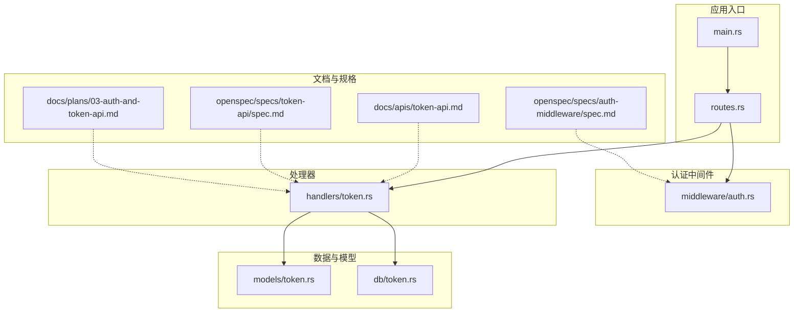
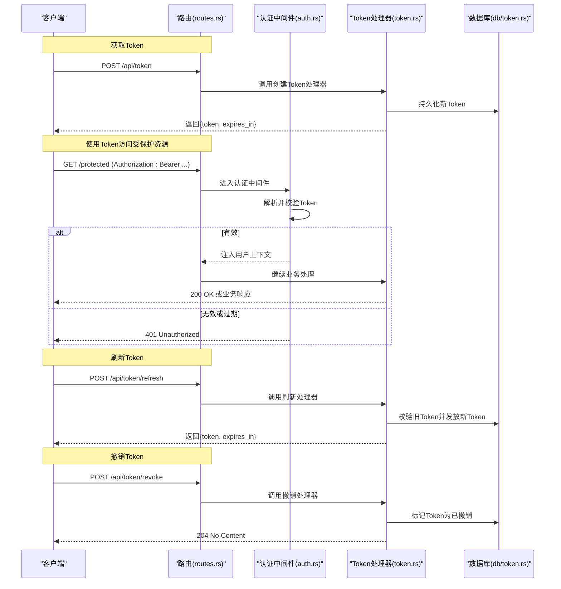
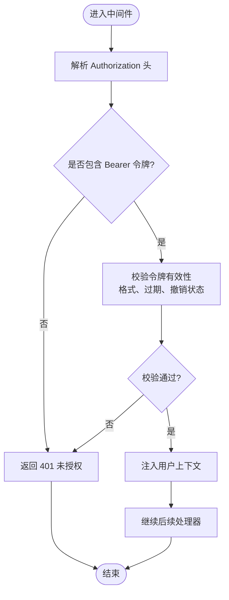
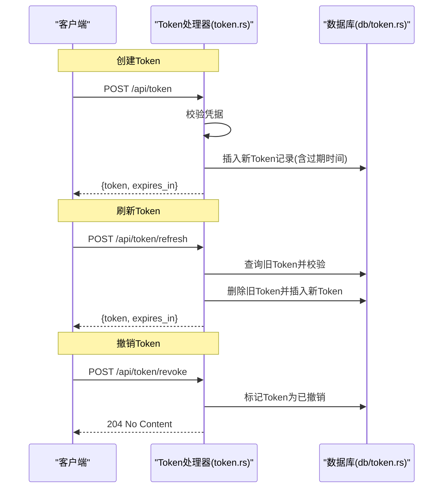
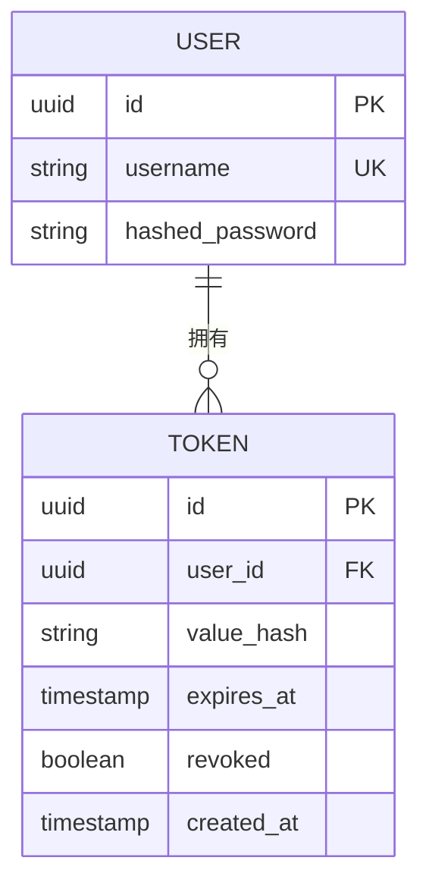
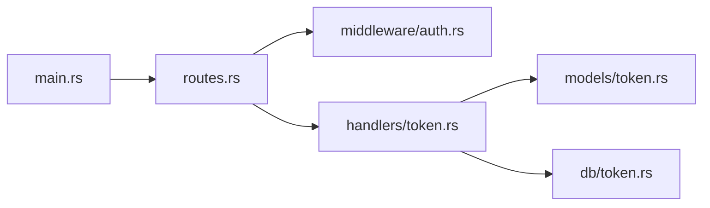

# 认证与授权

<cite>
**本文引用的文件**
- [src/middleware/auth.rs](file://src/middleware/auth.rs)
- [src/handlers/token.rs](file://src/handlers/token.rs)
- [src/db/token.rs](file://src/db/token.rs)
- [src/models/token.rs](file://src/models/token.rs)
- [src/routes.rs](file://src/routes.rs)
- [src/main.rs](file://src/main.rs)
- [docs/apis/token-api.md](file://docs/apis/token-api.md)
- [openspec/specs/auth-middleware/spec.md](file://openspec/specs/auth-middleware/spec.md)
- [openspec/specs/token-api/spec.md](file://openspec/specs/token-api/spec.md)
- [openspec/specs/initial-token-bootstrap/spec.md](file://openspec/specs/initial-token-bootstrap/spec.md)
- [docs/plans/03-auth-and-token-api.md](file://docs/plans/03-auth-and-token-api.md)
</cite>

## 目录
1. [简介](#简介)
2. [项目结构](#项目结构)
3. [核心组件](#核心组件)
4. [架构总览](#架构总览)
5. [详细组件分析](#详细组件分析)
6. [依赖关系分析](#依赖关系分析)
7. [性能考虑](#性能考虑)
8. [故障排查指南](#故障排查指南)
9. [结论](#结论)
10. [附录](#附录)

## 简介
本文件面向AI趋势监控系统的认证与授权机制，围绕Bearer Token认证流程、Token生成与验证、权限控制策略展开，覆盖认证中间件实现、Token存储与管理、权限验证逻辑，并提供Token获取、刷新、撤销的完整流程说明。同时给出安全最佳实践、常见问题排查与Token泄露防护建议，以及可直接参考的请求示例与错误处理方案。

## 项目结构
认证与授权相关的核心代码位于以下模块：
- 中间件：认证拦截与上下文注入
- 处理器：Token API（创建、刷新、撤销）
- 数据层：Token模型与数据库访问
- 路由：对外暴露的认证接口
- 规格与计划：认证中间件与Token API的设计规范及实施计划
- 文档：Token API接口文档

**图表来源**
- [src/main.rs](file://src/main.rs)
- [src/routes.rs](file://src/routes.rs)
- [src/middleware/auth.rs](file://src/middleware/auth.rs)
- [src/handlers/token.rs](file://src/handlers/token.rs)
- [src/models/token.rs](file://src/models/token.rs)
- [src/db/token.rs](file://src/db/token.rs)
- [docs/apis/token-api.md](file://docs/apis/token-api.md)
- [openspec/specs/auth-middleware/spec.md](file://openspec/specs/auth-middleware/spec.md)
- [openspec/specs/token-api/spec.md](file://openspec/specs/token-api/spec.md)
- [docs/plans/03-auth-and-token-api.md](file://docs/plans/03-auth-and-token-api.md)

**章节来源**
- [src/main.rs](file://src/main.rs)
- [src/routes.rs](file://src/routes.rs)

## 核心组件
- 认证中间件：负责从HTTP请求中提取并校验Bearer Token，解析用户身份信息并注入到请求上下文，未通过时返回相应错误。
- Token处理器：提供Token创建、刷新、撤销等API，对接Token模型与数据库层。
- Token模型与数据库：定义Token的数据结构、生命周期字段、索引与约束；提供持久化与查询能力。
- 路由：将认证中间件与Token处理器绑定到具体路径，形成对外接口。
- 规格与计划：明确认证中间件与Token API的行为、参数、响应格式与实施步骤。

**章节来源**
- [src/middleware/auth.rs](file://src/middleware/auth.rs)
- [src/handlers/token.rs](file://src/handlers/token.rs)
- [src/models/token.rs](file://src/models/token.rs)
- [src/db/token.rs](file://src/db/token.rs)
- [src/routes.rs](file://src/routes.rs)
- [openspec/specs/auth-middleware/spec.md](file://openspec/specs/auth-middleware/spec.md)
- [openspec/specs/token-api/spec.md](file://openspec/specs/token-api/spec.md)
- [docs/plans/03-auth-and-token-api.md](file://docs/plans/03-auth-and-token-api.md)

## 架构总览
下图展示从客户端到服务端的认证与授权交互流程，包括Token获取、刷新与撤销的关键步骤。

**图表来源**
- [src/routes.rs](file://src/routes.rs)
- [src/middleware/auth.rs](file://src/middleware/auth.rs)
- [src/handlers/token.rs](file://src/handlers/token.rs)
- [src/db/token.rs](file://src/db/token.rs)

## 详细组件分析

### 认证中间件（Bearer Token）
- 功能职责
  - 从请求头中提取Authorization: Bearer <token>。
  - 校验Token格式与有效性（如是否过期、是否被撤销）。
  - 将用户身份信息注入到请求上下文，供后续处理器使用。
  - 对未通过校验的请求返回401 Unauthorized。
- 关键点
  - Token解析与校验逻辑应避免明文打印日志。
  - 支持快速失败与统一错误响应格式。
  - 可扩展支持多租户或角色标记以便后续权限控制。

**图表来源**
- [src/middleware/auth.rs](file://src/middleware/auth.rs)

**章节来源**
- [src/middleware/auth.rs](file://src/middleware/auth.rs)
- [openspec/specs/auth-middleware/spec.md](file://openspec/specs/auth-middleware/spec.md)

### Token处理器（创建/刷新/撤销）
- 创建Token
  - 输入：凭据（用户名/密码或一次性密钥）。
  - 输出：新Token与有效期。
  - 行为：校验凭据，生成唯一Token，设置过期时间，持久化至数据库。
- 刷新Token
  - 输入：当前有效Token。
  - 输出：新的Token与有效期。
  - 行为：校验旧Token有效性与撤销状态，签发新Token并更新数据库。
- 撤销Token
  - 输入：待撤销的Token。
  - 输出：无内容（204）。
  - 行为：将该Token标记为已撤销，使其无法再用于鉴权。

**图表来源**
- [src/handlers/token.rs](file://src/handlers/token.rs)
- [src/db/token.rs](file://src/db/token.rs)

**章节来源**
- [src/handlers/token.rs](file://src/handlers/token.rs)
- [src/db/token.rs](file://src/db/token.rs)
- [openspec/specs/token-api/spec.md](file://openspec/specs/token-api/spec.md)

### Token模型与数据库
- 数据模型
  - 字段：标识符、所属用户、令牌值、过期时间、撤销标志、创建时间等。
  - 约束：令牌值唯一索引；按过期时间建立索引以支持清理。
- 存储与查询
  - 创建：写入新记录。
  - 查询：按令牌值与过期时间、撤销状态联合过滤。
  - 更新：刷新时替换旧记录；撤销时仅更新撤销标志。
- 安全注意
  - 不在数据库中保存明文Token，仅保存哈希或加密后的摘要。
  - 定期清理过期且未使用的Token，降低泄露风险。

**图表来源**
- [src/models/token.rs](file://src/models/token.rs)
- [src/db/token.rs](file://src/db/token.rs)

**章节来源**
- [src/models/token.rs](file://src/models/token.rs)
- [src/db/token.rs](file://src/db/token.rs)

### 权限控制策略（扩展建议）
- 基于角色的访问控制（RBAC）
  - 在用户模型中引入角色字段，中间件在通过认证后附加角色信息。
  - 路由或处理器根据角色判断是否允许访问特定资源。
- 资源级权限
  - 对每个受保护资源维护访问列表或策略矩阵，结合用户角色与资源属性进行决策。
- 最小权限原则
  - 仅授予完成任务所需的最小权限集合，定期审计权限分配。

（本节为概念性扩展，不直接分析具体文件）

### Token获取、刷新、撤销流程详解
- 获取Token
  - 请求路径：POST /api/token
  - 参数：凭据（用户名/密码或一次性密钥）
  - 成功响应：{token, expires_in}
  - 错误：400/401（凭据无效或格式错误）
- 刷新Token
  - 请求路径：POST /api/token/refresh
  - 参数：当前有效Token
  - 成功响应：{token, expires_in}
  - 错误：400/401（旧Token无效、已撤销或格式错误）
- 撤销Token
  - 请求路径：POST /api/token/revoke
  - 参数：待撤销的Token
  - 成功响应：204 No Content
  - 错误：400（格式错误）/401（无效）

**章节来源**
- [docs/apis/token-api.md](file://docs/apis/token-api.md)
- [openspec/specs/token-api/spec.md](file://openspec/specs/token-api/spec.md)
- [src/handlers/token.rs](file://src/handlers/token.rs)

## 依赖关系分析
- 入口与路由
  - main.rs 启动服务并注册路由。
  - routes.rs 将认证中间件与Token处理器绑定到对应路径。
- 中间件与处理器
  - 认证中间件在处理器前执行，确保所有受保护路由均经过鉴权。
- 处理器与数据层
  - Token处理器调用Token模型与数据库层，完成创建、刷新、撤销的持久化操作。

**图表来源**
- [src/main.rs](file://src/main.rs)
- [src/routes.rs](file://src/routes.rs)
- [src/middleware/auth.rs](file://src/middleware/auth.rs)
- [src/handlers/token.rs](file://src/handlers/token.rs)
- [src/models/token.rs](file://src/models/token.rs)
- [src/db/token.rs](file://src/db/token.rs)

**章节来源**
- [src/main.rs](file://src/main.rs)
- [src/routes.rs](file://src/routes.rs)

## 性能考虑
- Token校验缓存
  - 对频繁访问的Token进行短期缓存，减少数据库查询次数。
- 异步清理
  - 定时任务清理过期且未使用的Token，避免查询时大量扫描。
- 并发安全
  - 刷新与撤销操作需使用事务，保证原子性与一致性。
- 日志与监控
  - 记录认证失败事件与异常，便于追踪攻击与性能瓶颈。

（本节提供通用指导，不直接分析具体文件）

## 故障排查指南
- 401 未授权
  - 检查请求头是否包含正确的Authorization: Bearer <token>。
  - 确认Token未过期且未被撤销。
  - 核对中间件是否正确解析与校验Token。
- 400 参数错误
  - 检查请求体格式与必填字段。
  - 对于刷新/撤销接口，确认传入的Token字符串格式正确。
- Token泄露与滥用
  - 建议启用HTTPS、短有效期、定期轮换。
  - 对高危操作增加二次验证或白名单限制。
- 常见问题定位
  - 查看服务端日志中的认证失败统计与堆栈。
  - 使用测试工具模拟请求，逐步缩小问题范围。

**章节来源**
- [src/middleware/auth.rs](file://src/middleware/auth.rs)
- [src/handlers/token.rs](file://src/handlers/token.rs)
- [src/db/token.rs](file://src/db/token.rs)

## 结论
本系统采用标准的Bearer Token认证模式，通过认证中间件统一拦截与校验，配合Token处理器与数据库层实现完整的生命周期管理。建议在现有基础上进一步完善基于角色的权限控制、Token安全存储与轮换策略，并持续优化性能与可观测性，以满足生产环境的安全与稳定性要求。

## 附录
- 实际请求示例（路径与行为参考）
  - 获取Token：POST /api/token（凭据参数见接口文档）
  - 刷新Token：POST /api/token/refresh（携带当前有效Token）
  - 撤销Token：POST /api/token/revoke（携带待撤销的Token）
- 接口文档与设计规范
  - Token API接口文档：[docs/apis/token-api.md](file://docs/apis/token-api.md)
  - 认证中间件设计：[openspec/specs/auth-middleware/spec.md](file://openspec/specs/auth-middleware/spec.md)
  - Token API设计：[openspec/specs/token-api/spec.md](file://openspec/specs/token-api/spec.md)
  - 初始Token引导：[openspec/specs/initial-token-bootstrap/spec.md](file://openspec/specs/initial-token-bootstrap/spec.md)
  - 认证与Token API规划：[docs/plans/03-auth-and-token-api.md](file://docs/plans/03-auth-and-token-api.md)

**章节来源**
- [docs/apis/token-api.md](file://docs/apis/token-api.md)
- [openspec/specs/auth-middleware/spec.md](file://openspec/specs/auth-middleware/spec.md)
- [openspec/specs/token-api/spec.md](file://openspec/specs/token-api/spec.md)
- [openspec/specs/initial-token-bootstrap/spec.md](file://openspec/specs/initial-token-bootstrap/spec.md)
- [docs/plans/03-auth-and-token-api.md](file://docs/plans/03-auth-and-token-api.md)