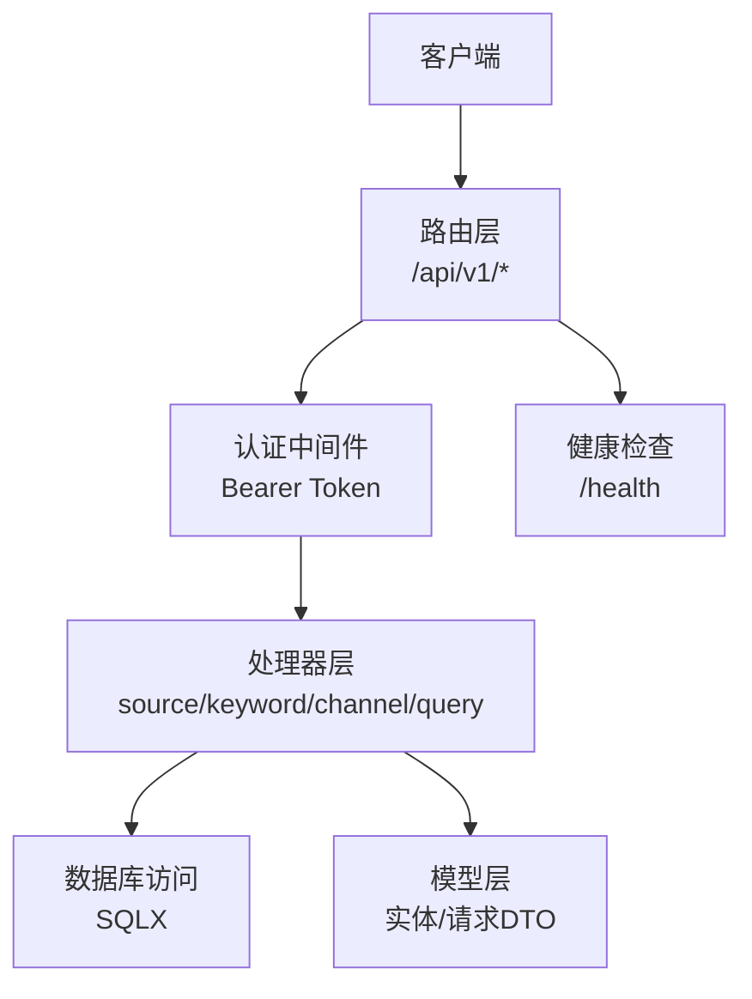
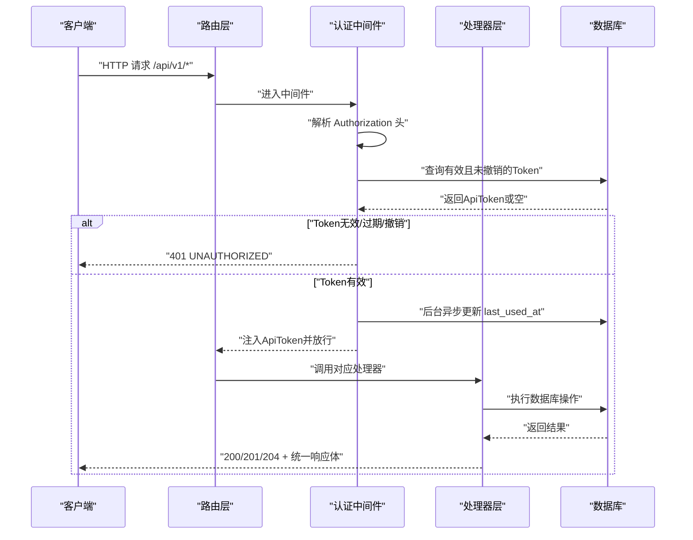
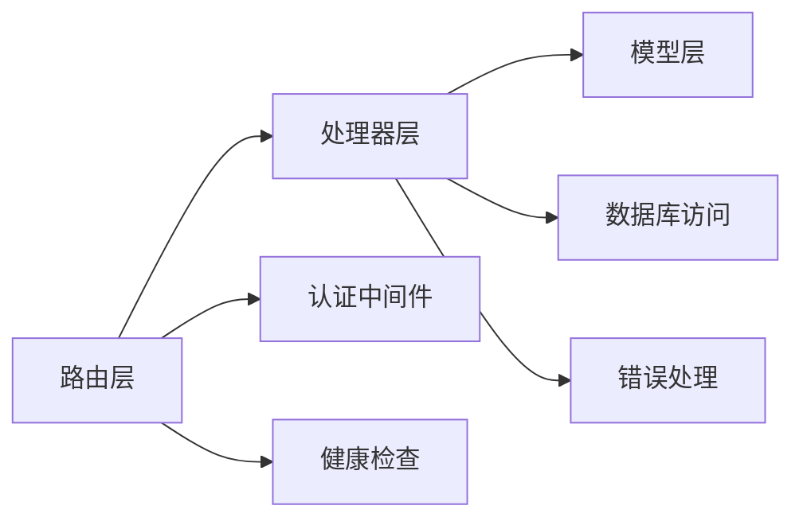

# CRUD API规范

<cite>
**本文引用的文件**
- [routes.rs](file://src/routes.rs)
- [handlers.rs](file://src/handlers.rs)
- [source.rs](file://src/handlers/source.rs)
- [keyword.rs](file://src/handlers/keyword.rs)
- [channel.rs](file://src/handlers/channel.rs)
- [query.rs](file://src/handlers/query.rs)
- [auth.rs](file://src/middleware/auth.rs)
- [error.rs](file://src/error.rs)
- [source.rs（模型）](file://src/models/source.rs)
- [keyword.rs（模型）](file://src/models/keyword.rs)
- [channel.rs（模型）](file://src/models/channel.rs)
- [spec.md（数据模型规范）](file://openspec/specs/data-models/spec.md)
- [spec.md（认证中间件规范）](file://openspec/specs/auth-middleware/spec.md)
</cite>

## 目录
1. [简介](#简介)
2. [项目结构](#项目结构)
3. [核心组件](#核心组件)
4. [架构总览](#架构总览)
5. [详细组件分析](#详细组件分析)
6. [依赖关系分析](#依赖关系分析)
7. [性能考量](#性能考量)
8. [故障排查指南](#故障排查指南)
9. [结论](#结论)
10. [附录：API接口清单与规范](#附录api接口清单与规范)

## 简介
本文件为“AI趋势监控系统”的CRUD API规范文档，覆盖数据源（Sources）、关键词（Keywords）、推送通道（Channels）三大核心实体的增删改查能力，并结合查询类接口（文章列表、热点事件、趋势曲线）给出统一的RESTful设计原则、资源命名约定、HTTP状态码使用规范、请求参数验证、响应数据格式、分页与排序规则、安全与性能优化建议。所有接口均受Bearer Token认证保护（/health除外），并遵循统一的错误响应格式。

## 项目结构
后端基于Rust + Axum框架，采用模块化组织：
- 路由层：在路由中注册各资源的CRUD端点与查询端点，并挂载认证中间件。
- 处理器层：按资源拆分为source、keyword、channel、query四个模块，每个模块负责对应资源的HTTP处理逻辑。
- 模型层：定义实体结构体与请求DTO，支持序列化/反序列化与数据库映射。
- 中间件：认证中间件从Authorization头提取Bearer Token，校验有效性、过期与撤销状态，并异步更新最近使用时间。
- 错误处理：统一的AppError枚举，映射到标准HTTP状态码与统一错误响应体。

图表来源
- [routes.rs:14-56](file://src/routes.rs#L14-L56)
- [auth.rs:18-59](file://src/middleware/auth.rs#L18-L59)

章节来源
- [routes.rs:1-67](file://src/routes.rs#L1-L67)
- [handlers.rs:1-7](file://src/handlers.rs#L1-L7)

## 核心组件
- 路由与中间件
  - 所有/api/v1/*端点受认证中间件保护；/health无需认证。
  - 认证中间件从Authorization头解析Bearer Token，校验是否撤销、是否过期，并异步更新最近使用时间。
- 统一响应与错误
  - 成功响应统一包装为{"data": ...}，状态码依据操作类型返回200/201/204。
  - 错误响应统一为{"error": {"code": "...", "message": "..."}}, 并映射标准HTTP状态码。
- 数据模型与请求DTO
  - 实体模型与请求DTO分离，确保输入验证与输出脱敏（如令牌列表不暴露敏感字段）。
  - 字段命名与序列化遵循规范，如数据源类型字段在JSON中显示为"type"。

章节来源
- [auth.rs:18-59](file://src/middleware/auth.rs#L18-L59)
- [error.rs:8-79](file://src/error.rs#L8-L79)
- [spec.md（数据模型规范）:56-134](file://openspec/specs/data-models/spec.md#L56-L134)

## 架构总览
下图展示认证中间件如何拦截请求，进行Token校验与注入，再交由具体处理器处理业务逻辑。

图表来源
- [auth.rs:18-59](file://src/middleware/auth.rs#L18-L59)
- [routes.rs:49-50](file://src/routes.rs#L49-L50)

## 详细组件分析

### 数据源（Sources）CRUD
- 资源路径
  - 列表：GET /api/v1/sources
  - 创建：POST /api/v1/sources
  - 更新：POST /api/v1/sources/{id}/update
  - 删除：POST /api/v1/sources/{id}/delete
  - 触发抓取：POST /api/v1/sources/{id}/fetch
- 请求与响应
  - 列表：返回DataSource数组，按创建时间倒序。
  - 创建：CreateSourceRequest必填字段包括type、name、url；可选interval_seconds与config；成功返回201。
  - 更新：UpdateSourceRequest全部可选，仅更新提供的字段；不存在返回404。
  - 删除：存在性检查后删除，成功返回204；不存在返回404。
  - 触发抓取：将last_fetched_at重置为空，便于解析器下次轮询；不存在返回404。
- 参数验证
  - JSON字段名与模型映射严格一致；type字段在JSON中显示为"type"。
- 安全与性能
  - 全部受认证保护；更新/删除前先查询是否存在，避免无意义写入。

章节来源
- [source.rs（处理器）:12-91](file://src/handlers/source.rs#L12-L91)
- [source.rs（模型）:5-39](file://src/models/source.rs#L5-L39)
- [spec.md（数据模型规范）:56-88](file://openspec/specs/data-models/spec.md#L56-L88)

### 关键词（Keywords）CRUD
- 资源路径
  - 列表：GET /api/v1/keywords
  - 创建：POST /api/v1/keywords
  - 更新：POST /api/v1/keywords/{id}/update
  - 删除：POST /api/v1/keywords/{id}/delete
- 请求与响应
  - 列表：返回Keyword数组，按创建时间倒序。
  - 创建：CreateKeywordRequest必填word；其他字段有默认值；重复word返回409。
  - 更新：UpdateKeywordRequest全部可选，仅更新提供的字段；不存在返回404。
  - 删除：存在性检查后删除，成功返回204；不存在返回404。
- 参数验证
  - 字段类型与默认值符合规范；大小写敏感、阈值等配置项可独立调整。
- 安全与性能
  - 全部受认证保护；冲突检测在数据库层面通过唯一约束触发。

章节来源
- [keyword.rs（处理器）:12-82](file://src/handlers/keyword.rs#L12-L82)
- [keyword.rs（模型）:5-32](file://src/models/keyword.rs#L5-L32)
- [spec.md（数据模型规范）:89-97](file://openspec/specs/data-models/spec.md#L89-L97)

### 推送通道（Channels）CRUD
- 资源路径
  - 列表：GET /api/v1/channels
  - 创建：POST /api/v1/channels
  - 更新：POST /api/v1/channels/{id}/update
  - 删除：POST /api/v1/channels/{id}/delete
- 请求与响应
  - 列表：返回PushChannel数组，按id升序。
  - 创建：CreateChannelRequest必填name与config（JSON字符串）；channel_type默认webhook。
  - 更新：UpdateChannelRequest全部可选，仅更新提供的字段；不存在返回404。
  - 删除：存在性检查后删除，成功返回204；不存在返回404。
- 参数验证
  - config为JSON字符串，需满足目标通道（如Webhook）的配置要求。
- 安全与性能
  - 全部受认证保护；更新/删除前先查询是否存在。

章节来源
- [channel.rs（处理器）:12-71](file://src/handlers/channel.rs#L12-L71)
- [channel.rs（模型）:4-26](file://src/models/channel.rs#L4-L26)
- [spec.md（数据模型规范）:107-115](file://openspec/specs/data-models/spec.md#L107-L115)

### 查询与系统控制
- 文章列表（分页+过滤）
  - GET /api/v1/articles?page=&per_page=&source_id=&processed=
  - 支持按source_id与processed过滤；分页参数缺省时使用默认值。
- 热点事件（分页+可选关键词过滤）
  - GET /api/v1/hotspots?page=&per_page=&keyword_id=
  - 支持keyword_id过滤；每页最大100条。
- 热点事件下的推送记录
  - GET /api/v1/hotspots/{id}/push-records
  - 返回该热点相关的推送记录明细。
- 关键词趋势
  - GET /api/v1/trend/{keyword_id}?hours=
  - 返回最近若干小时的计数趋势，按小时桶降序排列。
- 系统控制（手动触发）
  - POST /api/v1/trigger/filter
  - POST /api/v1/trigger/pusher
- 响应格式
  - 文章与热点事件列表使用统一分页包装对象，包含items、total、page、per_page。
  - 趋势接口返回包含keyword元信息与points数组的对象。

章节来源
- [query.rs:14-169](file://src/handlers/query.rs#L14-L169)

## 依赖关系分析
- 路由层依赖处理器模块，处理器模块依赖模型与数据库访问层。
- 认证中间件对所有/api/v1/*端点生效，/health除外。
- 错误处理统一由AppError实现IntoResponse，保证错误响应一致性。

图表来源
- [routes.rs:14-56](file://src/routes.rs#L14-L56)
- [auth.rs:18-59](file://src/middleware/auth.rs#L18-L59)
- [error.rs:23-79](file://src/error.rs#L23-L79)

章节来源
- [routes.rs:1-67](file://src/routes.rs#L1-L67)
- [handlers.rs:1-7](file://src/handlers.rs#L1-L7)

## 性能考量
- 连接池与事务
  - 使用SQLite连接池，默认最大连接数为5；开启WAL模式与外键强制，提升并发与一致性。
- 异步更新
  - 认证中间件在成功鉴权后，使用tokio::spawn异步更新last_used_at，避免阻塞主响应。
- 分页与限制
  - 热点事件列表对每页数量设置上限（如100），防止过大负载。
- 序列化与脱敏
  - 列表响应仅包含必要字段，敏感信息（如完整令牌）不在列表中暴露。

章节来源
- [db.rs:12-27](file://src/db.rs#L12-L27)
- [auth.rs:48-53](file://src/middleware/auth.rs#L48-L53)
- [query.rs:78-79](file://src/handlers/query.rs#L78-L79)

## 故障排查指南
- 常见错误与状态码
  - 401 未授权：缺少或格式错误的Authorization头、无效或已撤销的Token、Token过期。
  - 404 资源不存在：更新/删除/触发抓取的目标不存在。
  - 409 冲突：创建关键词时word重复。
  - 500 内部错误：数据库异常等未预期错误，统一返回DATABASE_ERROR。
- 排查步骤
  - 确认Authorization头格式为Bearer <token>。
  - 校验Token未撤销且未过期。
  - 对于更新/删除/触发抓取，先确认目标资源存在。
  - 对于分页查询，检查page与per_page范围是否合理。

章节来源
- [error.rs:8-79](file://src/error.rs#L8-L79)
- [auth.rs:23-46](file://src/middleware/auth.rs#L23-L46)
- [keyword.rs（处理器）:33-40](file://src/handlers/keyword.rs#L33-L40)

## 结论
本CRUD API规范以清晰的资源命名、统一的响应与错误格式、严格的认证与参数验证为基础，覆盖数据源、关键词、通道三类核心实体的完整生命周期管理，并提供查询与系统控制接口。通过模块化设计与中间件机制，系统在安全性、可维护性与性能之间取得平衡。建议在生产环境中配合日志与监控，持续评估分页与并发策略。

## 附录：API接口清单与规范

### 通用规范
- 资源命名
  - 复数形式：/sources、/keywords、/channels、/articles、/hotspots。
  - 动作后缀：/{id}/update、/{id}/delete、/{id}/fetch。
- HTTP方法
  - GET：查询列表或详情
  - POST：创建、更新、删除、触发
- 认证
  - 除/health外，所有/api/v1/*接口需携带Authorization: Bearer <token>。
- 响应格式
  - 成功：{"data": ...}
  - 错误：{"error": {"code": "...", "message": "..."}}
- 分页
  - page默认1，per_page默认20；热点事件列表per_page最大100。
- 排序
  - 数据源列表按created_at倒序；通道列表按id升序；热点事件按hour_bucket倒序。

章节来源
- [routes.rs:21-50](file://src/routes.rs#L21-L50)
- [query.rs:47-99](file://src/handlers/query.rs#L47-L99)
- [spec.md（认证中间件规范）:1-88](file://openspec/specs/auth-middleware/spec.md#L1-L88)

### 数据源（Sources）
- 列表
  - 方法：GET
  - 路径：/api/v1/sources
  - 认证：是
  - 响应：数组，元素为DataSource
- 创建
  - 方法：POST
  - 路径：/api/v1/sources
  - 认证：是
  - 请求体：CreateSourceRequest（type、name、url必填；interval_seconds、config可选）
  - 响应：201 + DataSource
- 更新
  - 方法：POST
  - 路径：/api/v1/sources/{id}/update
  - 认证：是
  - 请求体：UpdateSourceRequest（全部可选）
  - 响应：200 + DataSource；不存在返回404
- 删除
  - 方法：POST
  - 路径：/api/v1/sources/{id}/delete
  - 认证：是
  - 响应：204；不存在返回404
- 触发抓取
  - 方法：POST
  - 路径：/api/v1/sources/{id}/fetch
  - 认证：是
  - 响应：200 + {"message": "..."}

章节来源
- [source.rs（处理器）:12-91](file://src/handlers/source.rs#L12-L91)
- [source.rs（模型）:21-39](file://src/models/source.rs#L21-L39)

### 关键词（Keywords）
- 列表
  - 方法：GET
  - 路径：/api/v1/keywords
  - 认证：是
  - 响应：数组，元素为Keyword
- 创建
  - 方法：POST
  - 路径：/api/v1/keywords
  - 认证：是
  - 请求体：CreateKeywordRequest（word必填；其余可选）
  - 响应：201 + Keyword；重复word返回409
- 更新
  - 方法：POST
  - 路径：/api/v1/keywords/{id}/update
  - 认证：是
  - 请求体：UpdateKeywordRequest（全部可选）
  - 响应：200 + Keyword；不存在返回404
- 删除
  - 方法：POST
  - 路径：/api/v1/keywords/{id}/delete
  - 认证：是
  - 响应：204；不存在返回404

章节来源
- [keyword.rs（处理器）:12-82](file://src/handlers/keyword.rs#L12-L82)
- [keyword.rs（模型）:16-32](file://src/models/keyword.rs#L16-L32)

### 推送通道（Channels）
- 列表
  - 方法：GET
  - 路径：/api/v1/channels
  - 认证：是
  - 响应：数组，元素为PushChannel
- 创建
  - 方法：POST
  - 路径：/api/v1/channels
  - 认证：是
  - 请求体：CreateChannelRequest（name、config必填；channel_type默认webhook）
  - 响应：201 + PushChannel
- 更新
  - 方法：POST
  - 路径：/api/v1/channels/{id}/update
  - 认证：是
  - 请求体：UpdateChannelRequest（全部可选）
  - 响应：200 + PushChannel；不存在返回404
- 删除
  - 方法：POST
  - 路径：/api/v1/channels/{id}/delete
  - 认证：是
  - 响应：204；不存在返回404

章节来源
- [channel.rs（处理器）:12-71](file://src/handlers/channel.rs#L12-L71)
- [channel.rs（模型）:13-26](file://src/models/channel.rs#L13-L26)

### 查询与系统控制
- 文章列表
  - 方法：GET
  - 路径：/api/v1/articles?page=&per_page=&source_id=&processed=
  - 认证：是
  - 响应：分页包装对象（items、total、page、per_page）
- 热点事件列表
  - 方法：GET
  - 路径：/api/v1/hotspots?page=&per_page=&keyword_id=
  - 认证：是
  - 响应：分页包装对象（items、total、page、per_page）
- 热点事件下的推送记录
  - 方法：GET
  - 路径：/api/v1/hotspots/{id}/push-records
  - 认证：是
  - 响应：数组，元素为推送记录明细
- 关键词趋势
  - 方法：GET
  - 路径：/api/v1/trend/{keyword_id}?hours=
  - 认证：是
  - 响应：包含keyword_id、keyword、points的结构
- 系统控制（手动触发）
  - 方法：POST
  - 路径：/api/v1/trigger/filter | /api/v1/trigger/pusher
  - 认证：是
  - 响应：{"message": "..."}

章节来源
- [query.rs:47-169](file://src/handlers/query.rs#L47-L169)

### 错误码对照
- 400 BAD_REQUEST：请求参数非法
- 401 UNAUTHORIZED：缺少或无效的Authorization头、Token无效/撤销/过期
- 404 NOT_FOUND：资源不存在
- 409 CONFLICT：资源冲突（如关键词重复）
- 500 INTERNAL_ERROR/DATABASE_ERROR：内部错误或数据库异常

章节来源
- [error.rs:8-79](file://src/error.rs#L8-L79)
- [spec.md（认证中间件规范）:9-49](file://openspec/specs/auth-middleware/spec.md#L9-L49)