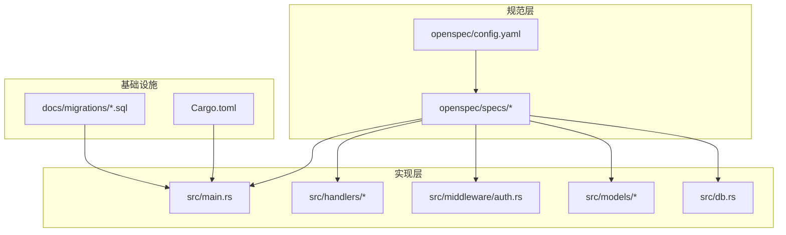
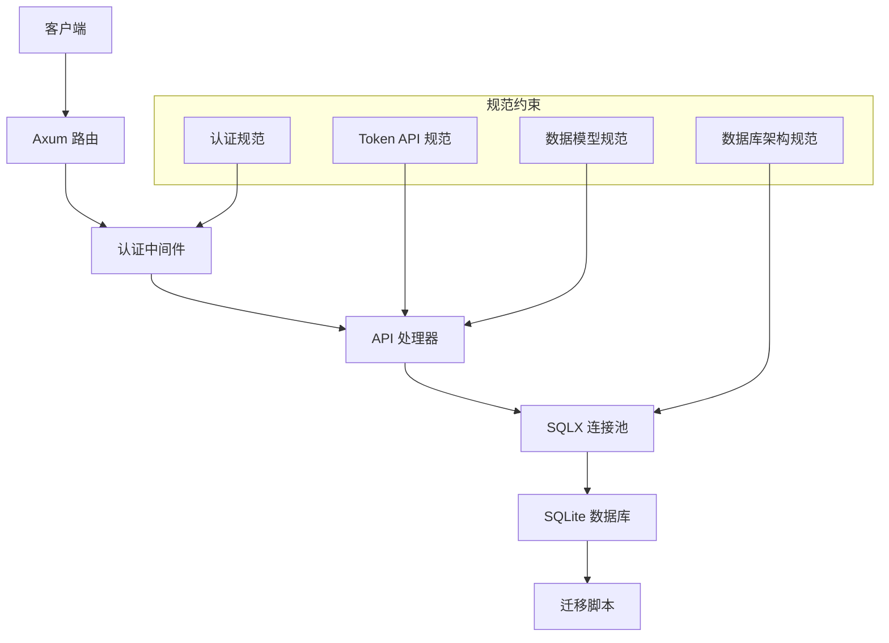
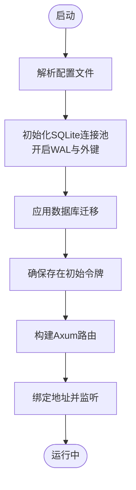
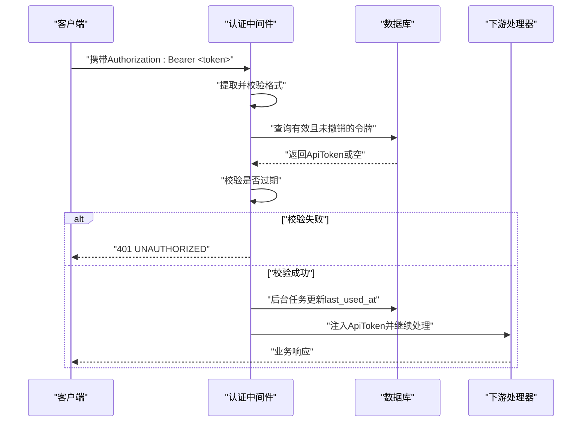
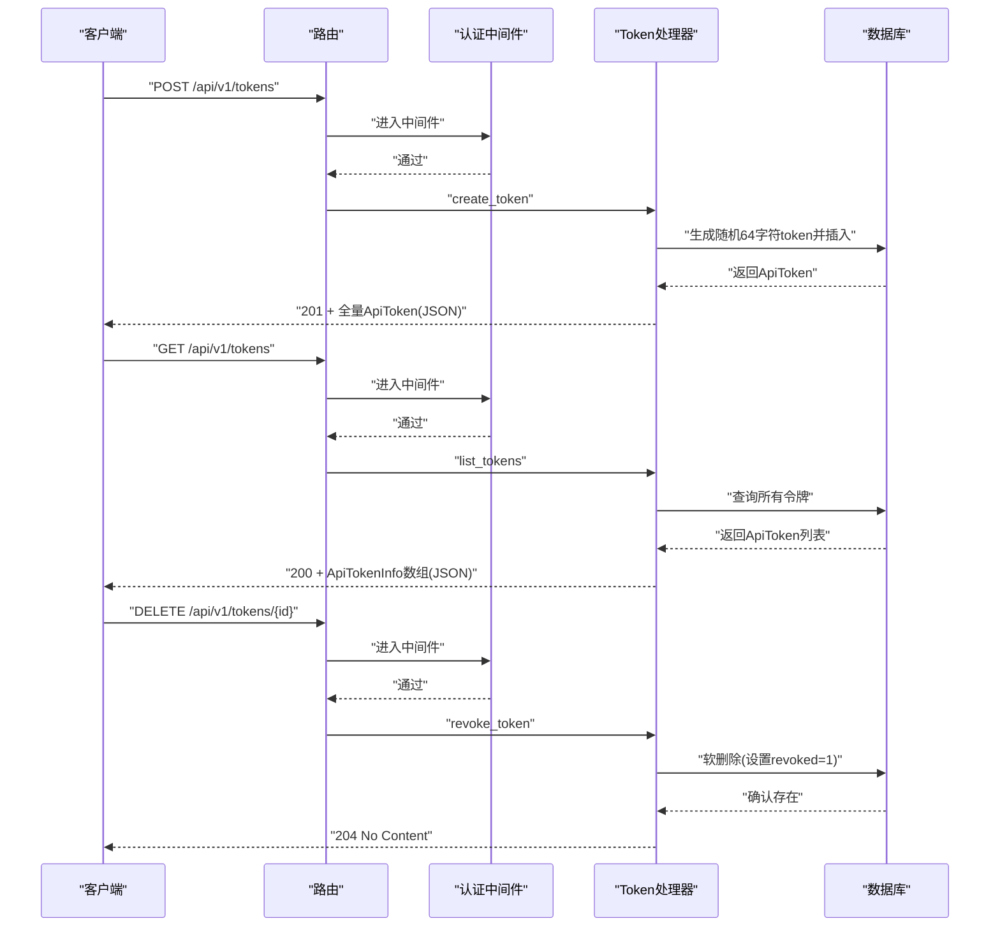
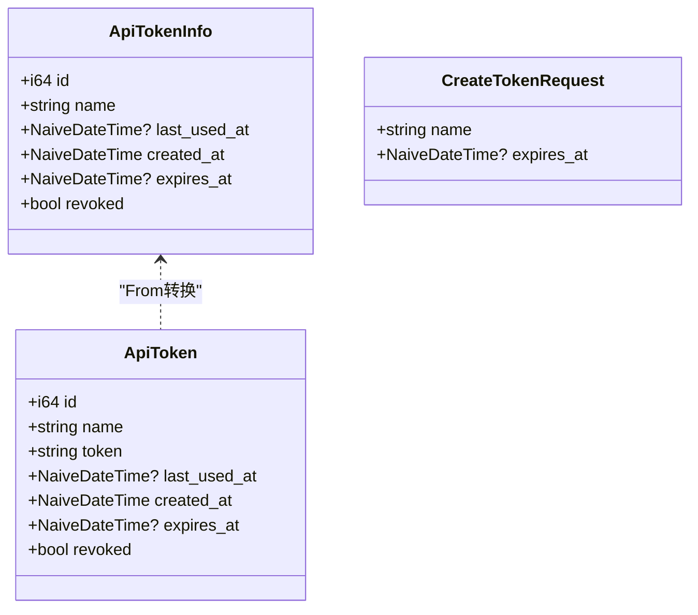
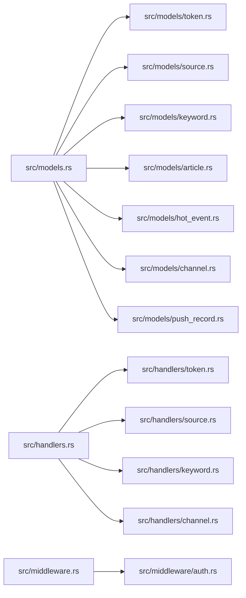
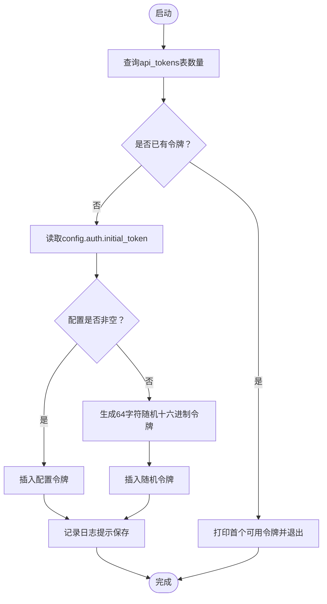
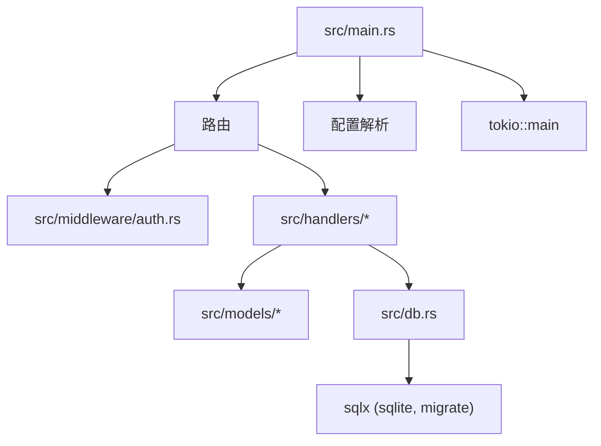

# OpenSpec规范

<cite>
**本文档引用的文件**
- [openspec/config.yaml](file://openspec/config.yaml)
- [openspec/specs/backend-project-scaffold/spec.md](file://openspec/specs/backend-project-scaffold/spec.md)
- [openspec/specs/token-api/spec.md](file://openspec/specs/token-api/spec.md)
- [openspec/specs/data-models/spec.md](file://openspec/specs/data-models/spec.md)
- [openspec/specs/database-schema/spec.md](file://openspec/specs/database-schema/spec.md)
- [openspec/specs/auth-middleware/spec.md](file://openspec/specs/auth-middleware/spec.md)
- [openspec/specs/module-organization/spec.md](file://openspec/specs/module-organization/spec.md)
- [openspec/specs/initial-token-bootstrap/spec.md](file://openspec/specs/initial-token-bootstrap/spec.md)
- [src/main.rs](file://src/main.rs)
- [src/db.rs](file://src/db.rs)
- [src/models.rs](file://src/models.rs)
- [src/handlers.rs](file://src/handlers.rs)
- [src/middleware.rs](file://src/middleware.rs)
- [Cargo.toml](file://Cargo.toml)
- [src/handlers/token.rs](file://src/handlers/token.rs)
- [src/models/token.rs](file://src/models/token.rs)
- [src/middleware/auth.rs](file://src/middleware/auth.rs)
- [docs/migrations/20260607044921_init.sql](file://docs/migrations/20260607044921_init.sql)
</cite>

## 目录
1. [引言](#引言)
2. [项目结构](#项目结构)
3. [核心组件](#核心组件)
4. [架构总览](#架构总览)
5. [详细组件分析](#详细组件分析)
6. [依赖分析](#依赖分析)
7. [性能考虑](#性能考虑)
8. [故障排查指南](#故障排查指南)
9. [结论](#结论)
10. [附录](#附录)

## 引言
本文件为AI趋势监控系统（TrendAITool）的OpenSpec规范文档，系统化阐述以“规范驱动开发”为核心理念的方法论：通过明确的规范（Specification）定义需求与行为边界，再以实现（Implementation）严格遵循规范进行落地，最终形成可验证、可演进、可协作的软件工程实践。OpenSpec强调：
- 规范先行：以可执行场景（Scenarios）描述系统行为，确保无歧义
- 实现验证：通过规范与实现对照检查，确保一致性
- 变更管理：版本化管理、向后兼容策略与社区协作机制
- 演进能力：基于模块化与分层设计，支持持续扩展

## 项目结构
项目采用“规范在前、实现跟进”的组织方式，核心目录如下：
- openspec：集中存放所有OpenSpec规范文件，按主题拆分，便于版本化管理与评审
- src：后端实现，遵循规范要求的模块风格与数据模型
- docs：配套文档与迁移脚本
- 配置与依赖：Cargo.toml声明技术栈；openspec/config.yaml定义生成上下文



**图表来源**
- [openspec/config.yaml:1-21](file://openspec/config.yaml#L1-L21)
- [openspec/specs/backend-project-scaffold/spec.md:1-151](file://openspec/specs/backend-project-scaffold/spec.md#L1-L151)
- [src/main.rs:1-96](file://src/main.rs#L1-L96)
- [src/handlers/token.rs:1-66](file://src/handlers/token.rs#L1-L66)
- [src/middleware/auth.rs:1-60](file://src/middleware/auth.rs#L1-L60)
- [src/models/token.rs:1-46](file://src/models/token.rs#L1-L46)
- [src/db.rs:1-26](file://src/db.rs#L1-L26)
- [docs/migrations/20260607044921_init.sql:1-118](file://docs/migrations/20260607044921_init.sql#L1-L118)
- [Cargo.toml:1-44](file://Cargo.toml#L1-L44)

**章节来源**
- [openspec/config.yaml:1-21](file://openspec/config.yaml#L1-L21)
- [Cargo.toml:1-44](file://Cargo.toml#L1-L44)

## 核心组件
- 后端项目脚手架：定义编译运行、配置解析、SQLite连接池、统一错误/成功响应、CLI模式选择、CORS支持、初始令牌等基础能力
- 认证中间件：实现Bearer Token校验、过期与撤销检查、最后使用时间异步更新、请求扩展注入
- Token API：提供创建、列出、撤销令牌的REST接口，遵循统一响应格式
- 数据模型与数据库架构：定义8张表及索引约束，确保数据一致性与查询效率
- 模块组织：强制使用Rust 2018 edition“非mod.rs”模块风格
- 初始令牌引导：首次启动自动创建管理员令牌，简化部署体验

**章节来源**
- [openspec/specs/backend-project-scaffold/spec.md:1-151](file://openspec/specs/backend-project-scaffold/spec.md#L1-L151)
- [openspec/specs/auth-middleware/spec.md:1-88](file://openspec/specs/auth-middleware/spec.md#L1-L88)
- [openspec/specs/token-api/spec.md:1-76](file://openspec/specs/token-api/spec.md#L1-L76)
- [openspec/specs/data-models/spec.md:1-134](file://openspec/specs/data-models/spec.md#L1-L134)
- [openspec/specs/database-schema/spec.md:1-173](file://openspec/specs/database-schema/spec.md#L1-L173)
- [openspec/specs/module-organization/spec.md:1-50](file://openspec/specs/module-organization/spec.md#L1-L50)
- [openspec/specs/initial-token-bootstrap/spec.md:1-52](file://openspec/specs/initial-token-bootstrap/spec.md#L1-L52)

## 架构总览
系统采用“规范驱动+模块化实现”的分层架构：
- 规范层：OpenSpec规范定义行为与约束
- 应用层：Axum路由与处理器，按模块组织
- 中间件层：认证中间件拦截并校验请求
- 数据访问层：SQLX连接池与迁移，SQLite WAL模式
- 数据层：8张核心表支撑全文检索、关键词热点检测与推送



**图表来源**
- [src/main.rs:63-96](file://src/main.rs#L63-L96)
- [src/middleware/auth.rs:14-60](file://src/middleware/auth.rs#L14-L60)
- [src/handlers/token.rs:13-66](file://src/handlers/token.rs#L13-L66)
- [src/db.rs:9-26](file://src/db.rs#L9-L26)
- [docs/migrations/20260607044921_init.sql:1-118](file://docs/migrations/20260607044921_init.sql#L1-L118)
- [openspec/specs/auth-middleware/spec.md:1-88](file://openspec/specs/auth-middleware/spec.md#L1-L88)
- [openspec/specs/token-api/spec.md:1-76](file://openspec/specs/token-api/spec.md#L1-L76)
- [openspec/specs/database-schema/spec.md:1-173](file://openspec/specs/database-schema/spec.md#L1-L173)
- [openspec/specs/data-models/spec.md:1-134](file://openspec/specs/data-models/spec.md#L1-L134)

## 详细组件分析

### 后端项目脚手架（规范与实现对照）
- 编译与运行：规范要求可编译并启动HTTP服务，实现通过main函数与CLI参数完成
- 配置解析：规范要求从TOML加载server、database、auth等段落，实现通过AppConfig::load完成
- SQLite连接池：规范要求WAL与外键约束，实现通过PRAGMA设置
- 统一错误/成功响应：规范定义错误码与成功包装，实现通过ApiResponse与AppError
- CLI模式：规范要求all/api/parser/filter/pusher模式，实现通过clap解析
- CORS：规范要求允许跨域，实现通过tower-http启用
- 初始令牌：规范要求可选初始令牌或自动生成，实现通过ensure_initial_token



**图表来源**
- [src/main.rs:63-96](file://src/main.rs#L63-L96)
- [src/db.rs:9-26](file://src/db.rs#L9-L26)
- [openspec/specs/backend-project-scaffold/spec.md:9-151](file://openspec/specs/backend-project-scaffold/spec.md#L9-L151)

**章节来源**
- [openspec/specs/backend-project-scaffold/spec.md:1-151](file://openspec/specs/backend-project-scaffold/spec.md#L1-L151)
- [src/main.rs:1-96](file://src/main.rs#L1-L96)
- [src/db.rs:1-26](file://src/db.rs#L1-L26)
- [Cargo.toml:1-44](file://Cargo.toml#L1-L44)

### 认证中间件（序列图）
认证中间件负责从Authorization头提取Bearer Token，校验有效性、撤销状态与过期时间，并在后台异步更新最后使用时间，同时将完整令牌注入请求扩展。



**图表来源**
- [src/middleware/auth.rs:14-60](file://src/middleware/auth.rs#L14-L60)
- [src/models/token.rs:5-46](file://src/models/token.rs#L5-L46)
- [openspec/specs/auth-middleware/spec.md:9-88](file://openspec/specs/auth-middleware/spec.md#L9-L88)

**章节来源**
- [openspec/specs/auth-middleware/spec.md:1-88](file://openspec/specs/auth-middleware/spec.md#L1-L88)
- [src/middleware/auth.rs:1-60](file://src/middleware/auth.rs#L1-L60)
- [src/models/token.rs:1-46](file://src/models/token.rs#L1-L46)

### Token API（序列图）
Token API提供创建、列出与撤销令牌的端点，均受认证中间件保护。



**图表来源**
- [src/handlers/token.rs:13-66](file://src/handlers/token.rs#L13-L66)
- [src/models/token.rs:5-46](file://src/models/token.rs#L5-L46)
- [openspec/specs/token-api/spec.md:9-76](file://openspec/specs/token-api/spec.md#L9-L76)

**章节来源**
- [openspec/specs/token-api/spec.md:1-76](file://openspec/specs/token-api/spec.md#L1-L76)
- [src/handlers/token.rs:1-66](file://src/handlers/token.rs#L1-L66)
- [src/models/token.rs:1-46](file://src/models/token.rs#L1-L46)

### 数据模型与数据库架构（类图与ER图）
- 数据模型：每个实体对应Rust结构体，派生sqlx::FromRow与serde::Serialize，请求DTO分离输入与存储实体
- 数据库架构：8张核心表，含唯一约束、外键级联删除、索引与默认值，迁移在编译时嵌入



**图表来源**
- [src/models/token.rs:5-46](file://src/models/token.rs#L5-L46)
- [openspec/specs/data-models/spec.md:19-48](file://openspec/specs/data-models/spec.md#L19-L48)

```mermaid
erDiagram
API_TOKENS {
integer id PK
text name
text token UK
datetime last_used_at
datetime created_at
datetime expires_at
boolean revoked
}
DATA_SOURCES {
integer id PK
text type
text name
text url
text config
boolean enabled
integer interval_seconds
datetime last_fetched_at
datetime created_at
datetime updated_at
}
ARTICLES {
integer id PK
integer source_id FK
text link UK
text title
text summary
text content
datetime published_at
datetime fetched_at
datetime processed_at
}
KEYWORDS {
integer id PK
text word UK
boolean case_sensitive
boolean enabled
real std_multiplier
integer min_hot_count
datetime created_at
}
KEYWORD_MENTIONS {
integer id PK
integer keyword_id FK
integer article_id FK
datetime matched_at
}
HOT_EVENTS {
integer id PK
integer keyword_id FK
text hour_bucket
integer count
real mean_historical
real stddev_historical
datetime created_at
}
PUSH_CHANNELS {
integer id PK
text name
text channel_type
text config
boolean enabled
}
PUSH_RECORDS {
integer id PK
integer hot_event_id FK
integer channel_id FK UK
text status
integer retry_count
datetime next_retry_at
datetime created_at
datetime updated_at
}
DATA_SOURCES ||--o{ ARTICLES : "ON DELETE CASCADE"
KEYWORDS ||--o{ KEYWORD_MENTIONS : "ON DELETE CASCADE"
ARTICLES ||--o{ KEYWORD_MENTIONS : "ON DELETE CASCADE"
KEYWORDS ||--o{ HOT_EVENTS : "ON DELETE CASCADE"
HOT_EVENTS ||--o{ PUSH_RECORDS : "ON DELETE CASCADE"
PUSH_CHANNELS ||--o{ PUSH_RECORDS : "ON DELETE CASCADE"
```

**图表来源**
- [docs/migrations/20260607044921_init.sql:1-118](file://docs/migrations/20260607044921_init.sql#L1-L118)
- [openspec/specs/database-schema/spec.md:33-173](file://openspec/specs/database-schema/spec.md#L33-L173)

**章节来源**
- [openspec/specs/data-models/spec.md:1-134](file://openspec/specs/data-models/spec.md#L1-L134)
- [openspec/specs/database-schema/spec.md:1-173](file://openspec/specs/database-schema/spec.md#L1-L173)
- [docs/migrations/20260607044921_init.sql:1-118](file://docs/migrations/20260607044921_init.sql#L1-L118)

### 模块组织（规范与实现对照）
- 规范要求：禁止mod.rs，采用src/X.rs + src/X/的2018 edition风格
- 实现验证：models.rs、handlers.rs、middleware.rs作为模块入口，各自目录下为子模块文件



**图表来源**
- [openspec/specs/module-organization/spec.md:9-50](file://openspec/specs/module-organization/spec.md#L9-L50)
- [src/models.rs:1-8](file://src/models.rs#L1-L8)
- [src/handlers.rs:1-6](file://src/handlers.rs#L1-L6)
- [src/middleware.rs:1-3](file://src/middleware.rs#L1-L3)

**章节来源**
- [openspec/specs/module-organization/spec.md:1-50](file://openspec/specs/module-organization/spec.md#L1-L50)
- [src/models.rs:1-8](file://src/models.rs#L1-L8)
- [src/handlers.rs:1-6](file://src/handlers.rs#L1-L6)
- [src/middleware.rs:1-3](file://src/middleware.rs#L1-L3)

### 初始令牌引导（流程图）
首次启动且令牌表为空时，系统根据配置或随机生成初始令牌，并记录日志提示保存。



**图表来源**
- [src/main.rs:26-61](file://src/main.rs#L26-L61)
- [openspec/specs/initial-token-bootstrap/spec.md:9-52](file://openspec/specs/initial-token-bootstrap/spec.md#L9-L52)

**章节来源**
- [openspec/specs/initial-token-bootstrap/spec.md:1-52](file://openspec/specs/initial-token-bootstrap/spec.md#L1-L52)
- [src/main.rs:1-96](file://src/main.rs#L1-L96)

## 依赖分析
- 技术栈：Axum、SQLX、Serde、Chrono、Tower、Tokio、Clap、Rand、Hex等
- 模块耦合：中间件仅依赖数据库查询与错误类型；处理器依赖模型与数据库；主程序串联启动流程
- 外部依赖：SQLite迁移在编译时嵌入，确保启动即可用



**图表来源**
- [src/main.rs:63-96](file://src/main.rs#L63-L96)
- [Cargo.toml:6-44](file://Cargo.toml#L6-L44)

**章节来源**
- [Cargo.toml:1-44](file://Cargo.toml#L1-L44)
- [src/main.rs:1-96](file://src/main.rs#L1-L96)

## 性能考虑
- 连接池与WAL：SQLite连接池并发度适中，WAL模式提升写入吞吐
- 索引优化：文章、关键词命中、热点事件、推送记录等建立关键索引，降低查询成本
- 异步更新：认证成功后异步更新last_used_at，避免阻塞响应
- 编译期迁移：迁移脚本在编译时嵌入，减少运行时开销与风险

## 故障排查指南
- 健康检查：/health无需认证，用于快速判断服务可用性
- 配置问题：检查config.toml路径与字段，确保各段落齐全
- 数据库问题：确认迁移已执行、WAL与外键已启用、表结构与索引正确
- 认证失败：核对Authorization头格式、令牌是否撤销或过期
- 令牌操作：创建后仅在创建时返回明文令牌，后续需重新创建

**章节来源**
- [openspec/specs/backend-project-scaffold/spec.md:13-18](file://openspec/specs/backend-project-scaffold/spec.md#L13-L18)
- [openspec/specs/auth-middleware/spec.md:70-78](file://openspec/specs/auth-middleware/spec.md#L70-L78)
- [src/middleware/auth.rs:14-60](file://src/middleware/auth.rs#L14-L60)

## 结论
本OpenSpec规范体系以清晰的场景化需求与严格的实现对照，确保系统在可验证、可演进的前提下快速交付。通过模块化与分层设计，系统具备良好的扩展性与维护性；通过迁移与统一响应机制，保障数据一致性与接口稳定性。建议在后续迭代中持续完善规范版本管理与变更评审流程，强化自动化测试与回归验证，推动社区协作与知识沉淀。

## 附录
- 规范版本管理：建议在openspec/changes中按日期归档变更，保留proposal、design、tasks与openspec.yaml
- 向后兼容：数据库迁移采用增量策略，API新增字段采用可选方式，避免破坏既有客户端
- 社区协作：通过CLAUDE.md与技能清单沉淀团队约定，使用agents/skills促进知识复用