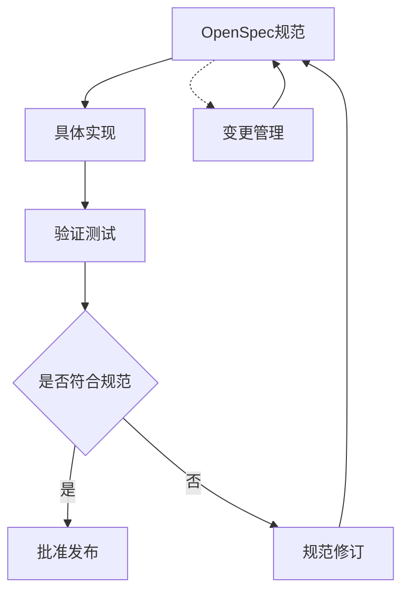
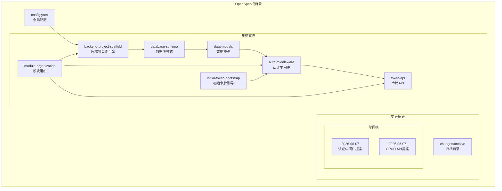
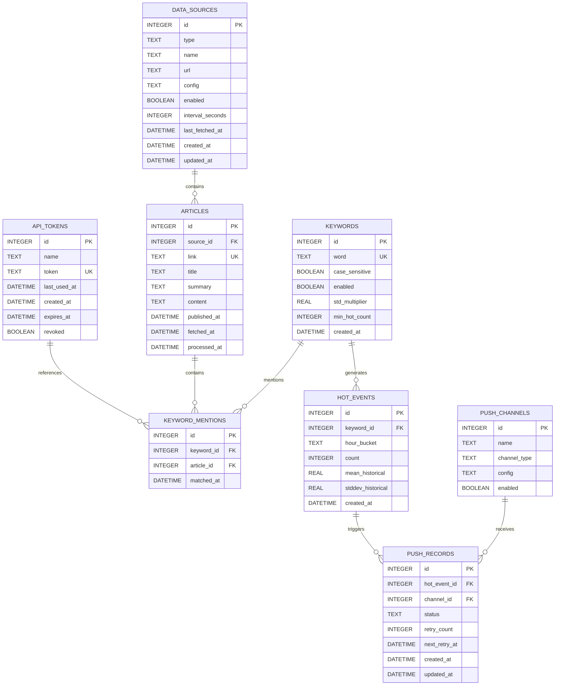
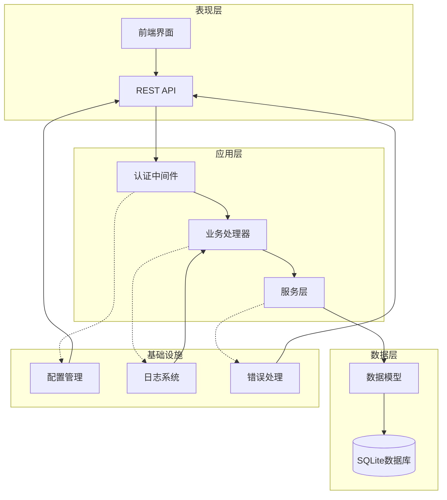
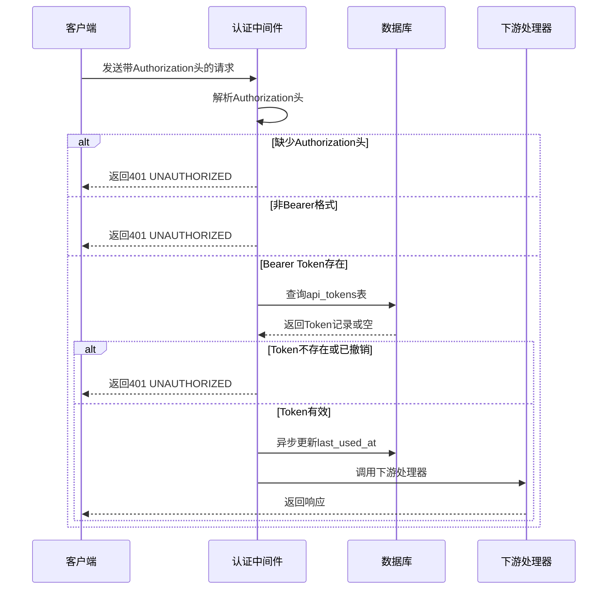
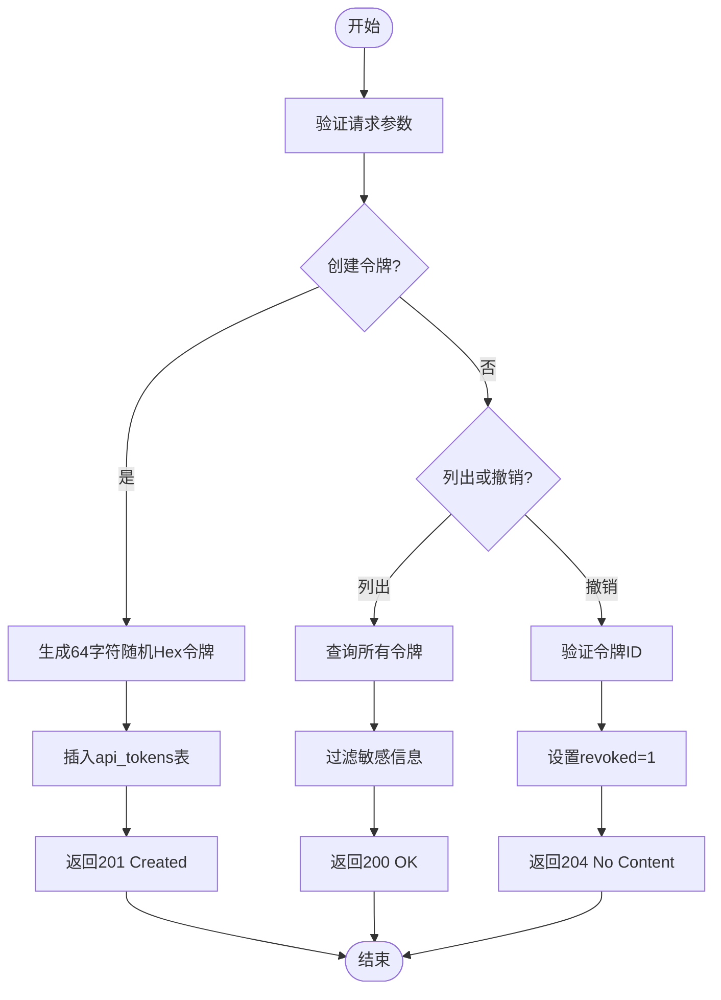
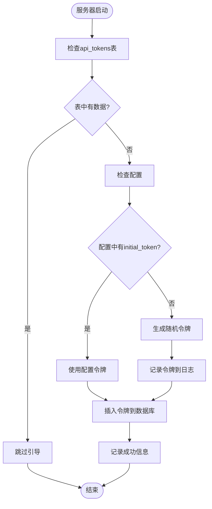
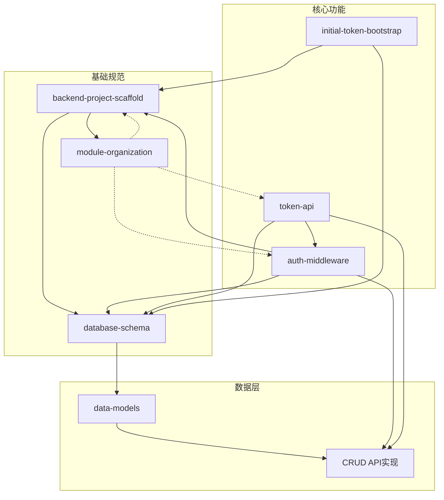
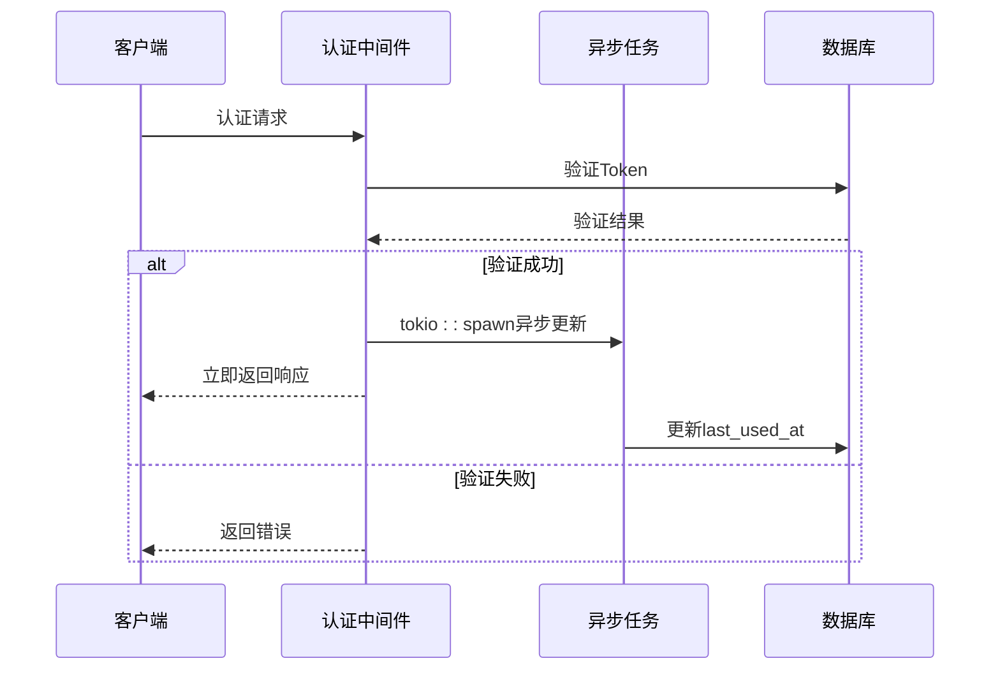

# OpenSpec规范概述

<cite>
**本文档引用的文件**
- [openspec/config.yaml](file://openspec/config.yaml)
- [openspec/specs/backend-project-scaffold/spec.md](file://openspec/specs/backend-project-scaffold/spec.md)
- [openspec/specs/database-schema/spec.md](file://openspec/specs/database-schema/spec.md)
- [openspec/specs/data-models/spec.md](file://openspec/specs/data-models/spec.md)
- [openspec/specs/auth-middleware/spec.md](file://openspec/specs/auth-middleware/spec.md)
- [openspec/specs/token-api/spec.md](file://openspec/specs/token-api/spec.md)
- [openspec/specs/module-organization/spec.md](file://openspec/specs/module-organization/spec.md)
- [openspec/specs/initial-token-bootstrap/spec.md](file://openspec/specs/initial-token-bootstrap/spec.md)
- [openspec/changes/archive/2026-06-07-auth-middleware-and-token-api/proposal.md](file://openspec/changes/archive/2026-06-07-auth-middleware-and-token-api/proposal.md)
- [openspec/changes/archive/2026-06-07-auth-middleware-and-token-api/design.md](file://openspec/changes/archive/2026-06-07-auth-middleware-and-token-api/design.md)
- [openspec/changes/archive/2026-06-07-implement-crud-apis/proposal.md](file://openspec/changes/archive/2026-06-07-implement-crud-apis/proposal.md)
</cite>

## 目录
1. [引言](#引言)
2. [项目结构](#项目结构)
3. [核心组件](#核心组件)
4. [架构概览](#架构概览)
5. [详细组件分析](#详细组件分析)
6. [依赖分析](#依赖分析)
7. [性能考虑](#性能考虑)
8. [故障排除指南](#故障排除指南)
9. [结论](#结论)
10. [附录](#附录)

## 引言

AI趋势监控系统采用OpenSpec规范驱动开发方法论，通过规范先行的方式确保系统设计的一致性和可维护性。OpenSpec规范不仅是开发指南，更是项目质量保证的重要工具。

### OpenSpec核心理念

OpenSpec规范驱动开发的核心在于"先规范后实现"的理念，通过明确的规范约束确保：
- **一致性**：所有实现遵循统一的设计标准
- **可验证性**：规范可作为测试和验收的标准
- **可追溯性**：变更历史清晰可查
- **协作效率**：团队成员基于同一套规范工作

### 规范与实现的对应关系

在AI趋势监控系统中，OpenSpec规范与实际实现形成严格的对应关系：

**图表来源**
- [openspec/specs/backend-project-scaffold/spec.md:1-151](file://openspec/specs/backend-project-scaffold/spec.md#L1-L151)
- [openspec/specs/database-schema/spec.md:1-173](file://openspec/specs/database-schema/spec.md#L1-L173)

## 项目结构

AI趋势监控系统的OpenSpec规范采用层次化组织结构，体现了模块化的设计理念：

**图表来源**
- [openspec/config.yaml:1-21](file://openspec/config.yaml#L1-L21)
- [openspec/specs/backend-project-scaffold/spec.md:1-151](file://openspec/specs/backend-project-scaffold/spec.md#L1-L151)

### 目录结构特点

1. **层次化组织**：按功能域划分不同规格文件
2. **版本化管理**：变更历史按时间归档
3. **模块化设计**：每个规格文件专注于特定功能领域
4. **可扩展性**：支持新功能模块的添加

**章节来源**
- [openspec/config.yaml:1-21](file://openspec/config.yaml#L1-L21)
- [openspec/specs/backend-project-scaffold/spec.md:1-151](file://openspec/specs/backend-project-scaffold/spec.md#L1-L151)

## 核心组件

### 规范配置系统

OpenSpec配置系统提供了灵活的项目上下文定义和规则定制能力：

| 配置项 | 类型 | 描述 | 示例 |
|--------|------|------|------|
| schema | string | 规范类型标识 | "spec-driven" |
| context | string | 项目上下文信息 | 技术栈、约定等 |
| rules | object | 针对特定工件的规则 | 针对proposal、tasks的自定义规则 |

### 数据库架构规范

系统采用SQLite作为主要存储引擎，设计了完整的8张核心表：

**图表来源**
- [openspec/specs/database-schema/spec.md:33-173](file://openspec/specs/database-schema/spec.md#L33-L173)

### 数据模型规范

系统采用Rust语言实现，所有数据模型严格遵循以下规范：

| 组件 | 规范要求 | 实现示例 |
|------|----------|----------|
| 模块结构 | 2018 edition风格，禁止mod.rs | `src/models.rs` + `src/models/` |
| 序列化 | 所有模型derive serde::Serialize | `#[derive(Serialize)]` |
| 数据库映射 | derive sqlx::FromRow | `#[derive(FromRow)]` |
| 请求DTO | 分离用户输入与数据库实体 | `Create*Request`、`Update*Request` |

**章节来源**
- [openspec/specs/data-models/spec.md:1-134](file://openspec/specs/data-models/spec.md#L1-L134)
- [openspec/specs/module-organization/spec.md:1-50](file://openspec/specs/module-organization/spec.md#L1-L50)

## 架构概览

AI趋势监控系统的OpenSpec架构体现了分层设计和职责分离的原则：

**图表来源**
- [openspec/specs/backend-project-scaffold/spec.md:1-151](file://openspec/specs/backend-project-scaffold/spec.md#L1-L151)
- [openspec/specs/auth-middleware/spec.md:1-88](file://openspec/specs/auth-middleware/spec.md#L1-L88)

### 核心设计原则

1. **分层架构**：清晰的职责分离和依赖方向
2. **模块化设计**：每个组件都有明确的边界和接口
3. **一致性原则**：所有组件遵循相同的规范和约定
4. **可扩展性**：支持新功能模块的平滑集成

## 详细组件分析

### 认证中间件组件

认证中间件是整个系统安全体系的核心组件，实现了完整的Bearer Token认证机制：

**图表来源**
- [openspec/specs/auth-middleware/spec.md:9-87](file://openspec/specs/auth-middleware/spec.md#L9-L87)

#### 认证流程规范

| 认证阶段 | 处理逻辑 | 错误处理 |
|----------|----------|----------|
| 头部解析 | 提取Authorization头并验证Bearer格式 | 缺失或格式错误返回401 |
| 数据库查询 | 查询api_tokens表验证Token有效性 | 不存在或已撤销返回401 |
| 过期检查 | 比较expires_at与当前时间 | 过期返回401 |
| 异步更新 | 使用tokio::spawn异步更新last_used_at | 不阻塞主响应流程 |
| 上下文注入 | 将ApiToken注入request extensions | 供下游处理器使用 |

**章节来源**
- [openspec/specs/auth-middleware/spec.md:1-88](file://openspec/specs/auth-middleware/spec.md#L1-L88)

### 令牌管理API组件

令牌管理API提供了完整的令牌生命周期管理功能：

**图表来源**
- [openspec/specs/token-api/spec.md:9-75](file://openspec/specs/token-api/spec.md#L9-L75)

#### API端点规范

| 端点 | 方法 | 功能 | 认证要求 | 响应码 |
|------|------|------|----------|--------|
| `/api/v1/tokens` | POST | 创建新令牌 | 是 | 201 |
| `/api/v1/tokens` | GET | 列出所有令牌 | 是 | 200 |
| `/api/v1/tokens/{id}` | DELETE | 撤销指定令牌 | 是 | 204/404 |

**章节来源**
- [openspec/specs/token-api/spec.md:1-76](file://openspec/specs/token-api/spec.md#L1-L76)

### 初始令牌引导组件

初始令牌引导确保系统在首次部署时具备基本的访问能力：

**图表来源**
- [openspec/specs/initial-token-bootstrap/spec.md:9-51](file://openspec/specs/initial-token-bootstrap/spec.md#L9-L51)

#### 引导策略规范

| 场景 | 配置状态 | 行为 | 输出 |
|------|----------|------|------|
| 首次启动且配置存在 | `initial_token`非空 | 使用配置令牌 | 数据库插入配置令牌 |
| 首次启动且配置缺失 | 无`initial_token` | 自动生成64字符Hex令牌 | 日志记录令牌，数据库插入 |
| 非首次启动 | 任意配置 | 跳过引导 | 无操作 |
| 配置为空字符串 | `initial_token=""` | 等同于配置缺失 | 自动生成令牌 |

**章节来源**
- [openspec/specs/initial-token-bootstrap/spec.md:1-52](file://openspec/specs/initial-token-bootstrap/spec.md#L1-L52)

## 依赖分析

OpenSpec规范之间的依赖关系体现了系统的整体设计思路：

**图表来源**
- [openspec/specs/backend-project-scaffold/spec.md:1-151](file://openspec/specs/backend-project-scaffold/spec.md#L1-L151)
- [openspec/specs/module-organization/spec.md:1-50](file://openspec/specs/module-organization/spec.md#L1-L50)

### 依赖关系特点

1. **层次化依赖**：基础规范优先，功能规范依赖基础规范
2. **循环依赖避免**：通过合理的依赖设计避免循环引用
3. **模块化隔离**：各功能模块相对独立，便于维护和测试
4. **向后兼容**：新增功能不影响现有规范的正确性

**章节来源**
- [openspec/specs/backend-project-scaffold/spec.md:1-151](file://openspec/specs/backend-project-scaffold/spec.md#L1-L151)
- [openspec/specs/module-organization/spec.md:1-50](file://openspec/specs/module-organization/spec.md#L1-L50)

## 性能考虑

OpenSpec规范在设计时充分考虑了性能优化需求：

### 异步处理机制

认证中间件采用异步更新策略，避免阻塞主请求处理流程：

**图表来源**
- [openspec/specs/auth-middleware/spec.md:51-59](file://openspec/specs/auth-middleware/spec.md#L51-L59)

### 数据库优化策略

1. **索引优化**：为常用查询字段建立索引
2. **连接池管理**：合理配置SQLite连接池参数
3. **批量操作**：支持批量数据处理以提高效率
4. **缓存策略**：对热点数据实施适当的缓存机制

## 故障排除指南

### 常见问题及解决方案

| 问题类型 | 症状 | 可能原因 | 解决方案 |
|----------|------|----------|----------|
| 认证失败 | 401 Unauthorized | Token无效或已过期 | 检查Token格式和有效期 |
| 数据库连接 | 连接超时 | 连接池配置不当 | 调整连接池大小和超时参数 |
| 模块编译 | 编译错误 | 模块组织不符合规范 | 遵循2018 edition风格 |
| 配置加载 | 配置解析失败 | TOML格式错误 | 检查配置文件语法 |

### 调试工具和方法

1. **日志分析**：利用tracing日志系统进行问题定位
2. **单元测试**：编写针对关键功能的测试用例
3. **集成测试**：模拟完整的请求-响应流程
4. **性能监控**：监控关键指标如响应时间和吞吐量

**章节来源**
- [openspec/specs/backend-project-scaffold/spec.md:55-78](file://openspec/specs/backend-project-scaffold/spec.md#L55-L78)

## 结论

OpenSpec规范驱动开发方法论为AI趋势监控系统提供了坚实的理论基础和实践指导。通过规范先行的设计方式，系统实现了：

1. **设计一致性**：所有组件遵循统一的规范和约定
2. **质量保证**：规范可作为测试和验收的标准依据
3. **团队协作**：基于同一套规范进行高效协作
4. **持续改进**：完善的变更管理和版本控制机制

### 最佳实践总结

1. **规范优先**：在实现前完成详细的规范设计
2. **渐进式开发**：按照功能模块逐步实现和验证
3. **持续测试**：将规范验证融入到开发流程中
4. **文档同步**：保持规范与实现的实时同步

## 附录

### OpenSpec配置文件详解

| 配置项 | 必填 | 默认值 | 说明 |
|--------|------|--------|------|
| schema | 是 | - | 规范类型标识，固定为"spec-driven" |
| context | 否 | 空字符串 | 项目上下文描述，用于AI助手理解项目背景 |
| rules | 否 | 空对象 | 针对特定工件类型的自定义规则 |

### 版本管理策略

1. **语义化版本**：采用语义化版本控制规范
2. **变更追踪**：所有变更都记录在变更历史中
3. **向后兼容**：重大变更需要明确的迁移指南
4. **冻结机制**：稳定版本采用冻结策略防止意外修改

### 社区协作机制

1. **提案流程**：重大变更需要提交提案并通过评审
2. **设计文档**：重要设计决策需要形成正式文档
3. **代码审查**：所有实现都需要经过同行评审
4. **知识分享**：定期组织技术分享和经验交流