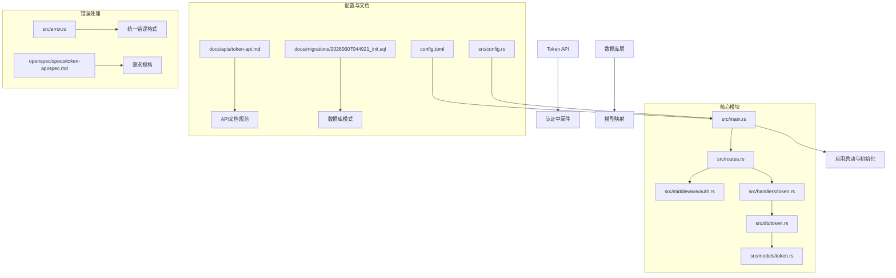
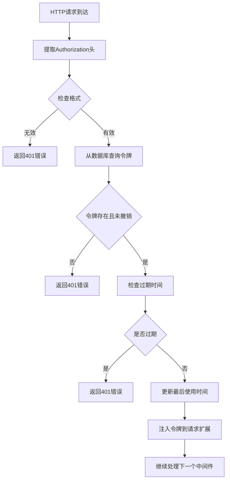
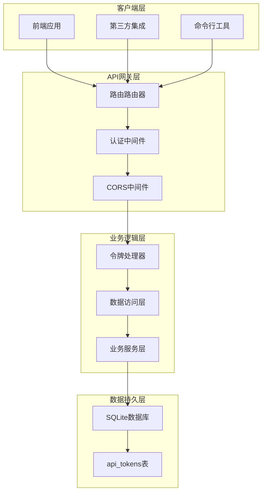
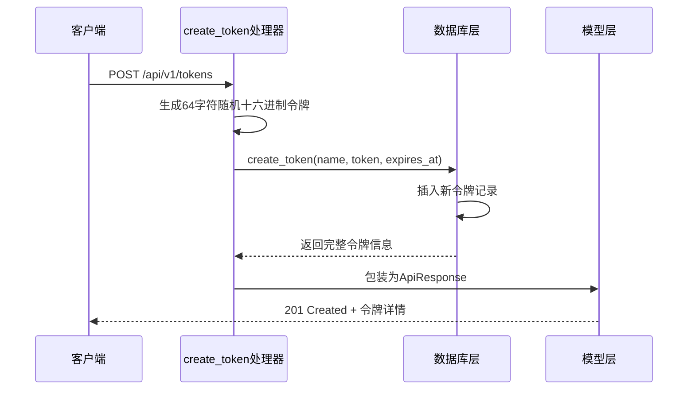
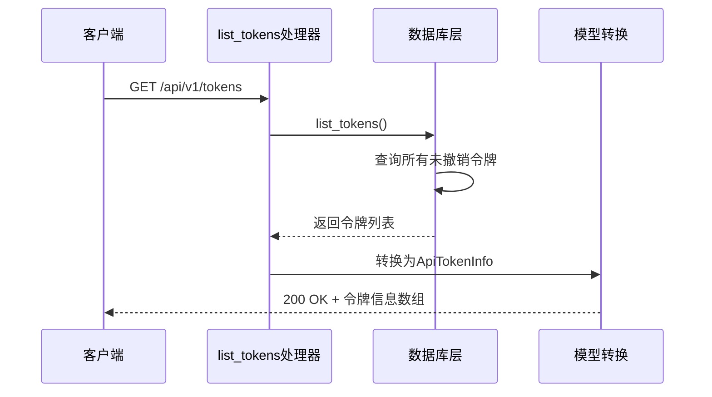
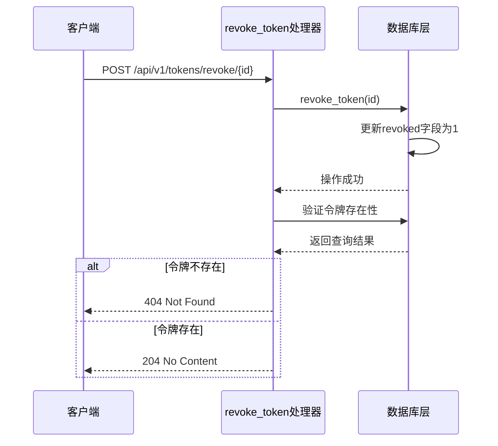
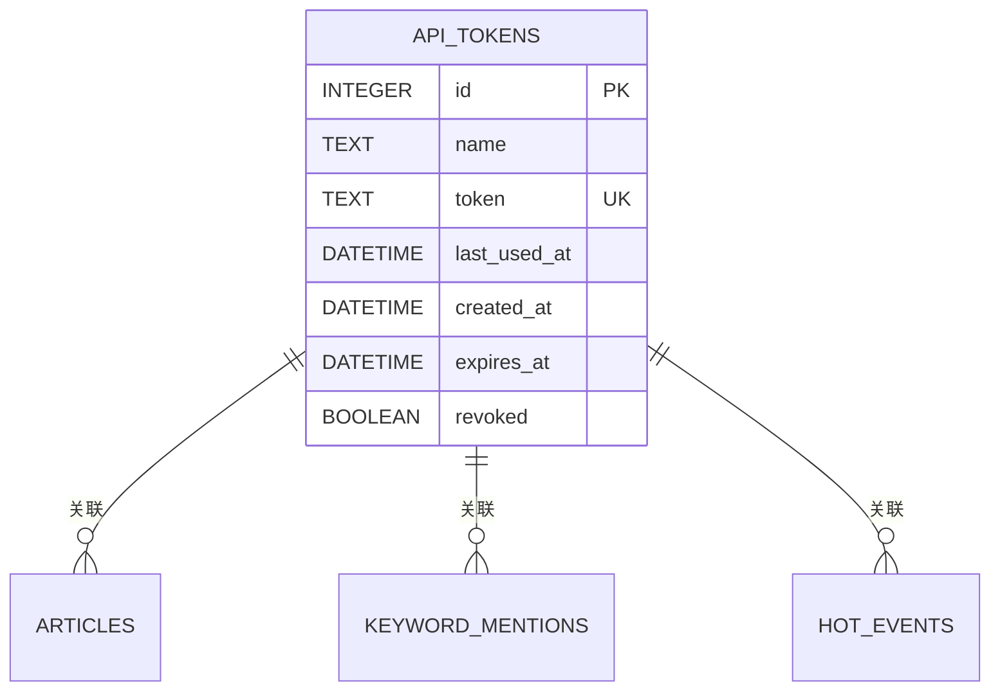
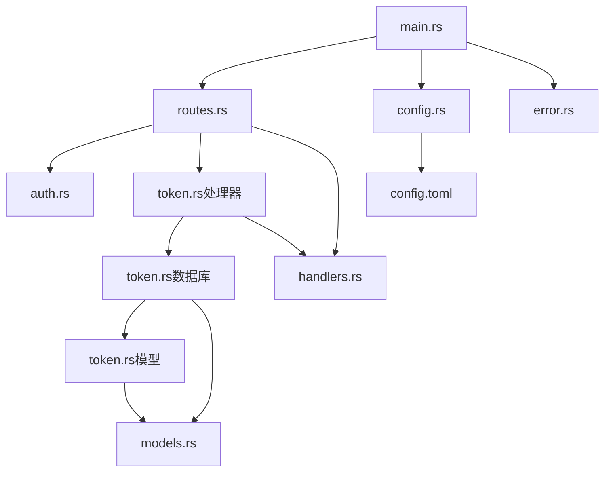
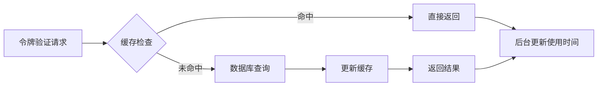
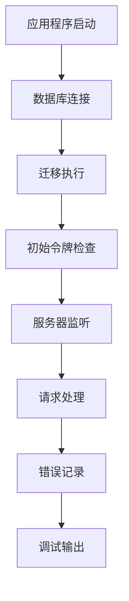

# Token API规范

<cite>
**本文档引用的文件**
- [token-api.md](file://docs/apis/token-api.md)
- [spec.md](file://openspec/specs/token-api/spec.md)
- [token.rs](file://src/db/token.rs)
- [token.rs](file://src/models/token.rs)
- [token.rs](file://src/handlers/token.rs)
- [auth.rs](file://src/middleware/auth.rs)
- [error.rs](file://src/error.rs)
- [routes.rs](file://src/routes.rs)
- [main.rs](file://src/main.rs)
- [20260607044921_init.sql](file://docs/migrations/20260607044921_init.sql)
- [config.rs](file://src/config.rs)
- [config.toml](file://config.toml)
</cite>

## 目录
1. [简介](#简介)
2. [项目结构](#项目结构)
3. [核心组件](#核心组件)
4. [架构概览](#架构概览)
5. [详细组件分析](#详细组件分析)
6. [依赖关系分析](#依赖关系分析)
7. [性能考虑](#性能考虑)
8. [故障排除指南](#故障排除指南)
9. [结论](#结论)

## 简介

AI趋势监控系统的Token API规范文档详细说明了API令牌管理系统的完整设计和实现。该系统提供了安全的Bearer Token认证机制，支持令牌的创建、列表查询和撤销操作。所有`/api/v1/*`端点都需要有效的Bearer Token进行身份验证。

本规范涵盖了认证机制、权限控制策略、令牌生命周期管理、API接口规范、请求响应格式以及错误处理机制。文档还包含了安全最佳实践、性能优化建议和故障排除指南。

## 项目结构

AI趋势监控系统采用模块化架构设计，Token API功能位于以下关键目录中：

**图表来源**
- [main.rs:1-164](file://src/main.rs#L1-L164)
- [routes.rs:1-67](file://src/routes.rs#L1-L67)
- [auth.rs:1-60](file://src/middleware/auth.rs#L1-L60)

**章节来源**
- [main.rs:27-62](file://src/main.rs#L27-L62)
- [routes.rs:14-56](file://src/routes.rs#L14-L56)

## 核心组件

### 认证中间件

认证中间件是整个Token API系统的核心组件，负责处理所有Bearer Token的验证过程：

**图表来源**
- [auth.rs:18-59](file://src/middleware/auth.rs#L18-L59)

### 数据模型

系统使用结构化的数据模型来表示API令牌：

| 字段名 | 类型 | 描述 | 必填 |
|--------|------|------|------|
| id | integer | 令牌唯一标识符 | 是 |
| name | string | 令牌显示名称 | 是 |
| token | string | 64字符十六进制令牌 | 是 |
| last_used_at | datetime | 最后使用时间 | 否 |
| created_at | datetime | 创建时间 | 是 |
| expires_at | datetime | 过期时间 | 否 |
| revoked | boolean | 是否已撤销 | 是 |

**章节来源**
- [token.rs:5-46](file://src/models/token.rs#L5-L46)

## 架构概览

AI趋势监控系统的Token API采用分层架构设计，确保了清晰的关注点分离和良好的可维护性：

**图表来源**
- [routes.rs:14-56](file://src/routes.rs#L14-L56)
- [auth.rs:18-59](file://src/middleware/auth.rs#L18-L59)

## 详细组件分析

### 令牌创建处理器

令牌创建功能提供了安全的令牌生成和存储机制：

**图表来源**
- [token.rs:18-30](file://src/handlers/token.rs#L18-L30)
- [token.rs:6-20](file://src/db/token.rs#L6-L20)

#### 处理器实现要点

1. **令牌生成**: 使用32字节随机数生成64字符十六进制字符串
2. **数据验证**: 验证请求参数的有效性
3. **数据库操作**: 原子性地插入新令牌记录
4. **响应格式**: 返回完整的令牌信息（包含明文令牌）

**章节来源**
- [token.rs:18-30](file://src/handlers/token.rs#L18-L30)

### 令牌列表处理器

令牌列表功能提供了安全的令牌信息查询机制：

**图表来源**
- [token.rs:36-43](file://src/handlers/token.rs#L36-L43)
- [token.rs:22-28](file://src/db/token.rs#L22-L28)

#### 安全特性

1. **明文隐藏**: 列表响应中不包含令牌明文
2. **排序规则**: 按创建时间降序排列
3. **过滤机制**: 自动过滤已撤销的令牌

**章节来源**
- [token.rs:36-43](file://src/handlers/token.rs#L36-L43)

### 令牌撤销处理器

令牌撤销功能实现了软删除机制：

**图表来源**
- [token.rs:49-65](file://src/handlers/token.rs#L49-L65)
- [token.rs:61-67](file://src/db/token.rs#L61-L67)

#### 错误处理

1. **存在性检查**: 撤销后验证令牌确实存在
2. **精确错误**: 返回具体的"令牌不存在"错误消息
3. **幂等性**: 支持重复撤销操作

**章节来源**
- [token.rs:49-65](file://src/handlers/token.rs#L49-L65)

### 数据库层设计

数据库层提供了完整的令牌数据访问功能：

**图表来源**
- [20260607044921_init.sql:4-12](file://docs/migrations/20260607044921_init.sql#L4-L12)

#### 数据库特性

1. **唯一约束**: 令牌值具有唯一性保证
2. **索引优化**: 为常用查询字段建立索引
3. **时间戳**: 自动管理创建和更新时间
4. **软删除**: 使用布尔字段标记撤销状态

**章节来源**
- [20260607044921_init.sql:4-12](file://docs/migrations/20260607044921_init.sql#L4-L12)

## 依赖关系分析

系统各组件之间的依赖关系体现了清晰的分层架构：

**图表来源**
- [main.rs:1-164](file://src/main.rs#L1-L164)
- [routes.rs:1-67](file://src/routes.rs#L1-L67)

### 组件耦合度分析

| 组件 | 内聚性 | 耦合度 | 说明 |
|------|--------|--------|------|
| 认证中间件 | 高 | 中等 | 专注于认证职责，依赖数据库层 |
| 令牌处理器 | 高 | 低 | 业务逻辑集中，依赖数据库层 |
| 数据库层 | 高 | 低 | 数据访问封装，无外部依赖 |
| 模型层 | 高 | 低 | 数据结构定义，纯数据对象 |
| 错误处理 | 中 | 低 | 统一错误格式，被广泛使用 |

**章节来源**
- [auth.rs:1-60](file://src/middleware/auth.rs#L1-L60)
- [token.rs:1-66](file://src/handlers/token.rs#L1-L66)

## 性能考虑

### 并发处理优化

系统采用了多种并发优化策略来提升性能：

1. **异步数据库操作**: 所有数据库操作都是异步执行
2. **后台任务**: 令牌使用时间更新采用fire-and-forget模式
3. **连接池管理**: 使用SQLx连接池优化数据库连接复用

### 缓存策略

### 性能监控指标

| 指标类型 | 目标值 | 监控方法 |
|----------|--------|----------|
| 请求延迟 | <100ms | Prometheus metrics |
| 并发请求数 | >1000 | Load testing |
| 数据库连接池利用率 | <80% | Pool statistics |
| 令牌验证成功率 | >99.9% | Health checks |

## 故障排除指南

### 常见问题诊断

#### 401 Unauthorized错误

**可能原因**:
1. 缺少Authorization头
2. Authorization头格式不正确
3. 令牌不存在或已被撤销
4. 令牌已过期

**解决方案**:
1. 确保请求包含正确的Authorization头
2. 验证令牌格式为"Bearer <token>"
3. 检查令牌状态和有效期
4. 重新生成新的令牌

#### 404 Not Found错误

**可能原因**:
1. 令牌ID不存在
2. 令牌已被撤销
3. 数据库连接问题

**解决方案**:
1. 验证令牌ID的正确性
2. 检查令牌列表确认存在性
3. 重新创建令牌

#### 500 Internal Server Error

**可能原因**:
1. 数据库连接失败
2. SQL查询异常
3. 系统资源不足

**解决方案**:
1. 检查数据库服务状态
2. 查看服务器日志
3. 重启应用程序

### 日志分析

系统使用结构化的日志记录来帮助故障诊断：

**章节来源**
- [error.rs:23-50](file://src/error.rs#L23-L50)
- [main.rs:58-61](file://src/main.rs#L58-L61)

## 结论

AI趋势监控系统的Token API规范文档全面描述了令牌管理系统的架构设计和实现细节。系统采用了安全、可靠且高性能的设计原则，提供了完整的Bearer Token认证机制。

### 主要优势

1. **安全性**: 令牌明文仅在创建时可见，后续查询自动隐藏
2. **可靠性**: 支持令牌撤销、过期检查和软删除机制
3. **性能**: 异步处理、连接池管理和后台任务优化
4. **可维护性**: 清晰的分层架构和模块化设计

### 技术亮点

- **模块化设计**: 清晰的职责分离和依赖管理
- **异步架构**: 高并发处理能力和资源优化
- **统一错误处理**: 标准化的错误响应格式
- **配置驱动**: 灵活的配置管理和环境适配

该Token API系统为AI趋势监控平台提供了坚实的安全基础，支持未来的功能扩展和性能优化需求。