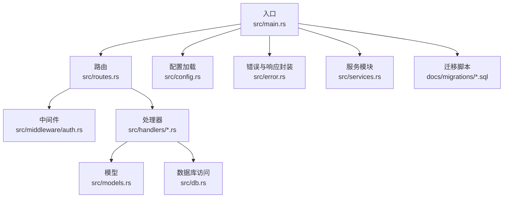
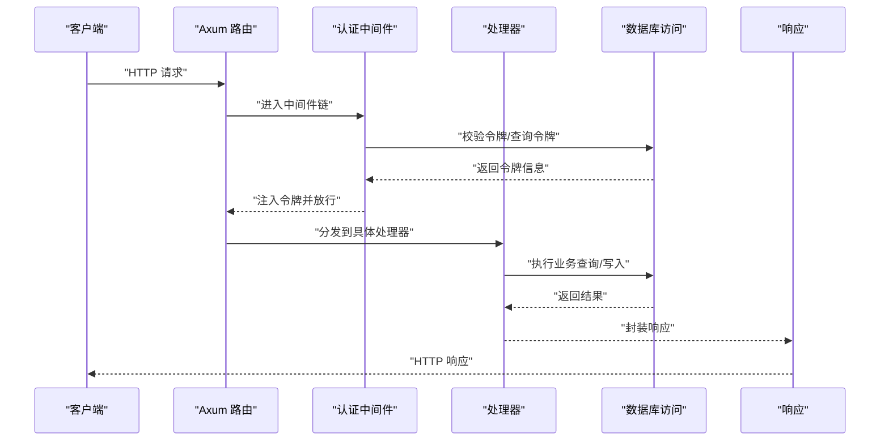
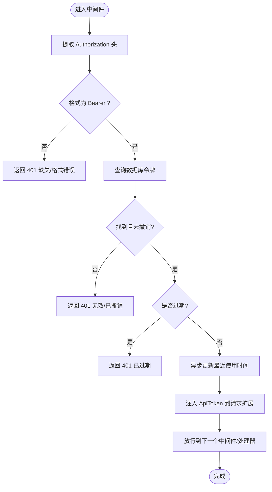
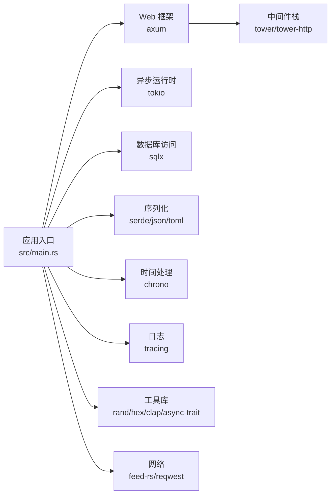

# 后端项目脚手架规范

<cite>
**本文档引用的文件**
- [Cargo.toml](file://Cargo.toml)
- [README.md](file://README.md)
- [config.toml](file://config.toml)
- [src/main.rs](file://src/main.rs)
- [src/config.rs](file://src/config.rs)
- [src/db.rs](file://src/db.rs)
- [src/routes.rs](file://src/routes.rs)
- [src/middleware.rs](file://src/middleware.rs)
- [src/middleware/auth.rs](file://src/middleware/auth.rs)
- [src/error.rs](file://src/error.rs)
- [src/handlers.rs](file://src/handlers.rs)
- [src/handlers/token.rs](file://src/handlers/token.rs)
- [src/handlers/source.rs](file://src/handlers/source.rs)
- [src/handlers/keyword.rs](file://src/handlers/keyword.rs)
- [src/handlers/channel.rs](file://src/handlers/channel.rs)
- [src/models.rs](file://src/models.rs)
- [src/services.rs](file://src/services.rs)
- [docs/migrations/20260607044921_init.sql](file://docs/migrations/20260607044921_init.sql)
</cite>

## 目录
1. [引言](#引言)
2. [项目结构](#项目结构)
3. [核心组件](#核心组件)
4. [架构总览](#架构总览)
5. [详细组件分析](#详细组件分析)
6. [依赖分析](#依赖分析)
7. [性能考虑](#性能考虑)
8. [故障排查指南](#故障排查指南)
9. [结论](#结论)
10. [附录](#附录)

## 引言
本规范文档面向“AI趋势监控系统”的后端项目脚手架，旨在提供一套可复用、可扩展的工程化标准，涵盖项目初始化、模块组织、代码结构、依赖管理、配置文件组织、模块间依赖与接口约定、错误处理与日志、以及基于规范快速搭建新功能模块的最佳实践。该脚手架采用 Rust + Axum + SQLx 的技术栈，以 SQLite 作为默认存储，支持多模块并行运行模式（API、解析器、过滤器、推送器），并通过中间件统一鉴权。

## 项目结构
项目采用按职责分层的模块化组织方式，遵循“入口 → 路由 → 中间件 → 处理器 → 模型/服务 → 数据库”的清晰层次。核心目录与文件如下：
- 入口与配置：src/main.rs、src/config.rs、config.toml
- 路由与状态：src/routes.rs、src/error.rs
- 中间件：src/middleware.rs、src/middleware/auth.rs
- 处理器：src/handlers.rs 及其子模块（token、source、keyword、channel）
- 模型与数据库：src/models.rs、src/db.rs 及各实体模块
- 服务模块：src/services.rs（parser、filter、pusher）
- 迁移：docs/migrations/20260607044921_init.sql
- 依赖与构建：Cargo.toml、Cargo.lock

图表来源
- [src/main.rs:63-95](file://src/main.rs#L63-L95)
- [src/routes.rs:14-50](file://src/routes.rs#L14-L50)
- [src/middleware/auth.rs:18-59](file://src/middleware/auth.rs#L18-L59)
- [src/handlers/token.rs:18-30](file://src/handlers/token.rs#L18-L30)
- [src/handlers/source.rs:27-33](file://src/handlers/source.rs#L27-L33)
- [src/handlers/keyword.rs:27-43](file://src/handlers/keyword.rs#L27-L43)
- [src/handlers/channel.rs:26-32](file://src/handlers/channel.rs#L26-L32)
- [src/db.rs:11-25](file://src/db.rs#L11-L25)
- [src/config.rs:52-58](file://src/config.rs#L52-L58)
- [src/error.rs:8-79](file://src/error.rs#L8-L79)
- [src/services.rs:1-4](file://src/services.rs#L1-L4)
- [docs/migrations/20260607044921_init.sql](file://docs/migrations/20260607044921_init.sql)

章节来源
- [src/main.rs:1-96](file://src/main.rs#L1-L96)
- [src/config.rs:1-59](file://src/config.rs#L1-L59)
- [src/db.rs:1-26](file://src/db.rs#L1-L26)
- [src/routes.rs:1-61](file://src/routes.rs#L1-L61)
- [src/middleware.rs:1-3](file://src/middleware.rs#L1-L3)
- [src/middleware/auth.rs:1-60](file://src/middleware/auth.rs#L1-L60)
- [src/error.rs:1-79](file://src/error.rs#L1-L79)
- [src/handlers.rs:1-7](file://src/handlers.rs#L1-L7)
- [src/models.rs:1-9](file://src/models.rs#L1-L9)
- [src/services.rs:1-4](file://src/services.rs#L1-L4)
- [config.toml:1-27](file://config.toml#L1-L27)
- [Cargo.toml:1-47](file://Cargo.toml#L1-L47)

## 核心组件
- 应用入口与生命周期
  - 命令行参数解析、配置加载、数据库连接池初始化、迁移执行、健康检查、服务器启动。
  - 初始化流程包含首次启动时的令牌校验与生成。
- 配置系统
  - 使用 TOML 文件定义 server、database、auth、parser、filter、pusher 等配置段。
  - 支持从命令行指定配置文件路径与运行模式。
- 路由与状态
  - 统一的 AppState 携带数据库连接池与配置对象，供所有处理器使用。
  - 提供 /health 健康检查与 /api/v1 前缀下的资源 API。
- 中间件
  - Bearer Token 认证中间件，负责提取令牌、校验有效性、过期检查、更新最近使用时间，并注入到请求扩展中。
- 错误处理
  - 统一的 AppError 枚举，映射为标准 HTTP 状态码与 JSON 错误体；数据库错误自动转换。
  - ApiResponse 封装成功响应（200/201/204）。
- 处理器层
  - 提供 token、source、keyword、channel 四类资源的 CRUD 与触发操作。
  - 所有处理器通过 State 获取 AppState，进而访问数据库与配置。
- 数据库与模型
  - db 模块集中管理连接池与 PRAGMA 设置；各实体模块提供数据访问方法。
  - models 模块声明实体类型，handlers 与 db 层围绕这些类型进行序列化/反序列化与查询。
- 服务模块
  - parser、filter、pusher 三类后台服务模块预留，用于后续扩展（如 RSS 解析、热点过滤、事件推送）。

章节来源
- [src/main.rs:16-61](file://src/main.rs#L16-L61)
- [src/config.rs:4-58](file://src/config.rs#L4-L58)
- [src/routes.rs:14-60](file://src/routes.rs#L14-L60)
- [src/middleware/auth.rs:18-59](file://src/middleware/auth.rs#L18-L59)
- [src/error.rs:8-79](file://src/error.rs#L8-L79)
- [src/handlers/token.rs:18-65](file://src/handlers/token.rs#L18-L65)
- [src/handlers/source.rs:15-90](file://src/handlers/source.rs#L15-L90)
- [src/handlers/keyword.rs:15-81](file://src/handlers/keyword.rs#L15-L81)
- [src/handlers/channel.rs:15-70](file://src/handlers/channel.rs#L15-L70)
- [src/db.rs:11-25](file://src/db.rs#L11-L25)

## 架构总览
下图展示了从请求进入应用到数据库交互的整体流程，包括认证中间件、路由分发、处理器调用与数据库访问。

图表来源
- [src/routes.rs:14-44](file://src/routes.rs#L14-L44)
- [src/middleware/auth.rs:18-59](file://src/middleware/auth.rs#L18-L59)
- [src/handlers/token.rs:18-30](file://src/handlers/token.rs#L18-L30)
- [src/db.rs:11-25](file://src/db.rs#L11-L25)

## 详细组件分析

### 配置系统
- 结构与字段
  - server：host、port
  - database：path
  - auth：initial_token（可选）
  - parser：max_concurrent_fetches、default_user_agent、default_timeout_seconds
  - filter：batch_size、interval_seconds、history_hours、min_history_hours
  - pusher：interval_seconds、max_retries、retry_base_seconds
- 加载机制
  - 通过命令行参数指定配置文件路径，默认 config.toml。
  - 使用 toml 解析为强类型结构体，支持可选字段与默认值策略。

章节来源
- [src/config.rs:4-58](file://src/config.rs#L4-L58)
- [config.toml:1-27](file://config.toml#L1-L27)
- [src/main.rs:67-68](file://src/main.rs#L67-L68)

### 路由与状态
- 路由组织
  - /health 健康检查
  - /api/v1 下的资源路由：tokens、sources、keywords、channels
  - 统一挂载 CORS 中间件
- 状态传递
  - AppState 包含 SqlitePool 与 AppConfig，通过 with_state 注入到路由链。
- 中间件
  - 认证中间件在 /api/v1 上启用，确保所有受保护路由均需有效令牌。

章节来源
- [src/routes.rs:14-50](file://src/routes.rs#L14-L50)
- [src/routes.rs:56-60](file://src/routes.rs#L56-L60)
- [src/middleware.rs:1-3](file://src/middleware.rs#L1-L3)

### 认证中间件
- 功能要点
  - 从 Authorization 头提取 Bearer 令牌
  - 查询数据库验证令牌存在且未撤销
  - 检查过期时间
  - 异步更新最近使用时间（fire-and-forget）
  - 将 ApiToken 注入请求扩展，供下游处理器使用
- 错误处理
  - 缺失或格式不正确头、无效/已撤销、过期均返回 401
  - 其他数据库异常统一转换为 500

图表来源
- [src/middleware/auth.rs:18-59](file://src/middleware/auth.rs#L18-L59)

章节来源
- [src/middleware/auth.rs:18-59](file://src/middleware/auth.rs#L18-L59)

### 错误处理与响应封装
- 错误类型
  - NotFound、BadRequest、Unauthorized、Conflict、Internal、Database
- 响应封装
  - 成功：200/201/204，统一包装为 { data: ... }
  - 失败：根据错误类型映射为标准 HTTP 状态码与 { error.code, error.message }

章节来源
- [src/error.rs:8-79](file://src/error.rs#L8-L79)

### 处理器层（示例：Token）
- 创建令牌
  - 生成 64 字符随机十六进制字符串，插入数据库并返回完整令牌（仅创建时可见明文）
- 列表令牌
  - 返回 ApiTokenInfo 列表（隐藏明文）
- 撤销令牌
  - 软删除（标记撤销），不存在时返回 404

章节来源
- [src/handlers/token.rs:18-65](file://src/handlers/token.rs#L18-L65)

### 处理器层（示例：Source）
- 列表、创建、更新、删除、手动触发抓取
- 更新与删除前先校验资源是否存在，不存在返回 404
- 触发抓取会重置 last_fetched_at，促使解析器在下次周期处理

章节来源
- [src/handlers/source.rs:15-90](file://src/handlers/source.rs#L15-L90)

### 处理器层（示例：Keyword）
- 关键词唯一约束冲突时返回 409
- 其余与 Source 类似，提供 CRUD 与存在性校验

章节来源
- [src/handlers/keyword.rs:27-43](file://src/handlers/keyword.rs#L27-L43)
- [src/handlers/keyword.rs:49-81](file://src/handlers/keyword.rs#L49-L81)

### 处理器层（示例：Channel）
- 推送通道的 CRUD，支持 JSON 配置字段

章节来源
- [src/handlers/channel.rs:26-32](file://src/handlers/channel.rs#L26-L32)
- [src/handlers/channel.rs:38-70](file://src/handlers/channel.rs#L38-L70)

### 数据库与模型
- 连接池初始化
  - WAL 模式、外键强制开启
  - 最大连接数限制
- 实体模块
  - article、channel、hot_event、keyword、push_record、source、token
  - 与 models.rs 对应，提供查询/写入方法

章节来源
- [src/db.rs:11-25](file://src/db.rs#L11-L25)
- [src/models.rs:1-9](file://src/models.rs#L1-L9)

### 服务模块（预留）
- parser：RSS 解析、并发抓取控制
- filter：热点事件过滤、批处理与历史窗口
- pusher：事件推送、重试与退避

章节来源
- [src/services.rs:1-4](file://src/services.rs#L1-L4)

## 依赖分析
- 框架与运行时
  - axum、axum-extra、tower、tower-http：Web 框架与中间件
  - tokio：异步运行时
- 数据库与序列化
  - sqlx（SQLite、迁移、chrono）：ORM/查询与迁移
  - serde、serde_json、toml：序列化与配置解析
- 时间与日志
  - chrono：时间处理
  - tracing/tracing-subscriber：结构化日志与环境过滤
- 工具与网络
  - feed-rs、reqwest：RSS 解析与 HTTP 推送
  - aho-corasick：高效字符串匹配
  - rand/hex：随机令牌生成
  - clap：命令行参数解析
  - async-trait：异步 trait 抽象

图表来源
- [Cargo.toml:6-47](file://Cargo.toml#L6-L47)
- [src/main.rs:9-12](file://src/main.rs#L9-L12)

章节来源
- [Cargo.toml:1-47](file://Cargo.toml#L1-L47)
- [src/main.rs:9-12](file://src/main.rs#L9-L12)

## 性能考虑
- 数据库连接池
  - 连接池最大连接数设置为 5，建议根据并发与 I/O 特性调整
  - WAL 模式提升并发读写性能
- 并发与异步
  - 认证中间件更新最近使用时间为 fire-and-forget，避免阻塞主请求链路
- 日志与追踪
  - 使用 env-filter 控制日志级别，生产环境建议降低到 warn 或更高
- 网络与解析
  - 解析器并发抓取数量由配置项控制，避免对上游源造成压力
  - 默认超时与用户代理可配置，减少长时间阻塞

章节来源
- [src/db.rs:14-16](file://src/db.rs#L14-L16)
- [src/middleware/auth.rs:51-53](file://src/middleware/auth.rs#L51-L53)
- [src/config.rs:30-35](file://src/config.rs#L30-L35)
- [src/config.rs:46-50](file://src/config.rs#L46-L50)

## 故障排查指南
- 无法启动或连接数据库
  - 检查 database.path 是否存在父目录，入口逻辑会在启动前创建
  - 确认 SQLite 文件权限与磁盘空间
- 401 未授权
  - 确认请求头 Authorization: Bearer <token> 是否正确
  - 检查令牌是否撤销或过期
  - 确保中间件已挂载到 /api/v1
- 404 资源不存在
  - 多见于更新/删除/触发操作前的资源存在性校验失败
- 409 冲突
  - 关键词唯一约束冲突，检查重复关键词
- 数据库错误
  - AppError::Database 自动映射为 500，查看日志定位具体 SQL 错误

章节来源
- [src/main.rs:70-74](file://src/main.rs#L70-L74)
- [src/middleware/auth.rs:23-46](file://src/middleware/auth.rs#L23-L46)
- [src/handlers/keyword.rs:33-40](file://src/handlers/keyword.rs#L33-L40)
- [src/error.rs:52-59](file://src/error.rs#L52-L59)

## 结论
本脚手架规范提供了从入口到处理器、从配置到数据库的完整工程化标准，具备良好的可扩展性与可维护性。通过统一的错误与响应封装、中间件鉴权、状态传递与模块化组织，开发者可以快速迭代新增功能模块，并在保持一致性的前提下扩展解析器、过滤器与推送器等后台能力。

## 附录

### 项目初始化流程
- 准备工作
  - 安装 Rust 工具链与 Cargo
  - 准备 SQLite 数据库文件路径（入口会自动创建父目录）
- 启动步骤
  - 加载配置文件（默认 config.toml）
  - 初始化数据库连接池并执行迁移
  - 首次启动时确保至少存在一个有效令牌
  - 构建路由并启动服务器监听

章节来源
- [src/main.rs:63-95](file://src/main.rs#L63-L95)
- [src/config.rs:52-58](file://src/config.rs#L52-L58)
- [src/db.rs:11-25](file://src/db.rs#L11-L25)

### 开发环境配置
- 配置文件组织
  - config.toml 作为默认配置文件，可通过命令行 --config 指定
  - 各配置段独立管理，便于扩展与测试
- 日志与调试
  - 使用 tracing-subscriber 的 env-filter，通过环境变量控制日志级别
- 迁移与模型
  - 迁移脚本位于 docs/migrations，随应用启动自动执行
  - 模型与数据库访问方法分别位于 src/models.rs 与 src/db.rs

章节来源
- [config.toml:1-27](file://config.toml#L1-L27)
- [src/main.rs:65](file://src/main.rs#L65)
- [docs/migrations/20260607044921_init.sql](file://docs/migrations/20260607044921_init.sql)

### 代码风格与最佳实践
- 模块组织
  - 每个领域资源（token、source、keyword、channel）对应独立模块，职责单一
  - 处理器仅负责请求/响应与状态传递，业务逻辑下沉至服务/数据库模块
- 错误处理
  - 明确区分业务错误与系统错误，使用 AppError 统一映射
  - 对数据库特定错误（如唯一约束）进行语义化处理
- 中间件
  - 鉴权中间件集中处理，避免在多个处理器重复校验
- 配置
  - 所有可调参数集中于 config.toml，便于运维与测试切换
- 并发与性能
  - 使用 fire-and-forget 更新令牌最近使用时间，避免阻塞主链路
  - 合理设置解析器并发度与超时，防止资源争用

章节来源
- [src/error.rs:8-79](file://src/error.rs#L8-L79)
- [src/middleware/auth.rs:51-53](file://src/middleware/auth.rs#L51-L53)
- [src/config.rs:30-35](file://src/config.rs#L30-L35)

### 基于规范快速搭建新功能模块
- 新增资源步骤
  - 在 src/models.rs 中添加实体类型
  - 在 src/db.rs 中新增对应的数据访问模块与方法
  - 在 src/handlers.rs 中新增处理器模块并实现 CRUD 方法
  - 在 src/routes.rs 中注册路由并挂载到 /api/v1
  - 如需鉴权，确保中间件已挂载
- 配置扩展
  - 在 config.toml 中新增配置段并在 src/config.rs 中声明结构体
- 数据迁移
  - 在 docs/migrations 新增 SQL 脚本并确保启动时自动执行
- 服务模块扩展
  - 在 src/services.rs 中新增模块（parser、filter、pusher），按需实现后台任务

章节来源
- [src/models.rs:1-9](file://src/models.rs#L1-L9)
- [src/db.rs:1-7](file://src/db.rs#L1-L7)
- [src/handlers.rs:1-7](file://src/handlers.rs#L1-L7)
- [src/routes.rs:14-44](file://src/routes.rs#L14-L44)
- [src/config.rs:4-58](file://src/config.rs#L4-L58)
- [docs/migrations/20260607044921_init.sql](file://docs/migrations/20260607044921_init.sql)