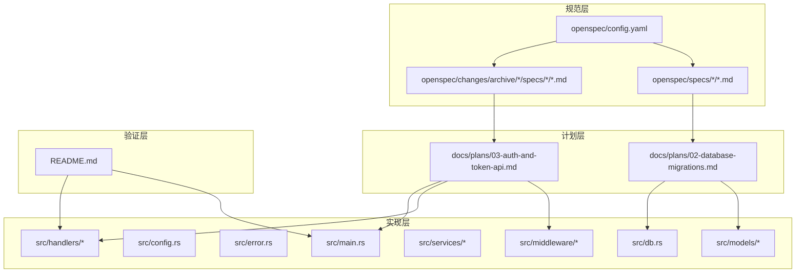
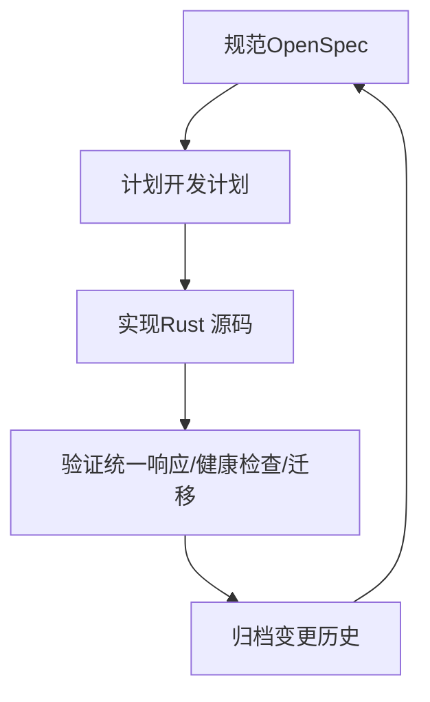
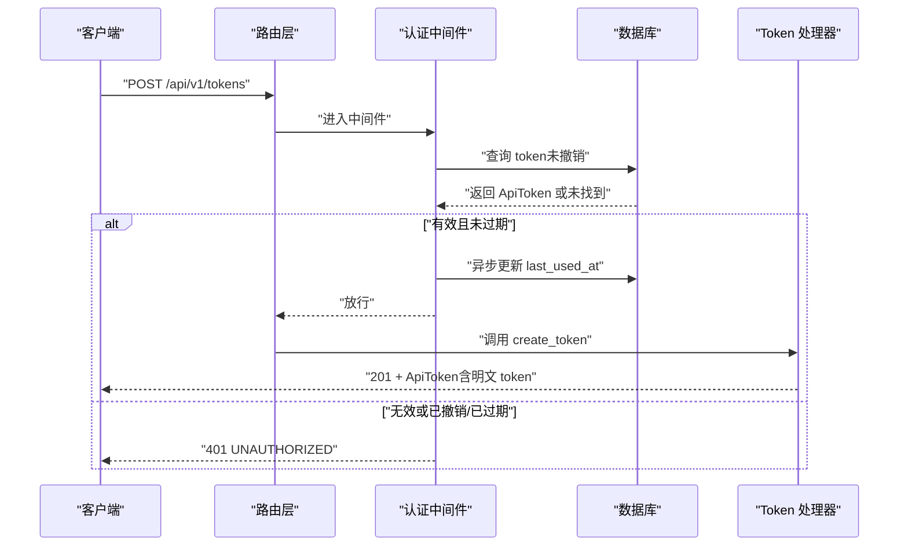
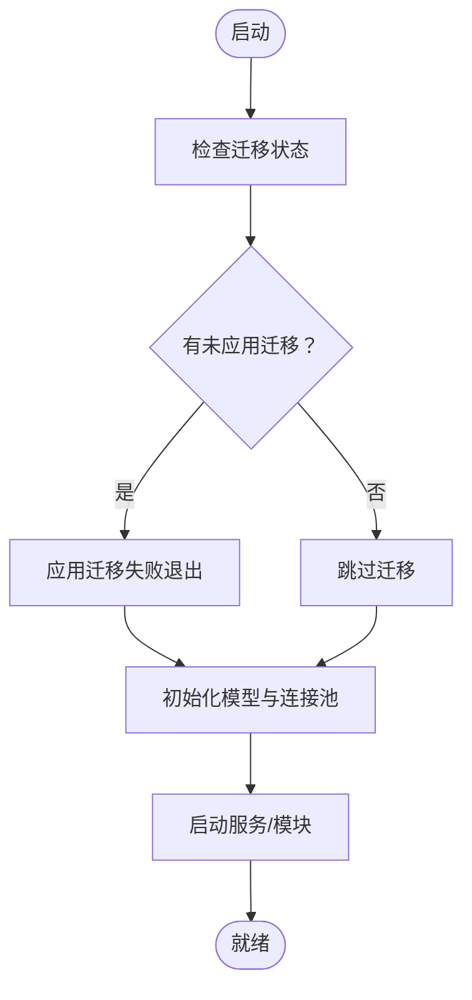
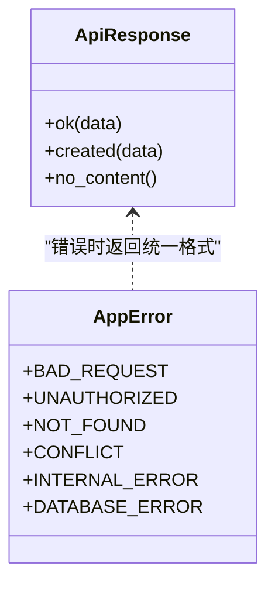
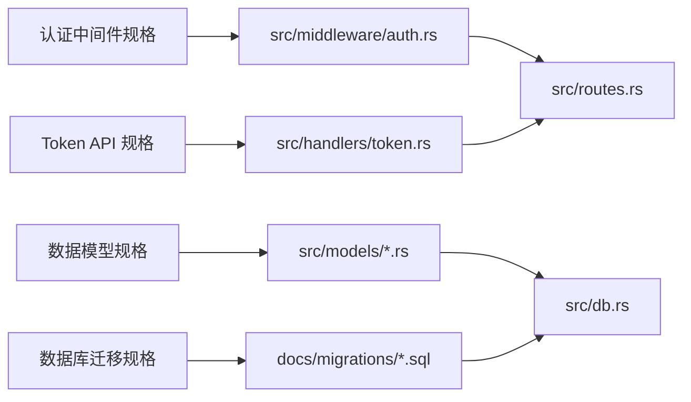

# 开发变更管理

<cite>
**本文引用的文件**
- [README.md](file://README.md)
- [openspec/config.yaml](file://openspec/config.yaml)
- [openspec/specs/backend-project-scaffold/spec.md](file://openspec/specs/backend-project-scaffold/spec.md)
- [openspec/specs/data-models/spec.md](file://openspec/specs/data-models/spec.md)
- [openspec/specs/token-api/spec.md](file://openspec/specs/token-api/spec.md)
- [openspec/changes/archive/2026-06-07-auth-middleware-and-token-api/specs/auth-middleware/spec.md](file://openspec/changes/archive/2026-06-07-auth-middleware-and-token-api/specs/auth-middleware/spec.md)
- [openspec/changes/archive/2026-06-07-auth-middleware-and-token-api/specs/initial-token-bootstrap/spec.md](file://openspec/changes/archive/2026-06-07-auth-middleware-and-token-api/specs/initial-token-bootstrap/spec.md)
- [openspec/changes/archive/2026-06-07-backend-project-setup/specs/backend-project-scaffold/spec.md](file://openspec/changes/archive/2026-06-07-backend-project-setup/specs/backend-project-scaffold/spec.md)
- [openspec/changes/archive/2026-06-07-db-migrations-and-models/specs/data-models/spec.md](file://openspec/changes/archive/2026-06-07-db-migrations-and-models/specs/data-models/spec.md)
- [openspec/changes/archive/2026-06-07-db-migrations-and-models/specs/database-schema/spec.md](file://openspec/changes/archive/2026-06-07-db-migrations-and-models/specs/database-schema/spec.md)
- [docs/plans/02-database-migrations.md](file://docs/plans/02-database-migrations.md)
- [docs/plans/03-auth-and-token-api.md](file://docs/plans/03-auth-and-token-api.md)
</cite>

## 目录
1. [引言](#引言)
2. [项目结构](#项目结构)
3. [核心组件](#核心组件)
4. [架构总览](#架构总览)
5. [详细组件分析](#详细组件分析)
6. [依赖关系分析](#依赖关系分析)
7. [性能考量](#性能考量)
8. [故障排查指南](#故障排查指南)
9. [结论](#结论)
10. [附录](#附录)

## 引言
本文件面向“AI趋势监控系统”（TrendAITool）的开发团队，围绕 OpenSpec 变更管理进行系统化梳理，覆盖变更跟踪、评审、实施流程；变更历史记录与版本演进策略；向后兼容性保障机制；任务分配、进度跟踪与质量保证；变更影响评估、回滚策略与测试验证；团队协作规范、沟通机制与决策流程；以及如何通过规范化的变更管理确保系统稳定性与可维护性。

## 项目结构
项目采用“规范驱动（spec-driven）”工作流，以 OpenSpec 规范作为设计与实施依据，并配套开发计划文档与数据库迁移脚本，形成“规范—计划—实现—验证”的闭环。

- 规范层：openspec/specs 与 openspec/changes/archive 下的各变更规格文档，明确需求、场景与验收条件。
- 计划层：docs/plans 下的阶段性实施计划，给出可落地的步骤、文件清单与验证节点。
- 实现层：src 下的 Rust 源码，包括路由、中间件、处理器、模型与服务模块。
- 验证层：README 与计划文档中的验证步骤，确保实现符合规范。

图表来源
- [openspec/config.yaml:1-21](file://openspec/config.yaml#L1-L21)
- [openspec/specs/backend-project-scaffold/spec.md:1-151](file://openspec/specs/backend-project-scaffold/spec.md#L1-L151)
- [openspec/specs/data-models/spec.md:1-134](file://openspec/specs/data-models/spec.md#L1-L134)
- [openspec/specs/token-api/spec.md:1-76](file://openspec/specs/token-api/spec.md#L1-L76)
- [openspec/changes/archive/2026-06-07-auth-middleware-and-token-api/specs/auth-middleware/spec.md:1-82](file://openspec/changes/archive/2026-06-07-auth-middleware-and-token-api/specs/auth-middleware/spec.md#L1-L82)
- [openspec/changes/archive/2026-06-07-auth-middleware-and-token-api/specs/initial-token-bootstrap/spec.md:1-46](file://openspec/changes/archive/2026-06-07-auth-middleware-and-token-api/specs/initial-token-bootstrap/spec.md#L1-L46)
- [openspec/changes/archive/2026-06-07-backend-project-setup/specs/backend-project-scaffold/spec.md:1-124](file://openspec/changes/archive/2026-06-07-backend-project-setup/specs/backend-project-scaffold/spec.md#L1-L124)
- [openspec/changes/archive/2026-06-07-db-migrations-and-models/specs/data-models/spec.md:1-128](file://openspec/changes/archive/2026-06-07-db-migrations-and-models/specs/data-models/spec.md#L1-L128)
- [openspec/changes/archive/2026-06-07-db-migrations-and-models/specs/database-schema/spec.md:1-167](file://openspec/changes/archive/2026-06-07-db-migrations-and-models/specs/database-schema/spec.md#L1-L167)
- [docs/plans/02-database-migrations.md:1-421](file://docs/plans/02-database-migrations.md#L1-L421)
- [docs/plans/03-auth-and-token-api.md:1-405](file://docs/plans/03-auth-and-token-api.md#L1-L405)
- [README.md:1-293](file://README.md#L1-L293)

章节来源
- [README.md:216-257](file://README.md#L216-L257)
- [openspec/config.yaml:1-21](file://openspec/config.yaml#L1-L21)

## 核心组件
- 规范引擎：OpenSpec 规格文档（主规格与归档变更）定义需求、场景与验收，作为变更评审与验收的唯一事实来源。
- 计划引擎：开发计划文档（如数据库迁移与认证 API）将规格转化为可执行步骤、文件清单与验证节点。
- 实现引擎：Rust 源码模块（路由、中间件、处理器、模型、服务）承载功能实现。
- 验证引擎：统一错误/成功响应、健康检查、迁移自动运行与初始 Token 引导等机制，确保实现符合规范。

章节来源
- [openspec/specs/backend-project-scaffold/spec.md:1-151](file://openspec/specs/backend-project-scaffold/spec.md#L1-L151)
- [openspec/specs/data-models/spec.md:1-134](file://openspec/specs/data-models/spec.md#L1-L134)
- [openspec/specs/token-api/spec.md:1-76](file://openspec/specs/token-api/spec.md#L1-L76)
- [docs/plans/02-database-migrations.md:1-421](file://docs/plans/02-database-migrations.md#L1-L421)
- [docs/plans/03-auth-and-token-api.md:1-405](file://docs/plans/03-auth-and-token-api.md#L1-L405)

## 架构总览
系统采用“管道模式”，三大后台模块独立运行；同时通过 OpenSpec 规范驱动的变更管理，确保每次变更在“需求—设计—实现—验证”四个维度保持一致。

图表来源
- [README.md:5-23](file://README.md#L5-L23)
- [openspec/specs/backend-project-scaffold/spec.md:1-151](file://openspec/specs/backend-project-scaffold/spec.md#L1-L151)
- [docs/plans/02-database-migrations.md:1-421](file://docs/plans/02-database-migrations.md#L1-L421)
- [docs/plans/03-auth-and-token-api.md:1-405](file://docs/plans/03-auth-and-token-api.md#L1-L405)

## 详细组件分析

### 组件A：认证中间件与 Token API（变更跟踪与评审）
- 变更来源：归档变更“认证中间件与 Token API”下的 auth-middleware 与 initial-token-bootstrap 规格。
- 评审要点：
  - Bearer Token 提取与校验流程、过期检查、最后使用时间更新、请求扩展注入。
  - 初始 Token 自动引导策略（配置优先、空表时随机生成并日志提示）。
- 实施要点：
  - 中间件在路由层应用，仅保护 /api/v1/*，/health 不受保护。
  - Token API 提供创建、列表（隐藏明文）、吊销三类端点。
- 验证要点：
  - 无 Token 访问 /api/v1/* 应返回 401。
  - 列表接口不返回明文 token。
  - 吊销后再次使用该 Token 应返回 401。

图表来源
- [openspec/changes/archive/2026-06-07-auth-middleware-and-token-api/specs/auth-middleware/spec.md:1-82](file://openspec/changes/archive/2026-06-07-auth-middleware-and-token-api/specs/auth-middleware/spec.md#L1-L82)
- [openspec/specs/token-api/spec.md:1-76](file://openspec/specs/token-api/spec.md#L1-L76)
- [docs/plans/03-auth-and-token-api.md:17-200](file://docs/plans/03-auth-and-token-api.md#L17-L200)

章节来源
- [openspec/changes/archive/2026-06-07-auth-middleware-and-token-api/specs/auth-middleware/spec.md:1-82](file://openspec/changes/archive/2026-06-07-auth-middleware-and-token-api/specs/auth-middleware/spec.md#L1-L82)
- [openspec/changes/archive/2026-06-07-auth-middleware-and-token-api/specs/initial-token-bootstrap/spec.md:1-46](file://openspec/changes/archive/2026-06-07-auth-middleware-and-token-api/specs/initial-token-bootstrap/spec.md#L1-L46)
- [openspec/specs/token-api/spec.md:1-76](file://openspec/specs/token-api/spec.md#L1-L76)
- [docs/plans/03-auth-and-token-api.md:17-200](file://docs/plans/03-auth-and-token-api.md#L17-L200)

### 组件B：数据库迁移与数据模型（版本演进与兼容）
- 变更来源：归档变更“数据库迁移与模型”下的 database-schema 与 data-models 规格。
- 版本演进策略：
  - 迁移自动运行：启动时通过 sqlx::migrate!() 应用，失败即退出，确保一致性。
  - 表结构与索引：明确列名、类型、默认值、约束与索引，避免后续破坏性变更。
- 向后兼容性：
  - 新增列/索引时保留默认值，避免破坏现有数据。
  - 删除/重命名列需通过新增字段+迁移转换+下个版本清理的方式平滑过渡。
- 验证策略：
  - cargo check 校验模型与迁移字段匹配。
  - 启动日志与 sqlite3 命令验证表存在与索引生效。

图表来源
- [openspec/changes/archive/2026-06-07-db-migrations-and-models/specs/database-schema/spec.md:1-167](file://openspec/changes/archive/2026-06-07-db-migrations-and-models/specs/database-schema/spec.md#L1-L167)
- [openspec/changes/archive/2026-06-07-db-migrations-and-models/specs/data-models/spec.md:1-128](file://openspec/changes/archive/2026-06-07-db-migrations-and-models/specs/data-models/spec.md#L1-L128)
- [docs/plans/02-database-migrations.md:16-145](file://docs/plans/02-database-migrations.md#L16-L145)

章节来源
- [openspec/changes/archive/2026-06-07-db-migrations-and-models/specs/database-schema/spec.md:1-167](file://openspec/changes/archive/2026-06-07-db-migrations-and-models/specs/database-schema/spec.md#L1-L167)
- [openspec/changes/archive/2026-06-07-db-migrations-and-models/specs/data-models/spec.md:1-128](file://openspec/changes/archive/2026-06-07-db-migrations-and-models/specs/data-models/spec.md#L1-L128)
- [docs/plans/02-database-migrations.md:16-145](file://docs/plans/02-database-migrations.md#L16-L145)

### 组件C：后端项目脚手架（统一响应与 CLI）
- 变更来源：主规格 backend-project-scaffold。
- 统一响应与错误：
  - 成功响应：200/201 包裹 data，204 无内容。
  - 错误响应：统一格式，涵盖 400/401/404/409/500，数据库错误自动映射。
- CLI 模式选择：支持 all/api/parser/filter/pusher，默认 all。
- CORS 支持：允许前端跨域开发。

图表来源
- [openspec/specs/backend-project-scaffold/spec.md:55-98](file://openspec/specs/backend-project-scaffold/spec.md#L55-L98)
- [README.md:173-202](file://README.md#L173-L202)

章节来源
- [openspec/specs/backend-project-scaffold/spec.md:55-98](file://openspec/specs/backend-project-scaffold/spec.md#L55-L98)
- [README.md:173-202](file://README.md#L173-L202)

## 依赖关系分析
- 规范到实现的依赖：每个 OpenSpec 规格对应一个或多个实现文件（中间件、处理器、模型、迁移等）。
- 实现内部耦合：路由层依赖中间件与处理器；处理器依赖模型与数据库；模型依赖迁移。
- 外部依赖：Axum、sqlx、chrono、serde、tokio 等。

图表来源
- [openspec/specs/token-api/spec.md:1-76](file://openspec/specs/token-api/spec.md#L1-L76)
- [openspec/specs/data-models/spec.md:1-134](file://openspec/specs/data-models/spec.md#L1-L134)
- [openspec/specs/backend-project-scaffold/spec.md:1-151](file://openspec/specs/backend-project-scaffold/spec.md#L1-L151)
- [docs/plans/03-auth-and-token-api.md:108-150](file://docs/plans/03-auth-and-token-api.md#L108-L150)
- [docs/plans/02-database-migrations.md:151-421](file://docs/plans/02-database-migrations.md#L151-L421)

章节来源
- [docs/plans/03-auth-and-token-api.md:108-150](file://docs/plans/03-auth-and-token-api.md#L108-L150)
- [docs/plans/02-database-migrations.md:151-421](file://docs/plans/02-database-migrations.md#L151-L421)

## 性能考量
- 数据库层：
  - WAL 模式与外键约束提升一致性与可靠性。
  - 为高频查询列建立索引（如 articles、hot_events、push_records）。
- 服务层：
  - 认证中间件异步更新 last_used_at，避免阻塞响应。
  - Pusher 模块使用指数退避与乐观锁，降低重复推送与并发冲突。
- 配置层：
  - 通过配置文件控制并发、超时、重试等参数，平衡吞吐与资源占用。

章节来源
- [README.md:282-288](file://README.md#L282-L288)
- [docs/plans/03-auth-and-token-api.md:67-81](file://docs/plans/03-auth-and-token-api.md#L67-L81)
- [docs/plans/02-database-migrations.md:72-145](file://docs/plans/02-database-migrations.md#L72-L145)

## 故障排查指南
- 认证相关：
  - 401 通常来自缺失/非法 Authorization 头、Token 无效/已撤销/已过期。
  - 吊销后仍返回 401 属于预期行为。
- 数据库相关：
  - 迁移失败导致启动退出，需修正 SQL 后重新构建。
  - 确认表与索引存在，必要时使用 sqlite3 验证。
- 统一错误响应：
  - 错误体包含 code 与 message，便于定位问题类型。

章节来源
- [openspec/changes/archive/2026-06-07-auth-middleware-and-token-api/specs/auth-middleware/spec.md:17-38](file://openspec/changes/archive/2026-06-07-auth-middleware-and-token-api/specs/auth-middleware/spec.md#L17-L38)
- [openspec/specs/backend-project-scaffold/spec.md:55-78](file://openspec/specs/backend-project-scaffold/spec.md#L55-L78)
- [docs/plans/02-database-migrations.md:408-421](file://docs/plans/02-database-migrations.md#L408-L421)

## 结论
通过 OpenSpec 规范驱动的变更管理，TrendAITool 将需求、设计、实现与验证紧密衔接，形成可追溯、可评审、可回滚、可测试的闭环。配合数据库迁移自动运行、统一响应与错误处理、异步认证更新与指数退避推送等机制，系统在功能演进的同时保持稳定性与可维护性。

## 附录

### 变更管理流程（跟踪—评审—实施—验证）
- 跟踪：OpenSpec 规格与归档变更记录变更来源与演进。
- 评审：依据规格场景与验收条件进行同行评审与风险评估。
- 实施：按开发计划分解任务，编写实现与单元/集成测试。
- 验证：通过统一响应、健康检查、迁移与初始 Token 引导等机制验证。

图表来源
- [openspec/specs/backend-project-scaffold/spec.md:1-151](file://openspec/specs/backend-project-scaffold/spec.md#L1-L151)
- [docs/plans/02-database-migrations.md:1-421](file://docs/plans/02-database-migrations.md#L1-L421)
- [docs/plans/03-auth-and-token-api.md:1-405](file://docs/plans/03-auth-and-token-api.md#L1-L405)

### 团队协作规范与沟通机制
- 规范驱动：所有变更以 OpenSpec 规格为唯一事实来源，减少歧义。
- 计划先行：每个阶段先出计划文档，明确文件清单与验证节点。
- 评审前置：变更在实施前必须通过评审，确保影响可控。
- 沟通机制：通过 Issue/PR 记录变更背景与决策，会议纪要同步给所有成员。
- 决策流程：重大变更由技术负责人与核心成员共同决策，必要时升级至架构评审。

章节来源
- [openspec/config.yaml:12-21](file://openspec/config.yaml#L12-L21)
- [README.md:259-272](file://README.md#L259-L272)