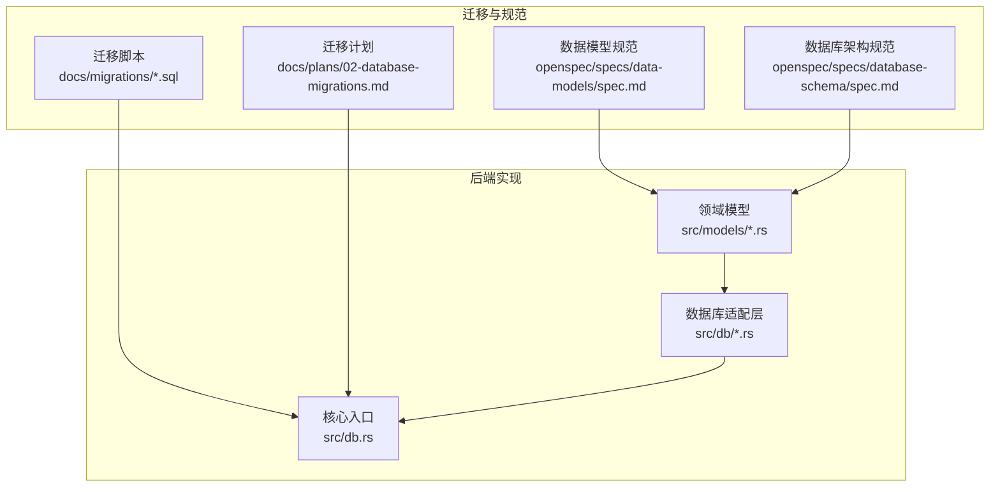
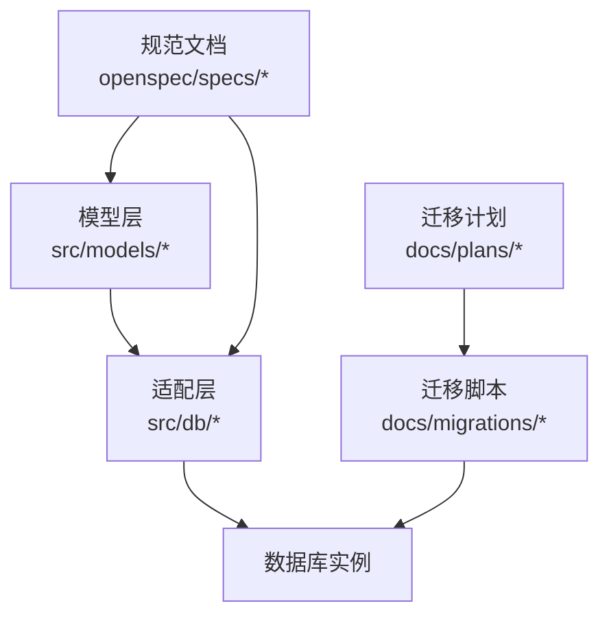
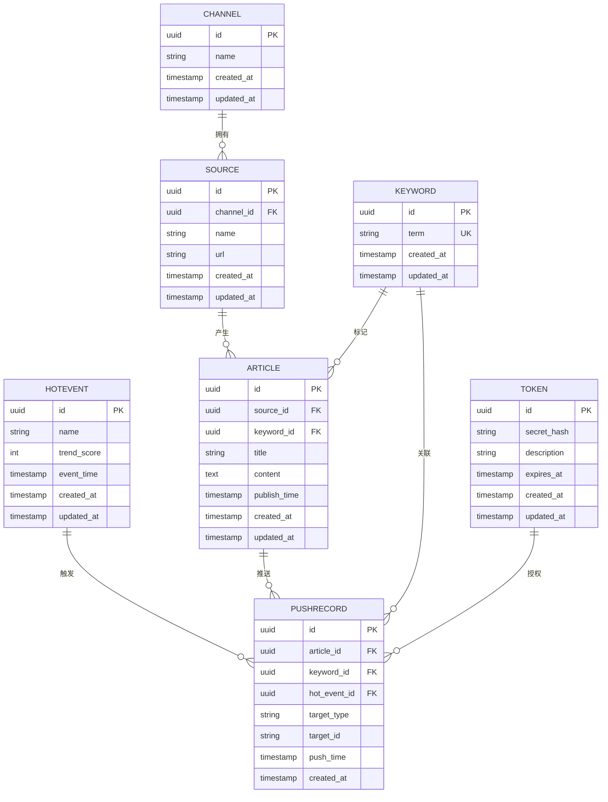
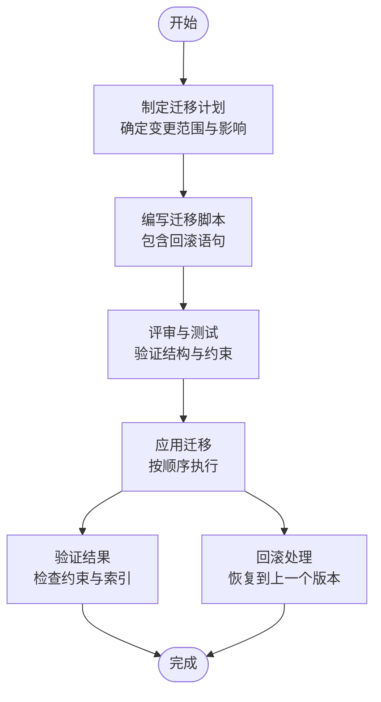
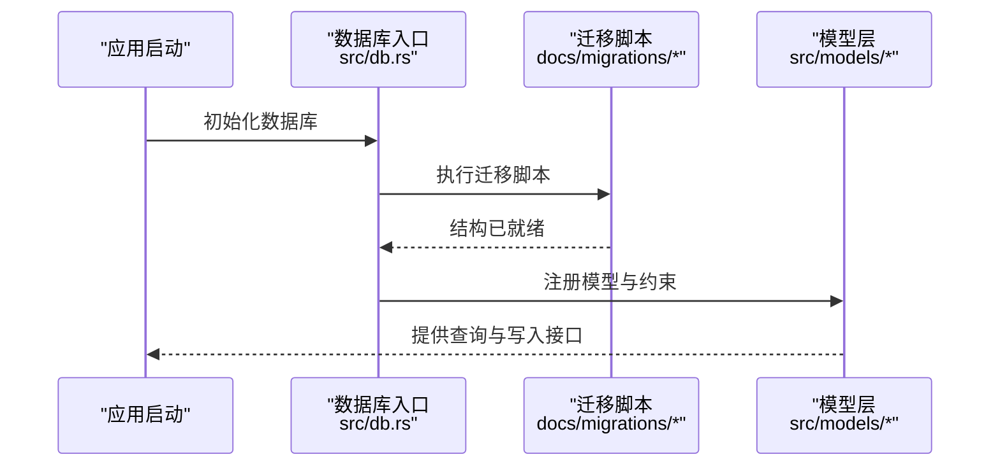
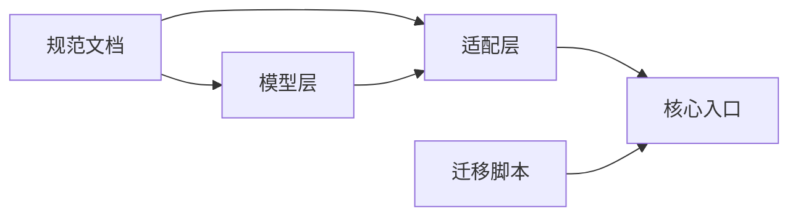

# 数据库架构规范

<cite>
**本文引用的文件**
- [20260607044921_init.sql](file://docs/migrations/20260607044921_init.sql)
- [channel.rs](file://src/db/channel.rs)
- [source.rs](file://src/db/source.rs)
- [keyword.rs](file://src/db/keyword.rs)
- [article.rs](file://src/db/article.rs)
- [hot_event.rs](file://src/db/hot_event.rs)
- [push_record.rs](file://src/db/push_record.rs)
- [token.rs](file://src/db/token.rs)
- [db.rs](file://src/db.rs)
- [data-models 规范.md](file://openspec/specs/data-models/spec.md)
- [database-schema 规范.md](file://openspec/specs/database-schema/spec.md)
- [02-database-migrations.md](file://docs/plans/02-database-migrations.md)
- [README.md](file://README.md)
</cite>

## 目录
1. [引言](#引言)
2. [项目结构](#项目结构)
3. [核心组件](#核心组件)
4. [架构总览](#架构总览)
5. [详细组件分析](#详细组件分析)
6. [依赖分析](#依赖分析)
7. [性能考虑](#性能考虑)
8. [故障排查指南](#故障排查指南)
9. [结论](#结论)
10. [附录](#附录)

## 引言
本规范面向“AI趋势监控系统”的数据库层，目标是建立统一的表结构设计原则、关系映射规则、索引策略与迁移管理流程，确保数据完整性、可维护性与可扩展性。本文结合现有迁移脚本与领域模型文件，给出可落地的建模方法与最佳实践。

## 项目结构
数据库相关代码与文档分布如下：
- 迁移脚本：位于 docs/migrations，包含初始数据库结构定义
- 领域模型与数据库适配层：位于 src/models 与 src/db，分别描述业务实体与SQL映射
- 架构与模型规范：位于 openspec/specs 下的数据模型与数据库架构规范文档
- 迁移与演进计划：位于 docs/plans 的数据库迁移计划文档

**图表来源**
- [20260607044921_init.sql:1-200](file://docs/migrations/20260607044921_init.sql#L1-L200)
- [db.rs:1-120](file://src/db.rs#L1-L120)
- [data-models 规范.md:1-200](file://openspec/specs/data-models/spec.md#L1-L200)
- [database-schema 规范.md:1-200](file://openspec/specs/database-schema/spec.md#L1-L200)

**章节来源**
- [README.md:1-120](file://README.md#L1-L120)
- [02-database-migrations.md:1-120](file://docs/plans/02-database-migrations.md#L1-L120)

## 核心组件
- 模型层（src/models）：定义业务实体与字段语义，如频道、来源、关键词、文章、热点事件、推送记录、令牌等
- 数据库适配层（src/db）：将模型映射到SQL表结构，提供查询与写入接口
- 迁移脚本（docs/migrations）：定义数据库版本化结构，确保环境一致性
- 规范文档（openspec/specs）：提供数据模型与数据库架构的约束与设计原则

关键职责划分：
- 模型层负责“是什么”（实体与属性）
- 适配层负责“如何存取”（SQL映射与约束）
- 迁移层负责“如何演进”（版本化结构变更）
- 规范层负责“如何设计”（设计原则与约束）

**章节来源**
- [channel.rs:1-120](file://src/db/channel.rs#L1-L120)
- [source.rs:1-120](file://src/db/source.rs#L1-L120)
- [keyword.rs:1-120](file://src/db/keyword.rs#L1-L120)
- [article.rs:1-120](file://src/db/article.rs#L1-L120)
- [hot_event.rs:1-120](file://src/db/hot_event.rs#L1-L120)
- [push_record.rs:1-120](file://src/db/push_record.rs#L1-L120)
- [token.rs:1-120](file://src/db/token.rs#L1-L120)

## 架构总览
数据库层采用“模型驱动+迁移管理”的架构模式：
- 模型定义先行，明确实体、属性与关系
- 通过迁移脚本固化结构，确保多环境一致
- 适配层封装SQL细节，向上提供稳定接口
- 规范文档约束设计与约束，避免设计漂移

**图表来源**
- [db.rs:1-120](file://src/db.rs#L1-L120)
- [20260607044921_init.sql:1-200](file://docs/migrations/20260607044921_init.sql#L1-L200)
- [data-models 规范.md:1-200](file://openspec/specs/data-models/spec.md#L1-L200)
- [database-schema 规范.md:1-200](file://openspec/specs/database-schema/spec.md#L1-L200)

## 详细组件分析

### 表结构与关系映射
基于迁移脚本与模型文件，系统核心实体与关系如下：
- 频道（Channel）：承载内容分发的顶层分类
- 来源（Source）：具体信息来源，属于某个频道
- 关键词（Keyword）：用于检索与聚合的标签
- 文章（Article）：具体内容条目，关联来源与关键词
- 热点事件（HotEvent）：对一段时间内热度聚合的结果
- 推送记录（PushRecord）：向用户或渠道推送的记录
- 令牌（Token）：鉴权与访问控制的基础凭据

**图表来源**
- [20260607044921_init.sql:1-200](file://docs/migrations/20260607044921_init.sql#L1-L200)
- [channel.rs:1-120](file://src/db/channel.rs#L1-L120)
- [source.rs:1-120](file://src/db/source.rs#L1-L120)
- [keyword.rs:1-120](file://src/db/keyword.rs#L1-L120)
- [article.rs:1-120](file://src/db/article.rs#L1-L120)
- [hot_event.rs:1-120](file://src/db/hot_event.rs#L1-L120)
- [push_record.rs:1-120](file://src/db/push_record.rs#L1-L120)
- [token.rs:1-120](file://src/db/token.rs#L1-L120)

**章节来源**
- [20260607044921_init.sql:1-200](file://docs/migrations/20260607044921_init.sql#L1-L200)

### 设计原则与约束条件
- 主键与唯一性
  - 所有表均以UUID为主键，确保跨服务合并与分布式场景下的唯一性
  - 关键词的term字段具备唯一性约束，避免重复标签
- 外键关系
  - 文章与来源、关键词存在外键关联；热点事件与推送记录之间存在弱关联（便于独立演进）
- 时间戳
  - 统一使用创建与更新时间戳，支持审计与排序
- 命名规范
  - 表名与字段名采用小写加下划线风格，保持一致性
- 可扩展性
  - 推送记录保留通用的目标类型与ID字段，便于未来扩展至更多目标类型

**章节来源**
- [20260607044921_init.sql:1-200](file://docs/migrations/20260607044921_init.sql#L1-L200)

### 字段定义规范与数据类型选择
- 标识符：uuid 类型，主键与外键统一使用
- 文本类：短文本使用 string，长文本使用 text，便于内容存储与检索
- 时间类：timestamp，统一记录创建与更新时间
- 数值类：整数用于评分与计数，满足趋势计算需求
- 枚举类：目标类型使用字符串枚举，便于扩展与查询

**章节来源**
- [20260607044921_init.sql:1-200](file://docs/migrations/20260607044921_init.sql#L1-L200)

### 索引策略规范
- 唯一索引
  - 关键词term字段：保障标签唯一性，提升检索效率
- 常用查询索引
  - 文章publish_time：支持按时间范围检索
  - 文章source_id：支持按来源聚合
  - 文章keyword_id：支持按关键词聚合
  - 推送记录push_time：支持推送历史查询
  - 推送记录target_type/target_id：支持按目标维度查询
- 聚合与统计
  - 热点事件event_time：支持按时间段聚合
- 复合索引建议
  - 文章(source_id, publish_time)：加速来源+时间的组合查询
  - 推送记录(article_id, push_time)：加速文章推送历史查询

**章节来源**
- [20260607044921_init.sql:1-200](file://docs/migrations/20260607044921_init.sql#L1-L200)

### 数据完整性保证机制
- 外键约束：通过外键确保引用完整性，防止悬挂记录
- 唯一约束：通过唯一性约束保证标签与令牌等关键字段不重复
- 默认值与非空：时间戳默认值与非空约束，确保审计与排序可用
- 事务与回滚：在迁移与批量写入时使用事务，失败自动回滚

**章节来源**
- [20260607044921_init.sql:1-200](file://docs/migrations/20260607044921_init.sql#L1-L200)

### 数据库迁移管理流程与版本控制策略
- 版本命名：采用时间戳前缀（如 20260607044921）确保顺序与幂等
- 迁移脚本：先删除旧对象再创建，避免冲突；包含回滚语句
- 执行顺序：按依赖顺序执行，先基础表，后带外键的表
- 审计与回滚：记录迁移状态，支持失败回滚与重试
- 规划文档：迁移计划文档明确每次变更的目的、影响面与回退策略

**图表来源**
- [02-database-migrations.md:1-120](file://docs/plans/02-database-migrations.md#L1-L120)
- [20260607044921_init.sql:1-200](file://docs/migrations/20260607044921_init.sql#L1-L200)

**章节来源**
- [02-database-migrations.md:1-120](file://docs/plans/02-database-migrations.md#L1-L120)

### 适配层与核心入口
- 适配层（src/db）：每个实体对应一个模块，负责SQL映射与约束定义
- 核心入口（src/db.rs）：集中初始化数据库连接与迁移执行逻辑

**图表来源**
- [db.rs:1-120](file://src/db.rs#L1-L120)
- [20260607044921_init.sql:1-200](file://docs/migrations/20260607044921_init.sql#L1-L200)

**章节来源**
- [db.rs:1-120](file://src/db.rs#L1-L120)

## 依赖分析
- 模型层依赖适配层提供的SQL映射能力
- 适配层依赖迁移脚本定义的表结构与约束
- 核心入口统一编排迁移与模型注册
- 规范文档为模型与适配层提供设计约束

**图表来源**
- [data-models 规范.md:1-200](file://openspec/specs/data-models/spec.md#L1-L200)
- [database-schema 规范.md:1-200](file://openspec/specs/database-schema/spec.md#L1-L200)
- [db.rs:1-120](file://src/db.rs#L1-L120)
- [20260607044921_init.sql:1-200](file://docs/migrations/20260607044921_init.sql#L1-L200)

**章节来源**
- [data-models 规范.md:1-200](file://openspec/specs/data-models/spec.md#L1-L200)
- [database-schema 规范.md:1-200](file://openspec/specs/database-schema/spec.md#L1-L200)

## 性能考虑
- 查询路径优化
  - 为高频查询字段建立单列索引（如publish_time、push_time）
  - 对组合查询建立复合索引（如(source_id, publish_time)）
- 写入路径优化
  - 批量插入与事务提交，减少锁竞争
  - 控制索引数量，平衡写入与查询性能
- 存储与归档
  - 对历史数据进行分区或归档，降低热数据体积
- 监控与调优
  - 定期分析慢查询日志，调整索引与查询计划

[本节为通用指导，无需列出具体文件来源]

## 故障排查指南
- 迁移失败
  - 检查迁移脚本是否包含回滚语句，确认执行顺序
  - 查看数据库错误日志，定位约束冲突或索引问题
- 查询异常
  - 使用EXPLAIN分析查询计划，确认索引命中情况
  - 检查字段类型与索引类型是否匹配
- 数据不一致
  - 核对唯一性约束与外键约束是否生效
  - 检查事务边界与并发写入策略

**章节来源**
- [02-database-migrations.md:1-120](file://docs/plans/02-database-migrations.md#L1-L120)
- [20260607044921_init.sql:1-200](file://docs/migrations/20260607044921_init.sql#L1-L200)

## 结论
本规范以模型驱动与迁移管理为核心，明确了表结构设计原则、关系映射规则、索引策略与完整性约束，并提供了迁移流程与版本控制策略。通过统一的规范与严格的执行流程，确保系统在高并发与复杂查询场景下的稳定性与可扩展性。

## 附录
- 表结构示例与字段定义可参考迁移脚本中的建表语句
- 数据类型选择遵循“精确表达业务含义”的原则，避免过度宽泛
- 扩展性方面，建议在新增实体时复用现有命名与约束风格，并在迁移计划中评估影响

**章节来源**
- [20260607044921_init.sql:1-200](file://docs/migrations/20260607044921_init.sql#L1-L200)
- [database-schema 规范.md:1-200](file://openspec/specs/database-schema/spec.md#L1-L200)