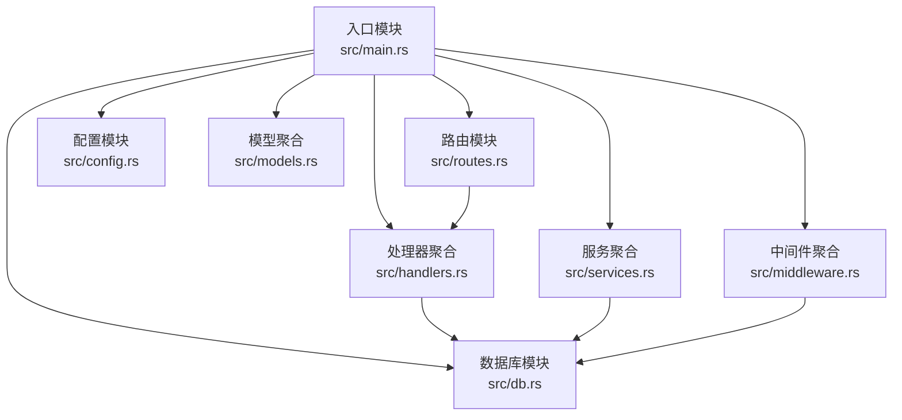
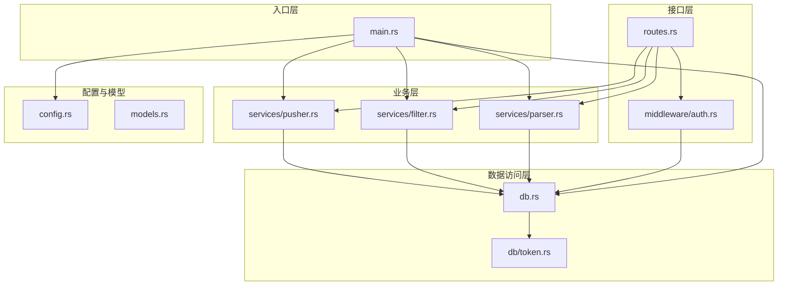
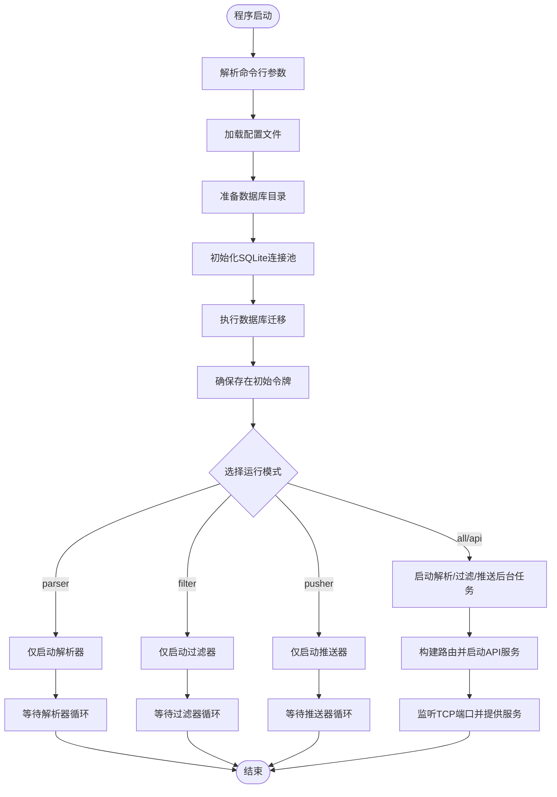
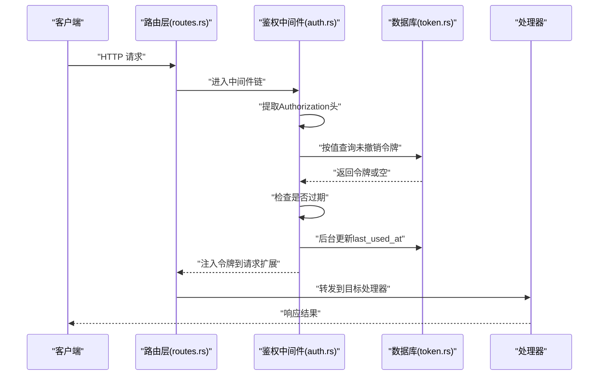
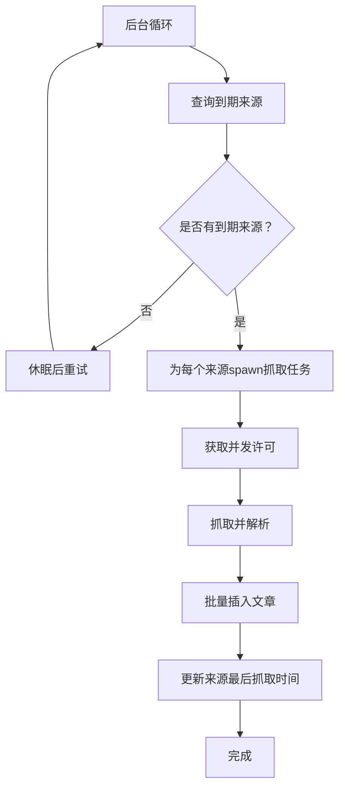
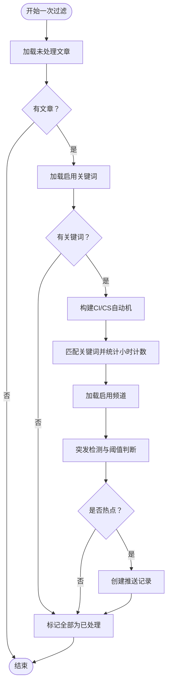
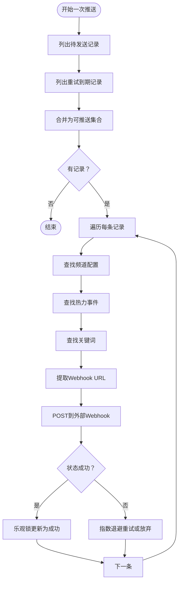
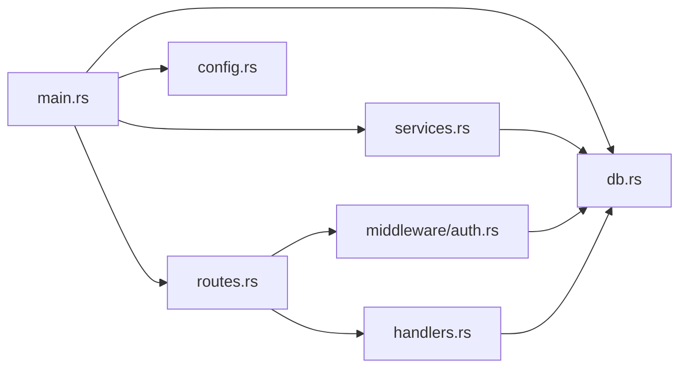

# 代码结构与模块组织

<cite>
**本文档引用的文件**
- [src/main.rs](file://src/main.rs)
- [src/route.rs](file://src/routes.rs)
- [src/config.rs](file://src/config.rs)
- [src/db.rs](file://src/db.rs)
- [src/models.rs](file://src/models.rs)
- [src/handlers.rs](file://src/handlers.rs)
- [src/services.rs](file://src/services.rs)
- [src/middleware.rs](file://src/middleware.rs)
- [src/db/token.rs](file://src/db/token.rs)
- [src/middleware/auth.rs](file://src/middleware/auth.rs)
- [src/services/parser.rs](file://src/services/parser.rs)
- [src/services/filter.rs](file://src/services/filter.rs)
- [src/services/pusher.rs](file://src/services/pusher.rs)
- [Cargo.toml](file://Cargo.toml)
- [config.toml](file://config.toml)
</cite>

## 目录
1. [引言](#引言)
2. [项目结构](#项目结构)
3. [核心组件](#核心组件)
4. [架构总览](#架构总览)
5. [详细组件分析](#详细组件分析)
6. [依赖分析](#依赖分析)
7. [性能考虑](#性能考虑)
8. [故障排除指南](#故障排除指南)
9. [结论](#结论)

## 引言
本文件面向AI趋势监控系统（AI Trend Monitor）的代码结构与模块组织，系统采用模块化分层架构，围绕入口模块、路由层、中间件、业务服务、数据访问与模型定义进行清晰划分。本文档旨在帮助开发者快速理解模块职责、依赖关系与交互流程，并提供最佳实践与排障建议。

## 项目结构
项目采用按功能域分层的模块组织方式，主要目录与职责如下：
- src/main.rs：应用入口，负责初始化配置、数据库连接池、迁移、初始令牌校验以及根据运行模式启动API与后台任务。
- src/routes.rs：路由定义与状态注入，统一挂载REST API并应用认证中间件。
- src/config.rs：配置模型与加载逻辑，集中管理服务器、数据库、鉴权、解析器、过滤器、推送器等配置项。
- src/db.rs：数据库模块聚合，提供SQLite连接池初始化与WAL/外键设置。
- src/models.rs：数据模型聚合，定义文章、关键词、频道、热力事件、推送记录、来源、令牌等实体。
- src/handlers.rs：API处理器聚合，按资源划分具体控制器。
- src/services.rs：业务服务聚合，包含解析器、过滤器、推送器三个后台服务。
- src/middleware.rs：中间件聚合，当前包含鉴权中间件。
- src/db/* 与 src/models/*：按领域模型拆分的具体实现，遵循“每个表一个模块”的组织原则。
- 配置文件：config.toml 提供运行时配置；docs/migrations 提供数据库迁移脚本。

图表来源
- [src/main.rs:64-164](file://src/main.rs#L64-L164)
- [src/routes.rs:14-59](file://src/routes.rs#L14-L59)
- [src/config.rs:51-58](file://src/config.rs#L51-L58)
- [src/db.rs:12-26](file://src/db.rs#L12-L26)
- [src/models.rs:1-9](file://src/models.rs#L1-L9)
- [src/handlers.rs:1-7](file://src/handlers.rs#L1-L7)
- [src/services.rs:1-4](file://src/services.rs#L1-L4)
- [src/middleware.rs:1-3](file://src/middleware.rs#L1-L3)

章节来源
- [src/main.rs:1-164](file://src/main.rs#L1-L164)
- [src/routes.rs:1-70](file://src/routes.rs#L1-L70)
- [src/config.rs:1-58](file://src/config.rs#L1-L58)
- [src/db.rs:1-27](file://src/db.rs#L1-L27)
- [src/models.rs:1-9](file://src/models.rs#L1-L9)
- [src/handlers.rs:1-7](file://src/handlers.rs#L1-L7)
- [src/services.rs:1-4](file://src/services.rs#L1-L4)
- [src/middleware.rs:1-3](file://src/middleware.rs#L1-L3)

## 核心组件
- 应用入口（main.rs）
  - 负责命令行参数解析、配置加载、数据库目录准备、连接池初始化、迁移执行、初始令牌确保、模式选择与后台任务/API启动。
  - 关键职责：初始化与编排、模式分支控制、并发任务调度。
- 路由与状态（routes.rs）
  - 定义REST端点、嵌套API前缀、CORS层、认证中间件注入，通过AppState传递数据库连接池与配置。
- 配置系统（config.rs）
  - 定义ServerConfig、DatabaseConfig、AuthConfig、ParserConfig、FilterConfig、PusherConfig等结构体，支持从TOML文件加载。
- 数据库层（db.rs）
  - 初始化SQLite连接池，启用WAL模式与外键约束，提供模块化子模块（article/channel/hot_event/keyword/keyword_mention/push_record/source/token）。
- 模型层（models.rs）
  - 聚合各领域模型，与数据库表一一对应，便于跨模块共享。
- 处理器层（handlers.rs）
  - 聚合各资源的HTTP处理器（token/channel/keyword/source/query），由路由统一注册。
- 中间件（middleware.rs 与 auth.rs）
  - 当前实现Bearer Token鉴权中间件，从请求头提取令牌、查询数据库验证有效性、检查过期、更新最近使用时间、注入到请求扩展。
- 业务服务（services.rs 与 parser/filter/pusher）
  - 解析器：异步并发抓取RSS/Atom源，解析为结构化文章，批量写入数据库。
  - 过滤器：基于关键词匹配与突发检测，生成热力事件并创建推送记录。
  - 推送器：轮询待推送记录，调用外部Webhook，指数退避重试。

章节来源
- [src/main.rs:64-164](file://src/main.rs#L64-L164)
- [src/routes.rs:14-70](file://src/routes.rs#L14-L70)
- [src/config.rs:1-58](file://src/config.rs#L1-L58)
- [src/db.rs:1-27](file://src/db.rs#L1-L27)
- [src/models.rs:1-9](file://src/models.rs#L1-L9)
- [src/handlers.rs:1-7](file://src/handlers.rs#L1-L7)
- [src/middleware.rs:1-3](file://src/middleware.rs#L1-L3)
- [src/middleware/auth.rs:14-58](file://src/middleware/auth.rs#L14-L58)
- [src/services.rs:1-4](file://src/services.rs#L1-L4)

## 架构总览
系统采用“入口协调 + 分层路由 + 中间件鉴权 + 业务服务 + 数据访问”的分层架构。入口模块负责初始化与编排，路由层负责对外暴露API，中间件层负责横切关注点（鉴权），业务服务层负责核心算法与后台循环，数据访问层负责数据库交互。

图表来源
- [src/main.rs:64-164](file://src/main.rs#L64-L164)
- [src/routes.rs:14-59](file://src/routes.rs#L14-L59)
- [src/middleware/auth.rs:18-57](file://src/middleware/auth.rs#L18-L57)
- [src/services/parser.rs:94-185](file://src/services/parser.rs#L94-L185)
- [src/services/filter.rs:269-277](file://src/services/filter.rs#L269-L277)
- [src/services/pusher.rs:251-259](file://src/services/pusher.rs#L251-L259)
- [src/db.rs:12-26](file://src/db.rs#L12-L26)
- [src/db/token.rs:1-99](file://src/db/token.rs#L1-L99)
- [src/config.rs:51-58](file://src/config.rs#L51-L58)
- [src/models.rs:1-9](file://src/models.rs#L1-L9)

## 详细组件分析

### 入口模块（main.rs）
- 主要职责
  - 命令行参数解析（配置文件路径、运行模式）。
  - 加载配置、准备数据库目录、初始化连接池、执行迁移。
  - 确保至少存在一个有效API令牌（首次启动自动生成或使用配置）。
  - 根据模式启动API服务与后台任务（解析器/过滤器/推送器）。
- 并发与模式控制
  - 支持“all”“api”“parser”“filter”“pusher”等模式，分别组合启动不同数量的后台任务与API服务。
  - 使用Tokio spawn启动三个后台循环，避免阻塞API服务。
- 关键流程图

图表来源
- [src/main.rs:64-164](file://src/main.rs#L64-L164)

章节来源
- [src/main.rs:17-62](file://src/main.rs#L17-L62)
- [src/main.rs:64-164](file://src/main.rs#L64-L164)

### 路由与状态（routes.rs）
- 路由组织
  - 统一挂载在“/api/v1”前缀下，包含令牌、来源、关键词、频道、查询等API。
  - 提供健康检查端点“/health”。
- 中间件集成
  - 在API路由上应用认证中间件，所有受保护端点均需Bearer Token。
- 状态注入
  - 通过AppState携带SqlitePool与AppConfig，供处理器与服务使用。
- 序列图（鉴权中间件）

图表来源
- [src/routes.rs:14-59](file://src/routes.rs#L14-L59)
- [src/middleware/auth.rs:18-57](file://src/middleware/auth.rs#L18-L57)
- [src/db/token.rs:37-45](file://src/db/token.rs#L37-L45)

章节来源
- [src/routes.rs:14-70](file://src/routes.rs#L14-L70)
- [src/middleware/auth.rs:14-58](file://src/middleware/auth.rs#L14-L58)

### 配置系统（config.rs）
- 结构设计
  - AppConfig聚合各子配置，包含服务器、数据库、鉴权、解析器、过滤器、推送器。
  - 支持从TOML文件加载，提供默认值与类型安全。
- 配置示例（config.toml）
  - 包含服务器地址与端口、数据库路径、初始令牌、解析器并发与超时、过滤器批大小与历史窗口、推送器间隔与重试策略。
- 最佳实践
  - 将敏感信息（如初始令牌）置于环境变量或密钥管理中，避免硬编码。
  - 对于生产部署，建议分离开发与发布配置文件。

章节来源
- [src/config.rs:1-58](file://src/config.rs#L1-L58)
- [config.toml:1-27](file://config.toml#L1-L27)

### 数据库层（db.rs 与 db/token.rs）
- 连接池初始化
  - 使用SqlitePoolOptions创建连接池，设置最大连接数，启用WAL模式与外键约束。
- 令牌相关操作
  - 提供创建、列表、按ID/值查询、撤销、计数、插入初始令牌、删除等方法。
- 设计要点
  - 将数据库操作封装为独立模块，避免在业务层直接操作SQL。
  - 使用Option/Result进行错误传播，保持调用方清晰。

章节来源
- [src/db.rs:12-26](file://src/db.rs#L12-L26)
- [src/db/token.rs:1-99](file://src/db/token.rs#L1-L99)

### 业务服务

#### 解析器（services/parser.rs）
- 能力概述
  - 定义可扩展的Parser trait，内置RssParser实现，使用feed-rs解析RSS/Atom。
  - 后台循环定时查询到期来源，使用信号量限制并发，批量插入文章并更新最后抓取时间。
- 关键流程图

图表来源
- [src/services/parser.rs:94-185](file://src/services/parser.rs#L94-L185)

章节来源
- [src/services/parser.rs:21-88](file://src/services/parser.rs#L21-L88)
- [src/services/parser.rs:94-185](file://src/services/parser.rs#L94-L185)

#### 过滤器（services/filter.rs）
- 能力概述
  - 一次性过滤流程：加载未处理文章、加载启用关键词、构建Aho-Corasick自动机、统计小时级命中次数、计算历史均值与标准差、突发检测、创建热力事件与推送记录、标记文章已处理。
  - 支持后台循环与手动触发。
- 关键流程图

图表来源
- [src/services/filter.rs:13-208](file://src/services/filter.rs#L13-L208)

章节来源
- [src/services/filter.rs:9-208](file://src/services/filter.rs#L9-L208)

#### 推送器（services/pusher.rs）
- 能力概述
  - 一次性推送流程：查询待发送与重试到期记录，逐条拉取频道与事件信息，构造Webhook负载，POST到外部URL，成功则乐观锁更新状态，失败按指数退避重试或放弃。
  - 支持后台循环与手动触发。
- 关键流程图

图表来源
- [src/services/pusher.rs:11-202](file://src/services/pusher.rs#L11-L202)

章节来源
- [src/services/pusher.rs:7-202](file://src/services/pusher.rs#L7-L202)

## 依赖分析
- 模块耦合与内聚
  - 入口模块对配置、数据库、服务与路由均有强依赖，但通过聚合模块降低直接耦合。
  - 路由层仅依赖处理器与中间件，不直接依赖业务细节，保持高内聚低耦合。
  - 中间件依赖数据库与错误类型，形成横切关注点。
  - 业务服务依赖配置与数据库，彼此独立，通过数据库共享状态。
- 外部依赖
  - Web框架：Axum/Tower/CORS
  - 数据库：SQLx（SQLite）
  - 序列化：Serde/TOML
  - 时间：Chrono
  - 日志：Tracing/Subscriber
  - 并发：Tokio/Semaphore
  - 文本匹配：Aho-Corasick
  - HTTP客户端：Reqwest
  - RSS解析：feed-rs
  - 随机与编码：Rand/Hex
  - CLI：Clap

图表来源
- [Cargo.toml:6-46](file://Cargo.toml#L6-L46)
- [src/main.rs:64-164](file://src/main.rs#L64-L164)
- [src/routes.rs:14-59](file://src/routes.rs#L14-L59)
- [src/middleware/auth.rs:18-57](file://src/middleware/auth.rs#L18-L57)
- [src/services/parser.rs:94-185](file://src/services/parser.rs#L94-L185)
- [src/services/filter.rs:269-277](file://src/services/filter.rs#L269-L277)
- [src/services/pusher.rs:251-259](file://src/services/pusher.rs#L251-L259)

章节来源
- [Cargo.toml:6-46](file://Cargo.toml#L6-L46)

## 性能考虑
- 并发与限流
  - 解析器使用信号量限制并发抓取，避免资源争用与超时。
  - 过滤器与推送器采用后台循环，周期性处理，避免阻塞API。
- 数据库优化
  - SQLite启用WAL模式提升并发读写能力，开启外键约束保证一致性。
  - 批量插入与乐观锁更新减少事务开销。
- 算法效率
  - Aho-Corasick自动机用于多关键词高效匹配，区分大小写与不区分大小写的关键词分别构建。
- 网络与重试
  - 推送器采用指数退避重试，避免对下游造成冲击；达到最大重试后放弃，防止无限占用资源。

## 故障排除指南
- 鉴权失败
  - 现象：返回401 Unauthorized。
  - 排查：确认Authorization头格式为Bearer Token；检查令牌是否撤销或过期；查看数据库中令牌状态。
- 数据库连接问题
  - 现象：迁移失败或查询报错。
  - 排查：确认数据库路径存在且可写；检查WAL与外键设置是否生效；核对连接池配置。
- 解析器异常
  - 现象：抓取失败或解析异常。
  - 排查：检查源URL可达性与内容格式；调整并发与超时配置；查看日志中的错误堆栈。
- 过滤器无输出
  - 现象：未生成热点或推送记录。
  - 排查：确认存在启用关键词与启用频道；检查历史小时数是否满足阈值；核对关键词命中与统计计算。
- 推送器失败
  - 现象：Webhook调用失败或重试过多。
  - 排查：确认频道配置JSON包含有效URL；检查网络连通性；查看重试计数与下次重试时间。

章节来源
- [src/middleware/auth.rs:18-57](file://src/middleware/auth.rs#L18-L57)
- [src/db/token.rs:37-45](file://src/db/token.rs#L37-L45)
- [src/services/parser.rs:101-182](file://src/services/parser.rs#L101-L182)
- [src/services/filter.rs:132-208](file://src/services/filter.rs#L132-L208)
- [src/services/pusher.rs:13-202](file://src/services/pusher.rs#L13-L202)

## 结论
本项目通过清晰的模块化分层与职责划分，实现了从入口协调、路由与中间件、业务服务到数据访问的完整闭环。模块间通过聚合与状态注入解耦，配合并发与批处理策略，兼顾了可维护性与性能。建议在生产环境中进一步完善配置管理、监控与告警体系，并持续优化关键词匹配与突发检测算法以提升准确性与时效性。