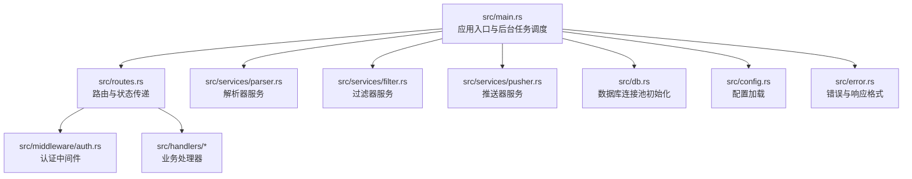
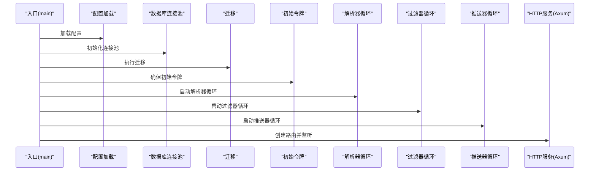
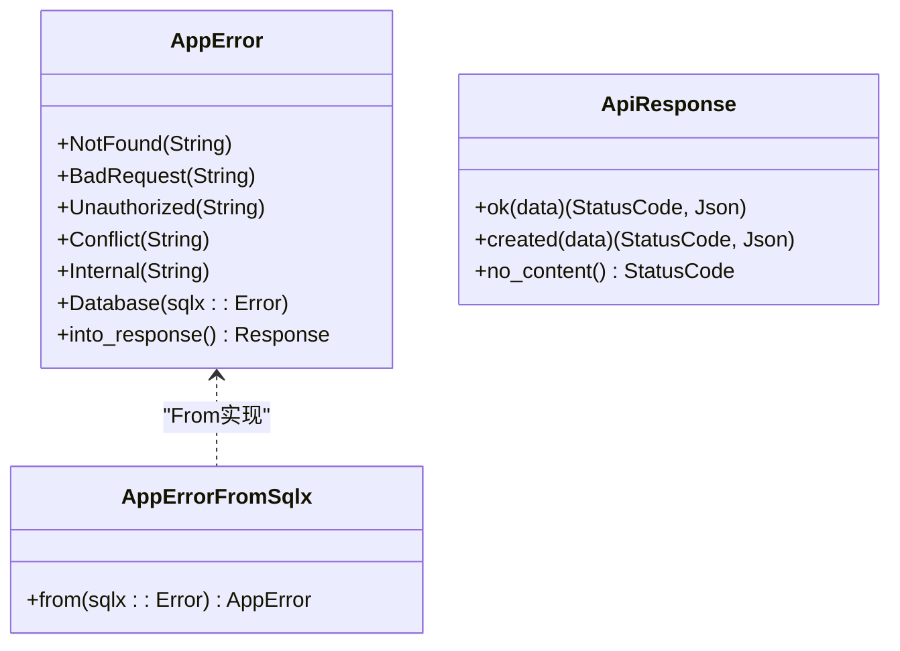
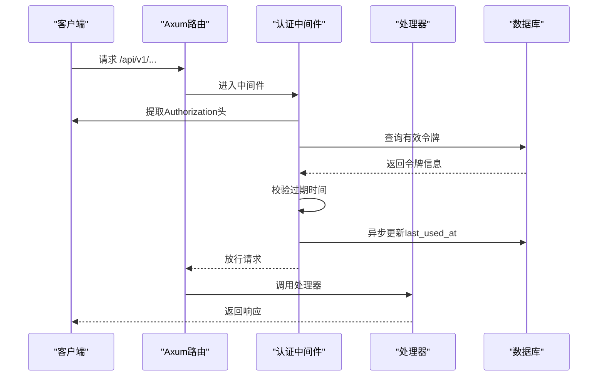
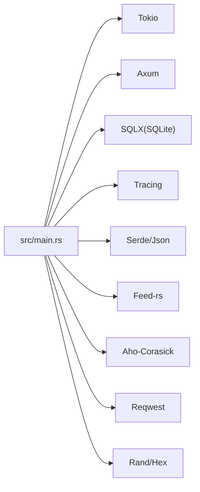

# 代码规范与最佳实践

<cite>
**本文引用的文件**
- [src/main.rs](file://src/main.rs)
- [Cargo.toml](file://Cargo.toml)
- [src/error.rs](file://src/error.rs)
- [src/config.rs](file://src/config.rs)
- [src/db.rs](file://src/db.rs)
- [src/routes.rs](file://src/routes.rs)
- [src/middleware/auth.rs](file://src/middleware/auth.rs)
- [src/services/parser.rs](file://src/services/parser.rs)
- [src/services/filter.rs](file://src/services/filter.rs)
- [src/services/pusher.rs](file://src/services/pusher.rs)
- [config.toml](file://config.toml)
</cite>

## 目录
1. [引言](#引言)
2. [项目结构](#项目结构)
3. [核心组件](#核心组件)
4. [架构总览](#架构总览)
5. [详细组件分析](#详细组件分析)
6. [依赖关系分析](#依赖关系分析)
7. [性能考量](#性能考量)
8. [故障排查指南](#故障排查指南)
9. [结论](#结论)
10. [附录](#附录)

## 引言
本文件面向AI趋势监控系统后端的Rust实现，提供一套完整的代码规范与最佳实践指南。内容涵盖命名约定、代码格式化、注释规范；异步编程最佳实践（Tokio运行时、错误处理、资源管理）；错误处理机制（自定义错误类型、错误传播、统一响应格式）；性能优化（内存管理、并发、数据库操作）；以及安全编码实践（输入验证、SQL注入防护、API安全）。目标是帮助开发者在保持一致性的同时提升可维护性、可扩展性和安全性。

## 项目结构
系统采用模块化分层组织：入口程序负责初始化配置、数据库连接池、迁移、后台任务与HTTP服务；路由层定义REST接口；中间件层提供认证；服务层包含解析器、过滤器、推送器三大后台模块；数据访问层封装SQLX查询；模型与错误处理位于独立模块中。

图表来源
- [src/main.rs:64-164](file://src/main.rs#L64-L164)
- [src/routes.rs:14-70](file://src/routes.rs#L14-L70)
- [src/middleware/auth.rs:18-58](file://src/middleware/auth.rs#L18-L58)
- [src/services/parser.rs:94-185](file://src/services/parser.rs#L94-L185)
- [src/services/filter.rs:269-277](file://src/services/filter.rs#L269-L277)
- [src/services/pusher.rs:251-259](file://src/services/pusher.rs#L251-L259)
- [src/db.rs:12-27](file://src/db.rs#L12-L27)
- [src/config.rs:51-58](file://src/config.rs#L51-L58)
- [src/error.rs:8-79](file://src/error.rs#L8-L79)

章节来源
- [src/main.rs:1-164](file://src/main.rs#L1-L164)
- [src/routes.rs:1-70](file://src/routes.rs#L1-L70)
- [src/db.rs:1-27](file://src/db.rs#L1-L27)
- [src/config.rs:1-58](file://src/config.rs#L1-L58)
- [src/error.rs:1-79](file://src/error.rs#L1-L79)

## 核心组件
- 应用入口与生命周期
  - 初始化日志、加载配置、创建数据库目录、建立连接池、执行迁移、确保初始令牌存在、按模式启动后台任务与HTTP服务。
- 路由与状态
  - 定义API前缀、健康检查、CORS放行、认证中间件挂载，通过AppState向下游传递数据库连接池与配置。
- 中间件
  - Bearer Token认证，校验令牌有效性、过期时间，更新最近使用时间，并将令牌注入请求扩展供后续处理器使用。
- 错误与响应
  - 统一错误枚举映射HTTP状态码与错误码，数据库错误统一转为内部错误并记录日志；成功响应统一封装为包含data字段的JSON对象。
- 配置
  - TOML配置文件支持服务器、数据库、鉴权、解析器、过滤器、推送器各模块参数，提供默认值与合理上限。
- 数据库
  - SQLite连接池初始化，启用WAL与外键约束，限制最大连接数，保证并发读写稳定性。

章节来源
- [src/main.rs:64-164](file://src/main.rs#L64-L164)
- [src/routes.rs:14-70](file://src/routes.rs#L14-L70)
- [src/middleware/auth.rs:18-58](file://src/middleware/auth.rs#L18-L58)
- [src/error.rs:8-79](file://src/error.rs#L8-L79)
- [src/config.rs:51-58](file://src/config.rs#L51-L58)
- [src/db.rs:12-27](file://src/db.rs#L12-L27)

## 架构总览
系统采用“主进程 + 多后台任务 + HTTP服务”的架构。主进程负责初始化与调度，三个后台任务分别处理RSS抓取、关键词过滤与热点检测、Webhook推送；HTTP服务提供REST API并受认证中间件保护。

图表来源
- [src/main.rs:64-164](file://src/main.rs#L64-L164)
- [src/db.rs:12-27](file://src/db.rs#L12-L27)

## 详细组件分析

### 命名约定与代码风格
- 模块与文件
  - 使用全小写加下划线的模块命名（如services、middleware），文件名与模块一致。
  - 结构体与枚举使用帕斯卡命名法（PascalCase），如AppError、ParserConfig。
- 函数与方法
  - 私有函数使用全小写加下划线；公共API以功能语义命名，如start_parser_loop、run_filter_once。
- 常量与静态
  - 常量使用全大写加下划线；配置项在结构体中使用camelCase或snake_case，视领域习惯而定。
- 注释
  - 公共API与复杂逻辑添加文档注释，说明用途、参数、返回值与异常情况。
  - 关键流程（如后台循环、错误分支）添加行内注释，便于维护。

章节来源
- [src/error.rs:8-79](file://src/error.rs#L8-L79)
- [src/config.rs:3-58](file://src/config.rs#L3-L58)
- [src/services/parser.rs:94-185](file://src/services/parser.rs#L94-L185)
- [src/services/filter.rs:269-277](file://src/services/filter.rs#L269-L277)
- [src/services/pusher.rs:251-259](file://src/services/pusher.rs#L251-L259)

### 异步编程最佳实践
- Tokio运行时
  - 在入口函数上使用#[tokio::main]，确保所有异步任务在单线程或多线程运行时环境中正确调度。
  - 后台任务通过tokio::spawn启动，避免阻塞主线程；任务内部使用tokio::time::sleep进行周期控制。
- 并发与限流
  - 解析器使用信号量（Semaphore）限制并发抓取数量，防止资源耗尽。
  - 过滤器与推送器通过批量处理与间隔控制降低数据库压力。
- 资源管理
  - 数据库连接池在应用启动时初始化并复用；HTTP客户端在推送器中按需创建，避免重复构建。
  - 认证中间件对last_used_at的更新采用fire-and-forget方式，不影响主请求链路。

章节来源
- [src/main.rs:64-164](file://src/main.rs#L64-L164)
- [src/services/parser.rs:94-185](file://src/services/parser.rs#L94-L185)
- [src/services/filter.rs:269-277](file://src/services/filter.rs#L269-L277)
- [src/services/pusher.rs:251-259](file://src/services/pusher.rs#L251-L259)
- [src/middleware/auth.rs:46-51](file://src/middleware/auth.rs#L46-L51)

### 错误处理机制
- 自定义错误类型
  - AppError枚举覆盖常见HTTP状态码与数据库错误；数据库错误自动转换为内部错误并记录日志。
- 错误传播
  - 处理器与服务层广泛使用?操作符进行错误传播，确保调用链清晰。
- 统一错误响应
  - 实现IntoResponse，将错误映射为标准化JSON响应，包含错误码与消息；数据库错误屏蔽细节，仅返回通用提示。
- 成功响应
  - ApiResponse提供ok/created/no_content三种常用响应封装，统一返回结构。

图表来源
- [src/error.rs:8-79](file://src/error.rs#L8-L79)

章节来源
- [src/error.rs:8-79](file://src/error.rs#L8-L79)

### 数据库与并发优化
- 连接池与事务
  - 初始化SQLite连接池，设置最大连接数；启用WAL与外键约束，提升并发读写稳定性。
- 查询与批处理
  - 过滤器按批次加载未处理文章，减少内存占用；批量插入关键词提及与标记处理状态。
  - 推送器合并待处理与重试记录，统一处理，避免重复查询。
- 并发控制
  - 解析器使用信号量限制并发抓取；推送器逐条处理并采用乐观锁更新状态，避免竞态。
- 历史统计与幂等
  - 过滤器通过删除再插入的方式实现热力事件记录的幂等更新，保证同一小时桶不重复计数。

章节来源
- [src/db.rs:12-27](file://src/db.rs#L12-L27)
- [src/services/filter.rs:13-208](file://src/services/filter.rs#L13-L208)
- [src/services/pusher.rs:11-43](file://src/services/pusher.rs#L11-L43)
- [src/services/parser.rs:94-185](file://src/services/parser.rs#L94-L185)

### API与安全实践
- 认证中间件
  - 从Authorization头提取Bearer令牌，查询数据库校验有效性与过期时间；更新最近使用时间采用fire-and-forget。
- CORS与路由
  - 路由层启用宽松CORS，便于前端调试；所有业务路由均受认证中间件保护。
- 输入验证与SQL注入防护
  - 使用SQLX的参数绑定（?占位符）进行查询，避免字符串拼接引发注入风险。
  - 对外部输入（如通道配置JSON）进行解析与校验，缺失字段直接失败，避免隐式行为。
- API安全建议
  - 建议在生产环境收紧CORS策略；为令牌设置有效期与轮换机制；对敏感日志输出进行脱敏。

图表来源
- [src/middleware/auth.rs:18-58](file://src/middleware/auth.rs#L18-L58)
- [src/routes.rs:14-70](file://src/routes.rs#L14-L70)

章节来源
- [src/middleware/auth.rs:18-58](file://src/middleware/auth.rs#L18-L58)
- [src/routes.rs:14-70](file://src/routes.rs#L14-L70)

### 解析器服务（Parser）
- 抽象与实现
  - Parser trait抽象不同来源的解析能力；RssParser基于feed-rs解析RSS/Atom，支持用户代理与超时配置。
- 并发抓取
  - 使用信号量限制并发，避免对上游站点造成压力；每个抓取任务独立处理，失败不影响其他任务。
- 数据入库
  - 成功解析的文章批量插入，重复链接跳过；无论成功与否均更新最后抓取时间，避免无限重试。

章节来源
- [src/services/parser.rs:21-88](file://src/services/parser.rs#L21-L88)
- [src/services/parser.rs:94-185](file://src/services/parser.rs#L94-L185)

### 过滤器服务（Filter）
- 流程
  - 加载未处理文章与启用关键词，构建大小写敏感/不敏感的Aho-Corasick自动机，统计每小时关键词出现次数。
  - 计算历史均值与标准差，结合阈值与最小计数判断热点；为热点事件生成推送记录并标记文章已处理。
- 性能
  - 分离CI/CS关键字，减少匹配开销；批量处理与幂等更新热事件记录。

章节来源
- [src/services/filter.rs:13-208](file://src/services/filter.rs#L13-L208)
- [src/services/filter.rs:210-277](file://src/services/filter.rs#L210-L277)

### 推送器服务（Pusher）
- 流程
  - 合并待处理与重试记录，逐条查找通道与事件，构造Webhook负载并发送；根据响应结果更新状态，失败按指数退避重试。
- 可靠性
  - 使用乐观锁更新推送状态，避免并发冲突；达到最大重试次数后放弃并清理下次重试时间。

章节来源
- [src/services/pusher.rs:11-202](file://src/services/pusher.rs#L11-L202)
- [src/services/pusher.rs:204-259](file://src/services/pusher.rs#L204-L259)

## 依赖关系分析
- 运行时与框架
  - Tokio提供异步运行时；Axum作为Web框架；Tower/Tower-http提供中间件与CORS；SQLX用于SQLite访问。
- 日志与序列化
  - Tracing与Tracing-subscriber用于结构化日志；Serde/serde_json用于请求/响应序列化。
- 工具库
  - Feed-rs解析RSS/Atom；Aho-Corasick高效多模式匹配；Reqwest发起HTTP请求；Rand/Hex生成随机令牌。

图表来源
- [Cargo.toml:6-47](file://Cargo.toml#L6-L47)
- [src/main.rs:10-13](file://src/main.rs#L10-L13)

章节来源
- [Cargo.toml:6-47](file://Cargo.toml#L6-L47)

## 性能考量
- 编译与运行配置
  - 发布配置启用LTO、单代码生成单元、剥离符号、禁用溢出检查，适合生产部署；开发配置启用增量编译，提升迭代速度。
- 并发与限流
  - 解析器并发度由配置项控制；过滤器与推送器通过批次与间隔降低数据库压力。
- 内存与I/O
  - 批量处理减少系统调用；解析器与推送器按需创建客户端，避免不必要的资源占用。
- 数据库优化
  - WAL模式与外键约束提升并发与一致性；幂等更新与索引友好的查询减少重复工作。

章节来源
- [Cargo.toml:48-67](file://Cargo.toml#L48-L67)
- [src/services/parser.rs:94-185](file://src/services/parser.rs#L94-L185)
- [src/services/filter.rs:13-208](file://src/services/filter.rs#L13-L208)
- [src/services/pusher.rs:11-43](file://src/services/pusher.rs#L11-L43)
- [src/db.rs:12-27](file://src/db.rs#L12-L27)

## 故障排查指南
- 启动阶段
  - 若数据库路径不存在，入口会尝试创建父目录；若迁移失败，检查迁移脚本与数据库权限。
  - 初始令牌未生成时，系统会在首次启动自动生成并打印到日志，请妥善保存。
- 认证问题
  - 中间件报错通常来自无效或过期令牌；确认Authorization头格式与数据库中的令牌状态。
- 解析失败
  - 解析器日志会记录具体来源与错误；检查网络连通性、User-Agent与超时设置。
- 过滤无结果
  - 若关键词为空，过滤器会直接标记文章为已处理；检查关键词是否启用且存在历史数据。
- 推送失败
  - 查看通道配置JSON中是否存在url字段；网络错误与非2xx状态会触发重试；超过最大重试次数后放弃。

章节来源
- [src/main.rs:27-62](file://src/main.rs#L27-L62)
- [src/middleware/auth.rs:18-58](file://src/middleware/auth.rs#L18-L58)
- [src/services/parser.rs:101-182](file://src/services/parser.rs#L101-L182)
- [src/services/filter.rs:13-46](file://src/services/filter.rs#L13-L46)
- [src/services/pusher.rs:11-43](file://src/services/pusher.rs#L11-L43)

## 结论
本规范总结了AI趋势监控系统在Rust生态下的编码标准与最佳实践，覆盖命名、异步、错误处理、性能与安全等方面。遵循这些规范有助于提升代码质量、可维护性与运行效率，同时降低生产环境的风险。

## 附录
- 配置示例
  - 服务器、数据库、鉴权、解析器、过滤器、推送器的默认参数可在配置文件中调整，建议结合实际资源与SLA进行压测与调优。

章节来源
- [config.toml:1-27](file://config.toml#L1-L27)