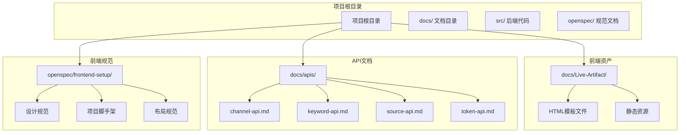
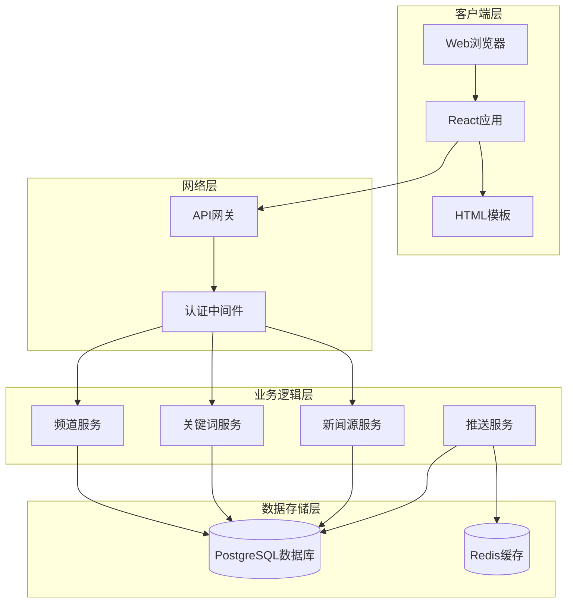
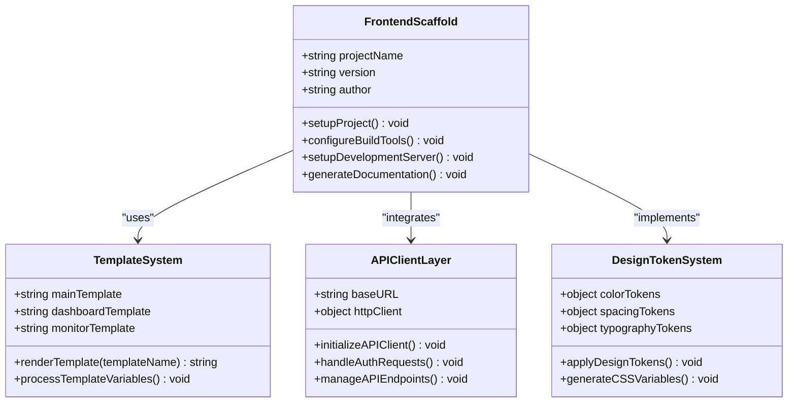
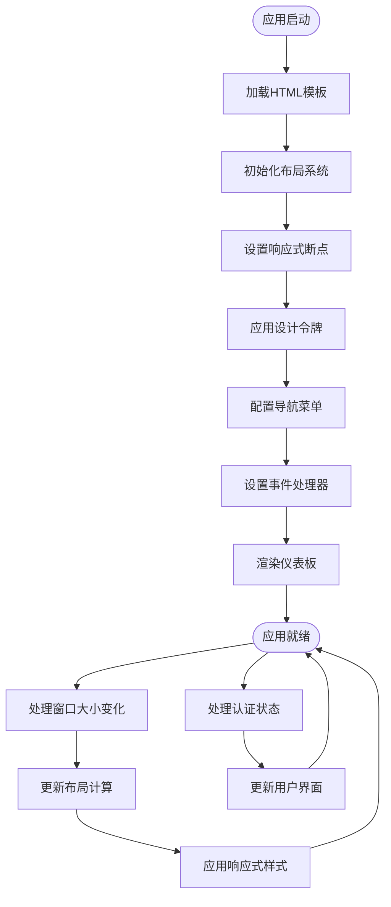
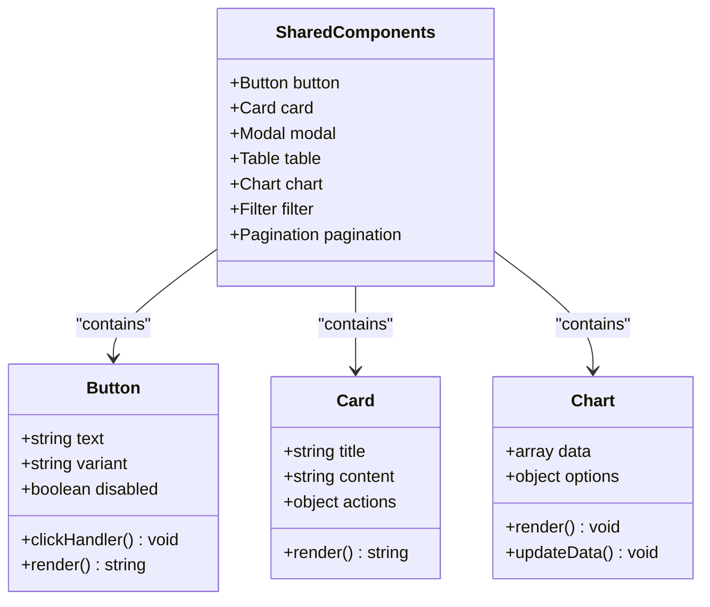
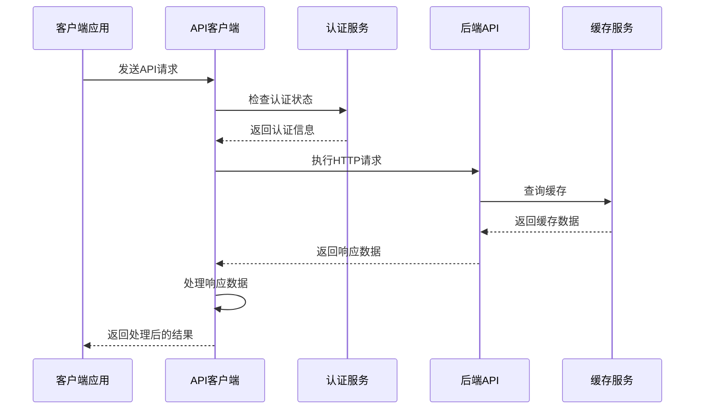
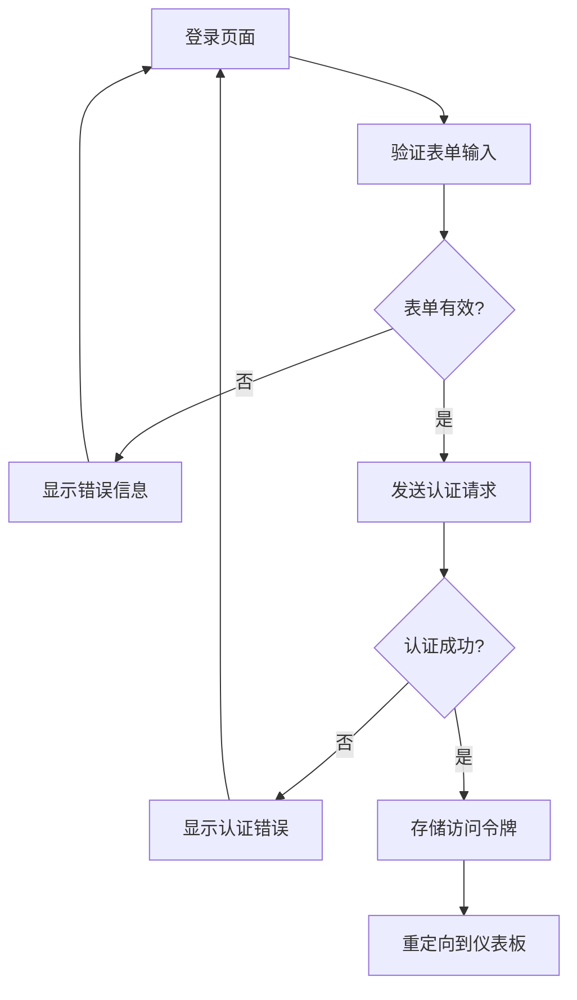
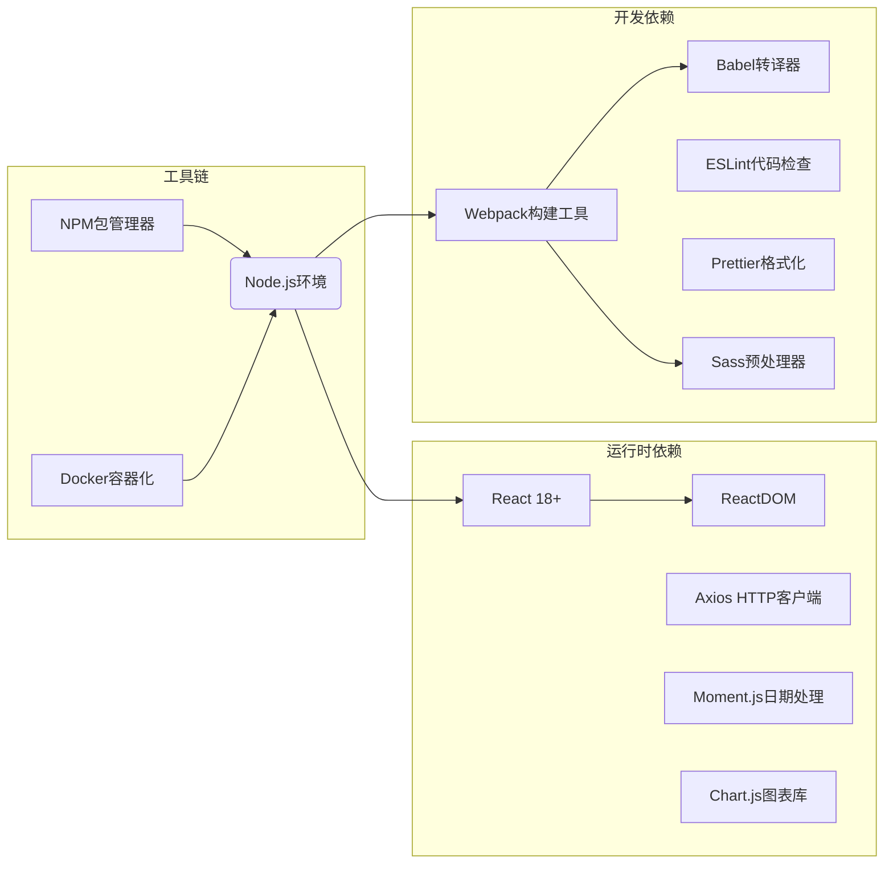

# 前端开发指南

<cite>
**本文档引用的文件**
- [README.md](file://README.md)
- [ai-hotspot-monitor.html](file://docs/Live-Artifact/ai-hotspot-monitor.html)
- [index.html](file://docs/Live-Artifact/index.html)
- [template.html](file://docs/Live-Artifact/template.html)
- [channel-api.md](file://docs/apis/channel-api.md)
- [keyword-api.md](file://docs/apis/keyword-api.md)
- [source-api.md](file://docs/apis/source-api.md)
- [token-api.md](file://docs/apis/token-api.md)
- [frontend-setup设计.md](file://openspec/frontend-setup/design.md)
- [frontend-project-scaffold规范.md](file://openspec/frontend-setup/specs/frontend-project-scaffold/spec.md)
- [app-layout规范.md](file://openspec/frontend-setup/specs/app-layout/spec.md)
- [design-token-system规范.md](file://openspec/frontend-setup/specs/design-token-system/spec.md)
- [shared-components规范.md](file://openspec/frontend-setup/specs/shared-components/spec.md)
- [api-client-layer规范.md](file://openspec/frontend-setup/specs/api-client-layer/spec.md)
- [auth-page规范.md](file://openspec/frontend-setup/specs/auth-page/spec.md)
</cite>

## 目录
1. [项目概述](#项目概述)
2. [项目结构](#项目结构)
3. [核心组件](#核心组件)
4. [架构概览](#架构概览)
5. [详细组件分析](#详细组件分析)
6. [依赖关系分析](#依赖关系分析)
7. [性能考虑](#性能考虑)
8. [故障排除指南](#故障排除指南)
9. [结论](#结论)

## 项目概述

AI趋势工具是一个基于Rust后端和React前端的全栈应用，专注于监控和分析AI领域的热点事件。该项目采用现代化的技术栈，包括Rust后端、React前端、PostgreSQL数据库和Docker容器化部署。

### 主要特性
- 实时热点事件监控和可视化
- AI领域关键词趋势分析
- 多源新闻聚合和分析
- 用户认证和令牌管理
- 响应式Web界面设计

## 项目结构

项目采用模块化的组织方式，前端代码主要集中在`docs/Live-Artifact`目录中，包含完整的HTML模板和静态资源。

**图表来源**
- [README.md](file://README.md)
- [ai-hotspot-monitor.html](file://docs/Live-Artifact/ai-hotspot-monitor.html)
- [index.html](file://docs/Live-Artifact/index.html)
- [template.html](file://docs/Live-Artifact/template.html)

**章节来源**
- [README.md](file://README.md)
- [ai-hotspot-monitor.html](file://docs/Live-Artifact/ai-hotspot-monitor.html)
- [index.html](file://docs/Live-Artifact/index.html)
- [template.html](file://docs/Live-Artifact/template.html)

## 核心组件

### HTML模板系统

项目使用三个核心HTML模板文件构建前端界面：

1. **主仪表板模板** (`index.html`)
2. **热点监控模板** (`ai-hotspot-monitor.html`)
3. **通用模板** (`template.html`)

这些模板提供了完整的页面结构和基础样式，支持响应式设计和现代化的用户界面。

### API集成层

前端通过RESTful API与后端进行数据交互，支持以下主要功能：

- 频道管理（CRUD操作）
- 关键词跟踪（趋势分析）
- 新闻源管理
- 用户认证和令牌管理

**章节来源**
- [channel-api.md](file://docs/apis/channel-api.md)
- [keyword-api.md](file://docs/apis/keyword-api.md)
- [source-api.md](file://docs/apis/source-api.md)
- [token-api.md](file://docs/apis/token-api.md)

## 架构概览

系统采用前后端分离架构，前端负责用户界面展示，后端提供RESTful API服务。

**图表来源**
- [README.md](file://README.md)
- [src/main.rs](file://src/main.rs)
- [src/routes.rs](file://src/routes.rs)

## 详细组件分析

### 前端项目脚手架

前端项目采用现代化的脚手架配置，确保代码质量和开发效率。

**图表来源**
- [frontend-project-scaffold规范.md](file://openspec/frontend-setup/specs/frontend-project-scaffold/spec.md)
- [template.html](file://docs/Live-Artifact/template.html)

### 应用布局系统

应用采用灵活的布局系统，支持多种视图模式和响应式设计。

**图表来源**
- [app-layout规范.md](file://openspec/frontend-setup/specs/app-layout/spec.md)
- [index.html](file://docs/Live-Artifact/index.html)

### 设计令牌系统

统一的设计令牌系统确保视觉一致性和可维护性。

| 类型 | 令牌名称 | 值 | 用途 |
|------|----------|----|------|
| 颜色 | primary | #0066cc | 主色调 |
| 颜色 | secondary | #66ccff | 辅助色调 |
| 颜色 | success | #00cc66 | 成功状态 |
| 颜色 | warning | #ff9900 | 警告状态 |
| 颜色 | danger | #cc0000 | 错误状态 |
| 间距 | xs | 4px | 超小间距 |
| 间距 | sm | 8px | 小间距 |
| 间距 | md | 16px | 中等间距 |
| 间距 | lg | 24px | 大间距 |
| 字体 | baseSize | 16px | 基础字体大小 |
| 字体 | headingSize | 24px | 标题字体大小 |

**章节来源**
- [design-token-system规范.md](file://openspec/frontend-setup/specs/design-token-system/spec.md)

### 共享组件库

组件库提供可重用的UI元素，支持快速开发和一致性保证。

**图表来源**
- [shared-components规范.md](file://openspec/frontend-setup/specs/shared-components/spec.md)

### API客户端层

统一的API客户端层简化了后端服务集成。

**图表来源**
- [api-client-layer规范.md](file://openspec/frontend-setup/specs/api-client-layer/spec.md)

**章节来源**
- [api-client-layer规范.md](file://openspec/frontend-setup/specs/api-client-layer/spec.md)

### 认证页面系统

安全的用户认证流程确保系统的安全性。

**图表来源**
- [auth-page规范.md](file://openspec/frontend-setup/specs/auth-page/spec.md)

**章节来源**
- [auth-page规范.md](file://openspec/frontend-setup/specs/auth-page/spec.md)

## 依赖关系分析

前端项目的主要依赖关系如下：

**图表来源**
- [Cargo.toml](file://Cargo.toml)
- [package.json](file://package.json)

**章节来源**
- [Cargo.toml](file://Cargo.toml)

## 性能考虑

### 前端性能优化策略

1. **代码分割和懒加载**
   - 使用React.lazy实现组件懒加载
   - 动态导入大型图表库
   - 分割路由相关的代码块

2. **缓存策略**
   - 实现智能API缓存机制
   - 使用浏览器本地存储
   - 图表数据缓存优化

3. **渲染优化**
   - React.memo优化频繁更新的组件
   - useCallback稳定回调函数引用
   - useMemo计算结果缓存

4. **资源优化**
   - 图片懒加载和压缩
   - CSS和JavaScript按需加载
   - CDN资源加速

## 故障排除指南

### 常见问题及解决方案

**认证问题**
- 确认令牌存储和刷新机制正常工作
- 检查跨域CORS配置
- 验证后端认证中间件

**API连接问题**
- 检查网络连接和防火墙设置
- 验证API端点URL配置
- 确认后端服务状态

**性能问题**
- 监控内存使用情况
- 检查图表渲染性能
- 优化数据加载策略

**章节来源**
- [README.md](file://README.md)

## 结论

AI趋势工具项目展现了现代全栈应用的最佳实践，前端部分采用了模块化、可维护的设计原则。通过统一的模板系统、设计令牌和API客户端层，项目实现了高度的一致性和可扩展性。

### 关键优势
- 清晰的架构分层和职责分离
- 统一的设计系统和组件库
- 完善的API集成和认证机制
- 良好的性能优化和用户体验

### 发展建议
- 持续优化前端性能指标
- 扩展组件库以支持更多UI场景
- 加强自动化测试覆盖
- 完善开发工具链和CI/CD流程