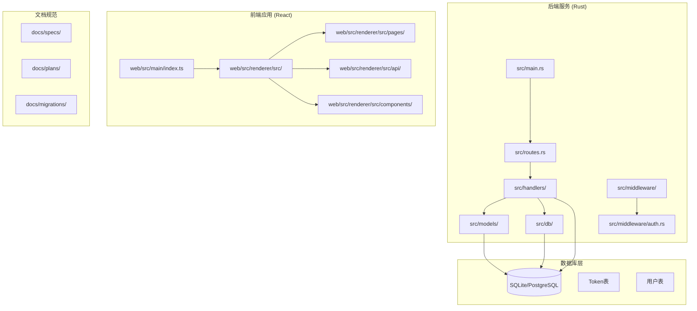
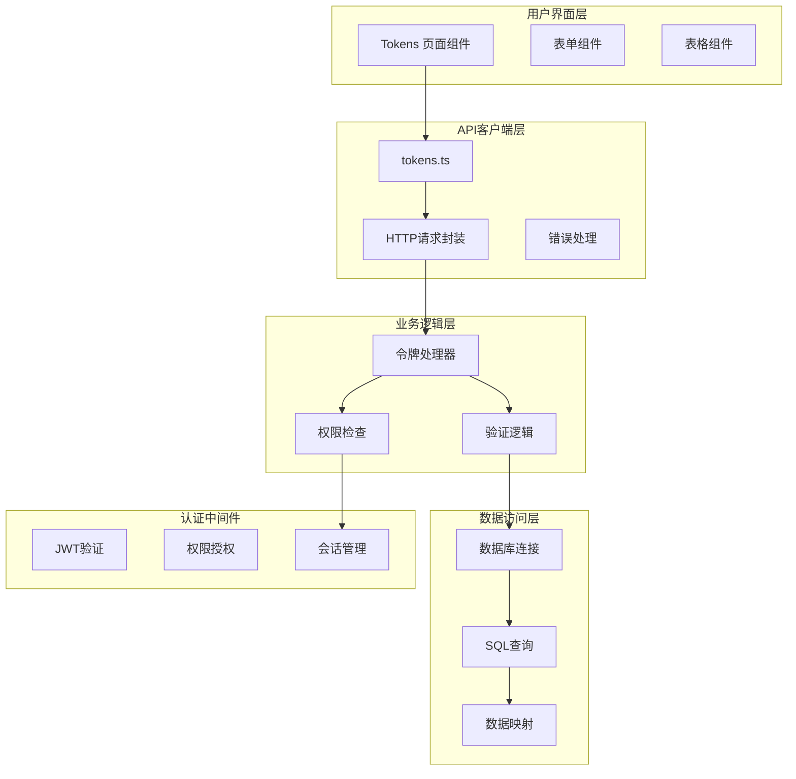
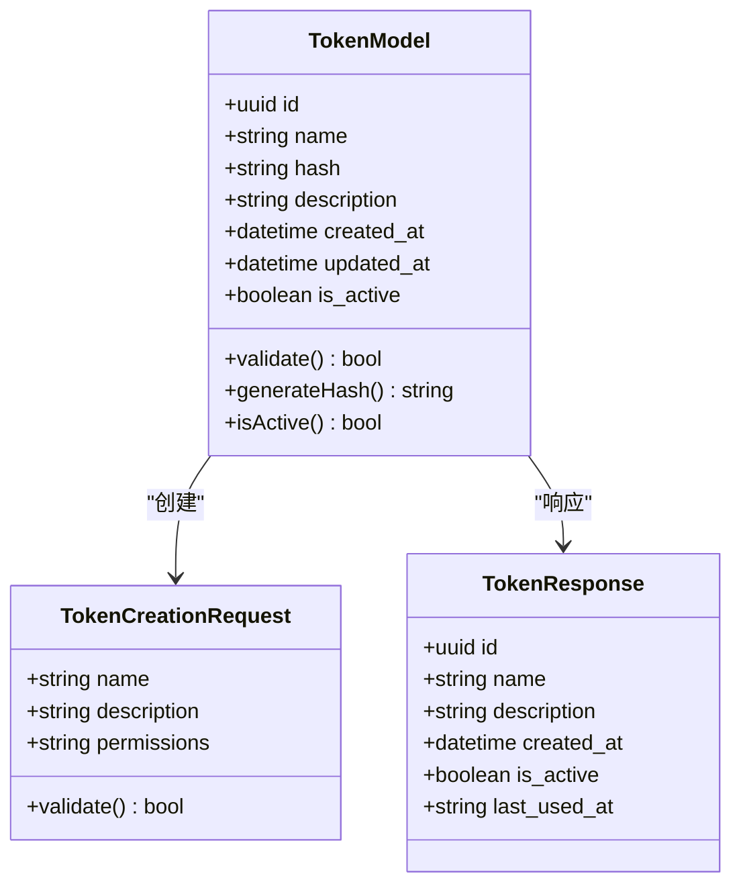
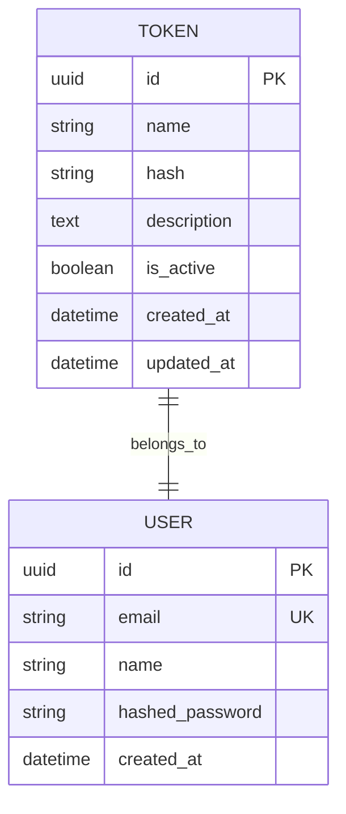
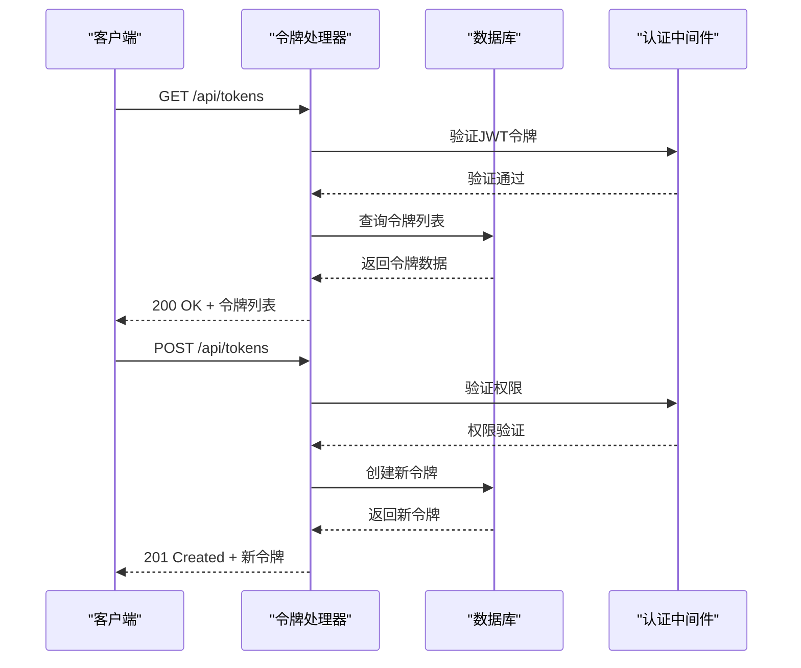
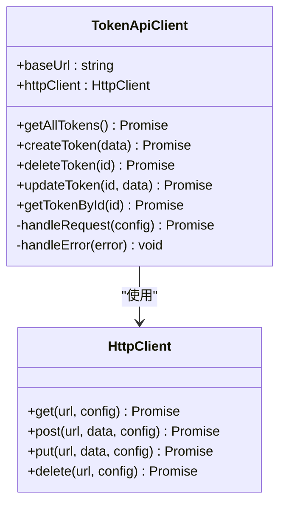
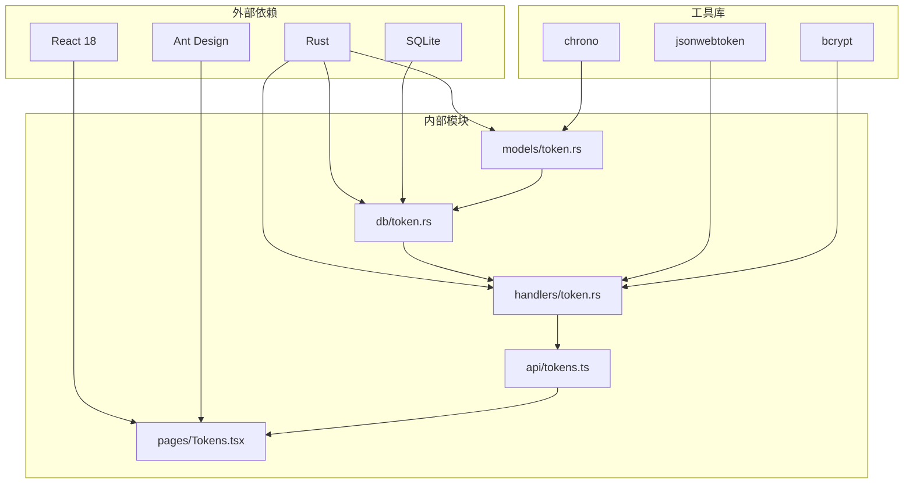

# 令牌管理页面

<cite>
**本文档引用的文件**
- [src/db/token.rs](file://src/db/token.rs)
- [src/models/token.rs](file://src/models/token.rs)
- [src/handlers/token.rs](file://src/handlers/token.rs)
- [web/src/renderer/src/api/tokens.ts](file://web/src/renderer/src/api/tokens.ts)
- [web/src/renderer/src/pages/Tokens.tsx](file://web/src/renderer/src/pages/Tokens.tsx)
- [web/src/renderer/src/theme/tokens.ts](file://web/src/renderer/src/theme/tokens.ts)
- [docs/specs/token-api/spec.md](file://docs/specs/token-api/spec.md)
- [docs/plans/03-auth-and-token-api.md](file://docs/plans/03-auth-and-token-api.md)
- [docs/migrations/20260609000002_token_hash.sql](file://docs/migrations/20260609000002_token_hash.sql)
</cite>

## 目录
1. [项目概述](#项目概述)
2. [项目结构](#项目结构)
3. [核心组件](#核心组件)
4. [架构概览](#架构概览)
5. [详细组件分析](#详细组件分析)
6. [依赖关系分析](#依赖关系分析)
7. [性能考虑](#性能考虑)
8. [故障排除指南](#故障排除指南)
9. [结论](#结论)

## 项目概述

AI趋势工具是一个基于Rust后端和React前端的现代化Web应用，专门用于监控和分析AI领域的热点趋势。该项目采用前后端分离架构，后端使用Rust语言开发，前端使用TypeScript和React技术栈。

令牌管理页面是该系统中的一个关键功能模块，负责管理用户访问令牌的创建、验证、更新和删除操作。该页面提供了完整的令牌生命周期管理功能，确保系统的安全性和可访问性。

## 项目结构

该项目采用模块化的组织方式，主要分为以下几个核心部分：

**图表来源**
- [src/main.rs:1-50](file://src/main.rs#L1-L50)
- [src/routes.rs:1-100](file://src/routes.rs#L1-L100)
- [web/src/main/index.ts:1-50](file://web/src/main/index.ts#L1-L50)

**章节来源**
- [src/main.rs:1-100](file://src/main.rs#L1-L100)
- [web/src/main/index.ts:1-100](file://web/src/main/index.ts#L1-L100)

## 核心组件

令牌管理页面的核心组件包括：

### 后端组件
- **数据模型**: 定义令牌的数据结构和验证规则
- **数据库层**: 处理令牌的持久化存储和查询操作
- **处理器层**: 实现令牌API的具体业务逻辑
- **认证中间件**: 提供令牌验证和权限控制

### 前端组件
- **API客户端**: 封装与后端的通信接口
- **页面组件**: 实现令牌管理界面的用户交互
- **主题系统**: 提供统一的设计令牌和样式管理

**章节来源**
- [src/models/token.rs:1-100](file://src/models/token.rs#L1-L100)
- [src/db/token.rs:1-100](file://src/db/token.rs#L1-L100)
- [src/handlers/token.rs:1-100](file://src/handlers/token.rs#L1-L100)
- [web/src/renderer/src/api/tokens.ts:1-100](file://web/src/renderer/src/api/tokens.ts#L1-L100)

## 架构概览

令牌管理页面采用分层架构设计，确保了良好的可维护性和扩展性：

**图表来源**
- [web/src/renderer/src/pages/Tokens.tsx:1-200](file://web/src/renderer/src/pages/Tokens.tsx#L1-L200)
- [web/src/renderer/src/api/tokens.ts:1-200](file://web/src/renderer/src/api/tokens.ts#L1-L200)
- [src/handlers/token.rs:1-200](file://src/handlers/token.rs#L1-L200)

## 详细组件分析

### 数据模型设计

令牌数据模型定义了令牌的基本属性和约束条件：

**图表来源**
- [src/models/token.rs:1-150](file://src/models/token.rs#L1-L150)

令牌模型的关键特性包括：
- **唯一标识符**: 使用UUID确保令牌的唯一性
- **哈希存储**: 敏感信息以哈希形式存储
- **状态管理**: 支持令牌的启用/禁用状态
- **时间戳**: 记录创建和更新时间

**章节来源**
- [src/models/token.rs:1-200](file://src/models/token.rs#L1-L200)

### 数据库层实现

数据库层负责令牌的持久化存储和高效查询：

**图表来源**
- [src/db/token.rs:1-150](file://src/db/token.rs#L1-L150)

数据库设计考虑了以下因素：
- **索引优化**: 为常用查询字段建立索引
- **数据完整性**: 使用外键约束确保数据一致性
- **性能优化**: 针对高频查询进行优化

**章节来源**
- [src/db/token.rs:1-200](file://src/db/token.rs#L1-L200)

### API处理器实现

API处理器实现了令牌管理的核心业务逻辑：

**图表来源**
- [src/handlers/token.rs:1-200](file://src/handlers/token.rs#L1-L200)

**章节来源**
- [src/handlers/token.rs:1-250](file://src/handlers/token.rs#L1-L250)

### 前端页面组件

前端页面组件提供了用户友好的令牌管理界面：

**图表来源**
- [web/src/renderer/src/pages/Tokens.tsx:1-200](file://web/src/renderer/src/pages/Tokens.tsx#L1-L200)

**章节来源**
- [web/src/renderer/src/pages/Tokens.tsx:1-300](file://web/src/renderer/src/pages/Tokens.tsx#L1-L300)

### API客户端封装

API客户端提供了统一的后端通信接口：

**图表来源**
- [web/src/renderer/src/api/tokens.ts:1-200](file://web/src/renderer/src/api/tokens.ts#L1-L200)

**章节来源**
- [web/src/renderer/src/api/tokens.ts:1-200](file://web/src/renderer/src/api/tokens.ts#L1-L200)

## 依赖关系分析

令牌管理页面的依赖关系体现了清晰的分层架构：

**图表来源**
- [Cargo.toml:1-50](file://Cargo.toml#L1-L50)
- [web/package.json:1-50](file://web/package.json#L1-L50)

**章节来源**
- [Cargo.toml:1-100](file://Cargo.toml#L1-L100)
- [web/package.json:1-100](file://web/package.json#L1-L100)

## 性能考虑

令牌管理页面在设计时充分考虑了性能优化：

### 数据库查询优化
- **索引策略**: 在常用查询字段上建立适当索引
- **查询缓存**: 对频繁访问的数据实施缓存机制
- **批量操作**: 支持批量令牌操作以减少数据库往返

### 前端性能优化
- **虚拟滚动**: 对大量令牌数据实施虚拟滚动
- **懒加载**: 按需加载令牌详情信息
- **状态缓存**: 缓存API响应以减少网络请求

### 安全性能平衡
- **令牌哈希**: 使用高性能的哈希算法
- **内存安全**: Rust语言提供内存安全保障
- **并发处理**: 支持高并发的令牌操作

## 故障排除指南

### 常见问题及解决方案

**令牌验证失败**
- 检查JWT令牌格式是否正确
- 验证令牌是否在有效期内
- 确认用户权限是否足够

**数据库连接问题**
- 检查数据库配置参数
- 验证数据库服务状态
- 查看连接池配置

**前端API调用错误**
- 检查网络连接状态
- 验证API端点URL
- 查看浏览器开发者工具中的错误信息

**章节来源**
- [src/error.rs:1-100](file://src/error.rs#L1-L100)
- [web/src/renderer/src/lib/notification.ts:1-100](file://web/src/renderer/src/lib/notification.ts#L1-L100)

## 结论

令牌管理页面作为AI趋势工具的重要组成部分，展现了现代Web应用开发的最佳实践。通过采用前后端分离架构、模块化设计和严格的安全措施，该页面提供了可靠的令牌管理功能。

### 主要优势
- **安全性**: 采用JWT认证和哈希存储机制
- **可扩展性**: 清晰的分层架构支持功能扩展
- **用户体验**: 响应式设计和直观的操作界面
- **性能**: 优化的数据库查询和前端渲染

### 技术亮点
- **Rust后端**: 内存安全和高性能的后端服务
- **React前端**: 组件化开发和现代化工具链
- **类型安全**: TypeScript提供编译时错误检测
- **文档驱动**: 完整的规格说明和迁移文档

该令牌管理页面为整个AI趋势工具系统奠定了坚实的基础，为后续的功能扩展和维护提供了良好的框架。