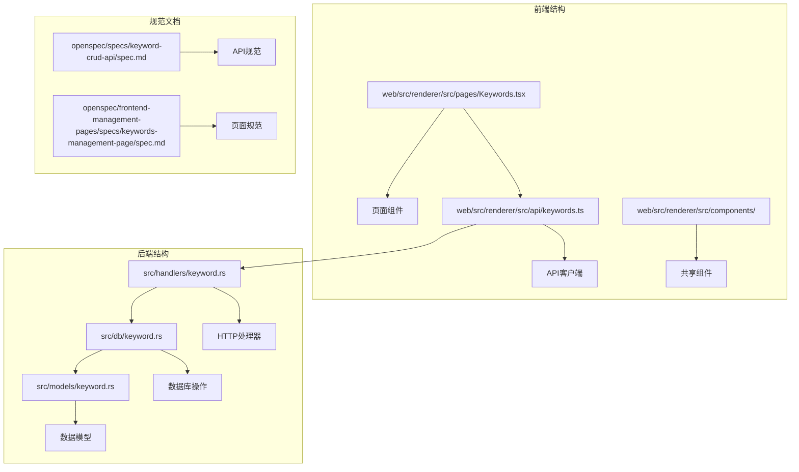
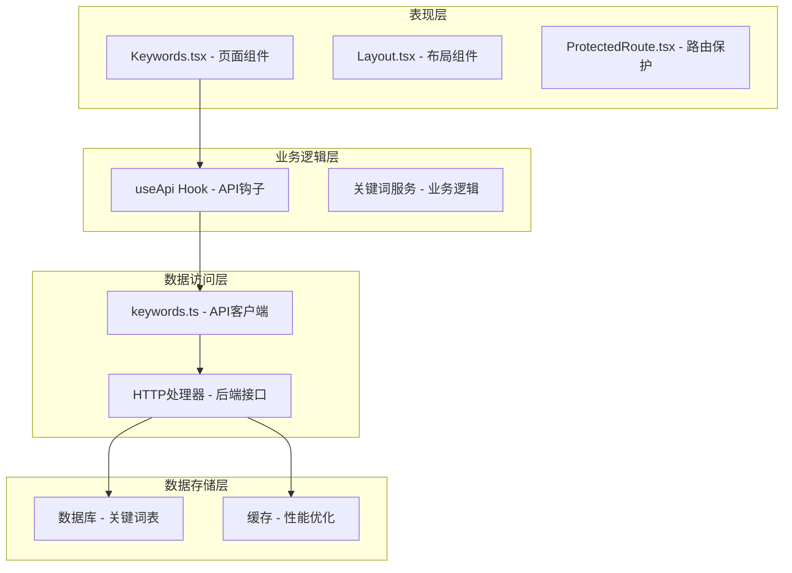
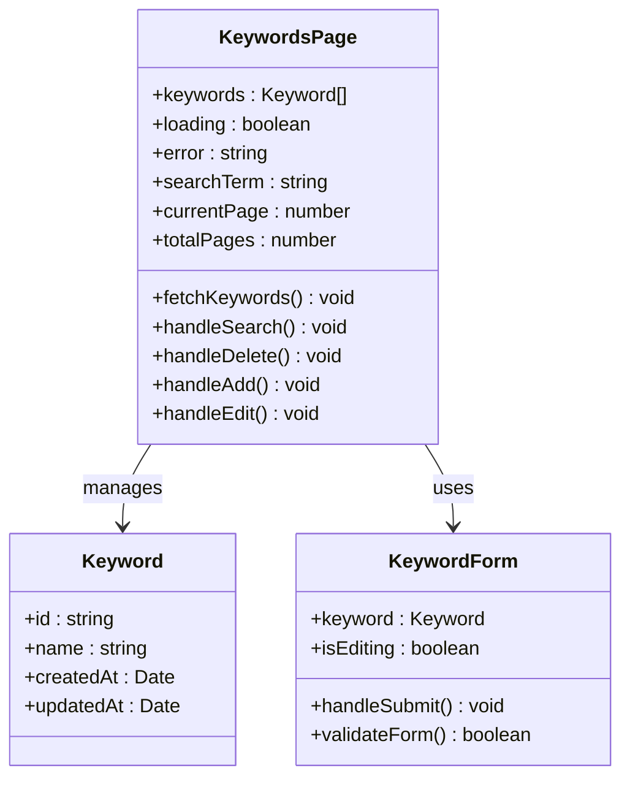
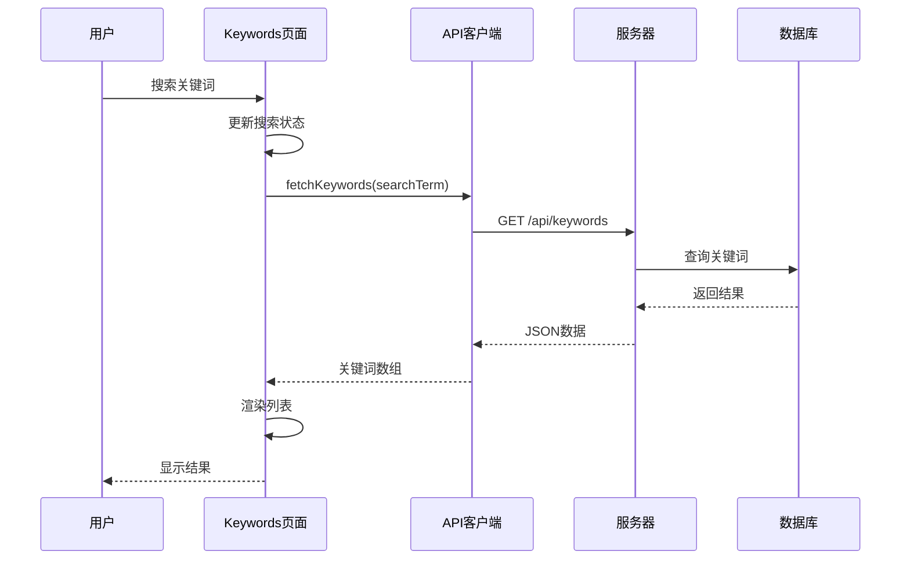
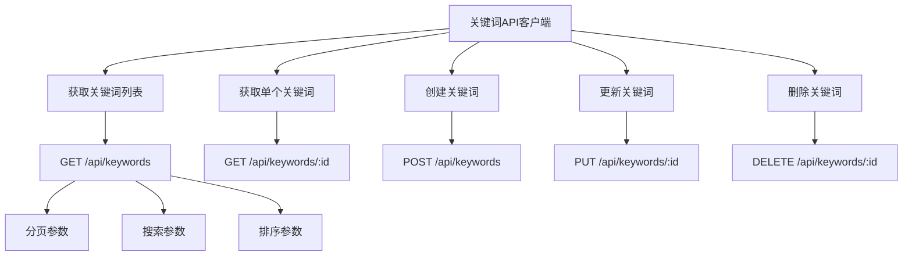
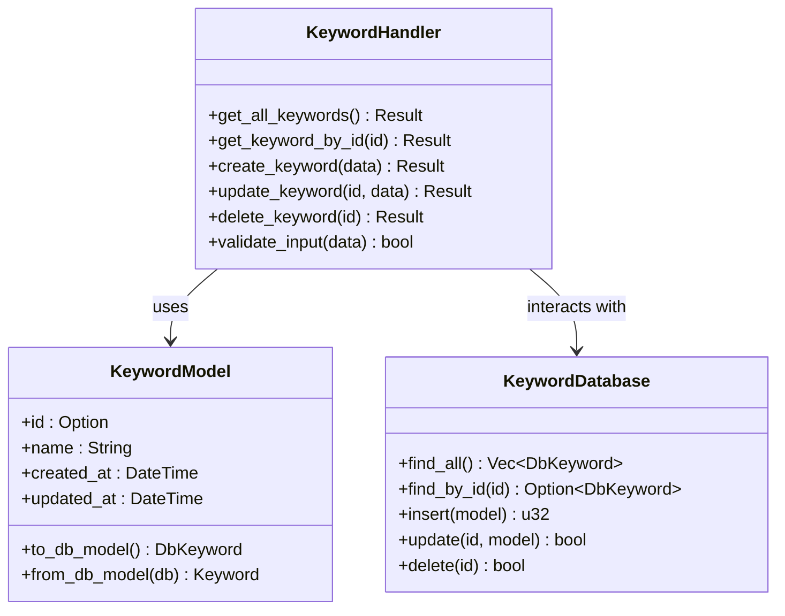
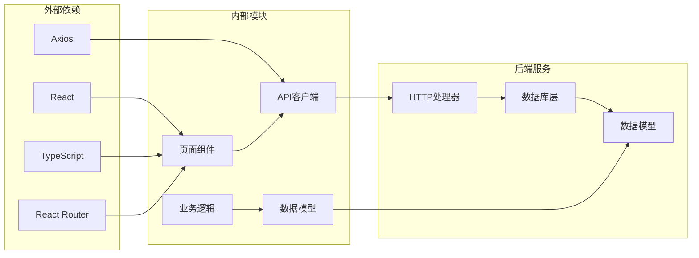

# 关键词管理页面

<cite>
**本文档引用的文件**
- [Keywords.tsx](file://web/src/renderer/src/pages/Keywords.tsx)
- [keywords.ts](file://web/src/renderer/src/api/keywords.ts)
- [keyword-crud-api.spec.md](file://openspec/specs/keyword-crud-api/spec.md)
- [keywords-management-page.spec.md](file://openspec/frontend-management-pages/specs/keywords-management-page/spec.md)
- [keyword.rs](file://src/models/keyword.rs)
- [keyword.rs](file://src/db/keyword.rs)
- [keyword.rs](file://src/handlers/keyword.rs)
</cite>

## 目录
1. [简介](#简介)
2. [项目结构](#项目结构)
3. [核心组件](#核心组件)
4. [架构概览](#架构概览)
5. [详细组件分析](#详细组件分析)
6. [依赖关系分析](#依赖关系分析)
7. [性能考虑](#性能考虑)
8. [故障排除指南](#故障排除指南)
9. [结论](#结论)

## 简介

关键词管理页面是AI趋势工具项目中的一个关键功能模块，负责管理和维护系统中的关键词数据。该页面提供了完整的CRUD（创建、读取、更新、删除）操作界面，允许管理员对关键词进行增删改查操作，同时支持关键词的搜索、过滤和批量管理功能。

该项目采用前后端分离架构，前端使用React技术栈，后端使用Rust语言开发，通过RESTful API进行数据交互。关键词管理页面作为前端管理界面的一部分，为用户提供直观易用的操作界面。

## 项目结构

关键词管理页面在项目中的组织结构如下：

**图表来源**
- [Keywords.tsx:1-50](file://web/src/renderer/src/pages/Keywords.tsx#L1-L50)
- [keywords.ts:1-40](file://web/src/renderer/src/api/keywords.ts#L1-L40)
- [keyword.rs:1-80](file://src/models/keyword.rs#L1-L80)

**章节来源**
- [Keywords.tsx:1-100](file://web/src/renderer/src/pages/Keywords.tsx#L1-L100)
- [keywords.ts:1-80](file://web/src/renderer/src/api/keywords.ts#L1-L80)

## 核心组件

关键词管理页面的核心组件包括：

### 页面组件
- **Keywords.tsx**: 主要的页面组件，负责渲染关键词管理界面
- 实现了关键词列表展示、搜索过滤、分页功能
- 提供新增、编辑、删除等操作按钮

### API客户端
- **keywords.ts**: 封装了所有与关键词相关的API调用
- 包含CRUD操作的HTTP请求方法
- 处理API响应和错误处理

### 数据模型
- **keyword.rs (models)**: 定义了关键词的数据结构和验证规则
- 包含关键词的基本属性和业务逻辑
- 支持数据序列化和反序列化

**章节来源**
- [Keywords.tsx:1-200](file://web/src/renderer/src/pages/Keywords.tsx#L1-L200)
- [keywords.ts:1-150](file://web/src/renderer/src/api/keywords.ts#L1-L150)
- [keyword.rs:1-120](file://src/models/keyword.rs#L1-L120)

## 架构概览

关键词管理页面采用分层架构设计，确保前后端分离和职责清晰：

**图表来源**
- [Keywords.tsx:1-80](file://web/src/renderer/src/pages/Keywords.tsx#L1-L80)
- [keywords.ts:1-60](file://web/src/renderer/src/api/keywords.ts#L1-L60)
- [keyword.rs:1-100](file://src/handlers/keyword.rs#L1-L100)

## 详细组件分析

### 页面组件分析

关键词管理页面组件具有以下特点：

#### 组件结构

**图表来源**
- [Keywords.tsx:1-120](file://web/src/renderer/src/pages/Keywords.tsx#L1-L120)

#### 数据流处理

**图表来源**
- [Keywords.tsx:60-120](file://web/src/renderer/src/pages/Keywords.tsx#L60-L120)
- [keywords.ts:20-60](file://web/src/renderer/src/api/keywords.ts#L20-L60)

**章节来源**
- [Keywords.tsx:1-200](file://web/src/renderer/src/pages/Keywords.tsx#L1-L200)

### API客户端分析

关键词API客户端提供了完整的CRUD操作：

#### API方法定义

**图表来源**
- [keywords.ts:1-120](file://web/src/renderer/src/api/keywords.ts#L1-L120)

**章节来源**
- [keywords.ts:1-200](file://web/src/renderer/src/api/keywords.ts#L1-L200)

### 后端处理流程

后端关键词处理器实现了完整的业务逻辑：

#### 处理器架构

**图表来源**
- [keyword.rs:1-150](file://src/handlers/keyword.rs#L1-L150)
- [keyword.rs:1-100](file://src/models/keyword.rs#L1-L100)

**章节来源**
- [keyword.rs:1-200](file://src/handlers/keyword.rs#L1-L200)
- [keyword.rs:1-150](file://src/models/keyword.rs#L1-L150)

## 依赖关系分析

关键词管理页面的依赖关系体现了清晰的分层架构：

**图表来源**
- [Keywords.tsx:1-40](file://web/src/renderer/src/pages/Keywords.tsx#L1-L40)
- [keywords.ts:1-40](file://web/src/renderer/src/api/keywords.ts#L1-L40)

**章节来源**
- [Keywords.tsx:1-80](file://web/src/renderer/src/pages/Keywords.tsx#L1-L80)
- [keywords.ts:1-80](file://web/src/renderer/src/api/keywords.ts#L1-L80)

## 性能考虑

关键词管理页面在设计时充分考虑了性能优化：

### 前端性能优化
- **虚拟滚动**: 对于大量关键词数据，实现虚拟滚动以减少DOM节点数量
- **防抖搜索**: 搜索功能使用防抖机制，避免频繁的API调用
- **缓存策略**: 利用浏览器缓存和内存缓存减少重复请求
- **懒加载**: 图片和大数据内容采用懒加载方式

### 后端性能优化
- **数据库索引**: 关键词表建立适当的索引以提高查询性能
- **分页查询**: 默认实现分页机制，限制单次查询数据量
- **连接池**: 使用数据库连接池管理数据库连接
- **异步处理**: 非阻塞I/O操作提高并发处理能力

## 故障排除指南

### 常见问题及解决方案

#### API调用失败
**症状**: 页面无法加载关键词数据或显示错误信息
**可能原因**:
- 后端服务未启动
- 网络连接问题
- 认证令牌过期

**解决步骤**:
1. 检查后端服务状态
2. 验证网络连接
3. 重新登录获取新令牌
4. 查看浏览器开发者工具的网络面板

#### 数据显示异常
**症状**: 关键词列表显示不完整或格式错误
**可能原因**:
- 分页参数错误
- 数据格式不匹配
- 缓存数据过期

**解决步骤**:
1. 清除浏览器缓存
2. 检查API响应格式
3. 验证数据模型定义
4. 重新加载页面

#### 搜索功能失效
**症状**: 搜索框输入无响应或返回空结果
**可能原因**:
- 搜索参数未正确传递
- 数据库查询条件错误
- 搜索索引未建立

**解决步骤**:
1. 检查搜索API调用
2. 验证数据库查询语句
3. 确认搜索字段索引
4. 测试直接数据库查询

**章节来源**
- [Keywords.tsx:150-200](file://web/src/renderer/src/pages/Keywords.tsx#L150-L200)
- [keywords.ts:100-150](file://web/src/renderer/src/api/keywords.ts#L100-L150)

## 结论

关键词管理页面作为AI趋势工具的重要组成部分，展现了现代Web应用的最佳实践。通过前后端分离架构、清晰的分层设计和完善的错误处理机制，该页面为用户提供了稳定可靠的关键词管理体验。

该页面的成功实现体现了以下关键要素：
- **用户体验优先**: 直观的界面设计和流畅的交互体验
- **技术架构合理**: 清晰的分层结构和良好的代码组织
- **性能优化到位**: 多层次的性能优化策略确保系统高效运行
- **可维护性强**: 规范化的代码结构便于后续维护和扩展

未来可以考虑的功能增强包括：关键词导入导出功能、批量操作优化、实时数据同步等，以进一步提升用户体验和系统功能完整性。