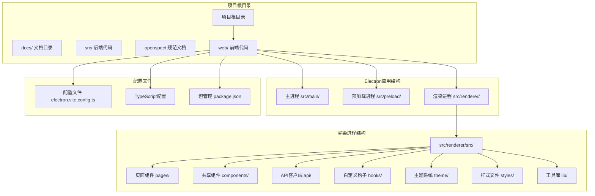
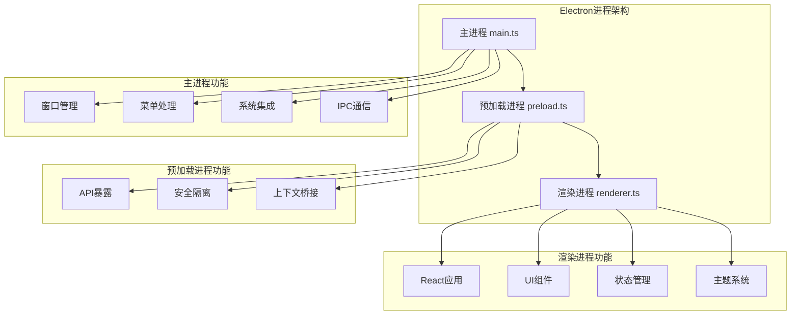
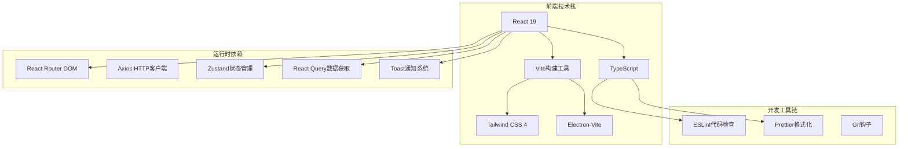
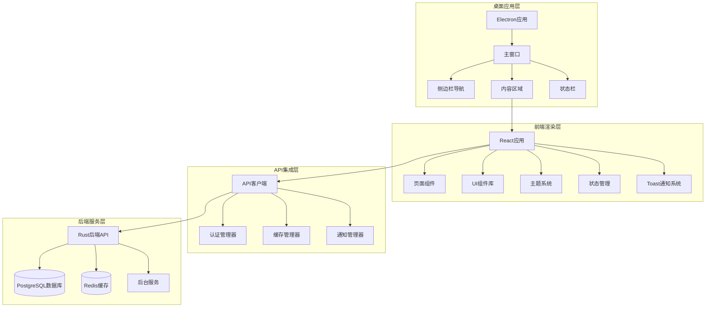
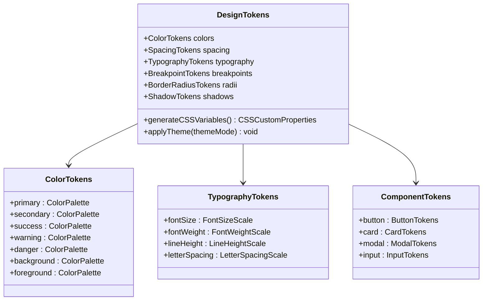
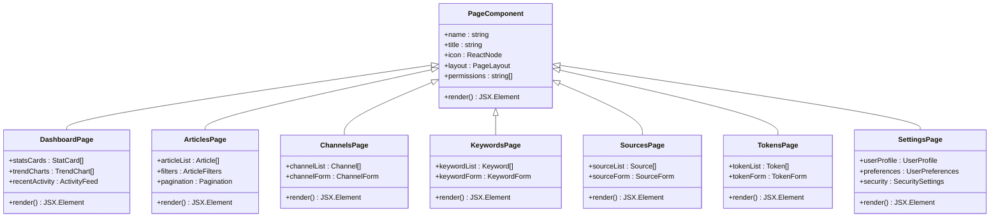
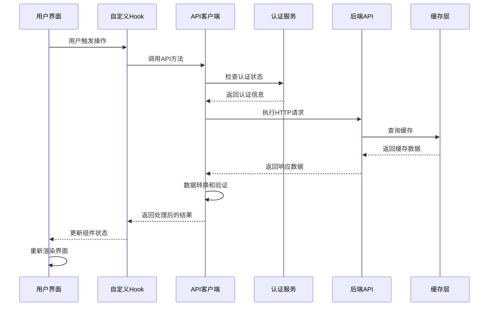
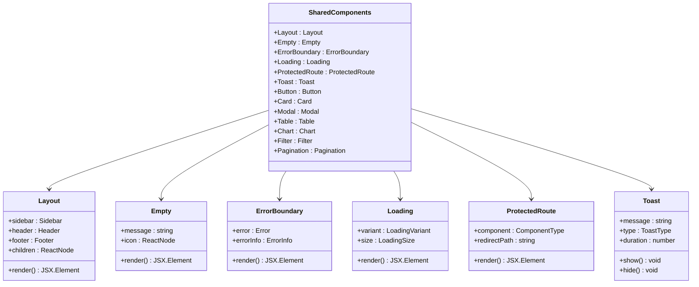
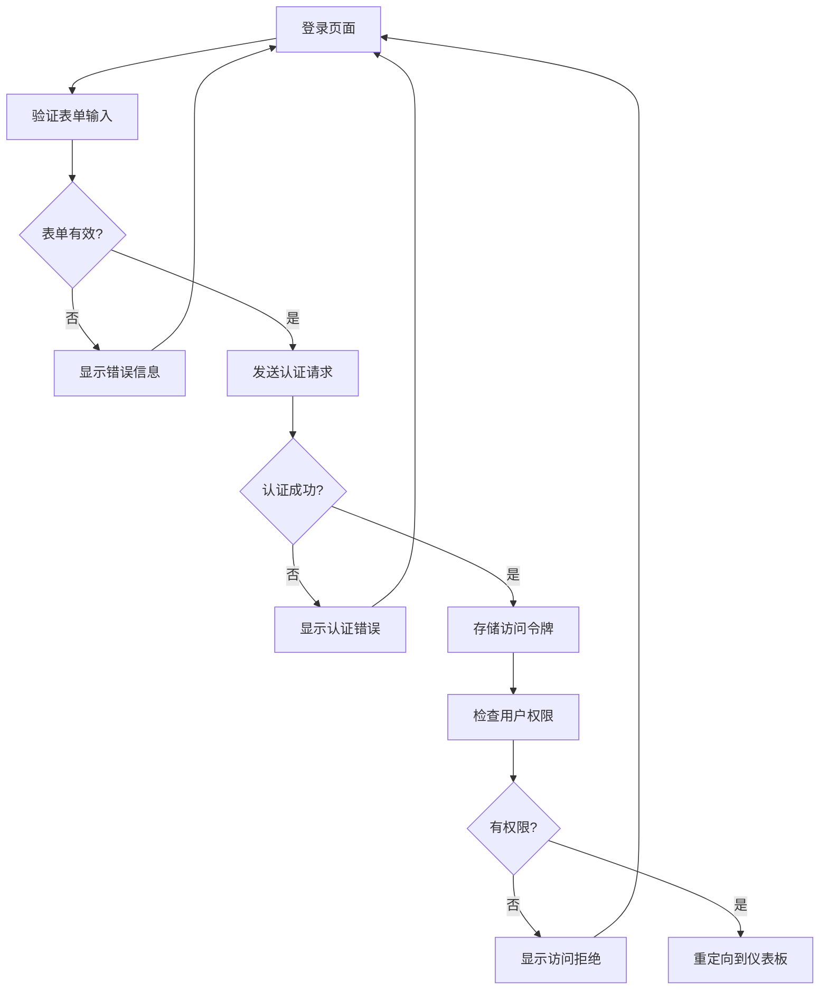
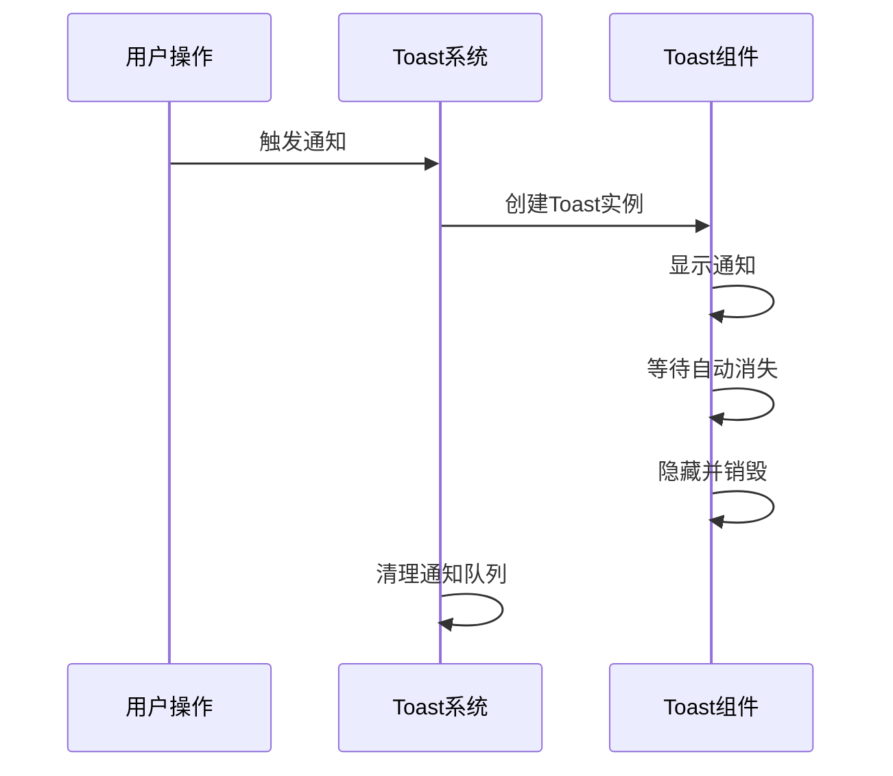

# 前端开发指南

<cite>
**本文档引用的文件**
- [README.md](file://README.md)
- [electron.vite.config.ts](file://web/electron.vite.config.ts)
- [package.json](file://web/package.json)
- [tsconfig.json](file://web/tsconfig.json)
- [tsconfig.node.json](file://web/tsconfig.node.json)
- [tsconfig.web.json](file://web/tsconfig.web.json)
- [main.tsx](file://web/src/renderer/src/main.tsx)
- [App.tsx](file://web/src/renderer/src/App.tsx)
- [env.d.ts](file://web/src/renderer/src/env.d.ts)
- [index.html](file://web/src/renderer/index.html)
- [channels.ts](file://web/src/renderer/src/api/channels.ts)
- [client.ts](file://web/src/renderer/src/api/client.ts)
- [keywords.ts](file://web/src/renderer/src/api/keywords.ts)
- [queries.ts](file://web/src/renderer/src/api/queries.ts)
- [sources.ts](file://web/src/renderer/src/api/sources.ts)
- [tokens.ts](file://web/src/renderer/src/api/tokens.ts)
- [Layout.tsx](file://web/src/renderer/src/components/Layout.tsx)
- [Empty.tsx](file://web/src/renderer/src/components/Empty.tsx)
- [ErrorBoundary.tsx](file://web/src/renderer/src/components/ErrorBoundary.tsx)
- [Loading.tsx](file://web/src/renderer/src/components/Loading.tsx)
- [ProtectedRoute.tsx](file://web/src/renderer/src/components/ProtectedRoute.tsx)
- [Toast.tsx](file://web/src/renderer/src/components/Toast.tsx)
- [useApi.ts](file://web/src/renderer/src/hooks/useApi.ts)
- [useMessage.ts](file://web/src/renderer/src/hooks/useMessage.ts)
- [notification.ts](file://web/src/renderer/src/lib/notification.ts)
- [Articles.tsx](file://web/src/renderer/src/pages/Articles.tsx)
- [Auth.tsx](file://web/src/renderer/src/pages/Auth.tsx)
- [Channels.tsx](file://web/src/renderer/src/pages/Channels.tsx)
- [Dashboard.tsx](file://web/src/renderer/src/pages/Dashboard.tsx)
- [Keywords.tsx](file://web/src/renderer/src/pages/Keywords.tsx)
- [Settings.tsx](file://web/src/renderer/src/pages/Settings.tsx)
- [Sources.tsx](file://web/src/renderer/src/pages/Sources.tsx)
- [Tokens.tsx](file://web/src/renderer/src/pages/Tokens.tsx)
- [config.tsx](file://web/src/renderer/src/theme/config.tsx)
- [tokens.ts](file://web/src/renderer/src/theme/tokens.ts)
- [index.css](file://web/src/renderer/src/styles/index.css)
- [index.ts](file://web/src/main/index.ts)
- [index.ts](file://web/src/preload/index.ts)
- [index.d.ts](file://web/src/preload/index.d.ts)
- [design-token-system规范.md](file://openspec/specs/design-token-system/spec.md)
- [frontend-project-scaffold规范.md](file://openspec/specs/frontend-project-scaffold/spec.md)
- [app-layout规范.md](file://openspec/specs/app-layout/spec.md)
- [shared-components规范.md](file://openspec/specs/shared-components/spec.md)
- [api-client-layer规范.md](file://openspec/specs/api-client-layer/spec.md)
- [auth-page规范.md](file://openspec/specs/auth-page/spec.md)
</cite>

## 更新摘要
**所做更改**
- 更新项目架构以反映从静态HTML模板到Electron + React 19 + Vite + TypeScript桌面应用的完整转变
- 添加现代化前端开发流程和组件系统文档
- 更新设计令牌系统和主题配置说明
- 新增API集成层和类型安全架构描述
- 更新开发工具链和构建配置
- 新增Toast通知系统和增强的CSS样式系统
- 完成Channels、Keywords、Sources、Tokens、Settings管理页面的完整实现

## 目录
1. [项目概述](#项目概述)
2. [项目结构](#项目结构)
3. [核心组件](#核心组件)
4. [架构概览](#架构概览)
5. [详细组件分析](#详细组件分析)
6. [依赖关系分析](#依赖关系分析)
7. [性能考虑](#性能考虑)
8. [故障排除指南](#故障排除指南)
9. [结论](#结论)

## 项目概述

AI趋势工具现已发展为一个完整的Electron桌面应用程序，采用现代化的前端技术栈。该应用结合了Rust后端服务和基于React 19、TypeScript、Vite构建的桌面前端，提供强大的AI趋势监控和分析功能。

### 主要特性
- **桌面应用体验**：基于Electron的原生桌面应用，支持Windows、macOS和Linux
- **现代化前端架构**：React 19 + TypeScript + Vite + Tailwind CSS 4
- **实时数据监控**：AI领域热点事件的实时追踪和可视化
- **类型安全API**：完整的TypeScript API客户端层
- **响应式设计**：自适应桌面界面和主题系统
- **用户认证**：安全的令牌管理和会话控制
- **Toast通知系统**：实时反馈和用户交互提示
- **完整管理页面**：Channels、Keywords、Sources、Tokens、Settings的完整实现

## 项目结构

项目采用模块化的Electron + React架构，前端代码位于`web/src`目录中，包含完整的渲染进程和主进程代码。



**图表来源**
- [electron.vite.config.ts](file://web/electron.vite.config.ts)
- [main.tsx](file://web/src/renderer/src/main.tsx)
- [App.tsx](file://web/src/renderer/src/App.tsx)
- [package.json](file://web/package.json)

**章节来源**
- [electron.vite.config.ts](file://web/electron.vite.config.ts)
- [main.tsx](file://web/src/renderer/src/main.tsx)
- [App.tsx](file://web/src/renderer/src/App.tsx)

## 核心组件

### Electron桌面应用架构

应用采用标准的Electron三进程架构，确保安全性和性能隔离。



**图表来源**
- [index.ts](file://web/src/main/index.ts)
- [index.ts](file://web/src/preload/index.ts)
- [main.tsx](file://web/src/renderer/src/main.tsx)

### 现代化前端技术栈

应用采用最新的前端技术组合，提供最佳的开发体验和性能表现。



**图表来源**
- [package.json](file://web/package.json)
- [tsconfig.json](file://web/tsconfig.json)

**章节来源**
- [package.json](file://web/package.json)
- [tsconfig.json](file://web/tsconfig.json)

## 架构概览

系统采用完整的桌面应用架构，从前端渲染到后端服务形成完整的数据流。



**图表来源**
- [App.tsx](file://web/src/renderer/src/App.tsx)
- [client.ts](file://web/src/renderer/src/api/client.ts)
- [Auth.tsx](file://web/src/renderer/src/pages/Auth.tsx)

## 详细组件分析

### 设计令牌系统

统一的设计令牌系统确保视觉一致性和可维护性，支持深色和浅色主题。



**图表来源**
- [tokens.ts](file://web/src/renderer/src/theme/tokens.ts)
- [config.tsx](file://web/src/renderer/src/theme/config.tsx)

### 页面组件系统

应用采用模块化的页面组件架构，每个页面都是独立的功能模块。现已完成Channels、Keywords、Sources、Tokens、Settings管理页面的完整实现。



**图表来源**
- [Dashboard.tsx](file://web/src/renderer/src/pages/Dashboard.tsx)
- [Articles.tsx](file://web/src/renderer/src/pages/Articles.tsx)
- [Channels.tsx](file://web/src/renderer/src/pages/Channels.tsx)
- [Keywords.tsx](file://web/src/renderer/src/pages/Keywords.tsx)
- [Sources.tsx](file://web/src/renderer/src/pages/Sources.tsx)
- [Tokens.tsx](file://web/src/renderer/src/pages/Tokens.tsx)
- [Settings.tsx](file://web/src/renderer/src/pages/Settings.tsx)

### API客户端层

统一的API客户端层提供类型安全的数据访问和错误处理机制。



**图表来源**
- [useApi.ts](file://web/src/renderer/src/hooks/useApi.ts)
- [client.ts](file://web/src/renderer/src/api/client.ts)

### 共享组件库

组件库提供可重用的UI元素，支持快速开发和一致性保证。新增Toast通知系统作为核心组件之一。



**图表来源**
- [Layout.tsx](file://web/src/renderer/src/components/Layout.tsx)
- [Empty.tsx](file://web/src/renderer/src/components/Empty.tsx)
- [ErrorBoundary.tsx](file://web/src/renderer/src/components/ErrorBoundary.tsx)
- [Loading.tsx](file://web/src/renderer/src/components/Loading.tsx)
- [ProtectedRoute.tsx](file://web/src/renderer/src/components/ProtectedRoute.tsx)
- [Toast.tsx](file://web/src/renderer/src/components/Toast.tsx)

### 认证和权限管理

安全的用户认证流程确保系统的安全性，支持多种认证方式和权限控制。



**图表来源**
- [Auth.tsx](file://web/src/renderer/src/pages/Auth.tsx)
- [ProtectedRoute.tsx](file://web/src/renderer/src/components/ProtectedRoute.tsx)

### Toast通知系统

新增的Toast通知系统提供实时反馈和用户交互提示，支持多种通知类型和自动消失功能。



**图表来源**
- [Toast.tsx](file://web/src/renderer/src/components/Toast.tsx)
- [notification.ts](file://web/src/renderer/src/lib/notification.ts)
- [useMessage.ts](file://web/src/renderer/src/hooks/useMessage.ts)

**章节来源**
- [Auth.tsx](file://web/src/renderer/src/pages/Auth.tsx)
- [ProtectedRoute.tsx](file://web/src/renderer/src/components/ProtectedRoute.tsx)
- [Toast.tsx](file://web/src/renderer/src/components/Toast.tsx)
- [notification.ts](file://web/src/renderer/src/lib/notification.ts)

## 依赖关系分析

前端项目的主要依赖关系如下：

```mermaid
graph LR
subgraph "运行时依赖"
React[React 19+]
ReactDOM[ReactDOM]
Electron[Electron]
Axios[Axios HTTP客户端]
ReactRouter[React Router DOM]
Zustand[Zustand状态管理]
ReactQuery[React Query]
TailwindCSS[Tailwind CSS 4]
dayjs[Day.js日期处理]
clsx[CLSX类名合并]
cn[CN工具函数]
Toast[Toast通知系统]
end
subgraph "开发依赖"
Vite[Vite构建工具]
TypeScript[TypeScript]
ESLint[ESLint代码检查]
Prettier[Prettier格式化]
TailwindCSSPlugin[@tailwindcss/vite插件]
ElectronVite[electron-vite]
@types/react[@types/react]
@types/node[@types/node]
end
subgraph "工具链"
Node(Node.js 18+)
NPM[NPM包管理器]
ElectronBuilder[Electron Builder]
end
Node --> React
Node --> Vite
React --> ReactDOM
Vite --> ElectronVite
Vite --> TailwindCSSPlugin
TypeScript --> ESLint
TypeScript --> Prettier
Electron --> ElectronBuilder
```

**图表来源**
- [package.json](file://web/package.json)

**章节来源**
- [package.json](file://web/package.json)

## 性能考虑

### 前端性能优化策略

1. **模块化代码分割**
   - 使用React.lazy实现组件懒加载
   - 动态导入大型图表库
   - 分割路由相关的代码块

2. **状态管理优化**
   - 使用Zustand替代Redux，减少样板代码
   - 实现细粒度的状态选择器
   - 优化状态更新的性能

3. **渲染性能优化**
   - React.memo优化频繁更新的组件
   - useCallback稳定回调函数引用
   - useMemo计算结果缓存
   - 使用React 19的新特性提升性能

4. **资源优化**
   - 图片懒加载和压缩
   - CSS和JavaScript按需加载
   - Tailwind CSS的tree-shaking优化
   - Electron应用的资源打包

5. **缓存策略**
   - 实现智能API缓存机制
   - 使用React Query进行数据缓存
   - 浏览器本地存储优化

6. **Toast系统性能优化**
   - Toast实例池管理
   - 异步队列处理多个通知
   - 自动清理机制防止内存泄漏

## 故障排除指南

### 常见问题及解决方案

**Electron应用启动问题**
- 确认主进程入口文件正确配置
- 检查预加载脚本的安全配置
- 验证渲染进程的HTML模板

**TypeScript编译错误**
- 检查tsconfig.json配置文件
- 确认类型声明文件存在
- 验证模块解析路径配置

**API连接问题**
- 检查网络连接和防火墙设置
- 验证API端点URL配置
- 确认后端服务状态

**样式问题**
- 检查Tailwind CSS配置
- 验证CSS变量定义
- 确认主题系统正确应用

**Toast系统问题**
- 检查Toast组件的生命周期管理
- 验证通知队列的异步处理
- 确认自动消失定时器的正确设置

**性能问题**
- 监控内存使用情况
- 检查组件渲染性能
- 优化数据加载策略

**章节来源**
- [README.md](file://README.md)
- [electron.vite.config.ts](file://web/electron.vite.config.ts)

## 结论

AI趋势工具项目展现了现代桌面应用开发的最佳实践，从静态HTML模板发展为完整的Electron + React 19 + Vite + TypeScript应用。项目采用了模块化、类型安全、性能优化的设计原则。

### 关键优势
- **完整的桌面应用架构**：Electron三进程架构确保安全性和性能
- **现代化前端技术栈**：React 19 + TypeScript + Vite + Tailwind CSS 4
- **类型安全的API集成**：完整的TypeScript类型定义和验证
- **统一的设计系统**：可维护的设计令牌和主题系统
- **实时通知系统**：Toast通知提供良好的用户体验
- **完整的管理页面**：Channels、Keywords、Sources、Tokens、Settings的完整实现
- **优秀的开发体验**：完善的工具链和构建配置

### 发展建议
- 持续优化前端性能指标和用户体验
- 扩展组件库以支持更多UI场景
- 加强自动化测试覆盖和质量保证
- 完善开发工具链和CI/CD流程
- 考虑添加单元测试和集成测试框架
- 优化Electron应用的打包和分发流程
- 进一步完善Toast通知系统的功能和性能
- 增强管理页面的数据处理和用户交互体验