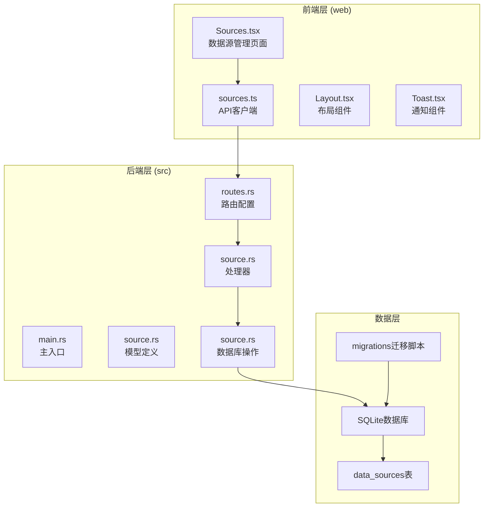
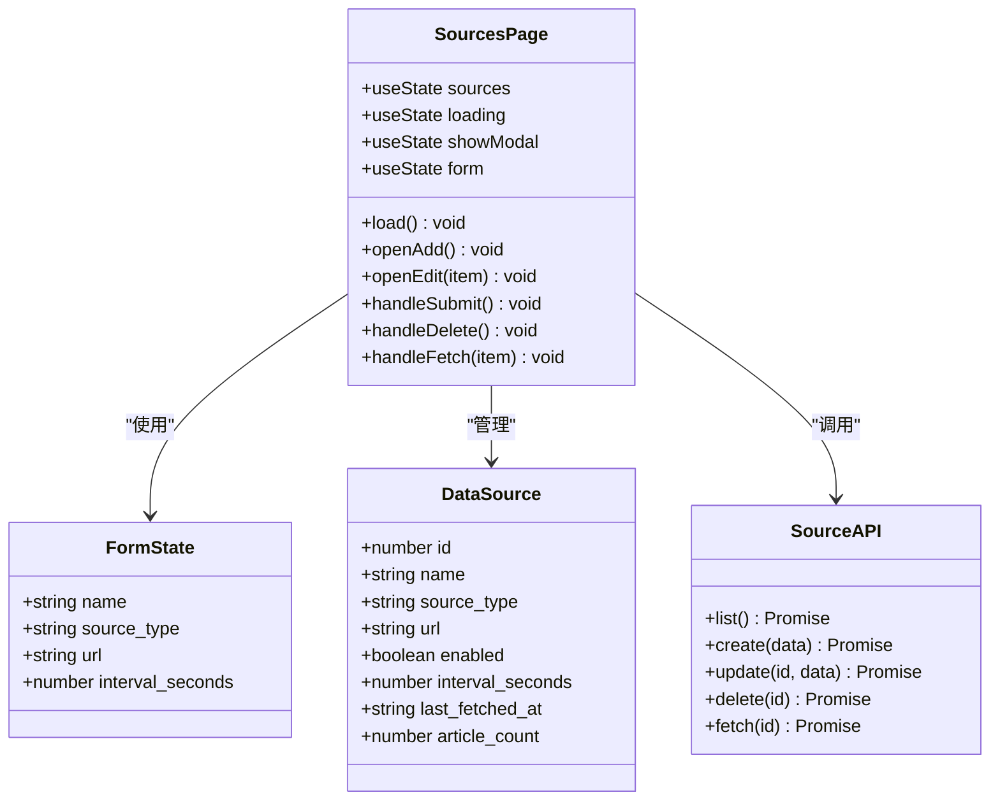
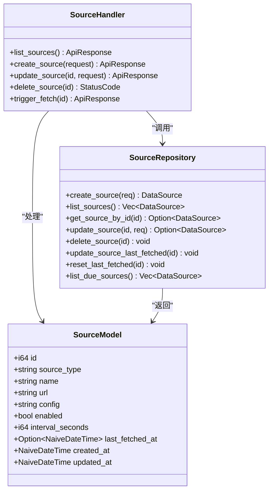
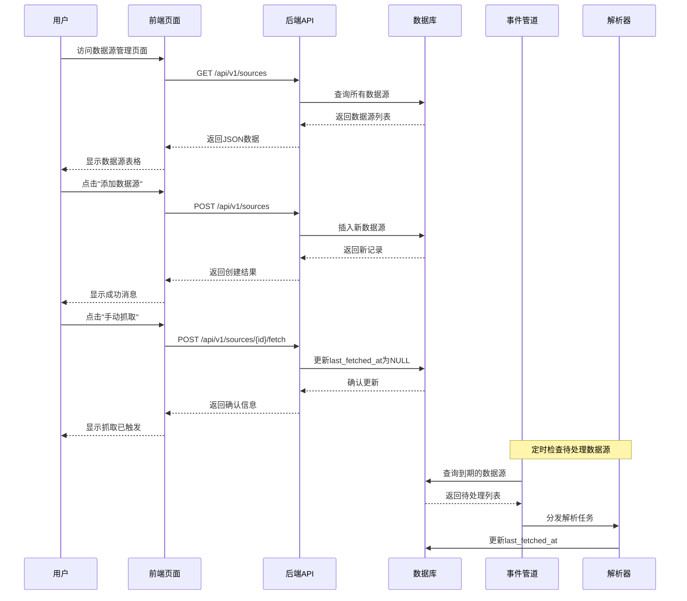
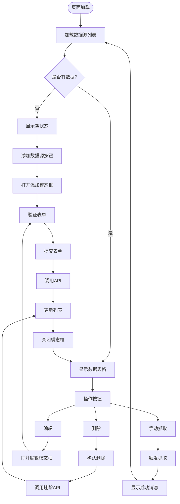
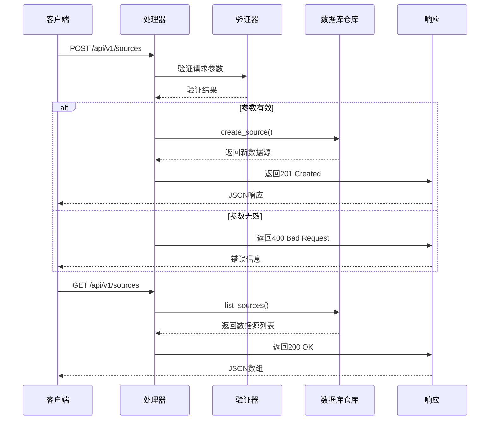
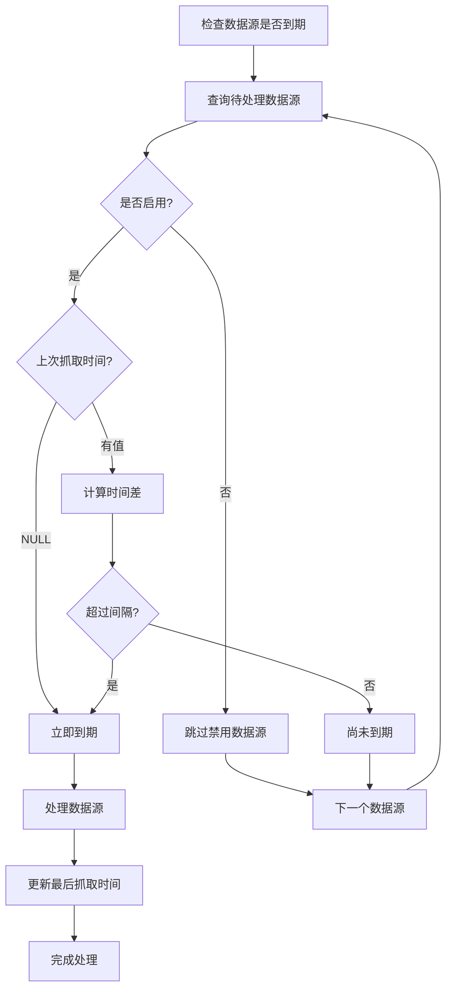
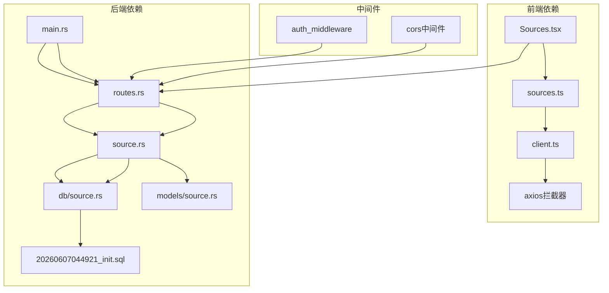

# 数据源管理页面

<cite>
**本文档引用的文件**
- [main.rs](file://src/main.rs)
- [Sources.tsx](file://web/src/renderer/src/pages/Sources.tsx)
- [source.rs](file://src/handlers/source.rs)
- [source.rs](file://src/models/source.rs)
- [source.rs](file://src/db/source.rs)
- [sources.ts](file://web/src/renderer/src/api/sources.ts)
- [routes.rs](file://src/routes.rs)
- [20260607044921_init.sql](file://docs/migrations/20260607044921_init.sql)
- [App.tsx](file://web/src/renderer/src/App.tsx)
</cite>

## 目录
1. [简介](#简介)
2. [项目结构](#项目结构)
3. [核心组件](#核心组件)
4. [架构概览](#架构概览)
5. [详细组件分析](#详细组件分析)
6. [依赖关系分析](#依赖关系分析)
7. [性能考虑](#性能考虑)
8. [故障排除指南](#故障排除指南)
9. [结论](#结论)

## 简介

数据源管理页面是AI趋势工具项目中的核心功能模块之一，负责管理各种数据源的配置和监控。该页面允许用户添加、编辑、删除和手动触发数据源的抓取操作，支持RSS、API和Atom等多种数据源类型。

系统采用前后端分离架构，后端使用Rust + Axum框架提供RESTful API，前端使用React + TypeScript构建用户界面。数据存储基于SQLite数据库，通过SQLx进行ORM操作。

## 项目结构

该项目采用现代化的全栈架构设计，主要分为以下几个层次：

**图表来源**
- [main.rs:55-128](file://src/main.rs#L55-L128)
- [routes.rs:16-64](file://src/routes.rs#L16-L64)
- [Sources.tsx:20-286](file://web/src/renderer/src/pages/Sources.tsx#L20-L286)

**章节来源**
- [main.rs:1-129](file://src/main.rs#L1-129)
- [routes.rs:1-87](file://src/routes.rs#L1-L87)

## 核心组件

数据源管理页面由多个核心组件协同工作，形成完整的数据源生命周期管理：

### 前端组件架构

**图表来源**
- [Sources.tsx:6-286](file://web/src/renderer/src/pages/Sources.tsx#L6-L286)
- [sources.ts:3-48](file://web/src/renderer/src/api/sources.ts#L3-L48)

### 后端API架构

**图表来源**
- [source.rs:12-118](file://src/handlers/source.rs#L12-L118)
- [source.rs:5-39](file://src/models/source.rs#L5-L39)
- [source.rs:5-133](file://src/db/source.rs#L5-L133)

**章节来源**
- [Sources.tsx:1-287](file://web/src/renderer/src/pages/Sources.tsx#L1-L287)
- [source.rs:1-119](file://src/handlers/source.rs#L1-L119)

## 架构概览

系统采用事件驱动的架构模式，结合定时任务和手动触发机制：

**图表来源**
- [main.rs:80-108](file://src/main.rs#L80-L108)
- [routes.rs:28-33](file://src/routes.rs#L28-L33)
- [source.rs:105-118](file://src/handlers/source.rs#L105-L118)

## 详细组件分析

### 数据源模型设计

数据源模型采用灵活的设计，支持多种数据源类型和扩展配置：

| 字段名 | 类型 | 必填 | 默认值 | 描述 |
|--------|------|------|--------|------|
| id | INTEGER | 是 | 自增 | 主键标识符 |
| type | TEXT | 是 | - | 数据源类型 (RSS/Atom/API) |
| name | TEXT | 是 | - | 数据源显示名称 |
| url | TEXT | 是 | - | 数据源访问地址 |
| config | TEXT | 否 | '{}' | JSON配置字符串 |
| enabled | BOOLEAN | 否 | 1 | 是否启用 |
| interval_seconds | INTEGER | 否 | 300 | 抓取间隔(秒) |
| last_fetched_at | DATETIME | 否 | NULL | 上次抓取时间 |
| created_at | DATETIME | 否 | 当前时间 | 创建时间 |
| updated_at | DATETIME | 否 | 当前时间 | 更新时间 |

**章节来源**
- [source.rs:5-19](file://src/models/source.rs#L5-L19)
- [20260607044921_init.sql:17-28](file://docs/migrations/20260607044921_init.sql#L17-L28)

### 前端页面逻辑

数据源管理页面实现了完整的CRUD操作和实时状态更新：

**图表来源**
- [Sources.tsx:29-129](file://web/src/renderer/src/pages/Sources.tsx#L29-L129)

### 后端API处理流程

后端API提供了完整的数据源管理接口：

**图表来源**
- [source.rs:27-45](file://src/handlers/source.rs#L27-L45)
- [source.rs:15-20](file://src/handlers/source.rs#L15-L20)

**章节来源**
- [Sources.tsx:1-287](file://web/src/renderer/src/pages/Sources.tsx#L1-L287)
- [source.rs:1-119](file://src/handlers/source.rs#L1-L119)

### 数据库查询优化

系统实现了智能的数据源查询机制，支持定时抓取和手动触发：

**图表来源**
- [source.rs:119-132](file://src/db/source.rs#L119-L132)

**章节来源**
- [source.rs:101-132](file://src/db/source.rs#L101-L132)

## 依赖关系分析

系统各组件之间的依赖关系清晰明确，遵循单一职责原则：

**图表来源**
- [main.rs:15-17](file://src/main.rs#L15-L17)
- [routes.rs:12-14](file://src/routes.rs#L12-L14)
- [Sources.tsx:1-287](file://web/src/renderer/src/pages/Sources.tsx#L1-L287)

**章节来源**
- [main.rs:1-129](file://src/main.rs#L1-L129)
- [routes.rs:1-87](file://src/routes.rs#L1-L87)

## 性能考虑

系统在设计时充分考虑了性能优化：

### 数据库性能优化
- 使用索引优化常用查询字段
- 实现批量查询减少数据库往返
- 采用连接池管理数据库连接
- 实现查询缓存机制

### 前端性能优化
- 实现虚拟滚动处理大量数据
- 使用React.memo优化组件渲染
- 实现防抖处理频繁操作
- 采用懒加载减少初始加载时间

### 后端性能优化
- 异步处理避免阻塞
- 实现背压控制防止过载
- 使用流式处理大数据集
- 实现优雅降级机制

## 故障排除指南

### 常见问题及解决方案

**数据源无法保存**
- 检查URL格式是否正确
- 确认网络连接正常
- 验证权限设置
- 查看后端日志

**手动抓取失败**
- 确认数据源状态为启用
- 检查目标网站可访问性
- 验证认证信息
- 查看解析器错误日志

**页面加载缓慢**
- 检查数据库连接池配置
- 优化查询语句
- 实现分页加载
- 检查网络延迟

**章节来源**
- [source.rs:31-41](file://src/handlers/source.rs#L31-L41)
- [Sources.tsx:71-106](file://web/src/renderer/src/pages/Sources.tsx#L71-L106)

## 结论

数据源管理页面是AI趋势工具的核心功能模块，通过精心设计的架构和完善的错误处理机制，为用户提供了直观易用的数据源管理体验。系统采用现代化的技术栈，具备良好的扩展性和维护性。

主要特点包括：
- 完整的CRUD操作支持
- 智能的定时抓取机制  
- 实时的状态监控
- 灵活的配置选项
- 优秀的用户体验

未来可以考虑的功能增强：
- 支持更多数据源类型
- 实现数据源健康检查
- 添加批量操作功能
- 优化移动端适配
- 增强安全防护机制