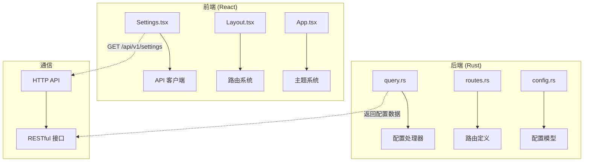
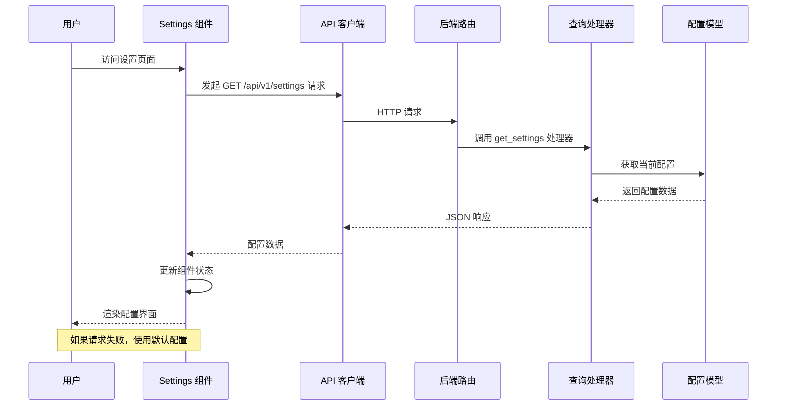
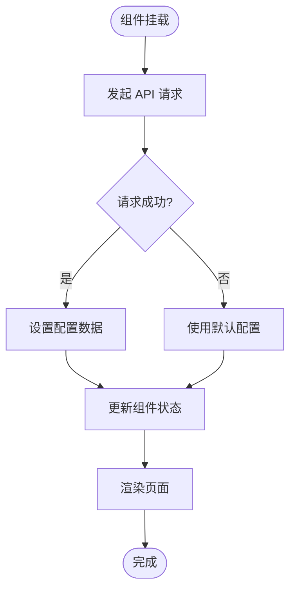
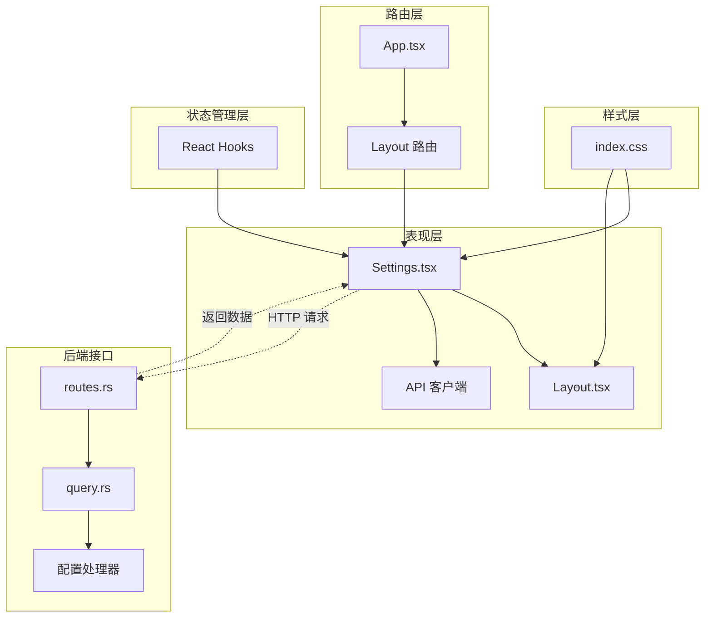

# 设置页面

<cite>
**本文档引用的文件**
- [Settings.tsx](file://web/src/renderer/src/pages/Settings.tsx)
- [Layout.tsx](file://web/src/renderer/src/components/Layout.tsx)
- [App.tsx](file://web/src/renderer/src/App.tsx)
- [main.tsx](file://web/src/renderer/src/main.tsx)
- [client.ts](file://web/src/renderer/src/api/client.ts)
- [index.css](file://web/src/renderer/src/styles/index.css)
- [query.rs](file://src/handlers/query.rs)
- [routes.rs](file://src/routes.rs)
- [config.rs](file://src/config.rs)
- [spec.md](file://openspec/changes/frontend-management-pages/specs/settings-page/spec.md)
</cite>

## 目录
1. [简介](#简介)
2. [项目结构](#项目结构)
3. [核心组件](#核心组件)
4. [架构概览](#架构概览)
5. [详细组件分析](#详细组件分析)
6. [依赖关系分析](#依赖关系分析)
7. [性能考虑](#性能考虑)
8. [故障排除指南](#故障排除指南)
9. [结论](#结论)

## 简介

设置页面是 AI 热点监控系统的配置管理界面，采用前后端分离架构设计。前端使用 React + TypeScript + TailwindCSS 构建，后端使用 Rust + Axum 提供 RESTful API。该页面实现了系统配置参数的只读展示功能，支持四种配置分组：解析器配置、过滤器配置、推送器配置和服务器配置。

## 项目结构

该项目采用现代化的全栈架构，前端和后端完全独立开发：



**图表来源**
- [Settings.tsx:1-152](file://web/src/renderer/src/pages/Settings.tsx#L1-L152)
- [query.rs:149-156](file://src/handlers/query.rs#L149-L156)
- [routes.rs:49](file://src/routes.rs#L49)

**章节来源**
- [main.tsx:1-23](file://web/src/renderer/src/main.tsx#L1-L23)
- [App.tsx:14-37](file://web/src/renderer/src/App.tsx#L14-L37)

## 核心组件

设置页面的核心组件包括：

### 数据模型定义
```typescript
interface SettingsData {
  parser?: {
    max_concurrent_fetches?: number
    default_timeout_seconds?: number
    interval_seconds?: number
  }
  filter?: {
    batch_size?: number
    interval_seconds?: number
    history_hours?: number
    min_history_hours?: number
  }
  pusher?: {
    interval_seconds?: number
    max_retries?: number
    retry_base_seconds?: number
  }
  server?: {
    host?: string
    port?: number
  }
}
```

### 默认配置值
系统提供了完整的默认配置，确保在后端 API 不可用时页面仍能正常显示：

| 配置组 | 参数名 | 默认值 | 描述 |
|--------|--------|--------|------|
| 解析器 | max_concurrent_fetches | 5 | 最大并发抓取数 |
| 解析器 | default_timeout_seconds | 30 | 默认超时时间（秒） |
| 解析器 | interval_seconds | 30 | 抓取间隔（秒） |
| 过滤器 | batch_size | 100 | 批处理大小 |
| 过滤器 | interval_seconds | 300 | 运行间隔（秒） |
| 过滤器 | history_hours | 24 | 历史窗口（小时） |
| 过滤器 | min_history_hours | 4 | 最小历史数据（小时） |
| 推送器 | interval_seconds | 10 | 轮询间隔（秒） |
| 推送器 | max_retries | 3 | 最大重试次数 |
| 推送器 | retry_base_seconds | 60 | 重试基础间隔（秒） |
| 服务器 | host | 0.0.0.0 | 监听地址 |
| 服务器 | port | 8080 | 端口号 |

**章节来源**
- [Settings.tsx:4-48](file://web/src/renderer/src/pages/Settings.tsx#L4-L48)

## 架构概览

设置页面采用典型的 MVC 架构模式，结合响应式编程和状态管理：



**图表来源**
- [Settings.tsx:85-107](file://web/src/renderer/src/pages/Settings.tsx#L85-L107)
- [client.ts:11-17](file://web/src/renderer/src/api/client.ts#L11-L17)
- [query.rs:151-156](file://src/handlers/query.rs#L151-L156)

## 详细组件分析

### Settings 组件分析

Settings 组件实现了完整的配置展示功能，包含以下特性：

#### 组件状态管理
- `data`: 存储从后端获取的配置数据
- `loading`: 加载状态指示器
- `usingDefaults`: 标识是否使用默认配置

#### 数据获取流程
组件在挂载时自动发起配置数据请求，具备完善的错误处理机制：



**图表来源**
- [Settings.tsx:85-107](file://web/src/renderer/src/pages/Settings.tsx#L85-L107)

#### 响应式布局设计
页面采用 CSS Grid 实现响应式布局，支持不同屏幕尺寸：

- **桌面端 (≥ 768px)**: 2列网格布局
- **移动端 (< 768px)**: 1列网格布局

#### 配置分组展示
系统配置按逻辑分组展示，每个分组包含相应的配置项：

1. **解析器配置组**: 控制内容抓取行为
2. **过滤器配置组**: 管理内容过滤规则
3. **推送器配置组**: 配置消息推送设置
4. **服务器配置组**: 系统服务器参数

**章节来源**
- [Settings.tsx:109-151](file://web/src/renderer/src/pages/Settings.tsx#L109-L151)

### API 客户端集成

前端 API 客户端配置了完整的拦截器机制：

#### 请求拦截器
- 自动添加认证令牌到请求头
- 支持 Bearer Token 认证模式

#### 响应拦截器
- 处理 401 未授权错误，自动跳转到登录页面
- 统一错误消息处理和用户提示
- 网络错误的友好提示

**章节来源**
- [client.ts:19-47](file://web/src/renderer/src/api/client.ts#L19-L47)

### 后端配置处理器

后端查询处理器提供了完整的配置获取功能：

#### 处理器实现
```rust
pub async fn get_settings(
    State(state): State<AppState>,
) -> Result<(StatusCode, Json<serde_json::Value>), AppError> {
    Ok(ApiResponse::ok(&state.config))
}
```

#### 配置模型结构
后端配置模型与前端保持一致的数据结构，确保前后端兼容性。

**章节来源**
- [query.rs:149-156](file://src/handlers/query.rs#L149-L156)
- [config.rs:3-13](file://src/config.rs#L3-L13)

## 依赖关系分析

设置页面的依赖关系体现了清晰的分层架构：



**图表来源**
- [Settings.tsx:1-152](file://web/src/renderer/src/pages/Settings.tsx#L1-L152)
- [App.tsx:14-37](file://web/src/renderer/src/App.tsx#L14-L37)
- [query.rs:149-156](file://src/handlers/query.rs#L149-L156)

### 外部依赖

项目使用的主要技术栈：

| 依赖项 | 版本 | 用途 |
|--------|------|------|
| React | ^19.0.0 | 前端框架 |
| React Router DOM | ^7.0.0 | 路由管理 |
| Axios | ^1.7.0 | HTTP 客户端 |
| Day.js | ^1.11.0 | 时间处理 |
| Ant Design | ^5.22.0 | UI 组件库 |
| TailwindCSS | ^4.3.0 | 样式框架 |
| Electron | ^33.0.0 | 桌面应用框架 |

**章节来源**
- [package.json:12-35](file://web/package.json#L12-L35)

## 性能考虑

### 前端性能优化

1. **懒加载策略**: 组件在首次访问时才加载数据
2. **状态缓存**: 成功获取的配置数据会被缓存
3. **响应式设计**: 优化移动端用户体验
4. **CSS 优化**: 使用原子化样式减少打包体积

### 后端性能优化

1. **配置直接传递**: 后端直接返回配置对象，避免额外处理
2. **中间件保护**: 所有 API 端点都经过认证中间件保护
3. **数据库连接池**: 使用连接池优化数据库访问

## 故障排除指南

### 常见问题及解决方案

#### API 请求失败
**症状**: 页面显示默认配置且出现错误提示
**原因**: 后端服务不可用或网络连接问题
**解决方法**:
1. 检查后端服务是否正常运行
2. 验证 API 端点 `/api/v1/settings` 是否可达
3. 确认防火墙设置允许本地连接

#### 认证失败
**症状**: 自动跳转到登录页面
**原因**: 令牌过期或无效
**解决方法**:
1. 重新登录获取新令牌
2. 检查本地存储中的 `api_token` 值
3. 清除浏览器缓存后重试

#### 样式显示异常
**症状**: 页面布局错乱或颜色不正确
**原因**: CSS 变量未正确加载
**解决方法**:
1. 检查主题配置是否正确
2. 确认 CSS 变量定义完整
3. 刷新页面重新加载样式

**章节来源**
- [client.ts:30-46](file://web/src/renderer/src/api/client.ts#L30-L46)
- [Settings.tsx:95-100](file://web/src/renderer/src/pages/Settings.tsx#L95-L100)

## 结论

设置页面作为 AI 热点监控系统的重要组成部分，展现了现代 Web 应用的最佳实践。通过前后端分离架构、响应式设计和完善的错误处理机制，该页面提供了良好的用户体验和可靠的系统稳定性。

主要优势包括：
- **模块化设计**: 清晰的组件分离和职责划分
- **响应式布局**: 适配多种设备和屏幕尺寸
- **错误处理**: 完善的降级策略和用户提示
- **安全性**: 认证中间件保护所有 API 端点
- **可维护性**: 代码结构清晰，易于扩展和修改

未来可以考虑的功能增强：
- 添加配置编辑功能
- 实现配置导入导出
- 增加配置验证和预览功能
- 提供配置模板和快速设置选项