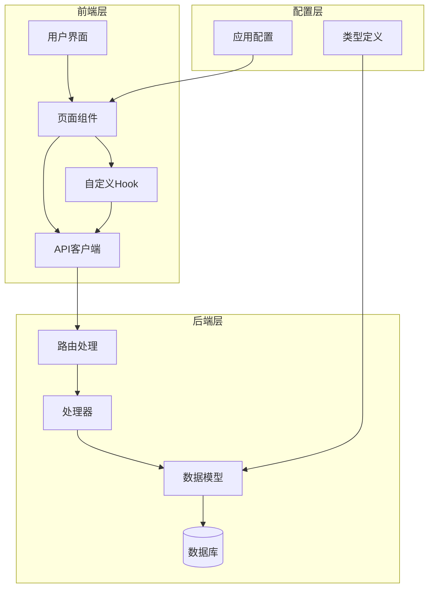
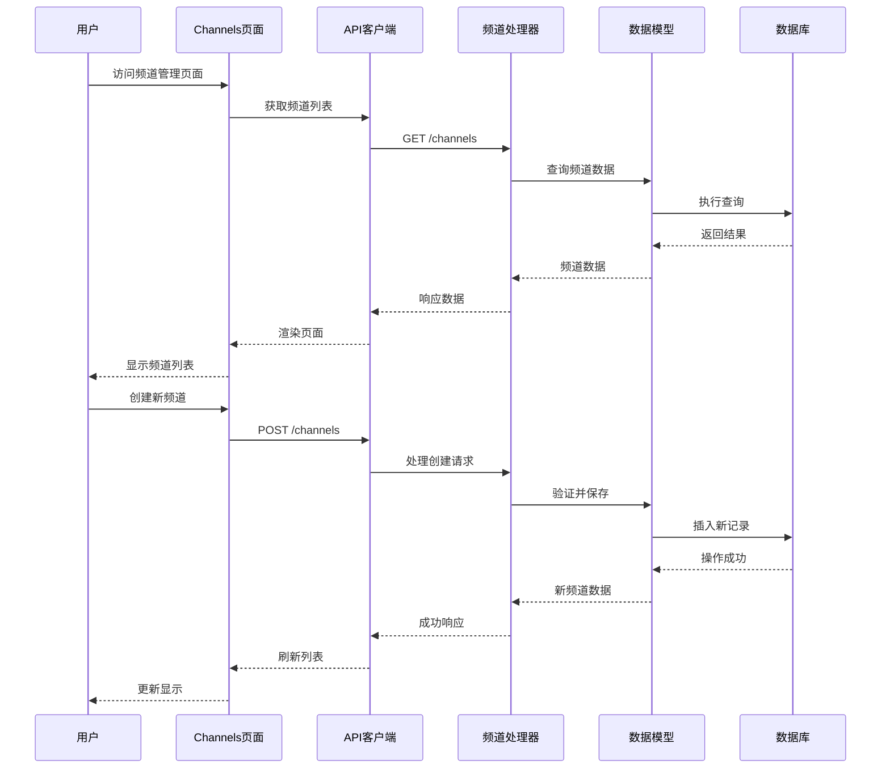
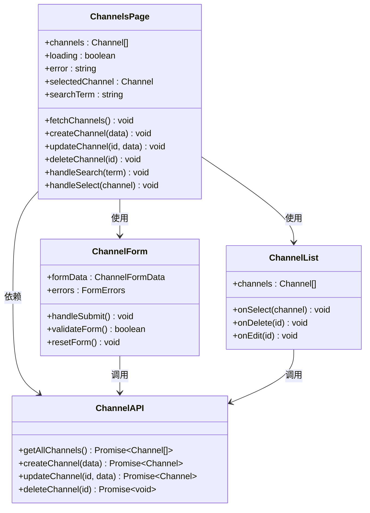
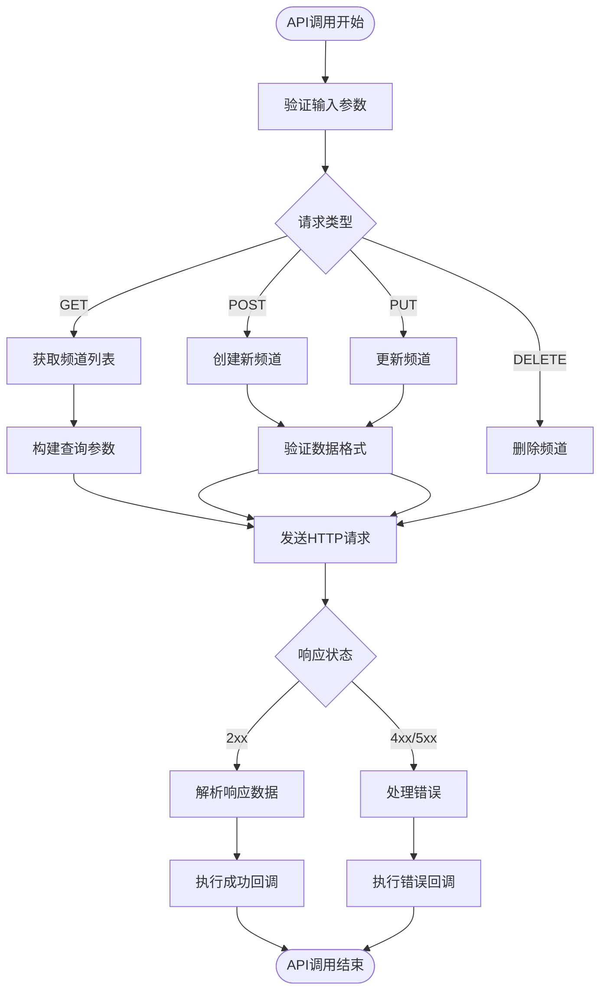
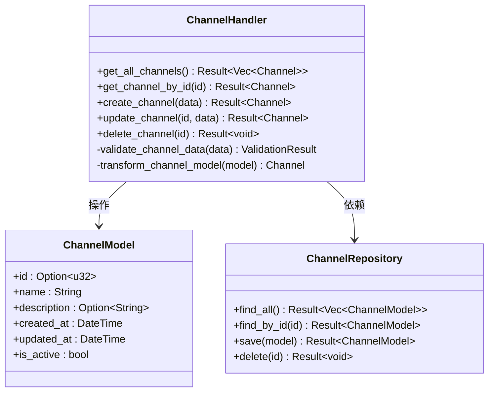
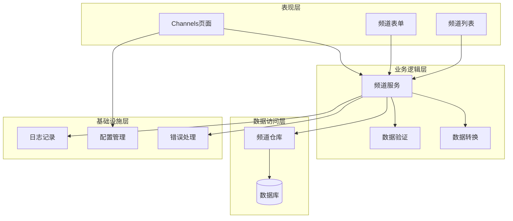

# 频道管理页面

<cite>
**本文档引用的文件**
- [channels.ts](file://web/src/renderer/src/api/channels.ts)
- [Channels.tsx](file://web/src/renderer/src/pages/Channels.tsx)
- [channel.rs](file://src/db/channel.rs)
- [channel.rs](file://src/models/channel.rs)
- [channel.rs](file://src/handlers/channel.rs)
- [routes.rs](file://src/routes.rs)
- [channel-api.md](file://docs/apis/channel-api.md)
- [channel-crud-api.spec.md](file://openspec/specs/channel-crud-api.spec.md)
- [channels-management-page.spec.md](file://openspec/frontend-management-pages/specs/channels-management-page/spec.md)
</cite>

## 目录
1. [简介](#简介)
2. [项目结构](#项目结构)
3. [核心组件](#核心组件)
4. [架构概览](#架构概览)
5. [详细组件分析](#详细组件分析)
6. [依赖关系分析](#依赖关系分析)
7. [性能考虑](#性能考虑)
8. [故障排除指南](#故障排除指南)
9. [结论](#结论)

## 简介

频道管理页面是AI趋势工具项目中的一个关键功能模块，负责管理和操作频道（Channel）数据。该页面提供了完整的CRUD（创建、读取、更新、删除）功能，允许管理员对系统中的频道进行集中管理。频道作为内容分发的核心概念，在整个AI趋势监控系统中扮演着重要角色。

## 项目结构

该项目采用前后端分离的架构设计，频道管理页面位于前端渲染层，通过API与后端服务进行交互。

**图表来源**
- [main.rs](file://src/main.rs)
- [routes.rs](file://src/routes.rs)
- [handlers.rs](file://src/handlers.rs)
- [models.rs](file://src/models.rs)

**章节来源**
- [main.rs](file://src/main.rs)
- [routes.rs](file://src/routes.rs)

## 核心组件

频道管理页面由多个核心组件构成，每个组件都有明确的职责分工：

### 前端组件
- **Channels页面组件**：主要的管理界面，提供频道列表展示和操作功能
- **API客户端**：封装HTTP请求，处理频道相关的数据交互
- **自定义Hook**：提供状态管理和数据获取逻辑

### 后端组件
- **频道处理器**：处理频道相关的业务逻辑
- **数据模型**：定义频道的数据结构和验证规则
- **数据库访问层**：提供频道数据的持久化操作

**章节来源**
- [Channels.tsx](file://web/src/renderer/src/pages/Channels.tsx)
- [channels.ts](file://web/src/renderer/src/api/channels.ts)
- [channel.rs](file://src/handlers/channel.rs)
- [channel.rs](file://src/models/channel.rs)

## 架构概览

频道管理页面采用MVC（Model-View-Controller）架构模式，实现了清晰的分层设计：

**图表来源**
- [Channels.tsx](file://web/src/renderer/src/pages/Channels.tsx)
- [channels.ts](file://web/src/renderer/src/api/channels.ts)
- [channel.rs](file://src/handlers/channel.rs)
- [channel.rs](file://src/models/channel.rs)

## 详细组件分析

### Channels页面组件

Channels页面是频道管理的核心UI组件，提供了完整的用户交互界面：

**图表来源**
- [Channels.tsx](file://web/src/renderer/src/pages/Channels.tsx)
- [channels.ts](file://web/src/renderer/src/api/channels.ts)

#### 组件功能特性

1. **数据展示**：以表格形式展示所有频道信息
2. **搜索过滤**：支持按名称、描述等字段搜索
3. **批量操作**：支持多选和批量删除
4. **实时更新**：自动刷新频道列表
5. **错误处理**：完善的错误提示和恢复机制

**章节来源**
- [Channels.tsx](file://web/src/renderer/src/pages/Channels.tsx)

### API客户端实现

频道API客户端封装了所有与频道相关的HTTP请求：

**图表来源**
- [channels.ts](file://web/src/renderer/src/api/channels.ts)

#### API端点规范

| 端点 | 方法 | 功能 | 请求体 | 响应 |
|------|------|------|--------|------|
| `/channels` | GET | 获取频道列表 | 无 | 频道数组 |
| `/channels` | POST | 创建新频道 | 频道数据 | 新频道对象 |
| `/channels/:id` | PUT | 更新频道 | 频道数据 | 更新后的频道 |
| `/channels/:id` | DELETE | 删除频道 | 无 | 无内容 |

**章节来源**
- [channels.ts](file://web/src/renderer/src/api/channels.ts)
- [channel-api.md](file://docs/apis/channel-api.md)

### 后端处理器

后端频道处理器负责处理所有频道相关的业务逻辑：

**图表来源**
- [channel.rs](file://src/handlers/channel.rs)
- [channel.rs](file://src/models/channel.rs)
- [channel.rs](file://src/db/channel.rs)

#### 处理器方法实现

1. **数据验证**：确保输入数据符合业务规则
2. **业务逻辑**：执行频道相关的业务规则
3. **数据转换**：在API模型和数据库模型之间转换
4. **错误处理**：提供详细的错误信息和状态码

**章节来源**
- [channel.rs](file://src/handlers/channel.rs)
- [channel.rs](file://src/models/channel.rs)

### 数据模型设计

频道数据模型定义了频道的结构和约束条件：

| 字段名 | 类型 | 必填 | 描述 | 约束 |
|--------|------|------|------|------|
| id | u32 | 否 | 频道唯一标识符 | 自增主键 |
| name | String | 是 | 频道名称 | 非空，唯一 |
| description | String | 否 | 频道描述 | 最大长度255字符 |
| created_at | DateTime | 否 | 创建时间 | 自动设置 |
| updated_at | DateTime | 否 | 更新时间 | 自动更新 |
| is_active | bool | 是 | 是否启用 | 默认true |

**章节来源**
- [channel.rs](file://src/models/channel.rs)
- [channel.rs](file://src/db/channel.rs)

## 依赖关系分析

频道管理页面的依赖关系体现了清晰的分层架构：

**图表来源**
- [Channels.tsx](file://web/src/renderer/src/pages/Channels.tsx)
- [channels.ts](file://web/src/renderer/src/api/channels.ts)
- [channel.rs](file://src/handlers/channel.rs)

### 关键依赖关系

1. **前端到后端**：通过RESTful API进行通信
2. **业务到数据**：处理器依赖仓库模式进行数据访问
3. **验证到业务**：数据验证确保业务规则的一致性
4. **日志到监控**：统一的日志记录便于问题追踪

**章节来源**
- [routes.rs](file://src/routes.rs)
- [handlers.rs](file://src/handlers.rs)

## 性能考虑

频道管理页面在设计时充分考虑了性能优化：

### 前端性能优化
- **虚拟滚动**：对于大量频道数据使用虚拟滚动技术
- **懒加载**：分页加载减少初始渲染压力
- **缓存策略**：合理使用浏览器缓存和内存缓存
- **防抖处理**：搜索功能使用防抖避免频繁请求

### 后端性能优化
- **索引优化**：为常用查询字段建立数据库索引
- **连接池**：使用数据库连接池提高并发性能
- **查询优化**：优化SQL查询减少数据库负载
- **缓存层**：添加Redis缓存减少重复查询

### 网络性能优化
- **压缩传输**：启用Gzip压缩减少传输数据量
- **CDN加速**：静态资源使用CDN提升加载速度
- **HTTP缓存**：合理设置缓存头避免重复请求

## 故障排除指南

### 常见问题及解决方案

#### 页面无法加载
1. **检查网络连接**：确认API服务器正常运行
2. **验证权限**：确保用户具有访问权限
3. **查看控制台**：检查JavaScript错误信息

#### 数据同步问题
1. **检查缓存**：清除浏览器缓存重新加载
2. **验证API响应**：确认后端API返回正确格式
3. **检查时间戳**：确保本地时间和服务器时间一致

#### 性能问题
1. **监控资源使用**：检查CPU和内存使用情况
2. **分析网络请求**：使用开发者工具分析请求耗时
3. **优化查询**：检查数据库查询是否需要优化

**章节来源**
- [error.rs](file://src/error.rs)
- [middleware.rs](file://src/middleware.rs)

### 调试技巧

1. **启用详细日志**：在开发环境中启用详细日志输出
2. **使用断点调试**：在关键代码处设置断点
3. **监控API调用**：使用网络面板监控所有API请求
4. **测试边界条件**：验证极端情况下的系统行为

## 结论

频道管理页面作为AI趋势工具的重要组成部分，展现了现代Web应用的最佳实践。通过清晰的分层架构、完善的错误处理机制和优秀的用户体验设计，该页面为管理员提供了高效、可靠的频道管理能力。

### 主要优势
- **模块化设计**：清晰的组件划分便于维护和扩展
- **类型安全**：Rust后端提供编译时类型安全保障
- **用户体验**：React前端提供流畅的交互体验
- **可扩展性**：良好的架构设计支持未来功能扩展

### 技术亮点
- **前后端分离**：采用现代化的全栈开发模式
- **API标准化**：遵循RESTful设计原则
- **数据一致性**：通过事务和验证确保数据完整性
- **性能优化**：从多个层面考虑性能优化

该频道管理页面不仅满足了当前的功能需求，更为系统的长期发展奠定了坚实的技术基础。