# 前端管理页面规范

<cite>
**本文档引用的文件**
- [Toast.tsx](file://web/src/renderer/src/components/Toast.tsx)
- [Settings.tsx](file://web/src/renderer/src/pages/Settings.tsx)
- [index.css](file://web/src/renderer/src/styles/index.css)
- [config.tsx](file://web/src/renderer/src/theme/config.tsx)
- [tokens.ts](file://web/src/renderer/src/theme/tokens.ts)
- [Channels.tsx](file://web/src/renderer/src/pages/Channels.tsx)
- [Keywords.tsx](file://web/src/renderer/src/pages/Keywords.tsx)
- [Sources.tsx](file://web/src/renderer/src/pages/Sources.tsx)
- [Tokens.tsx](file://web/src/renderer/src/pages/Tokens.tsx)
- [Layout.tsx](file://web/src/renderer/src/components/Layout.tsx)
- [channels.ts](file://web/src/renderer/src/api/channels.ts)
- [keywords.ts](file://web/src/renderer/src/api/keywords.ts)
- [sources.ts](file://web/src/renderer/src/api/sources.ts)
- [tokens.ts](file://web/src/renderer/src/api/tokens.ts)
- [client.ts](file://web/src/renderer/src/api/client.ts)
- [useApi.ts](file://web/src/renderer/src/hooks/useApi.ts)
- [useMessage.ts](file://web/src/renderer/src/hooks/useMessage.ts)
- [notification.ts](file://web/src/renderer/src/lib/notification.ts)
- [package.json](file://web/package.json)
</cite>

## 更新摘要
**所做更改**
- 新增了完整的CSS基础设施设置说明
- 添加了Toast通知组件的详细实现分析
- 更新了系统设置页面的重写说明
- 完善了所有管理界面的重新设计说明
- 强调了从外部UI库向自定义组件系统的迁移完成

## 目录
1. [简介](#简介)
2. [项目结构](#项目结构)
3. [核心组件](#核心组件)
4. [架构概览](#架构概览)
5. [详细组件分析](#详细组件分析)
6. [CSS基础设施设置](#css基础设施设置)
7. [Toast通知系统](#toast通知系统)
8. [依赖关系分析](#依赖关系分析)
9. [性能考虑](#性能考虑)
10. [故障排除指南](#故障排除指南)
11. [结论](#结论)

## 简介

AI趋势工具的前端管理页面是一个基于React和TypeScript构建的企业级管理界面系统。该系统已经完成了从外部UI库向自定义组件系统的完全迁移，建立了完整的CSS基础设施和通知系统。系统提供了完整的数据管理功能，包括频道管理、关键词管理、来源管理、令牌管理和设置管理等核心模块。系统采用现代化的设计系统和响应式布局，确保在各种设备上提供一致的用户体验。

## 项目结构

前端管理页面采用模块化架构设计，主要分为以下几个核心层次：

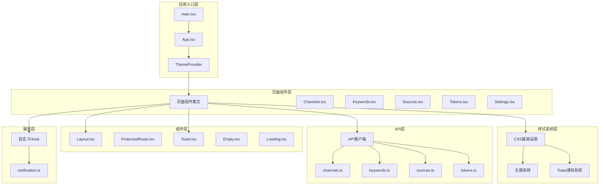

**图表来源**
- [main.tsx](file://web/src/renderer/src/main.tsx)
- [App.tsx](file://web/src/renderer/src/App.tsx)
- [ThemeProvider](file://web/src/renderer/src/theme/config.tsx)
- [Layout.tsx](file://web/src/renderer/src/components/Layout.tsx)

**章节来源**
- [package.json:1-50](file://web/package.json#L1-L50)

## 核心组件

### 页面组件架构

系统包含五个核心管理页面，每个页面都遵循统一的设计规范和交互模式：

| 页面名称 | 功能描述 | 数据模型 | 访问权限 |
|---------|----------|----------|----------|
| Channels | 频道管理 | Channel | 管理员 |
| Keywords | 关键词管理 | Keyword | 管理员 |
| Sources | 来源管理 | Source | 管理员 |
| Tokens | 令牌管理 | Token | 管理员 |
| Settings | 系统设置 | Config | 管理员 |

### 组件层次结构

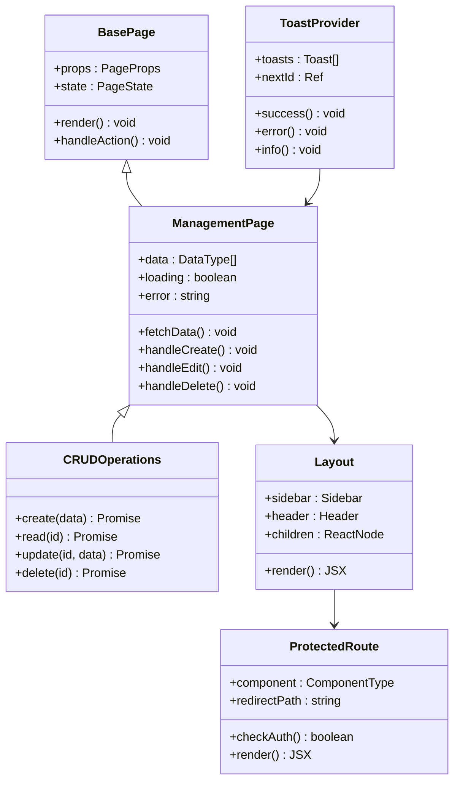

**图表来源**
- [Channels.tsx](file://web/src/renderer/src/pages/Channels.tsx)
- [Layout.tsx](file://web/src/renderer/src/components/Layout.tsx)
- [ProtectedRoute.tsx](file://web/src/renderer/src/components/ProtectedRoute.tsx)
- [Toast.tsx](file://web/src/renderer/src/components/Toast.tsx)

**章节来源**
- [Channels.tsx:1-100](file://web/src/renderer/src/pages/Channels.tsx#L1-L100)
- [Keywords.tsx:1-100](file://web/src/renderer/src/pages/Keywords.tsx#L1-L100)
- [Sources.tsx:1-100](file://web/src/renderer/src/pages/Sources.tsx#L1-L100)
- [Tokens.tsx:1-100](file://web/src/renderer/src/pages/Tokens.tsx#L1-L100)
- [Settings.tsx:1-100](file://web/src/renderer/src/pages/Settings.tsx#L1-L100)

## 架构概览

### 数据流架构

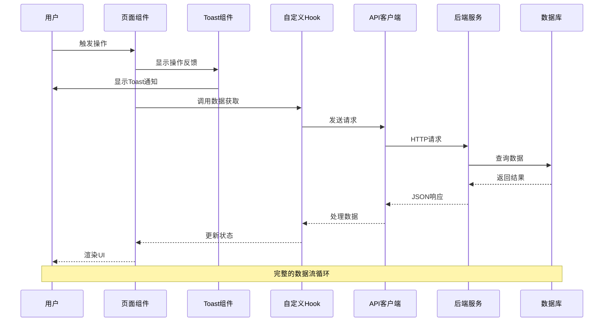

**图表来源**
- [useApi.ts](file://web/src/renderer/src/hooks/useApi.ts)
- [client.ts](file://web/src/renderer/src/api/client.ts)
- [Toast.tsx](file://web/src/renderer/src/components/Toast.tsx)

### 错误处理流程

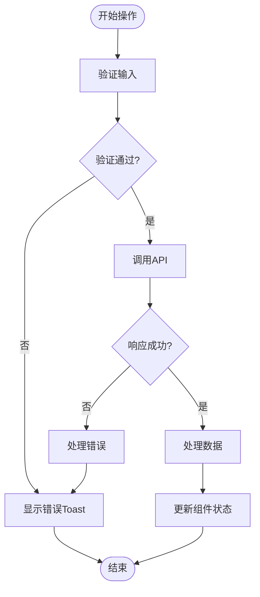

**图表来源**
- [useApi.ts](file://web/src/renderer/src/hooks/useApi.ts)
- [notification.ts](file://web/src/renderer/src/lib/notification.ts)
- [Toast.tsx](file://web/src/renderer/src/components/Toast.tsx)

## 详细组件分析

### 频道管理页面

频道管理页面是系统的核心功能模块之一，负责管理内容分发的频道配置。

#### 页面结构

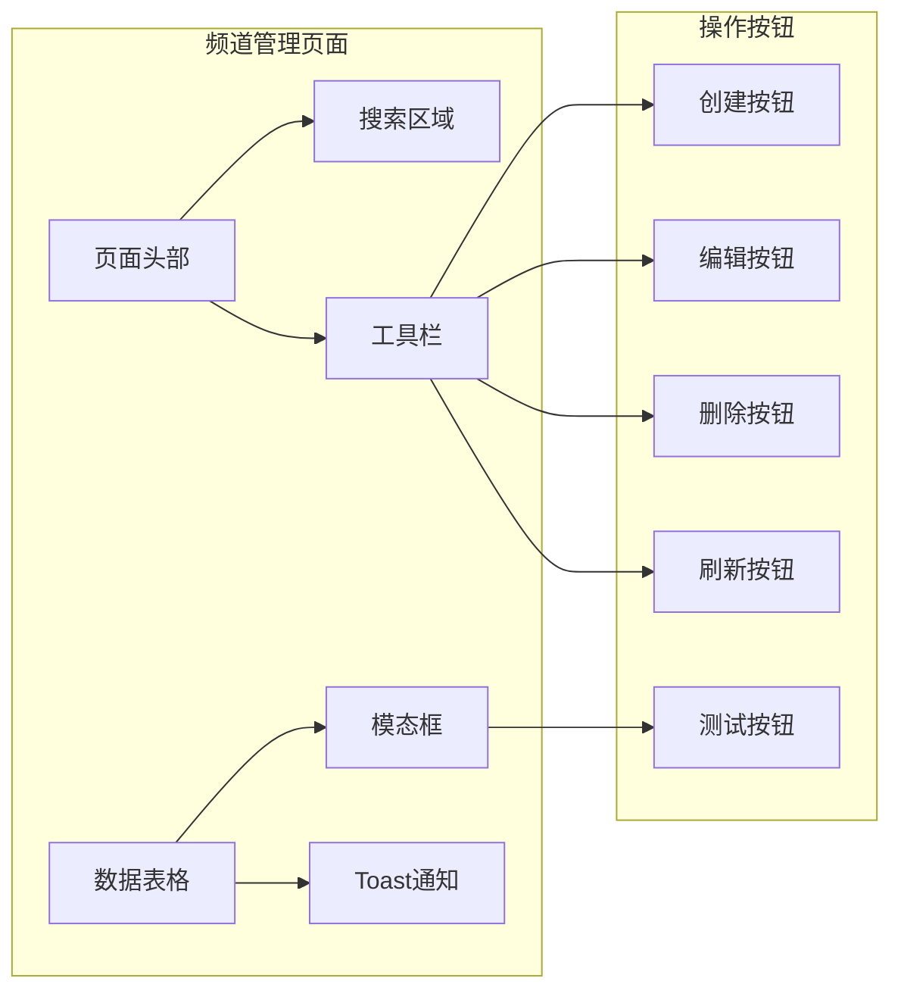

**图表来源**
- [Channels.tsx](file://web/src/renderer/src/pages/Channels.tsx)
- [Toast.tsx](file://web/src/renderer/src/components/Toast.tsx)

#### 数据模型

频道管理涉及以下关键数据结构：

| 字段名 | 类型 | 描述 | 必填 |
|--------|------|------|------|
| id | string | 频道唯一标识符 | 是 |
| name | string | 频道名称 | 是 |
| description | string | 频道描述 | 否 |
| isActive | boolean | 是否启用 | 是 |
| createdAt | datetime | 创建时间 | 是 |
| updatedAt | datetime | 更新时间 | 是 |

**章节来源**
- [channels.ts:1-80](file://web/src/renderer/src/api/channels.ts#L1-L80)

### 关键词管理页面

关键词管理页面用于维护系统中的关键词列表，支持关键词的增删改查操作。

#### 搜索与过滤机制

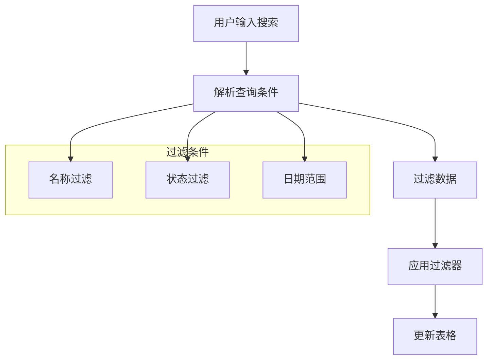

**图表来源**
- [keywords.ts](file://web/src/renderer/src/api/keywords.ts)

#### 批量操作功能

系统支持关键词的批量管理操作，包括批量删除、批量状态修改等功能。

**章节来源**
- [Keywords.tsx:1-150](file://web/src/renderer/src/pages/Keywords.tsx#L1-L150)

### 来源管理页面

来源管理页面负责管理内容来源的配置和维护。

#### 来源类型分类

| 类型 | 描述 | 适用场景 |
|------|------|----------|
| RSS | RSS订阅源 | 新闻聚合 |
| API | 接口源 | 实时数据 |
| Web | 网页抓取 | 内容采集 |
| Manual | 手动添加 | 特定内容 |

**章节来源**
- [Sources.tsx:1-150](file://web/src/renderer/src/pages/Sources.tsx#L1-L150)

### 令牌管理页面

令牌管理页面提供安全令牌的生成、管理和监控功能。

#### 令牌生命周期

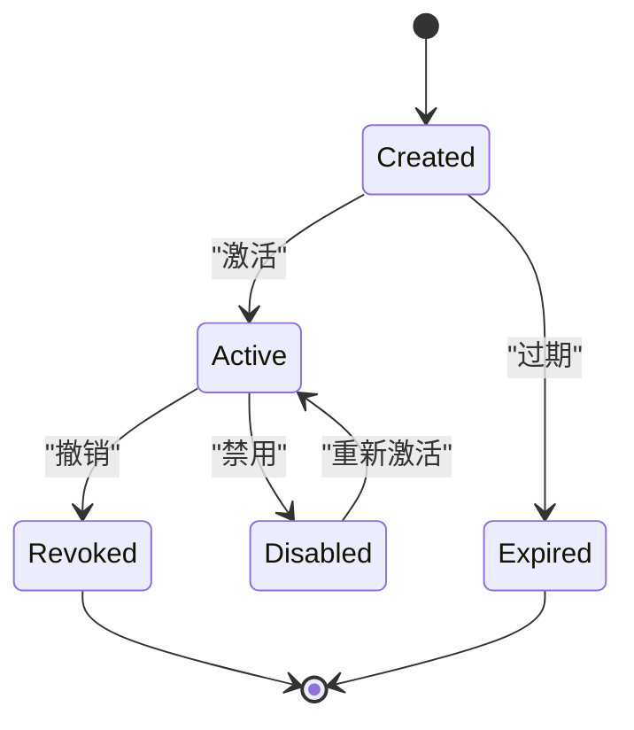

**图表来源**
- [tokens.ts](file://web/src/renderer/src/api/tokens.ts)

**章节来源**
- [Tokens.tsx:1-200](file://web/src/renderer/src/pages/Tokens.tsx#L1-L200)

### 设置管理页面

设置管理页面提供系统配置和参数调整功能。

#### 配置分类

| 分类 | 子项 | 描述 |
|------|------|------|
| 系统设置 | 基本配置 | 系统运行参数 |
| 安全设置 | 认证配置 | 登录和权限设置 |
| 性能设置 | 缓存配置 | 性能优化参数 |
| 通知设置 | 邮件配置 | 通知发送设置 |

**章节来源**
- [Settings.tsx:1-200](file://web/src/renderer/src/pages/Settings.tsx#L1-L200)

## CSS基础设施设置

### 设计令牌系统

系统采用了完整的CSS设计令牌系统，实现了主题变量的集中管理：

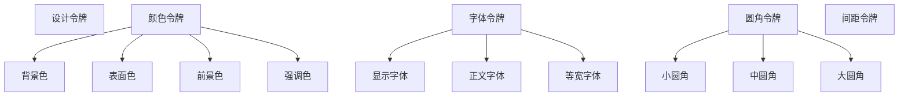

**图表来源**
- [index.css](file://web/src/renderer/src/styles/index.css)
- [tokens.ts](file://web/src/renderer/src/theme/tokens.ts)

### 响应式设计系统

系统实现了完整的响应式设计体系，支持多设备适配：

| 断点 | 屏幕宽度 | 特性 |
|------|----------|------|
| 移动端 | ≤ 768px | 单列布局，侧边栏折叠 |
| 平板端 | 769px - 1024px | 双列布局，部分功能简化 |
| 桌面端 | ≥ 1025px | 完整功能，双列布局 |

**章节来源**
- [index.css:338-342](file://web/src/renderer/src/styles/index.css#L338-L342)
- [Layout.tsx:58-85](file://web/src/renderer/src/components/Layout.tsx#L58-L85)

### 组件样式规范

系统定义了统一的组件样式规范，包括面板、表格、按钮、徽章等组件：

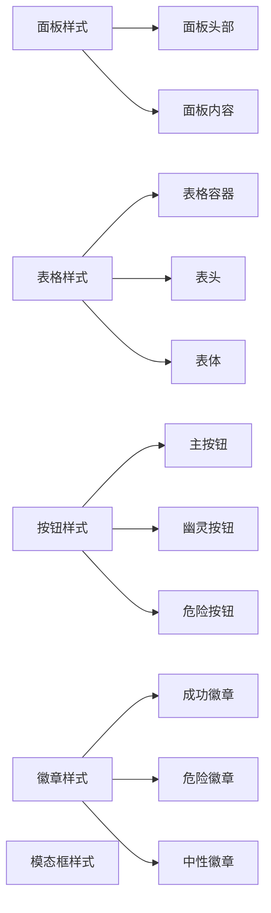

**图表来源**
- [index.css](file://web/src/renderer/src/styles/index.css)

**章节来源**
- [index.css:70-286](file://web/src/renderer/src/styles/index.css#L70-L286)

## Toast通知系统

### Toast组件架构

Toast通知系统是一个完整的状态反馈解决方案，提供了统一的通知管理：

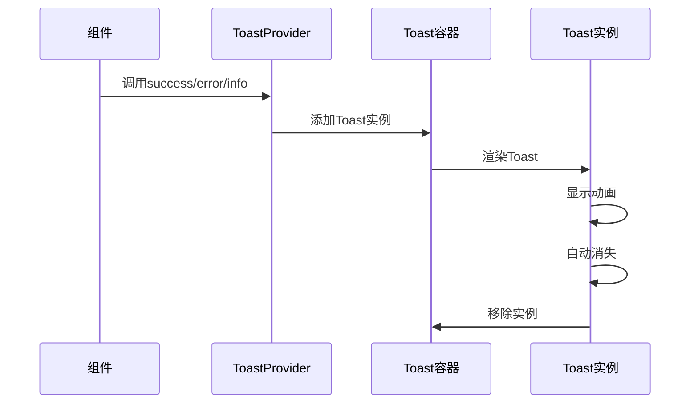

**图表来源**
- [Toast.tsx](file://web/src/renderer/src/components/Toast.tsx)

### 通知类型和时序

系统支持三种通知类型，每种类型有不同的显示时长和样式：

| 通知类型 | 颜色主题 | 显示时长 | 触发场景 |
|----------|----------|----------|----------|
| success | 绿色成功 | 3000ms | 操作成功 |
| error | 红色错误 | 3000ms | 操作失败 |
| info | 灰色信息 | 2000ms | 状态提示 |

**章节来源**
- [Toast.tsx:20-24](file://web/src/renderer/src/components/Toast.tsx#L20-L24)
- [Toast.tsx:48-50](file://web/src/renderer/src/components/Toast.tsx#L48-L50)

### 使用示例

Toast系统通过React Context提供全局访问：

```typescript
// 在组件中使用
const toast = useToast();
toast.success('操作成功');
toast.error('操作失败');
toast.info('请稍候');
```

**章节来源**
- [Toast.tsx:69-79](file://web/src/renderer/src/components/Toast.tsx#L69-L79)

## 依赖关系分析

### 技术栈依赖

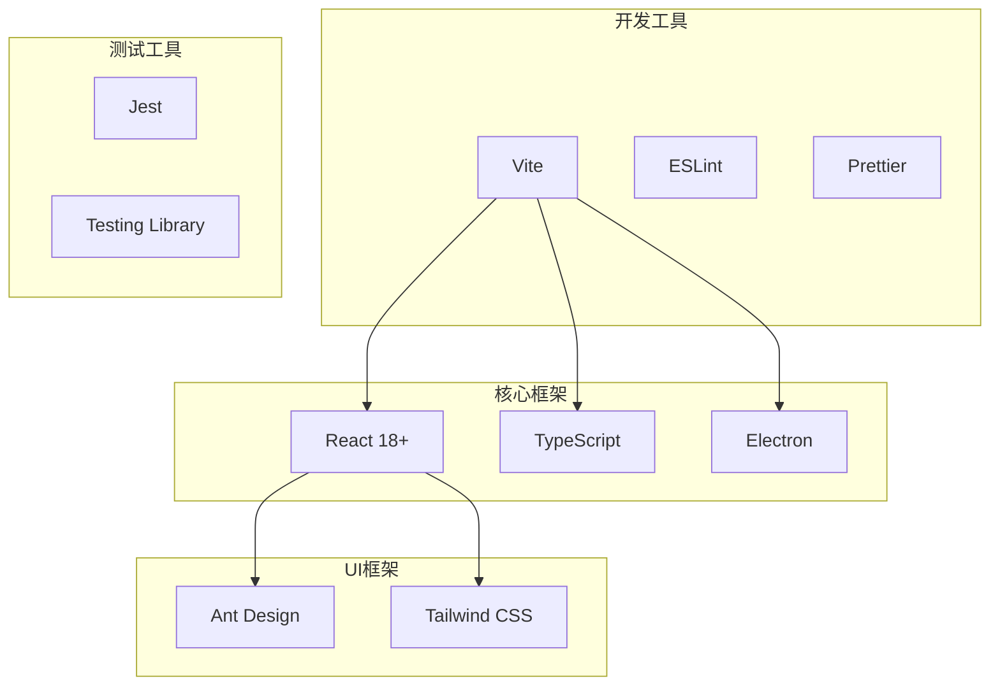

**图表来源**
- [package.json:1-50](file://web/package.json#L1-L50)

### 组件间依赖关系

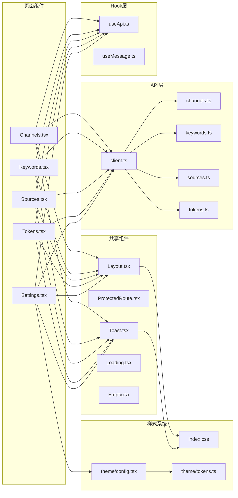

**图表来源**
- [Layout.tsx](file://web/src/renderer/src/components/Layout.tsx)
- [ProtectedRoute.tsx](file://web/src/renderer/src/components/ProtectedRoute.tsx)
- [client.ts](file://web/src/renderer/src/api/client.ts)
- [index.css](file://web/src/renderer/src/styles/index.css)
- [config.tsx](file://web/src/renderer/src/theme/config.tsx)
- [tokens.ts](file://web/src/renderer/src/theme/tokens.ts)

**章节来源**
- [package.json:1-50](file://web/package.json#L1-L50)

## 性能考虑

### 加载优化策略

1. **懒加载实现**：使用React.lazy和Suspense实现组件的按需加载
2. **虚拟滚动**：大数据量表格使用虚拟滚动技术提升渲染性能
3. **缓存机制**：合理使用浏览器缓存和内存缓存减少重复请求
4. **代码分割**：将大型组件拆分为独立的chunk文件

### 状态管理优化

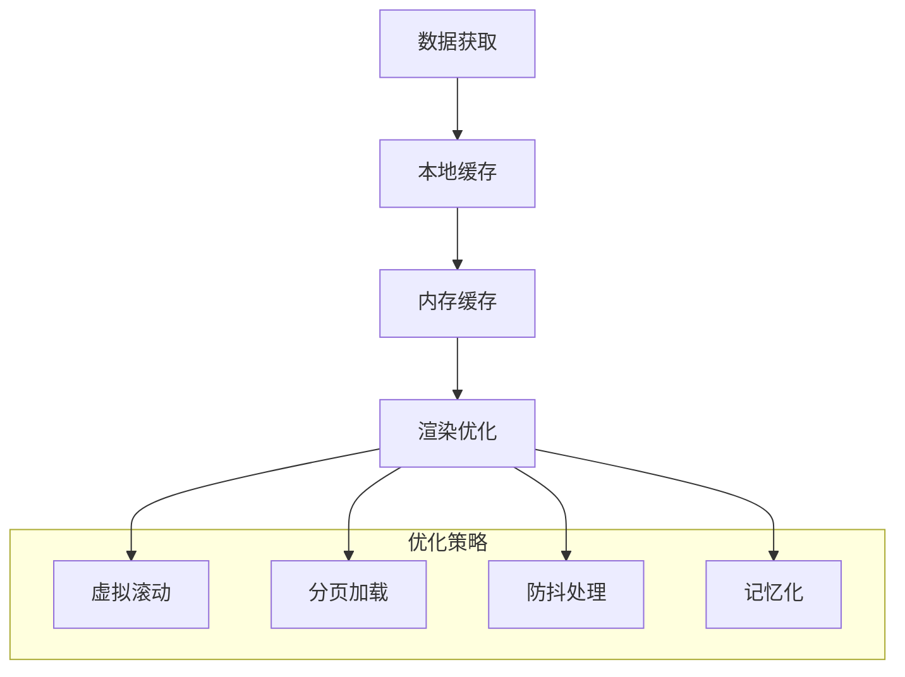

## 故障排除指南

### 常见问题诊断

| 问题类型 | 症状 | 解决方案 | 优先级 |
|----------|------|----------|--------|
| 登录失败 | 无法访问受保护页面 | 检查认证状态和令牌有效性 | 高 |
| 数据加载失败 | 表格显示空白或错误 | 检查网络连接和API响应 | 高 |
| 页面渲染异常 | 组件显示错误或崩溃 | 检查组件状态和props传递 | 中 |
| 性能问题 | 页面加载缓慢或卡顿 | 优化数据请求和组件渲染 | 中 |
| 样式问题 | UI显示不正确 | 检查CSS类名和主题配置 | 低 |

### 调试工具使用

1. **React DevTools**：检查组件树和状态变化
2. **浏览器开发者工具**：调试网络请求和JavaScript错误
3. **日志系统**：使用console.log和notification进行错误追踪
4. **错误边界**：实现ErrorBoundary捕获组件错误

**章节来源**
- [ErrorBoundary.tsx](file://web/src/renderer/src/components/ErrorBoundary.tsx)
- [notification.ts](file://web/src/renderer/src/lib/notification.ts)

## 结论

AI趋势工具的前端管理页面系统已经完成了从外部UI库向自定义组件系统的完全迁移，建立了完整的CSS基础设施和通知系统。系统具有以下特点：

1. **模块化设计**：清晰的组件层次和职责分离
2. **响应式布局**：适配多种设备和屏幕尺寸
3. **统一设计系统**：完整的CSS设计令牌和样式规范
4. **完整的通知系统**：Toast组件提供统一的状态反馈
5. **安全性保障**：完善的认证授权和数据验证机制
6. **性能优化**：合理的缓存策略和渲染优化
7. **可扩展性**：灵活的主题系统和插件架构

该系统为后续的功能扩展和维护提供了良好的基础，能够满足企业级应用的需求。从外部UI库到自定义组件系统的迁移完成，标志着系统在技术架构上的成熟和稳定。