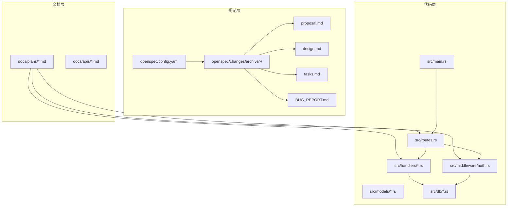
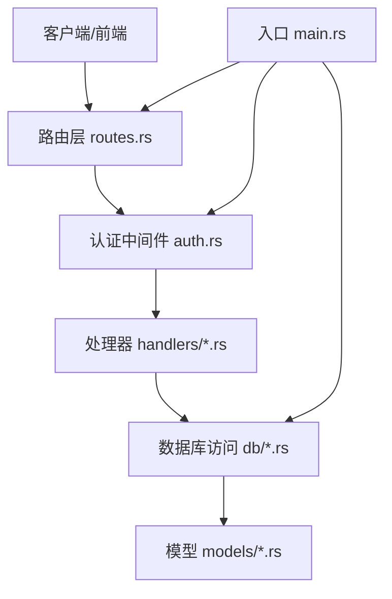
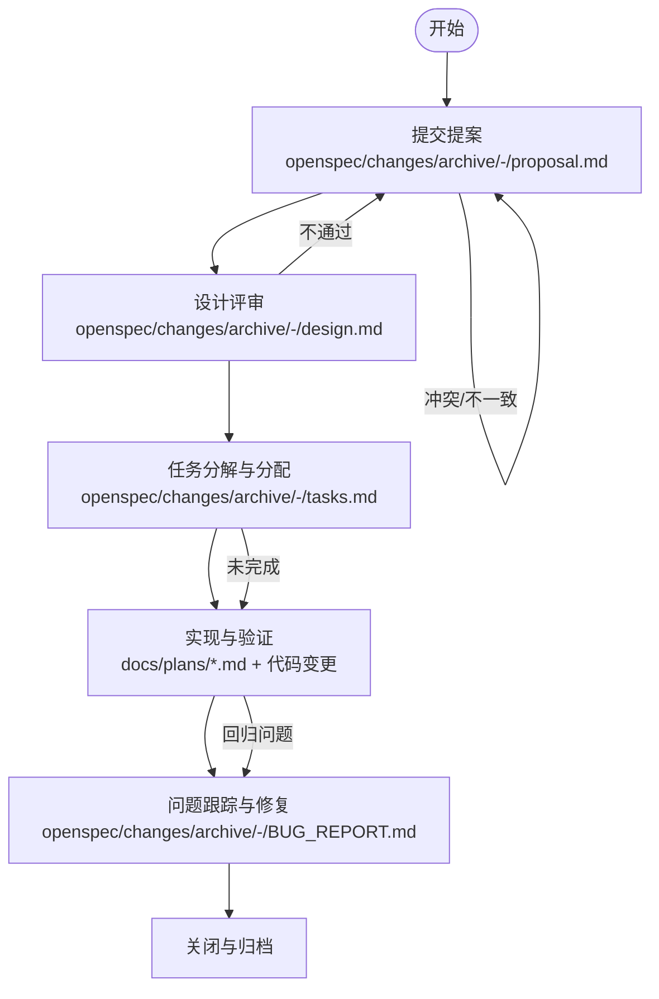
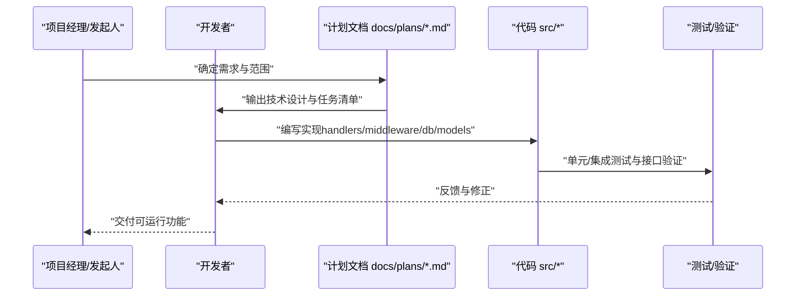
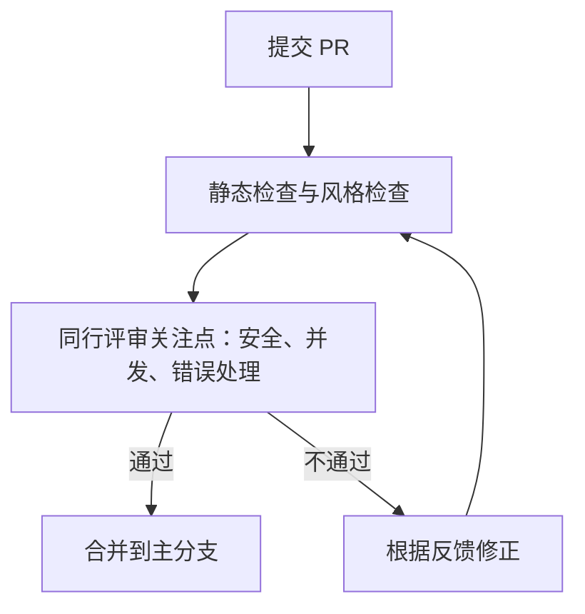
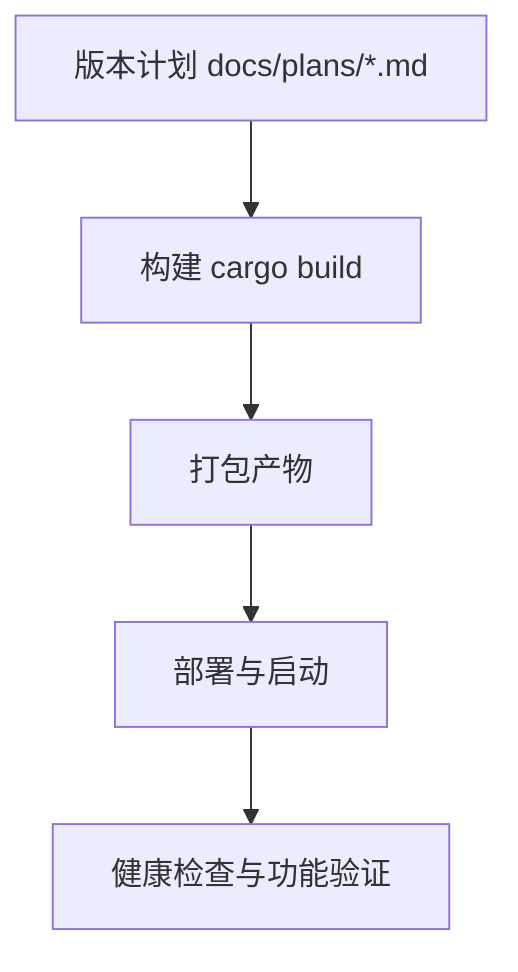
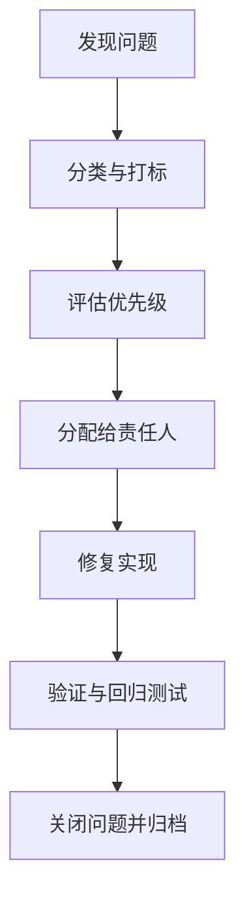
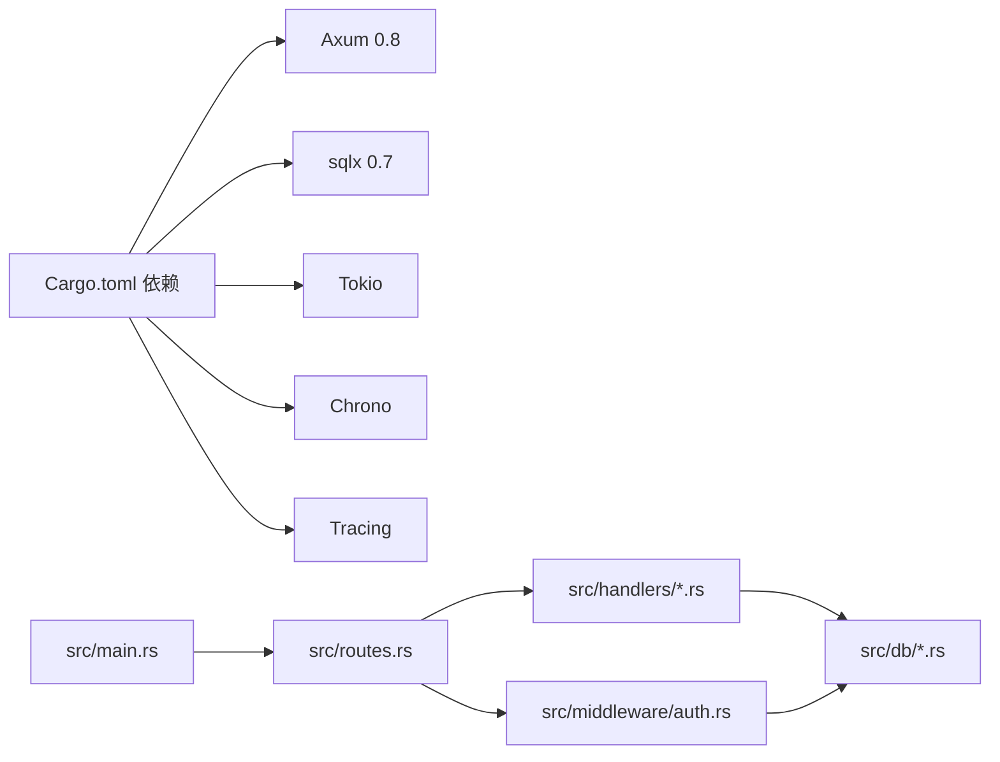

# 工作流程

<cite>
**本文引用的文件**
- [README.md](file://README.md)
- [Cargo.toml](file://Cargo.toml)
- [openspec/config.yaml](file://openspec/config.yaml)
- [openspec/changes/archive/2026-06-07-auth-middleware-and-token-api/proposal.md](file://openspec/changes/archive/2026-06-07-auth-middleware-and-token-api/proposal.md)
- [openspec/changes/archive/2026-06-07-auth-middleware-and-token-api/design.md](file://openspec/changes/archive/2026-06-07-auth-middleware-and-token-api/design.md)
- [openspec/changes/archive/2026-06-07-auth-middleware-and-token-api/tasks.md](file://openspec/changes/archive/2026-06-07-auth-middleware-and-token-api/tasks.md)
- [openspec/changes/archive/2026-06-07-auth-middleware-and-token-api/BUG_REPORT.md](file://openspec/changes/archive/2026-06-07-auth-middleware-and-token-api/BUG_REPORT.md)
- [docs/plans/03-auth-and-token-api.md](file://docs/plans/03-auth-and-token-api.md)
- [docs/plans/04-crud-apis.md](file://docs/plans/04-crud-apis.md)
- [src/main.rs](file://src/main.rs)
- [src/middleware/auth.rs](file://src/middleware/auth.rs)
- [src/handlers/token.rs](file://src/handlers/token.rs)
- [src/routes.rs](file://src/routes.rs)
</cite>

## 目录
1. [简介](#简介)
2. [项目结构](#项目结构)
3. [核心组件](#核心组件)
4. [架构总览](#架构总览)
5. [详细组件分析](#详细组件分析)
6. [依赖关系分析](#依赖关系分析)
7. [性能考量](#性能考量)
8. [故障排查指南](#故障排查指南)
9. [结论](#结论)
10. [附录](#附录)

## 简介
本文件面向 AI-Trend-Tool 项目的团队与贡献者，系统化梳理项目的工作流程，覆盖以下方面：
- OpenSpec 变更管理流程：提案提交、设计评审与任务分配机制
- 开发任务管理流程：需求分析、技术设计、实现与测试验证
- 代码审查流程：审查标准、反馈处理与合并策略
- 发布管理流程：版本规划、构建打包与部署发布
- 问题跟踪与缺陷管理：问题分类、优先级评估与修复验证
- 文档维护流程：确保技术文档与代码同步更新

本指南以仓库内现有规范与实现为依据，结合 OpenSpec 规范驱动方法与 Rust 后端工程实践，形成可落地、可复用的工作流程。

## 项目结构
AI-Trend-Tool 采用“规范驱动 + 分层架构”的组织方式：
- 规范层：openspec 目录下包含 OpenSpec 配置与变更归档，支撑提案、设计、任务与问题报告的规范化管理
- 文档层：docs/plans 与 docs/apis 提供阶段性实施计划与 API 设计说明
- 代码层：src 目录按领域分层组织（配置、路由、中间件、处理器、模型、数据库访问、服务等）
- 依赖层：Cargo.toml 定义语言与生态依赖，确保工具链一致性

图表来源
- [openspec/config.yaml:1-21](file://openspec/config.yaml#L1-L21)
- [openspec/changes/archive/2026-06-07-auth-middleware-and-token-api/proposal.md:1-33](file://openspec/changes/archive/2026-06-07-auth-middleware-and-token-api/proposal.md#L1-L33)
- [openspec/changes/archive/2026-06-07-auth-middleware-and-token-api/design.md:1-95](file://openspec/changes/archive/2026-06-07-auth-middleware-and-token-api/design.md#L1-L95)
- [openspec/changes/archive/2026-06-07-auth-middleware-and-token-api/tasks.md:1-51](file://openspec/changes/archive/2026-06-07-auth-middleware-and-token-api/tasks.md#L1-L51)
- [openspec/changes/archive/2026-06-07-auth-middleware-and-token-api/BUG_REPORT.md:1-90](file://openspec/changes/archive/2026-06-07-auth-middleware-and-token-api/BUG_REPORT.md#L1-L90)
- [docs/plans/03-auth-and-token-api.md:1-405](file://docs/plans/03-auth-and-token-api.md#L1-L405)
- [docs/plans/04-crud-apis.md:1-561](file://docs/plans/04-crud-apis.md#L1-L561)
- [src/main.rs:1-96](file://src/main.rs#L1-L96)
- [src/routes.rs:1-61](file://src/routes.rs#L1-L61)
- [src/middleware/auth.rs:1-60](file://src/middleware/auth.rs#L1-L60)
- [src/handlers/token.rs:1-66](file://src/handlers/token.rs#L1-L66)

章节来源
- [README.md:1-293](file://README.md#L1-L293)
- [Cargo.toml:1-44](file://Cargo.toml#L1-L44)

## 核心组件
- OpenSpec 规范引擎：通过 openspec/config.yaml 配置规范驱动工作流；变更归档目录保存提案、设计、任务与问题报告，形成“可追溯”的变更生命周期
- 认证中间件与 Token API：实现 Bearer Token 认证、初始 Token 引导、Token CRUD 能力，保障 API 安全边界
- 路由与模块组织：统一在 routes.rs 中注册 API 路由，应用认证中间件，分离 handlers 与 middleware 的职责
- 数据库与模型：通过 db 层封装 SQL 操作，配合 models 层的数据结构，支撑 CRUD 与业务逻辑
- 开发计划与实施：docs/plans/*.md 提供阶段目标、实现细节与验证节点，指导迭代推进

章节来源
- [openspec/config.yaml:1-21](file://openspec/config.yaml#L1-L21)
- [openspec/changes/archive/2026-06-07-auth-middleware-and-token-api/proposal.md:1-33](file://openspec/changes/archive/2026-06-07-auth-middleware-and-token-api/proposal.md#L1-L33)
- [openspec/changes/archive/2026-06-07-auth-middleware-and-token-api/design.md:1-95](file://openspec/changes/archive/2026-06-07-auth-middleware-and-token-api/design.md#L1-L95)
- [openspec/changes/archive/2026-06-07-auth-middleware-and-token-api/tasks.md:1-51](file://openspec/changes/archive/2026-06-07-auth-middleware-and-token-api/tasks.md#L1-L51)
- [docs/plans/03-auth-and-token-api.md:1-405](file://docs/plans/03-auth-and-token-api.md#L1-L405)
- [docs/plans/04-crud-apis.md:1-561](file://docs/plans/04-crud-apis.md#L1-L561)
- [src/main.rs:1-96](file://src/main.rs#L1-L96)
- [src/routes.rs:1-61](file://src/routes.rs#L1-L61)
- [src/middleware/auth.rs:1-60](file://src/middleware/auth.rs#L1-L60)
- [src/handlers/token.rs:1-66](file://src/handlers/token.rs#L1-L66)

## 架构总览
系统采用“规范驱动 + 管道模式”的整体架构：
- 规范驱动：OpenSpec 作为单一事实来源，贯穿需求、设计、任务与问题管理
- 管道模式：Parser/Filter/Pusher 三类后台模块独立运行，通过统一 API 与数据库协同
- 安全边界：认证中间件保护 API 路由，Token 管理 API 支持创建、列表与撤销
- 部署入口：main.rs 负责初始化数据库、迁移、初始 Token 引导与服务启动

图表来源
- [src/main.rs:1-96](file://src/main.rs#L1-L96)
- [src/routes.rs:1-61](file://src/routes.rs#L1-L61)
- [src/middleware/auth.rs:1-60](file://src/middleware/auth.rs#L1-L60)
- [src/handlers/token.rs:1-66](file://src/handlers/token.rs#L1-L66)

## 详细组件分析

### OpenSpec 变更管理流程
OpenSpec 通过“提案—设计—任务—问题报告”闭环管理变更，确保每次改动都有据可依、可回溯、可验证。

图表来源
- [openspec/changes/archive/2026-06-07-auth-middleware-and-token-api/proposal.md:1-33](file://openspec/changes/archive/2026-06-07-auth-middleware-and-token-api/proposal.md#L1-L33)
- [openspec/changes/archive/2026-06-07-auth-middleware-and-token-api/design.md:1-95](file://openspec/changes/archive/2026-06-07-auth-middleware-and-token-api/design.md#L1-L95)
- [openspec/changes/archive/2026-06-07-auth-middleware-and-token-api/tasks.md:1-51](file://openspec/changes/archive/2026-06-07-auth-middleware-and-token-api/tasks.md#L1-L51)
- [openspec/changes/archive/2026-06-07-auth-middleware-and-token-api/BUG_REPORT.md:1-90](file://openspec/changes/archive/2026-06-07-auth-middleware-and-token-api/BUG_REPORT.md#L1-L90)

章节来源
- [openspec/config.yaml:1-21](file://openspec/config.yaml#L1-L21)
- [openspec/changes/archive/2026-06-07-auth-middleware-and-token-api/proposal.md:1-33](file://openspec/changes/archive/2026-06-07-auth-middleware-and-token-api/proposal.md#L1-L33)
- [openspec/changes/archive/2026-06-07-auth-middleware-and-token-api/design.md:1-95](file://openspec/changes/archive/2026-06-07-auth-middleware-and-token-api/design.md#L1-L95)
- [openspec/changes/archive/2026-06-07-auth-middleware-and-token-api/tasks.md:1-51](file://openspec/changes/archive/2026-06-07-auth-middleware-and-token-api/tasks.md#L1-L51)
- [openspec/changes/archive/2026-06-07-auth-middleware-and-token-api/BUG_REPORT.md:1-90](file://openspec/changes/archive/2026-06-07-auth-middleware-and-token-api/BUG_REPORT.md#L1-L90)

### 开发任务管理流程
以“需求分析—技术设计—实现—测试验证”为主线，结合 docs/plans/*.md 与代码实现，形成可执行的任务清单与验证节点。

图表来源
- [docs/plans/03-auth-and-token-api.md:1-405](file://docs/plans/03-auth-and-token-api.md#L1-L405)
- [docs/plans/04-crud-apis.md:1-561](file://docs/plans/04-crud-apis.md#L1-L561)
- [src/routes.rs:1-61](file://src/routes.rs#L1-L61)
- [src/middleware/auth.rs:1-60](file://src/middleware/auth.rs#L1-L60)
- [src/handlers/token.rs:1-66](file://src/handlers/token.rs#L1-L66)

章节来源
- [docs/plans/03-auth-and-token-api.md:1-405](file://docs/plans/03-auth-and-token-api.md#L1-L405)
- [docs/plans/04-crud-apis.md:1-561](file://docs/plans/04-crud-apis.md#L1-L561)

### 代码审查流程
- 审查标准：遵循统一错误处理、安全边界（认证中间件）、数据库一致性与 API 响应格式
- 反馈处理：针对中间件与处理器的实现进行逐项核对，确保路径提取兼容性与并发更新的正确性
- 合并策略：采用最小可行变更，确保变更前后行为一致并通过验证节点

图表来源
- [src/middleware/auth.rs:1-60](file://src/middleware/auth.rs#L1-L60)
- [src/handlers/token.rs:1-66](file://src/handlers/token.rs#L1-L66)
- [openspec/changes/archive/2026-06-07-auth-middleware-and-token-api/BUG_REPORT.md:1-90](file://openspec/changes/archive/2026-06-07-auth-middleware-and-token-api/BUG_REPORT.md#L1-L90)

章节来源
- [src/middleware/auth.rs:1-60](file://src/middleware/auth.rs#L1-L60)
- [src/handlers/token.rs:1-66](file://src/handlers/token.rs#L1-L66)
- [openspec/changes/archive/2026-06-07-auth-middleware-and-token-api/BUG_REPORT.md:1-90](file://openspec/changes/archive/2026-06-07-auth-middleware-and-token-api/BUG_REPORT.md#L1-L90)

### 发布管理流程
- 版本规划：以 docs/plans/*.md 为依据，明确每个阶段的目标与交付物
- 构建打包：使用 Cargo 工具链进行编译与打包，确保依赖版本一致
- 部署发布：通过 main.rs 初始化数据库、执行迁移、引导初始 Token 并启动服务

图表来源
- [docs/plans/03-auth-and-token-api.md:1-405](file://docs/plans/03-auth-and-token-api.md#L1-L405)
- [src/main.rs:1-96](file://src/main.rs#L1-L96)
- [Cargo.toml:1-44](file://Cargo.toml#L1-L44)

章节来源
- [docs/plans/03-auth-and-token-api.md:1-405](file://docs/plans/03-auth-and-token-api.md#L1-L405)
- [src/main.rs:1-96](file://src/main.rs#L1-L96)
- [Cargo.toml:1-44](file://Cargo.toml#L1-L44)

### 问题跟踪与缺陷管理
- 问题分类：按功能域（认证、Token、CRUD API、推送）与严重程度（阻塞性、破坏性、一般性）分类
- 优先级评估：结合影响面与修复成本，确定修复顺序
- 修复验证：通过变更归档中的问题报告与验证节点，确保问题得到闭环处理

图表来源
- [openspec/changes/archive/2026-06-07-auth-middleware-and-token-api/BUG_REPORT.md:1-90](file://openspec/changes/archive/2026-06-07-auth-middleware-and-token-api/BUG_REPORT.md#L1-L90)
- [openspec/changes/archive/2026-06-07-auth-middleware-and-token-api/tasks.md:1-51](file://openspec/changes/archive/2026-06-07-auth-middleware-and-token-api/tasks.md#L1-L51)

章节来源
- [openspec/changes/archive/2026-06-07-auth-middleware-and-token-api/BUG_REPORT.md:1-90](file://openspec/changes/archive/2026-06-07-auth-middleware-and-token-api/BUG_REPORT.md#L1-L90)
- [openspec/changes/archive/2026-06-07-auth-middleware-and-token-api/tasks.md:1-51](file://openspec/changes/archive/2026-06-07-auth-middleware-and-token-api/tasks.md#L1-L51)

### 文档维护流程
- 同步更新：每次代码变更后，同步更新对应 docs/plans/*.md 与 OpenSpec 归档文档
- 质量控制：通过统一的错误响应格式与 API 设计规范，保证文档与实现一致
- 可追溯性：OpenSpec 归档保留完整的历史版本，便于审计与回溯

章节来源
- [docs/plans/03-auth-and-token-api.md:1-405](file://docs/plans/03-auth-and-token-api.md#L1-L405)
- [docs/plans/04-crud-apis.md:1-561](file://docs/plans/04-crud-apis.md#L1-L561)
- [openspec/changes/archive/2026-06-07-auth-middleware-and-token-api/proposal.md:1-33](file://openspec/changes/archive/2026-06-07-auth-middleware-and-token-api/proposal.md#L1-L33)
- [openspec/changes/archive/2026-06-07-auth-middleware-and-token-api/design.md:1-95](file://openspec/changes/archive/2026-06-07-auth-middleware-and-token-api/design.md#L1-L95)

## 依赖关系分析
- 语言与框架：Rust 2021、Axum 0.8、sqlx 0.7、Tokio、Chrono、Tracing、Clap 等
- 安全与认证：Bearer Token 认证中间件依赖数据库校验与过期检查
- 数据层：统一通过 db 层访问 SQLite，配合 models 层的数据结构
- 路由与中间件：认证中间件以嵌套路由方式作用于 /api/v1，/health 保持开放

图表来源
- [Cargo.toml:1-44](file://Cargo.toml#L1-L44)
- [src/main.rs:1-96](file://src/main.rs#L1-L96)
- [src/routes.rs:1-61](file://src/routes.rs#L1-L61)
- [src/middleware/auth.rs:1-60](file://src/middleware/auth.rs#L1-L60)
- [src/handlers/token.rs:1-66](file://src/handlers/token.rs#L1-L66)

章节来源
- [Cargo.toml:1-44](file://Cargo.toml#L1-L44)
- [src/main.rs:1-96](file://src/main.rs#L1-L96)
- [src/routes.rs:1-61](file://src/routes.rs#L1-L61)
- [src/middleware/auth.rs:1-60](file://src/middleware/auth.rs#L1-L60)
- [src/handlers/token.rs:1-66](file://src/handlers/token.rs#L1-L66)

## 性能考量
- 并发与吞吐：认证中间件采用 fire-and-forget 的 last_used_at 更新，避免阻塞请求；Tokio spawn 用于后台更新，降低延迟
- 数据库写入：SQLite 序列化写入，避免高并发下的写锁竞争；建议在高负载场景下评估 WAL 模式与连接池配置
- 网络与重试：推送模块采用指数退避重试与乐观锁，减少重复推送与资源争用

## 故障排查指南
- 认证失败
  - 检查 Authorization 头是否为 Bearer 格式
  - 确认 Token 未被撤销且未过期
  - 查看中间件日志与数据库状态
- 路由匹配问题
  - 避免在应用中间件时使用 Path 提取器；参考问题报告中的规避方案
- 初始 Token 问题
  - 首次启动时若未配置 initial_token，系统会自动生成并记录；请检查日志输出

章节来源
- [src/middleware/auth.rs:1-60](file://src/middleware/auth.rs#L1-L60)
- [src/main.rs:1-96](file://src/main.rs#L1-L96)
- [openspec/changes/archive/2026-06-07-auth-middleware-and-token-api/BUG_REPORT.md:1-90](file://openspec/changes/archive/2026-06-07-auth-middleware-and-token-api/BUG_REPORT.md#L1-L90)

## 结论
本工作流程以 OpenSpec 为核心，结合 docs/plans 与代码实现，形成了从提案到发布的完整闭环。通过规范化的变更管理、清晰的开发任务分解、严格的代码审查与问题跟踪，以及与代码同步的文档维护，确保项目在演进过程中保持一致性、可追溯性与可维护性。

## 附录
- 快速开始与配置参考：参阅项目根目录 README 与 config.toml
- API 设计与端点说明：参阅 docs/apis 与 docs/plans 中的 API 描述