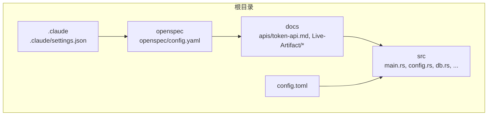
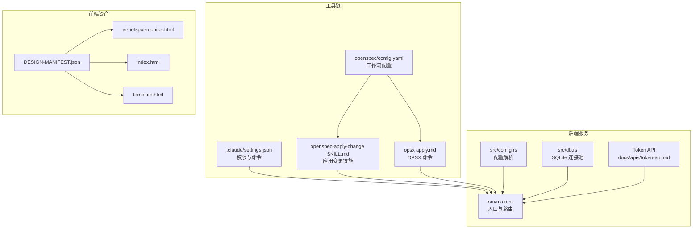
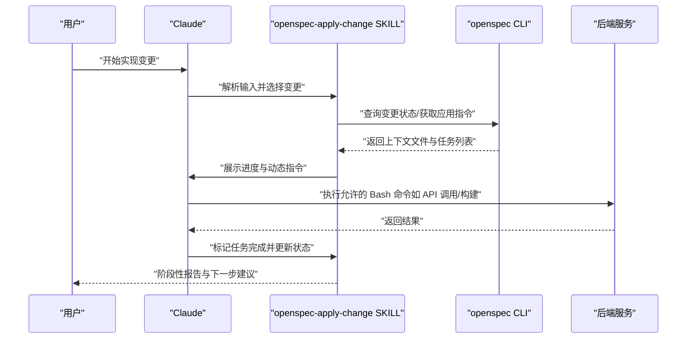
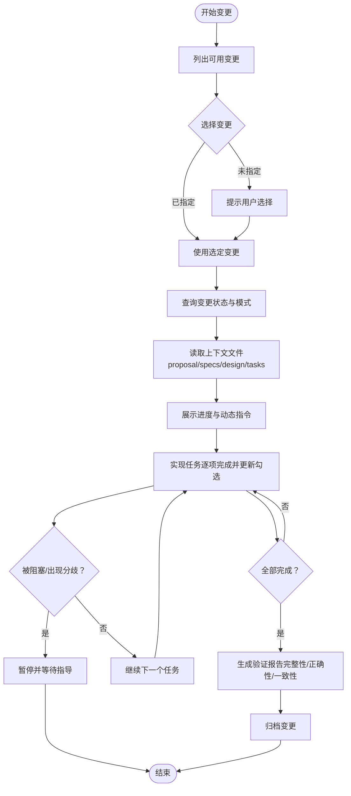
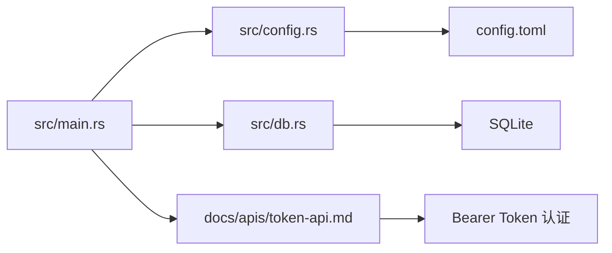

# 工具集成

<cite>
**本文引用的文件**
- [settings.json](file://.claude/settings.json)
- [CLAUDE.md](file://CLAUDE.md)
- [Cargo.toml](file://Cargo.toml)
- [config.toml](file://config.toml)
- [main.rs](file://src/main.rs)
- [config.rs](file://src/config.rs)
- [db.rs](file://src/db.rs)
- [token-api.md](file://docs/apis/token-api.md)
- [README.md](file://README.md)
- [openspec-apply-change SKILL.md](file://.claude/skills/openspec-apply-change/SKILL.md)
- [opsx apply.md](file://.claude/commands/opsx/apply.md)
- [openspec config.yaml](file://openspec/config.yaml)
- [DESIGN-MANIFEST.json](file://docs/Live-Artifact/DESIGN-MANIFEST.json)
- [index.html](file://docs/Live-Artifact/index.html)
- [ai-hotspot-monitor.html](file://docs/Live-Artifact/ai-hotspot-monitor.html)
- [template.html](file://docs/Live-Artifact/template.html)
</cite>

## 目录
1. [简介](#简介)
2. [项目结构](#项目结构)
3. [核心组件](#核心组件)
4. [架构总览](#架构总览)
5. [详细组件分析](#详细组件分析)
6. [依赖关系分析](#依赖关系分析)
7. [性能考虑](#性能考虑)
8. [故障排查指南](#故障排查指南)
9. [结论](#结论)
10. [附录](#附录)

## 简介
本文件面向“AI-Trend-Tool”项目的工具集成功能，围绕以下目标展开：
- Claude AI 工具的配置与使用：命令配置、技能设置、与 OpenSpec 工作流联动的自动化工作流。
- OpenSpec 工具链：规格文档生成、变更追踪与版本管理。
- 代码生成工具配置：模板引擎、代码片段管理与自定义生成器的实践建议。
- CI/CD 流水线集成：自动化测试、部署与监控。
- 调试工具配置：性能分析器、内存检测器与网络监控工具。
- 开发辅助工具推荐与配置指南。

本指南兼顾技术细节与可操作性，帮助不同背景的读者快速上手并高效集成工具链。

## 项目结构
项目采用分层与功能域结合的组织方式：
- 根目录包含配置与工具链配置：.claude（Claude 工具与技能）、openspec（OpenSpec 工作流）、docs（API 文档与设计资产）、src（Rust 后端主程序与模块）。
- .claude 下包含命令与技能，用于驱动 OpenSpec 工作流与自动化任务。
- openspec 下包含主规格与变更归档，支撑规范驱动的开发与版本管理。
- docs 包含 API 文档、Live Artifact 设计清单与前端模板，便于前端集成与可视化。

**图表来源**
- [.claude/settings.json:1-14](file://.claude/settings.json#L1-L14)
- [openspec config.yaml:1-21](file://openspec/config.yaml#L1-L21)
- [config.toml:1-27](file://config.toml#L1-L27)
- [README.md:216-257](file://README.md#L216-L257)

**章节来源**
- [README.md:216-257](file://README.md#L216-L257)
- [.claude/settings.json:1-14](file://.claude/settings.json#L1-L14)
- [openspec config.yaml:1-21](file://openspec/config.yaml#L1-L21)
- [config.toml:1-27](file://config.toml#L1-L27)

## 核心组件
- Claude 工具与权限配置：.claude/settings.json 定义允许的 Bash 权限，支持本地 API 调用、进程控制与构建命令等。
- OpenSpec 工具链：openspec/config.yaml 定义工作流模式与可选的项目上下文与规则；.claude/skills/openspec-apply-change 与 .claude/commands/opsx/apply 提供自动化应用变更的技能与命令。
- 后端服务与配置：src/main.rs 作为入口，加载 config.toml 并初始化数据库、路由与服务；src/config.rs 定义配置结构；src/db.rs 初始化 SQLite 连接池。
- API 文档与认证：docs/apis/token-api.md 描述 Token API 的认证与端点；README.md 提供统一的 API 使用示例与错误格式说明。
- 前端设计资产：docs/Live-Artifact/DESIGN-MANIFEST.json、index.html、ai-hotspot-monitor.html、template.html 为前端集成提供清单与页面模板。

**章节来源**
- [.claude/settings.json:1-14](file://.claude/settings.json#L1-L14)
- [openspec-apply-change SKILL.md:1-157](file://.claude/skills/openspec-apply-change/SKILL.md#L1-L157)
- [opsx apply.md:1-153](file://.claude/commands/opsx/apply.md#L1-L153)
- [openspec config.yaml:1-21](file://openspec/config.yaml#L1-L21)
- [src/main.rs:1-96](file://src/main.rs#L1-L96)
- [src/config.rs:1-59](file://src/config.rs#L1-L59)
- [src/db.rs:1-26](file://src/db.rs#L1-L26)
- [token-api.md:1-198](file://docs/apis/token-api.md#L1-L198)
- [README.md:123-202](file://README.md#L123-L202)
- [DESIGN-MANIFEST.json:1-49](file://docs/Live-Artifact/DESIGN-MANIFEST.json#L1-L49)
- [index.html:268-283](file://docs/Live-Artifact/index.html#L268-L283)
- [ai-hotspot-monitor.html:269-284](file://docs/Live-Artifact/ai-hotspot-monitor.html#L269-L284)
- [template.html:297-307](file://docs/Live-Artifact/template.html#L297-L307)

## 架构总览
后端采用“管道模式”，三个后台模块独立运行：Parser（RSS 采集）、Filter（关键词匹配与热点检测）、Pusher（Webhook 推送）。服务通过 Axum 提供 REST API，并以 SQLite 存储数据。Claude 工具与 OpenSpec 工具链贯穿设计、实现与验证阶段，形成从规格到代码的闭环。

**图表来源**
- [src/main.rs:1-96](file://src/main.rs#L1-L96)
- [src/config.rs:1-59](file://src/config.rs#L1-L59)
- [src/db.rs:1-26](file://src/db.rs#L1-L26)
- [.claude/settings.json:1-14](file://.claude/settings.json#L1-L14)
- [openspec config.yaml:1-21](file://openspec/config.yaml#L1-L21)
- [openspec-apply-change SKILL.md:1-157](file://.claude/skills/openspec-apply-change/SKILL.md#L1-L157)
- [opsx apply.md:1-153](file://.claude/commands/opsx/apply.md#L1-L153)
- [token-api.md:1-198](file://docs/apis/token-api.md#L1-L198)
- [DESIGN-MANIFEST.json:1-49](file://docs/Live-Artifact/DESIGN-MANIFEST.json#L1-L49)
- [index.html:268-283](file://docs/Live-Artifact/index.html#L268-L283)
- [ai-hotspot-monitor.html:269-284](file://docs/Live-Artifact/ai-hotspot-monitor.html#L269-L284)
- [template.html:297-307](file://docs/Live-Artifact/template.html#L297-L307)

## 详细组件分析

### Claude AI 工具配置与使用
- 权限与命令
  - .claude/settings.json 中的 permissions.allow 列表定义了允许 Claude 执行的 Bash 命令，覆盖本地 API 调用、进程控制与构建命令等场景，确保工具可在受控范围内与后端交互。
  - CLAUDE.md 提供项目概览、架构与命令示例，便于在 Claude 环境中理解项目目标与运行方式。
- 技能与自动化工作流
  - openspec-apply-change SKILL.md 与 opsx apply.md 描述了如何从 OpenSpec 变更中提取任务并逐步实现，支持“随时介入”的灵活工作流，适合与 Claude 协作进行增量实现与验证。
  - 技能步骤包括：选择变更、检查状态、读取上下文文件、展示进度、实现任务并更新任务勾选状态、在阻塞或问题时暂停并等待指导。
- 与后端的集成
  - Claude 可通过允许的 Bash 命令调用本地 API（如 Token 管理）与执行构建/运行命令，从而在 AI 辅助下完成从设计到实现再到验证的全流程。

**图表来源**
- [openspec-apply-change SKILL.md:16-84](file://.claude/skills/openspec-apply-change/SKILL.md#L16-L84)
- [opsx apply.md:12-84](file://.claude/commands/opsx/apply.md#L12-L84)
- [.claude/settings.json:2-12](file://.claude/settings.json#L2-L12)
- [token-api.md:62-119](file://docs/apis/token-api.md#L62-L119)

**章节来源**
- [.claude/settings.json:1-14](file://.claude/settings.json#L1-L14)
- [CLAUDE.md:1-85](file://CLAUDE.md#L1-L85)
- [openspec-apply-change SKILL.md:1-157](file://.claude/skills/openspec-apply-change/SKILL.md#L1-L157)
- [opsx apply.md:1-153](file://..claude/commands/opsx/apply.md#L1-L153)
- [token-api.md:1-198](file://docs/apis/token-api.md#L1-L198)

### OpenSpec 工具链：规格文档、变更追踪与版本管理
- 工作流模式
  - openspec/config.yaml 指定 schema 为 spec-driven，并可添加项目上下文与特定工件规则，确保 AI 在生成与验证时具备一致的上下文与约束。
- 变更追踪与版本管理
  - openspec/specs/ 下存放主规格文档；openspec/changes/archive/ 下按日期归档历史变更，便于回溯与审计。
- 自动化应用与验证
  - 通过 openspec-apply-change SKILL 与 opsx apply 命令，可从变更中提取任务并逐步实现，配合 verify 步骤对完整性、正确性与一致性进行评估，最终生成验证报告，支持“先实现、再归档”的敏捷工作流。

**图表来源**
- [openspec-apply-change SKILL.md:16-84](file://.claude/skills/openspec-apply-change/SKILL.md#L16-L84)
- [opsx apply.md:12-84](file://.claude/commands/opsx/apply.md#L12-L84)
- [openspec config.yaml:1-21](file://openspec/config.yaml#L1-L21)

**章节来源**
- [openspec config.yaml:1-21](file://openspec/config.yaml#L1-L21)
- [openspec-apply-change SKILL.md:1-157](file://.claude/skills/openspec-apply-change/SKILL.md#L1-L157)
- [opsx apply.md:1-153](file://.claude/commands/opsx/apply.md#L1-L153)

### 代码生成工具配置：模板引擎、代码片段管理与自定义生成器
- 模板引擎与前端集成
  - docs/Live-Artifact/DESIGN-MANIFEST.json 定义了入口文件与屏幕清单，index.html、ai-hotspot-monitor.html、template.html 提供页面模板，便于前端生成与维护。
  - 建议在模板中保留视觉层级、响应式行为与交互状态，确保生成物与设计稿一致。
- 代码片段管理
  - 建议将常用代码片段（如 API 调用、数据库操作、中间件封装）集中管理，形成可复用的片段库，减少重复劳动。
- 自定义生成器
  - 可基于 OpenSpec 的变更与上下文文件，编写自定义生成器脚本，自动映射规格到具体实现（如路由、处理器、模型与数据库操作），并在实现过程中持续校验与更新任务勾选状态。

**章节来源**
- [DESIGN-MANIFEST.json:1-49](file://docs/Live-Artifact/DESIGN-MANIFEST.json#L1-L49)
- [index.html:268-283](file://docs/Live-Artifact/index.html#L268-L283)
- [ai-hotspot-monitor.html:269-284](file://docs/Live-Artifact/ai-hotspot-monitor.html#L269-L284)
- [template.html:297-307](file://docs/Live-Artifact/template.html#L297-L307)

### CI/CD 流水线集成：自动化测试、部署与监控
- 自动化测试
  - 建议在 CI 中包含：单元测试与集成测试（Rust 测试框架）、API 端到端测试（基于 token-api.md 的端点与错误格式）、前端静态资源校验（对比多分辨率截图）。
- 部署
  - 使用 Cargo 构建发布版本（release），将二进制与 SQLite 数据文件打包部署；在部署前执行数据库迁移（sqlx migrate run）。
- 监控
  - 集成日志与健康检查（/health），在生产环境启用 tracing 日志并通过外部监控系统收集指标（如请求延迟、错误率、数据库连接池状态）。

**章节来源**
- [README.md:38-72](file://README.md#L38-L72)
- [token-api.md:42-58](file://docs/apis/token-api.md#L42-L58)
- [Cargo.toml:1-44](file://Cargo.toml#L1-L44)

### 调试工具配置：性能分析器、内存检测器与网络监控
- 性能分析器
  - 使用 Rust 的火焰图工具（perf 或 flamegraph）对后端服务进行采样分析，定位 CPU 密集型模块（如 Parser/Filter/Pusher 的热点）。
- 内存检测器
  - 使用 valgrind/memray 检测内存泄漏与异常增长，重点关注数据库连接池与并发任务的生命周期管理。
- 网络监控
  - 使用 Wireshark 或 tcpdump 抓包，验证 RSS 采集与 Webhook 推送的网络行为；结合后端日志中的 HTTP 状态码（参考 token-api.md 的错误格式）进行关联分析。

**章节来源**
- [token-api.md:17-37](file://docs/apis/token-api.md#L17-L37)

### 开发辅助工具推荐与配置指南
- IDE 与扩展
  - VS Code/Rust Analyzer：启用 clippy lint 与 rustfmt 格式化；配置 env-filter 以聚焦关键日志。
- 版本控制与协作
  - Conventional Commits 与 OpenSpec 变更配合，确保每次提交与规格变更一一对应，便于追溯。
- 文档与设计
  - 保持 docs/apis/token-api.md 与实际实现同步；前端设计资产与模板文件应与 DESIGN-MANIFEST.json 保持一致。

**章节来源**
- [openspec config.yaml:3-20](file://openspec/config.yaml#L3-L20)
- [README.md:82-89](file://README.md#L82-L89)

## 依赖关系分析
后端服务依赖关系清晰：入口模块负责解析 CLI 参数与配置、初始化数据库连接池、运行迁移并启动服务；配置模块提供结构化配置；数据库模块提供连接池与 PRAGMA 设置；API 文档描述认证与端点；前端设计资产提供页面模板与清单。

**图表来源**
- [src/main.rs:1-96](file://src/main.rs#L1-L96)
- [src/config.rs:1-59](file://src/config.rs#L1-L59)
- [src/db.rs:1-26](file://src/db.rs#L1-L26)
- [token-api.md:5-13](file://docs/apis/token-api.md#L5-L13)
- [config.toml:1-27](file://config.toml#L1-L27)

**章节来源**
- [src/main.rs:1-96](file://src/main.rs#L1-L96)
- [src/config.rs:1-59](file://src/config.rs#L1-L59)
- [src/db.rs:1-26](file://src/db.rs#L1-L26)
- [token-api.md:1-198](file://docs/apis/token-api.md#L1-L198)
- [config.toml:1-27](file://config.toml#L1-L27)

## 性能考虑
- 数据库连接池
  - SQLite 连接池最大连接数与 WAL 模式、外键约束已在初始化时设置，建议根据并发需求调整 max_connections，并监控连接池命中率。
- 并发与调度
  - Parser/Filter/Pusher 的并发与轮询间隔（config.toml 中的各模块配置）直接影响吞吐与延迟，建议在预生产环境中进行压力测试并优化。
- 日志与可观测性
  - 使用 tracing-subscriber 的 env-filter 控制日志级别，避免在高负载时产生过多 I/O；结合外部监控系统收集关键指标。

**章节来源**
- [src/db.rs:9-26](file://src/db.rs#L9-L26)
- [config.toml:12-27](file://config.toml#L12-L27)
- [Cargo.toml:25-27](file://Cargo.toml#L25-L27)

## 故障排查指南
- 认证失败
  - 确认 Authorization 头是否携带有效 Bearer Token；检查 Token 是否撤销或过期；参考 token-api.md 的错误格式与状态码。
- 数据库连接问题
  - 检查 SQLite 数据库路径与文件权限；确认 WAL 模式与外键约束已启用；查看连接池初始化日志。
- API 健康检查
  - 使用 /health 端点快速判断服务可用性；若不可用，检查服务启动日志与端口占用情况。
- 变更实现阻塞
  - 若任务不明确或实现发现设计问题，暂停并更新相关工件（proposal/specs/design/tasks），重新获取应用指令后再继续。

**章节来源**
- [token-api.md:5-13](file://docs/apis/token-api.md#L5-L13)
- [token-api.md:17-37](file://docs/apis/token-api.md#L17-L37)
- [src/db.rs:11-25](file://src/db.rs#L11-L25)
- [token-api.md:42-58](file://docs/apis/token-api.md#L42-L58)
- [openspec-apply-change SKILL.md:72-80](file://.claude/skills/openspec-apply-change/SKILL.md#L72-L80)

## 结论
通过将 Claude 工具与 OpenSpec 工具链深度集成，AI-Trend-Tool 实现了从规格到代码的自动化工作流；结合完善的配置与 API 文档、前端设计资产与 CI/CD 流程，项目能够在保证质量的同时提升开发效率。建议在实践中持续完善模板与生成器、强化监控与调试能力，并将变更与提交保持对齐，以获得最佳的工具集成功能体验。

## 附录
- 快速命令参考
  - 运行全部模块：cargo run -- --config config.toml all
  - 仅运行 API 服务：cargo run -- --config config.toml api
  - 仅运行 Parser/Filter/Pusher：cargo run -- parser|filter|pusher
  - 数据库迁移：cargo sqlx migrate run
  - 前端开发/构建：cd frontend && npm run dev/build
  - 生产构建：cargo build --release

**章节来源**
- [CLAUDE.md:39-58](file://CLAUDE.md#L39-L58)
- [README.md:45-72](file://README.md#L45-L72)