# 开发指南

<cite>
**本文引用的文件**
- [Cargo.toml](file://Cargo.toml)
- [README.md](file://README.md)
- [config.toml](file://config.toml)
- [src/main.rs](file://src/main.rs)
- [src/config.rs](file://src/config.rs)
- [src/error.rs](file://src/error.rs)
- [src/db.rs](file://src/db.rs)
- [src/routes.rs](file://src/routes.rs)
- [src/middleware.rs](file://src/middleware.rs)
- [src/models.rs](file://src/models.rs)
- [src/handlers.rs](file://src/handlers.rs)
- [src/services.rs](file://src/services.rs)
- [src/middleware/auth.rs](file://src/middleware/auth.rs)
- [src/handlers/token.rs](file://src/handlers/token.rs)
- [src/handlers/query.rs](file://src/handlers/query.rs)
- [src/services/parser.rs](file://src/services/parser.rs)
- [src/services/filter.rs](file://src/services/filter.rs)
- [src/services/pusher.rs](file://src/services/pusher.rs)
- [CLAUDE.md](file://CLAUDE.md)
- [docs/Live-Artifact/DESIGN-HANDOFF.md](file://docs/Live-Artifact/DESIGN-HANDOFF.md)
- [docs/Live-Artifact/DESIGN-MANIFEST.json](file://docs/Live-Artifact/DESIGN-MANIFEST.json)
- [docs/Live-Artifact/index.html](file://docs/Live-Artifact/index.html)
- [docs/Live-Artifact/ai-hotspot-monitor.html](file://docs/Live-Artifact/ai-hotspot-monitor.html)
- [docs/Live-Artifact/template.html](file://docs/Live-Artifact/template.html)
- [docs/plans/06-frontend-setup.md](file://docs/plans/06-frontend-setup.md)
- [openspec/changes/frontend-setup/design.md](file://openspec/changes/frontend-setup/design.md)
- [openspec/changes/frontend-setup/proposal.md](file://openspec/changes/frontend-setup/proposal.md)
- [openspec/changes/frontend-setup/specs/frontend-project-scaffold/spec.md](file://openspec/changes/frontend-setup/specs/frontend-project-scaffold/spec.md)
- [openspec/changes/frontend-setup/specs/app-layout/spec.md](file://openspec/changes/frontend-setup/specs/app-layout/spec.md)
- [openspec/changes/frontend-setup/specs/auth-page/spec.md](file://openspec/changes/frontend-setup/specs/auth-page/spec.md)
- [openspec/changes/frontend-setup/specs/design-token-system/spec.md](file://openspec/changes/frontend-setup/specs/design-token-system/spec.md)
- [openspec/changes/frontend-setup/specs/shared-components/spec.md](file://openspec/changes/frontend-setup/specs/shared-components/spec.md)
- [openspec/changes/frontend-setup/specs/api-client-layer/spec.md](file://openspec/changes/frontend-setup/specs/api-client-layer/spec.md)
- [web/package.json](file://web/package.json)
- [web/electron.vite.config.ts](file://web/electron.vite.config.ts)
- [web/tsconfig.json](file://web/tsconfig.json)
- [web/tsconfig.node.json](file://web/tsconfig.node.json)
- [web/tsconfig.web.json](file://web/tsconfig.web.json)
- [web/src/main/index.ts](file://web/src/main/index.ts)
- [web/src/preload/index.ts](file://web/src/preload/index.ts)
- [web/src/renderer/src/App.tsx](file://web/src/renderer/src/App.tsx)
- [web/src/renderer/src/main.tsx](file://web/src/renderer/src/main.tsx)
- [web/src/renderer/src/api/client.ts](file://web/src/renderer/src/api/client.ts)
- [web/src/renderer/src/theme/tokens.ts](file://web/src/renderer/src/theme/tokens.ts)
- [web/src/renderer/src/theme/config.tsx](file://web/src/renderer/src/theme/config.tsx)
- [web/src/renderer/src/pages/Dashboard.tsx](file://web/src/renderer/src/pages/Dashboard.tsx)
- [web/src/renderer/src/pages/Auth.tsx](file://web/src/renderer/src/pages/Auth.tsx)
- [web/src/renderer/src/components/Layout.tsx](file://web/src/renderer/src/components/Layout.tsx)
- [web/src/renderer/src/hooks/useApi.ts](file://web/src/renderer/src/hooks/useApi.ts)
- [web/src/renderer/src/hooks/useMessage.ts](file://web/src/renderer/src/hooks/useMessage.ts)
</cite>

## 更新摘要
**所做更改**
- 新增完整的前端基础设施文档，包括Electron桌面应用架构
- 详细说明React 19、TypeScript、Vite构建工具链的配置与使用
- 补充设计系统与组件开发规范，基于Live Artifact原型
- 新增API客户端层的实现细节与类型安全机制
- 完善前后端协同开发的最佳实践与开发流程

## 目录
1. [简介](#简介)
2. [项目结构](#项目结构)
3. [核心组件](#核心组件)
4. [架构总览](#架构总览)
5. [详细组件分析](#详细组件分析)
6. [前端开发规范](#前端开发规范)
7. [依赖关系分析](#依赖关系分析)
8. [性能考虑](#性能考虑)
9. [故障排查指南](#故障排查指南)
10. [结论](#结论)
11. [附录](#附录)

## 简介
本指南面向参与"AI趋势监控系统"全栈开发的工程师，系统性阐述代码结构、模块划分、开发约定与最佳实践。重点覆盖：
- Rust异步编程模型与Tokio运行时的使用方式
- 并发编程最佳实践（信号量、任务拆分、错误隔离）
- 统一错误处理与响应格式
- 新增功能模块的开发流程、代码规范与测试要求
- OpenSpec规范驱动的开发工作流
- 新增API端点、数据库模型与业务逻辑模块的步骤
- **新增** Electron桌面应用架构与前端开发规范
- **新增** React 19 + TypeScript + Vite技术栈的完整实现
- **新增** 设计系统与组件规范，基于Live Artifact原型
- **新增** 类型安全的API客户端层实现
- **新增** 前后端协同开发最佳实践
- 代码审查清单、性能优化建议与安全编码指南
- 贡献代码的完整流程与开发环境搭建

## 项目结构
项目采用"分层+模块化"的组织方式，现已扩展为全栈架构，包含完整的前端基础设施：
- **后端入口与配置**：main.rs、config.rs、config.toml
- **Web框架与路由**：routes.rs、handlers（模块入口）、middleware（模块入口）
- **数据访问**：db.rs（连接池初始化）、db子模块（各实体DAO）
- **模型**：models.rs（模块入口）、各实体模型
- **业务服务**：services.rs（模块入口）、parser/filter/pusher
- **错误处理**：error.rs（统一错误与响应封装）
- **前端架构**：Electron + React 19 + Vite + TypeScript
- **设计系统**：Live Artifact原型与设计规范
- **API客户端层**：类型安全的HTTP调用封装

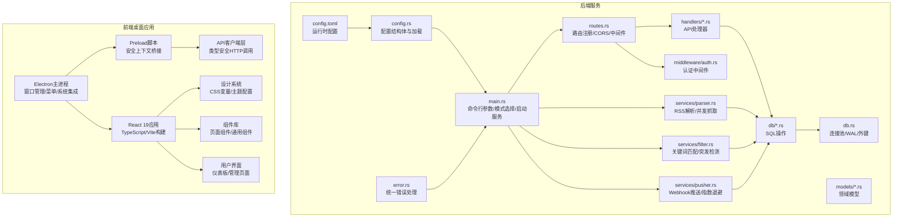

**图表来源**
- [src/main.rs:64-164](file://src/main.rs#L64-L164)
- [src/config.rs:51-58](file://src/config.rs#L51-L58)
- [src/routes.rs:14-70](file://src/routes.rs#L14-L70)
- [src/db.rs:10-27](file://src/db.rs#L10-L27)
- [web/src/main/index.ts](file://web/src/main/index.ts)
- [web/src/preload/index.ts](file://web/src/preload/index.ts)
- [web/src/renderer/src/App.tsx](file://web/src/renderer/src/App.tsx)

**章节来源**
- [README.md:216-257](file://README.md#L216-L257)
- [src/main.rs:1-164](file://src/main.rs#L1-L164)
- [src/config.rs:1-58](file://src/config.rs#L1-L58)
- [src/db.rs:1-27](file://src/db.rs#L1-L27)
- [src/routes.rs:1-70](file://src/routes.rs#L1-L70)
- [web/package.json](file://web/package.json)

## 核心组件
- **应用入口与模式控制**：支持多模式运行（all/api/parser/filter/pusher），在API模式下同时启动后台服务与HTTP服务器。
- **配置系统**：集中于AppConfig，包含server、database、auth、parser、filter、pusher等段落。
- **路由与中间ware**：统一挂载CORS与认证中间件；健康检查端点与API前缀。
- **错误与响应**：统一错误枚举与IntoResponse实现，统一成功响应包装。
- **数据库**：SQLite连接池，WAL模式与外键约束开启。
- **前端架构**：Electron桌面应用，React 19 + TypeScript + Vite构建，支持热重载与生产构建。
- **设计系统**：基于Live Artifact原型的视觉契约，包括暗色主题、侧边栏布局、CSS变量系统。
- **API客户端层**：类型安全的HTTP调用封装，支持认证、错误处理与缓存机制。
- **预加载脚本**：安全的主进程与渲染进程通信桥接层。

**章节来源**
- [src/main.rs:64-164](file://src/main.rs#L64-L164)
- [src/config.rs:1-58](file://src/config.rs#L1-L58)
- [src/error.rs:1-79](file://src/error.rs#L1-L79)
- [src/db.rs:10-27](file://src/db.rs#L10-L27)
- [src/routes.rs:14-70](file://src/routes.rs#L14-L70)
- [web/src/preload/index.ts](file://web/src/preload/index.ts)
- [web/src/renderer/src/api/client.ts](file://web/src/renderer/src/api/client.ts)

## 架构总览
系统采用"采集-过滤-推送"的流水线架构，三类后台任务可独立或组合运行；API服务提供认证与查询能力。前端采用Electron桌面应用架构，通过API客户端层消费后端REST API。预加载脚本确保安全的主进程通信。

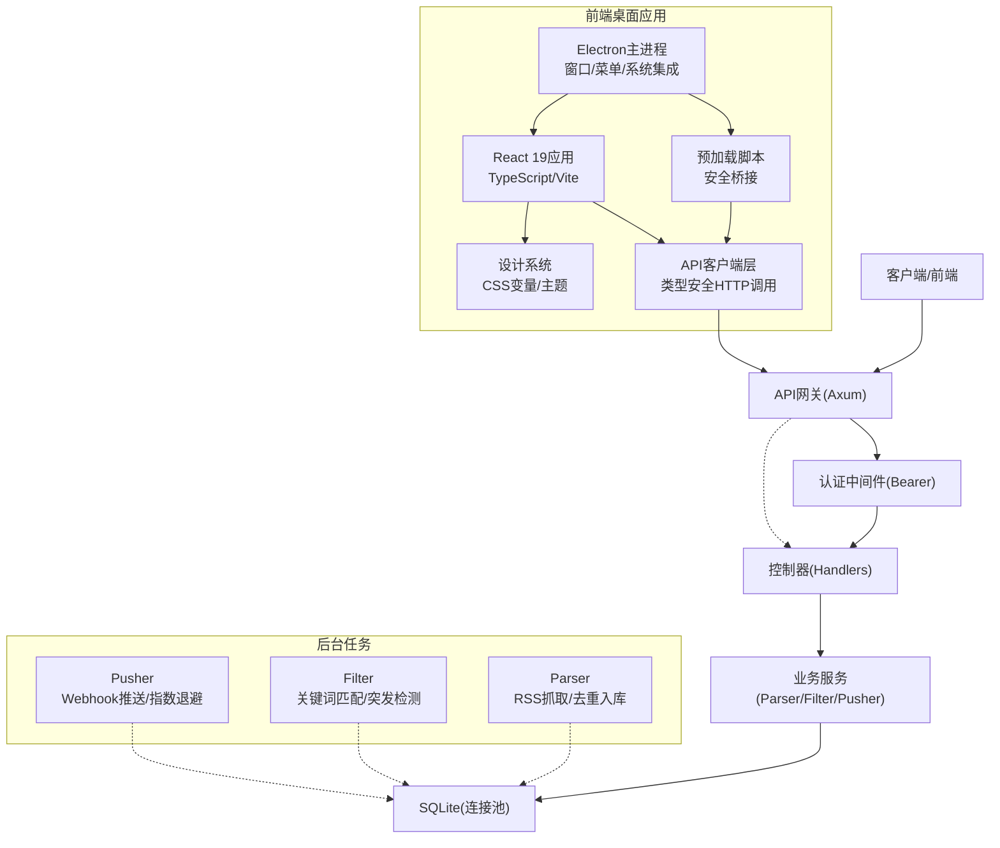

**图表来源**
- [src/main.rs:87-121](file://src/main.rs#L87-L121)
- [src/services/parser.rs:94-185](file://src/services/parser.rs#L94-L185)
- [src/services/filter.rs:269-277](file://src/services/filter.rs#L269-L277)
- [src/services/pusher.rs:251-259](file://src/services/pusher.rs#L251-L259)
- [web/src/main/index.ts](file://web/src/main/index.ts)
- [web/src/preload/index.ts](file://web/src/preload/index.ts)

## 详细组件分析

### 异步与并发模型（Tokio）
- **运行时**：#[tokio::main]启动，支持full特性以启用任务、定时器、IO等。
- **任务拆分**：Parser/Filter/Pusher分别在独立任务中循环执行；Parser使用信号量限制并发抓取数量。
- **背压与限流**：Parser通过Semaphore控制最大并发；Filter按批次处理；Pusher按轮询间隔执行。
- **错误隔离**：各后台任务内部捕获错误并记录，避免影响其他任务。

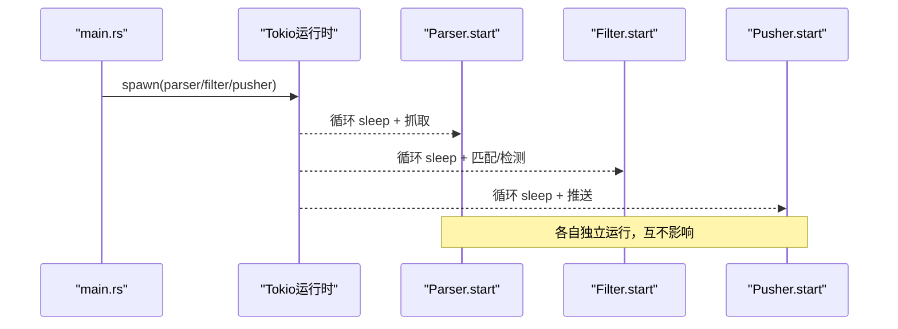

**图表来源**
- [src/main.rs:97-105](file://src/main.rs#L97-L105)
- [src/services/parser.rs:94-185](file://src/services/parser.rs#L94-L185)
- [src/services/filter.rs:269-277](file://src/services/filter.rs#L269-L277)
- [src/services/pusher.rs:251-259](file://src/services/pusher.rs#L251-L259)

**章节来源**
- [Cargo.toml:12](file://Cargo.toml#L12)
- [src/main.rs:94-105](file://src/main.rs#L94-L105)
- [src/services/parser.rs:94-185](file://src/services/parser.rs#L94-L185)

### 认证中间件与API路由
- **中间件职责**：从Authorization头提取Bearer Token，数据库校验（非撤销、未过期），后台更新last_used_at，注入ApiToken至请求扩展。
- **路由设计**：/health公开；/api/v1下挂载各资源API，并统一应用认证中间件。
- **CORS**：使用tower-http的CORS中间件设置为宽松策略，支持前端开发跨域。

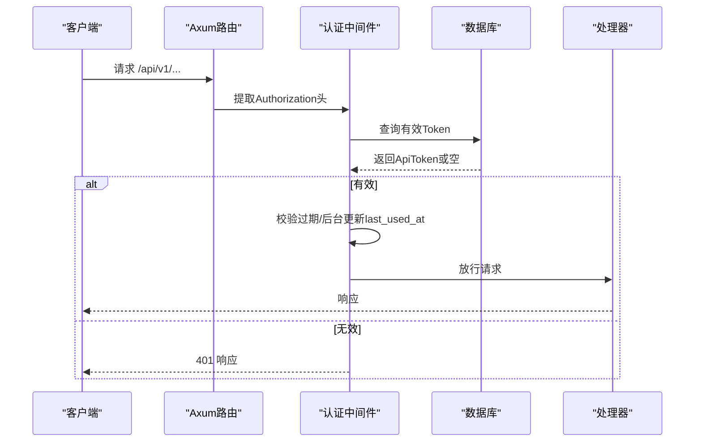

**图表来源**
- [src/middleware/auth.rs:18-57](file://src/middleware/auth.rs#L18-L57)
- [src/routes.rs:14-59](file://src/routes.rs#L14-L59)

**章节来源**
- [src/middleware/auth.rs:1-58](file://src/middleware/auth.rs#L1-L58)
- [src/routes.rs:14-70](file://src/routes.rs#L14-L70)

### 统一错误处理与响应格式
- **错误类型**：AppError涵盖常见HTTP语义与数据库错误映射。
- **IntoResponse**：将错误转换为JSON响应，字段包含错误码与消息。
- **成功响应**：ApiResponse提供ok/created/no_content统一封装。
- **数据库错误**：From<sqlx::Error>自动映射NotFound与其他数据库错误。

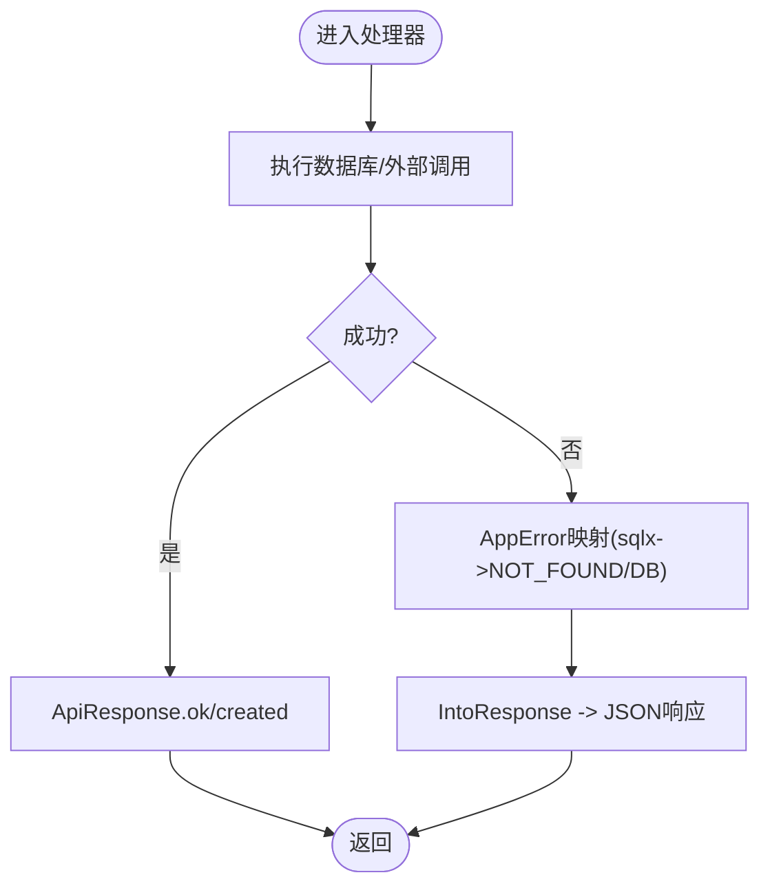

**图表来源**
- [src/error.rs:8-79](file://src/error.rs#L8-L79)

**章节来源**
- [src/error.rs:1-79](file://src/error.rs#L1-L79)

### 数据库连接与迁移
- **连接池**：SqlitePoolOptions配置最大连接数，WAL模式与外键约束开启。
- **迁移**：启动时执行docs/migrations目录下的迁移脚本。
- **初始化Token**：首次启动确保至少存在一个可用Token，支持从配置或随机生成。

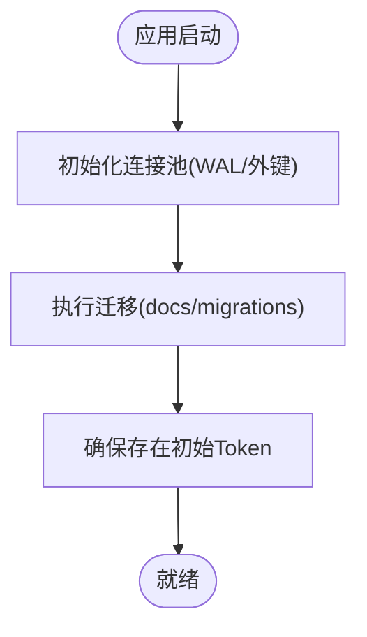

**图表来源**
- [src/db.rs:12-26](file://src/db.rs#L12-L26)
- [src/main.rs:80-84](file://src/main.rs#L80-L84)

**章节来源**
- [src/db.rs:1-27](file://src/db.rs#L1-L27)
- [src/main.rs:27-62](file://src/main.rs#L27-L62)

### Parser模块（RSS采集与并发抓取）
- **抽象接口**：Parser trait支持不同Feed类型的扩展实现。
- **默认实现**：RssParser基于feed-rs解析，使用reqwest按配置超时与UA抓取。
- **并发控制**：通过Arc<Semaphore>限制最大并发抓取数。
- **写入策略**：插入成功计数与去重跳过计数；无论成功与否均更新last_fetched_at。

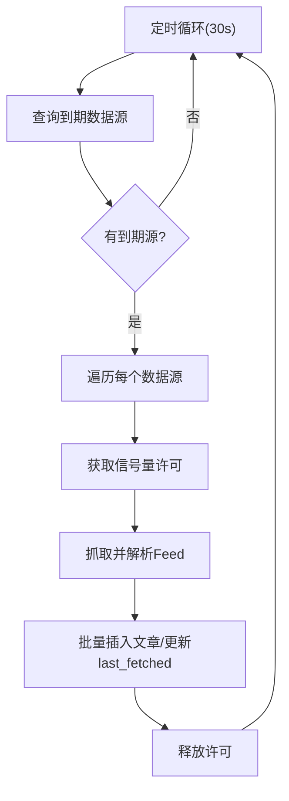

**图表来源**
- [src/services/parser.rs:94-185](file://src/services/parser.rs#L94-L185)

**章节来源**
- [src/services/parser.rs:1-185](file://src/services/parser.rs#L1-L185)

### Filter模块（关键词匹配与突发检测）
- **流程**：加载未处理文章 → 加载启用关键词 → 构建Aho-Corasick自动机 → 小时桶计数 → 历史统计与阈值判定 → 生成热点事件与推送记录 → 标记文章已处理。
- **性能**：区分大小写与不区分大小写的关键词分别构建自动机，减少匹配开销。
- **幂等**：热点事件按keyword_id+hour_bucket进行UPSERT，避免重复。

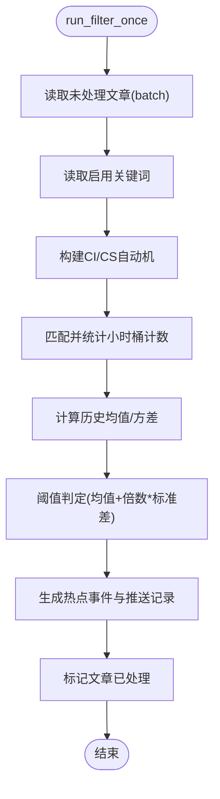

**图表来源**
- [src/services/filter.rs:13-208](file://src/services/filter.rs#L13-L208)

**章节来源**
- [src/services/filter.rs:1-277](file://src/services/filter.rs#L1-L277)

### Pusher模块（Webhook推送与指数退避）
- **流程**：查询pending与retry_due记录 → 逐条处理 → 解析渠道与热点事件 → 构造payload → 发送Webhook → 成功则乐观锁更新为success，失败则指数退避更新状态。
- **幂等与一致性**：乐观锁避免并发重复推送；到达最大重试后停止重试。
- **配置**：轮询间隔、最大重试次数、基础退避秒数。

```mermaid
sequenceDiagram
participant Loop as "Pusher.start"
participant DB as "数据库"
participant CH as "渠道配置"
participant HE as "热点事件"
participant KW as "关键词"
participant HTTP as "Webhook端点"
Loop->>DB : 查询pending/retry_due
DB-->>Loop : 返回可推送记录
loop 对每条记录
Loop->>CH : 读取渠道配置
Loop->>HE : 读取热点事件
Loop->>KW : 读取关键词
Loop->>HTTP : POST payload
alt 成功
Loop->>DB : 乐观锁更新为success
else 失败
Loop->>DB : 指数退避更新状态/下次重试
end
end
```

**图表来源**
- [src/services/pusher.rs:11-259](file://src/services/pusher.rs#L11-L259)

**章节来源**
- [src/services/pusher.rs:1-259](file://src/services/pusher.rs#L1-L259)

### API端点与业务逻辑模块
- **Token管理**：创建、列表（隐藏明文）、撤销。
- **查询接口**：文章分页、热点分页、热点详情、趋势曲线、手动触发Filter/Pusher。
- **控制流**：查询处理器直接调用services中的run_filter_once/run_pusher_once，实现手动触发。

**章节来源**
- [src/handlers/token.rs:18-66](file://src/handlers/token.rs#L18-L66)
- [src/handlers/query.rs:47-165](file://src/handlers/query.rs#L47-L165)

## 前端开发规范

### 项目架构与技术栈
- **桌面应用框架**：Electron 29+，支持Windows、macOS、Linux平台
- **前端框架**：React 19（实验性特性），TypeScript 5+
- **构建工具**：Vite 5+，支持热重载与快速构建
- **UI库**：Ant Design 5+，提供企业级组件库
- **状态管理**：React Hooks + Context，轻量级状态管理
- **路由**：React Router 6+，支持嵌套路由
- **样式系统**：CSS Modules + CSS变量，支持暗色主题
- **HTTP客户端**：自定义API客户端层，类型安全的HTTP调用

### 电子书应用架构
- **主进程**：负责窗口管理、菜单创建、系统集成与应用生命周期
- **预加载脚本**：提供安全的主进程与渲染进程通信桥接
- **渲染进程**：React应用的用户界面层
- **进程间通信**：IPC通信确保安全的数据交换

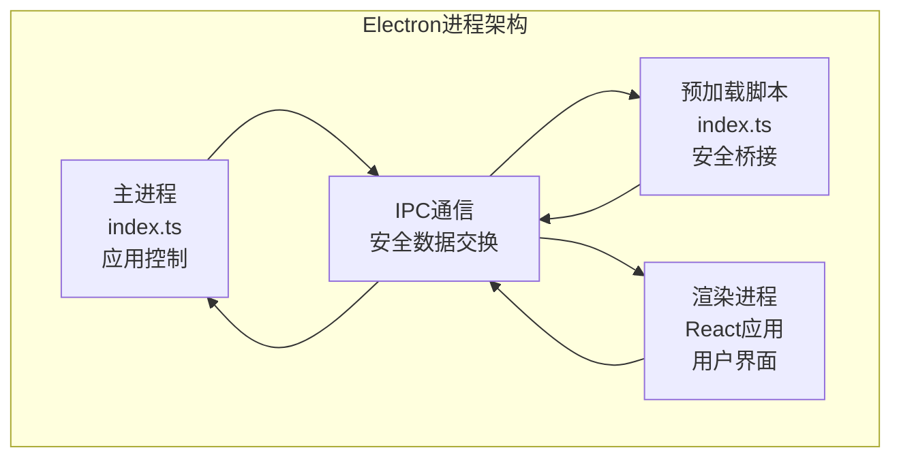

**图表来源**
- [web/src/main/index.ts](file://web/src/main/index.ts)
- [web/src/preload/index.ts](file://web/src/preload/index.ts)
- [web/src/renderer/src/App.tsx](file://web/src/renderer/src/App.tsx)

### 设计系统与视觉契约
- **视觉原型**：基于docs/Live-Artifact/index.html定义的视觉契约
- **暗色主题**：系统默认暗色主题，支持主题切换
- **侧边栏布局**：固定侧边栏，支持折叠与展开
- **CSS变量系统**：统一的颜色、字体、间距、阴影变量
- **组件规范**：基于Ant Design组件库，遵循设计技能指导

```mermaid
graph TB
subgraph "设计系统"
THEME["暗色主题<br/>CSS变量系统"]
SIDEBAR["侧边栏布局<br/>固定/折叠"]
COMPONENTS["组件库<br/>Ant Design 5+"]
TOKENS["设计令牌<br/>颜色/字体/间距"]
END
subgraph "前端组件"
HEADER["头部导航<br/>用户信息/设置"]
NAV["侧边导航<br/>菜单项/路由"]
CONTENT["内容区域<br/>仪表板/表格"]
MODAL["模态框<br/>表单/确认"]
END
THEME --> COMPONENTS
SIDEBAR --> NAV
COMPONENTS --> CONTENT
TOKENS --> THEME
```

**图表来源**
- [docs/Live-Artifact/DESIGN-HANDOFF.md:2](file://docs/Live-Artifact/DESIGN-HANDOFF.md#L2-L2)
- [docs/Live-Artifact/DESIGN-MANIFEST.json:3](file://docs/Live-Artifact/DESIGN-MANIFEST.json#L3-L3)
- [web/src/renderer/src/theme/tokens.ts](file://web/src/renderer/src/theme/tokens.ts)
- [web/src/renderer/src/theme/config.tsx](file://web/src/renderer/src/theme/config.tsx)

### API客户端层规范
- **类型安全**：基于OpenAPI规范生成的TypeScript类型定义
- **错误处理**：统一的错误响应格式，支持网络错误与业务错误
- **认证集成**：自动处理Bearer Token，支持Token刷新
- **缓存策略**：智能缓存机制，避免重复请求
- **拦截器**：请求/响应拦截器，统一处理日志与错误

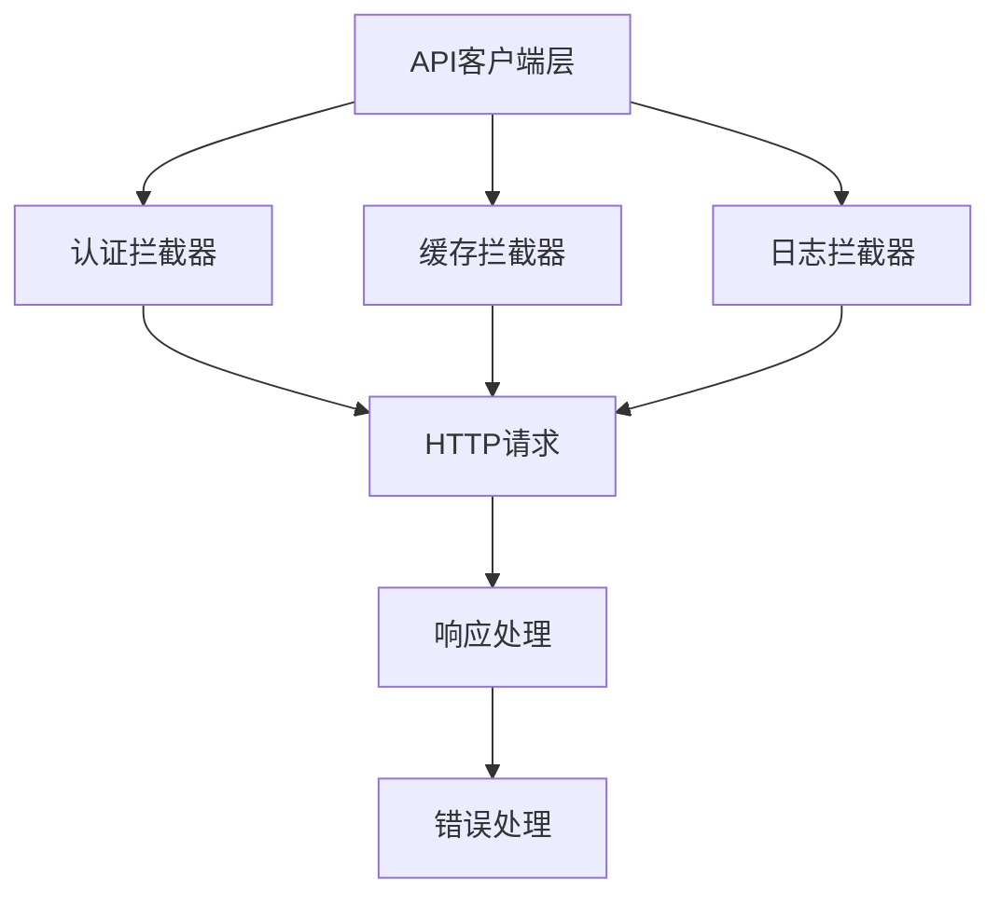

**图表来源**
- [web/src/renderer/src/api/client.ts](file://web/src/renderer/src/api/client.ts)

### 组件开发规范
- **组件结构**：函数式组件 + React Hooks
- **样式管理**：CSS Modules + CSS变量，支持主题切换
- **Props接口**：严格的TypeScript接口定义
- **事件处理**：统一的事件命名约定
- **可访问性**：遵循WCAG 2.1标准
- **测试覆盖**：Jest + React Testing Library

**章节来源**
- [web/package.json](file://web/package.json)
- [web/electron.vite.config.ts](file://web/electron.vite.config.ts)
- [web/tsconfig.json](file://web/tsconfig.json)
- [web/tsconfig.node.json](file://web/tsconfig.node.json)
- [web/tsconfig.web.json](file://web/tsconfig.web.json)
- [web/src/main/index.ts](file://web/src/main/index.ts)
- [web/src/preload/index.ts](file://web/src/preload/index.ts)
- [web/src/renderer/src/App.tsx](file://web/src/renderer/src/App.tsx)
- [web/src/renderer/src/main.tsx](file://web/src/renderer/src/main.tsx)
- [web/src/renderer/src/api/client.ts](file://web/src/renderer/src/api/client.ts)
- [web/src/renderer/src/theme/tokens.ts](file://web/src/renderer/src/theme/tokens.ts)
- [web/src/renderer/src/theme/config.tsx](file://web/src/renderer/src/theme/config.tsx)
- [web/src/renderer/src/pages/Dashboard.tsx](file://web/src/renderer/src/pages/Dashboard.tsx)
- [web/src/renderer/src/pages/Auth.tsx](file://web/src/renderer/src/pages/Auth.tsx)
- [web/src/renderer/src/components/Layout.tsx](file://web/src/renderer/src/components/Layout.tsx)
- [web/src/renderer/src/hooks/useApi.ts](file://web/src/renderer/src/hooks/useApi.ts)
- [web/src/renderer/src/hooks/useMessage.ts](file://web/src/renderer/src/hooks/useMessage.ts)

## 依赖关系分析
- **运行时与框架**：Tokio、Axum、Tower、tower-http、sqlx、chrono、tracing、reqwest、feed-rs、aho-corasick、clap。
- **配置与序列化**：serde、serde_json、toml。
- **并发与异步**：async-trait用于trait对象的异步方法。
- **前端技术栈**：Electron、React 19、TypeScript、Vite、Ant Design、React Router。
- **设计系统**：CSS变量、CSS Modules、设计令牌系统。
- **构建工具**：electron-vite、@vitejs/plugin-react、typescript等。

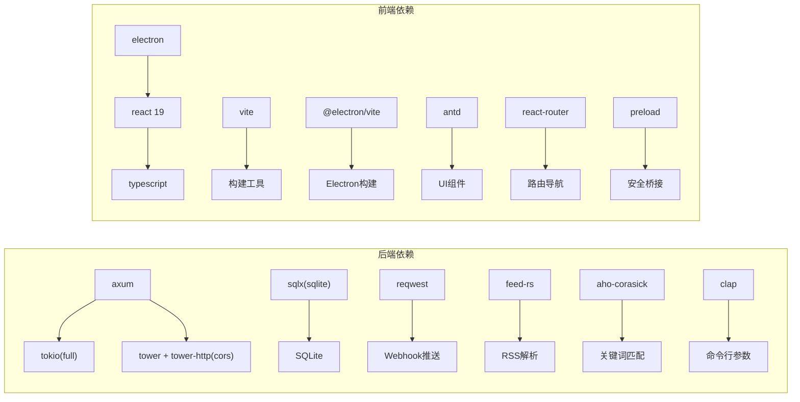

**图表来源**
- [Cargo.toml:6-46](file://Cargo.toml#L6-L46)
- [web/package.json](file://web/package.json)

**章节来源**
- [Cargo.toml:1-67](file://Cargo.toml#L1-L67)
- [web/package.json](file://web/package.json)

## 性能考虑
- **连接池与I/O**：保持较小的连接数，避免过度并发导致SQLite竞争；合理设置WAL与外键提升并发与一致性。
- **并发控制**：Parser使用信号量限制抓取并发；Filter批处理降低数据库压力；Pusher轮询间隔平衡实时性与负载。
- **算法效率**：Aho-Corasick自动机预构建，区分大小写与不区分大小写两套，减少匹配成本。
- **日志与可观测**：tracing记录关键事件与错误，便于定位瓶颈与异常。
- **编译优化**：release配置启用LTO、单codegen单元、符号剥离与panic abort，获得更优运行时性能。
- **前端性能**：React 19实验性特性提升渲染性能；Vite快速热重载；Ant Design组件按需加载。
- **内存管理**：Electron应用内存监控，避免内存泄漏；前端组件生命周期管理。
- **构建优化**：Vite的快速热重载与生产构建优化，减少开发时间。

**章节来源**
- [src/db.rs:14-26](file://src/db.rs#L14-L26)
- [src/services/parser.rs:96](file://src/services/parser.rs#L96)
- [src/services/filter.rs:48-84](file://src/services/filter.rs#L48-L84)
- [Cargo.toml:48-67](file://Cargo.toml#L48-L67)
- [web/package.json](file://web/package.json)

## 故障排查指南
- **认证失败**：检查Authorization头格式是否为Bearer；确认Token未撤销且未过期；查看中间件日志。
- **数据库错误**：关注统一错误响应中的DATABASE_ERROR；检查迁移是否成功执行；确认WAL与外键已启用。
- **Parser抓取异常**：查看抓取超时与UA配置；检查网络连通性；观察日志中"failed to fetch"记录。
- **Filter无热点**：确认关键词启用状态与阈值设置；检查历史小时数据是否充足；核对文章是否被正确标记为已处理。
- **Pusher推送失败**：检查渠道配置JSON中url字段；查看网络错误与HTTP状态；确认重试次数与退避策略。
- **前端开发问题**：检查Vite开发服务器是否正常启动；确认CORS配置允许前端访问；验证API客户端连接。
- **Electron应用问题**：检查主进程日志；确认渲染进程通信；验证打包配置。
- **预加载脚本问题**：检查安全桥接是否正常；确认IPC通信通道；验证权限配置。

**章节来源**
- [src/middleware/auth.rs:18-57](file://src/middleware/auth.rs#L18-L57)
- [src/error.rs:23-50](file://src/error.rs#L23-L50)
- [src/services/parser.rs:170-181](file://src/services/parser.rs#L170-L181)
- [src/services/filter.rs:132-208](file://src/services/filter.rs#L132-L208)
- [src/services/pusher.rs:146-202](file://src/services/pusher.rs#L146-L202)
- [web/src/preload/index.ts](file://web/src/preload/index.ts)

## 结论
本项目以清晰的分层与模块化设计实现了RSS采集、关键词匹配与Webhook推送的完整流水线。通过Tokio运行时与信号量等并发原语，结合统一错误处理与响应格式，保证了系统的稳定性与可维护性。**新增的前端基础设施**进一步完善了全栈开发指导，基于Electron + React 19 + Vite + TypeScript的技术栈，配合设计系统与API客户端层，为开发者提供了完整的桌面应用开发框架。预加载脚本确保了主进程与渲染进程之间的安全通信，类型安全的API客户端层提供了可靠的HTTP调用封装。遵循本文的开发流程与最佳实践，可高效地扩展新功能模块并持续演进。

## 附录

### OpenSpec规范驱动的开发工作流
- **规划与变更**：在openspec/specs与changes/archive中沉淀需求、设计、任务与变更记录。
- **规范先行**：先撰写或评审spec.md，明确API、模型与流程，再实现。
- **迭代跟踪**：通过plans与tasks文档跟踪进度，确保实现与规范一致。
- **前端规范**：前端开发同样遵循OpenSpec规范，确保设计与实现的一致性。

**章节来源**
- [README.md:254-257](file://README.md#L254-L257)
- [openspec/changes/frontend-setup/design.md:2-2](file://openspec/changes/frontend-setup/design.md#L2-L2)

### 新增API端点的步骤
- **规范与设计**：在openspec/specs中编写API规范，明确HTTP方法、路径、请求/响应结构。
- **路由注册**：在routes.rs中注册新路由并绑定State。
- **处理器实现**：在handlers子模块中实现处理器，使用AppState访问数据库与配置。
- **数据访问**：在db子模块中补充必要的DAO函数；在models中完善相关模型。
- **错误与响应**：遵循AppError与ApiResponse约定，确保错误码与响应体一致。
- **测试**：编写单元/集成测试，覆盖正常与异常分支。
- **文档**：更新API文档与README中的接口说明。

**章节来源**
- [src/routes.rs:14-59](file://src/routes.rs#L14-L59)
- [src/handlers/token.rs:18-66](file://src/handlers/token.rs#L18-L66)
- [src/error.rs:61-79](file://src/error.rs#L61-L79)

### 新增数据库模型与业务逻辑模块
- **模型定义**：在models子模块中定义结构体与序列化属性。
- **DAO实现**：在db子模块中实现CRUD与查询函数，注意事务与错误传播。
- **业务服务**：在services子模块中实现业务逻辑，遵循幂等与错误隔离原则。
- **路由与处理器**：注册新路由并实现处理器。
- **迁移**：在docs/migrations中编写迁移脚本，确保版本演进可控。
- **测试**：覆盖边界条件与并发场景。

**章节来源**
- [src/models.rs:1-9](file://src/models.rs#L1-L9)
- [src/db.rs:1-8](file://src/db.rs#L1-L8)
- [src/services.rs:1-4](file://src/services.rs#L1-L4)

### 前端开发流程
- **项目初始化**：使用Vite模板创建React + TypeScript项目，配置Electron集成。
- **设计系统**：基于Live Artifact原型建立设计令牌与组件规范。
- **API集成**：实现API客户端层，处理认证、错误与缓存。
- **页面开发**：按照设计规范开发管理页面与仪表板。
- **组件开发**：遵循组件开发规范，使用React Hooks与TypeScript。
- **测试与构建**：编写单元测试，配置Vite构建与Electron打包。
- **部署**：生成多平台安装包，支持自动更新。

**章节来源**
- [docs/plans/06-frontend-setup.md:46-47](file://docs/plans/06-frontend-setup.md#L46-L47)
- [docs/Live-Artifact/DESIGN-HANDOFF.md:2](file://docs/Live-Artifact/DESIGN-HANDOFF.md#L2-L2)
- [openspec/changes/frontend-setup/specs/frontend-project-scaffold/spec.md](file://openspec/changes/frontend-setup/specs/frontend-project-scaffold/spec.md)

### 并发编程最佳实践
- **使用信号量限制并发**（如Parser）。
- **将长耗时任务拆分为多个短任务**，避免阻塞事件循环。
- **对共享状态使用Arc与原子操作**，必要时引入Mutex但要谨慎。
- **错误隔离**：每个任务独立处理自身错误，避免级联失败。
- **资源清理**：在spawn的任务中妥善处理取消与清理。
- **前端并发**：React 19实验性特性提升并发性能；避免不必要的重新渲染。
- **Electron并发**：主进程与渲染进程分离，IPC通信确保线程安全。

**章节来源**
- [src/services/parser.rs:96](file://src/services/parser.rs#L96)
- [src/services/pusher.rs:46-202](file://src/services/pusher.rs#L46-L202)
- [web/src/main/index.ts](file://web/src/main/index.ts)

### 代码审查清单
- **结构与职责**：模块划分清晰，单一职责明确。
- **并发与资源**：并发控制合理，资源释放与错误传播正确。
- **错误处理**：错误类型覆盖全面，响应格式统一，日志充分。
- **性能**：批处理、缓存与索引使用合理，避免热点竞争。
- **安全**：输入校验、权限控制、敏感信息（如Token）处理符合安全基线。
- **前端质量**：TypeScript类型安全、组件可复用性、设计一致性。
- **Electron安全**：预加载脚本安全配置、IPC通信安全、权限最小化。
- **构建质量**：Vite配置优化、TypeScript类型检查、代码分割策略。

### 安全编码指南
- **输入校验**：严格校验请求参数与头部，拒绝非法格式。
- **权限控制**：所有受保护路由必须通过认证中间件。
- **敏感信息**：Token仅在创建时返回明文，后续仅返回摘要信息。
- **外部调用**：对外部HTTP调用设置超时与重试策略，避免阻塞。
- **配置安全**：避免将密钥硬编码在代码中，优先使用配置文件或环境变量。
- **前端安全**：防止XSS攻击，验证用户输入，使用HTTPS传输。
- **Electron安全**：预加载脚本最小权限原则，IPC通信验证，内容安全策略。
- **API安全**：Bearer Token验证，CORS配置，速率限制。

### 贡献代码流程
- **Fork仓库并创建功能分支**。
- **遵循OpenSpec规范先行的设计与文档**。
- **编写单元/集成测试**，确保覆盖率与质量。
- **前端开发**：确保设计系统一致性，编写组件测试。
- **Electron集成**：确保主进程与渲染进程通信安全，预加载脚本验证。
- **API客户端**：确保类型安全与错误处理完整。
- **提交PR**，填写变更说明与测试结果。
- **代码审查通过后合并主干**。

### 开发环境搭建
- **前置要求**：Rust工具链（1.75+）、SQLite 3、Node.js 18+、npm 8+
- **构建与运行**：使用Cargo编译与运行，支持多模式启动。
- **前端开发**：cd web && npm run dev，启动Vite开发服务器。
- **Electron开发**：npm run electron:dev，启动桌面应用开发模式。
- **生产构建**：cd web && npm run build，生成优化的静态资源。
- **Electron打包**：npm run electron:build，生成多平台安装包。
- **配置**：编辑config.toml调整服务、数据库、认证与各模块参数。
- **前端配置**：编辑web/package.json与tsconfig.json调整构建选项。
- **首次启动**：自动执行迁移并生成初始Token（若未配置）。

**章节来源**
- [README.md:38-122](file://README.md#L38-L122)
- [config.toml:1-27](file://config.toml#L1-L27)
- [web/package.json](file://web/package.json)
- [web/tsconfig.json](file://web/tsconfig.json)
- [web/electron.vite.config.ts](file://web/electron.vite.config.ts)