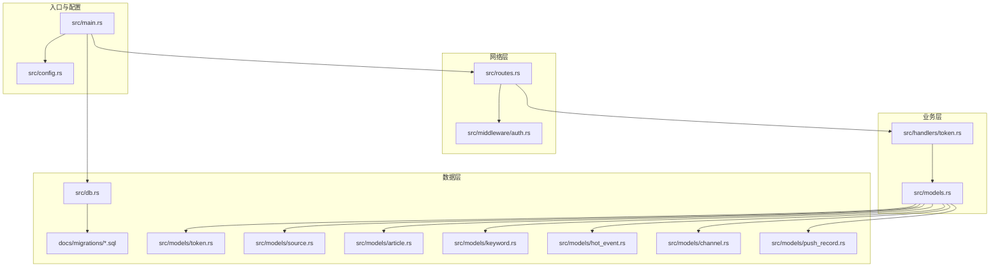
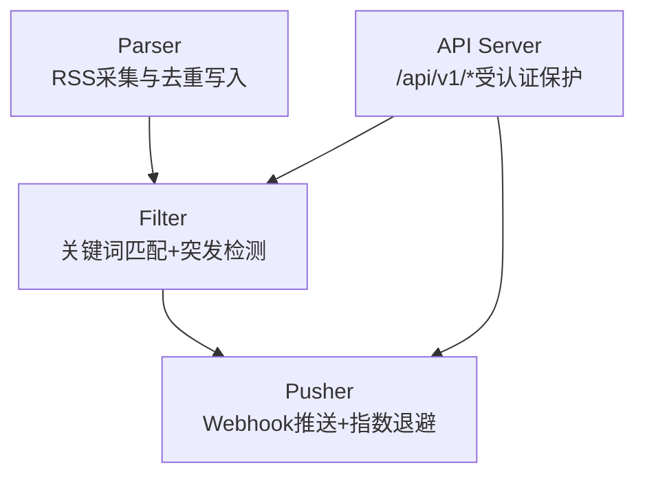
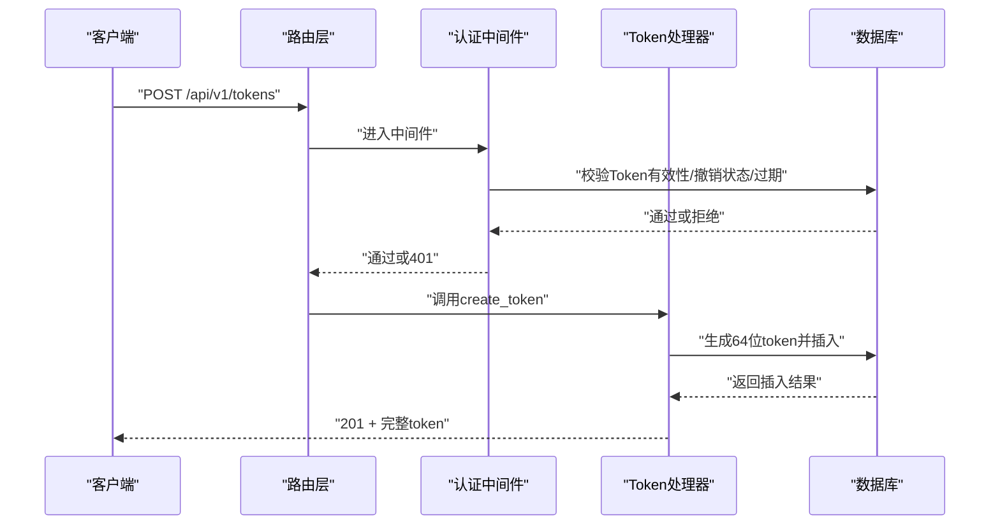
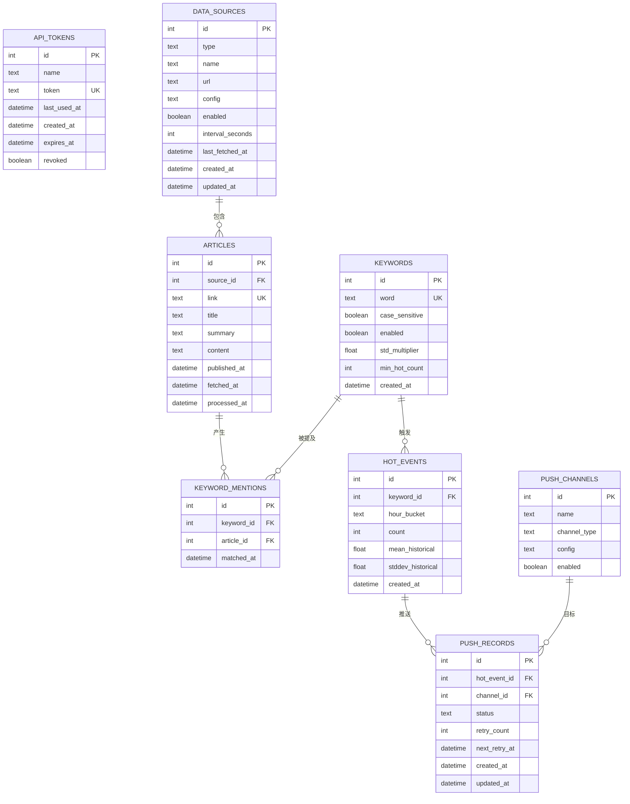
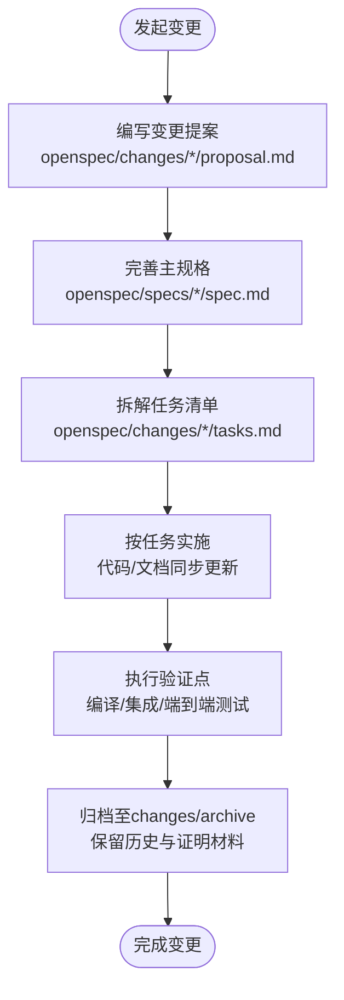
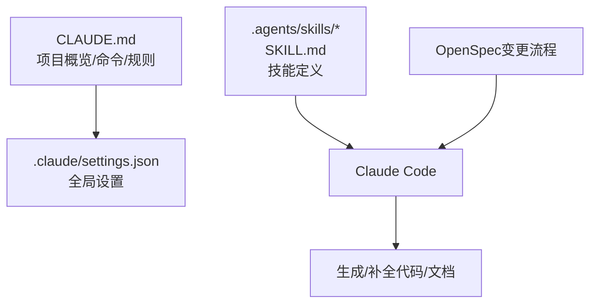
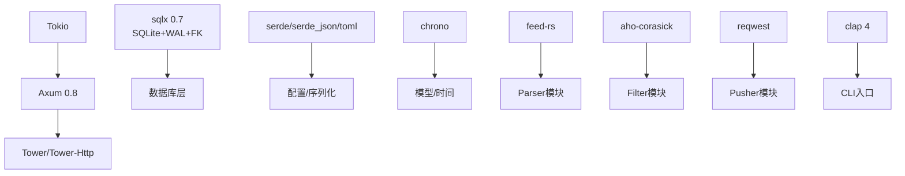

# 开发指南

<cite>
**本文引用的文件**
- [README.md](file://README.md)
- [CLAUDE.md](file://CLAUDE.md)
- [Cargo.toml](file://Cargo.toml)
- [src/main.rs](file://src/main.rs)
- [src/config.rs](file://src/config.rs)
- [src/error.rs](file://src/error.rs)
- [src/routes.rs](file://src/routes.rs)
- [src/db.rs](file://src/db.rs)
- [src/middleware/auth.rs](file://src/middleware/auth.rs)
- [src/handlers/token.rs](file://src/handlers/token.rs)
- [src/models.rs](file://src/models.rs)
- [src/models/token.rs](file://src/models/token.rs)
- [src/models/source.rs](file://src/models/source.rs)
- [src/models/article.rs](file://src/models/article.rs)
- [src/models/keyword.rs](file://src/models/keyword.rs)
- [src/models/hot_event.rs](file://src/models/hot_event.rs)
- [src/models/channel.rs](file://src/models/channel.rs)
- [src/models/push_record.rs](file://src/models/push_record.rs)
- [docs/plans/02-database-migrations.md](file://docs/plans/02-database-migrations.md)
- [docs/apis/token-api.md](file://docs/apis/token-api.md)
- [openspec/config.yaml](file://openspec/config.yaml)
- [openspec/specs/backend-project-scaffold/spec.md](file://openspec/specs/backend-project-scaffold/spec.md)
- [openspec/specs/auth-middleware/spec.md](file://openspec/specs/auth-middleware/spec.md)
- [openspec/specs/token-api/spec.md](file://openspec/specs/token-api/spec.md)
- [openspec/changes/archive/2026-06-07-auth-middleware-and-token-api/proposal.md](file://openspec/changes/archive/2026-06-07-auth-middleware-and-token-api/proposal.md)
- [openspec/changes/archive/2026-06-07-auth-middleware-and-token-api/tasks.md](file://openspec/changes/archive/2026-06-07-auth-middleware-and-token-api/tasks.md)
- [.claude/settings.json](file://.claude/settings.json)
- [.agents/skills/design-taste-frontend/SKILL.md](file://.agents/skills/design-taste-frontend/SKILL.md)
- [.agents/skills/full-output-enforcement/SKILL.md](file://.agents/skills/full-output-enforcement/SKILL.md)
- [.agents/skills/minimalist-ui/SKILL.md](file://.agents/skills/minimalist-ui/SKILL.md)
</cite>

## 目录
1. [简介](#简介)
2. [项目结构](#项目结构)
3. [核心组件](#核心组件)
4. [架构总览](#架构总览)
5. [详细组件分析](#详细组件分析)
6. [依赖关系分析](#依赖关系分析)
7. [性能考量](#性能考量)
8. [故障排除指南](#故障排除指南)
9. [结论](#结论)
10. [附录](#附录)

## 简介
本开发指南面向AI-Trend-Tool项目的贡献者，提供从开发环境搭建、代码贡献流程、编码规范，到OpenSpec变更管理、任务分配与进度跟踪的全流程说明；同时涵盖Claude AI工具的使用指南、技能配置与自动化工作流；以及测试策略、代码审查标准、发布流程、调试技巧、性能分析与故障排除方法，并给出团队协作工具与沟通规范。

## 项目结构
项目采用Rust后端 + SQLite + Axum框架的分层架构，核心模块包括：
- 配置解析与入口：src/main.rs、src/config.rs
- 路由与中间件：src/routes.rs、src/middleware/auth.rs
- 数据库连接池与迁移：src/db.rs、docs/migrations
- 模型与处理器：src/models.rs、src/handlers/token.rs
- 统一错误与响应：src/error.rs
- OpenSpec规格与变更归档：openspec/specs、openspec/changes
- Claude与Agent技能：.claude、.agents/skills

**图表来源**
- [src/main.rs:1-96](file://src/main.rs#L1-L96)
- [src/config.rs:1-59](file://src/config.rs#L1-L59)
- [src/routes.rs:1-48](file://src/routes.rs#L1-L48)
- [src/middleware/auth.rs](file://src/middleware/auth.rs)
- [src/handlers/token.rs](file://src/handlers/token.rs)
- [src/db.rs:1-26](file://src/db.rs#L1-L26)
- [docs/plans/02-database-migrations.md:1-421](file://docs/plans/02-database-migrations.md#L1-L421)

**章节来源**
- [README.md:216-257](file://README.md#L216-L257)
- [src/main.rs:1-96](file://src/main.rs#L1-L96)
- [src/config.rs:1-59](file://src/config.rs#L1-L59)
- [src/routes.rs:1-48](file://src/routes.rs#L1-L48)
- [src/db.rs:1-26](file://src/db.rs#L1-L26)

## 核心组件
- 应用入口与CLI：负责解析命令行参数、加载配置、初始化数据库连接池、运行迁移、确保初始Token、构建路由并启动HTTP服务。
- 配置系统：解析config.toml为结构化配置，支持server、database、auth、parser、filter、pusher等段落。
- 路由与中间件：注册/api/v1/*路由并应用认证中间件，/health无需认证；提供CORS支持。
- 统一错误与响应：定义AppError枚举与ApiResponse辅助类，保证错误与成功响应格式一致。
- 数据库层：初始化SQLite连接池（WAL模式、外键约束），自动执行迁移；各领域模块的数据库操作函数集中于src/db/子模块。
- 模型层：定义ApiToken、DataSource、Article、Keyword、HotEvent、PushChannel、PushRecord等数据结构，配合sqlx::FromRow与序列化。
- Token API：提供创建、列表、撤销接口，支持过期时间与软删除。

**章节来源**
- [src/main.rs:16-96](file://src/main.rs#L16-L96)
- [src/config.rs:4-59](file://src/config.rs#L4-L59)
- [src/routes.rs:14-48](file://src/routes.rs#L14-L48)
- [src/error.rs:8-79](file://src/error.rs#L8-L79)
- [src/db.rs:9-26](file://src/db.rs#L9-L26)
- [src/models.rs](file://src/models.rs)
- [src/handlers/token.rs](file://src/handlers/token.rs)

## 架构总览
系统采用“管道模式（Pipeline）”，三个后台模块独立运行：
- Parser：按配置周期拉取RSS，去重写入articles表
- Filter：每5分钟运行，Aho-Corasick关键词匹配，小时桶计数，统计突发检测，生成hot_events与待推送记录
- Pusher：每10秒轮询push_records（status=pending），POST Webhook，指数退避重试（最多3次），乐观锁防重复

**图表来源**
- [README.md:7-23](file://README.md#L7-L23)
- [README.md:273-289](file://README.md#L273-L289)

**章节来源**
- [README.md:7-23](file://README.md#L7-L23)
- [README.md:273-289](file://README.md#L273-L289)

## 详细组件分析

### 认证中间件与Token API
- 认证中间件从Authorization头提取Bearer Token，校验是否存在、是否revoked、是否过期；成功后将完整ApiToken注入请求扩展，异步更新last_used_at。
- Token API提供POST /tokens（创建并返回明文token）、GET /tokens（列表，隐藏明文）、POST /tokens/revoke（撤销，软删除）。
- 首次启动时，若api_tokens表为空，优先使用配置auth.initial_token，否则自动生成64位随机hex token并通过日志警告输出。

**图表来源**
- [src/middleware/auth.rs](file://src/middleware/auth.rs)
- [src/handlers/token.rs](file://src/handlers/token.rs)
- [src/routes.rs:20-31](file://src/routes.rs#L20-L31)
- [src/error.rs:8-50](file://src/error.rs#L8-L50)

**章节来源**
- [openspec/specs/auth-middleware/spec.md:1-88](file://openspec/specs/auth-middleware/spec.md#L1-L88)
- [openspec/specs/token-api/spec.md:1-76](file://openspec/specs/token-api/spec.md#L1-L76)
- [openspec/changes/archive/2026-06-07-auth-middleware-and-token-api/tasks.md:1-51](file://openspec/changes/archive/2026-06-07-auth-middleware-and-token-api/tasks.md#L1-L51)
- [src/main.rs:26-61](file://src/main.rs#L26-L61)
- [src/routes.rs:20-31](file://src/routes.rs#L20-L31)

### 数据库与模型
- 迁移文件定义8张表：api_tokens、data_sources、articles、keywords、keyword_mentions、hot_events、push_channels、push_records，并建立必要索引。
- 模型层通过sqlx::FromRow映射数据库行，配合Serde进行序列化；列表响应使用ApiTokenInfo等包装类型隐藏敏感字段。
- 数据库连接池启用WAL模式与外键约束，确保一致性与并发安全。

**图表来源**
- [docs/plans/02-database-migrations.md:27-145](file://docs/plans/02-database-migrations.md#L27-L145)
- [src/models/token.rs:165-212](file://src/models/token.rs#L165-L212)
- [src/models/source.rs:214-254](file://src/models/source.rs#L214-L254)
- [src/models/article.rs:256-283](file://src/models/article.rs#L256-L283)
- [src/models/keyword.rs:285-319](file://src/models/keyword.rs#L285-L319)
- [src/models/hot_event.rs:321-338](file://src/models/hot_event.rs#L321-L338)
- [src/models/channel.rs:340-368](file://src/models/channel.rs#L340-L368)
- [src/models/push_record.rs:370-388](file://src/models/push_record.rs#L370-L388)

**章节来源**
- [docs/plans/02-database-migrations.md:1-421](file://docs/plans/02-database-migrations.md#L1-L421)
- [src/db.rs:9-26](file://src/db.rs#L9-L26)
- [src/models.rs](file://src/models.rs)

### OpenSpec变更管理流程
- OpenSpec采用“规格驱动（spec-driven）”工作流，通过specs目录维护主规格，changes/archive归档历史变更。
- 变更提案（proposal.md）描述动机、变更内容、能力范围与影响；任务清单（tasks.md）细化实施步骤与验证点。
- 项目根配置openspec/config.yaml支持为特定工件添加规则（如字数限制、非目标声明等）。

**图表来源**
- [openspec/specs/backend-project-scaffold/spec.md:1-151](file://openspec/specs/backend-project-scaffold/spec.md#L1-L151)
- [openspec/specs/auth-middleware/spec.md:1-88](file://openspec/specs/auth-middleware/spec.md#L1-L88)
- [openspec/specs/token-api/spec.md:1-76](file://openspec/specs/token-api/spec.md#L1-L76)
- [openspec/changes/archive/2026-06-07-auth-middleware-and-token-api/proposal.md:1-33](file://openspec/changes/archive/2026-06-07-auth-middleware-and-token-api/proposal.md#L1-L33)
- [openspec/changes/archive/2026-06-07-auth-middleware-and-token-api/tasks.md:1-51](file://openspec/changes/archive/2026-06-07-auth-middleware-and-token-api/tasks.md#L1-L51)
- [openspec/config.yaml:1-21](file://openspec/config.yaml#L1-L21)

**章节来源**
- [openspec/specs/backend-project-scaffold/spec.md:1-151](file://openspec/specs/backend-project-scaffold/spec.md#L1-L151)
- [openspec/specs/auth-middleware/spec.md:1-88](file://openspec/specs/auth-middleware/spec.md#L1-L88)
- [openspec/specs/token-api/spec.md:1-76](file://openspec/specs/token-api/spec.md#L1-L76)
- [openspec/changes/archive/2026-06-07-auth-middleware-and-token-api/proposal.md:1-33](file://openspec/changes/archive/2026-06-07-auth-middleware-and-token-api/proposal.md#L1-L33)
- [openspec/changes/archive/2026-06-07-auth-middleware-and-token-api/tasks.md:1-51](file://openspec/changes/archive/2026-06-07-auth-middleware-and-token-api/tasks.md#L1-L51)
- [openspec/config.yaml:1-21](file://openspec/config.yaml#L1-L21)

### Claude AI工具使用指南与自动化工作流
- Claude配置：通过CLAUDE.md提供项目概览、架构、命令与开发规则，确保AI在仓库中的上下文准确。
- 技能配置：.claude/settings.json与.agents/skills目录下的SKILL.md定义AI助手的偏好与技能边界，例如前端设计风格、输出完整性与极简UI等。
- 自动化工作流：结合OpenSpec与任务清单，AI可协助生成规格、补全实现、校验一致性与生成验证用例。

**图表来源**
- [CLAUDE.md:1-85](file://CLAUDE.md#L1-L85)
- [.claude/settings.json](file://.claude/settings.json)
- [.agents/skills/design-taste-frontend/SKILL.md](file://.agents/skills/design-taste-frontend/SKILL.md)
- [.agents/skills/full-output-enforcement/SKILL.md](file://.agents/skills/full-output-enforcement/SKILL.md)
- [.agents/skills/minimalist-ui/SKILL.md](file://.agents/skills/minimalist-ui/SKILL.md)

**章节来源**
- [CLAUDE.md:1-85](file://CLAUDE.md#L1-L85)
- [.claude/settings.json](file://.claude/settings.json)
- [.agents/skills/design-taste-frontend/SKILL.md](file://.agents/skills/design-taste-frontend/SKILL.md)
- [.agents/skills/full-output-enforcement/SKILL.md](file://.agents/skills/full-output-enforcement/SKILL.md)
- [.agents/skills/minimalist-ui/SKILL.md](file://.agents/skills/minimalist-ui/SKILL.md)

## 依赖关系分析
- 语言与框架：Rust 2021、Axum 0.8、Tokio、sqlx 0.7、chrono、serde、reqwest、feed-rs、aho-corasick、clap。
- 依赖组织：所有SQL查询集中在src/db/<module>.rs，避免在处理器/中间件/服务层直接嵌入SQL，保持职责单一与可测试性。
- HTTP方法约定：仅使用GET与POST，语义通过URL路径表达（创建POST、读取/列表GET、更新POST、删除/撤销POST）。

**图表来源**
- [Cargo.toml:6-44](file://Cargo.toml#L6-L44)
- [CLAUDE.md:60-85](file://CLAUDE.md#L60-L85)

**章节来源**
- [Cargo.toml:6-44](file://Cargo.toml#L6-L44)
- [CLAUDE.md:60-85](file://CLAUDE.md#L60-L85)

## 性能考量
- 数据库：WAL模式提升并发写入性能；外键约束保障一致性；为高频查询建立索引（如articles的processed_at、source_id、fetched_at）。
- 算法：关键词匹配采用Aho-Corasick多模式匹配；热点检测使用滑动窗口统计（均值与标准差）与小时桶聚合，降低复杂度。
- 推送：指数退避重试（最大3次）、乐观锁防重复，减少重复推送与抖动。
- 日志与追踪：使用tracing输出关键事件与错误，便于定位性能瓶颈。

**章节来源**
- [docs/plans/02-database-migrations.md:72-145](file://docs/plans/02-database-migrations.md#L72-L145)
- [README.md:273-289](file://README.md#L273-L289)

## 故障排除指南
- 启动失败（配置问题）：检查config.toml的server.host/port、database.path、auth.initial_token等字段；确保数据库目录可写。
- 数据库迁移失败：确认docs/migrations目录存在且命名正确；使用cargo sqlx migrate run手动执行迁移。
- 认证失败：确认Authorization头格式为Bearer；检查api_tokens表中token是否revoked或过期；查看日志中关于last_used_at更新的异步任务是否正常。
- API响应异常：统一错误格式见src/error.rs；核对状态码与错误码映射；检查CORS配置。
- 推送失败：检查push_records状态与重试计数；确认Webhook URL有效；查看指数退避后的next_retry_at是否合理。

**章节来源**
- [src/main.rs:63-96](file://src/main.rs#L63-L96)
- [src/error.rs:8-79](file://src/error.rs#L8-L79)
- [src/routes.rs:33-41](file://src/routes.rs#L33-L41)

## 结论
本指南提供了从环境搭建到代码贡献、从OpenSpec变更到Claude协作的完整路径。通过严格的模块划分、统一的错误与响应格式、规范化的SQL组织与HTTP方法约定，以及完善的数据库迁移与模型体系，项目具备良好的可维护性与扩展性。建议在开发过程中持续遵循OpenSpec流程与编码规范，确保质量与一致性。

## 附录

### 开发环境设置
- 前置要求：Rust工具链（1.75+）、SQLite 3
- 构建与运行：cargo build --release；cargo run -- --config config.toml all；仅运行某模块：cargo run -- parser/filter/pusher
- 数据库初始化：首次启动自动执行迁移，表结构见docs/migrations与docs/plans/02-database-migrations.md
- 初始Token：若未配置auth.initial_token，系统会在首次启动时自动生成64位随机token并通过日志警告输出

**章节来源**
- [README.md:38-90](file://README.md#L38-L90)
- [docs/plans/02-database-migrations.md:16-145](file://docs/plans/02-database-migrations.md#L16-L145)

### 代码贡献流程
- 提交流程：基于OpenSpec变更提案与任务清单，先在changes/archive下准备提案与任务，再在specs中完善规格，最后实施并在验证点通过后归档。
- 编码规范：SQL集中于src/db/<module>.rs；仅使用GET/POST；模型使用sqlx::FromRow与Serde；错误与响应格式统一。
- 测试策略：单元测试覆盖关键函数；集成测试验证路由与中间件；端到端测试验证Token API与健康检查；数据库一致性测试验证迁移与模型。
- 代码审查标准：通过OpenSpec任务清单逐项核验；确保API文档与实现同步；检查错误处理与日志；验证性能与并发安全。
- 发布流程：完成所有相关规格与任务验证；更新API文档；打标签并发布。

**章节来源**
- [CLAUDE.md:60-85](file://CLAUDE.md#L60-L85)
- [openspec/changes/archive/2026-06-07-auth-middleware-and-token-api/tasks.md:38-51](file://openspec/changes/archive/2026-06-07-auth-middleware-and-token-api/tasks.md#L38-L51)
- [docs/apis/token-api.md](file://docs/apis/token-api.md)

### 团队协作工具与沟通规范
- OpenSpec：使用changes/archive归档历史，specs维护主规格，config.yaml添加工件规则。
- Claude与Agent：通过SKILL.md定义技能边界，.claude/settings.json统一配置，提升AI协作效率。
- 沟通：在变更提案中明确动机与影响；在任务清单中分解实施步骤；在PR中附上验证点与截图/日志。

**章节来源**
- [openspec/config.yaml:1-21](file://openspec/config.yaml#L1-L21)
- [CLAUDE.md:1-85](file://CLAUDE.md#L1-L85)
- [.agents/skills/design-taste-frontend/SKILL.md](file://.agents/skills/design-taste-frontend/SKILL.md)
- [.agents/skills/full-output-enforcement/SKILL.md](file://.agents/skills/full-output-enforcement/SKILL.md)
- [.agents/skills/minimalist-ui/SKILL.md](file://.agents/skills/minimalist-ui/SKILL.md)