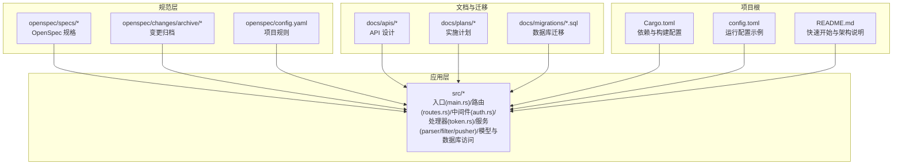
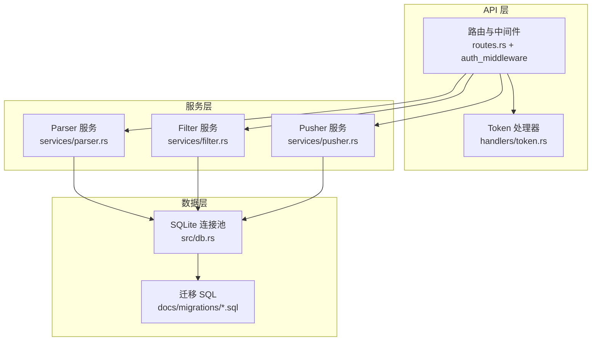
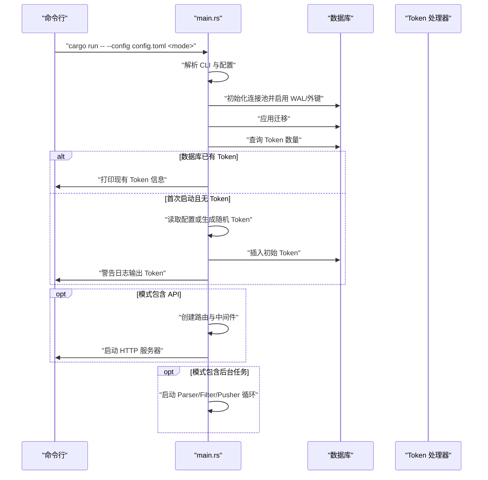
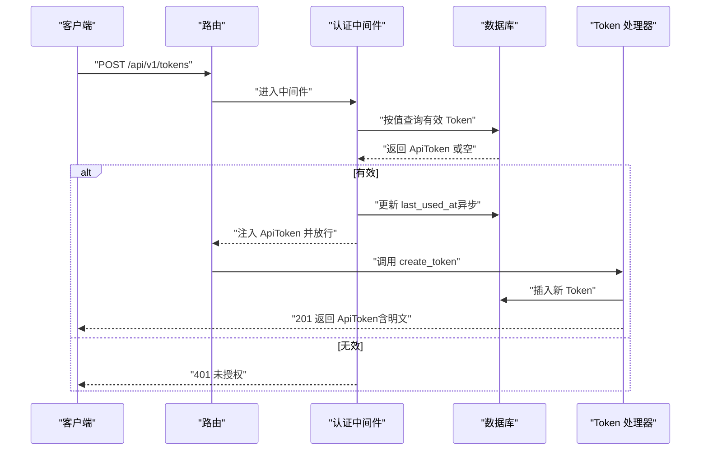
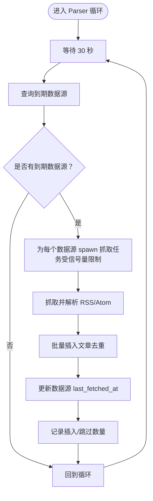
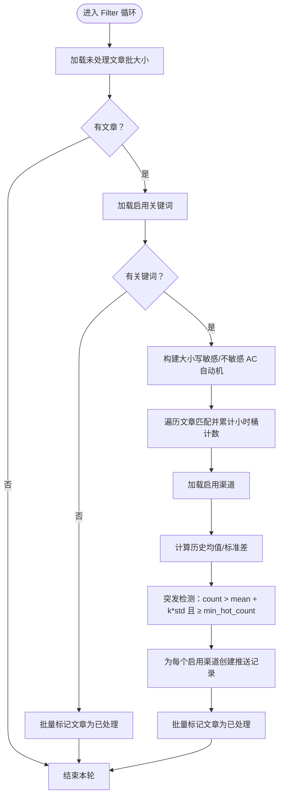
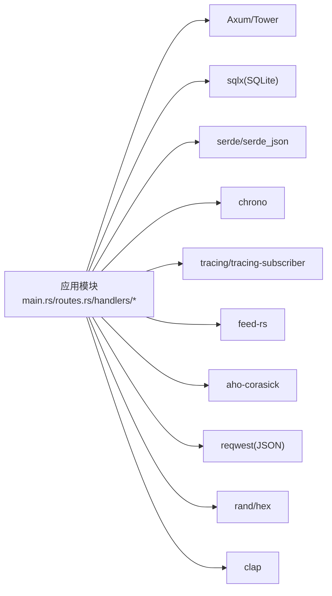

# 开发流程与工作流

<cite>
**本文引用的文件**
- [README.md](file://README.md)
- [Cargo.toml](file://Cargo.toml)
- [src/main.rs](file://src/main.rs)
- [src/db.rs](file://src/db.rs)
- [src/routes.rs](file://src/routes.rs)
- [src/middleware/auth.rs](file://src/middleware/auth.rs)
- [src/handlers/token.rs](file://src/handlers/token.rs)
- [src/services/parser.rs](file://src/services/parser.rs)
- [src/services/filter.rs](file://src/services/filter.rs)
- [src/services/pusher.rs](file://src/services/pusher.rs)
- [openspec/config.yaml](file://openspec/config.yaml)
- [openspec/specs/backend-project-scaffold/spec.md](file://openspec/specs/backend-project-scaffold/spec.md)
- [openspec/specs/database-schema/spec.md](file://openspec/specs/database-schema/spec.md)
- [openspec/specs/token-api/spec.md](file://openspec/specs/token-api/spec.md)
- [docs/migrations/20260607044921_init.sql](file://docs/migrations/20260607044921_init.sql)
</cite>

## 目录
1. [引言](#引言)
2. [项目结构](#项目结构)
3. [核心组件](#核心组件)
4. [架构总览](#架构总览)
5. [详细组件分析](#详细组件分析)
6. [依赖分析](#依赖分析)
7. [性能考虑](#性能考虑)
8. [故障排查指南](#故障排查指南)
9. [结论](#结论)
10. [附录](#附录)

## 引言
本文件面向“AI趋势监控系统”的开发团队，提供基于 OpenSpec 规范的完整开发流程文档。内容覆盖从需求分析、设计文档编写、代码实现、测试验证到部署发布的全流程；解释 Cargo 项目的依赖管理、版本控制与构建流程；记录数据库 schema 变更的规范流程（迁移文件的创建与管理）；给出新功能开发的标准步骤（从需求文档到代码实现再到测试覆盖）；并包含代码审查流程、持续集成配置与自动化测试策略建议。

## 项目结构
项目采用“规范驱动（spec-driven）”的工作流，核心目录与职责如下：
- openspec：存放 OpenSpec 规格文档与变更归档，指导需求到实现的映射
- src：后端 Rust 应用源码，按领域分层组织（路由、中间件、处理器、服务、模型、数据库访问）
- docs：文档与迁移脚本，包含数据库迁移 SQL、API 设计文档与实施计划
- 根目录：Cargo 项目配置、Dockerfile、README、配置模板等



图表来源
- [src/main.rs:1-164](file://src/main.rs#L1-L164)
- [src/routes.rs:1-70](file://src/routes.rs#L1-L70)
- [openspec/specs/backend-project-scaffold/spec.md:1-151](file://openspec/specs/backend-project-scaffold/spec.md#L1-L151)
- [openspec/specs/database-schema/spec.md:1-173](file://openspec/specs/database-schema/spec.md#L1-L173)
- [openspec/specs/token-api/spec.md:1-76](file://openspec/specs/token-api/spec.md#L1-L76)
- [docs/migrations/20260607044921_init.sql:1-118](file://docs/migrations/20260607044921_init.sql#L1-L118)

章节来源
- [README.md:216-257](file://README.md#L216-L257)
- [Cargo.toml:1-67](file://Cargo.toml#L1-L67)

## 核心组件
- 后端入口与生命周期
  - CLI 参数解析与模式选择（all/api/parser/filter/pusher）
  - 初始化日志、数据库连接池、迁移、初始 Token 引导
  - 按模式启动 API 服务器与后台任务循环
- 路由与中间件
  - 路由注册与 CORS 层
  - Bearer Token 认证中间件，注入 ApiToken 至请求上下文
- 处理器
  - Token 管理 API：创建、列表（隐藏密文）、撤销
- 服务模块
  - Parser：RSS/Atom 采集、去重入库、并发限流
  - Filter：关键词匹配（Aho-Corasick）、小时桶统计、突发检测、生成热点事件与推送记录
  - Pusher：轮询待推送记录、指数退避重试、乐观锁更新状态

章节来源
- [src/main.rs:17-164](file://src/main.rs#L17-L164)
- [src/routes.rs:14-70](file://src/routes.rs#L14-L70)
- [src/middleware/auth.rs:14-58](file://src/middleware/auth.rs#L14-L58)
- [src/handlers/token.rs:13-66](file://src/handlers/token.rs#L13-L66)
- [src/services/parser.rs:90-185](file://src/services/parser.rs#L90-L185)
- [src/services/filter.rs:9-277](file://src/services/filter.rs#L9-L277)
- [src/services/pusher.rs:7-259](file://src/services/pusher.rs#L7-L259)

## 架构总览
系统采用“管道模式（Pipeline）”，三个后台模块独立运行，支持单模块或组合运行。API 服务提供统一入口与认证。



图表来源
- [src/routes.rs:14-70](file://src/routes.rs#L14-L70)
- [src/middleware/auth.rs:14-58](file://src/middleware/auth.rs#L14-L58)
- [src/handlers/token.rs:13-66](file://src/handlers/token.rs#L13-L66)
- [src/services/parser.rs:90-185](file://src/services/parser.rs#L90-L185)
- [src/services/filter.rs:9-277](file://src/services/filter.rs#L9-L277)
- [src/services/pusher.rs:7-259](file://src/services/pusher.rs#L7-L259)
- [src/db.rs:10-27](file://src/db.rs#L10-L27)
- [docs/migrations/20260607044921_init.sql:1-118](file://docs/migrations/20260607044921_init.sql#L1-L118)

## 详细组件分析

### 组件一：后端项目脚手架（入口、配置、迁移与初始 Token）
- 入口职责
  - CLI 解析（--config、模式选择）
  - 初始化日志、数据库目录、连接池、迁移
  - 首次启动引导初始 Token（可从配置读取或自动生成）
  - 按模式启动 API 与后台任务
- 配置加载
  - TOML 配置解析，包含 server、database、auth、parser、filter、pusher 等段落
- 迁移与数据库
  - 启动时自动应用迁移，启用 WAL 与外键约束
- 初始 Token
  - 若数据库中无 Token，优先使用配置中的 initial_token，否则自动生成 64 字节十六进制字符串并通过日志警告输出



图表来源
- [src/main.rs:64-164](file://src/main.rs#L64-L164)
- [src/db.rs:10-27](file://src/db.rs#L10-L27)
- [src/routes.rs:14-70](file://src/routes.rs#L14-L70)

章节来源
- [openspec/specs/backend-project-scaffold/spec.md:1-151](file://openspec/specs/backend-project-scaffold/spec.md#L1-L151)
- [src/main.rs:27-62](file://src/main.rs#L27-L62)
- [src/db.rs:10-27](file://src/db.rs#L10-L27)

### 组件二：认证中间件与 Token API
- 认证流程
  - 提取 Authorization 头 → 校验 Bearer 格式 → 查询数据库有效 Token（未撤销、未过期）→ 更新 last_used_at（异步）→ 注入 ApiToken 至请求扩展
- Token 管理 API
  - 创建：生成 64 字节随机十六进制 Token，返回明文一次
  - 列表：返回 ApiTokenInfo（不含密文），按创建时间倒序
  - 撤销：软删除（设置 revoked）



图表来源
- [src/middleware/auth.rs:14-58](file://src/middleware/auth.rs#L14-L58)
- [src/handlers/token.rs:13-66](file://src/handlers/token.rs#L13-L66)

章节来源
- [openspec/specs/token-api/spec.md:1-76](file://openspec/specs/token-api/spec.md#L1-L76)
- [src/middleware/auth.rs:14-58](file://src/middleware/auth.rs#L14-L58)
- [src/handlers/token.rs:13-66](file://src/handlers/token.rs#L13-L66)

### 组件三：Parser 模块（RSS 采集）
- 功能要点
  - 基于 feed-rs 解析 RSS/Atom
  - 并发限制（信号量）与超时控制
  - 去重写入 articles 表，更新数据源最后抓取时间
  - 每 30 秒检查到期的数据源
- 并发与稳定性
  - 使用信号量限制最大并发抓取数
  - 失败时仍更新 last_fetched，避免频繁重试



图表来源
- [src/services/parser.rs:90-185](file://src/services/parser.rs#L90-L185)

章节来源
- [src/services/parser.rs:90-185](file://src/services/parser.rs#L90-L185)

### 组件四：Filter 模块（关键词匹配与热点检测）
- 流程
  - 加载未处理文章与启用的关键词
  - 构建大小写敏感/不敏感 Aho-Corasick 自动机
  - 统计小时桶计数，记录关键词命中
  - 计算历史均值与标准差，进行突发检测
  - 生成热点事件与推送记录，标记文章已处理
- 并发与幂等
  - 每次运行前删除同小时桶的旧记录，保证幂等
  - 支持手动触发与后台定时运行



图表来源
- [src/services/filter.rs:9-277](file://src/services/filter.rs#L9-L277)

章节来源
- [src/services/filter.rs:9-277](file://src/services/filter.rs#L9-L277)

### 组件五：Pusher 模块（Webhook 推送与重试）
- 流程
  - 轮询 status=pending 的推送记录，以及 retry_due 的记录
  - 逐条查询渠道与热点事件，构造消息体
  - POST Webhook，成功则乐观锁更新为 success，失败则指数退避重试
- 重试策略
  - 最大重试次数、基础退避秒数、下次重试时间计算
  - 达到上限后放弃并清空下次重试时间

```mermaid
sequenceDiagram
participant Loop as "Pusher 循环"
participant DB as "数据库"
participant CH as "渠道"
participant HE as "热点事件"
participant KW as "关键词"
participant HTTP as "Webhook 服务"
Loop->>DB : "查询 pending 与 retry_due 记录"
DB-->>Loop : "返回可推送记录集"
loop 对每条记录
Loop->>CH : "根据 channel_id 获取渠道配置"
CH-->>Loop : "返回渠道含 JSON 配置"
Loop->>HE : "根据 hot_event_id 获取热点事件"
HE-->>Loop : "返回热点事件"
Loop->>KW : "根据 keyword_id 获取关键词"
KW-->>Loop : "返回关键词"
Loop->>HTTP : "POST 消息体至 webhook URL"
alt 成功
Loop->>DB : "乐观锁更新为 success"
else 失败
Loop->>DB : "更新为 failed 并计算下次重试时间"
end
end
```

图表来源
- [src/services/pusher.rs:7-259](file://src/services/pusher.rs#L7-L259)

章节来源
- [src/services/pusher.rs:7-259](file://src/services/pusher.rs#L7-L259)

## 依赖分析
- 语言与框架
  - Rust（2021 版），Tokio 异步运行时，Axum/Tower 作为 Web 框架
- 数据库与 ORM
  - SQLite + sqlx（运行时 Tokio、SQLite、chrono、迁移特性）
- 序列化与配置
  - serde/serde_json、toml
- 时间与时序
  - chrono
- 日志与可观测性
  - tracing/tracing-subscriber
- RSS 解析与字符串匹配
  - feed-rs、aho-corasick
- HTTP 客户端与随机数
  - reqwest（JSON）、rand/hex
- CLI
  - clap
- 性能配置
  - dev/release/profile 优化级别与编译选项



图表来源
- [Cargo.toml:6-47](file://Cargo.toml#L6-L47)
- [src/main.rs:10-16](file://src/main.rs#L10-L16)

章节来源
- [Cargo.toml:1-67](file://Cargo.toml#L1-L67)

## 性能考虑
- 构建优化
  - release 配置启用 LTO、单代码单元、符号剥离、panic 中止、禁用增量与溢出检查，追求极致性能
  - dev-opt 在保留调试信息的同时提升性能
- 数据库
  - WAL 模式提升并发写入能力；外键约束保障一致性
  - 为高频查询字段建立索引（如 articles.processed_at、hot_events.hour_bucket 等）
- 服务循环
  - Parser/Filter/Pusher 采用固定间隔轮询，避免忙等
  - Parser 使用信号量限制并发，防止资源耗尽
- 网络与重试
  - Pusher 指数退避与乐观锁，降低重复推送风险

章节来源
- [Cargo.toml:48-67](file://Cargo.toml#L48-L67)
- [src/db.rs:10-27](file://src/db.rs#L10-L27)
- [src/services/parser.rs:90-185](file://src/services/parser.rs#L90-L185)
- [src/services/pusher.rs:7-259](file://src/services/pusher.rs#L7-L259)

## 故障排查指南
- 启动与迁移
  - 若迁移失败，构建会在编译期报错，定位具体 SQL 语句
  - 首次启动未见初始 Token：检查配置项与数据库是否已存在 Token
- 认证问题
  - 401 通常来自中间件：确认 Authorization 头格式、Token 是否撤销或过期
  - 撤销后仍可用：确认数据库中 revoked 标记与过期时间
- API 响应
  - 统一错误格式：{"error": {"code": "...", "message": "..."}}
  - 常见错误码：UNAUTHORIZED、NOT_FOUND、DATABASE_ERROR 等
- Parser/Filter/Pusher
  - 查看日志中“插入/跳过数量”、“历史统计”、“重试计数”等信息
  - Pusher 失败：检查渠道配置 JSON 是否包含 url 字段，网络连通性与目标服务状态码

章节来源
- [openspec/specs/backend-project-scaffold/spec.md:55-82](file://openspec/specs/backend-project-scaffold/spec.md#L55-L82)
- [src/middleware/auth.rs:14-58](file://src/middleware/auth.rs#L14-L58)
- [src/services/parser.rs:120-182](file://src/services/parser.rs#L120-L182)
- [src/services/filter.rs:131-208](file://src/services/filter.rs#L131-L208)
- [src/services/pusher.rs:146-201](file://src/services/pusher.rs#L146-L201)

## 结论
本项目以 OpenSpec 为纲，结合 Rust 生态与 SQLite，实现了可扩展的热点监控平台。通过规范化的开发流程、明确的模块边界与完善的后台任务调度，能够稳定地完成 RSS 采集、关键词匹配、热点检测与告警推送。建议在后续迭代中完善前端与可视化，并持续优化数据库索引与服务并发参数。

## 附录

### 基于 OpenSpec 的开发工作流
- 需求分析
  - 在 openspec/specs 下创建或更新规格文档，明确功能边界与验收场景
  - 使用 openspec/changes/archive 归档历史变更，保持演进可追溯
- 设计文档编写
  - 在 docs/apis 与 docs/plans 中补充 API 设计与实施计划
  - 与 README 的架构与技术栈保持一致
- 代码实现
  - 遵循模块风格（handlers、services、models、db），确保编译通过
  - 新增路由与处理器时，同步更新中间件与错误处理
- 测试验证
  - 单元测试：针对关键函数（如热点检测、推送重试）编写测试
  - 集成测试：启动最小化环境，验证端到端流程
- 部署发布
  - 使用 Cargo release 构建生产二进制，配合 Dockerfile 进行容器化
  - 通过 config.toml 配置运行参数，确保迁移与初始 Token 正常

章节来源
- [openspec/config.yaml:1-21](file://openspec/config.yaml#L1-L21)
- [README.md:38-90](file://README.md#L38-L90)

### Cargo 项目的依赖管理、版本控制与构建流程
- 依赖管理
  - 在 Cargo.toml 中声明依赖与特性，确保最小化与可维护性
- 版本控制
  - 使用语义化版本（当前 package version 为 0.1.0），在功能稳定后升级主版本
- 构建流程
  - 开发：cargo build / cargo run
  - 生产：cargo build --release（优化配置见 Cargo.toml profile）

章节来源
- [Cargo.toml:1-67](file://Cargo.toml#L1-L67)

### 数据库 schema 变更规范流程
- 迁移文件
  - 新增迁移：在 docs/migrations 下创建带时间戳的新 SQL 文件
  - 迁移嵌入：启动时通过 sqlx::migrate!() 自动应用
- 变更策略
  - 不破坏现有数据：新增表/列、索引；避免删除列或破坏性变更
  - 幂等性：必要时使用 upsert/delete-insert 模式
- 回滚与回溯
  - 通过新增迁移修复问题；如需回滚，创建逆向迁移

章节来源
- [openspec/specs/database-schema/spec.md:9-32](file://openspec/specs/database-schema/spec.md#L9-L32)
- [docs/migrations/20260607044921_init.sql:1-118](file://docs/migrations/20260607044921_init.sql#L1-L118)

### 新功能开发标准步骤
- 需求文档
  - 在 openspec/specs 下编写规格文档，定义端点、数据模型与验收场景
- 设计与建模
  - 在 docs/apis 与 docs/plans 中补充接口与实施计划
  - 明确数据库表结构与索引策略
- 实现
  - 实现路由与中间件（如需）
  - 实现处理器与业务逻辑（services）
  - 实现数据库访问（db 模块）
- 测试
  - 单元测试覆盖关键算法（如热点检测、推送重试）
  - 集成测试覆盖端到端流程
- 验收与发布
  - 本地验证（健康检查、认证、CRUD）
  - 发布前检查迁移与配置

章节来源
- [openspec/specs/token-api/spec.md:1-76](file://openspec/specs/token-api/spec.md#L1-L76)
- [src/routes.rs:14-70](file://src/routes.rs#L14-L70)
- [src/services/filter.rs:9-277](file://src/services/filter.rs#L9-L277)
- [src/services/pusher.rs:7-259](file://src/services/pusher.rs#L7-L259)

### 代码审查流程、持续集成与自动化测试策略
- 代码审查
  - 使用 OpenSpec 规格作为评审依据，确保实现与需求一致
  - 关注并发安全（Tokio 任务、信号量）、数据库事务与幂等性
- 持续集成
  - 建议在 CI 中执行：cargo check/cfg、cargo test、迁移编译检查
- 自动化测试
  - 单元测试：重点覆盖热点检测算法、推送重试逻辑
  - 集成测试：启动最小化服务，验证路由、认证与数据库交互

章节来源
- [openspec/specs/backend-project-scaffold/spec.md:55-82](file://openspec/specs/backend-project-scaffold/spec.md#L55-L82)
- [src/services/filter.rs:210-267](file://src/services/filter.rs#L210-L267)
- [src/services/pusher.rs:204-242](file://src/services/pusher.rs#L204-L242)