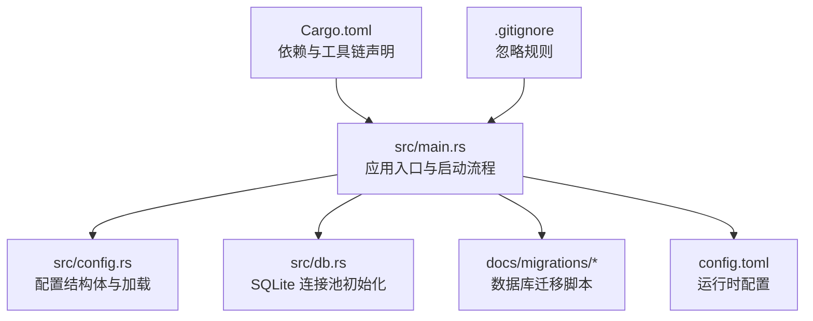
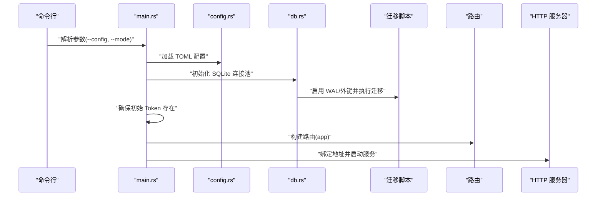
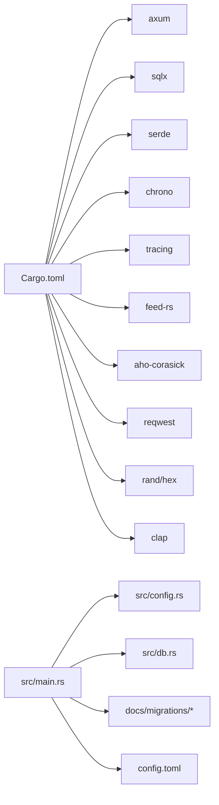

# 开发环境配置

<cite>
**本文引用的文件**
- [Cargo.toml](file://Cargo.toml)
- [README.md](file://README.md)
- [src/main.rs](file://src/main.rs)
- [src/config.rs](file://src/config.rs)
- [config.toml](file://config.toml)
- [src/db.rs](file://src/db.rs)
- [docs/migrations/20260607044921_init.sql](file://docs/migrations/20260607044921_init.sql)
- [.gitignore](file://.gitignore)
- [openspec/config.yaml](file://openspec/config.yaml)
- [openspec/specs/backend-project-scaffold/spec.md](file://openspec/specs/backend-project-scaffold/spec.md)
- [openspec/specs/initial-token-bootstrap/spec.md](file://openspec/specs/initial-token-bootstrap/spec.md)
- [openspec/changes/archive/2026-06-07-db-migrations-and-models/specs/database-schema/spec.md](file://openspec/changes/archive/2026-06-07-db-migrations-and-models/specs/database-schema/spec.md)
</cite>

## 目录
1. [简介](#简介)
2. [项目结构](#项目结构)
3. [核心组件](#核心组件)
4. [架构总览](#架构总览)
5. [详细组件分析](#详细组件分析)
6. [依赖关系分析](#依赖关系分析)
7. [性能考虑](#性能考虑)
8. [故障排查指南](#故障排查指南)
9. [结论](#结论)
10. [附录](#附录)

## 简介
本指南面向参与 AI-Trend-Tool 项目的开发者，提供从零搭建 Rust 开发环境、安装项目依赖、配置数据库与环境变量、启动本地服务、以及容器化部署与调试工具配置的完整流程。同时涵盖 Git 工作流、分支策略与提交规范建议，并给出常见环境问题的排查与解决方案。

## 项目结构
项目采用典型的 Rust 单二进制应用结构，核心入口在 src/main.rs，配置解析在 src/config.rs，数据库连接与迁移在 src/db.rs，配置文件为 config.toml，数据库迁移脚本位于 docs/migrations。

图表来源
- [src/main.rs:1-96](file://src/main.rs#L1-L96)
- [src/config.rs:1-59](file://src/config.rs#L1-L59)
- [src/db.rs:1-25](file://src/db.rs#L1-L25)
- [docs/migrations/20260607044921_init.sql:1-118](file://docs/migrations/20260607044921_init.sql#L1-L118)
- [config.toml:1-27](file://config.toml#L1-L27)
- [Cargo.toml:1-44](file://Cargo.toml#L1-L44)
- [.gitignore:1-62](file://.gitignore#L1-L62)

章节来源
- [README.md:216-257](file://README.md#L216-L257)
- [src/main.rs:63-96](file://src/main.rs#L63-L96)
- [src/config.rs:52-59](file://src/config.rs#L52-L59)
- [src/db.rs:11-25](file://src/db.rs#L11-L25)
- [docs/migrations/20260607044921_init.sql:1-118](file://docs/migrations/20260607044921_init.sql#L1-L118)
- [config.toml:1-27](file://config.toml#L1-L27)
- [Cargo.toml:1-44](file://Cargo.toml#L1-L44)
- [.gitignore:1-62](file://.gitignore#L1-L62)

## 核心组件
- 应用入口与启动流程：负责解析命令行参数、加载配置、初始化数据库连接池、执行迁移、确保初始 Token 存在、构建路由并启动 HTTP 服务器。
- 配置系统：以 TOML 文件为配置源，映射到结构化配置对象，支持服务器、数据库、认证、采集、过滤、推送等模块的参数。
- 数据库层：使用 SQLite，通过 sqlx 初始化连接池，启用 WAL 模式与外键约束；启动时自动应用迁移脚本。
- 运行时配置：默认读取 config.toml，包含监听地址、端口、数据库路径、认证初始 Token、采集/过滤/推送参数等。

章节来源
- [src/main.rs:16-61](file://src/main.rs#L16-L61)
- [src/main.rs:63-96](file://src/main.rs#L63-L96)
- [src/config.rs:4-59](file://src/config.rs#L4-L59)
- [src/db.rs:11-25](file://src/db.rs#L11-L25)
- [config.toml:1-27](file://config.toml#L1-L27)

## 架构总览
下图展示启动阶段的关键交互：命令行解析、配置加载、数据库初始化、迁移执行、初始 Token 确保、路由构建与服务启动。

图表来源
- [src/main.rs:63-96](file://src/main.rs#L63-L96)
- [src/config.rs:52-59](file://src/config.rs#L52-L59)
- [src/db.rs:11-25](file://src/db.rs#L11-L25)
- [docs/migrations/20260607044921_init.sql:1-118](file://docs/migrations/20260607044921_init.sql#L1-L118)

## 详细组件分析

### Rust 开发环境与工具链
- 版本要求
  - 语言标准：Rust Edition 2021
  - 工具链版本：Rust 1.75+
  - 包管理：Cargo（随 Rust 工具链）
- 安装步骤
  - 使用官方安装程序安装 Rust 工具链与 Cargo
  - 验证安装：cargo --version
- IDE 推荐
  - VS Code：安装 Rust（rust-analyzer）扩展，启用“IntelliSense”和“代码补全”
  - IntelliJ IDEA/RustRover：使用内置 Cargo 支持与 LSP
- 插件建议
  - rust-analyzer：语义分析与跳转
  - Even Better TOML：TOML 高亮与校验
  - SQLTools：SQLite 查询与连接（可选）

章节来源
- [Cargo.toml:1-44](file://Cargo.toml#L1-L44)
- [README.md:40-44](file://README.md#L40-L44)

### 项目依赖安装与配置
- 依赖声明与版本
  - Web 框架：axum、tower、tower-http
  - 数据库：sqlx（SQLite、迁移）
  - 序列化：serde、serde_json、toml
  - 时间：chrono
  - 日志：tracing、tracing-subscriber
  - RSS 解析：feed-rs
  - 字符串匹配：aho-corasick
  - HTTP 客户端：reqwest
  - 随机与编码：rand、hex
  - CLI：clap
- 本地安装
  - 在项目根目录执行 cargo build 或 cargo run
  - 首次运行会自动下载并编译依赖

章节来源
- [Cargo.toml:6-44](file://Cargo.toml#L6-L44)

### 数据库连接与迁移
- 连接池初始化
  - 使用 sqlite: 路径 + 模式 rwc
  - 设置最大连接数
  - 启用 WAL 模式与外键约束
- 迁移执行
  - 启动时自动应用 docs/migrations 下的迁移脚本
  - 若数据库文件不存在则创建并应用
- 表结构要点
  - api_tokens：存储 Bearer Token（可撤销、可选过期）
  - data_sources：RSS 数据源配置
  - articles：采集文章（去重、处理追踪）
  - keywords：关键词与阈值参数
  - hot_events：小时桶统计的热点事件
  - push_channels：推送渠道（Webhook）
  - push_records：推送记录与重试追踪

章节来源
- [src/db.rs:11-25](file://src/db.rs#L11-L25)
- [docs/migrations/20260607044921_init.sql:1-118](file://docs/migrations/20260607044921_init.sql#L1-L118)

### 环境变量与配置文件
- 默认配置文件：config.toml
  - server：host、port
  - database：path
  - auth：initial_token（可选）
  - parser：max_concurrent_fetches、default_user_agent、default_timeout_seconds
  - filter：batch_size、interval_seconds、history_hours、min_history_hours
  - pusher：interval_seconds、max_retries、retry_base_seconds
- 加载流程
  - main.rs 中解析命令行参数 --config 指向 config.toml
  - config.rs 读取并反序列化为结构体

章节来源
- [config.toml:1-27](file://config.toml#L1-L27)
- [src/config.rs:52-59](file://src/config.rs#L52-L59)
- [src/main.rs:67-69](file://src/main.rs#L67-L69)

### 初始 Token 与认证引导
- 首次启动策略
  - 若 api_tokens 表为空：
    - 若配置中提供 initial_token，则插入该值
    - 否则自动生成 64 位随机 hex 字符串并记录日志
  - 若已有 Token，则打印首个可用 Token 供使用
- 日志级别
  - 默认初始化 info 级别日志输出

章节来源
- [src/main.rs:26-61](file://src/main.rs#L26-L61)
- [openspec/specs/initial-token-bootstrap/spec.md:1-32](file://openspec/specs/initial-token-bootstrap/spec.md#L1-L32)
- [openspec/specs/backend-project-scaffold/spec.md:122-144](file://openspec/specs/backend-project-scaffold/spec.md#L122-L144)

### 本地服务启动
- 构建与运行
  - 构建：cargo build --release
  - 运行全部模块：cargo run -- --config config.toml all
  - 运行 API 服务：cargo run -- --config config.toml api
  - 运行采集/过滤/推送模块：分别传入 parser/filter/pusher
- 健康检查
  - /health 返回 {"status":"ok"}

章节来源
- [README.md:38-72](file://README.md#L38-L72)
- [README.md:166-171](file://README.md#L166-L171)

### Docker 容器化与开发容器（建议）
- 容器镜像建议
  - 基础镜像：Debian/Alpine 或 rust:slim
  - 步骤：安装 SQLite 3、编译二进制、复制迁移脚本、暴露端口、设置工作目录与用户
- 开发容器（Dev Container）
  - 使用 .devcontainer 配置 VS Code Dev Containers
  - 安装 rust-analyzer、SQLTools 等扩展
  - 映射源码目录与 Cargo 缓存，挂载 docs/data 用于持久化 SQLite 数据
- 注意事项
  - 确保容器内可访问 docs/migrations 并具备写权限
  - 将 config.toml 作为卷挂载或在构建时注入

（本节为概念性说明，未直接分析具体文件，故不附加章节来源）

### Git 工作流、分支策略与提交规范（建议）
- 分支策略
  - main：稳定发布分支
  - develop：集成分支
  - feature/*：功能开发分支
  - hotfix/*：紧急修复分支
- 提交规范（Conventional Commits）
  - feat：新功能
  - fix：缺陷修复
  - docs：文档更新
  - style：不影响逻辑的格式调整
  - refactor：重构但不增功能/修复
  - perf：性能优化
  - test：测试相关
  - chore：构建流程、依赖管理等
- OpenSpec 工作流
  - 使用 openspec/config.yaml 配置项目上下文与制品规则
  - 变更通过 spec-driven 流程管理，确保设计与实现一致

章节来源
- [openspec/config.yaml:1-21](file://openspec/config.yaml#L1-L21)
- [openspec/specs/backend-project-scaffold/spec.md:117-144](file://openspec/specs/backend-project-scaffold/spec.md#L117-L144)

### 调试工具与日志配置
- 日志
  - 初始化：tracing_subscriber::fmt().with_env_filter("info")
  - 初始 Token 输出：tracing::warn!（首次启动时）
  - 建议：在开发阶段可临时提升日志级别以观察迁移与 Token 创建过程
- 断点与调试
  - VS Code：使用 rust-analyzer 设置断点，F5 启动调试
  - IntelliJ：使用内置调试器，选择 Cargo 目标进行断点调试
- 常用调试点
  - main.rs：入口、配置加载、数据库初始化、迁移执行、路由构建
  - config.rs：配置反序列化是否成功
  - db.rs：连接池初始化与 PRAGMA 设置
  - 迁移脚本：确认表结构与索引创建

章节来源
- [src/main.rs:65-65](file://src/main.rs#L65-L65)
- [src/main.rs:57-60](file://src/main.rs#L57-L60)
- [src/config.rs:52-59](file://src/config.rs#L52-L59)
- [src/db.rs:11-25](file://src/db.rs#L11-L25)

## 依赖关系分析

图表来源
- [Cargo.toml:6-44](file://Cargo.toml#L6-L44)
- [src/main.rs:63-96](file://src/main.rs#L63-L96)
- [src/config.rs:52-59](file://src/config.rs#L52-L59)
- [src/db.rs:11-25](file://src/db.rs#L11-L25)
- [docs/migrations/20260607044921_init.sql:1-118](file://docs/migrations/20260607044921_init.sql#L1-L118)
- [config.toml:1-27](file://config.toml#L1-L27)

章节来源
- [Cargo.toml:6-44](file://Cargo.toml#L6-L44)
- [src/main.rs:63-96](file://src/main.rs#L63-L96)
- [src/config.rs:52-59](file://src/config.rs#L52-L59)
- [src/db.rs:11-25](file://src/db.rs#L11-L25)
- [docs/migrations/20260607044921_init.sql:1-118](file://docs/migrations/20260607044921_init.sql#L1-L118)
- [config.toml:1-27](file://config.toml#L1-L27)

## 性能考虑
- 数据库连接池
  - 当前最大连接数为 5，适用于单机轻量场景；如并发较高，可适当调大
- WAL 模式
  - 提升并发读写性能，减少锁竞争
- 外键约束
  - 确保数据一致性，避免孤儿数据
- 迁移编译期嵌入
  - 保证迁移脚本正确性，避免运行时失败

（本节为通用指导，不直接分析具体文件）

## 故障排查指南
- 无法启动或崩溃
  - 检查 config.toml 路径与权限
  - 查看日志输出（默认 info 级别），关注迁移与 Token 创建阶段
- 数据库文件无法创建
  - 确认 database.path 指向的目录存在且可写
  - 确认 docs/migrations 目录存在且可读
- 迁移失败
  - 检查迁移脚本语法与完整性
  - 确保 SQLite 3 已安装且版本兼容
- 初始 Token 未生成
  - 确认 api_tokens 表是否为空
  - 检查 config.toml 中 auth.initial_token 是否为空字符串
- 端口占用
  - 修改 config.toml 的 server.port 或释放占用端口

章节来源
- [src/main.rs:65-65](file://src/main.rs#L65-L65)
- [src/main.rs:70-75](file://src/main.rs#L70-L75)
- [src/main.rs:79-80](file://src/main.rs#L79-L80)
- [openspec/specs/initial-token-bootstrap/spec.md:13-32](file://openspec/specs/initial-token-bootstrap/spec.md#L13-L32)
- [openspec/changes/archive/2026-06-07-db-migrations-and-models/specs/database-schema/spec.md:1-31](file://openspec/changes/archive/2026-06-07-db-migrations-and-models/specs/database-schema/spec.md#L1-L31)

## 结论
通过本指南，您可以在本地快速搭建 Rust 开发环境，完成项目依赖安装、数据库初始化与配置加载，并成功启动服务。建议结合 OpenSpec 工作流与 Git 分支策略，规范开发流程；在容器化部署时注意迁移脚本与数据持久化路径的配置。遇到问题时，优先检查日志输出与配置文件路径权限。

## 附录

### 常用命令速查
- 构建：cargo build --release
- 运行全部模块：cargo run -- --config config.toml all
- 运行 API：cargo run -- --config config.toml api
- 运行采集/过滤/推送：分别传入 parser/filter/pusher
- 健康检查：curl http://localhost:8080/health

章节来源
- [README.md:38-72](file://README.md#L38-L72)
- [README.md:166-171](file://README.md#L166-L171)