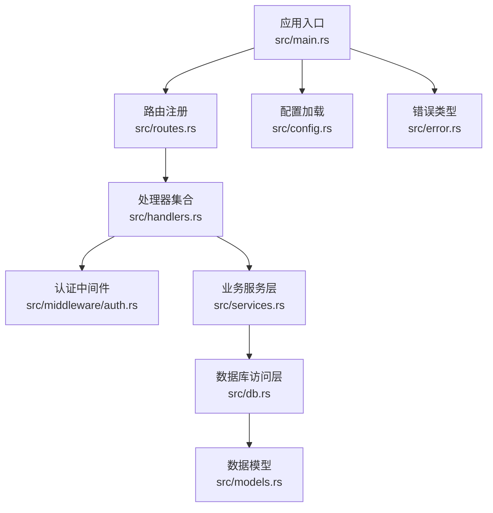
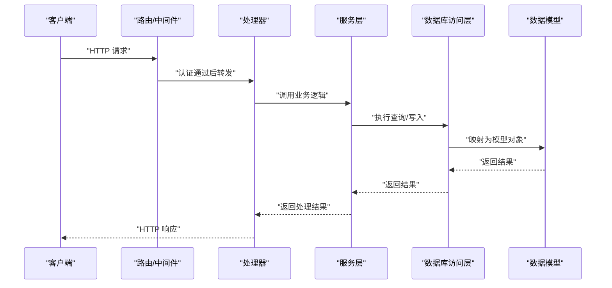
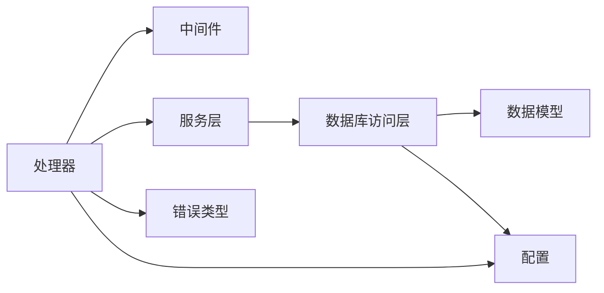

# 测试指南

<cite>
**本文引用的文件**
- [Cargo.toml](file://Cargo.toml)
- [src/main.rs](file://src/main.rs)
- [src/db.rs](file://src/db.rs)
- [src/config.rs](file://src/config.rs)
- [src/error.rs](file://src/error.rs)
- [src/middleware/auth.rs](file://src/middleware/auth.rs)
- [src/handlers.rs](file://src/handlers.rs)
- [src/handlers/channel.rs](file://src/handlers/channel.rs)
- [src/handlers/keyword.rs](file://src/handlers/keyword.rs)
- [src/handlers/query.rs](file://src/handlers/query.rs)
- [src/handlers/source.rs](file://src/handlers/source.rs)
- [src/handlers/token.rs](file://src/handlers/token.rs)
- [src/services.rs](file://src/services.rs)
- [src/services/filter.rs](file://src/services/filter.rs)
- [src/services/parser.rs](file://src/services/parser.rs)
- [src/services/pusher.rs](file://src/services/pusher.rs)
- [src/models.rs](file://src/models.rs)
- [src/models/article.rs](file://src/models/article.rs)
- [src/models/channel.rs](file://src/models/channel.rs)
- [src/models/hot_event.rs](file://src/models/hot_event.rs)
- [src/models/keyword.rs](file://src/models/keyword.rs)
- [src/models/keyword_mention.rs](file://src/models/keyword_mention.rs)
- [src/models/push_record.rs](file://src/models/push_record.rs)
- [src/models/source.rs](file://src/models/source.rs)
- [src/models/token.rs](file://src/models/token.rs)
- [src/db/article.rs](file://src/db/article.rs)
- [src/db/channel.rs](file://src/db/channel.rs)
- [src/db/hot_event.rs](file://src/db/hot_event.rs)
- [src/db/keyword.rs](file://src/db/keyword.rs)
- [src/db/keyword_mention.rs](file://src/db/keyword_mention.rs)
- [src/db/push_record.rs](file://src/db/push_record.rs)
- [src/db/source.rs](file://src/db/source.rs)
- [src/db/token.rs](file://src/db/token.rs)
- [docs/apis/channel-api.md](file://docs/apis/channel-api.md)
- [docs/apis/keyword-api.md](file://docs/apis/keyword-api.md)
- [docs/apis/source-api.md](file://docs/apis/source-api.md)
- [docs/apis/token-api.md](file://docs/apis/token-api.md)
- [docs/plans/02-database-migrations.md](file://docs/plans/02-database-migrations.md)
- [docs/plans/03-auth-and-token-api.md](file://docs/plans/03-auth-and-token-api.md)
- [docs/plans/04-crud-apis.md](file://docs/plans/04-crud-apis.md)
- [docs/plans/05-query-apis-and-background-modules.md](file://docs/plans/05-query-apis-and-background-modules.md)
</cite>

## 目录
1. [引言](#引言)
2. [项目结构](#项目结构)
3. [核心组件](#核心组件)
4. [架构总览](#架构总览)
5. [详细组件分析](#详细组件分析)
6. [依赖分析](#依赖分析)
7. [性能考虑](#性能考虑)
8. [故障排查指南](#故障排查指南)
9. [结论](#结论)
10. [附录](#附录)

## 引言
本测试指南面向AI趋势监控系统的开发与维护团队，目标是建立一套覆盖单元测试、集成测试、异步测试、性能测试与CI/CD测试执行的完整测试体系。文档基于仓库现有Rust后端代码与API规划文档，结合Tokio异步运行时与数据库访问模式，给出可落地的测试策略、断言方法、覆盖率与质量门禁建议，以及测试数据与环境配置要点。

## 项目结构
系统采用Rust语言与Tokio异步运行时，模块化组织如下：
- 应用入口与路由：入口程序负责初始化配置、数据库连接与路由注册；路由模块统一暴露HTTP端点。
- 中间件：认证中间件在请求进入处理器前进行令牌校验。
- 处理器（Handlers）：按资源类型分层（频道、关键词、来源、查询、令牌），每个处理器封装HTTP请求到业务服务的转换与响应格式化。
- 服务（Services）：过滤器、解析器与推送模块等业务逻辑层，处理数据清洗、规则匹配与消息推送。
- 数据模型与数据库访问：模型定义与数据库交互封装，支持CRUD与查询。
- 配置与错误：全局配置加载与统一错误类型定义。

图表来源
- [src/main.rs](file://src/main.rs)
- [src/handlers.rs](file://src/handlers.rs)
- [src/middleware/auth.rs](file://src/middleware/auth.rs)
- [src/services.rs](file://src/services.rs)
- [src/db.rs](file://src/db.rs)
- [src/models.rs](file://src/models.rs)
- [src/config.rs](file://src/config.rs)
- [src/error.rs](file://src/error.rs)

章节来源
- [src/main.rs](file://src/main.rs)
- [src/config.rs](file://src/config.rs)
- [src/error.rs](file://src/error.rs)

## 核心组件
- 认证中间件：在请求进入具体处理器之前进行令牌校验，确保后续业务逻辑的安全性。
- 处理器层：对HTTP请求参数进行解析与校验，调用服务层执行业务逻辑，并返回标准化响应。
- 服务层：封装过滤、解析与推送等业务规则，保证与外部系统或数据库的交互清晰且可测试。
- 数据层：通过模型与数据库模块抽象出数据访问接口，便于在测试中注入Mock或使用内存数据库。
- 错误与配置：统一错误类型与配置加载，便于在测试中模拟异常路径与不同配置场景。

章节来源
- [src/middleware/auth.rs](file://src/middleware/auth.rs)
- [src/handlers.rs](file://src/handlers.rs)
- [src/services.rs](file://src/services.rs)
- [src/db.rs](file://src/db.rs)
- [src/models.rs](file://src/models.rs)

## 架构总览
下图展示从客户端到数据库的典型请求链路，以及异步任务的触发点（如推送模块）：

图表来源
- [src/handlers.rs](file://src/handlers.rs)
- [src/services.rs](file://src/services.rs)
- [src/db.rs](file://src/db.rs)
- [src/models.rs](file://src/models.rs)

## 详细组件分析

### 单元测试指南
- 测试范围与目标
  - 服务层：针对过滤、解析、推送等纯函数与状态无关逻辑，验证输入输出与边界条件。
  - 模型与数据库访问：验证模型字段、序列化/反序列化、查询构建与错误映射。
  - 认证中间件：验证令牌校验成功/失败路径与错误响应。
- 测试用例设计
  - 正常路径：构造有效输入，断言输出符合预期。
  - 边界值：空字符串、超长字符串、极值时间戳、空集合等。
  - 异常路径：无效令牌、缺失参数、非法格式、数据库连接失败等。
- Mock对象与断言
  - 使用轻量级Mock或Fake对象替换外部依赖（如数据库句柄、HTTP客户端），确保测试隔离。
  - 断言策略：布尔断言、相等断言、异常断言、日志/事件断言（如推送是否触发）。
- 并发与异步
  - 对于异步函数，使用Tokio测试运行时启动测试，避免阻塞与竞态。
  - 对共享状态使用Arc+Mutex或无锁并发结构，必要时使用通道进行断言。
- 覆盖率与质量门禁
  - 行覆盖率：服务层≥80%，关键路径≥90%。
  - 分支覆盖率：核心分支≥85%。
  - 质量门禁：未达标的PR禁止合并至主干。

章节来源
- [src/services/filter.rs](file://src/services/filter.rs)
- [src/services/parser.rs](file://src/services/parser.rs)
- [src/services/pusher.rs](file://src/services/pusher.rs)
- [src/models/article.rs](file://src/models/article.rs)
- [src/models/channel.rs](file://src/models/channel.rs)
- [src/models/hot_event.rs](file://src/models/hot_event.rs)
- [src/models/keyword.rs](file://src/models/keyword.rs)
- [src/models/keyword_mention.rs](file://src/models/keyword_mention.rs)
- [src/models/push_record.rs](file://src/models/push_record.rs)
- [src/models/source.rs](file://src/models/source.rs)
- [src/models/token.rs](file://src/models/token.rs)

### 集成测试指南
- 端到端API测试
  - 使用HTTP客户端对各API端点发起请求，覆盖增删改查与查询接口。
  - 参考API文档定义请求体、查询参数、鉴权头与期望响应码。
- 数据库操作测试
  - 在测试数据库中执行迁移，插入最小化测试数据，验证CRUD与复杂查询。
  - 关注事务一致性、索引命中与错误回滚行为。
- 业务逻辑验证
  - 验证过滤器规则、解析器输出与推送模块触发条件。
  - 结合认证中间件，验证权限控制与错误传播。
- 示例端点参考
  - 频道管理、关键词管理、来源管理、查询与令牌API的端点定义与参数说明见API文档。

章节来源
- [docs/apis/channel-api.md](file://docs/apis/channel-api.md)
- [docs/apis/keyword-api.md](file://docs/apis/keyword-api.md)
- [docs/apis/source-api.md](file://docs/apis/source-api.md)
- [docs/apis/token-api.md](file://docs/apis/token-api.md)
- [docs/plans/04-crud-apis.md](file://docs/plans/04-crud-apis.md)
- [docs/plans/05-query-apis-and-background-modules.md](file://docs/plans/05-query-apis-and-background-modules.md)

### 异步与并发测试
- Tokio测试环境
  - 在测试函数上标注异步属性，使用Tokio测试运行时执行。
  - 对需要并发的任务，使用多任务spawn并等待完成，断言最终一致性。
- 并发策略
  - 对共享资源使用同步原语或消息传递，避免竞态。
  - 对数据库写入使用独立事务与隔离级别测试，验证冲突与重试。
- 推送模块测试
  - 模拟推送触发条件，断言消息队列或外部服务被正确调用。
  - 验证失败重试与死信处理（如存在）。

章节来源
- [src/services/pusher.rs](file://src/services/pusher.rs)

### 测试数据准备与环境配置
- 测试数据库
  - 使用独立的测试数据库实例或内存数据库，确保测试隔离。
  - 在测试前执行迁移脚本，测试后清理或回滚。
- 配置与环境变量
  - 通过环境变量切换测试配置（如日志级别、数据库连接串、令牌密钥）。
  - 在CI中使用受控的配置文件与密钥管理。
- 日志与可观测性
  - 在测试中捕获日志输出，定位断言失败原因。
  - 对关键路径添加断言点（如推送事件计数）。

章节来源
- [src/config.rs](file://src/config.rs)
- [src/db.rs](file://src/db.rs)
- [docs/plans/02-database-migrations.md](file://docs/plans/02-database-migrations.md)

### CI/CD中的测试执行流程
- 触发条件
  - PR触发单元与集成测试；主干推送触发全量回归与性能测试。
- 执行步骤
  - 安装依赖与编译；启动测试数据库；执行单元测试与覆盖率收集；执行集成测试；上传覆盖率报告。
- 质量门禁
  - 覆盖率阈值达标；无新增失败用例；关键路径通过。
- 缓存与加速
  - 缓存Cargo依赖与编译产物；并行执行不相互依赖的测试套件。

章节来源
- [Cargo.toml](file://Cargo.toml)

## 依赖分析
- 组件耦合
  - 处理器依赖中间件与服务层；服务层依赖数据库访问层；数据库访问层依赖模型与配置。
- 外部依赖
  - 数据库驱动、Tokio运行时、HTTP框架与配置加载库。
- 循环依赖
  - 当前结构以单向依赖为主，建议保持处理器→服务→数据库的层次化设计，避免循环导入。

图表来源
- [src/handlers.rs](file://src/handlers.rs)
- [src/middleware/auth.rs](file://src/middleware/auth.rs)
- [src/services.rs](file://src/services.rs)
- [src/db.rs](file://src/db.rs)
- [src/models.rs](file://src/models.rs)
- [src/config.rs](file://src/config.rs)
- [src/error.rs](file://src/error.rs)

章节来源
- [src/handlers.rs](file://src/handlers.rs)
- [src/services.rs](file://src/services.rs)
- [src/db.rs](file://src/db.rs)
- [src/models.rs](file://src/models.rs)
- [src/config.rs](file://src/config.rs)
- [src/error.rs](file://src/error.rs)

## 性能考虑
- 负载测试
  - 使用并发用户与恒定吞吐量模拟真实流量，观察延迟分布与错误率。
- 压力测试
  - 逐步提升并发与请求大小，定位瓶颈（数据库索引、服务CPU、网络I/O）。
- 基准测试
  - 对热点路径（如解析器、过滤器、查询接口）进行微基准，对比优化效果。
- 数据库优化
  - 针对高频查询建立索引；使用连接池；避免N+1查询。
- 异步优化
  - 合理拆分任务，减少阻塞；使用流式处理与背压机制。

## 故障排查指南
- 常见问题
  - 认证失败：检查令牌生成与校验逻辑，确认中间件拦截路径。
  - 数据库连接异常：核对连接串、凭据与迁移脚本执行情况。
  - 服务超时：检查Tokio任务调度与外部依赖可用性。
- 排查步骤
  - 启用详细日志；复现最小化用例；分层隔离（先服务层再数据库层）。
- 错误类型
  - 使用统一错误类型与错误码，便于在测试中断言特定错误分支。

章节来源
- [src/error.rs](file://src/error.rs)
- [src/middleware/auth.rs](file://src/middleware/auth.rs)
- [src/db.rs](file://src/db.rs)

## 结论
本测试指南提供了从单元到集成、从同步到异步、从功能到性能的全方位测试实践。建议在开发过程中持续补充测试用例，严格执行覆盖率与质量门禁，并在CI中自动化执行，确保系统稳定性与可维护性。

## 附录
- API端点参考
  - 频道、关键词、来源、查询与令牌API的端点定义与参数说明见对应API文档。
- 数据库迁移
  - 迁移脚本与模型设计见数据库迁移计划文档。

章节来源
- [docs/apis/channel-api.md](file://docs/apis/channel-api.md)
- [docs/apis/keyword-api.md](file://docs/apis/keyword-api.md)
- [docs/apis/source-api.md](file://docs/apis/source-api.md)
- [docs/apis/token-api.md](file://docs/apis/token-api.md)
- [docs/plans/02-database-migrations.md](file://docs/plans/02-database-migrations.md)
- [docs/plans/03-auth-and-token-api.md](file://docs/plans/03-auth-and-token-api.md)
- [docs/plans/04-crud-apis.md](file://docs/plans/04-crud-apis.md)
- [docs/plans/05-query-apis-and-background-modules.md](file://docs/plans/05-query-apis-and-background-modules.md)