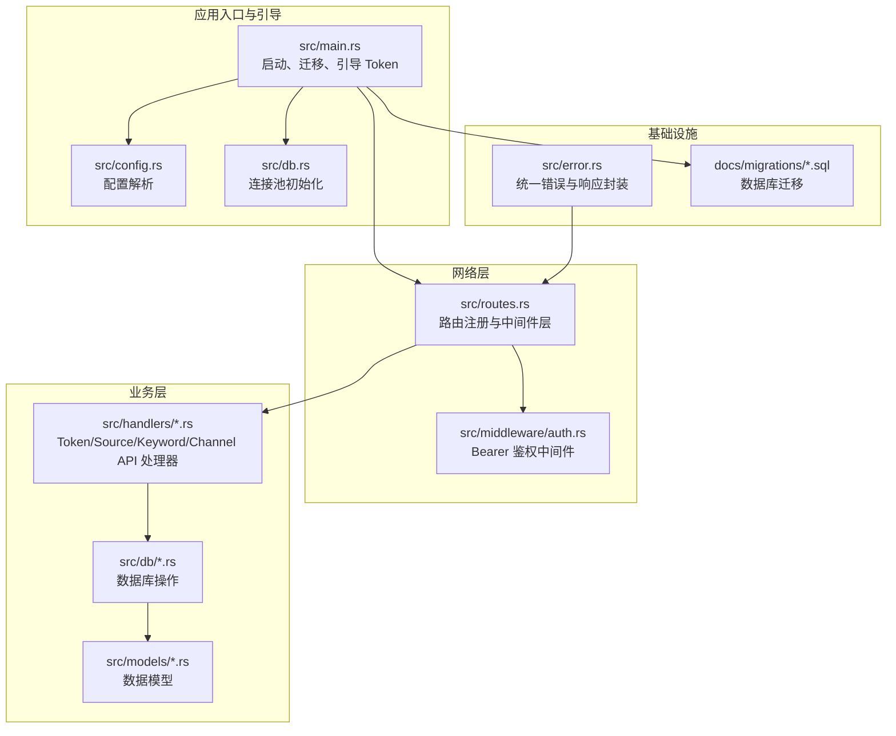
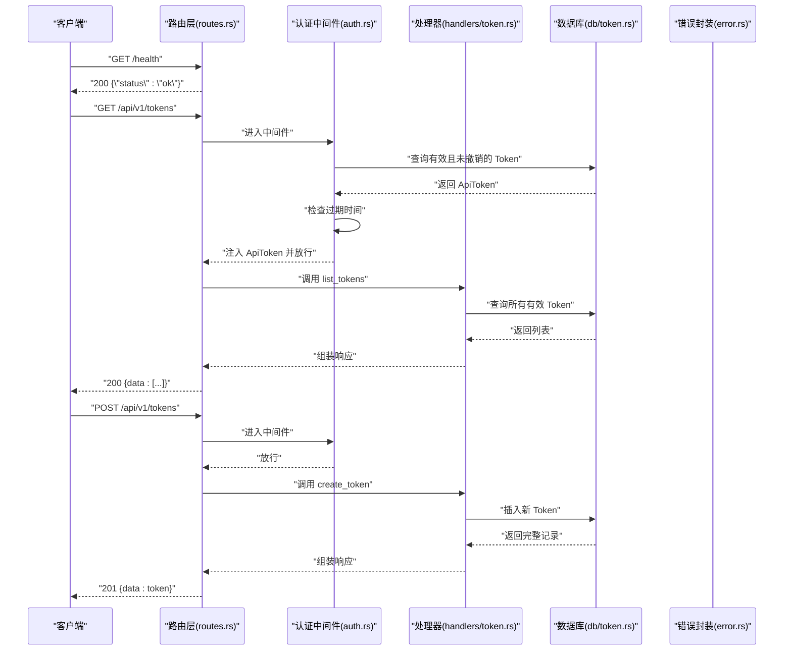
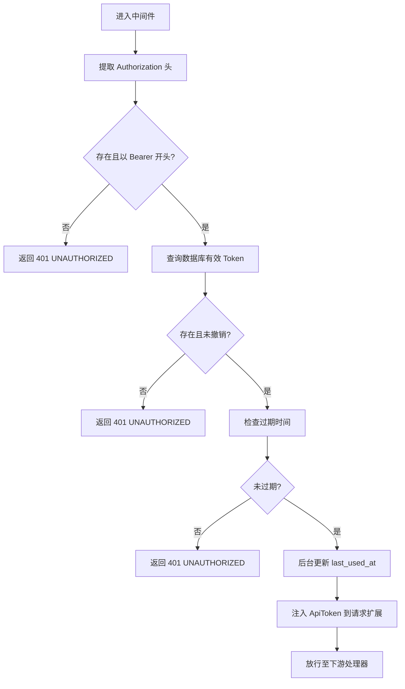
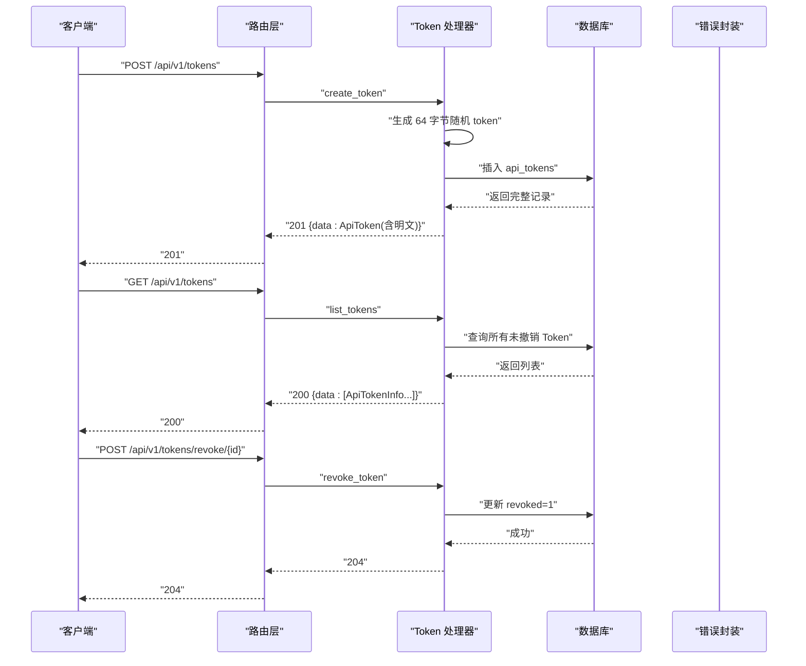
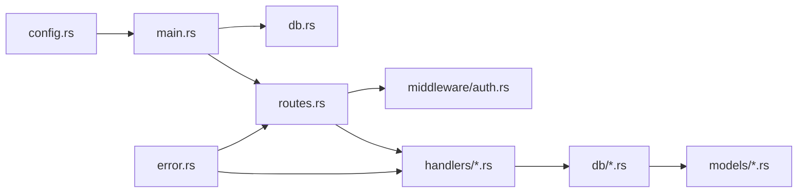

# 测试策略

<cite>
**本文引用的文件**
- [README.md](file://README.md)
- [Cargo.toml](file://Cargo.toml)
- [src/main.rs](file://src/main.rs)
- [src/db.rs](file://src/db.rs)
- [src/routes.rs](file://src/routes.rs)
- [src/error.rs](file://src/error.rs)
- [src/middleware/auth.rs](file://src/middleware/auth.rs)
- [src/models/token.rs](file://src/models/token.rs)
- [src/db/token.rs](file://src/db/token.rs)
- [src/handlers/token.rs](file://src/handlers/token.rs)
- [src/config.rs](file://src/config.rs)
- [docs/migrations/20260607044921_init.sql](file://docs/migrations/20260607044921_init.sql)
- [src/services.rs](file://src/services.rs)
</cite>

## 目录
1. [引言](#引言)
2. [项目结构](#项目结构)
3. [核心组件](#核心组件)
4. [架构总览](#架构总览)
5. [详细组件分析](#详细组件分析)
6. [依赖关系分析](#依赖关系分析)
7. [性能考虑](#性能考虑)
8. [故障排查指南](#故障排查指南)
9. [结论](#结论)
10. [附录](#附录)

## 引言
本测试策略面向 AI-Trend-Tool 后端系统，目标是建立覆盖单元测试、集成测试与端到端测试的完整测试体系，确保 API 的正确性、健壮性与可维护性；同时规划数据库测试策略、API 测试方法、测试自动化流程、测试覆盖率与质量门禁、以及性能与压力测试实施方案。该策略以现有代码与文档为基础，结合 Rust/Axum/sqlx 的技术栈特性，给出可落地的实践建议。

## 项目结构
后端采用模块化组织：入口与引导逻辑在主程序中完成，路由与中间件负责请求接入与鉴权，处理器封装业务接口，模型与数据库模块分别描述数据结构与数据访问层。配置解析与迁移文件支撑运行时环境与数据库初始化。

图表来源
- [src/main.rs:63-96](file://src/main.rs#L63-L96)
- [src/db.rs:11-25](file://src/db.rs#L11-L25)
- [src/routes.rs:14-50](file://src/routes.rs#L14-L50)
- [src/middleware/auth.rs:18-59](file://src/middleware/auth.rs#L18-L59)
- [src/handlers/token.rs:18-65](file://src/handlers/token.rs#L18-L65)
- [src/db/token.rs:6-106](file://src/db/token.rs#L6-L106)
- [src/error.rs:8-79](file://src/error.rs#L8-L79)
- [docs/migrations/20260607044921_init.sql:1-118](file://docs/migrations/20260607044921_init.sql#L1-L118)

章节来源
- [README.md:216-257](file://README.md#L216-L257)
- [src/main.rs:63-96](file://src/main.rs#L63-L96)
- [src/routes.rs:14-50](file://src/routes.rs#L14-L50)
- [src/config.rs:52-59](file://src/config.rs#L52-L59)

## 核心组件
- 应用入口与引导：负责加载配置、初始化数据库连接池、执行迁移、确保初始 Token 存在，并启动 HTTP 服务器。
- 路由与中间件：注册 API 路由，挂载跨域与认证中间件，统一注入应用状态。
- 认证中间件：从请求头提取 Bearer Token，查询数据库校验有效性与过期，异步更新最近使用时间，并将令牌信息注入请求扩展。
- 处理器：实现 Token 管理等 API 的业务逻辑，调用数据库模块进行持久化。
- 数据模型与数据库操作：定义实体结构与 SQL 查询封装，提供安全的增删改查能力。
- 统一错误与响应：将业务错误映射为标准 HTTP 状态码与错误体，保证 API 输出一致性。

章节来源
- [src/main.rs:26-61](file://src/main.rs#L26-L61)
- [src/routes.rs:14-50](file://src/routes.rs#L14-L50)
- [src/middleware/auth.rs:18-59](file://src/middleware/auth.rs#L18-L59)
- [src/handlers/token.rs:18-65](file://src/handlers/token.rs#L18-L65)
- [src/db/token.rs:6-106](file://src/db/token.rs#L6-L106)
- [src/error.rs:8-79](file://src/error.rs#L8-L79)

## 架构总览
下图展示从客户端到数据库的典型请求链路，包括健康检查与受保护的 API 调用路径。

图表来源
- [src/routes.rs:20-44](file://src/routes.rs#L20-L44)
- [src/middleware/auth.rs:18-59](file://src/middleware/auth.rs#L18-L59)
- [src/handlers/token.rs:36-65](file://src/handlers/token.rs#L36-L65)
- [src/db/token.rs:22-48](file://src/db/token.rs#L22-L48)
- [src/error.rs:23-49](file://src/error.rs#L23-L49)

## 详细组件分析

### 认证中间件测试要点
- 输入校验：缺失 Authorization 头、格式不正确（非 Bearer）、Token 非法或已撤销、过期。
- 数据一致性：查询数据库时的并发读写、过期时间比较、最后使用时间更新的幂等性。
- 性能与可靠性：异步更新 last_used_at 的 fire-and-forget 行为不应阻塞主请求链路。

图表来源
- [src/middleware/auth.rs:23-59](file://src/middleware/auth.rs#L23-L59)

章节来源
- [src/middleware/auth.rs:18-59](file://src/middleware/auth.rs#L18-L59)
- [src/db/token.rs:40-48](file://src/db/token.rs#L40-L48)

### Token 管理 API 测试要点
- 创建 Token：随机生成 64 字节 token，唯一性约束，返回明文一次；边界条件包括过期时间为空与非空。
- 列表 Token：隐藏明文字段，排序与分页（如后续扩展）。
- 撤销 Token：软删除标记，后续请求应被拒绝；不存在 ID 的错误处理。

图表来源
- [src/handlers/token.rs:18-65](file://src/handlers/token.rs#L18-L65)
- [src/db/token.rs:6-106](file://src/db/token.rs#L6-L106)
- [src/models/token.rs:5-44](file://src/models/token.rs#L5-L44)

章节来源
- [src/handlers/token.rs:18-65](file://src/handlers/token.rs#L18-L65)
- [src/db/token.rs:6-106](file://src/db/token.rs#L6-L106)
- [src/models/token.rs:5-44](file://src/models/token.rs#L5-L44)

### 数据库层测试要点
- 连接池与 WAL：初始化连接池、启用 WAL 模式与外键约束；测试连接失败与并发连接上限。
- 迁移执行：首次启动自动执行迁移；测试迁移回滚与重复执行的安全性。
- Token 表：唯一性约束（token 唯一）、撤销标记、过期时间、最后使用时间；测试并发更新 last_used_at 的一致性。
- 索引与查询：对高频查询字段建立索引，测试查询性能与覆盖索引的使用。

章节来源
- [src/db.rs:11-25](file://src/db.rs#L11-L25)
- [src/main.rs:79-83](file://src/main.rs#L79-L83)
- [docs/migrations/20260607044921_init.sql:4-12](file://docs/migrations/20260607044921_init.sql#L4-L12)
- [src/db/token.rs:69-85](file://src/db/token.rs#L69-L85)

### 错误处理与响应测试要点
- 错误映射：NotFound、BadRequest、Unauthorized、Conflict、Internal、Database；确保 HTTP 状态码与错误码一致。
- 统一响应体：错误响应包含 code 与 message 字段；成功响应包含 data 字段。
- 日志记录：数据库错误应记录详细错误信息以便排查。

章节来源
- [src/error.rs:8-79](file://src/error.rs#L8-L79)
- [README.md:173-202](file://README.md#L173-L202)

## 依赖关系分析
- 组件耦合：路由层依赖中间件与处理器；处理器依赖数据库模块；数据库模块依赖模型与 sqlx；错误封装贯穿网络层与业务层。
- 外部依赖：Axum/Tokio/sqlx/reqwest/chrono/serde 等；需关注版本兼容性与安全更新。
- 配置驱动：配置项影响运行行为（如数据库路径、服务监听地址、各模块运行参数）。

图表来源
- [src/config.rs:52-59](file://src/config.rs#L52-L59)
- [src/main.rs:63-96](file://src/main.rs#L63-L96)
- [src/db.rs:11-25](file://src/db.rs#L11-L25)
- [src/routes.rs:14-50](file://src/routes.rs#L14-L50)
- [src/middleware/auth.rs:18-59](file://src/middleware/auth.rs#L18-L59)
- [src/handlers/token.rs:18-65](file://src/handlers/token.rs#L18-L65)
- [src/db/token.rs:6-106](file://src/db/token.rs#L6-L106)
- [src/error.rs:8-79](file://src/error.rs#L8-L79)

章节来源
- [Cargo.toml:6-44](file://Cargo.toml#L6-L44)
- [src/config.rs:52-59](file://src/config.rs#L52-L59)

## 性能考虑
- 并发与连接池：连接池最大连接数限制为 5，需避免高并发下的连接争用；对数据库查询进行索引优化与批量操作。
- 中间件开销：认证中间件包含数据库查询与异步更新，应尽量减少额外 IO；可考虑缓存短期有效的 Token 信息。
- 序列化与反序列化：统一使用 serde，注意大型响应体的内存占用与序列化成本。
- I/O 与网络：HTTP 客户端与 RSS 采集（未来模块）可能成为瓶颈，应设置合理的超时与重试策略。

## 故障排查指南
- 认证失败：检查 Authorization 头格式、Token 是否存在且未撤销、是否过期；查看数据库中对应记录。
- 数据库错误：确认迁移是否执行、连接字符串是否正确、WAL 与外键约束是否生效；查看日志中的错误详情。
- API 返回异常：核对错误映射与响应体结构，定位具体处理器与数据库操作。
- 启动问题：确认配置文件路径与内容、数据库目录权限、初始 Token 是否成功创建。

章节来源
- [src/middleware/auth.rs:23-59](file://src/middleware/auth.rs#L23-L59)
- [src/error.rs:31-38](file://src/error.rs#L31-L38)
- [src/main.rs:79-83](file://src/main.rs#L79-L83)

## 结论
通过明确的测试策略与分层测试计划，可以有效保障 AI-Trend-Tool 在认证、API、数据库与运行时环境方面的稳定性与可维护性。建议优先完善单元测试与集成测试，逐步引入端到端测试与性能压力测试，配合自动化流水线与覆盖率门禁，持续提升质量与交付效率。

## 附录

### 单元测试实施计划
- 目标：覆盖处理器函数、模型转换、数据库操作封装、错误映射。
- 覆盖范围：处理器函数输入参数、边界条件（空值、超长、非法格式）、错误分支；模型 FromRow/From/Serialize 行为；数据库查询返回值与异常。
- 工具：Rust 标准库测试框架；使用内存数据库或临时数据库进行隔离测试。
- 质量门禁：单元测试覆盖率不低于 80%，关键路径不低于 90%。

章节来源
- [src/handlers/token.rs:18-65](file://src/handlers/token.rs#L18-L65)
- [src/db/token.rs:6-106](file://src/db/token.rs#L6-L106)
- [src/models/token.rs:5-44](file://src/models/token.rs#L5-L44)
- [src/error.rs:8-79](file://src/error.rs#L8-L79)

### 集成测试实施计划
- 目标：验证路由、中间件、数据库交互的整体行为。
- 覆盖范围：完整请求链路（认证中间件 + 处理器 + 数据库）；迁移执行与连接池初始化；健康检查接口。
- 工具：Axum 提供的测试工具与临时数据库；模拟外部依赖（如未来 RSS 采集）。
- 质量门禁：集成测试通过率 100%，关键路径回归测试 100%。

章节来源
- [src/routes.rs:14-50](file://src/routes.rs#L14-L50)
- [src/middleware/auth.rs:18-59](file://src/middleware/auth.rs#L18-L59)
- [src/main.rs:79-83](file://src/main.rs#L79-L83)

### 端到端测试实施计划
- 目标：模拟真实用户场景，覆盖关键业务流程。
- 覆盖范围：创建 Token → 使用 Token 访问受保护 API → 列表与撤销 Token → 健康检查。
- 工具：本地启动服务实例，使用 HTTP 客户端发起请求；可结合 Docker 或临时目录隔离数据。
- 质量门禁：E2E 场景通过率 100%，关键路径回归测试 100%。

章节来源
- [README.md:123-202](file://README.md#L123-L202)
- [src/routes.rs:46-54](file://src/routes.rs#L46-L54)

### 数据库测试策略
- 测试数据准备：使用迁移脚本初始化表结构；针对每个测试用例准备最小化数据集；使用事务包裹测试以支持回滚。
- 事务管理：单测使用事务隔离；集成测试使用嵌套事务或临时数据库；避免跨测试用例的数据污染。
- 数据清理：测试结束后回滚事务或重建数据库；确保测试前后环境一致。
- 索引与查询：验证高频查询的索引覆盖；对大数据量场景进行基准测试。

章节来源
- [docs/migrations/20260607044921_init.sql:1-118](file://docs/migrations/20260607044921_init.sql#L1-L118)
- [src/db.rs:11-25](file://src/db.rs#L11-L25)

### API 测试方法
- 覆盖范围：所有公开接口（/health、/api/v1/tokens、/api/v1/sources、/api/v1/keywords、/api/v1/channels）；错误场景（400/401/404/409/500）。
- 测试用例设计原则：边界条件（空值、超长、非法格式）、异常情况（数据库错误、网络错误）、性能与并发（限流与超时）。
- 自动化：使用测试框架与 HTTP 客户端，结合断言库验证状态码与响应体结构。

章节来源
- [README.md:123-202](file://README.md#L123-L202)
- [src/routes.rs:20-44](file://src/routes.rs#L20-L44)

### 测试自动化与持续集成
- CI 配置：在 CI 中执行 cargo test、覆盖率收集（如 tarpaulin）、静态分析（clippy/fmt）。
- 测试报告：生成 XML/JUnit 报告用于 CI 展示；覆盖率报告作为质量门禁依据。
- 质量门禁：测试通过率 100%、覆盖率不低于 80%、关键路径不低于 90%。

章节来源
- [Cargo.toml:6-44](file://Cargo.toml#L6-L44)

### 性能与压力测试实施方案
- 性能测试：针对关键接口（如 /api/v1/tokens）进行吞吐与延迟测试；评估不同并发下的 P95/P99 延迟。
- 压力测试：逐步增加并发与请求速率，观察系统在高负载下的稳定性与资源使用情况；识别瓶颈（CPU/IO/连接池）。
- 工具：可使用 wrk/hey 或自定义 Rust 压测工具；结合系统监控指标（CPU/内存/磁盘/网络）。

章节来源
- [src/config.rs:30-50](file://src/config.rs#L30-L50)
- [src/db.rs:11-25](file://src/db.rs#L11-L25)