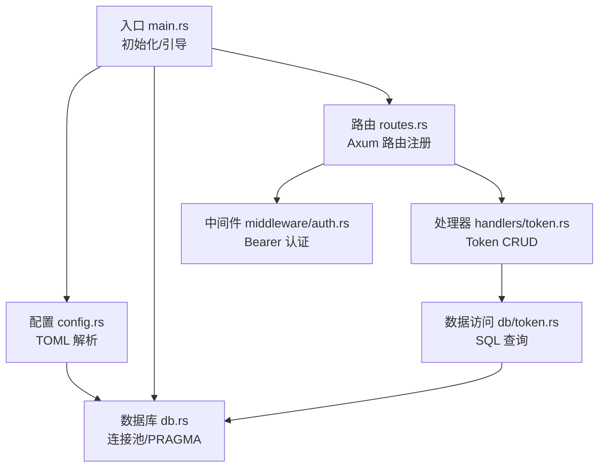
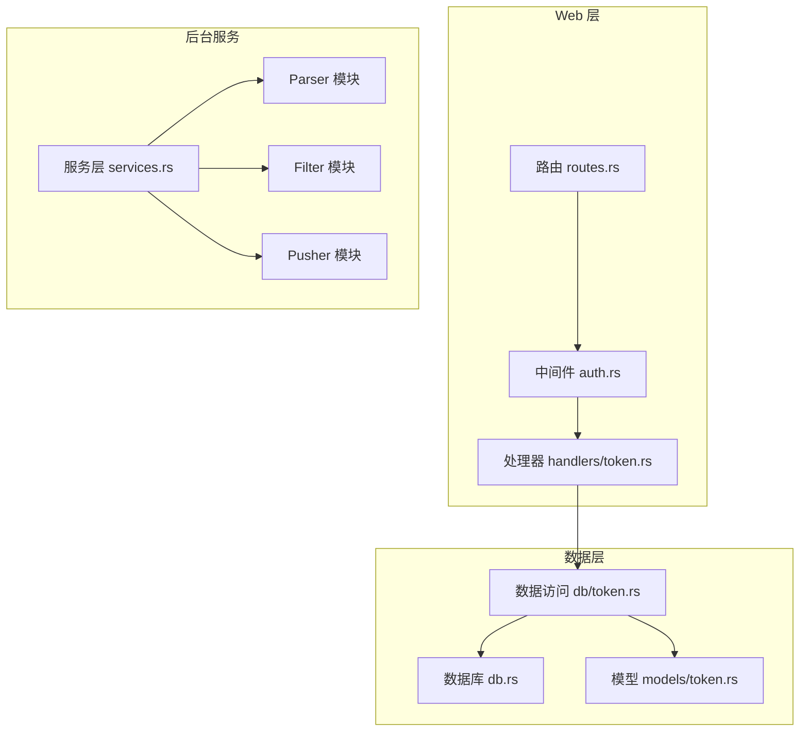
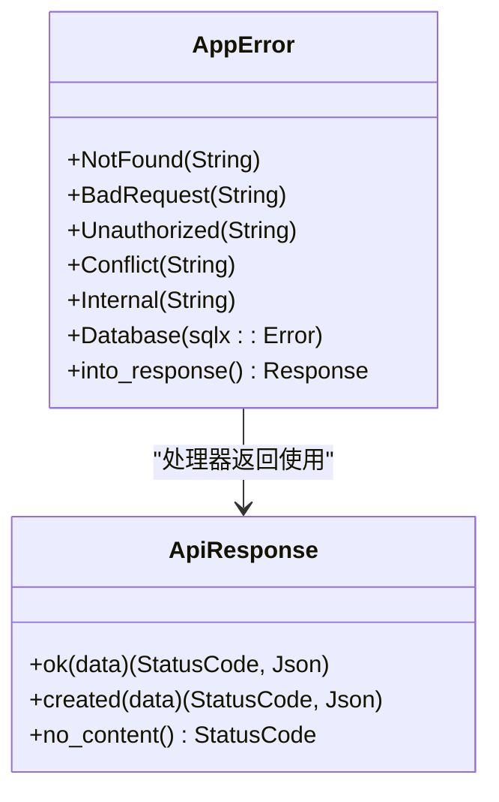
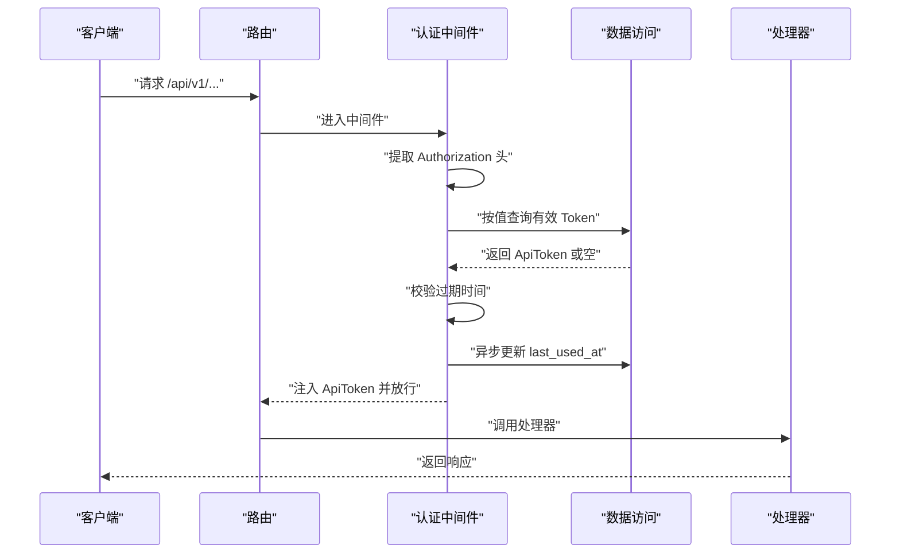
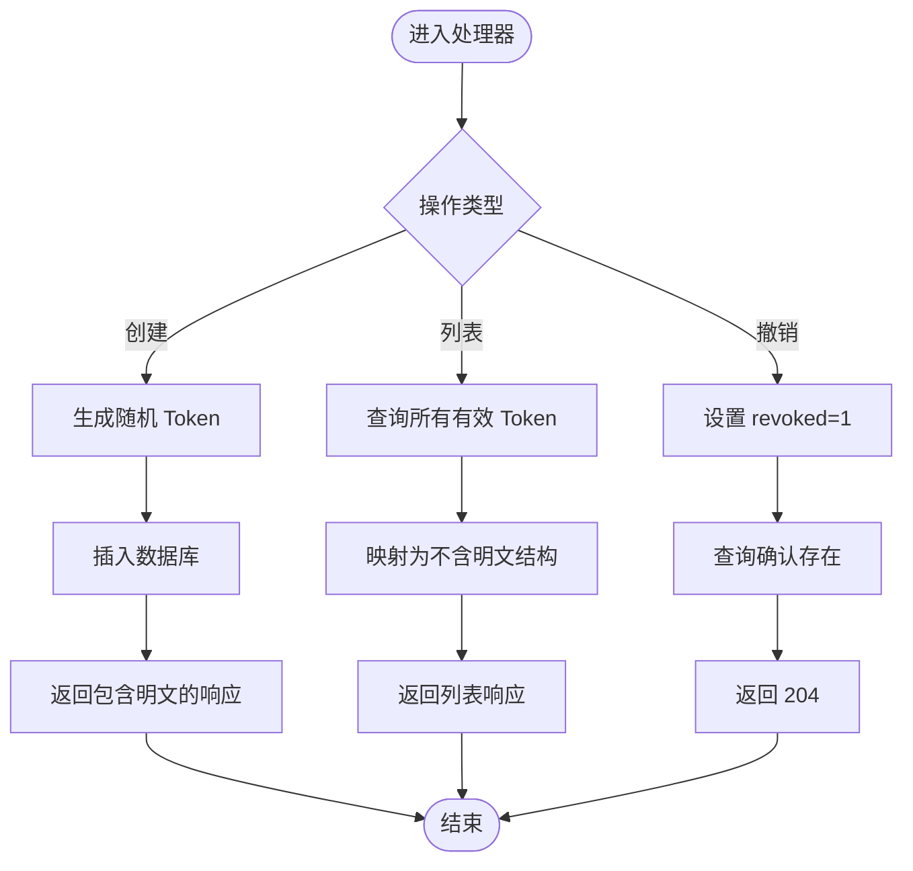
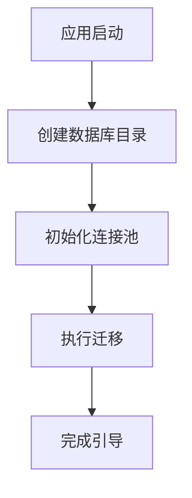
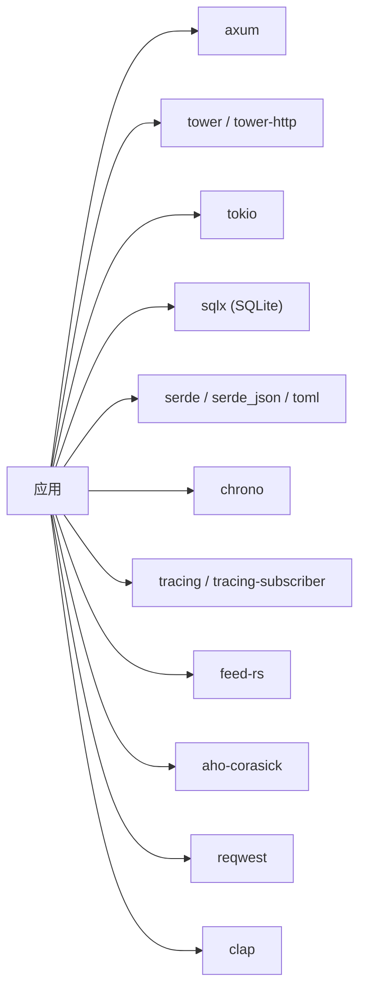

# 编码规范

<cite>
**本文引用的文件**
- [README.md](file://README.md)
- [Cargo.toml](file://Cargo.toml)
- [openspec/config.yaml](file://openspec/config.yaml)
- [src/main.rs](file://src/main.rs)
- [src/db.rs](file://src/db.rs)
- [src/error.rs](file://src/error.rs)
- [src/config.rs](file://src/config.rs)
- [src/routes.rs](file://src/routes.rs)
- [src/middleware.rs](file://src/middleware.rs)
- [src/middleware/auth.rs](file://src/middleware/auth.rs)
- [src/models.rs](file://src/models.rs)
- [src/models/token.rs](file://src/models/token.rs)
- [src/handlers.rs](file://src/handlers.rs)
- [src/handlers/token.rs](file://src/handlers/token.rs)
- [src/db/token.rs](file://src/db/token.rs)
- [src/services.rs](file://src/services.rs)
</cite>

## 目录
1. [引言](#引言)
2. [项目结构](#项目结构)
3. [核心组件](#核心组件)
4. [架构总览](#架构总览)
5. [详细组件分析](#详细组件分析)
6. [依赖分析](#依赖分析)
7. [性能考虑](#性能考虑)
8. [故障排查指南](#故障排查指南)
9. [结论](#结论)
10. [附录](#附录)

## 引言
本编码规范面向 AI-Trend-Tool 项目，覆盖 Rust 代码风格、模块组织、OpenSpec 规范、注释与错误处理、日志记录、接口与数据结构、安全与并发实践，以及代码审查与质量保证标准。目标是统一开发行为、提升可维护性与安全性，并确保与现有实现保持一致。

## 项目结构
项目采用分层与功能域结合的组织方式：
- 应用入口与生命周期：入口点负责初始化日志、加载配置、建立数据库连接池、执行迁移、引导初始 Token，并启动 HTTP 服务器。
- 配置层：集中解析 TOML 配置为结构化类型，便于跨模块使用。
- 路由与中间件：Axum 路由注册，统一认证中间件保护受保护路由。
- 处理器层：各资源的 API 处理函数，负责请求解析、调用业务与数据访问层、返回统一响应。
- 数据访问层：按领域模型拆分，每个领域一个模块，封装 SQL 查询与事务。
- 模型层：领域对象与序列化结构，区分持久化实体与对外响应结构。
- 服务层：后台任务（Parser/Filter/Pusher）预留模块，当前处于开发计划中。
- OpenSpec：以规格驱动的工作流，规范文档结构、变更与版本控制流程。

图表来源
- [src/main.rs:63-96](file://src/main.rs#L63-L96)
- [src/config.rs:52-59](file://src/config.rs#L52-L59)
- [src/db.rs:11-26](file://src/db.rs#L11-L26)
- [src/routes.rs:14-50](file://src/routes.rs#L14-L50)
- [src/middleware/auth.rs:18-60](file://src/middleware/auth.rs#L18-L60)
- [src/handlers/token.rs:18-66](file://src/handlers/token.rs#L18-L66)
- [src/db/token.rs:6-107](file://src/db/token.rs#L6-L107)

章节来源
- [README.md:216-257](file://README.md#L216-L257)
- [src/main.rs:1-96](file://src/main.rs#L1-L96)
- [src/config.rs:1-59](file://src/config.rs#L1-L59)
- [src/db.rs:1-26](file://src/db.rs#L1-L26)
- [src/routes.rs:1-61](file://src/routes.rs#L1-L61)
- [src/middleware.rs:1-3](file://src/middleware.rs#L1-L3)
- [src/middleware/auth.rs:1-60](file://src/middleware/auth.rs#L1-L60)
- [src/handlers.rs:1-6](file://src/handlers.rs#L1-L6)
- [src/handlers/token.rs:1-66](file://src/handlers/token.rs#L1-L66)
- [src/db/token.rs:1-107](file://src/db/token.rs#L1-L107)
- [src/models.rs:1-8](file://src/models.rs#L1-L8)
- [src/models/token.rs:1-46](file://src/models/token.rs#L1-L46)
- [src/services.rs:1-6](file://src/services.rs#L1-L6)

## 核心组件
- 应用入口与引导
  - 初始化日志、解析配置、创建数据库目录、建立连接池、执行迁移、确保初始 Token 存在、构建路由并启动服务。
- 配置系统
  - 使用结构体承载各子系统配置，支持从 TOML 文件加载，字段覆盖服务器、数据库、认证、采集、过滤、推送等。
- 错误与响应
  - 统一错误枚举映射 HTTP 状态码与错误码；数据库错误自动转换；提供统一成功响应包装。
- 路由与中间件
  - 通过中间件注入认证上下文，保护受保护路由；健康检查无需认证。
- 处理器与数据访问
  - Token 管理 API 的创建、列表、撤销；数据访问层对每个实体提供查询、插入、更新、软删除等方法。
- 日志
  - 使用 tracing 记录信息与警告，环境过滤级别在入口初始化。

章节来源
- [src/main.rs:26-61](file://src/main.rs#L26-L61)
- [src/config.rs:4-59](file://src/config.rs#L4-L59)
- [src/error.rs:8-79](file://src/error.rs#L8-L79)
- [src/routes.rs:14-50](file://src/routes.rs#L14-L50)
- [src/middleware/auth.rs:18-60](file://src/middleware/auth.rs#L18-L60)
- [src/handlers/token.rs:18-66](file://src/handlers/token.rs#L18-L66)
- [src/db/token.rs:6-107](file://src/db/token.rs#L6-L107)

## 架构总览
系统采用“管道模式”的后台任务与 Axum Web 服务并存：
- Parser：周期性抓取 RSS，去重入库。
- Filter：关键词匹配与统计突发检测，生成热点事件与推送记录。
- Pusher：轮询待推送记录，指数退避重试，乐观锁防重复。
- API 层：Axum 路由 + 中间件 + 处理器 + 数据访问层。

图表来源
- [src/routes.rs:14-50](file://src/routes.rs#L14-L50)
- [src/middleware/auth.rs:18-60](file://src/middleware/auth.rs#L18-L60)
- [src/handlers/token.rs:18-66](file://src/handlers/token.rs#L18-L66)
- [src/db.rs:11-26](file://src/db.rs#L11-L26)
- [src/db/token.rs:6-107](file://src/db/token.rs#L6-L107)
- [src/models/token.rs:5-46](file://src/models/token.rs#L5-L46)
- [src/services.rs:1-6](file://src/services.rs#L1-L6)

## 详细组件分析

### 组件一：统一错误与响应
- 错误类型映射 HTTP 状态码与错误码，数据库错误统一转为内部错误并记录日志。
- 成功响应统一封装为包含 data 字段的对象，便于前端处理。
- 处理器返回类型使用 IntoResponse，确保一致性。

图表来源
- [src/error.rs:8-79](file://src/error.rs#L8-L79)

章节来源
- [src/error.rs:8-79](file://src/error.rs#L8-L79)

### 组件二：认证中间件
- 提取 Authorization 头，校验 Bearer 格式。
- 数据库校验 Token 是否存在且未撤销。
- 校验过期时间。
- 异步更新 last_used_at（fire-and-forget）。
- 将 ApiToken 注入请求扩展供下游使用。

图表来源
- [src/middleware/auth.rs:18-60](file://src/middleware/auth.rs#L18-L60)
- [src/db/token.rs:40-59](file://src/db/token.rs#L40-L59)

章节来源
- [src/middleware/auth.rs:18-60](file://src/middleware/auth.rs#L18-L60)
- [src/db/token.rs:40-59](file://src/db/token.rs#L40-L59)

### 组件三：Token 管理 API
- 创建 Token：生成 64 字节随机十六进制字符串，插入数据库，返回包含明文 Token 的响应（仅创建时可见）。
- 列表 Token：返回不包含明文的结构。
- 撤销 Token：软删除（设置 revoked 标记），返回 204。

图表来源
- [src/handlers/token.rs:18-66](file://src/handlers/token.rs#L18-L66)
- [src/db/token.rs:6-107](file://src/db/token.rs#L6-L107)

章节来源
- [src/handlers/token.rs:18-66](file://src/handlers/token.rs#L18-L66)
- [src/db/token.rs:6-107](file://src/db/token.rs#L6-L107)
- [src/models/token.rs:5-46](file://src/models/token.rs#L5-L46)

### 组件四：数据库连接与初始化
- 连接池初始化：设置最大连接数，使用只读写连接模式。
- PRAGMA 设置：启用 WAL 模式与外键约束。
- 迁移：启动时执行迁移脚本。

图表来源
- [src/main.rs:70-84](file://src/main.rs#L70-L84)
- [src/db.rs:11-26](file://src/db.rs#L11-L26)

章节来源
- [src/main.rs:70-84](file://src/main.rs#L70-L84)
- [src/db.rs:11-26](file://src/db.rs#L11-L26)

### 组件五：配置解析
- 使用 serde 反序列化 TOML，结构清晰，字段覆盖服务器、数据库、认证、采集、过滤、推送等。
- 支持可选字段（如初始 Token），便于灵活部署。

章节来源
- [src/config.rs:4-59](file://src/config.rs#L4-L59)
- [Cargo.toml:1-44](file://Cargo.toml#L1-L44)

## 依赖分析
- Web 框架与工具：Axum、Tower、Tokio、Clap。
- 数据库：sqlx（SQLite，含迁移与时间类型支持）。
- 序列化：serde、serde_json、toml。
- 时间与时区：chrono。
- 日志：tracing、tracing-subscriber。
- 其他：feed-rs（RSS）、aho-corasick（多模式匹配）、reqwest（HTTP 客户端）。

图表来源
- [Cargo.toml:6-44](file://Cargo.toml#L6-L44)

章节来源
- [Cargo.toml:6-44](file://Cargo.toml#L6-L44)

## 性能考虑
- 数据库连接池：限制最大连接数，避免过度占用资源。
- 异步更新：认证后更新 last_used_at 使用 fire-and-forget，降低请求延迟。
- 指数退避：推送模块采用指数退避与乐观锁，减少并发重复与抖动。
- 日志级别：生产环境建议使用 info 级别，避免过多 debug 输出影响性能。

## 故障排查指南
- 认证失败
  - 检查 Authorization 头是否为 Bearer 格式。
  - 确认 Token 未撤销且未过期。
  - 核对数据库中是否存在该 Token。
- 数据库错误
  - 查看统一错误响应中的 DATABASE_ERROR，关注日志中的错误堆栈。
  - 确认迁移已执行且 WAL/外键设置正确。
- Token 管理
  - 创建 Token 后仅一次返回明文，务必保存。
  - 撤销后应立即失效，确认查询结果与状态。

章节来源
- [src/middleware/auth.rs:23-46](file://src/middleware/auth.rs#L23-L46)
- [src/error.rs:31-38](file://src/error.rs#L31-L38)
- [src/db/token.rs:40-48](file://src/db/token.rs#L40-L48)
- [src/handlers/token.rs:53-65](file://src/handlers/token.rs#L53-L65)

## 结论
本规范总结了项目现有的实现约定与最佳实践，涵盖错误处理、认证中间件、统一响应、数据库初始化、配置解析与日志记录。后续在实现 Parser/Filter/Pusher 与 CRUD API 时，应严格遵循本规范，确保一致性与可维护性。

## 附录

### Rust 代码风格与模块组织
- 命名约定
  - 模块与文件：小写下划线（如 db/token.rs）。
  - 类型与结构体：帕斯卡命名（如 ApiToken）。
  - 变量与函数：蛇形命名（如 update_token_last_used）。
- 模块组织
  - 按功能域划分：src/db、src/models、src/handlers、src/middleware、src/services。
  - 路由与中间件：routes.rs、middleware/auth.rs。
  - 入口与引导：src/main.rs。
- 代码格式化
  - 使用 rustfmt 默认风格。
  - 使用 clippy 作为静态检查工具，遵循 clippy 建议。
- 注释与文档
  - 公共 API 与复杂逻辑添加文档注释。
  - TODO/NOTE 使用短语标注，明确责任人与截止日期。
- 错误处理
  - 使用统一错误类型与 IntoResponse。
  - 数据库错误统一转换为内部错误并记录日志。
- 日志记录
  - 使用 tracing::info!/warn!/error!，生产环境通过环境变量设置过滤级别。
- 安全编程
  - 认证中间件严格校验 Token、撤销与过期。
  - 处理器返回列表时隐藏敏感字段（如 Token 明文）。
- 并发与异步
  - 使用 Tokio 运行时，异步更新 last_used_at 采用 fire-and-forget。
  - 数据库操作使用连接池，避免阻塞。
- 代码审查检查清单
  - 是否遵循命名与模块组织约定？
  - 是否使用统一错误与响应？
  - 是否有必要的日志记录？
  - 是否处理了边界条件与错误场景？
  - 是否通过 clippy 检查？
  - 是否补充了文档注释？

章节来源
- [src/error.rs:23-50](file://src/error.rs#L23-L50)
- [src/middleware/auth.rs:48-53](file://src/middleware/auth.rs#L48-L53)
- [src/handlers/token.rs:18-30](file://src/handlers/token.rs#L18-L30)
- [src/models/token.rs:16-38](file://src/models/token.rs#L16-L38)
- [src/main.rs:65](file://src/main.rs#L65)

### OpenSpec 文档编写规范
- 规格文档结构
  - 每个变更包含：提案（proposal）、设计（design）、任务分解（tasks）、变更归档（changes/archive）。
  - 主规格（specs/）用于沉淀当前共识。
- 变更管理与版本控制
  - 使用 openspec 工作流，每次变更在 changes/archive 下创建独立目录，包含 .openspec.yaml、设计、提案、任务与问题反馈。
  - config.yaml 支持为特定工件添加规则（如字数限制、必须章节）。
- 版本控制流程
  - 在变更目录内进行迭代，完成后合并至主规格并更新 .openspec.yaml。
  - 通过 CI/评审确保变更符合项目技术栈与风格指南。

章节来源
- [openspec/config.yaml:1-21](file://openspec/config.yaml#L1-L21)
- [README.md:254-257](file://README.md#L254-L257)