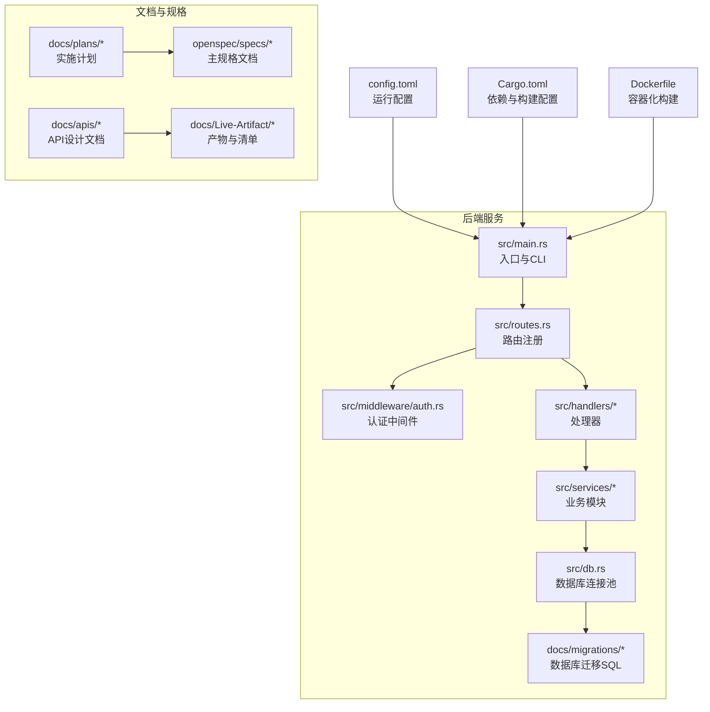
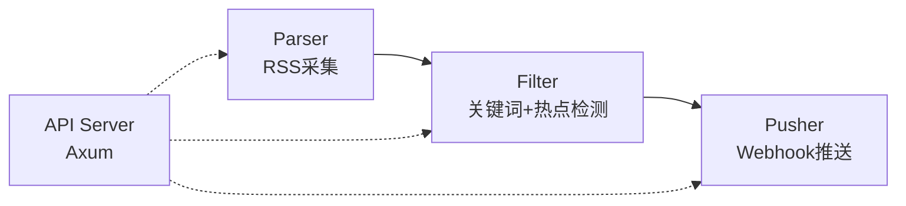
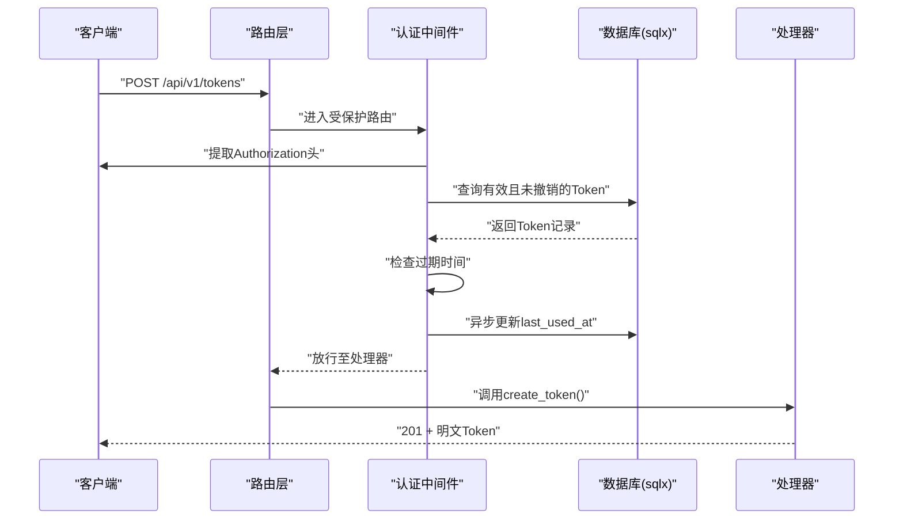
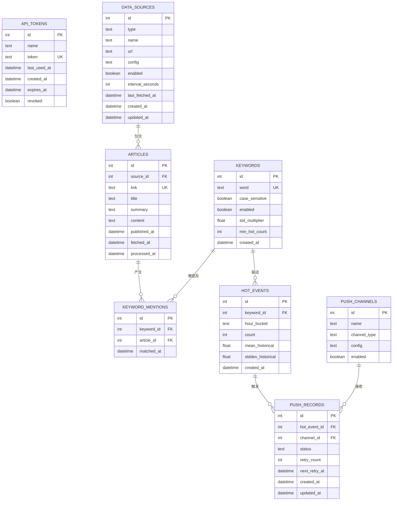
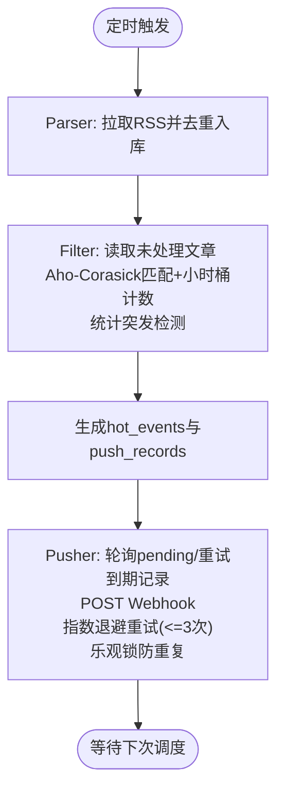
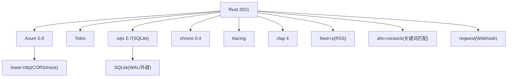

# 贡献指南

<cite>
**本文引用的文件**
- [README.md](file://README.md)
- [CLAUDE.md](file://CLAUDE.md)
- [Cargo.toml](file://Cargo.toml)
- [Dockerfile](file://Dockerfile)
- [docs/plans/01-backend-project-setup.md](file://docs/plans/01-backend-project-setup.md)
- [docs/plans/02-database-migrations.md](file://docs/plans/02-database-migrations.md)
- [docs/plans/03-auth-and-token-api.md](file://docs/plans/03-auth-and-token-api.md)
- [docs/apis/token-api.md](file://docs/apis/token-api.md)
- [.gitignore](file://.gitignore)
</cite>

## 目录
1. [简介](#简介)
2. [项目结构](#项目结构)
3. [核心组件](#核心组件)
4. [架构总览](#架构总览)
5. [详细组件分析](#详细组件分析)
6. [依赖关系分析](#依赖关系分析)
7. [性能考量](#性能考量)
8. [故障排查指南](#故障排查指南)
9. [结论](#结论)
10. [附录](#附录)

## 简介
本指南面向希望参与 AI 趋势监控系统（TrendAITool）开发的贡献者，覆盖从 Fork 项目、创建分支、提交代码到发起 Pull Request 的完整流程；明确代码贡献规范（包括 commit 消息格式、代码审查流程与合并策略）；提供开发环境搭建步骤（Rust 工具链、依赖安装、IDE 配置）；说明问题报告与功能请求的模板与流程；给出社区行为准则与沟通渠道；以及文档贡献的方式与标准。

## 项目结构
项目采用模块化组织，核心分为后端服务与配套文档/规格两大块：
- 后端服务：Rust 语言，Axum 框架，SQLite 数据库存储，支持多模块后台任务（Parser/Filter/Pusher）。
- 文档与规格：OpenSpec 驱动的规格文档与实施计划，配合 API 设计文档与数据库迁移文件。

图表来源
- [README.md:216-257](file://README.md#L216-L257)
- [docs/plans/01-backend-project-setup.md:59-81](file://docs/plans/01-backend-project-setup.md#L59-L81)

章节来源
- [README.md:216-257](file://README.md#L216-L257)
- [docs/plans/01-backend-project-setup.md:59-81](file://docs/plans/01-backend-project-setup.md#L59-L81)

## 核心组件
- 后端骨架与统一错误处理：提供 Axum 服务器骨架、配置解析、统一错误响应与成功响应封装。
- 认证与 Token 管理：基于 Bearer Token 的认证中间件与 Token CRUD API。
- 数据库与模型：SQLite 迁移与模型定义，确保数据一致性与类型安全。
- 后台模块：Parser（RSS 采集）、Filter（关键词匹配与热点检测）、Pusher（Webhook 推送）。

章节来源
- [docs/plans/01-backend-project-setup.md:17-50](file://docs/plans/01-backend-project-setup.md#L17-L50)
- [docs/plans/03-auth-and-token-api.md:17-106](file://docs/plans/03-auth-and-token-api.md#L17-L106)
- [docs/plans/02-database-migrations.md:16-145](file://docs/plans/02-database-migrations.md#L16-L145)

## 架构总览
系统采用“管道模式”，三类后台模块独立运行，既可组合也可单独启动，满足不同部署场景与资源限制。

图表来源
- [README.md:7-23](file://README.md#L7-L23)

章节来源
- [README.md:7-23](file://README.md#L7-L23)

## 详细组件分析

### 认证中间件与 Token API
- 认证中间件负责从 Authorization 头提取 Bearer Token，查询数据库校验有效性与过期状态，并异步更新最近使用时间。
- Token API 提供创建、列表与吊销接口，返回明文 Token 仅在创建时可见，后续列表响应隐藏密钥字段。

图表来源
- [docs/plans/03-auth-and-token-api.md:17-82](file://docs/plans/03-auth-and-token-api.md#L17-L82)
- [docs/plans/03-auth-and-token-api.md:211-273](file://docs/plans/03-auth-and-token-api.md#L211-L273)

章节来源
- [docs/plans/03-auth-and-token-api.md:17-106](file://docs/plans/03-auth-and-token-api.md#L17-L106)
- [docs/plans/03-auth-and-token-api.md:211-346](file://docs/plans/03-auth-and-token-api.md#L211-L346)

### 数据库迁移与模型
- 使用 sqlx 管理迁移，包含 api_tokens、data_sources、articles、keywords、keyword_mentions、hot_events、push_channels、push_records 等表。
- 模型结构体与 SQL 字段保持一致，便于类型安全的数据访问。

图表来源
- [docs/plans/02-database-migrations.md:25-145](file://docs/plans/02-database-migrations.md#L25-L145)

章节来源
- [docs/plans/02-database-migrations.md:16-145](file://docs/plans/02-database-migrations.md#L16-L145)

### 后台模块（Parser/Filter/Pusher）
- Parser：按配置周期拉取 RSS，去重写入 articles 表。
- Filter：每 5 分钟运行，Aho-Corasick 匹配关键词，小时桶计数，统计突发检测，生成 hot_events 与 push_records。
- Pusher：每 10 秒轮询 pending/重试到期的 push_records，POST Webhook，指数退避重试最多 3 次，乐观锁防重复。

图表来源
- [README.md:17-23](file://README.md#L17-L23)
- [README.md:273-289](file://README.md#L273-L289)

章节来源
- [README.md:17-23](file://README.md#L17-L23)
- [README.md:273-289](file://README.md#L273-L289)

## 依赖关系分析
- 语言与框架：Rust 2021、Axum 0.8、Tokio、sqlx 0.7、chrono、tracing、clap 等。
- 数据库：SQLite（WAL 模式 + 外键约束），迁移由 sqlx 管理。
- 算法与网络：feed-rs（RSS 解析）、Aho-Corasick（多模式匹配）、reqwest（Webhook 推送）。
- 构建与打包：Cargo.toml 定义依赖与 profile；Dockerfile 提供多阶段构建与最小运行时镜像。

图表来源
- [Cargo.toml:6-46](file://Cargo.toml#L6-L46)
- [README.md:25-36](file://README.md#L25-L36)

章节来源
- [Cargo.toml:6-46](file://Cargo.toml#L6-L46)
- [README.md:25-36](file://README.md#L25-L36)

## 性能考量
- 发布构建优化：启用 LTO、单代码生成单元、剥离符号、panic abort、禁用溢出检查以获得更小二进制体积与更高性能。
- 调度与并发：Parser 的最大并发抓取数、Filter 的批处理大小与历史窗口、Pusher 的轮询间隔与重试退避参数均可在配置中调整。
- 数据库：WAL 模式提升并发读写性能，索引覆盖常用查询字段（如 articles.processed_at、hot_events.hour_bucket 等）。

章节来源
- [Cargo.toml:48-56](file://Cargo.toml#L48-L56)
- [docs/plans/01-backend-project-setup.md:154-164](file://docs/plans/01-backend-project-setup.md#L154-L164)
- [docs/plans/02-database-migrations.md:72-145](file://docs/plans/02-database-migrations.md#L72-L145)

## 故障排查指南
- 健康检查：访问 /health 返回 “ok” 表示服务正常。
- 统一错误响应：所有错误遵循统一格式，包含错误码与消息；常见错误码包括 UNAUTHORIZED、NOT_FOUND、DATABASE_ERROR 等。
- 初始 Token：首次启动若 api_tokens 表为空，系统会根据配置或自动生成初始管理员 Token，并在日志中提示保存。
- 数据库迁移：确保 docs/migrations 下的迁移文件存在且可被 sqlx 识别；启动时自动执行迁移。

章节来源
- [README.md:166-194](file://README.md#L166-L194)
- [docs/plans/03-auth-and-token-api.md:154-207](file://docs/plans/03-auth-and-token-api.md#L154-L207)
- [docs/plans/02-database-migrations.md:16-25](file://docs/plans/02-database-migrations.md#L16-L25)

## 结论
本指南提供了从开发环境搭建到代码贡献、问题反馈与文档协作的完整路径。建议贡献者在提交前先阅读相关模块的设计文档与 API 规格，确保改动与整体架构一致，并遵循统一的错误处理与响应格式。

## 附录

### 1. 开发环境搭建
- 前置要求
  - Rust 工具链（版本 1.75+）
  - SQLite 3
- 安装与运行
  - 克隆仓库、构建与运行：参考快速开始章节中的命令。
  - 首次启动自动执行数据库迁移，创建所有表结构。
- IDE 配置
  - 推荐使用支持 Rust 的 IDE（如 VS Code + rust-analyzer），启用 clippy 与 rustfmt。
  - 项目采用现代模块组织风格（无 mod.rs），请确保 IDE 正确识别 src 下的模块入口文件。

章节来源
- [README.md:38-72](file://README.md#L38-L72)
- [docs/plans/01-backend-project-setup.md:17-34](file://docs/plans/01-backend-project-setup.md#L17-L34)

### 2. Fork 与分支策略
- Fork 项目到个人仓库后，在本地创建功能分支进行开发。
- 分支命名建议采用“类型/主题”的形式，例如 feature/add-api-docs、fix/auth-flow-bug。
- 保持分支与上游主干同步，必要时 rebase 以减少合并冲突。

### 3. 提交与 PR 流程
- 提交前
  - 运行 cargo check、cargo test（如已有测试）与 clippy，确保通过。
  - 更新相关文档与 API 设计文档，确保一致性。
- 提交信息格式
  - 类型: 简短描述（不超过 50 字）
  - 详细说明（可选，解释动机与影响）
  - 关联 Issue（可选）
- 发起 PR
  - 选择合适的 base 分支（通常为 main/master）。
  - 在 PR 描述中简述改动内容、影响范围与测试情况。
  - 等待代码审查与 CI 通过后再合并。

### 4. 代码贡献规范
- SQL 组织：所有 SQL 查询必须位于 src/db/<module>.rs，禁止在 handlers/middleware/services/routes.rs 中直接出现 sqlx::query*。
- HTTP 方法：仅使用 GET 与 POST；语义通过 URL 路径表达（创建/读取/列表使用 POST /resource；更新使用 POST /resource/update/{id}；删除/撤销使用 POST /resource/delete/{id}）。
- 中间件模式：使用 from_fn_with_state 注册认证中间件，确保中间件可访问 AppState。
- API 文档：新增/修改/删除端点时，必须同步更新 docs/apis/*.md，确保 URL、方法、参数、请求/响应模式与示例一致。

章节来源
- [CLAUDE.md:60-84](file://CLAUDE.md#L60-L84)

### 5. 问题报告与功能请求
- 问题报告模板
  - 标题：简洁描述问题
  - 环境：操作系统、Rust 版本、数据库版本
  - 复现步骤：最小可复现步骤
  - 期望行为：预期结果
  - 实际行为：实际结果
  - 日志与截图：附上相关日志片段与截图
- 功能请求模板
  - 背景：为什么需要该功能
  - 需求：具体需求描述
  - 影响面：可能涉及的模块与 API
  - 优先级：P0/P1/P2
  - 附件：相关设计草图或参考链接

### 6. 社区行为准则与沟通渠道
- 行为准则
  - 尊重与包容：尊重不同观点与背景，避免人身攻击。
  - 建设性反馈：提出问题时提供可行的改进建议。
  - 透明沟通：在公开渠道讨论公共议题，避免私下传播敏感信息。
- 沟通渠道
  - GitHub Issues：用于问题报告与功能请求。
  - GitHub Discussions：用于设计讨论与方案征集。
  - 邮件/即时通讯群组：如有需要可联系维护者（以项目 README 中提供的联系方式为准）。

### 7. 文档贡献方式与标准
- 文档位置
  - API 设计文档：docs/apis/*.md
  - 实施计划：docs/plans/*.md
  - 规格文档：openspec/specs/*.md 与 openspec/changes/*
- 贡献流程
  - 在相应目录下新增或修改 Markdown 文件。
  - 保持与代码实现一致，更新示例与参数说明。
  - 提交 PR 时在描述中说明文档改动的目的与影响。

章节来源
- [docs/apis/token-api.md](file://docs/apis/token-api.md)
- [docs/plans/01-backend-project-setup.md:480-492](file://docs/plans/01-backend-project-setup.md#L480-L492)