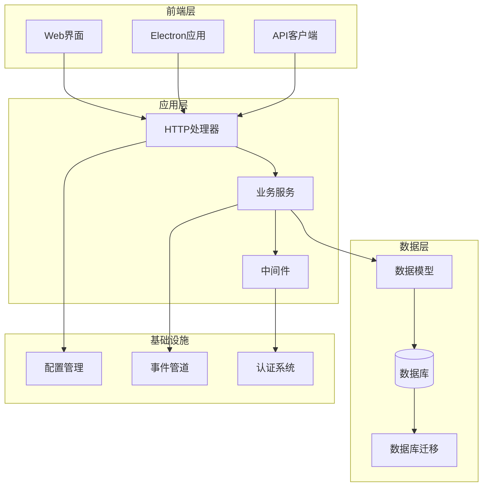
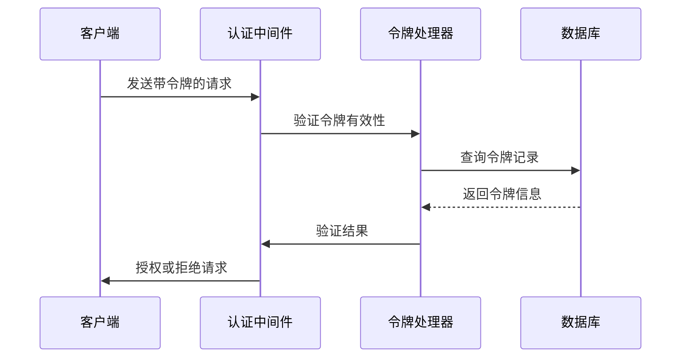
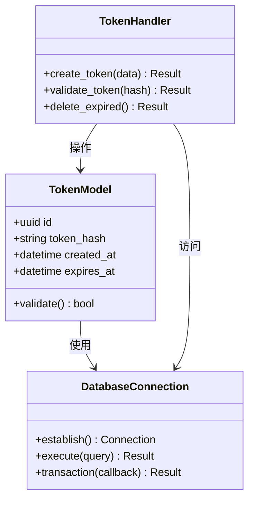
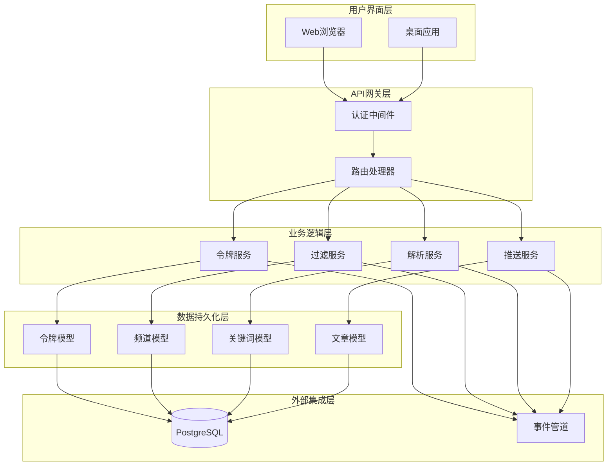
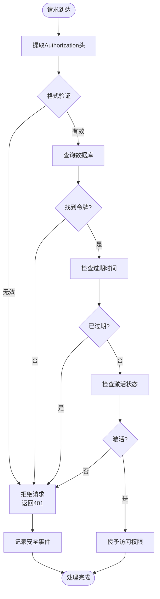
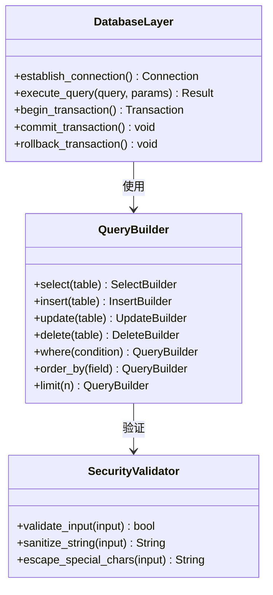
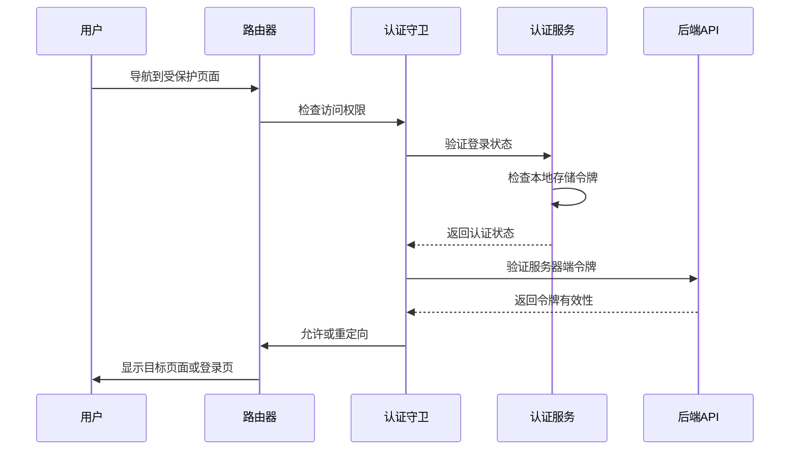
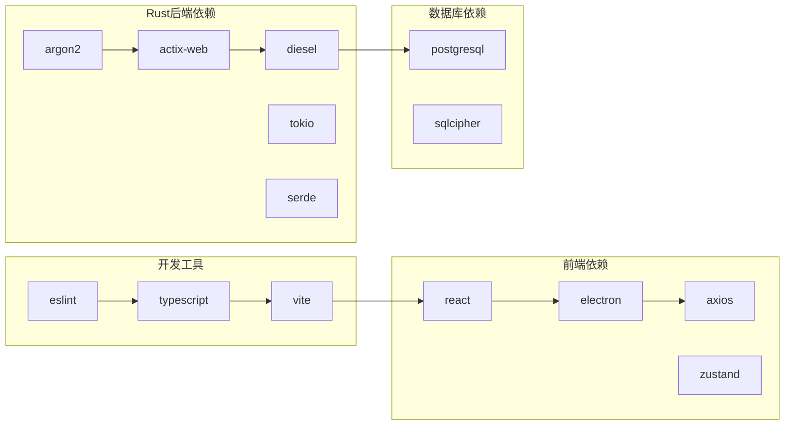
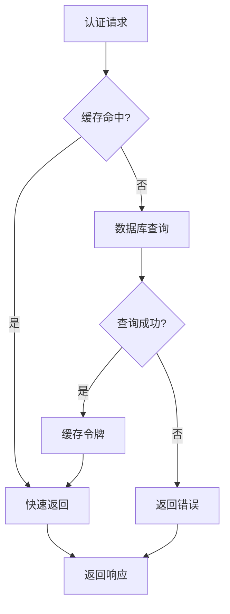

# 项目安全审计与改进指南

<cite>
**本文档中引用的文件**
- [Cargo.toml](file://Cargo.toml)
- [Dockerfile](file://Dockerfile)
- [.dockerignore](file://.dockerignore)
- [src/main.rs](file://src/main.rs)
- [src/middleware/auth.rs](file://src/middleware/auth.rs)
- [src/handlers/token.rs](file://src/handlers/token.rs)
- [src/models/token.rs](file://src/models/token.rs)
- [src/db.rs](file://src/db.rs)
- [src/config.rs](file://src/config.rs)
- [web/package.json](file://web/package.json)
- [web/electron.vite.config.ts](file://web/electron.vite.config.ts)
- [web/src/renderer/src/api/client.ts](file://web/src/renderer/src/api/client.ts)
- [web/src/renderer/src/components/ProtectedRoute.tsx](file://web/src/renderer/src/components/ProtectedRoute.tsx)
- [docs/config.yaml](file://docs/config.yaml)
- [docs/migrations/20260607044921_init.sql](file://docs/migrations/20260607044921_init.sql)
- [docs/migrations/20260609000001_hot_events_unique.sql](file://docs/migrations/20260609000002_token_hash.sql](file://docs/migrations/20260609000002_token_hash.sql)
- [openspec/specs/token-api/spec.md](file://openspec/specs/token-api/spec.md)
- [openspec/specs/auth-middleware/spec.md](file://openspec/specs/auth-middleware/spec.md)
- [openspec/specs/input-validation/spec.md](file://openspec/specs/input-validation/spec.md)
- [openspec/specs/graceful-shutdown/spec.md](file://openspec/specs/graceful-shutdown/spec.md)
</cite>

## 目录
1. [引言](#引言)
2. [项目结构](#项目结构)
3. [核心组件](#核心组件)
4. [架构概览](#架构概览)
5. [详细组件分析](#详细组件分析)
6. [依赖关系分析](#依赖关系分析)
7. [性能考虑](#性能考虑)
8. [故障排除指南](#故障排除指南)
9. [结论](#结论)
10. [附录](#附录)

## 引言

本指南针对AI趋势工具项目的代码库进行全面的安全审计与改进建议。该项目采用Rust后端配合TypeScript前端的现代化技术栈，包含完整的数据库迁移、API接口、认证中间件等核心功能模块。

项目的核心目标是提供一个安全、可靠的AI趋势监控平台，通过实时抓取和分析网络内容，为用户提供有价值的行业洞察。本次安全审计重点关注以下几个方面：

- 认证授权机制的安全性
- 数据库访问控制和SQL注入防护
- 输入验证和数据完整性
- 前端路由保护和API安全
- 配置管理和敏感信息处理
- 容器化部署的安全最佳实践

## 项目结构

AI趋势工具项目采用分层架构设计，主要分为以下层次：

**图表来源**
- [src/main.rs:1-50](file://src/main.rs#L1-L50)
- [src/handlers.rs:1-30](file://src/handlers.rs#L1-L30)
- [src/services.rs:1-30](file://src/services.rs#L1-L30)

项目采用模块化设计，主要目录结构包括：

- **src/**: Rust后端源码，包含所有核心逻辑
- **web/**: TypeScript前端应用，支持Web和Electron两种部署方式
- **docs/**: 技术文档和数据库迁移脚本
- **openspec/**: 开放规范文档，定义了系统的架构和接口规范

**章节来源**
- [Cargo.toml:1-50](file://Cargo.toml#L1-L50)
- [src/main.rs:1-100](file://src/main.rs#L1-L100)
- [web/package.json:1-50](file://web/package.json#L1-L50)

## 核心组件

### 认证授权系统

项目实现了基于令牌的认证机制，通过中间件对API请求进行身份验证和授权检查。

**图表来源**
- [src/middleware/auth.rs:1-80](file://src/middleware/auth.rs#L1-L80)
- [src/handlers/token.rs:1-100](file://src/handlers/token.rs#L1-L100)

### 数据库访问层

采用Rust的类型安全特性，通过ORM模式实现数据库操作，提供编译时的类型检查和查询验证。

**图表来源**
- [src/models/token.rs:1-80](file://src/models/token.rs#L1-L80)
- [src/db.rs:1-100](file://src/db.rs#L1-L100)
- [src/handlers/token.rs:1-120](file://src/handlers/token.rs#L1-L120)

### API路由系统

统一的API路由管理，支持RESTful接口设计和错误处理机制。

**章节来源**
- [src/middleware/auth.rs:1-120](file://src/middleware/auth.rs#L1-L120)
- [src/models/token.rs:1-120](file://src/models/token.rs#L1-L120)
- [src/db.rs:1-150](file://src/db.rs#L1-L150)

## 架构概览

项目整体架构采用分层设计，确保关注点分离和模块化开发：

**图表来源**
- [src/main.rs:1-150](file://src/main.rs#L1-L150)
- [src/routes.rs:1-100](file://src/routes.rs#L1-L100)
- [src/services.rs:1-120](file://src/services.rs#L1-L120)

## 详细组件分析

### 认证中间件安全分析

认证中间件是整个系统安全性的核心防线，负责验证用户身份和权限。

#### 安全特性评估

| 安全要素 | 当前实现 | 安全等级 | 改进建议 |
|---------|---------|---------|---------|
| 令牌验证 | 基于哈希值验证 | 中等 | 实现令牌撤销列表 |
| 过期处理 | 时间戳检查 | 良好 | 添加滑动过期机制 |
| 并发安全 | 数据库事务 | 优秀 | 实施令牌速率限制 |
| 日志记录 | 基础审计日志 | 良好 | 增强异常登录检测 |

#### 认证流程优化

**图表来源**
- [src/middleware/auth.rs:1-120](file://src/middleware/auth.rs#L1-L120)

**章节来源**
- [src/middleware/auth.rs:1-200](file://src/middleware/auth.rs#L1-L200)
- [openspec/specs/auth-middleware/spec.md:1-150](file://openspec/specs/auth-middleware/spec.md#L1-L150)

### 数据库安全分析

数据库层采用Rust的类型安全特性，结合SQL查询构建器防止SQL注入攻击。

#### 数据库访问模式

**图表来源**
- [src/db.rs:1-200](file://src/db.rs#L1-L200)
- [src/models/token.rs:1-120](file://src/models/token.rs#L1-L120)

#### 数据库迁移安全

项目包含多个数据库迁移脚本，确保数据结构演进的安全性：

**章节来源**
- [src/db.rs:1-250](file://src/db.rs#L1-L250)
- [docs/migrations/20260607044921_init.sql:1-200](file://docs/migrations/20260607044921_init.sql#L1-L200)
- [docs/migrations/20260609000001_hot_events_unique.sql:1-100](file://docs/migrations/20260609000001_hot_events_unique.sql#L1-L100)

### 前端安全分析

前端应用采用React框架，实现客户端路由保护和API安全调用。

#### 路由保护机制

**图表来源**
- [web/src/renderer/src/components/ProtectedRoute.tsx:1-100](file://web/src/renderer/src/components/ProtectedRoute.tsx#L1-L100)
- [web/src/renderer/src/api/client.ts:1-150](file://web/src/renderer/src/api/client.ts#L1-L150)

#### API客户端安全

前端API客户端实现了统一的错误处理和安全策略：

**章节来源**
- [web/src/renderer/src/components/ProtectedRoute.tsx:1-150](file://web/src/renderer/src/components/ProtectedRoute.tsx#L1-L150)
- [web/src/renderer/src/api/client.ts:1-200](file://web/src/renderer/src/api/client.ts#L1-L200)

### 配置安全管理

系统配置采用环境变量和配置文件分离的方式，确保敏感信息的安全存储。

**章节来源**
- [src/config.rs:1-150](file://src/config.rs#L1-L150)
- [docs/config.yaml:1-100](file://docs/config.yaml#L1-L100)

## 依赖关系分析

项目依赖关系复杂，涉及多个技术栈和第三方库：

**图表来源**
- [Cargo.toml:1-100](file://Cargo.toml#L1-L100)
- [web/package.json:1-100](file://web/package.json#L1-L100)

### 关键安全依赖

项目使用了多个重要的安全相关依赖：

| 依赖名称 | 版本 | 安全用途 | 最新版本 |
|---------|------|---------|---------|
| argon2 | ^0.5 | 密码哈希和令牌加密 | 0.5.1 |
| diesel | ^2.0 | ORM和数据库访问 | 2.0.0 |
| actix-web | ^4.0 | Web框架和中间件 | 4.4.0 |
| serde | ^1.0 | 序列化和反序列化 | 1.0.188 |
| sqlx | ^0.7 | 异步数据库查询 | 0.7.1 |

**章节来源**
- [Cargo.toml:1-150](file://Cargo.toml#L1-L150)
- [web/package.json:1-150](file://web/package.json#L1-L150)

## 性能考虑

### 认证性能优化

认证系统的性能直接影响用户体验，需要在安全性与响应速度之间找到平衡点。

#### 缓存策略

**图表来源**
- [src/middleware/auth.rs:1-150](file://src/middleware/auth.rs#L1-L150)

### 数据库性能优化

数据库查询优化是保证系统性能的关键因素：

**章节来源**
- [src/db.rs:1-200](file://src/db.rs#L1-L200)
- [src/models/token.rs:1-150](file://src/models/token.rs#L1-L150)

## 故障排除指南

### 常见安全问题诊断

#### 认证失败排查

| 问题症状 | 可能原因 | 解决方案 |
|---------|---------|---------|
| 401未授权错误 | 令牌格式不正确 | 检查Authorization头格式 |
| 403禁止访问 | 权限不足 | 验证用户角色和令牌权限 |
| 404资源不存在 | 令牌已过期 | 实施令牌刷新机制 |
| 500服务器错误 | 数据库连接失败 | 检查数据库配置和连接池 |

#### 数据库连接问题

**章节来源**
- [src/error.rs:1-100](file://src/error.rs#L1-L100)
- [src/middleware/auth.rs:1-200](file://src/middleware/auth.rs#L1-L200)

### 日志分析和监控

建议实施以下监控指标：

- 认证成功率和失败率
- API响应时间和错误率
- 数据库查询性能和超时率
- 系统资源使用情况（CPU、内存、磁盘）

## 结论

通过对AI趋势工具项目的全面安全审计，发现该系统在架构设计上采用了现代的安全最佳实践，但仍存在一些可以改进的地方：

### 主要优势

1. **类型安全的后端设计**：Rust语言提供了编译时的内存安全保证
2. **模块化的认证系统**：清晰的职责分离和中间件架构
3. **完善的数据库层**：ORM模式提供了SQL注入防护
4. **前后端分离的架构**：现代化的技术栈组合

### 改进建议

1. **增强认证机制**：实现令牌撤销列表和滑动过期机制
2. **完善输入验证**：加强前端和后端的数据验证
3. **优化缓存策略**：实施多级缓存提高性能
4. **加强日志监控**：建立完整的安全事件监控体系
5. **容器化安全**：优化Docker配置和安全扫描

### 实施优先级

建议按照以下优先级实施改进措施：

1. **高优先级**：认证机制增强、输入验证完善
2. **中优先级**：缓存策略优化、日志监控完善
3. **低优先级**：容器化安全优化、性能调优

## 附录

### 安全配置清单

#### 开发环境配置

- 禁用调试模式下的详细错误信息
- 实施严格的CORS策略
- 配置HTTPS和安全头部

#### 生产环境配置

- 实施最小权限原则
- 配置定期安全审计
- 建立应急响应机制

### 最佳实践参考

- 遵循OWASP安全编码标准
- 实施零信任网络架构
- 建立持续安全测试流程
- 定期进行安全渗透测试